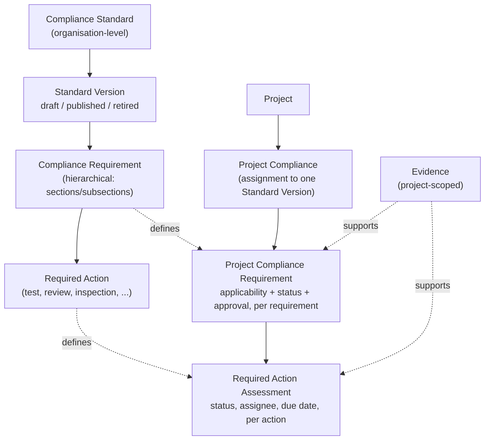
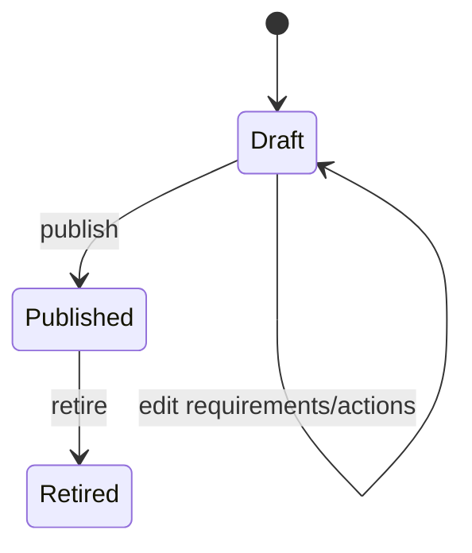
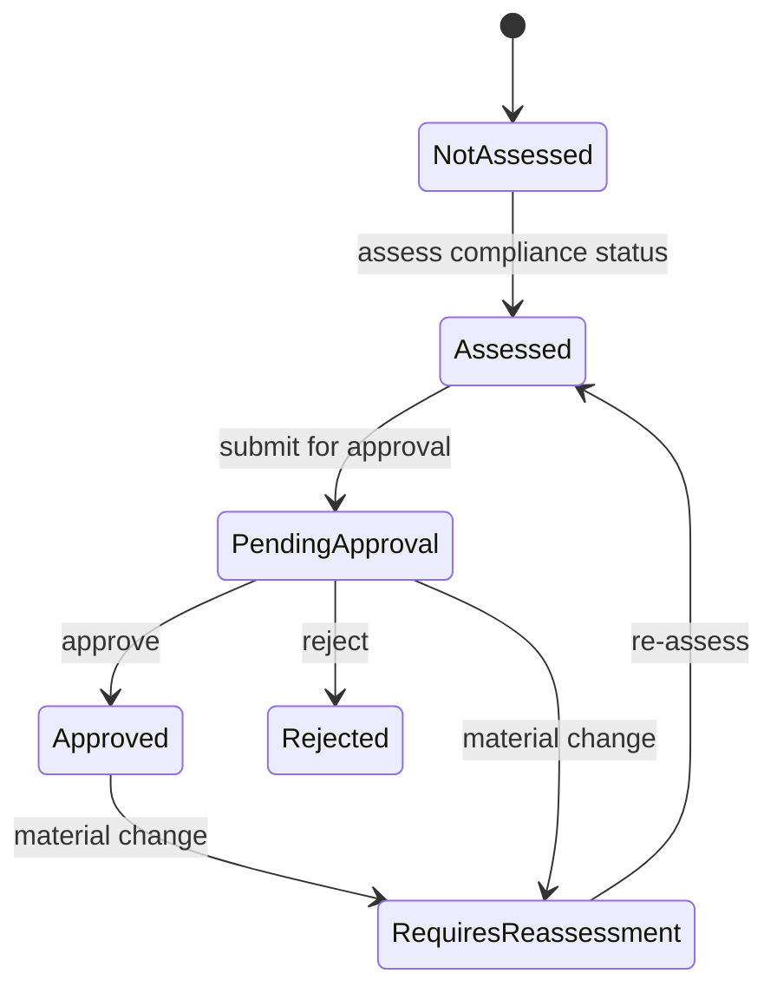

# Compliance Module

The Compliance Module lets an organisation define reusable compliance standards (e.g. an internal security standard, a regulatory obligation, or a customer-mandated framework), version them, and track each project's own compliance assessment against whichever standards it's assigned — independently of every other project. It ships as one of ReqTrackManager's built-in modules (`docs/modules.md`), enabled by default per organisation.

This document is the user/admin-facing reference for what the module does, how it's organised, and how to work with it day to day. For the module system's own architecture (how a "module" plugs into the backend/frontend/RBAC/MCP), see `docs/modules.md`. For the full, authoritative product requirements this module was built against, see `docs/Compliance_Module_Requirements.md`; where this document and that one appear to disagree, the requirements document is the source of truth. For its implementation history, see `docs/compliance-module-plan.md` and the "Compliance module plan" entries in `docs/decisions.md`.

## Enabling the module

Compliance defaults to **enabled** for every organisation. A server admin can turn it off deployment-wide (module entitlement), and an org admin can enable/disable it per organisation (module enablement) from the organisation's Modules settings — see `docs/modules.md`'s two-tier gating section for the exact mechanics. Disabling it hides its navigation and endpoints for that organisation; no data is deleted.

## Roles

Compliance defines four of its own roles, module-contributed rather than new `OrgRole`/`ProjectRole` enum values (they render through the same role-management UI as every other role):

| Role | Scope | Grants |
| --- | --- | --- |
| **Compliance Manager** | Organisation | Creates and manages compliance standards, versions, requirements, and required actions; assigns standards to projects; views compliance across every project in the organisation. |
| **Compliance Officer** | Project | Modifies a project's compliance assessments, applicability decisions, and evidence, and performs approval/sign-off for the projects they're assigned to. |
| **Standards Manager** | One specific standard | Everything a Compliance Manager can do, but scoped to just this one standard — requirements, versions, publish/retire, and this standard's own "Members" roster. |
| **Standards Contributor** | One specific standard | May edit a draft version's requirements and required actions on this one standard, and propose/discuss changes — may not publish/retire a version or manage the standard's own membership. |

Both Compliance Manager/Officer compose with the roles that already carry equivalent authority elsewhere in ReqTrackManager: a server admin or an organisation's own org admin can do everything a Compliance Manager can; a project's Project Manager can do everything a Compliance Officer can, on that project. Every other project member (or org member, for standards) has read-only access — granted automatically once the module is enabled, with no role needed just to view.

**Standards Manager/Contributor** (a standard's own dedicated working group, for organisations that maintain standards internally) are narrower still: scoped to one specific standard, not every standard in the organisation. A Compliance Manager already satisfies either check with no per-standard grant needed — the same "a higher tier already retains full access" principle applied one level down. A standard's creator is automatically granted Standards Manager on it, and **a standard must always have at least one Standards Manager** — the last one can't be removed unless the organisation has designated a fallback compliance-managers group (Compliance's own org settings, `/standards/settings/:orgId/standardsManagement`) with at least one current member, for organisations whose roles are managed via their identity provider rather than granted one person at a time. Manage this roster from a standard's own "Members" nav-rail section.

## Data model

A compliance **standard** is an organisation-level, reusable definition — never a project, and never duplicated per project. A standard has one or more **versions**; each version's own requirement tree is immutable once published, so a project that adopts version 1.1 keeps working from exactly that content even after version 2.0 is published or version 1.0 is retired. A project's **assignment** to one specific standard version is where per-project compliance state actually lives — a standard or a requirement definition never itself holds a compliance state.

Every `Project Compliance Requirement`/`Required Action Assessment` row is created automatically, in full, the moment a standard version is assigned to a project — nothing is materialised lazily, since a published version's own content can never change underneath an existing assignment.

## Standards lifecycle

A Compliance Manager authors a standard's requirement tree while its current version is in **draft** — creating, editing, reordering, and deleting requirements and required actions freely. **Publishing** a version locks its content permanently (no further edits, ever) and makes it assignable to projects; a version can later be **retired**, which only stops it being offered to *new* assignments — projects already on it keep working from it unchanged. A new version can be cloned from an existing one (carrying its requirement tree forward as a fresh draft) so an update to a standard doesn't mean starting from a blank sheet.

## Assigning a standard and assessing a project

A Compliance Manager assigns a **published** version of a standard to a project. From there, the project's Project Manager or Compliance Officer(s) work through the assessment:

- **Applicability** — each requirement is marked Applicable or Not Applicable (with a mandatory justification for Not Applicable), inherited down the requirement hierarchy: marking a parent section Not Applicable makes its children Not Applicable too, unless a child is explicitly overridden back to Applicable. Not Applicable requirements never count against the compliance percentage.
- **Compliance status** — an applicable requirement is assessed Not Started / In Progress / Compliant / Non-Compliant / Blocked / Pending Review / Rejected (a mandatory justification is required for Non-Compliant).
- **Required actions** — each requirement's required actions get their own per-project assessment (status, assignee, due date, completion), independent of the requirement's overall compliance status.
- **Evidence** — a piece of evidence (a certificate, test report, or similar) can support one or many requirements and/or required actions at once. Evidence can carry an expiry date; the module tracks Valid / Expiring Soon / Expired independently, and a revalidation records the previous and new expiry alongside who did it and why, without losing that history.
- **Approval/sign-off** — a formally distinct step from assessment: an assessed requirement is submitted for approval, then approved or rejected, with the decision and its rationale retained. A material change afterwards (the applicability decision changing, or linked evidence being archived/revalidated) automatically flags an approved or pending requirement as **Requires Re-assessment**, so a stale sign-off is never silently left looking current.

Every applicability/status/approval change is logged to the same audit trail every other ReqTrackManager mutation goes through, viewable per-requirement as its own compliance history.

## Overall status and dashboards

For each assignment, the module calculates a compliance percentage (compliant applicable requirements ÷ all applicable requirements), an overall compliance state (Compliant / Non-Compliant / In Progress / Not Applicable), and an overall approval state — kept as two separate figures, since a project can be 100% compliant while still Pending Approval. A project's own Compliance page shows this per assigned standard, with drill-downs into Non-Compliant requirements, outstanding required actions, expiring/expired evidence, and reviews due. An organisation's Compliance overview rolls the same figures up across every project, with the equivalent cross-project drill-downs and a "standards with the most outstanding issues" summary.

## Scheduled reviews and notifications

A standard itself, or a project's assignment to one, can have one or more scheduled reviews — a frequency label, an optional automatic recurrence, a next-due date, an owner, and (once completed) a retained outcome. Completing a recurring review creates the next cycle as a new row rather than reopening the old one, so review history is never overwritten. Daily background sweeps notify the relevant Compliance Officers/Managers about evidence approaching or past expiry, required actions approaching or past their due date, reviews coming due or overdue, a project's target compliance date approaching or passed, a Non-Compliant assessment, and an approval request or an invalidated approval — each notification sent at most once per underlying event, not repeated on every sweep.

## Cross-standard mapping and version migration

A Compliance Manager can record a directed, typed relationship between any two requirements — even across different standards, or across two versions of the same standard (`Equivalent`, `Satisfies`, `Derived From`, and similar relationship types are themselves an extensible, organisation-defined vocabulary). A mapping is metadata for navigation and impact analysis only; it never implies that satisfying one requirement automatically satisfies another.

When a project wants to move an assignment onto a newer published version of its standard, the two versions can first be **diffed** (added / removed / modified / replaced / re-mapped requirements) so the impact is visible before committing. Migrating is then an explicit, user-triggered action: it creates a new assignment on the new version, carries forward assessments only for requirements that are unchanged (or, with the compliance officer's own per-migration confirmation, explicitly marked equivalent via a mapping), and leaves everything else to be reassessed — the original assignment is archived, never overwritten, so its history is preserved.

## Reporting and export

**Reports.** Both a project's compliance and an organisation's cross-project compliance can be exported as a PDF or CSV report, suitable for internal review and audit preparation:

- `GET /api/v1/projects/{project_id}/modules/compliance/reports/{pdf,csv}` — one project's compliance across every standard it's assigned to: every requirement's applicability, compliance status, approval state and history, required actions, linked evidence (with validity/expiry), review history, and any cross-standard mappings touching its assigned standards. Available to anyone who can view the project's compliance (the same access as the module's read endpoints).
- `GET /api/v1/orgs/{organization_id}/modules/compliance/reports/{pdf,csv}` — a roll-up across every project in the organisation (one row per project/assigned-standard-version pair), plus appendices for non-compliant requirements, pending approvals, and expiring/expired evidence across every project. Restricted to Compliance Managers, matching the "view compliance across projects" capability elsewhere in the module.

The PDF carries the fuller, multi-section report (main table plus evidence/review/mapping appendices); the CSV carries the flat, one-row-per-requirement (or, at organisation scope, one-row-per-assignment) table — mirroring the split ReqTrackManager's own core requirement-report generator already uses. Both entry points are also available as "Download PDF/CSV report" buttons on the project's Compliance page and the organisation's Compliance dashboard.

**Export/import bundles.** Compliance content is included in ReqTrackManager's existing project/organisation export-and-import bundles (`docs/decisions.md`'s "project/organisation export" entries), at the level the data actually belongs to:

- An **organisation** bundle carries every compliance standard it owns — with its full version/requirement/required-action tree, its action-type and mapping-relationship-type vocabularies, and its cross-standard requirement mappings — since a standard is an organisation-level, reusable resource.
- A **project** bundle carries that project's own compliance *assessment*: which standards it's assigned to, its per-requirement applicability/status/approval state, its required-action assessments, its evidence (with files and revalidation history), and its own project-level review history. It does not re-embed the standard itself; on import, the assignment is resolved against a standard/version of the same reference and version label already present in the *target* organisation, and is skipped (with a warning, never silently fabricated) if no match exists there.

Both directions round-trip: exporting and re-importing a project or organisation reproduces its compliance data intact (see `backend/app/modules/compliance/tests/test_compliance_export_import.py`).

**Standard-level import/export.** A single standard can also be exported and re-imported on its own, distinct from the whole-organisation bundle above — useful for backing up or transferring just one standard, e.g. into a different organisation or deployment:

- `GET /api/v1/orgs/{organization_id}/modules/compliance/standards/{standard_id}/export` — downloads a self-contained JSON document for one standard: every version's full requirement/required-action tree, plus only the action-type/mapping-relationship-type vocabulary its own required actions and requirement mappings actually reference (not the whole organisation's vocabulary). Compliance-Manager-gated, same as every other standards-management action.
- `POST /api/v1/orgs/{organization_id}/modules/compliance/standards/import` — creates a brand-new standard from that document in the target organisation. Every version is always re-created as `DRAFT`, regardless of its original published/retired status — an imported standard must be reviewed and re-published locally before it governs any project, never silently live. If the target organisation already has a standard with the same reference, the caller chooses `"skip"` or `"import_as_copy"` (the same two choices the whole-organisation merge already offers for the identical conflict); a requirement mapping whose other side belongs to a *different* standard not present in the target organisation is dropped, with a warning, rather than fabricated.

Available from the "Compliance Standards" list page ("Import standard", grouped behind the same split-button trigger as "New standard") and a standard's own workspace ("Export").

## MCP tools

The Compliance module contributes ten read-only tools to the MCP server (`mcp-server/`) an AI assistant can call — listing standards/versions/requirements, a project's overall status, non-compliant requirements, expiring evidence, pending approvals, reviews due, requirement mappings, and a version diff. See `docs/mcp-server.md`'s "Module-contributed tools" section for the full, current list with parameters — nothing that approves, decides, or otherwise mutates compliance state is ever exposed there, by the same "approval stays human-only" design as every other approval-shaped action in this codebase.

## Known limitations

- Compliance reports/exports do not currently support the branded `ReportTemplate` styling (logo, accent colour, cover page) core requirement reports can use — they render with a fixed, unbranded layout. Not required by `docs/Compliance_Module_Requirements.md` §29, and can be added later if wanted.
- A project bundle's compliance assignment can only be restored into an organisation that already has a matching standard/version (by reference and version label) — it is never recreated from the bundle itself. Re-establish the standard first (directly, or via an organisation bundle import) if importing a project into an organisation that doesn't yet have it.
- Automated compliance rules, automatic compliance determination from required-action outcomes, compliance certificates/digital signatures, and customer-facing compliance portals are explicitly out of scope for this module today (`docs/Compliance_Module_Requirements.md` §30) — the data model is deliberately built so none of them are precluded later.
- Standards Manager/Standards Contributor grants are direct, per-person grants only — there is no way to grant either role to everyone in a group at once (the org's designated fallback compliance-managers group is a narrow floor-satisfaction mechanism only, not a general group-based grant path; see `docs/modules.md`'s "Module-contributed RBAC" section for the module-system-wide reasoning).
