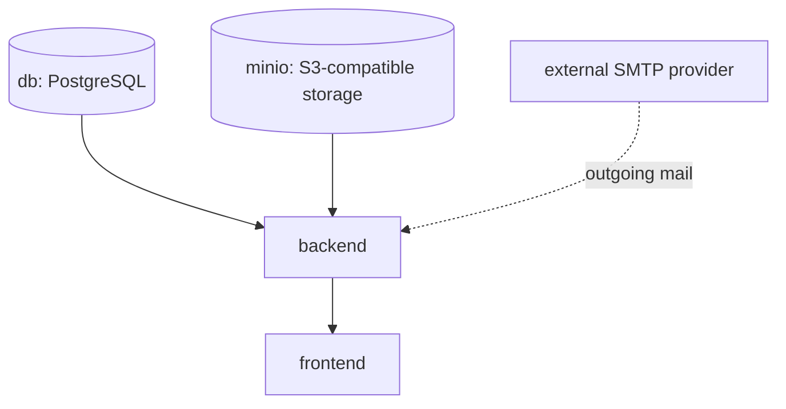

# Deployment Guide

This guide covers installing and configuring a new ReqTrackManager instance, from a local evaluation install through to a production deployment. It satisfies N-D-01 ("comprehensive documentation on how to deploy and configure a new instance"). For *why* the deployment is shaped this way, see [solution-architecture.md](solution-architecture.md) and [decisions.md](decisions.md); for using the application once it's running, see [user-guide.md](user-guide.md).

## Prerequisites

- Docker and Docker Compose v2 (`docker compose`, not the legacy `docker-compose`).
- A host with persistent volume storage for PostgreSQL (and MinIO, if using the bundled S3-compatible storage backend).
- For production: a domain name and TLS termination in front of the frontend/backend (ReqTrackManager does not terminate TLS itself — see [Production deployment](#production-deployment) below).

## Two separate Compose stacks

ReqTrackManager ships **two** Compose files with different purposes — using the wrong one for the wrong purpose is the single most important thing to get right:

- **`docker-compose.yml`** (repo root) — the **production-oriented** stack. No MailHog, no baked-in secret defaults; it refuses to start (`docker compose up` fails fast with a clear error) until you provide `JWT_SECRET`, `SERVER_ADMIN_PASSWORD`, `POSTGRES_PASSWORD`, `MINIO_ROOT_PASSWORD`, and `SMTP_HOST`. This is what a real deployment runs.
- **`tests/container/docker-compose.yml`** — the **local development and automated testing** stack. Same shape, plus MailHog, with dev-friendly defaults for everything and its own dedicated `reqtrack_test` Postgres database. This is what `backend/tests/` (pytest) and `tests/playwright/` run against.

These two are deliberately kept separate rather than sharing one file with a dev override, because sharing led to a real, serious bug during development: running the backend test suite against what was meant to be a "just add a test override" version of the same stack silently dropped and recreated the *production* database's schema (see [decisions.md](decisions.md), "Database: the test suite was wiping the live database"). Never run `pytest`, or anything from `tests/`, against the root stack.

## Components

The diagram below shows every container in the production stack and how they depend on each other at startup. Reading top to bottom: `db` and `minio` must be healthy before `backend` starts (the backend runs migrations and talks to storage immediately on boot); `backend` must be healthy before `frontend` starts (the frontend's own health check is independent, but there is no reason to serve the UI before its API is reachable); the backend sends outgoing mail to whatever `SMTP_HOST` points at, which in production is an external provider, not a container in this stack. This matters operationally because it tells you the correct order to check when something won't come up: `db`/`minio` first, then `backend`, then `frontend`.



| Service | Purpose | In root (prod) stack? | In tests/container stack? |
| --- | --- | --- | --- |
| `db` | PostgreSQL, the primary data store | Yes (no host port published) | Yes (`reqtrack_test`, port 5432 published) |
| `backend` | FastAPI application, runs migrations on startup | Yes | Yes |
| `frontend` | Static React SPA served by nginx | Yes | Yes |
| `minio` | Bundled S3-compatible file storage | Yes, if `STORAGE_BACKEND=s3` | Yes |
| `mailhog` | Local SMTP catcher with a web UI | **No** — replace with a real SMTP provider via `SMTP_HOST` | Yes |
| `prometheus`, `loki`, `tempo`, `grafana`, `alloy` | Optional observability stack (`--profile observability`) | Yes, opt-in | No |

## Local / evaluation deployment

```bash
git clone <this-repo>
cd reqtrackmanager/tests/container
docker compose up --build
```

This is sufficient for evaluating the product or for development — see the [README](../README.md#quick-start--local-development--evaluation) for the URLs it exposes. It uses dev-friendly defaults: a fixed bootstrap admin password, MailHog instead of a real mail provider, and MinIO with default credentials, all in an isolated `reqtrack_test` database. **Never point this stack at the internet, and never confuse it with the production stack below.**

## Production deployment

Production deployment uses the root `docker-compose.yml` and the same container images used for local dev; the difference is entirely in configuration, and the compose file itself enforces the important parts — `docker compose up` fails immediately with a clear error naming the missing variable if any of these aren't set, rather than starting with an insecure default. Create a `.env` file next to `docker-compose.yml` (Docker Compose loads it automatically) and set at minimum:

```bash
# Secrets — generate strong random values, do not reuse the defaults
JWT_SECRET=<random 32+ byte secret>
SERVER_ADMIN_PASSWORD=<strong password>
POSTGRES_PASSWORD=<strong password>
MINIO_ROOT_PASSWORD=<strong password>          # if using the bundled MinIO

# Networking
CORS_ORIGINS=https://your-domain.example
PUBLIC_API_BASE_URL=https://api.your-domain.example

# Outgoing email — point at a real SMTP provider instead of MailHog
SMTP_HOST=smtp.your-provider.example
SMTP_PORT=587
SMTP_USE_TLS=true
SMTP_USERNAME=<smtp username>
SMTP_PASSWORD=<smtp password>
SMTP_FROM_ADDRESS=noreply@your-domain.example

# Operational alerting
DEPLOYMENT_NOTIFICATION_EMAIL=ops@your-domain.example
```

The full list of backend environment variables, with defaults, is documented in the [README's Configuration section](../README.md#configuration).

### Hardening: scope MinIO credentials

By default `STORAGE_S3_ACCESS_KEY`/`STORAGE_S3_SECRET_KEY` are wired to `MINIO_ROOT_USER`/`MINIO_ROOT_PASSWORD` (see `docker-compose.yml`), so the backend authenticates to MinIO as its full administrator rather than a credential limited to its own bucket. That's fine to get started, but for a production deployment it's worth narrowing: a backend compromise (or a leaked environment variable) then only grants access to this app's own files, not the ability to manage every MinIO user/bucket/policy. Provision a scoped service account once, then point the backend at it instead of the root credentials:

```bash
docker compose exec minio mc alias set local http://localhost:9000 "$MINIO_ROOT_USER" "$MINIO_ROOT_PASSWORD"
docker compose exec minio mc admin user add local reqtrackmanager-app <a-different-strong-password>
docker compose exec minio mc admin policy create local reqtrackmanager-app-policy - <<'EOF'
{
  "Version": "2012-10-17",
  "Statement": [{
    "Effect": "Allow",
    "Action": ["s3:GetObject", "s3:PutObject", "s3:DeleteObject", "s3:ListBucket"],
    "Resource": ["arn:aws:s3:::reqtrackmanager", "arn:aws:s3:::reqtrackmanager/*"]
  }]
}
EOF
docker compose exec minio mc admin policy attach local reqtrackmanager-app-policy --user reqtrackmanager-app
```

Then set `STORAGE_S3_ACCESS_KEY=reqtrackmanager-app` and `STORAGE_S3_SECRET_KEY=<the password you chose above>` in your `.env`, instead of reusing `MINIO_ROOT_USER`/`MINIO_ROOT_PASSWORD` there. Keep the root credentials only for this one-time setup (and for the admin console at `:9001`).

### TLS and reverse proxy

ReqTrackManager's containers serve plain HTTP internally (frontend on 3000, backend on 8000). In production, put a reverse proxy (nginx, Caddy, Traefik, or a cloud load balancer) in front of both that terminates TLS and forwards to the two container ports. Point the reverse proxy's public hostnames at `CORS_ORIGINS` (frontend origin) and `PUBLIC_API_BASE_URL` (backend origin) so the frontend and backend agree on where each other lives.

### Storage backend

- `STORAGE_BACKEND=local` (default outside Compose) stores files on the backend container's filesystem at `STORAGE_LOCAL_DIR`. The root `docker-compose.yml` mounts this as the named volume `reqtrack_local_files` so files survive container recreation; if you run the backend outside this Compose file, mount an equivalent persistent volume yourself. The built-in disk-usage monitor (I-M-11) only runs for this backend, emailing `DEPLOYMENT_NOTIFICATION_EMAIL` when usage crosses `DISK_USAGE_WARNING_THRESHOLD_PERCENT`.
- `STORAGE_BACKEND=s3` (the Compose default) stores files in any S3-compatible bucket — the bundled MinIO, a self-hosted MinIO cluster, or real AWS S3. Set `STORAGE_S3_ENDPOINT_URL` to your provider (omit or point at AWS's endpoint for real S3), and set `STORAGE_S3_BUCKET`/`STORAGE_S3_ACCESS_KEY`/`STORAGE_S3_SECRET_KEY`/`STORAGE_S3_REGION` accordingly. This is the recommended choice for any deployment with more than one backend replica, since local disk storage doesn't get shared across replicas.

### Database

PostgreSQL is not started with automatic backups. Use the provided scripts on a schedule (cron, a systemd timer, or your orchestrator's job scheduler):

```bash
./scripts/backup.sh [output-dir]     # pg_dump (gzip'd) + local file storage (tar.gz, if STORAGE_BACKEND=local), timestamped
./scripts/restore.sh <backup-file>   # restores a .sql.gz into db, or a reqtrack-files-*.tar.gz into backend
```

`backup.sh` covers everything in one run for the common case: it always dumps the database, and additionally archives `reqtrack_local_files` when the running deployment has `STORAGE_BACKEND=local`. If you use `STORAGE_BACKEND=s3` (the Compose default, via MinIO), back up the `reqtrack_minio_data` volume with MinIO's own backup/replication tooling instead — it isn't a plain file tree this script can tar up.

Test restores periodically — a backup that has never been restored is not a verified backup.

### Migrations

The backend runs `alembic upgrade head` automatically on every startup (see [decisions.md](decisions.md) for why). Upgrading to a new ReqTrackManager version is: pull the new image, `docker compose up -d backend` — no manual migration step is required. Because of this, always take a database backup before upgrading, since the migration runs immediately and automatically on container start.

### Observability

```bash
docker compose --profile observability up -d
```

Adds Prometheus, Loki, Tempo, Grafana Alloy, and Grafana. In production, put Grafana behind the same authentication/reverse-proxy layer as the rest of the stack — the bundled Grafana config enables anonymous viewer access, which is appropriate for local development only. See the [README](../README.md#optional-observability-stack) for the exposed ports and pre-wired dashboards/scrape config.

### Scaling beyond a single backend replica

The current architecture assumes a single backend process: the WebSocket pub/sub hub, the notification digest job, and the disk-usage monitor all run in-process (see [decisions.md](decisions.md)). Running multiple backend replicas behind a load balancer works for the stateless request/response API, but those three background mechanisms would need to move to a shared broker or a dedicated worker service first — this is called out as a deliberate future step in [solution-architecture.md](solution-architecture.md), not something the current deployment model supports today.

## Troubleshooting

**Backend logs were silently empty (fixed).** `docker compose logs backend` used to never show anything beyond the startup banner — no per-request access logs, no error tracebacks. Root cause: `backend/alembic/env.py` called `logging.config.fileConfig(...)` on every app startup (migrations run automatically every boot), and `fileConfig()`'s default `disable_existing_loggers=True` disabled every logger not explicitly listed in `alembic.ini`, including uvicorn's own loggers. Fixed by passing `disable_existing_loggers=False`. If you're on a version predating this fix and logs look suspiciously empty, that's why.

**A `500` on every request, including login, with `/health` still reporting OK, was the test suite wiping the database.** `tests/conftest.py` used `os.environ.setdefault("DATABASE_URL", ...)` to point at a test database — which is a no-op if `DATABASE_URL` is already set, and it always is inside the `backend` service container (pointed at the real app database). The test suite's schema fixture drops and recreates the entire `public` schema at both the start *and end* of a test run; running `docker compose exec backend pytest` therefore left the live database with no tables at all. Fixed two ways: `tests/conftest.py` now hard-fails immediately if `DATABASE_URL` doesn't resolve to a `*_test` database, and tests run against their own isolated stack (`tests/container/`, see below) rather than by exec-ing into the application container at all. If you ever see `relation "..." does not exist` errors on a live deployment, check whether something ran a migration/test tool against the wrong `DATABASE_URL` — restarting the backend (which re-runs migrations and re-bootstraps the admin user) will restore functionality but **does not recover lost data**; restore from backup instead if this happens on a real deployment.

## Verifying a deployment

After `docker compose up -d`, confirm:

1. `curl http://localhost:8000/health` (or your production hostname) returns `{"status": "ok", "database": "ok"}`.
2. `curl http://localhost:8000/metrics` returns Prometheus-format metrics.
3. The frontend loads and you can log in with the bootstrap admin credentials you configured.
4. If using email notifications, trigger one (e.g. change your password) and confirm it arrives at your configured SMTP provider (or MailHog's UI in non-production environments).
