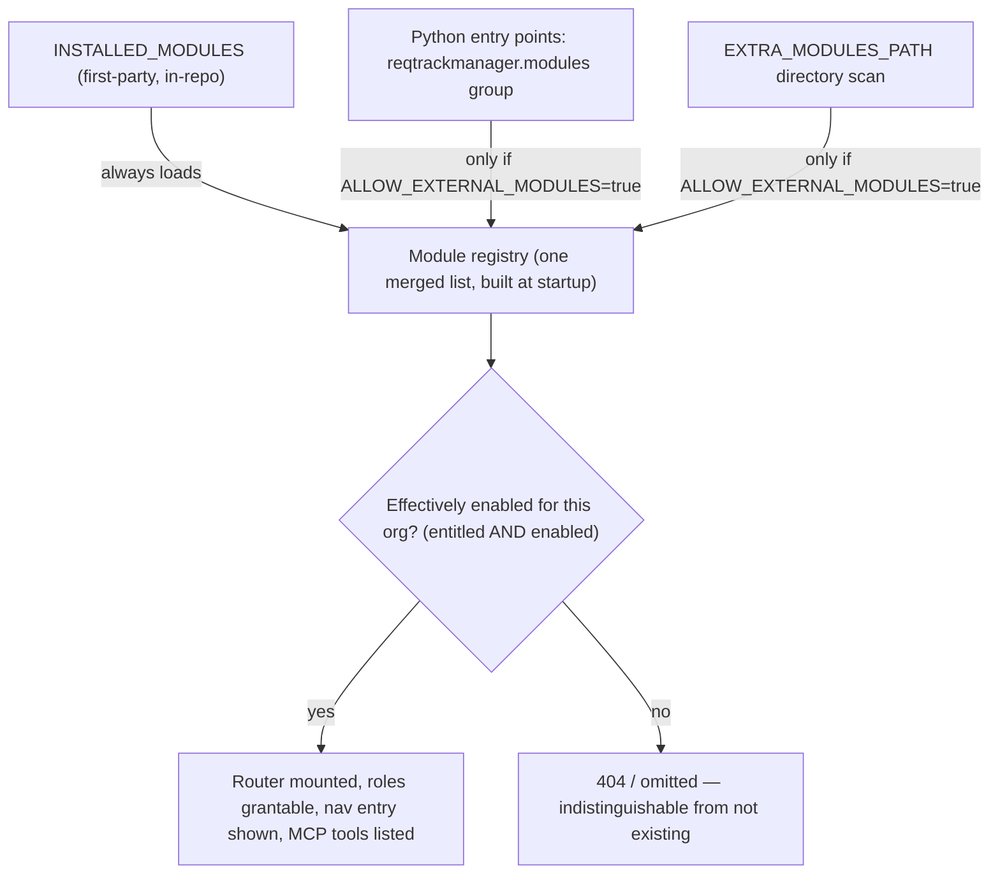
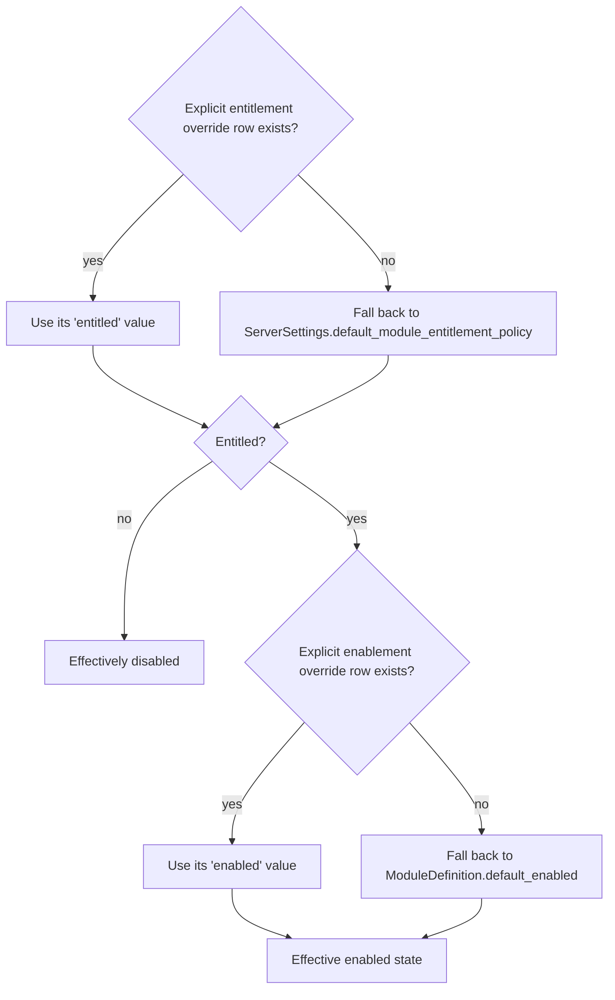
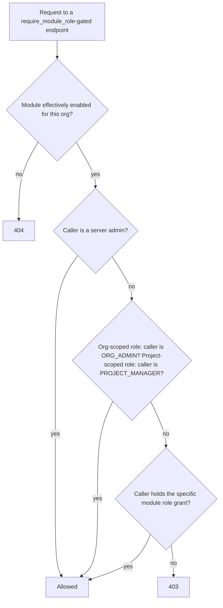
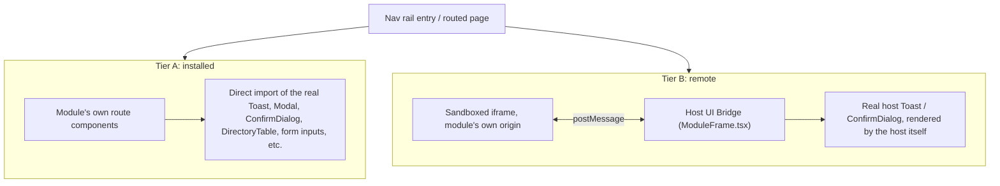
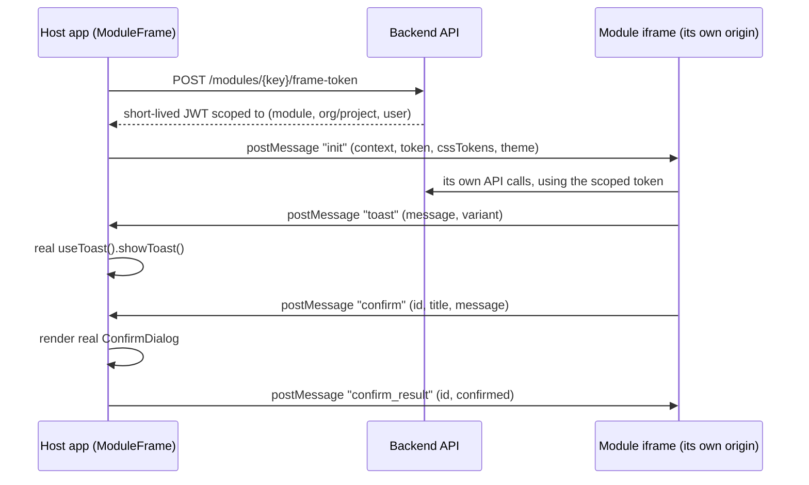
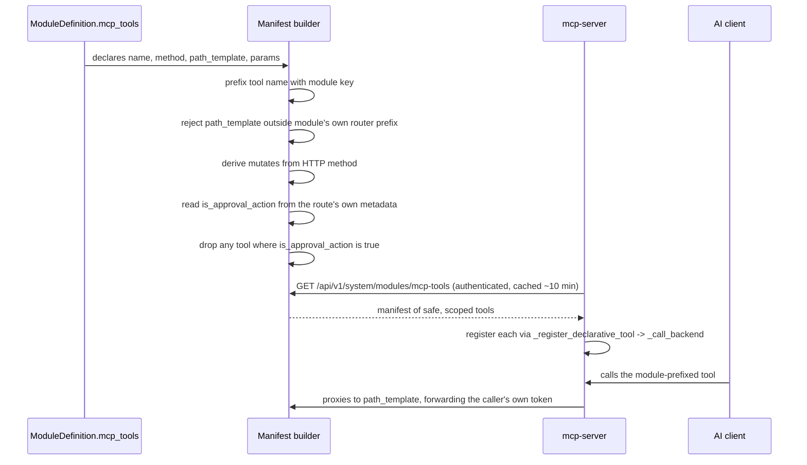

# Modules

This document explains the modular feature system: what a "module" is in this
application, why it exists, and how to build one. It is written for someone
extending or integrating with the system — including a third-party developer
working outside this repository — who wants to understand the module contract
without first reading the full [solution architecture](solution-architecture.md)
document.

This document covers the module *mechanism* itself — the registry, gating,
RBAC, frontend integration, and MCP tool contribution — not any specific
module's own business logic. Compliance is the first real module built on top
of this system; see [docs/compliance-module-plan.md](compliance-module-plan.md)
for its own requirements and build history. It's used below only for small,
illustrative examples.

If you want the dense, line-referenced technical account (exact table/class
names, every edge case) rather than this readable version, see
[solution-architecture.md](solution-architecture.md)'s own "Modular Feature
System" section.

---

## Why modules exist

Some capabilities are large, optional, and not every organisation using this
application wants them — Compliance is the first, with more planned. Building
each one directly into the core application would mean:

- every optional feature area gets its own bespoke enable/disable switch,
  scattered across routers and settings pages
- every feature area that needs its own roles (e.g. a "Compliance Manager")
  either gets bolted onto the core `OrgRole`/`ProjectRole` enums — permanently
  growing them even for organisations that never use the feature — or gets a
  one-off role mechanism nobody else can reuse
- every feature area that wants its own UI ends up either crammed into the
  core frontend bundle regardless of whether it's enabled, or built as a
  second, inconsistent way of extending the UI

The module system solves this once, generically: a **module** is a
self-contained unit — backend endpoints, database tables, RBAC roles, frontend
pages, and (optionally) AI-assistant tools — that plugs into the application
through a small, fixed set of extension points, rather than requiring edits
scattered through core code. A module can be shipped in this repository
("first-party") or built and installed independently ("third-party"). Either
way, it's gated the same way, uses the same RBAC and UI conventions as the
core application, and can be turned on or off per deployment and per
organisation without any code changes.



---

## Core concepts, at a glance

| Concept | What it is |
|---|---|
| `ModuleDefinition` | The single object a module registers to declare everything about itself — name, backend router, RBAC roles, frontend integration, MCP tools. |
| Registry | The merged list of every currently-known `ModuleDefinition`, built once at process startup from three discovery sources. |
| Entitlement | Server-tier: is this organisation *allowed* to use this module at all (the licensing/plan lever)? |
| Enablement | Org-tier: has this organisation's own admin actually *turned it on*? |
| Module-contributed role | An RBAC role a module defines for itself (e.g. "Compliance Manager"), without touching the core role enums. |
| Tier A / Tier B | The two ways a module supplies frontend UI — compiled into the app (Tier A) or rendered in a sandboxed iframe (Tier B). |
| Module MCP tools | AI-assistant tools (`mcp-server/`) a module contributes, proxied declaratively to its own REST endpoints. |

---

## 1. The registry: how a module gets discovered

`backend/app/modules/registry.py` is the single source of truth for "which
modules exist." At process startup it merges three sources, in priority
order — an earlier source's `key` always wins if two collide:

1. **`INSTALLED_MODULES`** — a static Python list, in this repository,
   reviewed the same way any other code change here is. Always loads,
   regardless of configuration. This is how a first-party module (built in
   this repo, via a normal PR) is registered.
2. **Python entry points**, under the `reqtrackmanager.modules` group — the
   same plugin-discovery idiom pytest and Flask extensions use. Any package
   `pip install`-ed into the deployment's image that declares this entry
   point is picked up automatically at startup. This is how a third-party
   module, published as its own installable package, is registered.
3. **`EXTRA_MODULES_PATH`** — an optional local directory. Each immediate
   subdirectory containing a `module.py` that exposes a module-level
   `MODULE_DEFINITION` attribute is loaded. This is for a self-hosted
   operator adding a custom module without publishing a package at all.

Sources 2 and 3 are gated behind `ALLOW_EXTERNAL_MODULES` (env var, default
`false`). When it's off, neither source is even scanned — not just filtered
afterward. A deployment that wants third-party modules has to opt in
explicitly; first-party modules in `INSTALLED_MODULES` are unaffected either
way. (This mirrors `MCP_WRITES_ENABLED`'s existing off-by-default precedent
in this codebase, and is a deliberate mitigation for a real risk: a
plugin-loading mechanism that can `pip install` and auto-run third-party code
is a new code-execution trust boundary — see [Security model](#security-model)
below.)

Every module the registry actually loads is logged at startup with its key,
version, and source — an operational record of what code entered the
deployment on a given run.

---

## 2. Gating: entitlement × enablement

A module is gated at two independent tiers, and **both** must pass for it to
be usable by a given organisation:

- **Entitlement** — the server-tier licensing/plan lever. Is this
  organisation allowed to use this module at all? Managed by a server admin
  or the narrower `MODULE_ADMINISTRATOR` server role. Stored as an explicit
  override row (`OrganizationModuleEntitlement`); no row means "use the
  deployment-wide default" (`ServerSettings.default_module_entitlement_policy`,
  `"open"` or `"closed"`) — not "denied."
- **Enablement** — the org-tier day-to-day switch. Among modules the
  organisation is entitled to, has *this organisation's own admin* actually
  turned it on? Stored as an explicit override row
  (`OrganizationModuleEnablement`); no row means "use the module's own
  registry default" (`ModuleDefinition.default_enabled`).



Whichever backend dependency a module's endpoints use to check this
(`require_org_module_enabled(module_key)` / `require_project_module_enabled
(module_key)`, both in `app.services.rbac`) returns **404, not 403**, when the
module is disabled or non-entitled. A disabled module's endpoints must be
indistinguishable from endpoints that don't exist — not leak their existence
via a 403.

A module never enforces this gate on its own endpoints from the outside —
`app.main` mounts every registered module's router in a simple loop, with no
second gate at the mount-loop level. Each module wires
`require_org_module_enabled`/`require_project_module_enabled` (or
`require_module_role`, below, which composes the same check) onto its own
routes internally, the same way every other router in this codebase already
owns its own dependency wiring.

---

## 3. `ModuleDefinition`: the contract

Everything a module declares about itself is one `ModuleDefinition` value
(a frozen dataclass, `app.modules.registry.ModuleDefinition`):

```python
@dataclass(frozen=True)
class ModuleDefinition:
    key: str                                    # stable, unique — e.g. "compliance"
    name: str                                   # display name
    description: str
    version: str                                # the module's own version string
    default_enabled: bool                       # default for an entitled org with no override row
    implemented: bool                           # False for a registered-but-not-yet-live placeholder
    get_router: Callable[[], APIRouter | None]   # called once; None if no HTTP endpoints
    roles: tuple[ModuleRoleDefinition, ...] = ()  # module-contributed RBAC roles
    frontend_manifest: ModuleFrontendManifest | None = None
    mcp_tools: tuple[McpToolDefinition, ...] = ()
```

`key` and every `role_key` a module declares are load-bearing identifiers —
they're used as plain string keys in database rows (entitlement, enablement,
role grants), not foreign keys into a "modules" table, since modules are
defined in code, not as rows. **Never change a module's `key` or an existing
role's `role_key` once a deployment has data keyed on it.**

---

## 4. Module-contributed RBAC

A module can declare its own named roles without touching the core
`OrgRole`/`ProjectRole` enums:

```python
ModuleRoleDefinition(
    role_key="compliance_manager",
    name="Compliance Manager",
    description="Can create and publish compliance standards for this organisation.",
    scope="org",   # or "project"
)
```

At every process startup, `sync_module_role_definitions` mirrors the live
registry's roles into a `module_role_definitions` table — deliberately
**append-only** (a role is never deleted from this table just because its
module was uninstalled), so a historical grant made while a module was
registered still resolves to a real display name later, even after the
module is removed. Actual grants live in `user_module_roles`, a direct-grant
table (`user_id`, `module_key`, `role_key`, `organization_id`, optional
`project_id`) — **there is no group or project-hierarchy inheritance for
module roles in V1**, unlike core roles. This is a deliberate scope boundary,
not an oversight: it keeps a first version of this mechanism simple, at the
cost of not yet supporting "grant this role to everyone in this group."

A module gates an endpoint on one of its own roles with
`require_module_role(module_key, role_key)`. The check composes with the
core RBAC model rather than replacing it — a caller is authorized if **any**
of the following hold:



In other words: a higher-tier admin never needs the narrower module role
explicitly granted too — the same principle already applied to core roles.

**UI convention:** a module's roles are never rendered as a bespoke
grant/revoke control. The existing `MultiSelectDropdown` roles column on the
org admin Users table and the project members table merges in whichever
module roles are currently offered (declared by a currently-*enabled*
module) alongside the fixed core-role options — same checkbox, same
accessible labelling, same component, for every role in the system.

---

## 5. Frontend integration: Tier A and Tier B

A module's UI is registered one of two ways, chosen per module:



### Tier A — installed (the primary path)

A module ships default-exported route components and registers them in
`frontend/src/modules/registry.ts`:

```ts
export const installedModules: TierAModuleDefinition[] = [
  {
    key: "compliance",             // must match the backend ModuleDefinition.key
    routes: [
      { path: "/compliance", element: <ComplianceHomePage /> },
    ],
  },
];
```

Because this is compiled directly into the same frontend bundle, the
module's own components can import and use every real shared component —
`Toast` via `useToast()`, `ConfirmDialog`, `Modal`, `SidePanel`,
`DirectoryTable`, `FilterPanel`, form inputs — genuinely part of the app, not
a lookalike. The trust model matches the backend's `INSTALLED_MODULES` tier:
"an operator deliberately included this at build time." This is the tier
recommended for any module — first- or third-party — that can be compiled in.

The backend's `ModuleDefinition.frontend_manifest` still carries a
`ModuleFrontendManifest(tier="installed", nav_label=..., nav_path=...)` —
only the nav-entry metadata (a Python value can't reference a React
component), used by the nav rail and route-splicing to know a module has a
frontend surface and where it lives. `nav_path` must match the path used in
the Tier A route registration above.

### Tier B — remote (for a module that can't be compiled in)

For a module genuinely not installed into the deployment — an org admin
pointing at an external tool's URL at runtime, no build step — the backend
declares `ModuleFrontendManifest(tier="remote", nav_label=..., nav_path=...,
frame_url=...)`. The host renders it inside `<ModuleFrame>`, a sandboxed
`<iframe sandbox="allow-scripts allow-same-origin allow-forms">` — but with a
**Host UI Bridge**: the iframe's own page body is isolated, but shared chrome
is requested over `postMessage` and rendered by the real host components, so
it still feels native for what matters most.



A few details that make this safe, not just convenient:

- **The token is never the user's real session token.** It's a short-lived
  (~15 minute) JWT minted server-side, scoped to exactly one
  `(module_key, organization_id or project_id, user_id)` tuple. A request
  presenting it is checked by the same `require_org_module_enabled` /
  `require_project_module_enabled` / `require_module_role` dependencies as
  any other request; a helper (`_enforce_module_frame_scope`) rejects it
  with 403 if its scope doesn't match the specific resource being requested
  — checked *before* any admin-override bypass, so a mis-scoped token can't
  reach further just because the underlying user happens to hold a higher
  role.
- **A module-frame token can't mint another one.** The frame-token minting
  endpoints require a normal session, not a module-frame token — so a Tier B
  iframe can't use its own already-scoped token to get itself a broader one.
- **Every `postMessage` is origin-checked, both directions**, against the
  module's own declared `frame_url` origin — never a wildcard.
- **`frame_url` must resolve to an allowlisted origin**
  (`MODULE_FRAME_ALLOWED_ORIGINS`, comma-separated, empty by default). A
  module whose origin isn't allowlisted is excluded from the frontend
  manifest entirely (logged, not trusted from the module's own declaration);
  the same allowlist drives the `Content-Security-Policy: frame-src` header
  as an independent, browser-enforced backstop.

---

## 6. Module-contributed MCP tools

A module can also register its own tools for `mcp-server/` — the same
server AI assistants (Claude Code, Copilot, etc.) already use to read and
(in write mode) author requirement content, described in full in
[docs/mcp-server.md](mcp-server.md). A module declares each tool
declaratively; nothing here is a second implementation of `mcp-server`'s own
patterns:

```python
McpToolDefinition(
    name="list_standards",        # local name — not a full global name
    description="Lists compliance standards for an organisation.",
    method="GET",
    path_template="/api/v1/orgs/{organization_id}/modules/compliance/standards",
    params=[
        {"name": "organization_id", "type": "uuid", "required": True, "in": "path"},
    ],
)
```

The manifest builder (`GET /api/v1/system/modules/mcp-tools`, normal
bearer-token authentication, no exemption) turns this into a real tool
`mcp-server` can register — but derives the security-relevant parts
**mechanically**, never from what the module itself claims, the same
"verify, don't trust a self-declared field" principle applied to Tier B's
`frame_url` above:

- The registered tool name is always **prefixed with the module's own key**
  (`compliance_list_standards`) — a module can never claim or collide with
  another module's or core's tool name, whatever local `name` it declares.
- **`mutates` is derived from the HTTP method** (`GET` → `False`, anything
  else → `True`) — nothing for a module to misdeclare.
- **`path_template` must fall inside the declaring module's own router
  prefix.** An entry pointing outside it — e.g. a compliance-module tool
  secretly wired to an unrelated, more sensitive endpoint — is excluded and
  logged, regardless of what the module's own manifest entry claims.
- **`is_approval_action` is read from the real backend route's own
  metadata** (a marker that endpoint's own author sets, reviewed the same
  way the endpoint itself is), not from the module's declaration. Any tool
  resolving to an approval-type action is excluded from the manifest
  entirely — approval must stay attributably human, the same principle
  `mcp-server`'s hand-written tools already enforce by simply never
  exposing that capability as a tool at all.



Every module tool's `path_template` names an explicit `{organization_id}` or
`{project_id}` placeholder — there is no implicit "current org" and no
cross-org aggregation inside a tool. This mirrors the app's own REST
convention and means multi-org, mixed-enablement callers work correctly with
zero special-casing: the same per-call `require_org_module_enabled` check
that gates the real endpoint gates the tool, so a caller can successfully
call a module tool against one org and get a clean, ordinary access error
against another. An AI wanting to enumerate across a caller's orgs calls the
existing `list_organizations()` tool first, then chooses which org(s) to
call module tools against — normal MCP client-side composition, not
something the manifest mechanism does for it.

`mcp-server` fetches this manifest **lazily and authenticated** — never at
an unauthenticated boot-time call. Whichever session's own bearer token
first triggers a refresh within the cache window is used; the result is
cached in-process and reused across sessions until the next refresh. A
mutating (`mutates: True`) tool is only registered when `MCP_WRITES_ENABLED`
is set, the same gate `mcp-server`'s own hand-written write tools already
use. No packaging changes are needed in `mcp-server`'s own image — every
declarative tool is a plain HTTP proxy call through the same
`_call_backend` helper every hand-written tool already uses, so a module's
Python package never needs to be installed there.

**Scope boundary:** this only supports declarative, single-REST-call tool
mappings. A tool needing genuinely custom logic (multiple backend calls,
non-trivial response shaping) would mean shipping real code into the
`mcp-server` process — a different, larger trust question this mechanism
deliberately doesn't take on.

---

## 7. Building a new module: a checklist

**Decide how it will be discovered.** All three options below are gated and
mounted identically once loaded — this only decides how a `ModuleDefinition`
reaches the registry:

| Path | Where the module lives | Requires `ALLOW_EXTERNAL_MODULES` |
|---|---|---|
| First-party | This repository, added to `INSTALLED_MODULES`, via a normal PR | No |
| Installable package | Your own pip package, exposing a `reqtrackmanager.modules` entry point | Yes |
| Local directory | A folder with a `module.py` exposing `MODULE_DEFINITION`, pointed at by `EXTRA_MODULES_PATH` | Yes |

**Backend:**
1. Define your models and their own Alembic migration (a first-party module
   adds one import line to `backend/alembic/env.py`; a third-party module
   ships and applies its own migration separately — this system doesn't run
   arbitrary third-party migrations automatically).
2. Build an `APIRouter` for your endpoints. Gate each mutating/sensitive
   endpoint with `require_org_module_enabled(your_key)` /
   `require_project_module_enabled(your_key)`, or `require_module_role
   (your_key, your_role_key)` if it needs one of your own roles.
3. Log every mutation through `app.services.audit.log_event` — the same
   audit trail every core mutation already goes through.
4. Assemble your `ModuleDefinition` (key, name, description, version,
   `default_enabled`, `get_router`, `roles`, `frontend_manifest`,
   `mcp_tools`) and register it via whichever discovery path you chose
   above.

**Frontend (if you have a UI):**
- Prefer **Tier A**: build your route components against the real shared
  components, register them in `frontend/src/modules/registry.ts`, and set
  `frontend_manifest=ModuleFrontendManifest(tier="installed", ...)` on your
  backend definition with a matching `nav_path`.
- Use **Tier B** only if your module genuinely can't be compiled into the
  frontend bundle: host it yourself, set
  `frontend_manifest=ModuleFrontendManifest(tier="remote", frame_url=...)`,
  get your origin added to `MODULE_FRAME_ALLOWED_ORIGINS`, and implement the
  iframe side of the `init` / `toast` / `confirm` / `confirm_result` message
  contract described above.

**MCP tools (optional):** declare `McpToolDefinition` entries for whichever
of your endpoints are safe to expose to an AI assistant. Mark any endpoint
that approves/decides something with your route's own approval-action
metadata — don't rely on the manifest builder's exclusion as your only
defence; design the endpoint itself so an AI-driven caller can't reach an
approval action even if the tool mechanism changes later.

**Test it** the way every other change in this codebase is tested: a
backend test pinning your endpoints' behaviour (including the disabled/
non-entitled 404 case and, if you declared roles, the grant/composition
behaviour), and — if you have Tier A frontend — Storybook coverage plus a
Playwright end-to-end test, per this repository's standing testing
requirements.

---

## Security model

This system opens a real, new trust boundary — code loading — and is treated
that way, not glossed over:

- **The trust boundary is "was deliberately installed."** First-party
  modules go through this project's own PR review. Third-party modules
  require a deployment operator to explicitly set `ALLOW_EXTERNAL_MODULES=
  true` and either `pip install` the package or point `EXTRA_MODULES_PATH`
  at it — an active, logged choice, not a default-on surface.
- **Sandboxing arbitrary untrusted code execution is explicitly out of
  scope.** The mitigation is the opt-in gate above, not a sandbox — the same
  boundary any Python plugin ecosystem (pytest, Flask) relies on.
- **Path-scoping and approval-exclusion for MCP tools are mechanically
  enforced**, not trusted from a module's own manifest — see
  [§6](#6-module-contributed-mcp-tools) above. This gives a real guarantee
  for tools pointing at first-party endpoints; for a third-party module's
  *own* endpoints, the guarantee still ultimately rests on "was deliberately
  installed," the same boundary as everything else here.
- **Tier B tokens are narrowly scoped and can't escalate themselves** — see
  [§5](#5-frontend-integration-tier-a-and-tier-b) above.

For the full SOC 2 framing (which control-matrix gap this raises the stakes
of, and the specific policy-document changes this system committed to), see
[docs/compliance-module-plan.md](compliance-module-plan.md)'s "SOC2 /
Security Planning" section and
[docs/soc2/policies/](soc2/policies/access-control-policy.md).

---

## Where to go next

- [solution-architecture.md](solution-architecture.md)'s "Modular Feature
  System" section — the precise, line-referenced technical account of every
  table, class, and dependency mentioned here.
- [compliance-module-plan.md](compliance-module-plan.md) — the phased build
  plan this system was built under, its design history (including the
  corrections that shaped Tier A/B and module-contributed RBAC), and current
  phase status.
- [mcp-server.md](mcp-server.md) — the full `mcp-server` documentation
  module tools are proxied through.
- [soc2/policies/](soc2/policies/access-control-policy.md) — the adopted
  policy set this system's authorization and vendor/third-party sections
  extend.
