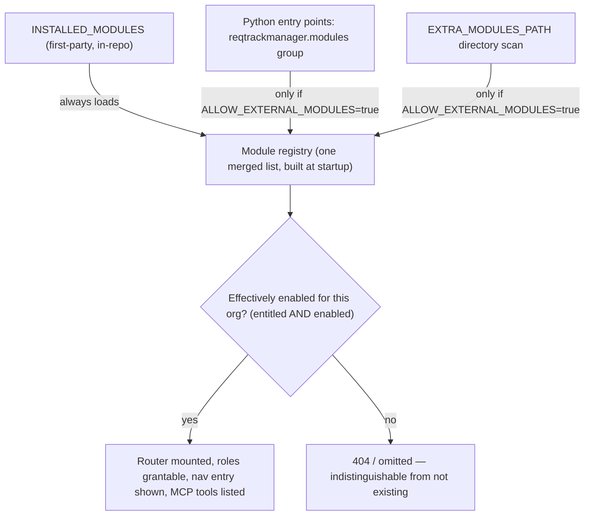
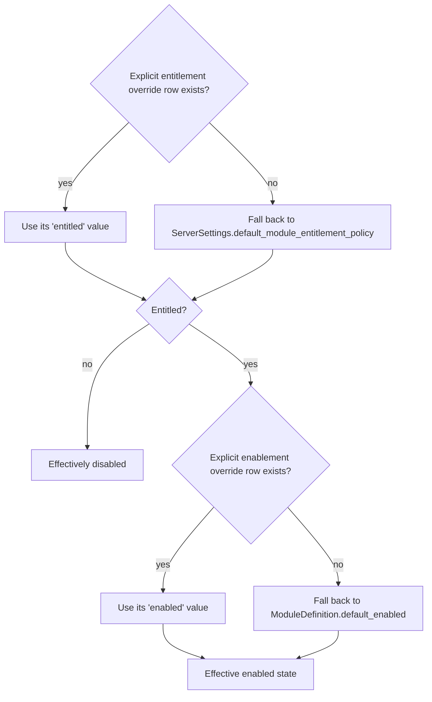
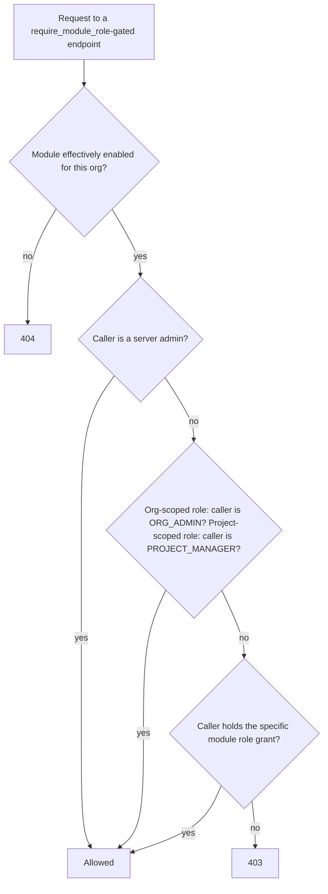
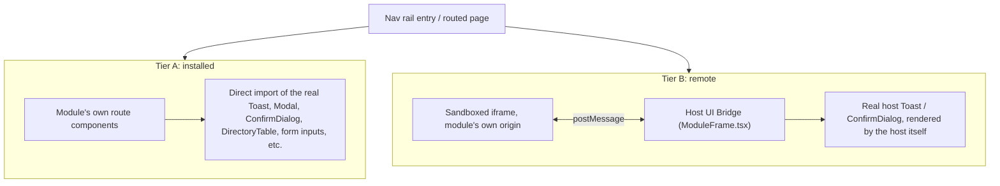
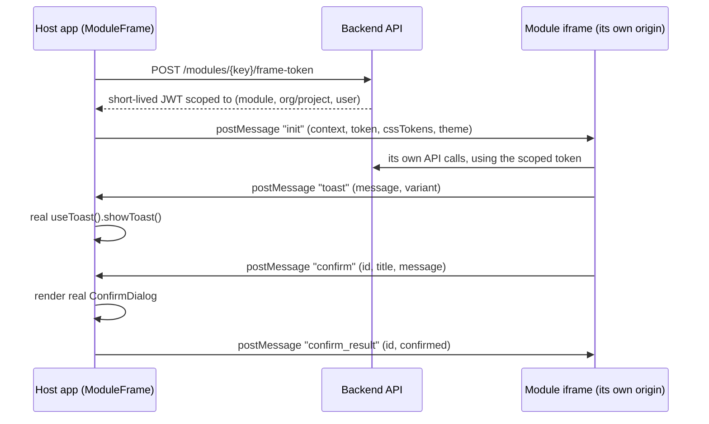
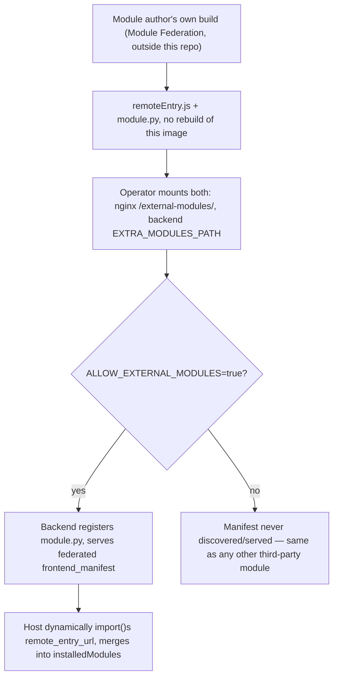
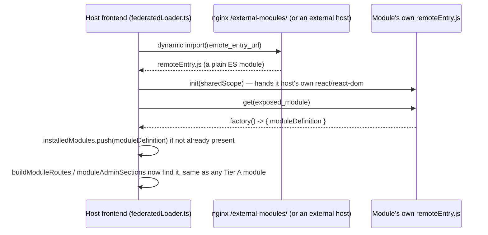
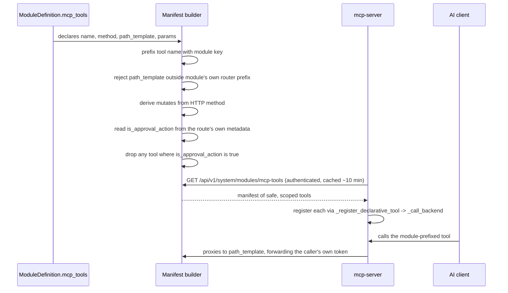

# Modules

This document explains the modular feature system: what a "module" is in this
application, why it exists, and how to build one. It is written for someone
extending or integrating with the system — including a third-party developer
working outside this repository — who wants to understand the module contract
without first reading the full [solution architecture](solution-architecture.md)
document.

This document covers the module *mechanism* itself — the registry, gating,
RBAC, frontend integration, and MCP tool contribution — not any specific
module's own business logic. Compliance is the first real module built on top
of this system; see [docs/compliance-module-plan.md](compliance-module-plan.md)
for its own requirements and build history. It's used below only for small,
illustrative examples.

If you want the dense, line-referenced technical account (exact table/class
names, every edge case) rather than this readable version, see
[solution-architecture.md](solution-architecture.md)'s own "Modular Feature
System" section.

---

## Why modules exist

Some capabilities are large, optional, and not every organisation using this
application wants them — Compliance is the first, with more planned. Building
each one directly into the core application would mean:

- every optional feature area gets its own bespoke enable/disable switch,
  scattered across routers and settings pages
- every feature area that needs its own roles (e.g. a "Compliance Manager")
  either gets bolted onto the core `OrgRole`/`ProjectRole` enums — permanently
  growing them even for organisations that never use the feature — or gets a
  one-off role mechanism nobody else can reuse
- every feature area that wants its own UI ends up either crammed into the
  core frontend bundle regardless of whether it's enabled, or built as a
  second, inconsistent way of extending the UI

The module system solves this once, generically: a **module** is a
self-contained unit — backend endpoints, database tables, RBAC roles, frontend
pages, and (optionally) AI-assistant tools — that plugs into the application
through a small, fixed set of extension points, rather than requiring edits
scattered through core code. A module can be shipped in this repository
("first-party") or built and installed independently ("third-party"). Either
way, it's gated the same way, uses the same RBAC and UI conventions as the
core application, and can be turned on or off per deployment and per
organisation without any code changes.



---

## Core concepts, at a glance

| Concept | What it is |
|---|---|
| `ModuleDefinition` | The single object a module registers to declare everything about itself — name, backend router, RBAC roles, frontend integration, MCP tools. |
| Registry | The merged list of every currently-known `ModuleDefinition`, built once at process startup from three discovery sources. |
| Entitlement | Server-tier: is this organisation *allowed* to use this module at all (the licensing/plan lever)? |
| Enablement | Org-tier: has this organisation's own admin actually *turned it on*? |
| Module-contributed role | An RBAC role a module defines for itself (e.g. "Compliance Manager"), without touching the core role enums. |
| Tier A / Tier B / Tier C | The three ways a module supplies frontend UI — compiled into the app (Tier A), rendered in a sandboxed iframe (Tier B), or dynamically loaded at runtime via Module Federation, with no rebuild and no sandbox (Tier C). |
| Module MCP tools | AI-assistant tools (`mcp-server/`) a module contributes, proxied declaratively to its own REST endpoints. |

---

## 1. The registry: how a module gets discovered

`backend/app/modules/registry.py` is the single source of truth for "which
modules exist." At process startup it merges three sources, in priority
order — an earlier source's `key` always wins if two collide:

1. **`INSTALLED_MODULES`** — a static Python list, in this repository,
   reviewed the same way any other code change here is. Always loads,
   regardless of configuration. This is how a first-party module (built in
   this repo, via a normal PR) is registered.
2. **Python entry points**, under the `reqtrackmanager.modules` group — the
   same plugin-discovery idiom pytest and Flask extensions use. Any package
   `pip install`-ed into the deployment's image that declares this entry
   point is picked up automatically at startup. This is how a third-party
   module, published as its own installable package, is registered.
3. **`EXTRA_MODULES_PATH`** — an optional local directory. Each immediate
   subdirectory containing a `module.py` that exposes a module-level
   `MODULE_DEFINITION` attribute is loaded. This is for a self-hosted
   operator adding a custom module without publishing a package at all.

Sources 2 and 3 are gated behind `ALLOW_EXTERNAL_MODULES` (env var, default
`false`). When it's off, neither source is even scanned — not just filtered
afterward. A deployment that wants third-party modules has to opt in
explicitly; first-party modules in `INSTALLED_MODULES` are unaffected either
way. (This mirrors `MCP_WRITES_ENABLED`'s existing off-by-default precedent
in this codebase, and is a deliberate mitigation for a real risk: a
plugin-loading mechanism that can `pip install` and auto-run third-party code
is a new code-execution trust boundary — see [Security model](#security-model)
below.)

Every module the registry actually loads is logged at startup with its key,
version, and source — an operational record of what code entered the
deployment on a given run.

---

## 2. Gating: entitlement × enablement

A module is gated at two independent tiers, and **both** must pass for it to
be usable by a given organisation:

- **Entitlement** — the server-tier licensing/plan lever. Is this
  organisation allowed to use this module at all? Managed by a server admin
  or the narrower `MODULE_ADMINISTRATOR` server role. Stored as an explicit
  override row (`OrganizationModuleEntitlement`); no row means "use the
  deployment-wide default" (`ServerSettings.default_module_entitlement_policy`,
  `"open"` or `"closed"`) — not "denied."
- **Enablement** — the org-tier day-to-day switch. Among modules the
  organisation is entitled to, has *this organisation's own admin* actually
  turned it on? Stored as an explicit override row
  (`OrganizationModuleEnablement`); no row means "use the module's own
  registry default" (`ModuleDefinition.default_enabled`).



Whichever backend dependency a module's endpoints use to check this
(`require_org_module_enabled(module_key)` / `require_project_module_enabled
(module_key)`, both in `app.services.rbac`) returns **404, not 403**, when the
module is disabled or non-entitled. A disabled module's endpoints must be
indistinguishable from endpoints that don't exist — not leak their existence
via a 403.

A module never enforces this gate on its own endpoints from the outside —
`app.main` mounts every registered module's router in a simple loop, with no
second gate at the mount-loop level. Each module wires
`require_org_module_enabled`/`require_project_module_enabled` (or
`require_module_role`, below, which composes the same check) onto its own
routes internally, the same way every other router in this codebase already
owns its own dependency wiring.

---

## 3. `ModuleDefinition`: the contract

Everything a module declares about itself is one `ModuleDefinition` value
(a frozen dataclass, `app.modules.registry.ModuleDefinition`):

```python
@dataclass(frozen=True)
class ModuleDefinition:
    key: str                                    # stable, unique — e.g. "compliance"
    name: str                                   # display name
    description: str
    version: str                                # the module's own version string
    default_enabled: bool                       # default for an entitled org with no override row
    implemented: bool                           # False for a registered-but-not-yet-live placeholder
    get_router: Callable[[], APIRouter | None]   # called once; None if no HTTP endpoints
    roles: tuple[ModuleRoleDefinition, ...] = ()  # module-contributed RBAC roles
    frontend_manifest: ModuleFrontendManifest | None = None
    mcp_tools: tuple[McpToolDefinition, ...] = ()
    models_import_path: str | None = None       # dotted path to your ORM models module
    migrations_import_path: str | None = None   # dotted path to a module exposing run_migrations(connection)
    get_project_router: Callable[[], APIRouter | None] | None = None  # optional 2nd, project-scoped router
    get_global_router: Callable[[], APIRouter | None] | None = None  # optional 3rd, id-less router
    resolve_file_owner_project_id: Callable[[Session, UUID], UUID | None] | None = None  # file-download auth hook
```

**`get_router` vs. `get_project_router`**: `get_router()` mounts at
`/api/v1/orgs/{organization_id}/modules/<key>/...` — the org-scoped root
every module before Compliance's Phase 7 used exclusively. If your module
also has endpoints that should live at `/api/v1/projects/{project_id}/
modules/<key>/...` instead (no `organization_id` in the path at all),
declare a second router via `get_project_router`. The main reason to want
one: an MCP tool proxying to a project-scoped endpoint can only declare
`project_id` as its path parameter — mirroring hand-written tools like
`get_project(project_id)` — if the underlying route has no
`{organization_id}` placeholder to also require. `build_mcp_tool_manifest`
validates each tool's `path_template` against *either* of your two router
prefixes (whichever one actually has a matching route), so a tool
declaring a `path_template` under `get_project_router()`'s prefix is
checked against that router, not `get_router()`'s. `app.main`'s mount loop
mounts both the same way; leave this `None` if you have no project-scoped
endpoints of your own (most modules).

**`get_global_router` (compliance-module-plan.md Phase 18)** is a third,
optional router for the rarer case where an endpoint has *no* single org or
project id in its own path at all — Compliance's own example is `GET
/api/v1/compliance/nav-visibility`, which aggregates across every org the
caller belongs to, and `GET /api/v1/compliance/standards/{standard_id}`,
which resolves its owning org from the standard's own id rather than a path
parameter. `app.main`'s mount loop mounts it the same way as the other two,
with no second gate applied at the mount-loop level — a route here must do
its own org/project resolution and access check internally, using `app.
services.rbac.require_org_access_and_module_enabled(db, current_user,
organization_id, module_key)` once you've resolved the relevant org id from
wherever your endpoint's own identifier leads to it. Leave this `None`
unless you have a genuinely id-less endpoint (most modules never will).

`key` and every `role_key` a module declares are load-bearing identifiers —
they're used as plain string keys in database rows (entitlement, enablement,
role grants), not foreign keys into a "modules" table, since modules are
defined in code, not as rows. **Never change a module's `key` or an existing
role's `role_key` once a deployment has data keyed on it.**

**If your module has its own database tables**, set `models_import_path` to
the dotted path of the module that defines them (e.g.
`"app.modules.compliance.models"`) — `import_all_module_models()` imports it
for you at the right time, so `Base.metadata` includes your tables for
Alembic's own comparisons without you having to touch `alembic/env.py` or
`tests/conftest.py` at all. This is purely an in-process Python import; it
never touches a real database on its own.

Getting your tables to actually *exist* in a real database is a separate
step, and where it happens depends on how your module is loaded:

- **First-party** (shipped inside `backend/app/modules/`, added to
  `INSTALLED_MODULES`): ship a real Alembic migration and set
  `migrations_dir` to its directory, relative to `backend/` (e.g.
  `"app/modules/compliance/migrations"` — Compliance's own
  `migrations/0026_compliance_data_model.py` is a worked example) —
  reviewed in a normal PR, exactly like every other first-party migration.
  Colocating it with the rest of your module's own code (models/service/
  router/tests) rather than dropping it into the flat, shared
  `backend/alembic/versions/` directory is a compliance-module-plan.md
  Phase 11 follow-up: `app.modules.registry.configure_alembic_version_
  locations` adds every registered module's `migrations_dir` to Alembic's
  own multi-directory `version_locations`, so your migration still
  participates in the exact same single, linear, reviewed chain — this is
  a file-location convenience, not a second, less-reviewed path (see that
  function's own docstring for why this doesn't reopen the trust-boundary
  reasoning below). Number your revision file to continue the existing
  chain's own sequence regardless of which directory the previous head
  lives in (check `python scripts/db.py heads`, not just your own module's
  directory, before picking the next number) — Alembic resolves the chain
  by each file's own `down_revision` string, not by directory, but this
  repo's own numbering convention is still project-wide sequential, for a
  human skimming `python scripts/db.py history` to follow easily. Write
  and run your migration via `python scripts/db.py revision`/`upgrade`/
  `history`/etc. (from `backend/`), not bare `alembic <command>` — the
  wrapper is what actually wires `configure_alembic_version_locations` in
  before dispatching, so a bare `alembic` invocation using this repo's own
  `alembic.ini` directly would only ever see the core directory, missing
  every module's own migrations entirely; see `scripts/db.py`'s own module
  docstring. Leave `migrations_import_path` unset; it is ignored for a
  first-party module even if you do set it.
- **External** (loaded via `EXTRA_MODULES_PATH` or a `pip`-installed entry
  point, only when the deployment operator has set `ALLOW_EXTERNAL_MODULES`):
  set `migrations_import_path` to a module exposing
  `run_migrations(connection) -> None`. It's called automatically at every
  startup, each module in its own transaction — so it must be **idempotent**
  (`CREATE TABLE IF NOT EXISTS`, etc., the same style every migration in this
  repo already uses), since there's no per-module revision tracking. See
  "Adding an external module by mounting a directory" in
  [deployment.md](deployment.md) for the full operator-facing walkthrough.
  (An external module *could* alternatively set `migrations_dir` instead,
  since that mechanism is honoured for any registered module — but
  `migrations_import_path` remains the documented, recommended path for an
  external module specifically, since it needs no filesystem access to this
  repo's own `backend/` tree at all, only an importable Python module.)

**If your module lets users attach files** (reusing `services.files.
upload_file`, per the project's own "reuse existing attachment mechanisms"
principle — Compliance's evidence attachments, Phase 8, are the first
example), set `resolve_file_owner_project_id` so the single, generic,
module-agnostic `GET /api/v1/files/{id}` download endpoint
(`app.routers.files.download_file`) can authorize your attachments too,
without that core router importing anything from your module directly.
It takes `(db, file_id)` and returns the owning project's id if your
module's own file-link table (e.g. `ComplianceEvidenceFile`) references
that file, else `None` — `app.modules.registry.resolve_module_file_
project_id` tries every registered module's hook, in registry order,
until one matches. Leave this `None` if your module has no file
attachments of its own.

---

## 4. Module-contributed RBAC

A module can declare its own named roles without touching the core
`OrgRole`/`ProjectRole` enums:

```python
ModuleRoleDefinition(
    role_key="compliance_manager",
    name="Compliance Manager",
    description="Can create and publish compliance standards for this organisation.",
    scope="org",   # or "project"
)
```

At every process startup, `sync_module_role_definitions` mirrors the live
registry's roles into a `module_role_definitions` table — deliberately
**append-only** (a role is never deleted from this table just because its
module was uninstalled), so a historical grant made while a module was
registered still resolves to a real display name later, even after the
module is removed. Actual grants live in `user_module_roles`, a direct-grant
table (`user_id`, `module_key`, `role_key`, `organization_id`, optional
`project_id`) — **there is no group or project-hierarchy inheritance for
module roles in V1**, unlike core roles. This is a deliberate scope boundary,
not an oversight: it keeps a first version of this mechanism simple, at the
cost of not yet supporting "grant this role to everyone in this group."

A module gates an endpoint on one of its own roles with
`require_module_role(module_key, role_key)`. The check composes with the
core RBAC model rather than replacing it — a caller is authorized if **any**
of the following hold:



In other words: a higher-tier admin never needs the narrower module role
explicitly granted too — the same principle already applied to core roles.

**UI convention:** a module's roles are never rendered as a bespoke
grant/revoke control. The existing `MultiSelectDropdown` roles column on the
org admin Users table and the project members table merges in whichever
module roles are currently offered (declared by a currently-*enabled*
module) alongside the fixed core-role options — same checkbox, same
accessible labelling, same component, for every role in the system.

### 4a. A module-owned entity scope (compliance-module-plan.md Phase 22)

`scope` isn't limited to the two core-recognised literals above. A module
may declare **any other string** as `scope` — a role tied to one specific
row of a first-class entity the module itself owns, narrower than "the
whole org" but with no core-role tier to reuse the way `"project"` reuses
`ProjectRole.PROJECT_MANAGER` one level up. Compliance's own `standards_
manager`/`standards_contributor` (one role per `ComplianceStandard` row)
are the first example:

```python
ModuleRoleDefinition(
    role_key="standards_manager",
    name="Standards Manager",
    description="Full management of one specific compliance standard.",
    scope="standard",
    # Compliance's own org-scoped role also satisfies a standard-scoped
    # check, with no per-standard grant needed — the same "a higher tier
    # already retains full access" principle core roles get for free one
    # level up, extended one tier further down since there's no core role
    # to reuse here.
    overridden_by=(("org", "compliance_manager"),),
    # Resolves a `standard_id` (read off the request's own path parameters,
    # at the key "standard_id" for scope="standard") to its owning
    # organisation — required for any scope other than "org"/"project".
    resolve_entity_organization_id=resolve_standard_organization_id,
)
```

`require_module_role(module_key, role_key)` handles this generically: for
a non-core `scope`, it reads the entity's id off the request's resolved
path parameters at `f"{scope}_id"` (e.g. `standard_id` for `scope=
"standard"`), calls `resolve_entity_organization_id` to learn which
organisation it belongs to (the same role `_project_organization_id` plays
for `"project"`-scoped roles), then applies the identical module-enabled /
2FA / frame-scope checks every other scope gets, before checking (in order)
`is_server_admin`, `OrgRole.ORG_ADMIN` on that organisation, the caller's
own direct grant at this exact entity, and finally each role named in
`overridden_by`. Grant rows use the same `user_module_roles` table, with one
more nullable column: `scope_entity_id` (the generalised sibling of
`project_id`) — a bare `UUID`, not a foreign key, since (like `module_key`/
`role_key`) which table it points into is owned entirely by the declaring
module, not by this core table.

**Composing two of a module's own roles into one check:** `require_module_
role` only ever checks a single `(module_key, role_key)` pair. A module
that needs an "either of my own two roles" gate (Compliance's own
"`standards_manager` OR `standards_contributor` may edit a draft" check) —
composes the reusable predicate, `app.services.rbac.user_satisfies_module_
role`, directly: build two ordinary `require_module_role(...)` dependencies
(one per role) and try the first, falling back to the second on a 403 (never
on a 404 — a disabled module or absent entity should propagate immediately).
See `app.modules.compliance.router._require_standard_manage_or_contribute`
for the actual implementation — this is the pattern to copy, not a special
case to work around.

**A module-owned entity scope can also need its own "always at least one X"
floor**, the same way a project always needs at least one `PROJECT_MANAGER`.
There is no generic mechanism for this (it's inherently module-specific —
what "empty" means and how to detect it varies per entity), but the generic
hook a module needing one should reach for is `ModuleDefinition.validate_
org_group_member_removal` (Phase 22's own addition, alongside this scope
mechanism) — see §4b below.

### 4b. `validate_org_group_member_removal`: a module's own floor tied to an `OrgGroup`

Compliance's `standards_manager` floor has a second satisfaction path
besides a direct per-standard grant: an org can designate one `OrgGroup` as
its fallback compliance-managers group, whose every current member counts
as an effective `standards_manager` for any standard with no explicit grant
of its own (§3, "defaulting to a group of all compliance managers where
roles are SSO-managed" — the group may already be `idp_synced_group_name`-
mapped, reusing the existing SSO group-sync mechanism as-is, no new sync
plumbing needed). This raises a floor question `app.routers.orgs.remove_
org_group_member` has no way to answer on its own: removing this group's
last member could leave a standard with zero managers.

`ModuleDefinition.validate_org_group_member_removal: Callable[[Session,
UUID, UUID], str | None]` is the generic hook this needs — `remove_org_
group_member` calls every registered module's copy (via `app.modules.
registry.run_org_group_member_removal_hooks`) before removing a genuine
*user* member (never a nested-group member) from any `OrgGroup`, stopping
at the first one that returns a non-`None` block message (400'd verbatim).
A module with no group-based floor concept of its own (every module before
Compliance's Phase 22) simply returns `None` (the default) and is skipped —
core code never needs to know which modules, if any, care about a given
group being removed from.

This is a genuinely narrow mechanism, not a reopening of module roles'
still-deferred "grant via group membership" capability (§4's own "no group
or project-hierarchy inheritance for module roles in V1" boundary): it only
answers "would this removal break a floor," it grants nothing on its own.
See `app.modules.compliance.service.validate_fallback_group_member_removal`
for the reference implementation.

---

## 5. Frontend integration: Tier A and Tier B

A module's UI is registered one of two ways, chosen per module:



### Tier A — installed (the primary path)

A first-party module ships default-exported route components and registers
them in its own `frontend/src/modules/<key>/module.ts` — **not** a hand-edit
to a shared registry file. `frontend/src/modules/registry.ts` auto-discovers
every such file at build time (`import.meta.glob('./*/module.ts', { eager:
true })`, works identically under the real Vite build, Vitest, and
Storybook's Vitest-based runner) and assembles `installedModules` from the
results — dropping in a new `module.ts` is the entire registration step; see
that file's own docstring for the mechanism (module system follow-up,
2026-09-07; `docs/decisions.md`'s "Module system follow-up: frontend module
auto-discovery" entry has the full account). This only covers first-party
modules physically under `frontend/src/modules/*` — a third-party
(npm-installed) Tier A module isn't discovered this way and would need its
own registration mechanism, not built yet (no third-party Tier A module
exists).

```ts
// frontend/src/modules/compliance/module.ts
export const moduleDefinition: TierAModuleDefinition = {
  key: "compliance",             // must match the backend ModuleDefinition.key
  routes: [
    { path: "/compliance", element: <ComplianceHomePage /> },
  ],
  // Optional — see "Org-admin sections" below.
  orgAdminSections: [
    { key: "compliance", label: "Compliance", render: ({ orgId }) => <ComplianceAdminPanel orgId={orgId} /> },
  ],
};
```

Because this is compiled directly into the same frontend bundle, the
module's own components can import and use every real shared component —
`Toast` via `useToast()`, `ConfirmDialog`, `Modal`, `SidePanel`,
`DirectoryTable`, `FilterPanel`, form inputs — genuinely part of the app, not
a lookalike. The trust model matches the backend's `INSTALLED_MODULES` tier:
"an operator deliberately included this at build time." This is the tier
recommended for any module — first- or third-party — that can be compiled in.

The backend's `ModuleDefinition.frontend_manifest` still carries a
`ModuleFrontendManifest(tier="installed", nav_label=..., nav_path=...)` —
only the nav-entry metadata (a Python value can't reference a React
component), used by the nav rail and route-splicing to know a module has a
frontend surface and where it lives. `nav_path` must match the path used in
the Tier A route registration above.

For a **project-scoped** route, `nav_path` may contain a literal
`"{project_id}"` placeholder (e.g.
`"/projects/{project_id}/modules/compliance"`) — `GET /projects/{id}/enabled-
modules` (`routers/projects.py::list_project_enabled_modules`) substitutes
the real project id into it before returning it to the frontend, and the
matching Tier A route registration should use React Router's own `:projectId`
param syntax at the same position (`"/projects/:projectId/modules/..."`).
`GET /orgs/{id}/modules` (the org-admin bookkeeping view) has no single
project in scope and leaves the placeholder as literal text — don't rely on
it being interpolated there. Compliance (Phase 13) is the first module to use
this; see `docs/decisions.md`'s "Compliance module plan, Phase 13" entry if
you need the full story of why this substitution exists.

### Org-admin sections

The routing/nav-discovery mechanism above is project-scoped end to end — a
module with an org-level (not project-level) admin surface, like
Compliance's own standards-management and cross-project-dashboard panels,
declares it via `TierAModuleDefinition.orgAdminSections` instead (module
system follow-up, 2026-09-07): a list of `{ key, label, render({ orgId }) }`
entries. `OrgAdminPage.tsx` merges every *enabled* installed module's own
`orgAdminSections` onto its ten fixed core `ResourceMenu` groups (Overview,
Users, Groups, ...), builds the matching `/orgs/:orgId/admin/<key>` route
segment automatically, and renders whichever section's `key` matches the
active group by calling its `render({ orgId })` — no per-module edit to
`OrgAdminPage.tsx` itself. A section's `key` must be unique across every
installed module (and distinct from the ten core group keys); a colliding
key is dropped, logged, rather than silently shadowing a core group. See
`frontend/src/modules/compliance/module.ts` for a real example
(`OrgCompliancePanel`, the org-wide compliance dashboard — Compliance's own
former second section, `ComplianceAdminPanel`, was retired in Phase 18, see
below) and `docs/decisions.md`'s "Module system follow-up: dynamic org-admin
panel registration" entry for why this replaced Phase 12/14's original
hardcoded approach.

### Global nav links, global routes, and standalone workspaces

Three more optional `TierAModuleDefinition` fields (compliance-module-plan.md
Phase 18), mirroring `orgAdminSections`' own "module hands the parent a
render function" shape, for a module that needs a presence in `Layout.tsx`/
`App.tsx` themselves rather than inside Org Admin or a specific project:

```ts
export const moduleDefinition: TierAModuleDefinition = {
  key: "compliance",
  // Always-mounted, top-level page routes — the same {path, element} shape
  // as `routes` above, but spliced into App.tsx's <Routes> unconditionally
  // for every installed module (like /projects, /orgs), not gated on any
  // one project's/org's own currently-enabled-modules list the way `routes`
  // is. For a cross-org, always-present surface with no single project/org
  // to check enablement against (Compliance's own /standards and friends).
  globalRoutes: [
    { path: "/standards", element: <StandardListPage /> },
    { path: "/standards/settings/:orgId/:group?", element: <ComplianceSettingsPage /> },
    { path: "/standards/:standardId/:section?", element: <StandardWorkspacePage /> },
  ],
  // A top-level nav-rail link in Layout.tsx's Global section (sibling to
  // Projects). Each item owns its own visibility and may render `null` —
  // Layout.tsx invites every installed module's items to render and never
  // itself decides whether a given one applies.
  globalNavItems: [
    { key: "compliance-standards", render: ({ railCollapsed }) => <ComplianceGlobalNavLink railCollapsed={railCollapsed} /> },
  ],
  // A left-nav section rendered as a sibling to Layout.tsx's own "Project"
  // section, active whenever `matchPath` matches the current URL — for a
  // project-like entity that isn't a Project (Compliance's own Standard:
  // Overview/Versions/History). `matchPath`'s first capture group is
  // passed to `render` as `entityId`.
  standaloneWorkspaces: [
    {
      key: "standard",
      matchPath: /^\/standards\/(?!settings\/)([^/]+)/,
      render: ({ entityId, railCollapsed }) => <StandardNavSection entityId={entityId} railCollapsed={railCollapsed} />,
    },
  ],
};
```

**Page components registered via `globalRoutes` (or `routes`) live inside
your own module's directory (`frontend/src/modules/<key>/`), never under
`frontend/src/pages/`** — `StandardListPage.tsx`/`StandardWorkspacePage.tsx`/
`ComplianceSettingsPage.tsx` all live in `frontend/src/modules/compliance/`,
the same place `ProjectCompliancePage.tsx` (registered via `routes`) always
has. `NavRailLink` (`components/Layout.tsx`) is exported so your own render
functions can build visually-consistent links. Use these three fields, not a
direct edit to `Layout.tsx`/`App.tsx`, for anything that needs a
Global-section link, an always-mounted top-level route, or a Project-like
left-nav section — an earlier Phase 18 implementation pass hardcoded the nav
link/section directly into `Layout.tsx`, and — caught in a *second* review
pass after that first fix — then repeated the identical mistake for the
routes, importing the three page components straight into `App.tsx` and
hardcoding their paths there. Both were corrected before the phase was
accepted (see `docs/decisions.md`'s "Phase 18 complete" entry for the full
account of both); the module system's own "Design history" already rejected
this shape twice during its original design, before either of these. If
your nav contribution needs its own gating logic (Compliance's link is
hidden unless `GET /api/v1/compliance/nav-visibility` says otherwise), keep
that logic self-contained inside your own module — a small hook backed by a
module-level `useSyncExternalStore` store, not a React Context/Provider
`Layout.tsx` would have to mount, is `useComplianceNavVisibility.ts`'s own
pattern (`frontend/src/modules/compliance/`) if you need the same shape.

### Tier B — remote (for a module that can't be compiled in)

For a module genuinely not installed into the deployment — an org admin
pointing at an external tool's URL at runtime, no build step — the backend
declares `ModuleFrontendManifest(tier="remote", nav_label=..., nav_path=...,
frame_url=...)`. The host renders it inside `<ModuleFrame>`, a sandboxed
`<iframe sandbox="allow-scripts allow-same-origin allow-forms">` — but with a
**Host UI Bridge**: the iframe's own page body is isolated, but shared chrome
is requested over `postMessage` and rendered by the real host components, so
it still feels native for what matters most.



A few details that make this safe, not just convenient:

- **The token is never the user's real session token.** It's a short-lived
  (~15 minute) JWT minted server-side, scoped to exactly one
  `(module_key, organization_id or project_id, user_id)` tuple. A request
  presenting it is checked by the same `require_org_module_enabled` /
  `require_project_module_enabled` / `require_module_role` dependencies as
  any other request; a helper (`_enforce_module_frame_scope`) rejects it
  with 403 if its scope doesn't match the specific resource being requested
  — checked *before* any admin-override bypass, so a mis-scoped token can't
  reach further just because the underlying user happens to hold a higher
  role.
- **A module-frame token can't mint another one.** The frame-token minting
  endpoints require a normal session, not a module-frame token — so a Tier B
  iframe can't use its own already-scoped token to get itself a broader one.
- **Every `postMessage` is origin-checked, both directions**, against the
  module's own declared `frame_url` origin — never a wildcard.
- **`frame_url` must resolve to an allowlisted origin**
  (`MODULE_FRAME_ALLOWED_ORIGINS`, comma-separated, empty by default). A
  module whose origin isn't allowlisted is excluded from the frontend
  manifest entirely (logged, not trusted from the module's own declaration);
  the same allowlist drives the `Content-Security-Policy: frame-src` header
  as an independent, browser-enforced backstop.

### Tier C — federated (a genuinely third-party module, no rebuild required)

Module system follow-up, 2026-09-07 — requested directly by the repo owner,
not part of a numbered `compliance-module-plan.md` phase. Tier A requires a
rebuild of this frontend image (Vite bundles are static build artifacts —
there is nothing to rescan once the image exists). Tier B can run without a
build step, but only by giving up native component reuse for iframe
isolation. **Tier C is for a self-hosted operator who wants to add a
genuinely third-party frontend module — one never compiled into this
image — the same way the backend has always supported for a Python module**
(`Settings.allow_external_modules` + `Settings.extra_modules_path`,
`ALLOW_EXTERNAL_MODULES=true`/`EXTRA_MODULES_PATH`, [§1](#1-the-registry-how-a-module-gets-discovered)
above): the module author builds their own remote bundle, on their own
schedule, with their own tooling, entirely outside this repository; the
operator drops the built artifact somewhere this frontend can reach at
runtime; the host dynamically `import()`s it, sharing its own React/
component-library instances rather than an isolated iframe.



**A `federated` `ModuleFrontendManifest` is only ever legitimate for a
module discovered through the existing third-party pipeline (entry points /
`EXTRA_MODULES_PATH`) — never `INSTALLED_MODULES`.** A first-party module
has no reason to use Tier C at all: it can use Tier A directly, with full
build-time review. `get_frontend_manifest` enforces this mechanically (logs
an `ERROR` and excludes the manifest) rather than trusting a module not to
misdeclare it — the same "verify, don't trust a self-declared field"
principle already applied to Tier B's `frame_url`. This is also why Tier C
needed **no second, independently-configured frontend flag**: a `federated`
manifest can only ever reach the frontend at all for a module that already
came from the `ALLOW_EXTERNAL_MODULES`-gated discovery pipeline, so that
existing gate — not a new one — is the whole gate. There is deliberately no
`MODULE_FRAME_ALLOWED_ORIGINS`-equivalent allowlist for `remote_entry_url`
either, for the same reason: unlike Tier B (which a first-party module can
also legitimately use, and therefore does need its own separate origin
check), a Tier C manifest reaching the frontend at all already implies the
gated pipeline produced it.

**The trust model — stated as plainly as the repo owner stated it when
this was designed**: *"the trust falls to the server admin to review and
vet any plugins they add to their deployment that isn't first party."*
This is a materially **bigger** trust concession than either Tier A or Tier
B — not a restatement of the same risk one level up:

| | Tier A (installed) | Tier B (remote/iframe) | Tier C (federated) |
|---|---|---|---|
| Code review | This repo's own PR review, before the image is built | The module's own origin's own process — but sandboxed | **None at all** — code the operator never compiled or reviewed |
| Isolation | N/A — genuinely part of the app | Sandboxed `<iframe>`, no DOM/cookie access to the host | **None** — same origin, same DOM, same cookies, same live component tree as the host |
| Rebuild required | Yes | No | No |
| Native component reuse | Full | Only via the Host UI Bridge's `postMessage` RPC | Full — shares the host's own React/component instances |

A Tier C module's code runs with everything the current page's own script
already has access to — the user's session (via whatever the page's own
fetch/cookie context provides), the live DOM, every other component's
state. There is no sandbox standing between "this manifest was served" and
"this code runs with full page access." The mitigation is exactly the same
shape as the backend's own third-party discovery gate
(`ALLOW_EXTERNAL_MODULES`, off by default) — an explicit, logged, opt-in
decision by the deployment operator — but the *consequence* of that
decision is larger for Tier C than for a router-only third-party backend
module, since a backend module's blast radius is still bounded by whatever
the rest of the backend's own authorization checks allow it to do, while a
Tier C frontend module's blast radius is "whatever the current user's
browser session can do." See [soc2/policies/vendor-and-subprocessor-management-policy.md](soc2/policies/vendor-and-subprocessor-management-policy.md)
point 8 for the SOC 2 framing in full, and do not understate this when
advising an operator whether to enable it.

**Runtime mechanism.** `ModuleFrontendManifest` gained a third `tier`,
`"federated"`, plus two fields only meaningful for it:

```python
ModuleFrontendManifest(
    tier="federated",
    nav_label="My Third-Party Module",
    nav_path="/projects/{project_id}/modules/my-module",
    remote_entry_url="/external-modules/my-module/remoteEntry.js",  # same-origin, or any absolute URL
    exposed_module="./Module",  # the Module Federation "exposed module" name
)
```

`frontend/src/modules/federatedLoader.ts` is the frontend half: given a
currently-enabled module's manifest, it dynamically `import()`s
`remote_entry_url`, calls the loaded container's `init(sharedScope)` (handing
it the host's own already-loaded `react`/`react-dom` instances) then
`get(exposed_module)`, and merges the resulting `TierAModuleDefinition`
straight into the **same** `installedModules` array Tier A's build-time
`import.meta.glob` discovery populates (`registry.ts`) — so `getInstalledModule`,
`buildModuleRoutes.tsx`, and `OrgAdminPage.tsx`'s `moduleAdminSections` all
treat a Tier C module identically to one discovered at build time, with no
second, parallel merge path to keep in sync. `useFederatedModules`
(`frontend/src/hooks/useFederatedModules.ts`) is what `App.tsx` and
`OrgAdminPage.tsx` each call, independently, with their own project-/
org-scoped enabled-modules list — mirroring `useProjectEnabledModules`'s own
"each concern fetches/derives its own data" convention — to trigger these
loads and re-render once one settles.



**A documented deviation from the plugin this mechanism was designed
around, disclosed rather than silently substituted.** The design calls for
a real Module Federation build plugin — `@originjs/vite-plugin-federation`
(or an equivalent) — on both the host and a real module author's own build,
configured for *dynamic* remotes (a Tier C remote's URL isn't known at
host build time). **This repository's own sandboxed build/test environment
had no network access to the npm registry** when Tier C was built
(`npm view`/`npm install` both timed out against `registry.npmjs.org`), so
that dependency could not be installed, built, or verified here — and
shipping a `vite.config.ts` that imports a package not actually present in
`node_modules` would break every frontend typecheck/lint/build/test run,
not just this feature. `federatedLoader.ts` instead implements, by hand,
the same minimal container contract a real Module Federation remote build
produces (`init(sharedScope)` / `get(exposedModuleName) -> Promise<() =>
Module>`), using only native dynamic `import()` — no new dependency. See
that file's own docstring for the full account, including its explicitly
named limitation (no real shared-dependency *version* negotiation — a Tier
C remote must be built against a React version compatible with the host's
own, with nothing automated standing behind that expectation) and the
concrete, narrow upgrade path (swap this one file's own remote-loading
calls for the real plugin's dynamic-remote runtime APIs — e.g.
`__federation_method_setRemote`/`__federation_method_getRemote` for
`@originjs/vite-plugin-federation` — once a deployment building this repo
has normal registry access). `docs/decisions.md`'s "Module system
follow-up: Tier C (Module Federation)" entries have the full account of
what was verified for real (a genuinely separate, hand-authored fixture
remote, dynamically `import()`-ed in a real browser via Storybook/Vitest —
see `frontend/src/modules/federatedLoader.stories.tsx`) versus documented
as a known limitation.

#### Tier C: module-author guide

A Tier C module author never touches this repository. Their own build
produces two artifacts:

1. **A `remoteEntry.js`** (or equivalent bundle name) exporting the
   container contract above: `init(sharedScope)` and `get(exposedModuleName)`.
   `get("./Module")` (or whatever name you choose — the backend's
   `exposed_module` field must match exactly) must resolve to a **factory
   function** (not the module object directly — call it once to get the
   real module), whose return value has a `moduleDefinition` property
   shaped exactly like a Tier A `TierAModuleDefinition`
   (`frontend/src/modules/types.ts`): `{ key, routes?, orgAdminSections? }`.
   `key` **must** match the `module_key` your backend `ModuleDefinition`
   registers — a mismatch is rejected by the host loader (logged, and the
   module simply doesn't appear), not silently accepted under a different
   key.
2. **Use the host's own shared dependencies, don't bundle your own.**
   `sharedScope.react`/`sharedScope["react-dom"]` are the *host's own*
   already-loaded instances, handed to your `init(sharedScope)` — building
   your components against these (rather than your own bundled copy of
   React) is what makes your module render through the same live component
   tree as the host, avoiding the classic Module Federation footgun of two
   different React instances fighting over one page (hooks silently
   breaking, context providers not being seen by consumers in the "wrong"
   copy). Once this repository has normal npm registry access and swaps in
   a real Module Federation plugin (see the deviation note above), the
   equivalent, more familiar way to express this on your own end is your
   own `vite.config.ts` declaring `shared: ["react", "react-dom"]` in that
   plugin's own `federation({...})` config — the host will accept either,
   since the container contract itself is what matters, not how your own
   build produced it.
3. **What you may import directly, versus what you must receive via
   `sharedScope`**: only `react`/`react-dom` need to come from the shared
   scope (they're stateful singletons — the classic footgun above). This
   repo's own shared component library (`Toast`, `Modal`, `SidePanel`,
   `DirectoryTable`, form inputs, etc.) is **not** exposed to a Tier C
   module the way it is to a Tier A module compiled into this bundle — a
   Tier C module builds its own UI (using the host's shared React instance,
   so at least hooks/context work correctly), styled to visually match
   using this app's own CSS custom properties (the same design tokens Tier
   B's `<ModuleFrame>` hands an iframe via its `init` message's `cssTokens`
   — inspect `document.documentElement`'s computed style for the same
   `--color-*` custom properties at runtime) rather than importing this
   repo's own component source, which it has no access to.
4. **Your backend counterpart** is a router-less `module.py` — see the
   operator guide below for the exact shape; you'll typically supply both
   the frontend bundle and this file to the operator together, as one
   package.

Nothing about your own build tooling, bundler choice, or repository
structure is dictated beyond "produces a `remoteEntry.js` implementing this
container contract" — you are not required to use Vite, or even Module
Federation's own tooling by name, provided the contract is honoured.

#### Tier C: operator guide

None of this requires rebuilding either the backend or frontend Docker
image.

1. **Get the module's two artifacts from its author**: a frontend bundle
   (`remoteEntry.js` + whatever else it references) and a backend
   `module.py`. A router-less module needs no database migration of its
   own either, but may have one (`migrations_import_path`) exactly like any
   other externally-discovered module — see [§3](#3-moduledefinition-the-contract)
   above.
2. **Write (or receive from the author) the backend `module.py`**:

   ```python
   # my-modules/my_module/module.py
   from app.modules.registry import ModuleDefinition, ModuleFrontendManifest

   MODULE_DEFINITION = ModuleDefinition(
       key="my_module",
       name="My Third-Party Module",
       description="What it does.",
       version="1.0.0",
       default_enabled=False,
       implemented=True,
       get_router=lambda: None,  # router-less — Tier C modules built purely
                                 # for frontend UI need no backend endpoints
                                 # of their own; add a real router the same
                                 # way any other module does if yours needs one.
       frontend_manifest=ModuleFrontendManifest(
           tier="federated",
           nav_label="My Third-Party Module",
           nav_path="/projects/{project_id}/modules/my-module",
           remote_entry_url="/external-modules/my-module/remoteEntry.js",
           exposed_module="./Module",
       ),
   )
   ```

   This is the entire registration — it reuses 100% of the existing
   third-party discovery pipeline (entitlement, org enablement, audit
   logging, the Modules admin toggle) with **zero new backend discovery
   code**: `get_router() -> None` is already an `Optional` field per this
   system's own original Phase 1 design, so a frontend-only module is not a
   special case the registry needed to learn about.
3. **Place it under `EXTRA_MODULES_PATH`** (a directory the backend
   container can see — see [Adding an external module by mounting a
   directory](deployment.md#adding-an-external-module-by-mounting-a-directory)
   above for the exact bind-mount pattern) **and set
   `ALLOW_EXTERNAL_MODULES=true`** — the same two settings any other
   third-party module needs; nothing Tier-C-specific about either.
4. **Mount the frontend bundle into the frontend container's
   `/external-modules/` directory** (nginx serves it same-origin — see
   [deployment.md](deployment.md#adding-a-tier-c-federated-frontend-module)
   for the exact bind-mount and the alternative of hosting it
   externally instead and pointing `remote_entry_url` at an absolute URL).
5. **Restart both containers** (or `docker compose up -d backend
   frontend`) — no rebuild.
6. **Enable it for an organisation** via the existing Modules admin UI
   (`/orgs/:orgId/admin/modules`), exactly like any other module — an org
   admin (or server admin, for entitlement) turns it on the same way they
   would Compliance or any other module. Its nav entry/route (or org-admin
   section) appears the next time an enabled project/org page loads it,
   once the frontend's own dynamic import resolves.

**Before enabling `ALLOW_EXTERNAL_MODULES` and mounting a Tier C module in
particular** (more so than a router-only backend module — see the trust
model above), review the module's own code, reputation, and maintenance
posture the way [soc2/policies/vendor-and-subprocessor-management-policy.md](soc2/policies/vendor-and-subprocessor-management-policy.md)
point 8 asks — its code will run with full access to whatever the current
page's own session/DOM already has, with no sandbox.

---

## 6. Module-contributed MCP tools

A module can also register its own tools for `mcp-server/` — the same
server AI assistants (Claude Code, Copilot, etc.) already use to read and
(in write mode) author requirement content, described in full in
[docs/mcp-server.md](mcp-server.md). A module declares each tool
declaratively; nothing here is a second implementation of `mcp-server`'s own
patterns:

```python
McpToolDefinition(
    name="list_standards",        # local name — not a full global name
    description="Lists compliance standards for an organisation.",
    method="GET",
    path_template="/api/v1/orgs/{organization_id}/modules/compliance/standards",
    params=[
        {"name": "organization_id", "type": "uuid", "required": True, "in": "path"},
    ],
)
```

The manifest builder (`GET /api/v1/system/modules/mcp-tools`, normal
bearer-token authentication, no exemption) turns this into a real tool
`mcp-server` can register — but derives the security-relevant parts
**mechanically**, never from what the module itself claims, the same
"verify, don't trust a self-declared field" principle applied to Tier B's
`frame_url` above:

- The registered tool name is always **prefixed with the module's own key**
  (`compliance_list_standards`) — a module can never claim or collide with
  another module's or core's tool name, whatever local `name` it declares.
- **`mutates` is derived from the HTTP method** (`GET` → `False`, anything
  else → `True`) — nothing for a module to misdeclare.
- **`path_template` must fall inside the declaring module's own router
  prefix.** An entry pointing outside it — e.g. a compliance-module tool
  secretly wired to an unrelated, more sensitive endpoint — is excluded and
  logged, regardless of what the module's own manifest entry claims.
- **`is_approval_action` is read from the real backend route's own
  metadata** (a marker that endpoint's own author sets, reviewed the same
  way the endpoint itself is), not from the module's declaration. Any tool
  resolving to an approval-type action is excluded from the manifest
  entirely — approval must stay attributably human, the same principle
  `mcp-server`'s hand-written tools already enforce by simply never
  exposing that capability as a tool at all.



Every module tool's `path_template` names an explicit `{organization_id}` or
`{project_id}` placeholder — there is no implicit "current org" and no
cross-org aggregation inside a tool. This mirrors the app's own REST
convention and means multi-org, mixed-enablement callers work correctly with
zero special-casing: the same per-call `require_org_module_enabled` check
that gates the real endpoint gates the tool, so a caller can successfully
call a module tool against one org and get a clean, ordinary access error
against another. An AI wanting to enumerate across a caller's orgs calls the
existing `list_organizations()` tool first, then chooses which org(s) to
call module tools against — normal MCP client-side composition, not
something the manifest mechanism does for it.

`mcp-server` fetches this manifest **lazily and authenticated** — never at
an unauthenticated boot-time call. Whichever session's own bearer token
first triggers a refresh within the cache window is used; the result is
cached in-process and reused across sessions until the next refresh. A
mutating (`mutates: True`) tool is only registered when `MCP_WRITES_ENABLED`
is set, the same gate `mcp-server`'s own hand-written write tools already
use. No packaging changes are needed in `mcp-server`'s own image — every
declarative tool is a plain HTTP proxy call through the same
`_call_backend` helper every hand-written tool already uses, so a module's
Python package never needs to be installed there.

**Scope boundary:** this only supports declarative, single-REST-call tool
mappings. A tool needing genuinely custom logic (multiple backend calls,
non-trivial response shaping) would mean shipping real code into the
`mcp-server` process — a different, larger trust question this mechanism
deliberately doesn't take on.

---

## 7. Building a new module: a checklist

**Decide how it will be discovered.** All three options below are gated and
mounted identically once loaded — this only decides how a `ModuleDefinition`
reaches the registry:

| Path | Where the module lives | Requires `ALLOW_EXTERNAL_MODULES` |
|---|---|---|
| First-party | This repository, added to `INSTALLED_MODULES`, via a normal PR | No |
| Installable package | Your own pip package, exposing a `reqtrackmanager.modules` entry point | Yes |
| Local directory | A folder with a `module.py` exposing `MODULE_DEFINITION`, pointed at by `EXTRA_MODULES_PATH` | Yes |

**Backend:**
1. Define your models and set `models_import_path` on your
   `ModuleDefinition` so `Base.metadata` includes them automatically —
   no core-file edit needed for this part, regardless of discovery path.
   Getting a real database to match that shape differs by discovery path:
   a first-party module ships a real, reviewed Alembic migration in its own
   `migrations_dir` (e.g. `app/modules/<key>/migrations/`, colocated with
   the rest of your module's code — see above for the full worked
   convention), authored/applied via `python scripts/db.py`, not bare
   `alembic`; an external module instead sets `migrations_import_path` to
   an idempotent `run_migrations(connection)`, applied automatically — but
   only when the deployment operator has set `ALLOW_EXTERNAL_MODULES` (see
   [Security model](#security-model)).
2. Build an `APIRouter` for your endpoints. Gate each mutating/sensitive
   endpoint with `require_org_module_enabled(your_key)` /
   `require_project_module_enabled(your_key)`, or `require_module_role
   (your_key, your_role_key)` if it needs one of your own roles.
3. Log every mutation through `app.services.audit.log_event` — the same
   audit trail every core mutation already goes through.
4. Assemble your `ModuleDefinition` (key, name, description, version,
   `default_enabled`, `get_router`, `roles`, `frontend_manifest`,
   `mcp_tools`, `models_import_path`, `migrations_import_path`) and
   register it via whichever discovery path you chose above.

**Frontend (if you have a UI):**
- Prefer **Tier A**: build your route components against the real shared
  components, add a first-party `frontend/src/modules/<key>/module.ts`
  exporting `moduleDefinition` (auto-discovered — no `registry.ts` edit
  needed), and set `frontend_manifest=ModuleFrontendManifest(tier=
  "installed", ...)` on your backend definition with a matching `nav_path`.
  If your module needs an org-level (not project-level) admin surface,
  declare it via that same `moduleDefinition`'s `orgAdminSections` instead
  of a project-scoped route — see "Org-admin sections" above.
- Use **Tier B** if your module genuinely can't be compiled into the
  frontend bundle but you're comfortable with an iframe boundary: host it
  yourself, set
  `frontend_manifest=ModuleFrontendManifest(tier="remote", frame_url=...)`,
  get your origin added to `MODULE_FRAME_ALLOWED_ORIGINS`, and implement the
  iframe side of the `init` / `toast` / `confirm` / `confirm_result` message
  contract described above.
- Use **Tier C** if your module is genuinely third-party (not installed
  into this repo's own image at all) and an iframe boundary isn't
  acceptable — e.g. it needs to render through the host's own live
  component tree, not a sandboxed message contract. Requires `ALLOW_
  EXTERNAL_MODULES=true` (your `ModuleDefinition` must be discovered via
  entry points or `EXTRA_MODULES_PATH`, never `INSTALLED_MODULES`); set
  `frontend_manifest=ModuleFrontendManifest(tier="federated",
  remote_entry_url=..., exposed_module=...)`. See "Tier C" above for the
  full module-author/operator split — **this is a materially bigger trust
  concession than Tier A or Tier B, with no sandbox at all**, so weigh that
  before choosing it over Tier B for a module that could tolerate an
  iframe.

**MCP tools (optional):** declare `McpToolDefinition` entries for whichever
of your endpoints are safe to expose to an AI assistant. Mark any endpoint
that approves/decides something with your route's own approval-action
metadata — don't rely on the manifest builder's exclusion as your only
defence; design the endpoint itself so an AI-driven caller can't reach an
approval action even if the tool mechanism changes later.

**Test it** the way every other change in this codebase is tested: a
backend test pinning your endpoints' behaviour (including the disabled/
non-entitled 404 case and, if you declared roles, the grant/composition
behaviour), and — if you have Tier A frontend — Storybook coverage plus a
Playwright end-to-end test, per this repository's standing testing
requirements. Put your module's own backend tests in `app/modules/<key>/
tests/`, colocated with the rest of your module's code (Compliance's own
`app/modules/compliance/tests/` is the worked example — a compliance-
module-plan.md Phase 11 follow-up moved its tests there from the flat,
shared `backend/tests/` directory) rather than the flat directory every
core (non-module) test lives in. This needs no `conftest.py`/`pytest.ini`
change on your part: `backend/conftest.py` (this project's pytest rootdir)
already registers `tests/conftest.py` as a plugin
(`pytest_plugins = ["tests.conftest"]`), so its fixtures (`client`,
`admin_token`, `org_id`, etc.) apply to your module's own test directory
automatically, the same as they do inside `tests/` itself — pytest's own
directory-based fixture cascade wouldn't otherwise reach a sibling
subtree like `app/modules/<key>/tests/` on its own, which is exactly why
that one small top-level file exists. If your tests need to exercise your
own migration's up/down behaviour directly (rather than just relying on
`test_schema_migrations_match_models.py`'s drift check), build your
`alembic.config.Config` via `tests.conftest.build_alembic_config()`, not a
bare `Config(...)` — it's the one that already calls `configure_alembic_
version_locations` for you, without which Alembic can't resolve `"head"`
(or any revision id) at all once more than one module's migrations exist
outside the core directory.

---

## Security model

This system opens a real, new trust boundary — code loading — and is treated
that way, not glossed over:

- **The trust boundary is "was deliberately installed."** First-party
  modules go through this project's own PR review. Third-party modules
  require a deployment operator to explicitly set `ALLOW_EXTERNAL_MODULES=
  true` and either `pip install` the package or point `EXTRA_MODULES_PATH`
  at it — an active, logged choice, not a default-on surface.
- **Sandboxing arbitrary untrusted code execution is explicitly out of
  scope.** The mitigation is the opt-in gate above, not a sandbox — the same
  boundary any Python plugin ecosystem (pytest, Flask) relies on.
- **That same opt-in also covers applying an external module's own database
  migration**, via `migrations_import_path` (§3 above) — not a second,
  separate trust decision, just the same "was deliberately installed" gate
  extended to schema changes rather than only request-time behaviour. A
  first-party module is exempt from this mechanism regardless of the flag:
  its schema changes always ship as a reviewed migration in the core image.
- **Path-scoping and approval-exclusion for MCP tools are mechanically
  enforced**, not trusted from a module's own manifest — see
  [§6](#6-module-contributed-mcp-tools) above. This gives a real guarantee
  for tools pointing at first-party endpoints; for a third-party module's
  *own* endpoints, the guarantee still ultimately rests on "was deliberately
  installed," the same boundary as everything else here.
- **Tier B tokens are narrowly scoped and can't escalate themselves** — see
  [§5](#5-frontend-integration-tier-a-and-tier-b) above.
- **Tier C is a materially bigger trust concession than either Tier A or
  Tier B, stated plainly rather than glossed over**: there is no build-time
  review (the code was never in this repo, unlike Tier A) and no sandbox at
  all (unlike Tier B's iframe) — a federated module shares the same origin,
  DOM, cookies, and live component tree as the host the instant it loads.
  The trust falls entirely to the deployment operator to review and vet any
  such plugin before enabling it. A `"federated"` manifest is mechanically
  restricted to modules discovered through the existing gated third-party
  pipeline — never a first-party one — but that pipeline's own gate
  (`ALLOW_EXTERNAL_MODULES`) is the *only* gate; there is deliberately no
  second, Tier-C-specific allowlist the way Tier B has one for `frame_url`.
  See "Tier C" [above](#tier-c--federated-a-genuinely-third-party-module-no-rebuild-required)
  for the full account.

For the full SOC 2 framing (which control-matrix gap this raises the stakes
of, and the specific policy-document changes this system committed to), see
[docs/compliance-module-plan.md](compliance-module-plan.md)'s "SOC2 /
Security Planning" section and
[docs/soc2/policies/](soc2/policies/access-control-policy.md).

---

## Where to go next

- [solution-architecture.md](solution-architecture.md)'s "Modular Feature
  System" section — the precise, line-referenced technical account of every
  table, class, and dependency mentioned here.
- [compliance-module-plan.md](compliance-module-plan.md) — the phased build
  plan this system was built under, its design history (including the
  corrections that shaped Tier A/B and module-contributed RBAC), and current
  phase status.
- [mcp-server.md](mcp-server.md) — the full `mcp-server` documentation
  module tools are proxied through.
- [soc2/policies/](soc2/policies/access-control-policy.md) — the adopted
  policy set this system's authorization and vendor/third-party sections
  extend.
