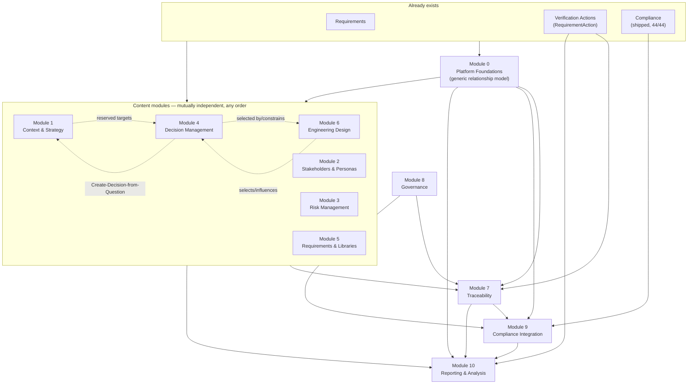
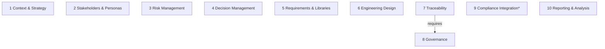

# Future Modules (Sept 2026) — Plan Index

This document is the entry point for the ten-module roadmap proposed in
[future-modules-2026-09-overview.md](future-modules-2026-09-overview.md)
("the overview"), plus two modules this planning pass added that aren't
part of the overview's own ten: **Module 0 — Platform Foundations**, the
shared infrastructure (a generic cross-artefact relationship model and
per-project sequence numbering) the overview assumes exists but never
itself proposes; and **Module 11 — Acting on Behalf Of**, a cross-cutting,
optional capability requested directly by the user, deliberately numbered
outside the ten-module sequence and outside Module 0 given its own
authorization-sensitive design questions (see that plan's "Why this is not
Module 0's problem"). This document does not restate the overview's
content — it records the cross-cutting architecture every module plan
below depends on, the dependency graph between all twelve plans, and links
to each one.

**Status:** Proposed. No module in this roadmap has started implementation.
Each module plan's Phase 0 is an **exploratory phase** — it re-examines the
overview's proposal for that module, surfaces gaps and ambiguities the
overview doesn't resolve, and gets explicit user sign-off on scope *before*
any schema, endpoint or UI work begins. This mirrors this repository's
existing practice of gating design-sensitive phases on user confirmation
(see `platform-review-2026-09-plan.md`'s Phase 4/7/8 gates) rather than
having an agent guess at product scope for a ten-module feature set sight
unseen.

**Decided by: User** — the instruction to plan all ten modules, with an
exploratory first phase in each, came directly from the user. The file
layout (one plan per module, plus this index) and the internal phase
breakdown within each module are **Decided by: Agent**, since the overview
itself doesn't prescribe a file structure — flagged per-module below where a
plan had to invent structure the overview doesn't provide.

**Supplementary sources beyond the overview:** the user has since provided
additional source material scoped to a single module rather than the whole
roadmap. [engineering-design-vs-decisions.md](engineering-design-vs-decisions.md)
(added 2026-09-16) is the first of these — a full field-level spec for
Module 6 (Engineering Design), which the main overview barely covers, plus
the reasoning for why Design and Decision are kept as separate artefacts.
Module 6's own plan now treats it as the primary source for that module,
the same role the main overview plays for the other nine.

## Why this isn't in docs/requirements.md yet

`docs/requirements.md` is the authoritative, agent-cannot-edit requirements
source. The overview is explicitly `Status: Proposed` — a feature proposal,
not yet adopted requirements. These plans work from the proposal as-is; they
do not promote it into `docs/requirements.md`. If and when a module's Phase 0
concludes and the user wants its scope adopted as real product requirements,
that update to `docs/requirements.md` is the user's to make (or to direct
explicitly), not something this plan does on its own.

## Module plans

| # | Module | Plan | Depends on (hard) | Depends on (soft — enriches, not blocks) | Overview section(s) |
|---|---|---|---|---|---|
| 0 | Platform Foundations | [module-00-platform-foundations-plan.md](module-00-platform-foundations-plan.md) | — (build this first) | — | not in the overview's own list — see "Module dependency graph" below |
| 1 | Context & Strategy | [module-01-context-and-strategy-plan.md](module-01-context-and-strategy-plan.md) | Module 0 | — | §5–9 |
| 2 | Stakeholders & Personas | [module-02-stakeholders-and-personas-plan.md](module-02-stakeholders-and-personas-plan.md) | Module 0, Requirements (existing) | — | §10 |
| 3 | Risk Management | [module-03-risk-management-plan.md](module-03-risk-management-plan.md) | Module 0, Requirements (existing) | Context (1), Decisions (4), Design (6), Verification (existing) | §11 |
| 4 | Decision Management | [module-04-decision-management-plan.md](module-04-decision-management-plan.md) | Module 0 | Context & Strategy (1) — Open Question/Pain Point/Strategy/Guiding Principle relationship targets only (Phase 6) | §13 (labelled §10 in the source doc; see note in that plan) |
| 5 | Requirements & Requirement Libraries | [module-05-requirements-and-libraries-plan.md](module-05-requirements-and-libraries-plan.md) | — (already largely built; does not need Module 0) | — | §14–16 |
| 6 | Engineering Design | [module-06-engineering-design-plan.md](module-06-engineering-design-plan.md) | Module 0, Requirements (existing) | Decisions (4) — design/decision are usually created together, per the doc below | §3 Module 6 list, now superseded by [engineering-design-vs-decisions.md](engineering-design-vs-decisions.md) — a supplementary source the user provided 2026-09-16 with a full field-level spec, no longer the thinnest module |
| 7 | Traceability | [module-07-traceability-plan.md](module-07-traceability-plan.md) | Module 0, Module 8 (Governance) | Every artefact type its configured rules target (1, 2, 3, 4, 5, 6, 9) — a rule targeting a type that doesn't exist yet just can't be configured yet | §17–28 |
| 8 | Governance / Policies | [module-08-governance-plan.md](module-08-governance-plan.md) | — (does not itself need Module 0 — it governs artefacts, it doesn't create relationships between them) | Traceability (7) and Compliance (9) results, once those exist, feed Governance Health | §29–36 |
| 9 | Compliance Integration | [module-09-compliance-integration-plan.md](module-09-compliance-integration-plan.md) | Module 0, Compliance (existing, shipped), Module 7, Module 8 | Risk (3), Decisions (4) — reserved relationship targets | §37 |
| 10 | Reporting & Analysis | [module-10-reporting-and-analysis-plan.md](module-10-reporting-and-analysis-plan.md) | Module 0 | Consumes whatever of 1–9 is enabled at generation time; degrades gracefully, never blocks on a module not existing | §47 |
| 11 | Acting on Behalf Of | [module-11-acting-on-behalf-of-plan.md](module-11-acting-on-behalf-of-plan.md) | — (depends on nothing; enriches everything) | Every approval-shaped action across the product, existing and new — Requirement/ChangeRequest approval today, Decision/Design/Risk/Strategy/Compliance approval once those modules exist | not in the overview at all — requested directly by the user 2026-09-16, security-sensitive (see that plan's SOC 2 policy consultation) |

**Recommended build order** (from overview §46, with Module 0 inserted
ahead of everything as this session's own addition): 0 → 1 → 2 → 4 → 5 →
(3 & 6 together) → 8 → 7 → 9 → 10. The user has already indicated Module 4
(Decision Management) is the one to pick up first after Module 0 exists,
ahead of Module 1 and 2 in strict overview order — see "Is building Module
4 first actually possible?" below, and that plan's own Status section, for
the resulting dependency note. **Module 11 is deliberately left out of
this sequence** — it depends on nothing and blocks nothing, so it can be
picked up whenever, independent of everywhere else in the list.

## Is building Module 4 (Decision Management) first actually possible?

**Yes**, once Module 0 exists — and Module 4 does not need any of the
other nine content modules to be useful. Concretely:

- Module 4's **hard** dependency is only on Module 0 (the generic
  relationship model) — needed for Decision ↔ Requirement (Requirement
  already exists today) and Decision ↔ Decision (supersedes/depends on/
  conflicts with — self-referential, needs nothing external). Everything
  in Module 4's Phases 1–5 (the Decision record itself, its lifecycle,
  approval, supersession, and these two relationship types) is buildable
  the moment Module 0 ships.
- Module 4's **soft** dependency is on Module 1 (Context & Strategy) —
  purely for five *reserved* relationship targets (Open Question, Pain
  Point, Strategy, Guiding Principle) and the "Create Decision from Open
  Question" workflow, all of which live in Module 4's own Phase 6, already
  scoped as blocked-and-deferred in that plan. Building Module 4 first just
  means Phase 6 sits open (clearly marked "blocked") until Module 1 exists
  — it does not block or weaken Phases 1–5, and nothing has to be built
  twice or reworked when Module 1 eventually lands.
- The one thing that changes by going Module 4-before-Module-1 rather than
  the overview's own order: Module 1's Phase 0 no longer has to make the
  relationship-model fork decision (Module 0 now owns that), so Module 1's
  own plan is slightly lighter than originally drafted — see its Status
  section.

So the answer is structural, not a workaround: pulling the relationship
model out into Module 0 is *what makes* Module 4-first possible without
compromising anything. Before that split, Module 4's own Phase 0 would have
had to independently invent the relationship-model fork Module 1 was
supposed to own — workable, but exactly the kind of duplicated, order-
dependent design work Module 0 now avoids for every module, not just this
one.

## Module dependency graph

Solid arrows are **hard** dependencies (the target cannot be built, or
cannot do anything useful, without the source). Dotted arrows are **soft**
dependencies (the source enriches or extends the target once available, but
the target ships and works without it — usually a reserved relationship
type sitting unused until its target artefact exists). Grey nodes are
already-shipped, existing capability this roadmap builds on rather than
replaces. **Module 11 is omitted from this diagram deliberately** — like
Traceability (7) and Reporting (10) in the compatibility matrix further
below, it has no single meaningful pairwise relationship to draw: it
depends on nothing, and it enriches essentially every approval-shaped
action in every other module (plus existing, already-shipped
functionality), so drawing it would mean an edge into nearly every node
on the page for no added signal.

*(Rendered and checked with `@mermaid-js/mermaid-cli` before this was
committed to the doc, per this project's Mermaid-validation rule — no
broken fences, no dangling nodes.)*

Reading this graph for build-order purposes: **Module 0 is the only true
"must build before everything" node.** The six content modules (1, 2, 3, 4,
5, 6) are otherwise mutually independent — their only direct links to each
other are the three dotted, soft ones shown (Module 1 ↔ Module 4's reserved
relationship targets, Module 6 → Module 4's design-to-decision link) — and
can be sequenced in whatever order delivers value soonest. The overview's
own §46 ordering is one reasonable choice, not the only one, which is
exactly why Module 4 can jump the queue. Module 8 (Governance) has no hard
dependency at all and could in principle be built early too. Module 7
(Traceability) is the one real chokepoint after Module 0 — it hard-depends
on Module 8 and, informally, on however many content modules exist yet to
write rules against (a rule can only target a type that already exists),
though it can still ship and be enabled with a smaller rule set if built
before every content module lands. Modules 9 and 10 are natural closers,
consuming whatever exists rather than gating on all nine other modules
finishing.

## Module enablement independence (excluding Module 0)

The graph above answers "what order can these be *built* in." That's a
different question from "once built, can a project *enable* Module X
without also enabling Module Y" — the overview's own design principle
(§2.2 progressive governance, §3.1 "modules should be independently useful
where practical... dependencies should be explicit rather than creating
hidden feature coupling"). This section answers that second question
directly, and **excludes Module 0** from the picture on purpose: Module 0
is core platform infrastructure (the relationship model), not a
project-facing toggle in `docs/modules.md`'s sense — every module needs it
compiled in, the same way every module needs the database to exist; it
isn't part of the "can I turn this on without that" question at all. It
also excludes **Module 11**, for the opposite reason: Module 11 *would* be
an ordinary project-facing toggle, but trivially so — it depends on
nothing, so the answer to "can Module 11 be enabled without Module X" is
always yes, for every X, including every existing feature that predates
this roadmap entirely.

### The enablement-dependency graph

*(Rendered and checked with `@mermaid-js/mermaid-cli` before this was
committed to the doc, same as the graph above.)*

**Reading this literally: there is exactly one hard, enablement-blocking
dependency among all ten modules — Traceability requires Governance.**
Every other module can be turned on in any combination, including any of
the "no" answers implied by your examples:

- **Module 4 (Decision Management) without Module 1 (Context & Strategy):
  yes.** Decision Management has no enablement dependency on Context &
  Strategy at all. A project can run Decisions with Context & Strategy
  switched off permanently, not just "built first" — it would simply never
  be offered the five reserved relationship targets (Open Question, Pain
  Point, Strategy, Guiding Principle) or the Create-Decision-from-Question
  workflow, which only appear once (and if) Context & Strategy is also
  enabled on that project.
- **Module 6 (Engineering Design) without Module 1: yes,** for the same
  reason — no overview text ties Engineering Design's own function to
  Context & Strategy at all; they don't even have a named optional
  relationship (see the matrix below).
- **Module 7 (Traceability) without Module 8 (Governance): no.** This is
  the one real exception, and it's explicit in the overview itself (§3.1:
  "Formal Traceability should require Governance"), not an inference —
  Traceability's whole enforcement model (§20) routes through Governance's
  baseline/approval policies; without Governance, "Required for approval"
  as an enforcement level would have nothing to actually enforce against.

### Compatibility matrix — optional integrations (not dependencies)

This is the other half of the picture: pairs of modules that have a
**named, optional** relationship type in the overview — richer together,
but neither requires the other, and both work standalone. `○` marks a
named optional integration; a blank cell means the overview names no
direct relationship between that pair (they can still both be enabled with
no interaction at all, which is a perfectly normal, supported combination
— blank does not mean "incompatible").

**Modules 7 (Traceability) and 10 (Reporting) are deliberately left out of
this table**, not because they lack integrations, but because they have
*too many to be informative pairwise* — that's their whole design. A
Traceability rule can target any artefact type from any enabled module (a
rule targeting a disabled module's type just can't be configured yet), and
Reporting consumes whatever's enabled and degrades gracefully otherwise
(§47.1). Marking every cell in their row `○` would be true but would tell
you nothing you don't already know from their own descriptions. Their real
constraint is the hard edge above (7 requires 8) plus §37's explicit
Traceability↔Compliance optional link, called out in prose, not the table.

| | 2 | 3 | 4 | 5 | 6 | 8 | 9\* |
|---|---|---|---|---|---|---|---|
| **1** Context & Strategy | ○ | ○ | ○ | | | | ○ |
| **2** Stakeholders & Personas | | | ○ | | ○ | | |
| **3** Risk Management | | | ○ | | ○ | | ○ |
| **4** Decision Management | | | | | ○ | ○ | ○ |
| **5** Requirements & Libraries | | | | | | | |
| **6** Engineering Design | | | | | | | |
| **8** Governance | | | | | | | ○ |

Reading a few cells concretely, matching your own example:

- **Row 8 (Governance) × column 9 (Compliance Integration): `○`.** This is
  your own "Traceability may work with Compliance, but they don't need
  each other" case, one level over — Governance's baseline policies *can*
  include "Compliance complete" as a configurable check (§37), and
  Compliance's own approval/evidence workflow stays entirely
  self-contained either way (it already works today, alone, without
  Governance existing at all).
- **Row 1 × column 5, row 1 × column 6: blank.** Context & Strategy and
  Requirement Libraries have no named relationship in the overview, nor do
  Context & Strategy and Engineering Design — both are legitimate,
  unremarkable combinations (e.g. a project could run Engineering Design
  with Requirements only, no Strategy layer above it, and lose nothing
  Engineering Design itself needs).
- **Row 4 × column 8: `○`.** Flagged in Decision Management's own Phase 0
  (Q2a) — Decision approval authority could be Governance's generic
  approval-policy engine once it exists, or Decision Management's own
  simpler placeholder role if Governance isn't enabled on that project.
  Neither blocks the other.

### The one module that isn't really independent: Module 9

**Module 9 (Compliance Integration) doesn't fit the "independent toggle"
model at all**, and shouldn't be read as comparable to the other nine on
this axis. It has no artefact type of its own — it's integration behaviour
that activates once Compliance (already shipped, and independently
toggleable today, outside this roadmap entirely) is enabled *together
with* Traceability and/or Governance. Enabling "Module 9" in isolation is
close to meaningless: with neither Traceability nor Governance enabled,
there is nothing for it to integrate. This is marked with a `*` in the
diagram and matrix above for that reason — it's less a peer module than a
conditional feature of Compliance that lights up as its dependencies
arrive, and probably shouldn't be a separate `docs/modules.md`-style
toggle at all (a question worth putting to the user directly in Module 9's
own Phase 0, rather than assumed here).

## Cross-cutting architecture (shared by every module plan below)

These sections are referenced, not repeated, from each module plan.

### Module system boundary

Every module here — if and when built — is a real module under this
project's existing modular feature system (`docs/modules.md`,
`backend/app/modules/registry.py`, `frontend/src/modules/registry.ts`), the
same mechanism Compliance already uses. Per `CLAUDE.md`'s "Modular Feature
System Boundary" section: no core file may import from a module's own
directory; a module's contribution to a core surface (nav rail, org/project
admin sections, routers, RBAC roles, MCP tools) goes through
`ModuleDefinition`/`TierAModuleDefinition`'s declarative fields, extending
those types generically when the existing schema has no field for what's
needed. Each module plan's implementation phases should be read with this
constraint already in force — it is not repeated as a line item in every
phase.

### Common role/permission model (overview §4)

Every module plan below should express its own roles in terms of four
conceptual permission levels rather than inventing bespoke CRUD-only roles:

| Permission | Meaning |
|---|---|
| View | Can view the artefact |
| Propose/Create | Can create or propose an artefact |
| Manage | Can edit, classify, assign, link and administer it |
| Approve/Baseline | Can formally approve or baseline it |

Roles are configurable and a user may hold several. No module should require
Organisation Administrator privileges merely to manage its own specialist
content — each module defines its own module-contributed roles (Decision
Owner, Risk Manager, Strategy Approver, etc.) via the module system's
existing role-contribution mechanism, the same way Compliance contributed
"Compliance Manager"/"Compliance Approver" without touching the core
`OrgRole`/`ProjectRole` enums.

### Common relationship model (overview §38–41)

Relationships and Traceability are architecturally distinct:

- **Relationship:** an actual, lightweight, always-available link between two
  artefacts (e.g. "PR-102 depends on PR-101"), independent of whether
  Traceability is enabled.
- **Traceability rule:** a project-configured governance statement about
  which relationships are *expected or mandatory* (e.g. "every Project
  Requirement must derive from a Stakeholder Requirement"), only meaningful
  when the Traceability module is enabled.

Relationships have explicit, named direction (e.g. "derives from" /
"has derived requirement"), consistent with the existing requirement-link
approach already in the codebase. Every module plan below that introduces
new artefact types should extend the existing typed-relationship model
rather than invent a one-off link table for that module — this is the same
principle as the UX style guide's "one component per pattern" rule, applied
to the data layer.

### Governance vs. Traceability vs. relationships — worked distinction

| Layer | Answers | Enabled by |
|---|---|---|
| Relationship | "What is actually linked to what?" | Always available |
| Traceability rule | "Which relationships are *expected*?" | Traceability module |
| Governance policy | "What happens if a required relationship is missing?" (blocks approval/baseline, or just informational) | Governance module |

### Auditing and history (overview §45)

Every governance-sensitive artefact introduced by any of these modules
(Decisions, Strategy, Guiding Principles, Requirement Set versions,
Traceability exceptions, Baselines, and Compliance) must retain enough
history to answer: who created/modified/approved it, when, what changed,
which baseline was active, which relationships existed at the time, and
which exceptions were approved. Each module's own Phase 0 should confirm
whether the existing audit-log pattern (`backend/app/services/audit.py`,
per `CLAUDE.md`'s SOC 2 policy-consultation rule) is sufficient as-is or
needs a module-specific extension — this is called out explicitly in each
plan's Phase 0 rather than assumed.

### Progressive governance (overview §2.2, §3.1, §42)

Every module must remain independently enabled/disableable per project
(except where a hard dependency is declared, e.g. Traceability on
Governance). A project should be able to run "Basic" (Requirements +
Decisions + Context & Strategy only), "Managed" (+ Governance), or "Formal
engineering" (+ Traceability + Compliance) without being forced through
capability it doesn't need. Enabling a module with dependencies must
explain those dependencies and offer to enable them, not silently pull in
functionality.

### Documentation obligations that apply to every module

Per `CLAUDE.md`, once any phase beyond Phase 0 actually lands: `docs/decisions.md`
gets an entry per phase; `docs/solution-architecture.md` gets updated for
architectural changes; the docs website (`docs/website/`) gets a judgement
call on whether the change is user-facing enough to need a page; Playwright
e2e + Storybook coverage is required for new frontend UI; a backend test
pins every new backend behaviour; and every new decision recorded in any of
these plans must carry a **Decided by: User** or **Decided by: Agent** tag.
These obligations are not repeated line-by-line in every phase of every
module plan — they apply throughout, the same as they do for any other work
in this repository.

## Foundational finding: the existing relationship model is requirement-specific

**This finding is now owned by [Module 0 — Platform Foundations](module-00-platform-foundations-plan.md),
not Module 1** — split out on 2026-09-16 once it became clear the same
infrastructure blocks Module 4 (Decision Management) just as much as
Module 1, and that fixing it in place, ahead of every content module,
is what makes build order genuinely flexible (see "Is building Module 4
first actually possible?" above). This section stays here as the
originally-recorded finding; Module 0's own plan carries the actual
decision fork and Phase 0/1 breakdown now.

**A second, similarly-shaped finding was added to Module 0 the same day**,
from an explicit audit of every module plan for "what else is being done
similarly in multiple modules": per-project sequence-number/unique-code
generation (`next_requirement_seq`/`next_action_seq` on `Project`, each
with its own near-duplicate service function) is about to be repeated
roughly eight more times across this roadmap's new artefact types. See
Module 0's own "second fork" section for the detail — not repeated here.
That same audit also confirmed a few other recurring patterns
(`ReviewComment`/`CommentFile`, the audit log, `Notification`) are
*already* sufficiently generic and need no Module 0 work, and flagged two
smaller, non-blocking items (a shared archive-column mixin; the
supersession/revision-control pattern already falling out of the
relationship model plus a status enum, needing no new table) — also
recorded in Module 0's "Related, non-blocking" section.

This was checked directly against the current schema (not assumed), because
it gates almost everything else in this roadmap:

`RequirementLink` (`backend/app/models/requirement.py:186`) and
`RequirementLinkTypeDefinition` (`backend/app/models/requirement_link_type.py`)
are exactly the kind of org-definable, directional, typed relationship
model the overview calls for in §38–41 ("a common typed relationship model
across the new artefacts... extensible so future artefact types can
participate without redesigning the entire relationship subsystem") — but
today, both FK columns on `RequirementLink` point at `requirements.id`
only. It is a requirement-to-requirement link table, not a polymorphic
artefact-to-artefact one. The one other relationship table that exists,
`RequirementActionLink`, is likewise a dedicated join table for exactly one
artefact-type pair (Action ↔ Requirement), not a generalised mechanism.

This matters immediately, not just for the Traceability module: overview
§2.3 requires relationships (e.g. Pain Point → drives → Strategy, Stakeholder
→ has need → Requirement, Decision → resolves → Open Question) to work
*without* Traceability enabled, and multiple content modules (Context &
Strategy, Decision Management, at minimum) need cross-artefact
relationships from day one, regardless of which of them is built first. So
the relationship-model question cannot be deferred to the Traceability
module (§7), and — as originally recorded here — cannot be left to
whichever content module happens to be built first either, since that
would make build order a hidden dependency of the decision itself. That's
exactly why it was pulled out into its own prerequisite, Module 0, once
the question of building Module 4 before Module 1 came up — see that
module's own plan for the actual decision fork and phases.

The two realistic shapes, for Module 0's Phase 0 to actually decide (this
index only frames the choice, it does not make it):

- **Generalise `RequirementLink` into a polymorphic relationship table** —
  `source_type`/`source_id`, `target_type`/`target_id`, `link_type_id` (with
  `RequirementLinkTypeDefinition` either reused as-is or given an optional
  applicable-type-pair constraint), one table for every artefact pair.
  Matches "one component per pattern"; makes a generic Traceability-rule
  engine and generic matrix/coverage queries straightforward later.
- **Keep dedicated per-pair join tables** (as `RequirementActionLink`
  already does), one new table per artefact-type pair introduced by each
  module. Matches existing precedent exactly; avoids a large migration
  touching the existing, heavily-used `requirement_links` table; but means
  Traceability's generic rule/matrix engine (§18–28, which explicitly wants
  to configure *arbitrary* artefact-type-pair rules) has to know about N
  join tables rather than querying one.

**Decided by: Agent** (this framing only — not the choice itself, which
Module 0's Phase 0 must put to the user explicitly, since it is a real
architectural fork with a migration-cost/generality trade-off, not a
mechanical call).

## Open cross-module questions (for the user, not resolved by this index)

These don't belong to any single module's Phase 0 — they're structural
questions the overview leaves open across the whole roadmap:

1. **Personas as a stakeholder subtype vs. separate table.** The overview
   (§10.1) says "personas should normally be modelled as a specialised
   stakeholder type rather than an unrelated concept" but doesn't settle
   whether that means one `stakeholders` table with a `kind` discriminator,
   or a `personas` table with a foreign key to `stakeholders`. Raised again,
   more concretely, in Module 2's own Phase 0.
2. **Which modules are first-party (in this repo) vs. plausible third-party
   extensions.** The existing module system supports both. Given these are
   core, broadly-applicable capabilities (not organisation-specific), the
   working assumption is all ten are first-party — flagged here as
   **Decided by: Agent** (assumption), to be confirmed or overridden
   whenever the first of these modules actually starts implementation
   (Module 0 itself is infrastructure, not a registered module in the
   `docs/modules.md` sense, so this question is really about Module 4 or
   whichever content module goes first).
3. **Portfolio/Programme strategy scope.** Overview §5.2 says the data model
   should allow future scopes beyond Organisation/Project "without requiring
   a fundamental redesign," but doesn't ask for them now. Each module plan
   below treats this as a non-goal for its own build, only a constraint on
   not painting the schema into a corner.
4. **Where "Verification Action" actually lives.** The overview repeatedly
   references Verification (Traceability §18, §21, §25–27; Risk §11.5;
   Reporting §47.4/47.6) as though it already exists as a first-class
   artefact, but it isn't one of the ten modules and isn't specified
   anywhere in the overview. Confirmed by reading the current schema: this
   already exists as `RequirementAction` / `RequirementActionLink`
   (`backend/app/models/requirement_action.py`) — a project-scoped action
   (e.g. a review or a test) with its own `unique_code`, outcome status,
   assignee and due date, linked many-to-many to the requirements it helps
   satisfy. Every module plan below that references "Verification Action"
   (Traceability, Risk, Reporting) should integrate with `RequirementAction`
   as-is rather than designing a new artefact — **Decided by: Agent**
   (confirmed by reading the model, not assumed), flagged per-module where
   it's load-bearing so a later session doesn't re-invent it.

   **Update, 2026-09-16:** `RequirementAction` is also the answer to a
   general task-assignment need raised directly by the user ("set a task
   for someone to create a design document") — no new module needed for
   that, since assignee/due-date/outcome-status already exist on this
   model. What *does* need work is `RequirementActionLink`, today a
   requirement-only per-pair table — generalising it to target any
   artefact type (Design, Risk, Decision, ...) is folded into
   [Module 0](module-00-platform-foundations-plan.md)'s own relationship-
   model fork (the same choice as `RequirementLink`'s), not resolved
   independently by each module that wants to link an Action to its own
   artefact type — Modules 3 and 6 were both about to do exactly that
   independently before this was caught and corrected.
