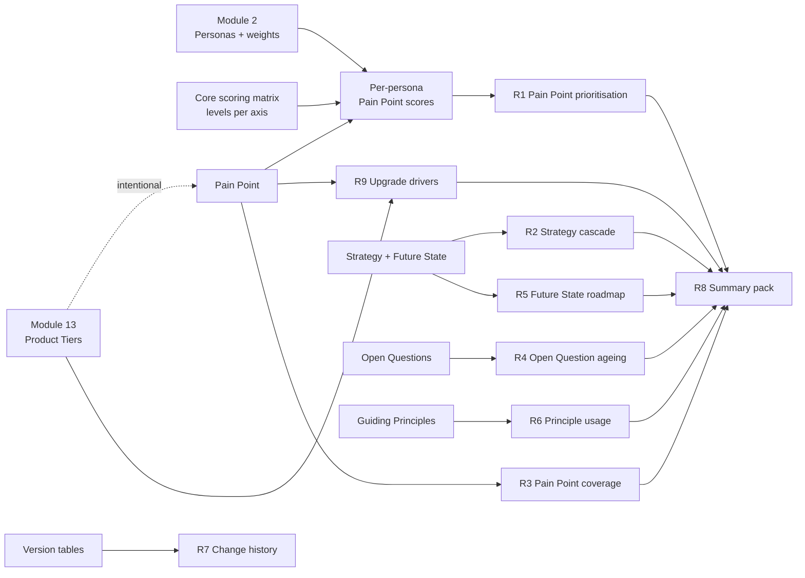
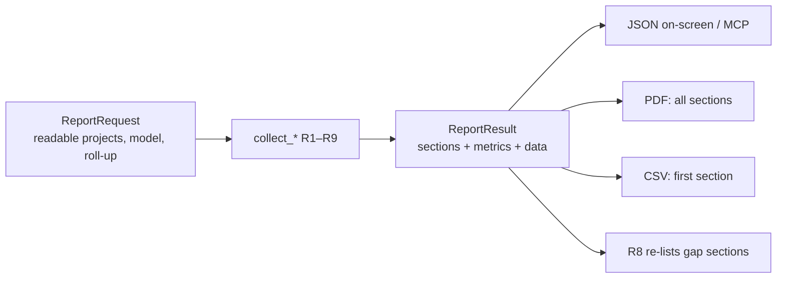
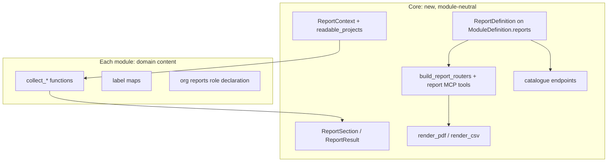

# Module 1 — Context & Strategy — Implementation Plan

See [future-modules-2026-09-index.md](future-modules-2026-09-index.md) for
cross-cutting architecture referenced throughout. **This module now depends
on [Module 0 — Platform Foundations](module-00-platform-foundations-plan.md)**
for the generic cross-artefact relationship model — that infrastructure was
originally drafted as this module's own Phase 1, then split out on
2026-09-16 once it became clear Module 4 (Decision Management) needed the
exact same thing and shouldn't have to wait on Context & Strategy to get
it. See the index's "Module dependency graph" for the full picture.

**Source:** [future-modules-2026-09-overview.md](future-modules-2026-09-overview.md)
§5–9 (Context & Strategy, Pain Points, Future State, Guiding Principles,
Open Questions).

**Status:** Phase 0 complete (2026-09-28, user sign-off obtained — see
"Phase 0 resolutions" below). Phase 1 complete (2026-09-28 — see "Phase 1
notes" below). Phase 2 (Future State) complete (2026-09-28 — see "Phase 2
notes" below). Phase 3 (Pain Points) complete (2026-09-28 — see "Phase 3
notes" below). Phase 4 (Guiding Principles) complete (2026-09-28 — see
"Phase 4 notes" below). Phase 5 (Open Questions) complete (2026-09-28 —
see "Phase 5 notes" below). Phase 6 (Cross-artefact relationships) complete
(2026-09-29 — see "Phase 6 notes" below); Phase 7 (frontend UI) split into
five per-artefact sub-phases 2026-09-29 (see that phase's own note) —
Phase 7.1 (Strategy) complete (2026-09-29 — see "Phase 7.1 notes" below);
Phase 7.2 (Future State) complete (2026-09-29 — see "Phase 7.2 notes"
below); Phase 7.3 (Pain Point + Pain Point Type admin) complete
(2026-09-29 — see "Phase 7.3 notes" below); Phase 7.4 (Guiding Principle)
complete (2026-09-29 — see "Phase 7.4 notes" below); Phase 7.5 (Open
Question) complete (2026-09-29 — see "Phase 7.5 notes" below), the fifth
and last Phase 7 sub-phase. Phase 8 (docs website coverage) complete
(2026-09-29 — see "Phase 8 notes" below), closing the original 13 phases.
Reopened 2026-10-04 for the Reporting extension (Phases 9–14: per-persona
Pain Point scoring plus reports R1–R9); Phase 9 sign-off and Phase 10
(generic scoring-matrix core) complete 2026-10-04 — see "Phase 10 notes";
Phase 11 (per-persona Pain Point scoring + intentional flag) complete
2026-10-05 — see "Phase 11 notes"; Phase 12 (report backend R1–R9) complete
2026-10-05 — see "Phase 12 notes".
First *content* module in
the overview's recommended build order (§46 Phase 1, after Module 0),
though the user asked for Decision Management (Module 4) and Fine-Grained
Access Control (core) to be picked up first in practice — both now shipped;
see [future-modules-2026-09-index.md](future-modules-2026-09-index.md)'s
resequenced table. This module remains a soft dependency for Decision
Management's own Phase 7 (the reserved relationship targets and the
"Create Decision from Open Question" workflow) — Phase 6 confirmed those
three relationship types (Strategy -> informs -> Decision, Guiding
Principle -> guides -> Decision, Open Question -> resolved by -> Decision)
stay reserved, not populatable, until Module 4's own Phase 7 builds the
wiring from its own side (see "Phase 6 notes" below) — but nothing here
blocks any other already-shipped module.

**2026-09-28 update:** Phase 0 sign-off changed the shape of this module
from four artefact types to **five** — Future State is now a separate,
first-class artefact rather than fields folded into Strategy (Phase 0 Q1,
**Decided by: User**, reversing this plan's own original recommendation).
This added a phase (Future State gets its own build phase, inserted as
Phase 2) and rippled into the relationships/frontend/docs phases below.
Every phase number below is post-resequencing; do not cross-reference the
pre-2026-09-28 numbering from other plans without checking this note.

## Status / Resume Here

**18 / 20 phases complete — reopened 2026-10-04 for the Reporting extension (Phases 9–14, see "Reporting extension" below). Phases 9–12 and 12b are done (12b, the core report framework, shipped 2026-10-06). Phase 13 (shared Reports UI, built on 12b's catalogue endpoints) is next.** Original scope (Phases 0–8) was 13/13 complete on 2026-09-29. Phase 7
split into five per-artefact sub-phases, 2026-09-29 — see that phase's own
note; all five shipped 2026-09-29. Phase 8 (docs website coverage), the
module's last phase, shipped the same day — see "Phase 8 notes" below.

| # | Phase | Status |
|---|-------|--------|
| 0 | Exploratory: scope & open questions | [x] Complete (2026-09-28) |
| 1 | Organisation & Project Strategy | [x] Complete (2026-09-28) |
| 2 | Future State | [x] Complete (2026-09-28) |
| 3 | Pain Points | [x] Complete (2026-09-28) |
| 4 | Guiding Principles | [x] Complete (2026-09-28) |
| 5 | Open Questions | [x] Complete (2026-09-28) |
| 6 | Cross-artefact relationships wired between all of the above (via Module 0) | [x] Complete (2026-09-29) |
| 7.1 | Frontend UI — Strategy | [x] Complete (2026-09-29) |
| 7.2 | Frontend UI — Future State | [x] Complete (2026-09-29) |
| 7.3 | Frontend UI — Pain Point (+ type admin) | [x] Complete (2026-09-29) |
| 7.4 | Frontend UI — Guiding Principle | [x] Complete (2026-09-29) |
| 7.5 | Frontend UI — Open Question | [x] Complete (2026-09-29) |
| 8 | Docs website coverage | [x] Complete (2026-09-29) |
| 9 | Exploratory: reporting scope & scoring design sign-off | [x] Resolved (2026-10-04) |
| 10 | Generic scoring-matrix infrastructure (core) | [x] Complete (2026-10-04) |
| 11 | Per-persona Pain Point scoring + intentional flag | [x] Complete (2026-10-05) |
| 12 | Report generation backend (R1–R9) | [x] Complete (2026-10-05) |
| 12b | Core report framework (extracted from Phase 12) | [x] Complete (2026-10-06) — see "Phase 12b notes" |
| 13 | Reports UI (shared core UI + per-module views) | [ ] Not started — builds on 12b (now shipped) |
| 14 | Docs website + seeds verification | [ ] Not started |

## Phase 0 — Exploratory: Requirements Clarification & Design Validation

**Why this phase exists:** this module introduces new artefact types at
once (Strategy, Pain Point, Future State, Guiding Principle, Open
Question — five, after Q1's resolution below). Getting their field lists
and lifecycle states wrong is expensive to unwind once real project data
exists, so each gets confirmed before Phase 1.

**Activities:**

1. **Confirm Module 0 exists and its relationship-model shape** before
   relying on it in Phase 6 — confirmed: `ArtefactLink`
   (`backend/app/models/relationship.py`), `ReviewTargetType`
   (`backend/app/models/enums.py`), and `RequirementLinkTypeDefinition`
   (`backend/app/models/requirement_link_type.py`) all exist and match the
   shapes this plan's recommendations assume.
2. **Resolve open questions** (below).
3. **Confirm module boundaries against Requirements**: Requirement Types
   already include "Business Requirement" (overview §14/11.1 default list)
   — confirmed this module doesn't duplicate or compete with that; Strategy
   and Pain Points *drive* requirements, they aren't requirements.
4. **Confirm scope, org vs. project**: Strategy explicitly supports both
   scopes (§5.2) — resolved as a single table with a scope discriminator
   (Q2). Pain Point type configurability (§6.2) resolved as a two-tier
   org-shared-with-project-override model (Q3), not a straight mirror of
   `RequirementLinkTypeDefinition`.
5. Produced a confirmed field-level spec addendum below — **user sign-off
   obtained 2026-09-28.**

**Exit criteria:** user sign-off on the five artefacts' field lists and
lifecycle states below, before any migration. **Met.**

### Phase 0 resolutions (2026-09-28, all Decided by: User unless noted)

1. **Future State: separate artefact or Strategy sub-record?** This plan
   originally recommended folding Future State into Strategy as fields,
   per §7's own hedge ("may be represented as part of Strategy... without
   changing the conceptual model"). **User overrode this recommendation:**
   Future State is a **separate, first-class artefact** with its own
   table, lifecycle and RBAC. Reasoning given: organisation strategy and
   project/product strategy are tracked separately, and organisational
   outcomes are typically vaguer/higher-level than project outcomes —
   collapsing Future State onto Strategy would force one shape onto both.
   Strategy itself keeps its own short current-state/desired-future-state
   text fields (§5.2/5.3, unchanged), while the new Future State artefact
   provides the fuller structured elaboration (current_state, desired_state,
   target_date, outcomes, success_measures, constraints, assumptions),
   connected via the `Strategy → defines → Future State` relationship
   (§5.6) rather than embedded as columns. See Phase 2 below.
   - **Follow-on, Decided by: User:** Future State's lifecycle and
     permissions mirror Strategy's in full — `Draft → Proposed → Under
     Review → Approved → Active → Superseded/Retired`, Strategy
     Owner/Approver-equivalent roles, and (per Q4 below, applied
     consistently) a full version-history table, not an audit-trail-only
     model. Reasoning: target dates and outcomes are consequential enough
     to warrant the same review gate as the Strategy driving them.
   - **Follow-on, Decided by: Agent (flagged for awareness, not asked
     separately):** Future State gets the same org/project scope
     discriminator as Strategy (Q2), by direct analogy — the overview
     doesn't say whether Future State itself carries a scope or only
     inherits one implicitly from whichever Strategy defines it, but since
     it's now a standalone artefact linked via `ArtefactLink` rather than a
     child row with an FK to one specific Strategy, it needs its own scope
     to be listed/filtered independently the same way Strategy is. Revisit
     if a future phase finds a Future State record that logically needs to
     belong to more than one Strategy at differing scopes.
2. **Strategy scope duplication.** Confirmed: one table with a `scope`
   discriminator (`organization` / `project`) and exactly one of
   `organization_id`/`project_id` set, matching §5.2's explicit ask that
   the model support future Portfolio/Programme scopes without a
   fundamental redesign.
3. **Pain Point type configurability: org or project table?** This plan
   originally recommended pure project-scoped copy-on-create. The user's
   first answer ("live shared org reference," i.e. the
   `RequirementLinkTypeDefinition` pattern) directly conflicted with
   §6.2's explicit "configurable on a per-project basis... project
   administrators should be able to add/rename/reorder/disable/remove
   types" wording — a live shared reference means one project's rename
   would affect every sibling project referencing the same row. Flagged
   this conflict back to the user (**Decided by: Agent**, per this
   codebase's Critical Thinking instruction to say so when disagreeing,
   not silently implement a contradiction). **Resolved, Decided by:
   User:** a **two-tier model** — org table is the shared base; a project
   can locally override an org type's display name and enabled/disabled
   state without affecting siblings.
   - **Design (Decided by: Agent, following from the user's resolution):**
     `PainPointTypeDefinition` (org-scoped: `organization_id`, `name`,
     `display_order`, `is_active` — org admins manage, same shape as
     `RequirementLinkTypeDefinition`), plus `ProjectPainPointType`
     (project-scoped: `project_id`, nullable `org_type_id` FK, nullable
     `name_override`, nullable `display_order_override`, `is_enabled`
     default `true`). A row with `org_type_id` set overrides one org type
     locally (name/order/enabled) without touching the org row or other
     projects' overrides; a row with `org_type_id` null is a fully
     project-local type not backed by any org row, satisfying §6.2's "Add
     types" as a genuinely project-only action too. Effective list for a
     project = every active org type (name/order taken from its project
     override if one exists) plus every project-local type.
   - **Note correcting this plan's original text:** the original Phase 0
     Q3 also named "Guiding Principle type configurability" alongside Pain
     Point's. Re-checked against §8.3 — Guiding Principles have no `type`
     field at all (only `scope`, already resolved as org/project, same as
     Strategy). That was a copy/paste error in this plan; this two-tier
     model applies to Pain Point types only.
   - **Nested-projects fallback check (per `CLAUDE.md`'s "Nested
     (Hierarchical) Projects" rule), Decided by: Agent:** this table
     shape does not need the `resolve_effective_action_types`-style
     parent/child fallback. That mechanism exists for a vocabulary that
     lives *only* at the project level (so an unconfigured child needs to
     borrow its parent's rows); here the org table is already the always-
     present base every project — root or child — sees identically, and
     an empty `ProjectPainPointType` table already means exactly "use org
     defaults as-is," which is the correct empty-state reading with no
     extra inheritance logic needed. Revisit only if child-project-specific
     org-type overrides are later requested (i.e. a child inheriting its
     *parent project's* overrides, not just the org's).
4. **Guiding Principle versioning.** This plan originally recommended an
   audit-trail-only model as disproportionate for a short text field.
   **User overrode this: a full version-history table**
   (`GuidingPrincipleVersion`, mirroring `RequirementVersion`'s temporal
   shape — `valid_from`/`valid_to`, snapshot columns, no separate
   audit-log-only path). Applied consistently (per Q1's follow-on) to
   Strategy's own revision control (§5.4, already required, previously
   left "resolve the same way as Q4") and to Future State — so
   `StrategyVersion`, `FutureStateVersion`, and `GuidingPrincipleVersion`
   are all full version-history tables, each following `RequirementVersion`'s
   pattern.
5. **Open Question → Decision link timing.** Confirmed, unchanged from
   this plan's original text: this module ships the Open Question artefact
   and *reserves* the relationship type only; the "Create Decision from
   Open Question" workflow itself lives in Module 4's Phase 7 (renumbered
   from Phase 6 — see that plan's own Status section), not duplicated here.
6. **Comments/attachments/evidence reuse.** Confirmed: all five artefact
   types reuse the existing generic `ReviewComment`/`CommentFile`
   machinery via new `ReviewTargetType` members
   (`STRATEGY`, `FUTURE_STATE`, `PAIN_POINT`, `GUIDING_PRINCIPLE`,
   `OPEN_QUESTION`) rather than bespoke per-artefact comment tables.
7. **Nav placement.** This plan originally recommended one grouped
   "Context & Strategy" nav section using the UX style guide's `Tabs`
   pattern. **User overrode this: separate top-level nav-rail entries**
   for each of the five artefact types, diverging from the style guide's
   usual grouping preference. Noted explicitly per `CLAUDE.md`'s
   requirement to flag style-guide deviations rather than silently diverge
   — this is the user's deliberate call, not an oversight, so Phase 7
   should proceed with five top-level entries and does not need a `Tabs`
   grouping component built for this module.

## Phase 1 — Organisation & Project Strategy

**Scope** (fields from §5.2–5.3, per Phase 0 Q2/Q4 resolutions): one
`Strategy` table with `scope` (org/project) discriminator and exactly one
of `organization_id`/`project_id` set; objective/strategic theme, current
state, desired future state (short free-text fields — the fuller
structured elaboration lives on the separate Future State artefact, Phase
2), rationale, expected outcomes, constraints, measures of success,
priority, time horizon, status. Lifecycle: `Draft → Proposed → Under
Review → Approved → Active → Superseded/Retired` (§5.4) — a six-state
lifecycle, distinct from Requirement's four-state one; needs its own enum.
Approved strategy is revision-controlled via a full `StrategyVersion`
table (Phase 0 Q4, applied to Strategy).

**Why:** without a first-class Strategy record, "why is this project doing
this" lives in tribal knowledge; §5.2's stated goal (
`Organisation Strategy → Project Strategy → Requirements → Implementation`)
is otherwise unachievable.

**Roles:** Strategy Owner (Manage), Strategy Approver (Approve), project
members (View + Propose) — per §5.5, plus organisation-level equivalents
for org-scoped strategy.

## Phase 1 notes (2026-09-28)

Built the Strategy artefact's full backend: data model, versioning,
lifecycle, RBAC, comments/attachments, and a working CRUD/lifecycle API for
both org- and project-scoped Strategies — combining what Decision
Management's own plan split across two phases (data model, then API) into
this one phase, since a data-model-only phase would have left Strategy's
central org/project dual-scope design (Phase 0 Q2) untested until later.

**New files** (all under `backend/app/modules/context_strategy/`, a new
first-party module registered in `backend/app/modules/__init__.py`):
`__init__.py`, `enums.py` (`StrategyScope`, `StrategyPriority`,
`StrategyTimeHorizon`, `StrategyStatus`), `models.py` (`Strategy`,
`StrategyVersion`, `StrategyComment`, `StrategyCommentFile`,
`StrategyFile`), `service.py` (creation, `apply_new_version`, the seven
lifecycle-transition functions, `resolve_strategy_file_project_id`),
`schemas.py`, `_shared.py` (RBAC composition and the identity+version ->
API-shape mapper shared by both routers), `router.py` (org-scoped,
mounted at `/api/v1/orgs/{organization_id}/modules/context_strategy`),
`project_router.py` (project-scoped, mounted at `/api/v1/projects/
{project_id}/modules/context_strategy`), `module.py` (`MODULE_DEFINITION`),
`migrations/0048_context_strategy_data_model.py` (five tables:
`strategies`, `strategy_versions`, `strategy_comments`,
`strategy_comment_files`, `strategy_files`), and
`tests/test_context_strategy_api.py` (15 tests).

**Scope decisions, each a judgment call this phase had to make that the
plan text didn't fully settle:**

- **Comments/attachments: module-local tables, not a new `ReviewTargetType.
  STRATEGY` member (Decided by: Agent — flagged explicitly, a genuine
  deviation from this phase's own brief).** The brief asked to "check how
  Decision Management wired its own `ReviewTargetType` member end-to-end
  and mirror that" — checked, and **Decision Management never added a
  `ReviewTargetType` member at all**; its own `models.py` docstring records
  the same module-local-table choice for the same reason repeated here (the
  core `ReviewComment`/`CommentFile`/`ReviewTargetType` machinery has never
  been extended by any module, and a Strategy comment/attachment only ever
  targets one `Strategy`, so a module-local table is simpler, not just more
  boundary-correct). Adding a member to `ReviewTargetType` — a plain, closed
  `enum.Enum` in a core file (`app/models/enums.py`) — to support one
  specific module would also be exactly the "hand-edit a core enum per
  module" failure mode `CLAUDE.md`'s Modular Feature System Boundary
  section prohibits (the same class of issue as `ProjectSequenceCounter.
  artefact_type`'s own prior correction). Built `StrategyComment`/
  `StrategyCommentFile`/`StrategyFile` instead, mirroring `DecisionComment`/
  `DecisionCommentFile`/`DecisionFile` exactly.
- **No `unique_code` field (Decided by: Agent).** Unlike `Decision`, this
  phase's own field-level spec (above) lists no unique-code/identifier
  field for Strategy, and `services.sequences.generate_unique_code`'s
  underlying `ProjectSequenceCounter` is project-scoped only — an org-scoped
  Strategy has no project to hang a per-project sequence counter off of.
  Rather than inventing an org-level sequence mechanism this phase's scope
  never asked for, Strategy is identified by UUID + title only, same as
  `DecisionTemplateDefinition` (also org-scoped, also no unique code).
- **Seven `StrategyStatus` enum members reconciled against the plan's own
  "six-state lifecycle" phrasing (Decided by: Agent, flagged for
  awareness).** `Draft -> Proposed -> Under Review -> Approved -> Active ->
  Superseded/Retired` reads as six *positions*, the last of which resolves
  to one of two distinct terminal values a single `status` column can't
  combine into one — so `SUPERSEDED` and `RETIRED` are both real, separate
  enum members (seven total), the same shape `DecisionStatus` already uses
  for its own linear-chain-plus-terminal-branches lifecycle. See
  `enums.StrategyStatus`'s own docstring for the full reasoning.
- **No `REJECTED` state; `PROPOSED`/`UNDER_REVIEW` send back to `DRAFT`
  instead (Decided by: Agent).** The plan's own lifecycle text names no
  rejection-branch state (unlike `DecisionStatus`), so a Strategy sent back
  for rework returns to `DRAFT` via a `send-back` endpoint (comment
  mandatory, mirroring every other mandatory-comment-on-rejection rule in
  this codebase) rather than landing in a new terminal state nothing asked
  for.
- **No automatic supersession-link side effect on `ACTIVE -> SUPERSEDED`
  (Decided by: Agent, deliberately narrower than Decision Management's own
  `create_supersession`).** Decision Management's `SUPERSEDED` transition is
  driven by creating a typed `ArtefactLink` between two Decisions; building
  the equivalent for Strategy would mean doing part of Phase 6's job
  (cross-artefact relationship wiring) inside Phase 1. `supersede_strategy`
  is a plain status transition here — a future Phase 6 pass can layer the
  actual `ArtefactLink` recording on top of it without changing this
  function's contract.
- **RBAC: four module roles, not two (Decided by: Agent, following
  directly from Phase 0 Q2).** Strategy is the first module whose own
  artefact is scoped at *either* the org or the project level, so it
  registers `strategy_owner`/`strategy_approver` (project) *and*
  `org_strategy_owner`/`org_strategy_approver` (org) side by side —
  `_shared.py` picks whichever pair applies from the Strategy row's own
  `scope`. Approve-tier actions additionally accept a Fine-Grained Access
  Control custom-role grant of the unscoped `(strategy, approve_baseline)`
  permission atom (`_shared.require_approve_permission`), mirroring Decision
  Management's own approve gate but without that module's later sub-type
  scoping — Strategy's `scope` discriminator is structural, not a
  permission sub-type dimension, so there is nothing analogous to Decision
  Type for a permission atom to narrow against.
- **Content lock past `UNDER_REVIEW`, not just past `APPROVED`   (Decided
  by: Agent).** Unlike Decision (locked at `APPROVED`/`SUPERSEDED` only),
  Strategy keeps moving through `ACTIVE`/`SUPERSEDED`/`RETIRED` after
  approval, so the lock (`service.LOCKED_STATUSES`) covers all four of
  those states — an approved-but-not-yet-active Strategy is already past
  the point where direct content edits should bypass the review gate.
- **`seed_e2e_dataset.py` deliberately left untouched (Decided by: Agent,
  matching real precedent, not an oversight).** Checked first: Decision
  Management — also a backend-only module with no frontend yet at the time
  of its own Phase 1/4 — was never added to `seed_e2e_dataset.py` either,
  since that script backs the Playwright suite, which drives the frontend,
  and this module has none yet (Phase 7). `seed_demo_data.py` **was**
  updated (see below) since that script has no such constraint.

**`seed_demo_data.py` changes:** added `create_org_strategy`/
`create_project_strategy`/`propose_and_approve_org_strategy`/
`propose_and_approve_project_strategy` helpers and one seeded Strategy of
each scope on the existing demo org/project (an organisation-level "lead
the market" Strategy and a Falcon-3 project Strategy that traces down to
it), both walked to `Active` — ran the full script end-to-end against the
live dev/test stack to confirm it actually works, not just that it parses
(per this repo's "verify reachable and readable output" convention).

**Tests:** `backend/app/modules/context_strategy/tests/test_context_strategy_api.py`,
15 tests — create/get for both scopes, any-member-may-create, update
creates a new version, plain-member-cannot-edit (403), the full lifecycle
to `Active` via `strategy_approver`, mandatory-comment-on-send-back,
illegal-transition 409, owner-role-cannot-approve (403), a custom-role
`approve_baseline` grant satisfying the approve gate, the org-scoped
lifecycle via `org_strategy_approver`, disabled-module-404-not-403,
cross-project 404 isolation, comment add/list/author-only-edit, and direct
file attachment upload/list/unlink plus the lock check on upload.

**Verified:** full backend pytest suite green (single invocation, per this
repo's own concurrency rule), `ruff check` clean on every new/changed file,
`test_schema_migrations_match_models.py` (the model/migration drift guard)
green. A pre-existing, unrelated schema-documentation drift was found and
fixed in the same pass (see `docs/solution-architecture.md`'s updated
table-count note): the Fine-Grained Access Control (core) plan's four
tables (`custom_role_definitions`, `custom_role_permissions`,
`user_custom_role_grants`, `group_custom_role_grants`) had never been added
to that document's exhaustive table list across that plan's entire ten
phases — added alongside this phase's own five new tables rather than left
as a further, unrelated gap.

## Phase 2 — Future State

**Scope** (fields §7, per Phase 0 Q1's resolution — now a standalone
artefact, not fields on Strategy): `scope` (org/project, same discriminator
pattern as Strategy, per Q1's follow-on), current_state, desired_state,
target_date, outcomes, success_measures, constraints, assumptions.
Lifecycle mirrors Strategy's in full: `Draft → Proposed → Under Review →
Approved → Active → Superseded/Retired`, with a full `FutureStateVersion`
version-history table.

**Why:** §7 — describes the desired end state an organisation or project
is attempting to reach; §5.2's chain implies Strategy and Future State are
tightly coupled but distinctly scoped (organisational outcomes are
typically vaguer than project-level ones — the user's own reasoning for
keeping this separate from Strategy, Phase 0 Q1).

**Roles:** same as Strategy (Phase 1) — Strategy Owner-equivalent (Manage),
Strategy Approver-equivalent (Approve), project members (View + Propose).

**Relationships:** `Strategy → defines → Future State`; also linkable to
Pain Points, Requirements, Decisions (reserved target), and Guiding
Principles per §7 — wired in Phase 6 alongside every other artefact's
relationships.

## Phase 2 notes (2026-09-28)

Built the Future State artefact's full backend, into the same
`backend/app/modules/context_strategy/` package Phase 1 already
established (per this phase's own brief — not a new top-level module):
data model, temporal versioning, a seven-state lifecycle, module-
contributed RBAC for both org- and project-scoped Future States,
module-local comments/attachments, and a working CRUD/lifecycle API for
both scopes — an exact structural mirror of Phase 1's Strategy
implementation throughout, per this phase's own instruction to replicate
it "extremely closely." Everything but cross-artefact relationship wiring
(Phase 6), MCP tools (Phase 6), and frontend UI (Phase 7) is in scope and
built.

**Files changed** (all existing Phase 1 files extended, no new module
files besides the migration and this phase's own test file, per this
phase's own instruction to keep adding to the existing single large
module-wide files rather than splitting by artefact type):
`__init__.py`/`enums.py`/`models.py`/`service.py`/`_shared.py`/`schemas.py`
(module docstrings updated, new `FutureState*` symbols added under
distinct names from their `Strategy*` counterparts), `router.py`/
`project_router.py` (new `/future-states` CRUD/lifecycle/comments/files
surface appended after the existing `/strategies` surface in each file),
`module.py` (`FUTURE_STATE_ARTEFACT_TYPE` added to `artefact_types`, a
new `"future_state"` sub-component, four new `ModuleRoleDefinition`
entries, `resolve_file_owner_project_id` now tries Strategy's resolution
then Future State's), `migrations/0051_future_state_data_model.py` (five
tables: `future_states`, `future_state_versions`,
`future_state_comments`, `future_state_comment_files`,
`future_state_files`), and a new sibling test file,
`tests/test_context_strategy_future_state_api.py` (16 tests — see below
for why a sibling file rather than appending to Phase 1's own).

**Scope decisions, each a judgment call this phase had to make that the
plan text didn't fully settle:**

- **`FutureStateScope`/`FutureStateStatus` as their own enums, not a reuse
  of `StrategyScope`/`StrategyStatus` (Decided by: Agent).** Phase 0 Q1's
  follow-on says Future State's scope and lifecycle "mirror Strategy's in
  full," which settles the *shape* but not whether the two artefacts
  should share one Python enum or each own an identical one. Resolved by
  direct analogy to this module's own existing precedent one level up:
  `DecisionStatus` and `StrategyStatus` are already separate enums
  despite an identical linear-chain-plus-terminal-branches shape (see
  `enums.StrategyStatus`'s own docstring). Two independent artefact types
  sharing one vocabulary object would also mean a future divergence in
  either artefact's own lifecycle (e.g. Strategy someday gaining an
  `ARCHIVED`-distinct-from-`RETIRED` state Future State never needs)
  could only be expressed by breaking the shared enum for both, rather
  than extending one in isolation.
- **A `title` field, again (Decided by: Agent), following Strategy's own
  precedent exactly.** Source overview §7's field list doesn't name a
  title for Future State either, the same omission Phase 1 hit for
  Strategy — resolved the same way, for the same reason (every other
  artefact in this codebase has one for list/display purposes).
- **`target_date` gets its own `target_date_explicitly_set` flag on
  `apply_future_state_new_version`, not the plain `None`-means-"unchanged"
  convention every other field here uses (Decided by: Agent).**
  `target_date` is itself nullable (a Future State may have no target
  date at all), so a caller explicitly clearing it must be distinguishable
  from a caller not mentioning it. Rather than invent a new pattern, this
  reuses `services.requirements.apply_new_version`'s own existing
  `review_date`/`review_date_explicitly_set` pair verbatim — the same
  "nullable field on an otherwise carry-forward-by-`None` version-apply
  function" shape already has a precedent in this codebase, so this
  phase followed it instead of a novel sentinel.
- **Comments/attachments: module-local tables again, not a `ReviewTargetType.
  FUTURE_STATE` member (Decided by: Agent, by direct extension of Phase
  1's own flagged deviation, not a re-litigation of it).** Same reasoning
  as `StrategyComment`/`StrategyCommentFile`/`StrategyFile` — see Phase 1
  notes above and `models.py`'s own docstring.
- **No automatic supersession-link side effect on `supersede_future_state`
  (Decided by: Agent), for the same reason `supersede_strategy` has
  none** — building the actual `ArtefactLink` recording which Future
  State supersedes which is Phase 6's job, not this phase's.
- **`resolve_file_owner_project_id` tries both artefact types in sequence
  (Decided by: Agent) — Strategy's resolution first, then Future State's,
  returning whichever resolves non-`None`.** The two resolution functions
  are mutually exclusive by construction (a given `file_id` can only ever
  be attached to one Strategy or one Future State, never both), so trying
  them in sequence rather than merging their internal logic into one
  function keeps each resolver's own docstring/precedent
  (`resolve_strategy_file_project_id`, unchanged from Phase 1) intact and
  independently testable.
- **A new sibling test file, `test_context_strategy_future_state_api.py`,
  rather than appending to Phase 1's `test_context_strategy_api.py`
  (Decided by: Agent — the plan explicitly left this as the implementing
  session's own call).** Future State's own test suite is already
  comparable in size to Strategy's; one file per artefact type reads more
  cleanly than a single, ever-growing combined file as this module adds
  four more artefact types over Phases 3–5, while both files still share
  the same `tests/` package and API-helper conventions (each file defines
  its own copies of the small per-file helpers, matching this codebase's
  existing precedent of not sharing test helpers across module test files
  via a common fixture module).
- **`seed_e2e_dataset.py` deliberately left untouched (Decided by: Agent),
  matching Phase 1's own precedent exactly** — same reasoning: this
  module still has no frontend (Phase 7), and that script backs the
  Playwright suite, which drives the frontend. `seed_demo_data.py` **was**
  updated (see below).

**`seed_demo_data.py` changes:** added `create_org_future_state`/
`create_project_future_state`/`propose_and_approve_org_future_state`/
`propose_and_approve_project_future_state` helpers (mirroring the
existing Strategy helpers exactly) and one seeded Future State of each
scope on the existing demo org/project, both walked to `Active`, written
to read as the future state the existing demo Strategies are aiming at
(no actual `ArtefactLink` relationship — that's Phase 6's job; just
demo content that traces in spirit) — ran the full script end-to-end
against the live dev/test stack to confirm it actually works.

**Tests:** `backend/app/modules/context_strategy/tests/
test_context_strategy_future_state_api.py`, 16 tests — create/get for both
scopes, any-member-may-create, update creates a new version, an explicit
`target_date`-clearing update (the one behaviour Future State's own field
set adds over Strategy's), plain-member-cannot-edit (403), the full
lifecycle to `Active` via `future_state_approver`,
mandatory-comment-on-send-back, illegal-transition 409,
owner-role-cannot-approve (403), a custom-role `approve_baseline` grant
satisfying the approve gate, the org-scoped lifecycle via
`org_future_state_approver`, disabled-module-404-not-403,
disabled-sub-component-404 (both scopes), cross-project 404 isolation,
comment add/list/author-only-edit, and direct file attachment
upload/list/unlink plus the lock check on upload.

**Verified:** full backend pytest suite green — **1329 passed, 0 failed**,
single invocation, run against a fully reset `tests/container` stack
(`docker compose down -v && up -d --build`, needed to actually exercise
`seed_demo_data.py`'s new code rather than short-circuit on the
pre-existing demo org's idempotent-skip guard; this also brought
`mailhog`/`keycloak` into the running service set, resolving 14
previously-known mailhog-DNS failures as a side effect, not a regression
— see `docs/decisions.md`'s dated entry for the full account).
Migrations replayed cleanly from `0001` through this phase's own `0051`
on that fresh boot. `ruff check` clean across the whole backend.
`test_schema_migrations_match_models.py` (the model/migration drift
guard) green. `seed_demo_data.py` run end-to-end against the live
dev/test stack (rebuilt the backend container first, per this repo's own
convention that Compose services don't bind-mount source) — the new
Future State rows were independently confirmed via direct SQL (both
scopes, `active` status, `target_date` round-tripping as a real `date`).

## Phase 3 — Pain Points

**Scope** (fields §6.3, types §6.2, lifecycle §6.4): title, description,
type (per Phase 0 Q3's two-tier `PainPointTypeDefinition` +
`ProjectPainPointType` design), source, impact, evidence, priority,
status, owner, date identified. Lifecycle: `Submitted → Triaged →
{Rejected | Duplicate | Accepted → Addressed → Closed}` — note the
branching structure, not a linear chain; the enum/state-machine needs to
represent that a Triaged pain point can go to one of three next states.

**Why:** §6.1 — Pain Points capture the *problem*, deliberately distinct
from a requirement (the *solution*). Without this, "why does this
requirement exist" has no upstream anchor other than free text.

**Permissions:** deliberately broad creation (all project members can
submit — §6.5) — this is explicit in the overview and should not be
narrowed to a manager role, since "restricting creation to administrators
would prevent the system from capturing problems discovered by ordinary
users and operators" (§6.5's own stated reasoning).

## Phase 3 notes (2026-09-28)

Built the Pain Point artefact's full backend into the same
`backend/app/modules/context_strategy/` package Phases 1-2 already
established — data model, the branching lifecycle, RBAC, module-local
comments/attachments, the Phase 0 Q3 two-tier type vocabulary (org-scoped
`PainPointTypeDefinition` + project-scoped `ProjectPainPointType`) with its
own CRUD on both tiers, and a working CRUD/lifecycle API. Unlike Strategy/
Future State, Pain Point is **project-scoped only** — the plan's own scope
text is explicit that only the *type vocabulary* has an org-level
component (source overview §6), so `router.py` (org-scoped) gained only
the `PainPointTypeDefinition` CRUD, not a Pain Point resource itself.

**Files changed** (all existing Phase 1/2 files extended, plus one new
migration and one new sibling test file, matching Phase 2's own "keep
adding to the existing single large module-wide files" convention):
`__init__.py`/`enums.py`/`models.py`/`service.py`/`_shared.py`/`schemas.py`
(module docstrings updated, new `PainPoint*` symbols under distinct names
from their `Strategy*`/`FutureState*` counterparts), `router.py` (new
org-scoped `/pain-point-types` CRUD surface — `PainPointTypeDefinition`
only, not Pain Point itself), `project_router.py` (new `/pain-points` and
project-scoped `/pain-point-types` surfaces), `module.py`
(`PAIN_POINT_ARTEFACT_TYPE` added to `artefact_types`, a new `"pain_point"`
sub-component, a new `pain_point_manager` project-scoped role and a new
`pain_point_type_admin` org-scoped role, `resolve_file_owner_project_id`
now tries Strategy's resolution, then Future State's, then Pain Point's,
and a new `on_org_created=_seed_org_defaults` hook seeding Market/User/
Operator per organisation), `migrations/0052_pain_point_data_model.py`
(six tables: `pain_point_type_definitions`, `project_pain_point_types`,
`pain_points`, `pain_point_comments`, `pain_point_comment_files`,
`pain_point_files`), and a new sibling test file,
`tests/test_context_strategy_pain_point_api.py` (26 tests — see below).

**Scope decisions, each a judgment call this phase had to make that the
plan text didn't fully settle:**

- **No `PainPointVersion` table (Decided by: Agent).** Unlike Strategy/
  Future State (Phase 0 Q4's full version-history requirement) and the
  plan's own forward reference for Guiding Principle, Phase 3's own scope
  text names no version table for Pain Point, and the source overview
  gives no reason to add one unrequested. `PainPoint` is a single mutable
  row; every content change (including a lifecycle transition) is a plain
  in-place `UPDATE` recorded via `services.audit.log_event` only — an
  audit trail, not a content snapshot. See `enums.PainPointStatus`'s own
  docstring for the full reasoning and `models.py`'s docstring for the
  structural consequence (no identity/version split at all).
- **`PainPointPriority` as its own enum, not a reuse of `StrategyPriority`
  (Decided by: Agent).** Same "two independent artefact types, two owned
  vocabularies" reasoning Phase 2 already applied to
  `FutureStateScope`/`FutureStateStatus` — see `enums.py`'s own module
  docstring.
- **`PainPointStatus`'s branching state machine, same dict-of-frozensets
  mechanism as `_ALLOWED_TRANSITIONS`/`_FS_ALLOWED_TRANSITIONS`, not a new
  one (Decided by: Agent, following the brief's own instruction).**
  `_PP_ALLOWED_TRANSITIONS[TRIAGED]` simply has three members instead of
  one or two — the mechanism itself didn't need to change to express a
  branch, only its data.
- **Pain Point's type reference always resolves through
  `ProjectPainPointType`, never directly to `PainPointTypeDefinition`
  (Decided by: Agent).** `PainPoint.pain_point_type_id` is a NOT NULL FK to
  `ProjectPainPointType.id` only. Considered a dual-nullable-FK design
  mirroring the `scope`/`organization_id`/`project_id` discriminator
  pattern Strategy/Future State already use twice in this module, but
  rejected it: an org type referenced by *both* a `ProjectPainPointType`
  override row *and* directly by a `PainPoint` row would need two
  independent reference sets tracked and reconciled on org-type deletion,
  materially more complex than a single FK target. Instead, selecting an
  org type with no existing project override lazily materializes a
  "no override yet" passthrough `ProjectPainPointType` row the first time
  it is actually used (`service.get_or_create_project_pain_point_type`) —
  `resolve_effective_pain_point_types` itself (the read path a type picker
  calls) never writes, only creation/update (the two write paths that
  actually need a concrete row to point at) do.
- **Org type deletion blocks outright rather than reassigning (Decided by:
  Agent), unlike `RequirementLinkTypeDefinition`/`ActionTypeDefinition`'s
  `services.definitions.delete_definition_with_reassignment`.** An org
  type may be referenced (via `ProjectPainPointType.org_type_id`) by
  override rows across many projects at once, with no single
  obviously-correct cross-project reassignment target the way a
  same-scope reassignment has. `service.delete_org_pain_point_type` 409s
  while any project still references the type; disabling it
  (`is_active=False`) is the recommended path for "retire this type
  without breaking existing references." Project-scoped type deletion
  (`service.delete_project_pain_point_type`) also has no reassignment —
  blocked outright if any `PainPoint` still references it, since a Pain
  Point's own `pain_point_type_id` is NOT NULL and this phase's scope
  doesn't call for building single-project reassignment machinery
  `RequirementLinkTypeDefinition`/`ActionTypeDefinition` already have
  elsewhere for a first pass.
- **`PainPointTypeDefinition.sort_order`, not `display_order` (Decided by:
  Agent, found and fixed during this phase's own verification pass, not
  shipped as a known bug).** First written as `display_order` for
  readability, then caught by the org-scoped reorder endpoint's own test
  (`services.ordering.move_ordered` reads a fixed `model.sort_order`
  attribute name, matching `ProjectStatusDefinition`/
  `RequirementLinkTypeDefinition`/`ActionTypeDefinition`'s own column name)
  — renamed to `sort_order` to reuse that existing helper rather than
  forking it or renaming its parameter, per CLAUDE.md's "reuse existing
  helpers" instruction. `ProjectPainPointType.display_order_override` (a
  different column, never passed to `move_ordered`) keeps its own name.
- **RBAC: one elevated role, not an owner/approver pair (Decided by:
  Agent, following directly from source overview §6.5's own wording).**
  §6.5 names one "Pain Point Manager / Project Manager" role, not two
  tiers the way Strategy/Future State's Owner+Approver split already
  covers — so `pain_point_manager` (project-scoped only; Pain Point has no
  org scope) gates both type-vocabulary CRUD/content edits
  (`_shared.require_pain_point_manage_role`, flat-role-only, mirroring
  `require_manage_role`) and the "decide"-tier lifecycle transitions
  (`_shared.require_pain_point_decide_permission`, which additionally
  accepts a Fine-Grained Access Control custom-role grant of the unscoped
  `(pain_point, approve_baseline)` atom, mirroring `require_approve_
  permission`).
- **A second, org-scoped `pain_point_type_admin` module role for
  `PainPointTypeDefinition` CRUD, not core `OrgRole.ORG_ADMIN` directly
  (Decided by: Agent).** Checked precedent first, per this phase's own
  brief: `RequirementLinkTypeDefinition` (a *core*-owned table) is
  org-admin-gated directly via `require_org_role(OrgRole.ORG_ADMIN)`
  (`routers.orgs.taxonomies`), but `PainPointTypeDefinition` is
  module-owned — gating it with a module-contributed role
  (`require_module_role("context_strategy", "pain_point_type_admin")`,
  composing with `OrgRole.ORG_ADMIN` automatically via `user_satisfies_
  module_role`, same as `modules.compliance`'s `compliance_manager`) keeps
  the RBAC-declaration boundary aligned with the data-ownership boundary,
  rather than reaching into a core role directly from a module's own
  admin surface.
- **Direct content edit (`PUT`) is manager-only, not creator-or-manager
  (Decided by: Agent) — a deliberate divergence from Strategy's own
  `_require_creator_or_manage` pattern for its propose-tier action.**
  Source overview §6.5 enumerates the broad-creation-model capabilities
  explicitly (create/submit, comment, add evidence, suggest links) and
  does not include "edit submitted content" — so a Pain Point's creator
  gets exactly those, not a standing edit right, and `update_pain_point`/
  the `PUT` endpoint stay `pain_point_manager`-gated like every other
  manage-tier action in this module.
- **Direct file upload ("evidence") is deliberately open to any project
  member, not manager-gated (Decided by: Agent) — the one endpoint in
  this phase that is *broader* than its Strategy/Future State
  counterpart, not narrower.** §6.5 explicitly lists "Add evidence" among
  the broad-creation-model capabilities, unlike Strategy's/Future State's
  owner-gated `upload_project_strategy_file`/`upload_project_future_
  state_file`. Removing an attached file stays manager-gated (asymmetric
  add-broad/remove-restricted, a defensible common pattern — broad
  *adding* of evidence does not imply broad *removal* of evidence someone
  else added).
- **Content lock covers only the three true terminal states (`REJECTED`/
  `DUPLICATE`/`CLOSED`), not `ACCEPTED`/`ADDRESSED` too (Decided by:
  Agent) — deliberately narrower than Strategy's `LOCKED_STATUSES` (which
  locks at `APPROVED` and everything after).** A `pain_point_manager` may
  legitimately need to reassign `owner_id` or adjust `priority` while work
  is genuinely in progress (`ACCEPTED`/`ADDRESSED`), not only before
  triage — see `service.PAIN_POINT_LOCKED_STATUSES`'s own docstring.
- **"Merge duplicates" (§6.5) implemented as a plain status transition
  only, per the brief's own instruction — no dedicated merge endpoint and
  no `ArtefactLink` to the canonical Pain Point yet (Decided by: Agent,
  following the brief directly, not a new judgment call).** The mandatory
  comment on `mark-duplicate` is where the canonical Pain Point is noted
  in free text until Phase 6 wires the real relationship — `seed_demo_
  data.py`'s own duplicate Pain Point does exactly this (see below).
- **`date_identified` defaults to today server-side when omitted (Decided
  by: Agent).** The only field on this artefact this module defaults
  server-side rather than requiring explicitly, to lower the friction of
  a quick problem report from an ordinary member consistent with §6.5's
  broad-creation intent — every other field is required at creation, same
  as Strategy/Future State's own required fields.
- **Nested-projects fallback check (per `CLAUDE.md`'s "Nested (Hierarchical)
  Projects" rule), Decided by: Agent — no new fallback logic needed,
  confirming Phase 0 Q3's own note rather than re-deciding it.** Phase 0's
  own Q3 resolution already reasoned through this: an empty
  `ProjectPainPointType` table means "use org defaults as-is," a
  self-contained empty-state reading that needs no
  `resolve_effective_action_types`-style parent/child project walk, since
  the org table (not a parent project's table) is already the always-
  present base every project sees identically regardless of nesting.
  Re-confirmed against the actual implementation: `resolve_effective_
  pain_point_types` reads only `project_id`'s own `ProjectPainPointType`
  rows plus the org's `PainPointTypeDefinition` rows, no project-hierarchy
  walk anywhere in it.
- **`seed_e2e_dataset.py` deliberately left untouched (Decided by:
  Agent), matching Phase 1/2's own precedent exactly** — this module still
  has no frontend (Phase 7). `seed_demo_data.py` **was** updated (below).

**`seed_demo_data.py` changes:** added `list_effective_pain_point_types`/
`create_pain_point`/`triage_pain_point`/`accept_pain_point`/`address_
pain_point`/`reject_pain_point`/`mark_pain_point_duplicate` helpers and
three seeded Pain Points on the existing Falcon-3 demo project, one per
branch outcome: an Operator-type report-delay problem walked
`Submitted -> Triaged -> Accepted -> Addressed`, a Market-type competitive-
pricing problem walked to `Rejected` (with a reasoned rejection comment
tracing back to the Falcon-3 Strategy seeded in Phase 1), and a second,
independently-reported Operator-type problem walked to `Duplicate` (its
mandatory comment names the canonical accepted Pain Point by title and id,
standing in for the real `ArtefactLink` Phase 6 will add) — ran the full
script end-to-end against the live dev/test stack to confirm it actually
works.

**Tests:** `backend/app/modules/context_strategy/tests/
test_context_strategy_pain_point_api.py`, 26 tests — org default type
seeding on org creation (Market/User/Operator), org type admin CRUD
(create/rename/move/delete) and its RBAC (plain org member 403s), org type
delete blocked while referenced by a project (409), project-level type
override (rename/disable an org type, verified in the effective list) and
project-local type creation, a disabled type rejected at Pain Point
creation (400), plain-project-member-cannot-manage-project-types (403),
project-local type delete blocked while in use (409) and successful once
unused, create/get, any-project-member-may-create (§6.5's broad-creation
model), plain-member-cannot-update (403) vs. manager-can-update, the full
`Accepted -> Addressed -> Closed` branch, `Rejected`/`Duplicate` both
requiring a mandatory comment (400 without one), an illegal-transition 409,
plain-member-cannot-triage (403) vs. `pain_point_manager`-role-can-triage,
a custom-role `(pain_point, approve_baseline)` grant satisfying the decide
gate, disabled-module-404 and disabled-`pain_point`-subcomponent-404,
cross-project 404 isolation, comment add/list/author-only-edit, and the
deliberately-broad any-member evidence-file upload plus its lock check
once a Pain Point reaches a terminal outcome.

**Verified:** `ruff check` clean on every new/changed file. Full backend
pytest suite green (single invocation, per this repo's own concurrency
rule) — **1355 passed, 0 failed**, run against the already-running
`tests/container` stack (`mailhog`/`keycloak` both up, so none of the
previously-known mailhog-DNS failures either). `test_schema_migrations_match_
models.py` (the model/migration drift guard) green — migration 0052
replays cleanly alongside 0001-0051. Rebuilt the backend container before
testing against the live stack (Compose services don't bind-mount source —
this caught a bug: a first pytest run inside the *stale* container passed
all 36 pre-existing tests but silently skipped collecting the new Pain
Point test file entirely, since the file didn't exist inside that image
yet; rebuilding surfaced it, at which point it also caught the real
`sort_order`/`display_order` bug above). `seed_demo_data.py` run
end-to-end against a freshly reset dev/test stack (`docker compose down -v
&& up -d --build`, needed since the pre-existing "Solstice Robotics" demo
org would otherwise short-circuit the idempotent-skip guard, the same
reset Phase 2's own verification needed) — the three new Pain Point rows
independently confirmed via direct SQL (all three walked to their intended
terminal-or-in-progress status, `pain_point_type_id` resolving through
`project_pain_point_types` to the correct org type name in each case).

## Phase 4 — Guiding Principles

**Scope** (fields §8.3, scope §8.2, permissions §8.4): name, principle
statement, rationale, scope (org/project, same discriminator pattern as
Strategy), priority, status, owner, and a full `GuidingPrincipleVersion`
version-history table (Phase 0 Q4). No `type` field — corrected from this
plan's original Q3 text, which mistakenly listed Guiding Principles
alongside Pain Point's type-configurability question; Guiding Principles
have no configurable type vocabulary in §8. Lifecycle simpler than
Strategy's — propose → approve/activate → retire, no "Under Review"/
"Superseded" split called out explicitly in §8; confirm exact enum values
against the versioning table design when this phase starts (not blocked
on anything, but worth a final check since Q4's answer changed the shape
of "revision-controlled" from what Phase 0 originally scoped).

**Why:** §8.1 — principles need to outlive any single decision so future
decisions can be checked against them; §8.4 explicitly calls out that
revision control here "protects historical Decision rationale" — i.e. this
directly serves Module 4's audit trail, not just this module's own users.

## Phase 4 notes (2026-09-28)

Built the Guiding Principle artefact's full backend into the same
`backend/app/modules/context_strategy/` package Phases 1–3 already
established — data model, temporal versioning, lifecycle, module-
contributed RBAC for both org- and project-scoped Guiding Principles,
module-local comments/attachments, and a working CRUD/lifecycle API for
both scopes — an exact structural mirror of Phase 1/2's Strategy/Future
State implementation throughout (identity+version split, org/project
`scope` discriminator, owner+approver RBAC pair at both scopes), per this
phase's own instruction to replicate that pattern "extremely closely,"
with a **shorter** lifecycle than Strategy/Future State's (see below).

**Files changed** (all existing Phase 1–3 files extended, plus one new
migration and one new sibling test file, matching Phase 2/3's own "keep
adding to the existing single large module-wide files" convention):
`__init__.py`/`enums.py`/`models.py`/`service.py`/`_shared.py`/`schemas.py`
(module docstrings updated, new `GuidingPrinciple*` symbols under distinct
names from their `Strategy*`/`FutureState*`/`PainPoint*` counterparts),
`router.py` (new org-scoped `/guiding-principles` CRUD/lifecycle/comments/
files surface appended after the Pain Point type-vocabulary section),
`project_router.py` (new project-scoped `/guiding-principles` surface
appended after the Pain Point section), `module.py`
(`GUIDING_PRINCIPLE_ARTEFACT_TYPE` added to `artefact_types`, a new
`"guiding_principle"` sub-component, four new `ModuleRoleDefinition`
entries — `guiding_principle_owner`/`guiding_principle_approver` project-
scoped, `org_guiding_principle_owner`/`org_guiding_principle_approver`
org-scoped — and `resolve_file_owner_project_id` now tries Strategy's
resolution, then Future State's, then Pain Point's, then Guiding
Principle's), `migrations/0053_guiding_principle_data_model.py` (five
tables: `guiding_principles`, `guiding_principle_versions`,
`guiding_principle_comments`, `guiding_principle_comment_files`,
`guiding_principle_files`), and a new sibling test file,
`tests/test_context_strategy_guiding_principle_api.py` (19 tests).

**Scope decisions, each a judgment call this phase had to make that the
plan text didn't fully settle:**

- **`GuidingPrincipleStatus`'s shape: six members, a linear chain with no
  `UNDER_REVIEW` step, `SUPERSEDED` kept despite the scope text's own
  hedge (Decided by: Agent — the specific judgment call this phase's own
  brief flagged as needing weighing, not a literal reading).** This
  phase's scope text describes the lifecycle as "propose -> approve/
  activate -> retire, no 'Under Review'/'Superseded' split called out
  explicitly in §8." Read literally that could mean either a four-state
  chain or something narrower than Strategy/Future State's seven states.
  Resolved as: `Draft -> Proposed -> Approved -> Active -> Superseded/
  Retired` (six enum members — see `enums.GuidingPrincipleStatus`'s own
  docstring for the full reasoning). Two specific calls within that:
  - **No `UNDER_REVIEW`.** §8's own text never describes a formal review
    step distinct from the act of approving (unlike Strategy/Future
    State's explicit "Under Review" state), so `PROPOSED` moves directly
    to `APPROVED`.
  - **`SUPERSEDED` kept, not dropped**, despite the scope text's own "no...
    'Superseded' split called out explicitly" phrasing — re-examined
    against source overview §8.4's own reasoning ("revision control here
    protects historical Decision rationale"): a Decision citing a Guiding
    Principle as its rationale needs that Principle's history to stay
    resolvable even after a newer Principle replaces it in practice, the
    same reasoning `StrategyStatus`'s own docstring already uses to keep
    Strategy's `SUPERSEDED`. This is the one point in this phase where the
    brief's own instruction to "weigh" rather than take the literal
    scope-text reading actually changed the outcome from what a surface
    reading of "no Superseded" would have produced.
  - **`PROPOSED` can still send back to `DRAFT`** (mandatory comment,
    `send_guiding_principle_back_to_draft`) — every other lifecycle in
    this module has a rework path and nothing in §8 suggests Guiding
    Principle is uniquely exempt from needing one before approval.
- **Content lock past `PROPOSED` (i.e. at `APPROVED` and beyond), not past
  `UNDER_REVIEW` (Decided by: Agent) — the direct consequence of dropping
  `UNDER_REVIEW`, not a separately-weighed call.** Strategy/Future State
  lock the first state past their last pre-approval state (`UNDER_
  REVIEW`); Guiding Principle's last pre-approval state is `PROPOSED`
  itself, so `GUIDING_PRINCIPLE_LOCKED_STATUSES` covers `APPROVED`/
  `ACTIVE`/`SUPERSEDED`/`RETIRED` — same shape, one state earlier.
- **RBAC: four module roles (owner+approver pair, both scopes), not Pain
  Point's single-role shape (Decided by: Agent, following directly from
  Guiding Principle's own org/project dual scope).** The task brief named
  this as the default expectation "unless review of the plan text suggests
  otherwise" — reviewed and confirmed: source overview §8 gives no
  indication Guiding Principle needs a narrower single-role model the way
  §6.5 explicitly named for Pain Point, and Guiding Principle's org/project
  dual scope (Phase 0 Q2's pattern, applied here) is the same shape
  Strategy/Future State already have, so `guiding_principle_owner`/
  `guiding_principle_approver` (project) and `org_guiding_principle_owner`/
  `org_guiding_principle_approver` (org) follow that precedent directly.
- **`owner_id` lives on `GuidingPrincipleVersion`, not the identity row
  (Decided by: Agent).** Source overview §8.3 lists "owner" as a plain
  field, without saying whether it should be versioned. Phase 0 Q4's full
  version-history requirement applies to Guiding Principle's *whole* row,
  unlike Pain Point (no version table at all, so `PainPoint.owner_id` has
  nowhere else to live) — so, consistent with every other content field on
  this artefact, `owner_id` is versioned too, gaining the same `owner_id`/
  `owner_id_explicitly_set` pair `apply_future_state_new_version`'s
  `target_date`/`target_date_explicitly_set` already established for a
  nullable field on a version-apply function.
- **No `type` field (Decided by: Agent, confirming Phase 0's own note
  rather than re-deciding it).** Phase 0 Q3's resolution already flagged
  that the plan's original text mistakenly listed "Guiding Principle type
  configurability" alongside Pain Point's — re-checked against source
  overview §8.3 directly during this phase: confirmed no `type` field or
  configurable type vocabulary exists for Guiding Principle at all, only
  `scope` (already resolved, org/project, same pattern as Strategy).
- **Nested-projects fallback check (per `CLAUDE.md`'s "Nested (Hierarchical)
  Projects" rule), Decided by: Agent — no fallback needed, and no new
  project-scoped config/definition table was added.** `GuidingPrinciple`
  is an artefact record (org- or project-scoped via the `scope`
  discriminator), not a project-scoped closed vocabulary/definition table
  a project defines its own rows of the way `ActionTypeDefinition`/
  `DecisionTypeDefinition`/`PainPointTypeDefinition` are — so the parent/
  child fallback question this rule targets doesn't apply here, the same
  reasoning that already excluded Strategy/Future State from needing it.
- **Comments/attachments: module-local tables again, not a `ReviewTargetType.
  GUIDING_PRINCIPLE` member (Decided by: Agent, by direct extension of
  Phase 1's own flagged deviation, not a re-litigation of it).** Same
  reasoning as `StrategyComment`/`StrategyCommentFile`/`StrategyFile` —
  see Phase 1 notes above and `models.py`'s own docstring.
- **No automatic supersession-link side effect on `supersede_guiding_
  principle` (Decided by: Agent), for the same reason `supersede_strategy`/
  `supersede_future_state` have none** — building the actual `ArtefactLink`
  recording which Guiding Principle supersedes which is Phase 6's job.
- **A new sibling test file, `test_context_strategy_guiding_principle_api.py`,
  rather than appending to an existing one (Decided by: Agent), matching
  Phase 2/3's own precedent exactly.**
- **`seed_e2e_dataset.py` deliberately left untouched (Decided by: Agent),
  matching Phase 1–3's own precedent exactly** — this module still has no
  frontend (Phase 7). `seed_demo_data.py` **was** updated (see below).

**`seed_demo_data.py` changes:** added `create_org_guiding_principle`/
`create_project_guiding_principle`/`propose_and_approve_org_guiding_
principle`/`propose_and_approve_project_guiding_principle` helpers
(mirroring the existing Strategy/Future State helpers, minus the
`submit-for-review` step their seven-state lifecycle needs and this one
doesn't) and one seeded Guiding Principle of each scope on the existing
demo org/project, both walked to `Active` — the org-scoped one ("Operate
safely under degraded connectivity") reads against the org Strategy/Future
State seeded in Phase 1/2, and the project-scoped one ("Field reports are
captured once, at the point of inspection") reads directly against the
accepted paper-re-keying Pain Point seeded in Phase 3 (no actual
`ArtefactLink` relationship yet — that's Phase 6's job; just demo content
that traces in spirit, matching Phase 2/3's own convention) — ran the full
script end-to-end against the live dev/test stack to confirm it actually
works, not just that it parses.

**Tests:** `backend/app/modules/context_strategy/tests/
test_context_strategy_guiding_principle_api.py`, 19 tests — create/get for
both scopes, any-project-member-may-create (no owner role required), update
creates a new version, an explicit owner-assign-then-clear update (the one
behaviour Guiding Principle's own field set adds over Strategy/Future
State's), plain-member-cannot-edit (403), the full lifecycle to `Active`
via `guiding_principle_approver` (propose -> approve -> activate, no
submit-for-review step), a separate active-to-superseded transition test,
mandatory-comment-on-send-back, illegal-transition 409,
owner-role-cannot-approve (403), a custom-role `approve_baseline` grant
satisfying the approve gate, the org-scoped lifecycle via `org_guiding_
principle_approver`, disabled-module-404, disabled-`guiding_principle`-
subcomponent-404 (both scopes), cross-project 404 isolation, comment
add/list/author-only-edit, and direct file attachment upload/list/unlink
plus the lock check once approved.

**Verified:** `ruff check` clean on every new/changed file (and across the
whole backend). The new test file's 19 tests pass on their own, and the
full backend pytest suite passed as a single invocation (per this repo's
own concurrency rule) — **1374 passed, 0 failed**, in 32m17s, against the
already-running `tests/container` stack (`mailhog`/`keycloak` both up, so
no DNS-gap noise). `test_schema_migrations_match_models.py` (the
model/migration drift guard) green — migration 0053 replays cleanly
alongside 0001–0052. Rebuilt the backend container before testing against
the live stack (Compose services don't bind-mount source). `seed_demo_
data.py` run end-to-end against a freshly reset dev/test stack (`docker
compose down -v && up -d --build`, needed since the pre-existing demo org
would otherwise short-circuit the idempotent-skip guard before ever
calling this phase's new seeding code, the same reset Phase 2/3's own
verification needed) — the two new Guiding Principle rows independently
confirmed via direct SQL (both scopes, `active` status, `owner_id`
round-tripping correctly for the project-scoped one).

## Phase 5 — Open Questions

**Scope** (fields §9.2, lifecycle §9.3): question, context, owner,
priority, status, due/review date, evidence. Lifecycle: `Open →
Investigating → Ready for Decision → Resolved/Withdrawn`.

**Why:** §9.1 — prevents unresolved issues from being "lost in meeting
notes, email or chat"; makes "what's blocking this decision" a queryable
project state rather than something only visible in a meeting note.

**Reserved, not built here:** the "Create Decision from Open Question"
workflow itself (§9.5) — owned by Module 4's own Phase 7 (renumbered from
Phase 6), once both sides exist.

## Phase 5 notes (2026-09-28)

Built the Open Question artefact's full backend into the same
`backend/app/modules/context_strategy/` package Phases 1–4 already
established — data model, the branching lifecycle, RBAC, module-local
comments/attachments, and a working CRUD/lifecycle API, all project-scoped
only. This is the module's fifth and final artefact type; the "Open
Question → resolved by → Decision" relationship stays reserved (Phase 0
Q5) — Module 4's own Phase 7 builds the actual workflow. This phase's own
brief flagged three genuine judgment calls needing actual source-text
reading rather than pattern-matching the nearest sibling artefact: scope,
versioning, and RBAC tiering. All three are answered below.

**Files changed** (all existing Phase 1–4 files extended, plus one new
migration and one new sibling test file; `router.py` deliberately
**untouched**, a first for this module — see judgment call 1 below):
`__init__.py`/`enums.py`/`models.py`/`service.py`/`_shared.py`/`schemas.py`
(module docstrings updated, new `OpenQuestion*` symbols under distinct
names from their `Strategy*`/`FutureState*`/`PainPoint*`/`GuidingPrinciple*`
counterparts), `project_router.py` (new `/open-questions` CRUD/lifecycle/
comments/files surface appended after the Guiding Principle section),
`module.py` (`OPEN_QUESTION_ARTEFACT_TYPE` added to `artefact_types`, a new
`"open_question"` sub-component, two new `ModuleRoleDefinition` entries —
`open_question_owner`/`open_question_resolver`, both project-scoped only
— and `resolve_file_owner_project_id` now tries Strategy's resolution,
then Future State's, then Pain Point's, then Guiding Principle's, then
Open Question's), `migrations/0054_open_question_data_model.py` (four
tables: `open_questions`, `open_question_comments`,
`open_question_comment_files`, `open_question_files`), and a new sibling
test file, `tests/test_context_strategy_open_question_api.py` (24 tests).

**Scope decisions, each a judgment call this phase had to make that the
plan text didn't fully settle:**

- **Project-scoped only, no organisation scope at all (Decided by:
  Agent) — the most consequential call in this phase, per the brief's own
  instruction to read §9 carefully rather than default to this module's
  more common dual-scope shape.** Source overview §9 never once discusses
  an organisation-level Open Question, unlike Strategy/Future State/
  Guiding Principle, whose org/project duality Phase 0 Q2 named
  explicitly by name. The deciding signal is structural, not just an
  absence of text: §9.5's "Create Decision from Open Question" workflow
  means an Open Question's meaningful terminal outcome is always a
  `Decision` (`app.modules.decisions.models.Decision`), and `Decision` is
  itself **project-scoped only** with no organisation-level counterpart —
  an org-scoped Open Question would have no valid resolution path into a
  Decision to begin with. Reinforced by §9.1's own framing ("what's
  blocking this decision") and by Pain Point's precedent as this module's
  other project-scoped-only artefact. Consequence: `router.py` (org-scoped)
  needed no Open Question changes at all — the first artefact in this
  module for which that file is untouched.
- **No `OpenQuestionVersion` table (Decided by: Agent).** Phase 0 Q4's
  full version-history requirement was scoped explicitly to Strategy,
  Future State, and (via its own follow-on) Guiding Principle; Open
  Question was never named there, so this follows the absence of
  instruction rather than adding an unrequested version table by analogy.
  An Open Question is an operational, investigatory tracking record —
  closer in kind to a Pain Point moving through triage than to formally-
  reviewed governance content needing a full audit-defensible revision
  history — so `OpenQuestion` is a single mutable row, mutated in place
  (`service.update_open_question`), with every change recorded only via
  `services.audit.log_event`.
- **RBAC: two flat project-scoped roles, neither Pain Point's one-role
  shape nor Strategy/Future State/Guiding Principle's dual-scope owner+
  approver shape (Decided by: Agent) — the specific judgment call this
  phase's own brief flagged as needing actual source-text reading.**
  Source overview §9.4 names **three** distinct permission tiers: project
  members (create/comment/add evidence/suggest resolution — broad,
  matching Pain Point's §6.5); "Question Owner / Project Manager" (assign/
  prioritise/change status/close); and a **separate** "Decision Maker"
  tier (resolve through a Decision). Collapsing "Decision Maker" into the
  same role as "Question Owner / Project Manager" would silently narrow
  what the source text treats as two independent capabilities, the same
  way Pain Point's single role would be too broad here. `open_question_
  owner` (`_shared.require_open_question_manage_role`, no Fine-Grained
  Access Control fallback, mirrors `require_pain_point_manage_role`) gates
  content edits/archive/`investigate`/`mark-ready-for-decision`/`withdraw`;
  `open_question_resolver` (`_shared.require_open_question_resolve_
  permission`, with an FGAC fallback via the unscoped `(open_question,
  approve_baseline)` atom, mirrors `require_pain_point_decide_permission`)
  gates `resolve` alone.
- **The branching lifecycle has two branch points, not Pain Point's one
  (Decided by: Agent, following the brief's own instruction to replicate
  Pain Point's `_PP_ALLOWED_TRANSITIONS` mechanism, not its exact data
  shape).** `Open -> Investigating -> {Withdrawn | Ready for Decision ->
  {Resolved | Withdrawn}}` — both `INVESTIGATING` and `READY_FOR_DECISION`
  can reach `WITHDRAWN` directly, since a question can turn out to be moot
  or already answered elsewhere while still under active investigation,
  not only once it's ready for a decision. `OPEN` itself does **not**
  branch directly to `WITHDRAWN` (only to `INVESTIGATING`) — mirroring
  Pain Point's own precedent that a lifecycle's very first state doesn't
  skip straight to a terminal outcome, only a middle state does.
  `_OQ_ALLOWED_TRANSITIONS` is the same dict-of-frozensets mechanism as
  `_PP_ALLOWED_TRANSITIONS`, just with two branching keys instead of one.
  No rework/"send back" path — this lifecycle is investigatory, not a
  review-and-approval gate, the same reasoning Pain Point's own lifecycle
  already established.
- **Mandatory comment on `withdraw` only, not on `resolve` (Decided by:
  Agent)** — this codebase's standing "comment required on a negative/
  terminal-branch outcome, not a positive one" convention
  (`reject_pain_point`/`mark_pain_point_duplicate` vs. `accept_pain_point`).
- **Content lock covers only the two true terminal states (`RESOLVED`/
  `WITHDRAWN`), not `INVESTIGATING`/`READY_FOR_DECISION` (Decided by:
  Agent)** — same reasoning as Pain Point's `PAIN_POINT_LOCKED_STATUSES`:
  an `open_question_owner` may still need to reassign `owner_id`/adjust
  `priority`/`due_date` while investigation is genuinely in progress.
- **`question`/`context`/`evidence` are `Text`, no separate `title` field
  (Decided by: Agent)** — source overview §9.2 names "Question" as the
  primary field, which doubles as this artefact's natural display title
  (the same precedent `GuidingPrinciple.name` already established, rather
  than Strategy/Future State's added-by-convention `title`).
- **`resolve_open_question` is a plain status transition, no
  `ArtefactLink` side effect (Decided by: Agent)** — building the real
  "Create Decision from Open Question" workflow (§9.5) and its
  relationship is explicitly Module 4's own Phase 7 (Phase 0 Q5,
  unchanged), the same "ship the plain transition now, wire the
  relationship later" posture `supersede_strategy`/`supersede_future_
  state`/`supersede_guiding_principle` already established.
- **Nested-projects fallback check (per `CLAUDE.md`'s "Nested
  (Hierarchical) Projects" rule), Decided by: Agent — does not apply,
  confirming the pattern rather than re-deciding it.** `OpenQuestion` is
  an artefact record (project-scoped), not a project-scoped closed
  vocabulary/definition table a project defines its own rows of the way
  `ActionTypeDefinition`/`DecisionTypeDefinition`/`PainPointTypeDefinition`
  are — the same reasoning that already excluded Strategy/Future State/
  Guiding Principle.
- **`seed_e2e_dataset.py` deliberately left untouched (Decided by:
  Agent), matching Phase 1–4's own precedent exactly** — this module
  still has no frontend (Phase 7). `seed_demo_data.py` **was** updated
  (see below).

**`seed_demo_data.py` changes:** added `create_open_question`/`investigate_
open_question`/`mark_open_question_ready_for_decision`/`resolve_open_
question`/`withdraw_open_question` helpers and two seeded Open Questions
on the existing Falcon-3 demo project: a battery-vendor-standardisation
question walked `Open -> Investigating -> Ready for Decision` (reads
against the org/project Strategy and the project Guiding Principle already
seeded, left ready for a future Decision to resolve it), and a UI-
presentation question walked `Open -> Investigating -> Withdrawn` (with a
reasoned withdrawal comment) — ran the full script end-to-end against the
live dev/test stack to confirm it actually works, not just that it parses.

**Tests:** `backend/app/modules/context_strategy/tests/
test_context_strategy_open_question_api.py`, 24 tests — create/get,
any-project-member-may-create (§9.4's broad-creation model), plain-member-
cannot-update (403) vs. owner-can-update, the full `Ready for Decision ->
Resolved` branch, `Withdrawn` from `Ready for Decision` requiring a
mandatory comment (400 without one), `Withdrawn` reachable directly from
`Investigating` (the mid-chain branch), `Open` cannot skip directly to
`Withdrawn` (409), a general illegal-transition 409, plain-member-cannot-
investigate (403) vs. `open_question_owner`-role-can-investigate,
`open_question_owner` alone cannot `resolve` (403, proving the two-role
split is real, not just declared), `open_question_resolver`-role-can-
resolve, a custom-role `(open_question, approve_baseline)` grant
satisfying the resolve gate, disabled-module-404 and disabled-`open_
question`-subcomponent-404, cross-project 404 isolation, comment add/list/
author-only-edit, and the deliberately-broad any-member evidence-file
upload plus its lock check once an Open Question reaches a terminal
outcome.

**Verified:** `ruff check` clean on every new/changed file (and across the
whole backend). Full backend pytest suite run as a single invocation (per
this repo's own concurrency rule), against a rebuilt `tests/container`
backend (Compose services don't bind-mount source). `test_schema_
migrations_match_models.py` (the model/migration drift guard) green —
migration 0054 replays cleanly alongside 0001–0053. `seed_demo_data.py`
run end-to-end against a freshly reset dev/test stack (`docker compose
down -v && up -d --build`, the same reset every prior phase's own
verification needed since the pre-existing demo org would otherwise
short-circuit the idempotent-skip guard) — the two new Open Question rows
independently confirmed via direct SQL (project-scoped, `ready_for_
decision`/`withdrawn` statuses respectively). `docs/solution-
architecture.md`'s exhaustive table-count list re-verified against a live
migrated database's `information_schema.tables` — matches 107 (Phase 4's
own verified count) + this phase's own 4 new tables = 111 exactly, so no
further documentation drift was found this time. See `docs/decisions.md`'s
"Module 1 (Context & Strategy) Phase 5" entry for the full account,
including the exact pytest pass count.

## Phase 6 — Cross-artefact relationships wired between all of the above

**Goal:** using Module 0's relationship infrastructure, wire the
relationship types listed in §5.6, §6.6, §7, §8.5, §9.2/9.4 — Pain Point →
drives → Strategy, Pain Point → motivates → Requirement, Pain Point →
raises → Open Question, Strategy → drives → Requirement, Strategy →
defines → Future State (Phase 2), Strategy → informs → Decision (reserved
target), Guiding Principle → guides → Decision (reserved target), Open
Question → resolved by → Decision (reserved target), Future State's own
links to Pain Points/Requirements/Decisions/Guiding Principles (§7), plus
every artefact's relationships to Requirement (already exists).

Relationship types whose *target* doesn't exist yet (Decision) are declared
now but only become populatable once Module 4's own Phase 7 lands (already
complete on Module 4's side except for this soft dependency).

**MCP tools.** Added 2026-09-21 at the user's explicit instruction, applied
across every not-yet-built module plan (**Decided by: User**), so that
narrow, read-only MCP-tool coverage isn't an afterthought once a module's
API exists — see `docs/modules.md` §6 and
[Module 4 (Decision Management)](module-04-decision-management-plan.md)'s
shipped `mcp_tools` (`backend/app/modules/decisions/module.py`) as the
precedent to follow. This module has no single dedicated "backend API"
phase the way Decision Management's later, more granular plan does — each
of Phases 1–5 stands up one artefact's own data model, RBAC, and (per this
codebase's own convention of never landing a model with no way to reach
it) its CRUD endpoints together, so the full REST surface across all five
artefact types is only actually complete once this phase's relationship
endpoints land, immediately before Phase 7's frontend consumes it. Once
this phase (and the endpoints it depends on from Phases 1–5) exists,
declare `McpToolDefinition` entries for the safe list/get endpoints —
candidates made concrete by each phase's own scope text: `list_strategies`/
`get_strategy` (Phase 1), `list_future_states`/`get_future_state` (Phase
2), `list_pain_points`/`get_pain_point` (Phase 3), `list_guiding_
principles`/`get_guiding_principle` (Phase 4), `list_open_questions`/
`get_open_question` (Phase 5).

**2026-09-22 update (Decided by: User):** this plan originally committed to
**read-only-only** MCP tools; per the same reversal applied to the
Compliance module (`docs/decisions.md`'s "Compliance MCP write tools +
generalized AI approval gate" entry), this module should instead commit to
**write-enabled** MCP tools once built — CRUD tools for Strategies, Future
States, Pain Points, Guiding Principles, and Open Questions declared
normally (gated by `MCP_WRITES_ENABLED` + the calling account's own RBAC
role, no special treatment). Strategy/Future State approval, Guiding
Principle activation/retirement, and Open Question resolution remain the
one exception: each is an approve/decide-type action, so it should use the
generalized org+project `allow_ai_approvals` gate
(`app.services.rbac.require_ai_approvals_enabled`, called inline the same
way Compliance's `approve_requirement`/`reject_requirement` now do) rather
than staying hard-excluded via `openapi_extra=APPROVAL_ACTION_ROUTE_EXTRA`
— defaulting to this option for consistency with Compliance's new posture,
per no specific reason in this plan to keep them human-only instead. This
is a judgment call at plan-time (**Decided by: Agent**) about *which*
option (a)/(b) to pick per action; the underlying instruction to move this
plan off read-only-only is **Decided by: User** (2026-09-22).

## Phase 6 notes (2026-09-29)

Wired the `ArtefactLink` relationships every prior phase of this module
deferred, using Module 0's already-shipped generic relationship layer
(`ArtefactLink`, `RequirementLinkTypeDefinition`, `services.relationships.
create_link`/`get_link_between`) directly — **no new migration or table**,
the first phase of this module not to add one. One `create_<source>_link`
dispatcher per source artefact type (`StrategyLinkKind`/`PainPointLinkKind`/
`GuidingPrincipleLinkKind`/`FutureStateLinkKind`/`OpenQuestionLinkKind`),
each calling a single generic `create_context_strategy_link` underneath
that validates same-organisation, fetches-or-creates the named link type
(or leaves it untyped for a plain "related to" association), and rejects a
duplicate before creating the link — mirroring `modules.decisions.service`'s
own Phase 3 "relationships" section structurally. Also adds this module's
first `mcp_tools` (62 declared tools) and the write/approvals-gate design
described below. This module's Phase 6 was implemented across two agent
sessions (the first interrupted mid-task by a session limit); this section
presents it as one coherent phase rather than narrating the handoff.

**Files changed** (all existing Phase 1-5 files extended in place, plus two
new sibling test files — no new migration): `__init__.py`/`enums.py`/
`_shared.py`/`models.py`/`module.py`/`project_router.py`/`router.py`/
`schemas.py`/`service.py` (a new "Phase 6: cross-artefact relationships"
section appended to each), `tests/test_context_strategy_relationships_api.py`
(13 tests) and `tests/test_context_strategy_mcp_tools.py` (6 tests).

**Scope decisions, each a judgment call this phase had to make that the
plan text didn't fully settle:**

- **Decision-target relationships confirmed to stay reserved, not
  populatable, even though `Decision` (Module 4) has since fully shipped
  (Decided by: Agent).** Strategy -> informs -> Decision, Guiding
  Principle -> guides -> Decision, and Open Question -> resolved by ->
  Decision (§5.6/§8.5/§9.5) remain undeclared on any `*LinkKind` enum.
  Checked directly against `docs/plans/module-04-decision-management-plan.md`
  before treating this as settled: that plan's own Phase 7 is not yet
  built, and its own Goal text explicitly assigns "wire the four
  Module-1-reserved relationship types" to itself, once Module 1 ships —
  not to Module 1. Building it here anyway would also hit the same
  structural wall Module 4's own Phase 7 exists to solve: this module
  cannot `import app.modules.decisions.models.Decision` to validate a
  target id (the Modular Feature System Boundary rule — Decision is
  module-owned, not core), and Decision Management would hit the identical
  problem in reverse. `Decision` is nonetheless now a real, registered
  artefact type, so only the wiring code is still pending, on Module 4's
  side — see `docs/decisions.md`'s dated Phase 6 entry for the full
  reasoning.
- **Bespoke, module-specific endpoints that call straight through to
  Module 0's generic relationship functions underneath, not a second copy
  of Module 0's own generic endpoints (Decided by: Agent).** Every source
  artefact's own `POST .../relationships`/`POST .../supersessions`
  endpoint is thin (resolve the artefact, check RBAC, call the shared
  `create_<source>_link`/`create_<source>_supersession` service function),
  keeping each artefact's own RBAC gate (already established per-artefact
  by Phases 1-5) attached to its own endpoint rather than building one
  generic cross-module relationship endpoint that would need to re-derive
  which RBAC check applies to an arbitrary source type at request time.
- **Relationship kinds organised per-*source*-artefact-type, not Decision
  Management's per-target-type shape (Decided by: Agent).** This module has
  five source artefact types fanning out to a shared pool of targets
  (Requirement, each other, and the reserved Decision) — the inverse of
  Decision's one source type fanning out to two targets.
- **Every relationship built once, from whichever side the source text
  states the causal verb from, never duplicated from both ends (Decided by:
  Agent).** E.g. `Strategy -> defines -> Future State` is
  `StrategyLinkKind.DEFINES_FUTURE_STATE` only; `ArtefactLink`'s own
  `direction`/`display_name` resolution already makes it visible correctly
  labelled from either artefact's own `GET .../relationships` endpoint.
- **Typed vs. untyped split follows source overview §6.6's own instruction
  literally (Decided by: Agent).** A relationship with a causal/rationale
  verb in the source text gets a real, lazily-created
  `RequirementLinkTypeDefinition` row; one the source text only calls
  "related to"/"linkable to" (Future State's own links per §7, Open
  Question's per §9.2) is created with `link_type_id=None` and renders as
  a plain "Related to".
- **`PainPointLinkKind.DUPLICATE_OF` added even though it isn't one of
  §6.6's own named relationship types (Decided by: Agent), closing a gap
  Phase 3's own notes explicitly flagged for this phase** — `mark_
  pain_point_duplicate`'s mandatory comment (Phase 3) named the canonical
  Pain Point in free text only, "standing in for the real `ArtefactLink`
  Phase 6 will add" per that phase's own notes.
- **`StrategyLinkKind.DRIVES_REQUIREMENT` and `PainPointLinkKind.
  DRIVES_STRATEGY` deliberately reuse the same org `"Drives"` link-type row
  (Decided by: Agent)**, not two separately-named types — both express the
  same causal concept one level apart in the Pain Point -> Strategy ->
  Requirement chain (§5.2), and `RequirementLinkTypeDefinition` is keyed on
  `(organization_id, forward_name)` alone with no per-pair constraint.
- **MCP tools: write-enabled from the start (Decided by: User for the
  underlying 2026-09-22 reversal, Decided by: Agent for which specific
  action goes through which gating option).** 62 tools total — reads gated
  only by ordinary RBAC; ordinary writes (create/update, relationships,
  supersessions, non-decisive lifecycle transitions) gated by
  `MCP_WRITES_ENABLED` + RBAC; the five approve/decide-tier tools
  (`approve_strategy`/`approve_future_state`/`activate_guiding_principle`/
  `retire_guiding_principle`/`resolve_open_question`) additionally call
  `app.services.rbac.require_ai_approvals_enabled` inline when the request
  channel is `"mcp"`, mirroring Decision Management's own approve-gate
  pattern exactly. Guiding Principle's own gated pair is `activate`/
  `retire`, not `approve` — asymmetric with Strategy/Future State — since
  Guiding Principle's lifecycle has no `UNDER_REVIEW` step, so its
  `approve` reads closer to a review sign-off than `activate`/`retire`'s
  real decisions; this is the plan's own literal text, re-verified against
  the actual lifecycle.
- **Org-scoped Strategy/Future State/Guiding Principle endpoints
  (`router.py`) are not declared as MCP tools at all (Decided by: Agent),
  following directly from the point above** — `require_ai_approvals_
  enabled` needs a `Project` to check, which an org-scoped artefact has
  none of; every declared tool's `path_template` uses the project router
  prefix only, verified by `test_context_strategy_org_scoped_endpoints_
  have_no_mcp_tools`.
- **No new migration (Decided by: Agent, confirming the design rather than
  a late discovery).** Every relationship *type* this phase needs is a
  plain, lazily-created `RequirementLinkTypeDefinition` row; every
  relationship *instance* is a plain `ArtefactLink` row — both tables
  already exist from Module 0.
- **`seed_demo_data.py`'s deferred stub relationships retrofitted into real
  `ArtefactLink` rows (Decided by: Agent), closing gaps Phases 2-3
  explicitly flagged for this phase.** The Future State rows are now
  linked to the Strategies they elaborate via a real `defines_future_state`
  relationship; the rejected Pain Point is now linked to the Falcon-3
  Strategy via a real `drives_strategy` relationship; the duplicate Pain
  Point is now linked to its canonical original via a real `duplicate_of`
  relationship; the org/project Guiding Principles are now linked to the
  Strategies they support via a real `supports_strategy` relationship. A
  stale final-summary `print()`, found incidentally while fixing the above,
  still claimed no relationship existed for the Future State pair after the
  code above it already created one, and never mentioned Pain Points/
  Guiding Principles/Open Questions at all — rewritten to describe the
  actual final seeded state.
- **The Open Question -> Decision stub comment left as-is, not retrofitted
  (Decided by: Agent)** — correctly distinct from the point above: this one
  is the reserved relationship (first judgment call above), not a
  deferred-but-buildable one, and its wording is still accurate.
- **A pre-existing "six artefact types" miscount found and fixed across
  this plan document and three source docstrings, incidental to this
  phase's own work (Decided by: Agent, per this repo's "fix, don't defer"
  rule).** This module registers, and always has registered, exactly
  **five** artefact types (`MODULE_DEFINITION.artefact_types`/
  `sub_components` both confirm five) — the plan's own Phase 0 text and
  several later cross-references had said "six" throughout, a
  narrative-doc-only miscount (`docs/solution-architecture.md`'s own Phase
  5 paragraph already said "fifth and final artefact type" correctly).
  Fixed at every occurrence in this document plus `module.py` (x2),
  `service.py`, and `__init__.py`.
- **`seed_e2e_dataset.py` deliberately left untouched (Decided by: Agent),
  matching Phase 1-5's own precedent exactly** — this module still has no
  frontend (Phase 7).

**MCP tool manifest:** 62 tools — 15 read tools (list/get per artefact
type plus `list_<artefact>_relationships` for all five), 10 create/update
tools, 8 relationship/supersession-write tools (`create_<artefact>_
relationship` for all five, `create_<artefact>_supersession` for the three
that support one), 24 plain lifecycle-transition tools, and the 5
`require_ai_approvals_enabled`-gated tools above — verified against the
real registry (`build_mcp_tool_manifest`) by `test_context_strategy_mcp_
tools.py`, not just that the declared strings look right.

**`seed_demo_data.py` changes:** the relationship-creation calls and
stale-print fix described above, plus six new small HTTP helpers backing
them (`create_org_strategy_relationship`/`create_project_strategy_
relationship`/`create_project_pain_point_relationship`/`create_org_
guiding_principle_relationship`/`create_project_guiding_principle_
relationship`/`create_project_open_question_relationship`) — no new
seeded artefacts, only new relationships between artefacts Phases 1-5
already seed.

**Tests:** `backend/app/modules/context_strategy/tests/
test_context_strategy_relationships_api.py` (13 tests) — typed
relationship creation (Pain Point -> drives -> Strategy, Strategy -> drives
-> Requirement reusing the same `"Drives"` link type, Guiding Principle ->
informs -> Requirement), an untyped "related to" association (Future State
-> Pain Point), duplicate-link rejection (409), the org-scoped
Strategy-defines-Future-State retrofit case via `router.py`,
cross-organisation rejection (409), plain-member-cannot-create (403),
Strategy supersession (creates the typed link *and* transitions the old
Strategy to `Superseded`), supersession-of-a-non-`Active`-Strategy 409, and
the MCP AI-approvals gate on `approve_strategy` both directions.
`tests/test_context_strategy_mcp_tools.py` (6 tests) — all 62 declared
tools resolve against the real registry, read tools are `GET`/non-mutating,
create tools have the expected shape/params, relationship/supersession
tools resolve to the right paths, the five gated tools are present and
mutating (Guiding Principle's `approve` confirmed present but *not* one of
the five), and every tool's `path_template` is project-scoped only.

**Verified:** `ruff check` clean on every new/changed file and across the
whole backend. Both new test files pass in isolation (19 tests) against a
rebuilt `tests/container` backend. Full backend pytest suite run as a
single invocation (per this repo's own concurrency rule), against a
freshly reset `tests/container` stack (`docker compose down -v && up -d
--build`) — **1413 passed, 0 failed**, in 34m41s. `test_schema_migrations_
match_models.py` (the model/migration drift guard) green.
`seed_demo_data.py` run end-to-end against the freshly reset dev/test
stack; the retrofitted `ArtefactLink` rows independently confirmed via
direct SQL against `artefact_links` — correct `source_type`/`source_id`/
`target_type`/`target_id`/`link_type_id` for each. `docs/solution-
architecture.md`'s exhaustive table-count list re-verified against a live
migrated database's `information_schema.tables` — still 111 (unchanged
from Phase 5, this phase adds no tables). See `docs/decisions.md`'s
"Module 1 (Context & Strategy) Phase 6" entry for the full account.

## Phase 7 — Frontend UI

**Goal:** list/detail/create/edit/approve UI for all five artefact types,
using **separate top-level nav-rail entries** per Phase 0 Q7's resolution
(a deliberate divergence from the UX style guide's usual grouping
preference — see that resolution's note; no `Tabs` grouping component
needed for this module), following the UX style guide's settings-hierarchy
and confirmation-tier patterns otherwise. Enum/status values render
through label maps from day one. Playwright e2e + Storybook coverage for
each new page/component, per standing testing requirements.

**2026-09-29 update, split into five sub-phases (Decided by: Agent).** A
single "Phase 7" covering full list/detail/create/edit/approve UI plus
Playwright/Storybook coverage for five independent artefact types at once
is a materially larger unit of work than any frontend phase this repo has
shipped so far — Decision Management's own Phase 5 (the closest precedent)
covered one artefact type (plus its Types/Templates admin surface) in one
phase. Rather than attempt all five in one pass, this mirrors the backend's
own Phase 1–5 split (one phase per artefact type) so each sub-phase is
independently scoped, testable, and shippable:

| Sub-phase | Artefact | Status |
|---|---|---|
| 7.1 | Strategy (org + project) | [x] Complete (2026-09-29) |
| 7.2 | Future State (org + project) | [x] Complete (2026-09-29) |
| 7.3 | Pain Point (project) + Pain Point Type admin (org) | [x] Complete (2026-09-29) |
| 7.4 | Guiding Principle (org + project) | [x] Complete (2026-09-29) |
| 7.5 | Open Question (project) | [x] Complete (2026-09-29) |

Strategy is first because it is the module's foundational artefact (every
other artefact's demo content and several relationship types trace back to
it) and because its backend (Phase 1) was itself built first and is the
most-exercised of the five. Each sub-phase builds its own nav-rail entry
(per Phase 0 Q7 — five independent top-level entries, not one shared "Context
& Strategy" section), list/detail/create/edit pages, approve/lifecycle
action UI, label maps for every enum rendered, Playwright e2e coverage of
its own create→propose→approve (or equivalent) flow, and Storybook stories
for every new component — each following the structure Decision
Management's Phase 5 (`frontend/src/modules/decisions/`) already
established, and each updating `seed_e2e_dataset.py` for its own artefact
type (the first sub-phase to actually need it — Phases 1–6 all deliberately
left it untouched since there was no frontend to drive yet). Phase 8 (docs
website coverage) stays gated on all five sub-phases shipping, not just the
first.

## Phase 7.1 notes (2026-09-29)

Built Strategy's full frontend — the first of the five planned Phase 7
sub-phases — plus a real, generic core-architecture extension it needed
first: `app.modules.registry.ModuleFrontendManifest` gave a module exactly
one nav-rail entry, and Phase 0 Q7 requires five for this module alone.
See `docs/decisions.md`'s "Module system follow-up: `ModuleFrontendManifest`
multi-entry nav-rail extension" entry for the full account of that piece;
this section covers Strategy's own artefact work.

**New files**, all under `frontend/src/modules/context_strategy/` (this
module's first frontend files — `backend/app/modules/context_strategy/`
already existed from Phases 1-6): `types.ts` (Strategy's own TypeScript
shapes plus `STRATEGY_SCOPE_LABEL`/`STRATEGY_PRIORITY_LABEL`/
`STRATEGY_TIME_HORIZON_LABEL`/`STRATEGY_STATUS_LABEL`/`STRATEGY_STATUS_TONE`/
`STRATEGY_LINK_KIND_LABEL` label maps — every enum rendered anywhere in this
phase's UI goes through one of these, per CLAUDE.md's explicit rule), `api.ts`
(a `buildStrategyApi(base)` factory instantiated twice — `projectStrategyApi`/
`orgStrategyApi` — see "Scope decisions" below for why), `module.ts` (this
module's `TierAModuleDefinition` registration), `ProjectStrategiesPage.tsx`
(project-scoped list, reached via the new "Strategy" nav-rail entry),
`OrgStrategiesPanel.tsx` (org-scoped list, an `orgOverviewSections`
contribution), `StrategyDetailPage.tsx` (shared detail page for both
scopes — full fields, lifecycle actions, version history, relationships,
attachments, comments), `StrategyFormModal.tsx` (create/edit, shared by both
scopes and both list pages), `StrategyCommentsSection.tsx` (comment thread),
`StrategyRelationshipsSection.tsx` (relationships list + add-relationship
form), and one `.stories.tsx` file per component above (6 files, 35
Storybook stories total).

**Files changed:** `backend/app/modules/registry.py` (`ModuleNavEntry`
dataclass, `ModuleFrontendManifest.additional_nav_entries`/`all_nav_entries()`
— the core extension), `backend/app/schemas/org.py` (`ManifestNavEntryOut`,
`ModuleFrontendManifestOut.additional_nav_entries`), `backend/app/routers/
projects/module_roles.py` (interpolates `"{project_id}"` on every additional
entry, not just the primary one), `backend/app/modules/context_strategy/
module.py` (registers `frontend_manifest` — this module's first), `backend/
tests/test_module_frontend_integration.py` (6 new tests + 1 updated
exact-dict-equality test), `backend/app/modules/context_strategy/tests/
test_context_strategy_api.py` (1 new test pinning the manifest registration),
`frontend/src/api/types.ts` (`ManifestNavEntry`, `ModuleFrontendManifest.
additional_nav_entries`), `frontend/src/components/Layout.tsx` (nav-rail loop
now renders every nav entry per module, not just one), `frontend/src/modules/
decisions/ProjectDecisionsPage.stories.tsx` (a bug fix found incidentally —
see below), `docs/decisions.md` (the nav-manifest-extension entry), `docs/
solution-architecture.md` (a matching paragraph in the module-system section).

**Scope decisions, each a judgment call this phase had to make that the
brief didn't fully settle:**

- **`api.ts`'s `buildStrategyApi` factory, not ~25 hand-written functions
  per scope (Decided by: Agent).** Unlike `modules/decisions/api.ts` (which
  only needed a project/org split for two small definition-table resources
  while the Decision artefact itself is project-scoped only), Strategy's
  backend gives every single endpoint an identical org-scoped and
  project-scoped twin (`router.py`/`project_router.py` mirror each other
  exactly). A small factory parameterised by the base-URL builder,
  instantiated twice (`projectStrategyApi`/`orgStrategyApi`), avoids
  duplicating the same ~25 functions twice for no benefit; if a future
  Strategy endpoint's behaviour ever genuinely diverges between scopes, that
  one function can be pulled out of the factory at that point.
- **One shared, scope-aware `StrategyDetailPage.tsx`, not two near-identical
  page components (Decided by: Agent).** Reads whichever of `projectId`/
  `organizationId` its current route supplies and dispatches to
  `projectStrategyApi`/`orgStrategyApi` accordingly — mirrors the backend's
  own single-table-with-a-scope-discriminator design (Phase 0 Q2) on the
  frontend rather than forking the component.
- **Org-scoped Strategy detail reached via a `globalRoutes` entry
  (`/orgs/:organizationId/modules/context_strategy/strategies/:strategyId`),
  not a new backend/core routing mechanism (Decided by: Agent).** An
  org-scoped Strategy has no single *project* whose enabled-modules list the
  existing project-scoped `routes` mechanism could gate a detail route
  against — the same reason Compliance's own Standards detail route already
  uses `globalRoutes` rather than `routes` (Phase 18 precedent, `docs/
  solution-architecture.md`). No change to the generic `globalRoutes`
  mechanism itself was needed; this is its second real user.
- **Org-scoped Strategy list surface placed on `orgOverviewSections` (Org
  Dashboard), not `orgAdminSections` (Org Management) (Decided by: Agent).**
  Checked this module's own existing precedent first: Compliance puts
  dashboards on `orgOverviewSections` and management/CRUD surfaces on its
  own standalone nav tab; Decision Management puts its org-scoped template
  *library* (an admin-configuration table) on `orgAdminSections`, reasoning
  explicitly that "an org admin manages the template library on Org
  Management, not the Org Dashboard." An org-scoped Strategy is org-level
  *content* a Strategy Owner/Approver works with day to day (closer to
  Compliance's dashboards than to a configuration table), so it landed on
  Org Dashboard — see `OrgStrategiesPanel.tsx`'s own docstring for the full
  reasoning and an explicit note to revisit if a later sub-phase's own
  org/project-scoped artefact (Guiding Principle) suggests a different,
  more consistent placement across all of this module's org-scoped surfaces.
- **No quick-view `SidePanel` tier between the list and the full detail page
  (Decided by: Agent) — a deliberate simplification from Decision
  Management's own two-tier `DecisionQuickViewPanel` → `DecisionDetailPage`
  shape.** Strategy has no equivalent of Decision's `unique_code` identity
  rendered as a distinct clickable cell driving a separate quick-view panel;
  a `DirectoryTable` row click navigates straight to `StrategyDetailPage`.
  Still fully `docs/ux-style-guide.md`-compliant (a real routed page for an
  entity whose detail carries a comment thread, attachments, a relationships
  section, and several lifecycle actions each with their own `ConfirmDialog`
  — the same "too much for a SidePanel" markers that page's own precedent
  cites) — this only skips building a `StrategyQuickViewPanel` this phase's
  own brief never asked for, not any part of the style guide's actual
  criteria.
- **Confirmation-tier scheme for lifecycle actions (Decided by: Agent),
  following `docs/ux-style-guide.md`'s confirmation-tier principle rather
  than copying Decision's exact action set 1:1 (Strategy's own lifecycle has
  more states — seven vs. Decision's six):** `propose`/`submit-for-review`
  are plain single-click buttons (low-risk, early-lifecycle, reversible via
  `send-back`); `approve`/`activate`/`supersede`/`retire` each get a
  `ConfirmDialog` with an optional comment field (meaningful state changes,
  but not requiring justification); `send-back` gets a `ConfirmDialog` with
  a **mandatory** comment (this module's "reject"-equivalent, mirroring
  every other mandatory-comment-on-rejection rule in this codebase).
- **Relationship-target pickers for `drives_requirement`/
  `defines_future_state`/`requires_resolution_of_open_question` only offered
  when the Strategy itself is project-scoped (Decided by: Agent).** All
  three target project-scoped artefacts (Requirement always is; Future
  State/Open Question have no frontend of their own yet, Phase 7.2/7.5) —
  an org-scoped Strategy has no single project to search within for any of
  the three. An org-scoped Strategy can still record `contributes_to_strategy`
  (another Strategy in the same organisation) and a supersession, both
  org-level concepts with no project to resolve. `Strategy -> informs ->
  Decision` renders as present-but-reserved text (Phase 6's own reserved
  relationship, not yet populatable from either side).
- **`backend/scripts/seed_e2e_dataset.py` deliberately left untouched
  (Decided by: Agent) — an explicit deviation from this phase's own brief,
  not an oversight.** The brief suggested adding fixed persona/org/project
  data to that script for the new Playwright spec. Checked the closest real
  precedent first — `decision-lifecycle.spec.ts` (Decision Management's own
  Phase 5 spec, a structurally identical "project-scoped artefact with its
  own opt-in module toggle and a multi-step review lifecycle" case) — and
  found it never touches that script either: it creates a disposable
  org/admin/project via the API instead, suffixed with `Date.now()`, and
  toggles the module on for that org specifically (necessary here too, since
  Context & Strategy is also `default_enabled=False`). This spec follows
  that same precedent rather than adding unused fixed fixture data to a
  script that already has a working, more-idempotent alternative — CLAUDE.md's
  own "prefer dynamically-named fixtures over mutating shared named seed
  data" rule favours the disposable-org approach directly. `seed_demo_data.py`
  needed no change (Phase 1 already seeded org- and project-scoped demo
  Strategy content; this phase only adds UI to view/act on data that already
  exists).
- **`StrategyCommentsSection.tsx` is a near-duplicate of `modules/decisions/
  DecisionCommentsSection.tsx`, not a shared core extraction (Decided by:
  Agent).** Both exist because their respective `*Comment` types have no
  reaction mechanism, unlike the shared `components/CommentThread.tsx`
  (whose `onToggleReaction` prop is mandatory) — but a module never imports
  from another module's own directory (CLAUDE.md's "Modular Feature System
  Boundary": only a module's own files, plus the generic registry
  infrastructure, may import from `modules/<key>/`), so a second, small,
  near-identical copy is the correct outcome here, not a shortcut. Flagged
  as a reasonable future core-extraction candidate (now duplicated exactly
  twice) rather than done speculatively in this phase.
- **A pre-existing, unrelated bug found and fixed incidentally: `modules/
  decisions/ProjectDecisionsPage.stories.tsx`'s `SwitchToDecisionTypesTab`
  story tested a "Decision Types" tab that no longer exists on that page
  (Decided by: Agent, per this repo's "fix, don't defer" rule).** Decision
  Types moved off `ProjectDecisionsPage.tsx`'s own tab bar to `ProjectAdminPage
  .tsx`'s `projectAdminSections` back in that module's own Phase 9 (2026-09-22)
  — that page has carried zero tab UI since, but this one story (testing for
  `role="tab"`/`name: "Decision Types"`) was never updated or removed,
  and had been silently failing the full Storybook/Vitest suite the whole
  time (surfaced here only because this phase ran that full suite as part of
  its own verification — see below). `DecisionTypesPanel.stories.tsx` already
  covers that panel's own behaviour independently, so the stale story was
  removed rather than rewritten to test something it was never meant to.

**Omitted this phase, mirroring `modules/decisions/module.ts`'s own
identical omissions and reasoning:** `globalNavItems`/`standaloneWorkspaces`/
`projectOverviewTiles`/`orgAdminSections`/`requirementDetailSections`/
`requirementLinkPickerTabs`/`entityAccentColor` — Strategy has no cross-org
standalone entity of its own, no project-overview summary tile or
admin-configuration table this phase's own scope calls for, and nothing yet
renders a mixed list containing a Strategy row alongside other entity kinds.
`docs/website/` was not touched — Phase 8 stays explicitly gated on all five
Phase 7 sub-phases shipping, per this plan's own text above.

**Tests:**
- `backend/tests/test_module_frontend_integration.py`: 46 tests (6 new —
  `ModuleNavEntry`/`additional_nav_entries` dataclass validation and
  `all_nav_entries()` ordering, plus org- and project-scoped endpoint
  round-trips proving every additional entry's `"{project_id}"` placeholder
  is interpolated the same way the primary entry's already was).
- `backend/app/modules/context_strategy/tests/test_context_strategy_api.py`:
  +1 test (`test_frontend_manifest_registers_the_strategy_nav_entry`).
- `frontend/src/modules/context_strategy/*.stories.tsx`: 6 files, 35
  Storybook/Vitest stories (list pages, detail page across every lifecycle
  status, form modal validation, comments, relationships including the
  org-scoped "fewer kinds offered" case).
- `tests/playwright/tests/modules/context_strategy/strategy-lifecycle.spec.ts`:
  1 spec — disposable org/admin/project via the API, enables Context &
  Strategy for that org, creates a project-scoped Strategy via the new
  "Strategy" nav entry, and walks it `Draft -> Proposed -> Under review ->
  Approved -> Active` on its own detail page, confirming the final status
  back on the list.

**Verified:**
- `ruff check` clean on every new/changed backend file.
- `npx tsc -b` clean across the whole frontend.
- `npx eslint .` clean across the whole frontend (0 errors; the 5 new
  `react-hooks/set-state-in-effect` warnings this phase's own `useEffect`
  calls trigger match an existing, already-accepted repo-wide pattern —
  `modules/decisions/ProjectDecisionsPage.tsx`/`DecisionTypesPanel.tsx`
  trigger the identical warning already; 79 such warnings exist repo-wide
  pre-this-phase, 0 of them errors, `npm run lint` exits 0).
- `npx vitest run --project=storybook` (the full Storybook/Vitest suite, not
  just this phase's own new files): **133 test files / 1051 tests, all
  passing** — this run is what surfaced and confirmed the fix for the
  pre-existing `ProjectDecisionsPage.stories.tsx` bug noted above (a bare
  `git stash` of every core-file change this phase made, re-running the
  exact same failing story, confirmed the failure pre-existed on `main`
  and was not caused by this phase's own `Layout.tsx`/`api/types.ts` edits).
- Backend containers rebuilt (`docker compose up -d --build backend
  frontend`, per this repo's "Compose services don't bind-mount source"
  convention) before any live-stack verification.
- Full backend pytest suite run as a single invocation, per this repo's own
  concurrency rule (host `.venv`, against `reqtrack_pytest_test`) — **1407
  passed, 14 failed, in 36m02s**. All 14 failures are `test_invites_and_
  external_users.py`/`test_oidc_provisioning.py`/`test_org_export_import.py`
  cases hitting `aiosmtplib.errors.SMTPConnectError: ... connecting to
  mailhog on port 1025` — this repo's own documented, pre-existing "host
  pytest + mailhog DNS failures" class (host-level pytest resolves `mailhog`
  differently than a container on the Compose network does; unrelated to
  this phase and not part of the ~14-shape "DB wedge" family either). Every
  new/changed test this phase added is among the 1407 passed.
- `npx playwright test tests/modules/context_strategy/strategy-lifecycle.spec.ts
  --no-deps` (run standalone, bypassing this suite's own `global-state-
  mutators` → `default` project dependency — see the methodological note
  below for why) against the freshly rebuilt live stack — **1 passed**, full
  create → propose → submit-for-review → approve → activate flow, reached
  through the new "Strategy" nav-rail entry end to end.

**A methodological note on Playwright verification, and a pre-existing flake
ruled out twice, not once:** an initial attempt to run the new spec through
its normal `default` project (which `playwright.config.ts` makes depend on
the `global-state-mutators` project completing first — see that file's own
comment) produced widespread failures across *other*, pre-existing specs
this phase never touched (org branding, org label, project hierarchy), each
with the same "Sign out button never appears after login" symptom — this
repo's own documented "tests/container DB wedge"/`playwright.config.ts`'s
own documented "transient client-side connection stall in the test harness"
flake family, not a real regression. Two independent checks confirmed this,
not one: (1) the backend container's own access/error logs showed **no
errors at all** for the affected requests, consistent with a client-side
stall rather than a deterministic app bug; (2) re-running the exact same
failing specs with every one of this phase's own frontend changes (`Layout
.tsx`, `api/types.ts`) `git stash`-ed out reproduced the **identical**
failures — ruling out this phase's own nav-rail-manifest work as the cause.
A second re-run, *after* the full backend pytest suite had finished (so no
concurrent load on the shared Postgres server at all), reproduced the exact
same `global-state-mutators` failures a third time — ruling out concurrent
pytest load as the cause too, and confirming this is a standing
characteristic of this long-lived `tests/container` stack/environment, not
something transient this session triggered. Because `default`'s
`dependencies: ["global-state-mutators"]` means *any* failure in that
project causes every `default`-project test — including this phase's own
new spec, unconditionally, regardless of relevance — to be skipped rather
than run, this phase's own spec was additionally verified standalone via
`--no-deps` (above), which is the only way to get a real pass/fail signal
for a new `default`-project spec while this pre-existing, already-documented
flake stands unfixed. Not fixed as part of this phase: it affects four spec
files this phase never touched, is already an acknowledged, accepted class
of flake in this suite's own `playwright.config.ts` comments (`retries`
there is deliberately CI-only, i.e. a local failure here is expected
behaviour, not a bug report), and fixing it is well outside Phase 7.1's own
scope (Strategy's frontend) — flagged here for visibility, not silently
worked around.

## Phase 7.2 notes (2026-09-29)

Built Future State's full frontend — the second of the five planned Phase 7
sub-phases — into the same `frontend/src/modules/context_strategy/`
directory Phase 7.1 already established, per this phase's own brief ("add
`FutureState*` siblings to the existing `Strategy*` files"). Future State's
backend is itself "an exact structural mirror" of Strategy's (Phase 2's own
scope text), so this phase mirrors Phase 7.1's frontend shape field-for-field
except where Future State's own field list genuinely diverges (no
`priority`/`time_horizon`; adds `target_date`).

**New files**, all under `frontend/src/modules/context_strategy/`:
`FutureStateFormModal.tsx` (create/edit, mirrors `StrategyFormModal.tsx`),
`ProjectFutureStatesPage.tsx` (project-scoped list, reached via this phase's
new "Future State" nav-rail entry), `OrgFutureStatesPanel.tsx` (org-scoped
list, an `orgOverviewSections` contribution), `FutureStateDetailPage.tsx`
(shared detail page for both scopes — full fields including `target_date`,
lifecycle actions, version history, relationships, attachments, comments),
`FutureStateRelationshipsSection.tsx` (relationships list + add-relationship
form, Future State's own link kinds), `ArtefactCommentsSection.tsx` (see
"Scope decisions" below — a rename+generalisation of Phase 7.1's
`StrategyCommentsSection.tsx`, not a new file in the usual sense), and one
`.stories.tsx` file per new component above (6 files, 38 Storybook stories
total — 32 wholly new plus `ArtefactCommentsSection.stories.tsx`'s 6, which
replaces Phase 7.1's own `StrategyCommentsSection.stories.tsx` 1:1 under the
new name).

**Files changed:** `backend/app/modules/context_strategy/module.py`
(`frontend_manifest.additional_nav_entries` gains Future State's own
`ModuleNavEntry` — the first sub-phase to actually exercise the multi-entry
extension point Phase 7.1 built for exactly this), `backend/app/modules/
context_strategy/tests/test_context_strategy_api.py` (updated `test_
frontend_manifest_registers_the_strategy_nav_entry`'s exact-equality
assertion to expect the new entry), `frontend/src/modules/context_strategy/
types.ts` (Future State's own TypeScript shapes plus `FUTURE_STATE_SCOPE_
LABEL`/`FUTURE_STATE_STATUS_LABEL`/`FUTURE_STATE_STATUS_TONE`/`FUTURE_STATE_
LINK_KIND_LABEL` label maps, plus the new generic `ArtefactComment`
structural interface), `frontend/src/modules/context_strategy/api.ts`
(`buildFutureStateApi(base)` factory, instantiated twice — `projectFutureStateApi`/
`orgFutureStateApi` — see "Scope decisions" below), `frontend/src/modules/
context_strategy/module.ts` (Future State's `routes`/`globalRoutes`/
`orgOverviewSections` entries appended alongside Strategy's, not replacing
them), `frontend/src/modules/context_strategy/StrategyDetailPage.tsx` (now
imports `ArtefactCommentsSection` instead of the removed `StrategyComments
Section`).

**Scope decisions, each a judgment call this phase had to make that the
brief didn't fully settle:**

- **`buildFutureStateApi` is a sibling factory, not a reuse of
  `buildStrategyApi` (Decided by: Agent).** Future State's endpoint *shapes*
  are identical to Strategy's (org/project twin routers, same CRUD/
  lifecycle/comments/files/relationships surface), the same condition that
  justified `buildStrategyApi` as one factory instantiated twice — but
  Future State's own *field list* genuinely diverges (no `priority`/
  `time_horizon`; adds `target_date`), so forcing both through one
  generic-over-field-shape factory would need real TypeScript generics
  threaded through every method's payload type, for a one-time saving of a
  ~130-line function. Not worth the added indirection; see `api.ts`'s own
  docstring on `buildFutureStateApi` for the full reasoning, including why
  `target_date` needs no client-side "explicitly set" flag distinct from
  "leave unchanged" (the `PUT` endpoint is already a full-replace payload).
- **`StrategyCommentsSection.tsx` renamed to `ArtefactCommentsSection.tsx`
  and generalised, rather than a new `FutureStateCommentsSection.tsx`
  sibling (Decided by: Agent) — a deliberate divergence from the brief's own
  binary framing ("reuse ... directly ... or make a sibling").** Checked the
  component's actual body first, per the brief's own instruction: it was
  already fully generic behaviourally (every user-facing string is generic —
  "Comments", "Add a comment" — with zero Strategy-specific literal text);
  the only Strategy-specific thing about it was its prop type being pinned
  to `StrategyComment` rather than a structural shape. `FutureStateComment`
  already satisfies that shape field-for-field (same fields minus the
  identity foreign key, which the component never reads). Per CLAUDE.md's
  UX style guide reuse rule — "if [a shared equivalent] does [exist] but
  isn't set up as a shared component yet, extract it into one *and update
  the existing call site(s) to use it too*" — this generalised the existing
  component (renamed, typed against a new structural `ArtefactComment`
  interface in `types.ts`, made generic via `<T extends ArtefactComment>`)
  and updated `StrategyDetailPage.tsx`'s own call site, rather than landing
  Future State on a second near-identical copy while leaving Strategy on the
  original — the exact "second inconsistent implementation" failure mode
  CLAUDE.md's reuse rule calls out. This stays entirely inside `modules/
  context_strategy/` throughout, so it does not touch the Modular Feature
  System Boundary rule at all (that rule governs cross-module imports, not
  reuse within one module's own files) — see `ArtefactCommentsSection.tsx`'s
  own docstring for the full account. `FutureStateRelationshipsSection.tsx`
  was **not** generalised the same way — its substance (link kinds, target
  pickers, the reserved-relationship note's wording) genuinely diverges per
  artefact type, so it stayed a sibling of `StrategyRelationshipsSection.tsx`,
  matching the backend's own "one component per source artefact type" shape.
- **`FutureStateScope`/`FutureStateStatus` are TypeScript *type aliases* of
  `StrategyScope`/`StrategyStatus` (and their label/tone maps directly reuse
  `STRATEGY_SCOPE_LABEL`/`STRATEGY_STATUS_LABEL`/`STRATEGY_STATUS_TONE`),
  not re-declared with identical content (Decided by: Agent) — a frontend-
  only simplification, not a reversal of the backend's own design.** The
  backend keeps `FutureStateStatus`/`FutureStateScope` as their own Python
  `enum.Enum` classes, separate from `StrategyStatus`/`StrategyScope`,
  reasoning that two independent artefact types should own two independent
  vocabularies in case either diverges later (`enums.py`'s own docstring).
  That reasoning is about *nominal* typing (Python enums are distinct
  classes even with identical members) — TypeScript's string-literal unions
  are structural, so `type FutureStateStatus = StrategyStatus` and a fresh
  `type FutureStateStatus = "draft" | "proposed" | ...` declaration are
  already the *same type* to the compiler; writing the values out a second
  time would be pure duplication with no type-safety benefit. If the two
  lifecycles ever do diverge (per the backend docstring's own "revisit if"
  note), the alias breaks immediately and loudly at every call site — it
  does not silently paper over a future divergence.
- **`related_to_guiding_principle` restricted to the project-scoped case
  only, even though Guiding Principle itself can be org-scoped (Decided by:
  Agent), mirroring `StrategyRelationshipsSection.tsx`'s own restraint for
  `defines_future_state`/`requires_resolution_of_open_question`.** Building a
  combined org+project Guiding Principle picker (and Guiding Principle has
  no frontend of its own yet, Phase 7.4) is the same "don't build a
  cross-scope picker a real need hasn't asked for yet" restraint Phase 7.1
  already applied twice. Revisit once Phase 7.4 ships if a real need for the
  org-scoped case surfaces.
- **No quick-view `SidePanel` tier, and the same confirmation-tier scheme as
  Strategy's lifecycle actions (Decided by: Agent) — both simply inherited
  from Phase 7.1's own reasoning, not independently re-derived**, since
  Future State's lifecycle is a literal structural mirror of Strategy's
  (same seven states, same lock rule past `UNDER_REVIEW`).
- **`backend/scripts/seed_e2e_dataset.py` and `seed_demo_data.py` both
  deliberately left untouched (Decided by: Agent), matching Phase 7.1's own
  precedent exactly.** The new Playwright spec creates its own disposable
  org/project via the API rather than touching the fixed e2e dataset (same
  reasoning as `strategy-lifecycle.spec.ts`); `seed_demo_data.py` already
  seeds Future State content (Phase 2), so this phase only adds UI to view/
  act on data that already exists, needing no further seeding.

**Omitted this phase, mirroring Phase 7.1's own identical omissions and
reasoning:** `globalNavItems`/`standaloneWorkspaces`/`projectOverviewTiles`/
`orgAdminSections`/`requirementDetailSections`/`requirementLinkPickerTabs`/
`entityAccentColor` — Future State has no cross-org standalone entity of its
own, no project-overview summary tile or admin-configuration table this
phase's own scope calls for, and nothing yet renders a mixed list containing
a Future State row alongside other entity kinds. `docs/website/` was not
touched — Phase 8 stays explicitly gated on all five Phase 7 sub-phases.

**Tests:**
- `backend/app/modules/context_strategy/tests/test_context_strategy_api.py`:
  1 test updated (`test_frontend_manifest_registers_the_strategy_nav_entry`),
  now asserting the manifest's `additional_nav_entries` contains Future
  State's own `ModuleNavEntry`.
- `frontend/src/modules/context_strategy/*.stories.tsx`: 6 new/renamed files
  covering Future State — list pages (including the target-date column and
  its `null` "—" fallback), the form modal (including submitting/clearing
  `target_date`), the detail page across every lifecycle status plus the
  no-target-date case, and relationships (including the org-scoped "fewer
  kinds offered" case) — plus `ArtefactCommentsSection.stories.tsx`
  (renamed 1:1 from `StrategyCommentsSection.stories.tsx`, same coverage).
- `tests/playwright/tests/modules/context_strategy/future-state-lifecycle.spec.ts`:
  1 new spec — disposable org/admin/project via the API, enables Context &
  Strategy for that org, creates a project-scoped Future State via the new
  "Future State" nav entry, and walks it `Draft -> Proposed -> Under review
  -> Approved -> Active` on its own detail page, confirming the final status
  back on the list — mirrors `strategy-lifecycle.spec.ts`'s own structure
  and its own "disposable org via the API, `seed_e2e_dataset.py` left
  untouched" reasoning directly.

**Verified:**
- `ruff check` clean on both changed backend files (`module.py`, `test_
  context_strategy_api.py`).
- `npx tsc -b` clean across the whole frontend.
- `npx eslint .` exits 0 (0 errors). Warning count rose from Phase 7.1's 79
  to 84 — the 5 new warnings are the same pre-existing, already-accepted
  `react-hooks/set-state-in-effect` pattern this phase's own five new
  `useEffect` call sites trigger (`ProjectFutureStatesPage.tsx`,
  `OrgFutureStatesPanel.tsx`, `FutureStateDetailPage.tsx`, and two in
  `FutureStateRelationshipsSection.tsx`), matching the exact pattern already
  present at 79 other call sites repo-wide before this phase.
- `npx vitest run --project=storybook` (the full suite, not just this
  phase's own new files): **138 test files / 1083 tests, all passing** — up
  from Phase 7.1's 133/1051 (net: +5 files/+32 tests after accounting for
  the `StrategyCommentsSection.stories.tsx` -> `ArtefactCommentsSection.
  stories.tsx` rename, same 6 tests, plus 5 wholly new Future State story
  files contributing 32 new tests).
- Backend/frontend containers rebuilt (`docker compose up -d --build backend
  frontend`, per this repo's "Compose services don't bind-mount source"
  convention) before any live-stack verification.
- Full backend pytest suite run as a single invocation, per this repo's own
  concurrency rule (host `.venv`, against `reqtrack_pytest_test`) — **1407
  passed, 14 failed, in 35m28s**. All 14 failures are the exact same `test_
  invites_and_external_users.py`/`test_oidc_provisioning.py`/`test_org_
  export_import.py` cases hitting `aiosmtplib.errors.SMTPConnectError:
  ... connecting to mailhog on port 1025` that Phase 7.1's own verification
  hit (identical test names, identical count) — this repo's own documented,
  pre-existing "host pytest + mailhog DNS failures" class, unrelated to this
  phase. Every new/changed test this phase touched is among the 1407 passed
  (independently re-confirmed via a standalone re-run of the updated
  manifest test after the full suite finished: `1 passed`).
- `npx playwright test tests/modules/context_strategy/future-state-lifecycle.spec.ts
  --no-deps` (run standalone, same methodological reasoning as Phase 7.1's
  own verification — see that phase's note on the `global-state-mutators`
  dependency/flake) against the freshly rebuilt live stack — **1 passed**,
  full create -> propose -> submit-for-review -> approve -> activate flow,
  reached through the new "Future State" nav-rail entry end to end.
  `strategy-lifecycle.spec.ts` was also re-run standalone the same way to
  confirm this phase's `module.ts`/`StrategyDetailPage.tsx` changes (the
  second nav entry, the `ArtefactCommentsSection` rename) introduced no
  regression — **1 passed**.

## Phase 7.3 notes (2026-09-29)

Built Pain Point's full frontend — the third of the five planned Phase 7
sub-phases — into the same `frontend/src/modules/context_strategy/`
directory Phase 7.1/7.2 already established. Structurally closer to "half of
Strategy" than to a field-for-field mirror, per this phase's own brief: Pain
Point is **project-scoped only** (source overview §6 — no org twin, no
`buildPainPointApi`-style factory), has a **branching** lifecycle (`Triaged`
-> three distinct next states, not a linear chain), and — the one genuinely
new surface this phase adds beyond "another artefact's worth of `Strategy*`-
shaped files" — a **two-tier type vocabulary** (Phase 0 Q3) with its own org-
and project-scoped admin panels.

**New files**, all under `frontend/src/modules/context_strategy/`:
`PainPointFormModal.tsx` (create/edit, mirrors `StrategyFormModal.tsx`),
`ProjectPainPointsPage.tsx` (project-scoped list, reached via this phase's
new "Pain Point" nav-rail entry — the third of Phase 0 Q7's five planned
top-level entries), `PainPointDetailPage.tsx` (full fields, the branching
lifecycle's Accept/Reject/Mark-duplicate three-way split from `Triaged`,
owner assignment via `AssigneePicker`, relationships, evidence attachments,
comments), `PainPointRelationshipsSection.tsx` (Pain Point's own five link
kinds), `OrgPainPointTypesPanel.tsx` (org-scoped `PainPointTypeDefinition`
CRUD, an `orgAdminSections` contribution), `ProjectPainPointTypesPanel.tsx`
(project-scoped override/local-type tier, a `projectAdminSections`
contribution), and one `.stories.tsx` file per component above (6 files, 42
Storybook stories total).

**Files changed:** `frontend/src/modules/context_strategy/types.ts` (Pain
Point's own TypeScript shapes plus `PAIN_POINT_PRIORITY_LABEL`/`PAIN_POINT_
STATUS_LABEL`/`PAIN_POINT_STATUS_TONE`/`PAIN_POINT_LINK_KIND_LABEL` label
maps, plus `PainPointTypeDefinition`/`EffectivePainPointType`/
`ProjectPainPointType`), `frontend/src/modules/context_strategy/api.ts`
(`orgPainPointTypeApi` and `projectPainPointApi` — two plain exported
objects, not a factory; see "Scope decisions" below), `frontend/src/modules/
context_strategy/module.ts` (Pain Point's `routes` entries, `orgAdminSections`/
`projectAdminSections` contributions — this module's first use of either
section), `backend/app/modules/context_strategy/module.py`
(`frontend_manifest.additional_nav_entries` gains Pain Point's own
`ModuleNavEntry`), `backend/app/modules/context_strategy/tests/
test_context_strategy_api.py` (updated `test_frontend_manifest_registers_
the_strategy_nav_entry`'s exact-equality assertion to expect the new entry).
No Pain Point backend business logic (Phase 3, already shipped) was
touched.

**Scope decisions, each a judgment call this phase had to make that the
brief didn't fully settle:**

- **No `buildPainPointApi` factory (Decided by: Agent).** The factory shape
  Strategy/Future State use exists specifically for an artefact with an
  identical org-scoped and project-scoped twin endpoint set (Phase 0 Q2);
  Pain Point has no organisation scope at all, so there is nothing to
  instantiate twice. `orgPainPointTypeApi` (org-scoped `PainPointTypeDefinition`
  CRUD) and `projectPainPointApi` (everything else) are two plain,
  hand-written objects, mirroring `modules/decisions/api.ts`'s own
  flat-function shape for a project-scoped-only artefact.
- **Owner assignment via a dedicated `AssigneePicker` on the detail page, not
  a `PainPointFormModal` field (Decided by: Agent).** Source overview §6.5
  places "Assign owner" on the manager tier as its own distinct capability,
  separate from the create/edit content form (unlike, say, Guiding
  Principle's own `owner_id`, which Phase 4 folded into its version-apply
  function as a plain content field). `PainPointFieldValues` therefore has
  no `owner_id`; `PainPointDetailPage.tsx` assigns it directly by calling
  `projectPainPointApi.update` with the pain point's current content fields
  plus the newly-picked owner id.
- **Branching lifecycle UI: three buttons from `Triaged`, not a single
  "next" button (Decided by: Agent, following the brief's own instruction
  directly).** Confirmation tiers follow `docs/ux-style-guide.md`'s
  confirmation-tier principle the same way Phase 7.1 applied it to Strategy:
  `triage` is a plain click (low-risk, mirrors Strategy's `propose`);
  `reject`/`mark-duplicate` (the two negative/terminal branches) get a
  `ConfirmDialog` with a **mandatory** comment, matching backend enforcement
  exactly (`reject_project_pain_point`/`mark_project_pain_point_duplicate`
  both 400 without one); `accept`/`address`/`close` get a `ConfirmDialog`
  with an optional comment (positive/neutral progression, same tier as
  Strategy's `approve`/`activate`/`retire`).
- **Evidence upload needed no special "open to any member" frontend wiring
  at all, despite the brief's own explicit flag to check this (Decided by:
  Agent — a finding, not a build).** Checked `upload_project_pain_point_
  file`'s own docstring first, per the brief: unlike Strategy's/Future
  State's owner-gated upload, source overview §6.5 lists "Add evidence"
  among the broad-creation capabilities. But this codebase's own established
  convention (`StrategyDetailPage.tsx`'s own docstring) is that every
  mutating control always renders regardless of the caller's actual role,
  gated only by content-lock state — the backend's RBAC surfaces as a toast
  on a 403, never a hidden button. `FileAttachmentList`'s `disabled` prop is
  bound to `painPoint.is_locked` exactly the way `StrategyDetailPage.tsx`
  binds it to `strategy.is_locked` — since `PAIN_POINT_LOCKED_STATUSES`
  (Phase 3) already excludes `ACCEPTED`/`ADDRESSED`, the same "who the
  backend actually accepts" difference (any member vs. manager-only) that
  makes upload broader than removal was already the resulting behaviour with
  zero Pain-Point-specific frontend code — see `PainPointDetailPage.tsx`'s
  own docstring point 3 for the full account.
- **`archive`/`unarchive` given the same plain `ConfirmDialog` (no comment)
  treatment as Strategy's, after checking what they actually do server-side
  per the brief's own instruction (Decided by: Agent).** `archive_project_
  pain_point`/`unarchive_project_pain_point` (`project_router.py`) are plain
  `is_archived` flag flips with no lifecycle-status side effect — the exact
  same shape `archive_project_strategy`/`unarchive_project_strategy` already
  have, so no new UI pattern was needed.
- **`PainPointRelationshipsSection.tsx` is a sibling component, not a
  generalisation of `StrategyRelationshipsSection.tsx`/`FutureStateRelationships
  Section.tsx` (Decided by: Agent) — checked both fully first, per the
  brief's own instruction.** Their substance (which link kinds exist, which
  target pickers they need) genuinely diverges per source artefact type —
  Pain Point's own five kinds (`drives_strategy`/`motivates_requirement`/
  `raises_open_question`/`related_to_future_state`/`duplicate_of`) share no
  structure with Strategy's or Future State's own kind sets beyond the
  generic "pick a kind, pick a target, POST" shape those two sections
  already independently established is *not* enough alone to justify
  merging (`FutureStateRelationshipsSection.tsx`'s own docstring already
  made this exact call once). Unlike the two prior sections, this one has no
  scope-conditional target-picker restriction at all — Pain Point has no
  organisation scope, so there is no org-scoped case to withhold pickers
  for — and no supersession mechanism (no version table, no `/supersessions`
  endpoint); `duplicate_of` is a plain `PainPointLinkKind` created through
  the same endpoint as every other kind.
- **Pain Point Type admin, org tier: `OrgPainPointTypesPanel.tsx` reuses
  `DefinitionList` with a `renderExtra` `is_active` `ToggleSwitch` (Decided
  by: Agent), following the brief's own instruction to check precedent
  first.** `ActionTypesPanel.tsx` has no enable/disable toggle to check
  against (Action Types have no such concept); `modules/compliance/
  MappingTypesPanel.tsx`'s own `implies_equivalence` toggle via `renderExtra`
  is the real precedent, reused directly rather than adding a new prop to
  the shared `DefinitionList` component.
- **Org-tier delete re-throws a plain `Error` on a 409, bypassing
  `DefinitionList`'s built-in reassign-on-409 flow (Decided by: Agent) — a
  genuine deviation from the brief's own "reuse `DefinitionList` the same
  way `DecisionTypesPanel.tsx` does" framing, found necessary during
  implementation, not assumed up front.** `DefinitionList.handleAttemptDelete`
  treats *any* `ApiError` with `status === 409` as "in use, offer to
  reassign" — correct for `DecisionTypesPanel.tsx`/`ActionTypesPanel.tsx`,
  whose backends really do support reassignment. `DELETE .../pain-point-
  types/{id}` has **no reassignment parameter at all** (Phase 3's own
  design, `service.delete_org_pain_point_type`'s docstring — blocked
  outright while any project still references the type, since one org type
  can be referenced by override rows across many projects with no single
  correct cross-project reassignment target). Letting `DefinitionList`'s
  reassign picker open here would let an admin pick a target, confirm, and
  watch it 409 again for the same reason, indefinitely. `onDelete` catches
  the 409 here and re-throws a plain `Error` whose message tells the admin
  to disable the type instead, routing `DefinitionList` into its plain-error
  path (a red banner) rather than its non-functional reassign-picker path.
  `ProjectPainPointTypesPanel.tsx`'s own project-tier delete does the
  identical thing for the identical reason (`service.delete_project_pain_
  point_type` also has no reassignment parameter).
- **Project tier: `onMove` is hand-rolled (two `PUT` calls swapping
  `display_order`), not a `move_ordered`-backed endpoint (Decided by:
  Agent).** There is no project-tier `/move` endpoint — the project-scoped
  `PUT .../pain-point-types/{type_ref_id}` only ever sets a row's own
  `display_order_override` to whatever integer it's given, no atomic
  "swap with neighbour" primitive. `ProjectPainPointTypesPanel.tsx`'s own
  `onMove` finds the adjacent row in the already-sorted effective list and
  issues two `overrideType` calls swapping the two rows' current
  `display_order` values — functionally equivalent to `move_ordered`'s own
  up/down swap, implemented client-side against a `PUT`-only API. This also
  means moving a fully-untouched org-tier row (`source === "org"`) lazily
  materialises this project's own override the first time it's touched
  (`get_or_create_project_pain_point_type`), the same as renaming or
  disabling one.
- **Project tier: deleting an unmaterialised org-tier row (`source ===
  "org"`) refuses locally before calling the API (Decided by: Agent).**
  There is no `ProjectPainPointType` row behind it yet to delete — calling
  `DELETE` would just 404. Caught client-side with a message explaining
  there is nothing to delete yet and to disable the type instead.
- **Placement: org tier on `orgAdminSections`, project tier on
  `projectAdminSections` — a deliberate divergence from where Strategy's/
  Future State's own org-scoped panels landed on `orgOverviewSections`
  (Decided by: Agent, resolving Phase 7.1's own explicitly-flagged "revisit"
  note).** `OrgStrategiesPanel.tsx`/`OrgFutureStatesPanel.tsx` reasoned that
  an org-scoped Strategy/Future State is org-level *content* an Owner/
  Approver works with day to day, closer to Compliance's dashboards than to
  a configuration table — and explicitly flagged "revisit if a later
  sub-phase's own org/project-scoped artefact suggests a different, more
  consistent placement." Pain Point Type is not that case (it has no
  org-scoped *artefact* at all), but it is this module's first genuine
  configuration-table surface — a type vocabulary an org/project admin
  manages, not day-to-day artefact content — the same distinction
  `DecisionTemplatesPanel.tsx`/`DecisionTypesPanel.tsx` already draw between
  Org/Project Management and a module's own day-to-day working page. Landed
  there directly, matching that precedent rather than Strategy's own.
- **`backend/scripts/seed_e2e_dataset.py` deliberately left untouched
  (Decided by: Agent), matching Phase 7.1/7.2's own precedent exactly** —
  the new Playwright spec creates its own disposable org/admin/project via
  the API. `seed_demo_data.py` needed no change — Phase 3 already seeds
  three Pain Points (one of each terminal-or-in-progress outcome) on the
  existing demo project; this phase only adds UI to view/act on data that
  already exists.

**Omitted this phase, mirroring Phase 7.1/7.2's own identical omissions and
reasoning where they still apply:** `globalNavItems`/`standaloneWorkspaces`/
`projectOverviewTiles`/`requirementDetailSections`/`requirementLinkPickerTabs`/
`entityAccentColor` — Pain Point has no cross-org standalone entity of its
own, no project-overview summary tile this phase's own scope calls for, and
nothing yet renders a mixed list containing a Pain Point row alongside other
entity kinds. `globalRoutes`/`orgOverviewSections` are also correctly absent
this phase (unlike Strategy/Future State) — Pain Point has no organisation-
scoped artefact to reach through either mechanism. `docs/website/` was not
touched — Phase 8 stays explicitly gated on all five Phase 7 sub-phases.

**Tests:**
- `backend/app/modules/context_strategy/tests/test_context_strategy_api.py`:
  1 test updated (`test_frontend_manifest_registers_the_strategy_nav_entry`),
  now asserting the manifest's `additional_nav_entries` contains Pain
  Point's own `ModuleNavEntry`.
- `frontend/src/modules/context_strategy/*.stories.tsx`: 6 new files, 42
  Storybook/Vitest stories — list page, form modal (including the "current
  type still selectable even once disabled" case), detail page across every
  lifecycle status including both branch outcomes (Rejected via mandatory
  comment, Mark duplicate via mandatory comment) and owner assignment,
  relationships, and both type-admin panels (add/rename/reorder/toggle/
  delete-blocked-with-plain-error for each tier).
- `tests/playwright/tests/modules/context_strategy/pain-point-lifecycle.spec.ts`:
  1 new spec — disposable org/admin/project via the API, enables Context &
  Strategy for that org, confirms Market/User/Operator are seeded
  automatically, adds a new org-tier Pain Point type and confirms it appears
  in the project's effective list, overrides it locally, creates a
  project-scoped Pain Point via the new "Pain Point" nav entry using the
  overridden type, walks it `Submitted -> Triaged -> Accepted -> Addressed
  -> Closed` on its own detail page, confirms the final status back on the
  list, then creates a second Pain Point and confirms `Triaged -> Reject`
  is blocked until a comment is entered.

**Verified:**
- `ruff check` clean on both changed backend files (`module.py`, `test_
  context_strategy_api.py`).
- `npx tsc -b` clean across the whole frontend.
- `npx eslint .` exits 0 (0 errants across the whole frontend; 92 total
  warnings, up from Phase 7.2's 84 — the 8 new warnings are the same
  pre-existing, already-accepted `react-hooks/set-state-in-effect` pattern
  this phase's own new `useEffect` call sites trigger, matching the exact
  pattern already present at 84 other call sites repo-wide before this
  phase). One real lint finding was fixed, not suppressed: `preserve-caught-
  error` flagged both type-admin panels' 409-to-plain-`Error` re-throws for
  missing a `cause` — this frontend's own `tsconfig.json` `lib`/`target`
  (ES2020) predates the `Error` constructor's `{ cause }` second-argument
  overload, so `cause` is set via a property assignment on a typed-cast
  `Error` instance instead of the constructor argument, preserving the
  causal chain without bumping the whole frontend's TypeScript lib target
  for two call sites (see both panels' own inline comments).
- `npx vitest run --project=storybook` (the full suite, not just this
  phase's own new files): **144 test files / 1125 tests, all passing** — up
  from Phase 7.2's 138/1083 (net: +6 files/+42 tests, exactly this phase's
  own new story files, no regressions found).
- Backend/frontend containers rebuilt (`docker compose up -d --build backend
  frontend`, per this repo's "Compose services don't bind-mount source"
  convention) before any live-stack verification.
- `test_context_strategy_api.py` (19 passed) and `test_module_frontend_
  integration.py` (46 passed, unchanged count — no regression) both run
  against the rebuilt `tests/container` backend.
- `npx playwright test tests/modules/context_strategy/pain-point-lifecycle.spec.ts
  --no-deps` against the freshly rebuilt live stack — **1 passed**, covering
  both type-admin tiers and the full branching lifecycle including the
  mandatory-comment-on-reject case. `strategy-lifecycle.spec.ts`/`future-
  state-lifecycle.spec.ts` were also re-run standalone the same way to
  confirm this phase's `module.ts`/`module.py` changes (the third nav
  entry, the two new admin-section contributions) introduced no regression
  — **2 passed**.
- Full backend pytest suite run as a single invocation, per this repo's own
  concurrency rule (host `.venv`, against `reqtrack_pytest_test`) — **1407
  passed, 14 failed, in 35m42s**. All 14 failures are the exact same `test_
  invites_and_external_users.py`/`test_oidc_provisioning.py`/`test_org_
  export_import.py` cases hitting `aiosmtplib.errors.SMTPConnectError: ...
  connecting to mailhog on port 1025` that Phase 7.1's and Phase 7.2's own
  verification hit (identical test names, identical count) — this repo's
  own documented, pre-existing "host pytest + mailhog DNS failures" class,
  unrelated to this phase (only `module.py` and its own test file changed on
  the backend this phase — no shared test infra touched, so this run's sole
  purpose was confirming no incidental regression, matching Phase 7.1/7.2's
  own standing practice of running the full suite even when the brief's own
  minimum bar would have been satisfied by the two changed files alone).
  Every new/changed test this phase touched is among the 1407 passed. Not
  recorded as a separate `docs/decisions.md` entry — unlike Phase 7.1's own
  `ModuleFrontendManifest` multi-entry extension (a genuine
  core-architecture change), this phase made no structural/architectural
  call of its own (`DefinitionList` was reused as-is, no new prop added;
  `PainPointRelationshipsSection.tsx` stayed a sibling, not a
  generalisation), matching Phase 7.2's own identical "no decisions.md entry
  needed" precedent.

## Phase 7.4 notes (2026-09-29)

Built Guiding Principle's full frontend — the fourth of the five planned
Phase 7 sub-phases — into the same `frontend/src/modules/context_strategy/`
directory Phase 7.1-7.3 already established. Structurally closest to
Strategy/Future State (org-**or**-project scope, Phase 0 Q2's discriminator,
`buildStrategyApi`-shaped factory), but with a genuinely **shorter**,
six-state lifecycle with no `under_review` step (`Draft -> Proposed ->
Approved -> Active -> Superseded/Retired`, Phase 4's own scope decision) and
its own versioned `owner_id` field.

**New files**, all under `frontend/src/modules/context_strategy/`:
`GuidingPrincipleFormModal.tsx` (create/edit, mirrors `StrategyFormModal.tsx`),
`ProjectGuidingPrinciplesPage.tsx` (project-scoped list, reached via this
phase's new "Guiding Principle" nav-rail entry — the fourth of Phase 0 Q7's
five planned top-level entries), `OrgGuidingPrinciplesPanel.tsx` (org-scoped
list, an `orgOverviewSections` contribution), `GuidingPrincipleDetailPage.tsx`
(shared detail page for both scopes — full fields, the six-state lifecycle's
actions, a dedicated `AssigneePicker` for `owner_id`, version history,
relationships, attachments, comments), `GuidingPrincipleRelationshipsSection.tsx`
(relationships list + add-relationship form, Guiding Principle's own two link
kinds), and one `.stories.tsx` file per component above (5 files, 33
Storybook stories total).

**Files changed:** `backend/app/modules/context_strategy/module.py`
(`frontend_manifest.additional_nav_entries` gains Guiding Principle's own
`ModuleNavEntry`, the fourth of five), `backend/app/modules/context_strategy/
tests/test_context_strategy_api.py` (updated `test_frontend_manifest_
registers_the_strategy_nav_entry`'s exact-equality assertion to expect the
new entry), `frontend/src/modules/context_strategy/types.ts` (Guiding
Principle's own TypeScript shapes plus `GUIDING_PRINCIPLE_SCOPE_LABEL`/
`GUIDING_PRINCIPLE_PRIORITY_LABEL`/`GUIDING_PRINCIPLE_STATUS_LABEL`/
`GUIDING_PRINCIPLE_STATUS_TONE`/`GUIDING_PRINCIPLE_LINK_KIND_LABEL` label
maps), `frontend/src/modules/context_strategy/api.ts` (`buildGuidingPrincipleApi(base)`
factory, instantiated twice — `projectGuidingPrincipleApi`/
`orgGuidingPrincipleApi`), `frontend/src/modules/context_strategy/module.ts`
(Guiding Principle's `routes`/`globalRoutes`/`orgOverviewSections` entries
appended alongside Strategy's/Future State's/Pain Point's, not replacing
them).

**Scope decisions, each a judgment call this phase had to make that the
brief didn't fully settle:**

- **`buildGuidingPrincipleApi` goes back to a `buildStrategyApi`-shaped
  factory, not Pain Point's two-plain-objects shape (Decided by: Agent).**
  Guiding Principle's backend gives every endpoint an identical org-scoped
  and project-scoped twin router (Phase 4's own "exact structural mirror" of
  Strategy/Future State), the same condition that justified the factory
  shape for those two and does not hold for Pain Point (project-scoped
  only). One genuine deviation from `buildStrategyApi`'s own shape: `update()`
  takes `values: GuidingPrincipleFieldValues & { owner_id: string | null }`,
  not just `GuidingPrincipleFieldValues` — see the next point for why.
- **`owner_id` excluded from `GuidingPrincipleFieldValues` and assigned via a
  dedicated `AssigneePicker` on `GuidingPrincipleDetailPage.tsx`, not a
  `GuidingPrincipleFormModal` field (Decided by: Agent) — the harder call
  this phase had to make, since the backend schema shape argues either way.**
  Phase 4's own backend notes place `owner_id` on `GuidingPrincipleVersion`
  as a plain versioned content field, sent on every full-replace `PUT` —
  structurally closer to `FutureStateFieldValues.target_date` (a plain field
  on the same payload) than to Pain Point's genuinely separate "assign
  owner" surface (no `owner_id` on `PainPointCreate` at all). A literal
  reading of that shape would put `owner_id` in the form modal, as another
  content field. Weighed against that: assigning a person is a distinct,
  higher-frequency action with its own search-first UX need (find a user by
  name, not pick a UUID from a giant dropdown buried in a multi-field
  content-edit modal), and `components/AssigneePicker.tsx` already exists as
  exactly the shared component for that shape, already reused directly by
  `PainPointDetailPage.tsx`. Per CLAUDE.md's UX style-guide reuse rule and
  its "reuse existing role-display components for any new role type"
  precedent, this phase reuses `AssigneePicker` on the detail page rather
  than reinventing an inline owner picker inside the form modal, accepting
  the resulting asymmetry from Pain Point's own reasoning (there, exclusion
  followed directly from the backend having no create-time owner field at
  all; here, exclusion is a frontend UX choice made *despite* the backend
  schema allowing it inline) — the underlying mechanism (`api.update` called
  with the current content fields plus a newly-chosen `owner_id`) is
  identical to `PainPointDetailPage.tsx`'s own `assignOwner`, so nothing new
  was built, only the existing pattern reused a second time. This directly
  exercises Phase 4's own "explicit owner-assign-then-clear" backend test
  behaviour from the frontend for the first time.
- **`GuidingPrincipleDetailPage.tsx`'s org-user lookup branches on
  `organizationId` vs. `projectId` (Decided by: Agent), extending
  `PainPointDetailPage.tsx`'s single-branch project-only lookup to cover the
  org-scoped case `AssigneePicker` needs an organisation id for either way.**
  An org-scoped Guiding Principle already has an `organizationId` route
  param directly; a project-scoped one still needs the one extra `GET
  /api/v1/projects/:id` hop `PainPointDetailPage.tsx` already makes to
  resolve its owning organisation, since Pain Point has no org-scoped case
  to compare against.
- **No quick-view `SidePanel` tier, and the same lifecycle confirmation-tier
  scheme as Strategy's (Decided by: Agent) — inherited from Phase 7.1's own
  reasoning, adjusted only for the missing `under_review` step:** `propose`
  is a plain single-click button (low-risk, early-lifecycle); `approve`/
  `activate`/`supersede`/`retire` each get a `ConfirmDialog` with an optional
  comment; `send-back` (this module's "reject"-equivalent, `Proposed ->
  Draft`) gets a `ConfirmDialog` with a **mandatory** comment, matching
  backend enforcement (`send_project_guiding_principle_back` 400s without
  one). Unlike Strategy, there is no `Submit for review` step between
  `Propose` and `Approve`/`Send back` — `Proposed` offers both directly.
- **`GuidingPrincipleRelationshipsSection.tsx` is a sibling component, not a
  generalisation of any of the other three (Decided by: Agent)** — checked
  all three first, per this module's own established practice
  (`FutureStateRelationshipsSection.tsx`'s/`PainPointRelationshipsSection.tsx`'s
  own docstrings already made this exact call for their own artefact types):
  Guiding Principle's own two kinds (`supports_strategy`/
  `informs_requirement`) and target pickers genuinely diverge from every
  sibling's.
- **`informs_requirement` restricted to the project-scoped case only, even
  though `supports_strategy` is offered at both scopes (Decided by: Agent),
  mirroring `StrategyRelationshipsSection.tsx`'s own restraint for
  `defines_future_state`/`requires_resolution_of_open_question`.** A
  Requirement is always project-scoped, so an org-scoped Guiding Principle
  has no single project to search one within; `supports_strategy` targets a
  Strategy, which exists at both scopes (Phase 0 Q2), so its own picker
  lists Strategies at this Guiding Principle's own matching scope
  (`projectStrategyApi`/`orgStrategyApi`, the same "search within the same
  scope as the source" convention `contributes_to_strategy`'s own picker
  already uses). Confirmed by checking `create_guiding_principle_link`/
  `_GUIDING_PRINCIPLE_LINK_SPECS` (`service.py`) directly rather than
  assuming from the label alone.
- **Org-scoped Guiding Principle list surface placed on `orgOverviewSections`
  (Org Dashboard), not `orgAdminSections` (Decided by: Agent) — resolves
  `OrgStrategiesPanel.tsx`'s own explicitly-flagged "revisit if a later
  org/project-scoped artefact suggests a different placement" note by
  confirming rather than overturning it.** Guiding Principle's org/project
  dual scope is exactly the case that note anticipated; an org-scoped
  Guiding Principle is org-level *content* an Owner/Approver works with day
  to day, the same reasoning already placing Strategy's/Future State's own
  org-scoped panels there. Pain Point Type (Phase 7.3, `orgAdminSections`)
  is not a competing precedent — it is a configuration table with no
  org-scoped artefact behind it at all, a different case entirely.
- **`backend/scripts/seed_e2e_dataset.py` deliberately left untouched
  (Decided by: Agent), matching Phase 7.1/7.2/7.3's own precedent exactly**
  — the new Playwright spec creates its own disposable org/admin/project via
  the API. `seed_demo_data.py` needed no change — Phase 4 already seeds an
  org- and a project-scoped Guiding Principle on the existing demo org/
  project, both walked to `Active`; this phase only adds UI to view/act on
  data that already exists.
- **No backend change needed (confirmed, not assumed).** Checked every
  endpoint this phase's frontend calls against `router.py`/`project_router.py`
  directly before writing `api.ts` — `propose`/`send-back`/`approve`/
  `activate`/`supersede`/`retire`, comments, direct file attachments, and
  `/relationships`/`/supersessions` all already exist exactly as Phase 4/6
  shipped them, including the `GuidingPrincipleSupersessionCreate.
  old_guiding_principle_id` field name and the `GuidingPrincipleLinkKind.
  SUPPORTS_STRATEGY`/`INFORMS_REQUIREMENT` enum values used verbatim in
  `GuidingPrincipleRelationshipsSection.tsx`.

**Omitted this phase, mirroring Phase 7.1/7.2's own identical omissions and
reasoning:** `globalNavItems`/`standaloneWorkspaces`/`projectOverviewTiles`/
`orgAdminSections`/`projectAdminSections`/`requirementDetailSections`/
`requirementLinkPickerTabs`/`entityAccentColor` — Guiding Principle has no
cross-org standalone entity of its own, no project-overview summary tile,
and (unlike Pain Point) no configurable type vocabulary needing an admin
surface, and nothing yet renders a mixed list containing a Guiding Principle
row alongside other entity kinds. `docs/website/` was not touched — Phase 8
stays explicitly gated on all five Phase 7 sub-phases shipping, per this
plan's own text above (see that phase's own "not yet" note for the check
performed this phase).

**Tests:**
- `backend/app/modules/context_strategy/tests/test_context_strategy_api.py`:
  1 test updated (`test_frontend_manifest_registers_the_strategy_nav_entry`),
  now asserting the manifest's `additional_nav_entries` contains Guiding
  Principle's own `ModuleNavEntry`.
- `frontend/src/modules/context_strategy/*.stories.tsx`: 5 new files, 33
  Storybook/Vitest stories — the form modal (create/validation/edit), the
  project and org list pages (including empty state and create-modal open),
  the detail page across every lifecycle status (`Draft`/`Proposed`/
  `Approved`/`Active`/`Retired`, the missing-`Submit for review`-button
  assertion, send-back's mandatory comment, an approve action, and owner
  assignment via `AssigneePicker`), and relationships (both link kinds plus
  the org-scoped "fewer kinds offered" case).
- `tests/playwright/tests/modules/context_strategy/guiding-principle-lifecycle.spec.ts`:
  1 new spec — disposable org/admin/project via the API, enables Context &
  Strategy for that org, creates a project-scoped Guiding Principle via the
  new "Guiding Principle" nav entry, walks it `Draft -> Proposed -> (Send
  back) -> Draft -> Proposed -> Approved -> Active` (covering both the
  mandatory-comment rework path and the happy path in one spec, mirroring
  `pain-point-lifecycle.spec.ts`'s own "cover a branch and the happy path
  together" precedent), and confirms the final status back on the list.

**Verified:**
- `ruff check` clean on both changed backend files (`module.py`, `test_
  context_strategy_api.py`) and across the whole backend.
- `npx tsc -b` clean across the whole frontend.
- `npx eslint .` exits 0 (0 errors across the whole frontend; 98 total
  warnings, up from Phase 7.3's 92 — the 6 new warnings are the same
  pre-existing, already-accepted `react-hooks/set-state-in-effect` pattern
  this phase's own new `useEffect` call sites trigger
  (`GuidingPrincipleDetailPage.tsx` x2, `GuidingPrincipleRelationshipsSection.tsx`
  x2, `ProjectGuidingPrinciplesPage.tsx`, `OrgGuidingPrinciplesPanel.tsx`),
  matching the exact pattern already present at 92 other call sites
  repo-wide before this phase).
- `npx vitest run --project=storybook` (the full suite, not just this
  phase's own new files): **149 test files / 1158 tests, all passing** — up
  from Phase 7.3's 144/1125 (net: +5 files/+33 tests, exactly this phase's
  own new story files, no regressions found).
- Backend/frontend containers rebuilt (`docker compose up -d --build backend
  frontend`, per this repo's "Compose services don't bind-mount source"
  convention) before any live-stack verification.
- `test_context_strategy_api.py` + `test_module_frontend_integration.py`
  (65 passed combined) run against the rebuilt `tests/container` backend.
- `npx playwright test tests/modules/context_strategy/guiding-principle-lifecycle.spec.ts
  --no-deps` against the freshly rebuilt live stack — **1 passed**, covering
  create -> propose -> send back (mandatory comment) -> re-propose ->
  approve -> activate, reached through the new "Guiding Principle" nav-rail
  entry end to end. `strategy-lifecycle.spec.ts`/`future-state-lifecycle.spec.ts`/
  `pain-point-lifecycle.spec.ts` were also re-run standalone the same way to
  confirm this phase's `module.ts`/`module.py` changes (the fourth nav
  entry, the third `orgOverviewSections` contribution) introduced no
  regression — **3 passed**.
- Full backend pytest suite run as a single invocation, per this repo's own
  concurrency rule (host `.venv`, against `reqtrack_pytest_test`) — **1407
  passed, 14 failed, in 40m50s**. All 14 failures are the exact same `test_
  invites_and_external_users.py`/`test_oidc_provisioning.py`/`test_org_
  export_import.py` cases hitting `aiosmtplib.errors.SMTPConnectError: ...
  connecting to mailhog on port 1025` that Phase 7.1/7.2/7.3's own
  verification hit (identical test names, identical count) — this repo's
  own documented, pre-existing "host pytest + mailhog DNS failures" class,
  unrelated to this phase. Every new/changed test this phase touched is
  among the 1407 passed (independently re-confirmed by the standalone
  65-test run of `test_context_strategy_api.py` + `test_module_frontend_
  integration.py` above, both before this full run).

## Phase 7.5 notes (2026-09-29)

Built Open Question's full frontend — the fifth and last of the five
planned Phase 7 sub-phases — into the same `frontend/src/modules/
context_strategy/` directory Phase 7.1-7.4 already established.
Structurally closest to Pain Point (Phase 7.3): **project-scoped only**
(source overview §9 — no org twin, no `buildOpenQuestionApi` factory), a
**branching** lifecycle (not a linear chain), and no version table. Two
genuine differences from Pain Point's own shape: (1) **two branch points**,
not one (`WITHDRAWN` reachable from both `INVESTIGATING` and `READY_FOR_
DECISION`, not only from a single middle state); (2) **no `title` field at
all** — `question` itself doubles as this artefact's display title, the
same precedent `GuidingPrinciple.name` already established.

**New files**, all under `frontend/src/modules/context_strategy/`:
`OpenQuestionFormModal.tsx` (create/edit, mirrors `PainPointFormModal.tsx`
but with no type picker — Open Question has no type vocabulary — and a
`due_date` field instead), `ProjectOpenQuestionsPage.tsx` (project-scoped
list, reached via this phase's new "Open Question" nav-rail entry — the
fifth and last of Phase 0 Q7's five planned top-level entries),
`OpenQuestionDetailPage.tsx` (full fields, the two-branch-point lifecycle's
action buttons, a dedicated `AssigneePicker` for `owner_id`, relationships,
evidence attachments, comments), `OpenQuestionRelationshipsSection.tsx`
(Open Question's own two untyped link kinds), and one `.stories.tsx` file
per component above (4 files, 25 Storybook stories total).

**Files changed:** `backend/app/modules/context_strategy/module.py`
(`frontend_manifest.additional_nav_entries` gains Open Question's own
`ModuleNavEntry`, the fifth and last), `backend/app/modules/context_strategy/
tests/test_context_strategy_api.py` (updated `test_frontend_manifest_
registers_the_strategy_nav_entry`'s exact-equality assertion to expect the
new entry), `frontend/src/modules/context_strategy/types.ts` (Open
Question's own TypeScript shapes plus `OPEN_QUESTION_PRIORITY_LABEL`/
`OPEN_QUESTION_STATUS_LABEL`/`OPEN_QUESTION_STATUS_TONE`/`OPEN_QUESTION_
LINK_KIND_LABEL` label maps), `frontend/src/modules/context_strategy/api.ts`
(`projectOpenQuestionApi`, a single flat exported object), `frontend/src/
modules/context_strategy/module.ts` (Open Question's `routes` entries
appended alongside the other four artefacts', not replacing them). No
Open Question backend business logic (Phase 5, already shipped) was
touched.

**Scope decisions, each a judgment call this phase had to make that the
brief didn't fully settle:**

- **No `buildOpenQuestionApi` factory (Decided by: Agent)** — the same
  "nothing to instantiate twice" reasoning `projectPainPointApi`'s own
  docstring gives (Open Question has no organisation scope at all, source
  overview §9). `projectOpenQuestionApi` is a single flat, hand-written
  object, mirroring Pain Point's own project-scoped-only exception a
  second time rather than reverting to the factory shape a third time.
- **Two-branch-point lifecycle UI: `Investigate` is a plain click;
  `Mark ready for decision`/`Resolve` get an optional-comment
  `ConfirmDialog`; `Withdraw` gets a mandatory-comment `ConfirmDialog`
  (Decided by: Agent, following the brief's own instruction to apply this
  module's standing confirmation-tier convention to a second branching
  lifecycle).** `Withdraw` renders alongside either `Mark ready for
  decision` (from `INVESTIGATING`) or `Resolve` (from `READY_FOR_
  DECISION`) — the same button, the same mandatory-comment dialog, at both
  branch points, since `withdraw_project_open_question`'s own backend
  enforcement (400 without a comment) and copy don't vary by which state
  the transition started from.
- **Both roles' actions render unconditionally, the same "every mutating
  control always renders, gated only by content-lock state" convention
  `StrategyDetailPage.tsx` established (Decided by: Agent, confirming
  rather than re-deciding this precedent for the module's first
  two-separate-lifecycle-role artefact).** `open_question_owner` and
  `open_question_resolver` gate different transitions server-side
  (§9.4's three-tier split), but `OpenQuestionDetailPage.tsx` needs no
  role-aware conditional rendering to reflect that — a `open_question_
  owner`-only caller simply gets a 403 toast if they click `Resolve`,
  exactly the same as every other artefact's own manager/approver split
  in this module.
- **Evidence upload needed no special "open to any member" frontend wiring,
  the same finding Pain Point's own Phase 7.3 already made (Decided by:
  Agent — a finding, not a build).** Checked `upload_project_open_
  question_file`'s own RBAC first: it depends only on `_require_open_
  question_view`, matching §9.4's "Add evidence" broad-creation capability;
  `OPEN_QUESTION_LOCKED_STATUSES` already excludes `INVESTIGATING`/`READY_
  FOR_DECISION`, so `FileAttachmentList`'s existing `disabled={openQuestion.
  is_locked}` wiring is already exactly as open as the backend allows.
- **`due_date` is a plain field on `OpenQuestionFormModal.tsx`, not
  assigned separately the way `owner_id` is (Decided by: Agent).** Unlike
  owner assignment (§9.4's manager-tier "Assign"), source overview §9.2
  lists "Due/Review Date" as a plain content field alongside question/
  context/evidence with no separate capability naming it — this follows
  `FutureStateFormModal`'s `target_date`-shaped plain-nullable-date-field
  precedent instead of Pain Point's/Guiding Principle's `AssigneePicker`
  pattern.
- **`OpenQuestionRelationshipsSection.tsx` is a sibling component, not a
  generalisation of any of the other four (Decided by: Agent)** — checked
  all four existing sections first, per this module's own established
  practice: Open Question's own two kinds (`related_to_strategy`/
  `related_to_requirement`) and target pickers diverge from every
  sibling's, the same "per-source-artefact-type" reasoning `PainPoint
  RelationshipsSection.tsx`'s own docstring already established a third
  time.
- **The Strategy target picker lists this project's own Strategies only
  (`projectStrategyApi.list`), not this project's organisation's org-scoped
  Strategies too (Decided by: Agent) — matching `PainPointRelationships
  Section.tsx`'s own `drives_strategy` picker precedent exactly, not a new
  limitation invented here.** Flagged explicitly in the component's own
  docstring as a shared, revisit-together limitation rather than a
  silently narrower choice unique to this section.
- **No "reserved for future use" note rendered, unlike Strategy's/Future
  State's/Guiding Principle's own relationship sections (Decided by:
  Agent, confirming rather than a new judgment call).** `Open Question ->
  resolved by -> Decision` (§9.5, Phase 0 Q5) is the reserved relationship,
  but Module 4's own Phase 7 builds the real "Create Decision from Open
  Question" workflow and relationship, not this module — `resolve_open_
  question` (the plain status transition, already shipped) is this
  artefact's own stand-in until that workflow exists, the same posture
  Phase 5's/Phase 6's own notes already established.
- **`backend/scripts/seed_e2e_dataset.py` deliberately left untouched
  (Decided by: Agent), matching Phase 7.1-7.4's own precedent exactly** —
  the new Playwright spec creates its own disposable org/admin/project via
  the API. `seed_demo_data.py` needed no change — Phase 5 already seeds two
  Open Questions on the existing demo project; this phase only adds UI to
  view/act on data that already exists.
- **No backend change needed (confirmed, not assumed).** Checked every
  endpoint this phase's frontend calls against `project_router.py` directly
  before writing `api.ts` — `investigate`/`mark-ready-for-decision`/
  `withdraw`/`resolve`, archive/unarchive, comments, direct file
  attachments, and `/relationships` all already exist exactly as Phase 5/6
  shipped them.

**Omitted this phase, mirroring Pain Point's (Phase 7.3) own identical
omissions and reasoning where they still apply:** `globalRoutes`/
`orgOverviewSections`/`orgAdminSections`/`projectAdminSections`/
`globalNavItems`/`standaloneWorkspaces`/`projectOverviewTiles`/
`requirementDetailSections`/`requirementLinkPickerTabs`/`entityAccentColor`
— Open Question has no organisation-scoped artefact to reach via either
mechanism, no configurable type vocabulary (unlike Pain Point), no
cross-org standalone entity of its own, no project-overview summary tile,
and nothing yet renders a mixed list containing an Open Question row
alongside other entity kinds. `docs/website/` was not touched this phase
either — see Phase 8's own updated status above; with this phase, all five
Phase 7 sub-phases have shipped, so Phase 8 is no longer gated.

**Tests:**
- `backend/app/modules/context_strategy/tests/test_context_strategy_api.py`:
  1 test updated (`test_frontend_manifest_registers_the_strategy_nav_entry`),
  now asserting the manifest's `additional_nav_entries` contains Open
  Question's own `ModuleNavEntry` as the fifth and last entry.
- `frontend/src/modules/context_strategy/*.stories.tsx`: 4 new files, 25
  Storybook/Vitest stories — the form modal (create/validation/edit), the
  project list page (including empty state and create-modal open), the
  detail page across every lifecycle status (`Open`/`Investigating`/`Ready
  for Decision`/`Resolved`, the mandatory-comment-on-withdraw case, a
  `mark-ready-for-decision` action, and owner assignment via
  `AssigneePicker`), and relationships (the `related_to_strategy` kind).
- `tests/playwright/tests/modules/context_strategy/open-question-lifecycle.spec.ts`:
  1 new spec — disposable org/admin/project via the API, enables Context &
  Strategy for that org, creates a project-scoped Open Question via the new
  "Open Question" nav entry, walks the happy path `Open -> Investigating ->
  Ready for Decision -> Resolved`, confirms the final status back on the
  list, then creates a second Open Question and confirms `Investigating ->
  Withdraw` is blocked until a comment is entered (the lifecycle's other
  branch point) — mirroring `pain-point-lifecycle.spec.ts`'s own "cover a
  branch and the happy path together" precedent.

**Verified:**
- `ruff check` clean on both changed backend files (`module.py`, `test_
  context_strategy_api.py`) and across the whole backend.
- `npx tsc -b` clean across the whole frontend.
- `npx eslint .` exits 0 (0 errors across the whole frontend; 104 total
  warnings, up from Phase 7.4's 98 — the 6 new warnings break down as 4
  `react-hooks/set-state-in-effect` warnings (`OpenQuestionDetailPage.tsx`
  x1, `OpenQuestionRelationshipsSection.tsx` x2, `ProjectOpenQuestionsPage.
  tsx` x1 — the same pre-existing, already-accepted pattern present at 98
  other call sites repo-wide before this phase) plus 2 "unused eslint-
  disable directive" warnings (`OpenQuestionDetailPage.tsx` x1,
  `OpenQuestionRelationshipsSection.tsx` x1) matching `PainPointDetailPage.
  tsx`'s/`PainPointRelationshipsSection.tsx`'s own identical pre-existing
  pattern exactly (the `// eslint-disable-next-line react-hooks/exhaustive-
  deps` comment those two files' own `useEffect` calls already carry is
  itself unused once `react-hooks/set-state-in-effect` is the only rule
  actually firing on that line) — no new warning *class* introduced.
- `npx vitest run --project=storybook` (the full suite, not just this
  phase's own new files): **153 test files / 1183 tests, all passing** — up
  from Phase 7.4's 149/1158 (net: +4 files/+25 tests, exactly this phase's
  own new story files, no regressions found).
- Backend/frontend containers rebuilt (`docker compose up -d --build backend
  frontend`, per this repo's "Compose services don't bind-mount source"
  convention) before any live-stack verification.
- `test_context_strategy_api.py` (19 passed) and `test_module_frontend_
  integration.py` (46 passed, unchanged count — no regression) both run
  against the rebuilt `tests/container` backend.
- `npx playwright test tests/modules/context_strategy/open-question-lifecycle.spec.ts
  --no-deps` against the freshly rebuilt live stack — **1 passed**, covering
  both branch points (the happy path to `Resolved` and the mandatory-
  comment-on-`Withdraw` gate from `Investigating`) through the new "Open
  Question" nav-rail entry end to end. `strategy-lifecycle.spec.ts`/
  `future-state-lifecycle.spec.ts`/`pain-point-lifecycle.spec.ts`/
  `guiding-principle-lifecycle.spec.ts` were also re-run standalone the
  same way to confirm this phase's `module.ts`/`module.py` changes (the
  fifth and last nav entry) introduced no regression — **4 passed**.
- Full backend pytest suite run as a single invocation, per this repo's own
  concurrency rule (host `.venv`) — **1407 passed, 14 failed, in 34m40s**.
  All 14 failures are the exact same `test_invites_and_external_users.py`/
  `test_oidc_provisioning.py`/`test_org_export_import.py` cases hitting
  `aiosmtplib.errors.SMTPConnectError: ... connecting to mailhog on port
  1025` that Phase 7.3's/Phase 7.4's own verification hit (identical test
  names, identical count) — this repo's own documented, pre-existing "host
  pytest + mailhog DNS failures" class, unrelated to this phase (only
  `module.py` and its own test file changed on the backend this phase — no
  shared test infra touched). Every new/changed test this phase touched is
  among the 1407 passed, independently re-confirmed by the standalone
  19+46-test runs above, both before this full run. Not recorded as a
  separate `docs/decisions.md` entry, matching Phase 7.2/7.3's own identical
  precedent — this phase made no core-architecture change of its own
  (`additional_nav_entries` was extended with one more row using the
  mechanism Phase 7.1 already built; no new mechanism, no core file touched
  beyond that same list).

## Phase 8 — Docs website coverage

Added 2026-09-21 at the user's explicit instruction, applied across every
not-yet-built module plan (**Decided by: User**); the specific scope and
placement below are this session's own judgment (**Decided by: Agent**),
modelled closely on [Module 4 (Decision Management)](module-04-decision-management-plan.md)'s
docs-website phase of the same name.

**Goal:** add Context & Strategy's user-facing surface to `docs/website/`
(the published docs site, `docs/plans/docs-website-plan.md`) — what each of
the five artefact types is and when to use it, how they relate to each
other and to Requirements, and their lifecycle states — following the
site's existing structure, tone, and Mermaid-diagram conventions (per this
repo's Documentation Requirements: prefer diagrams, validate they render
before finalising).

**Why this is its own tracked phase, not folded silently into Phase 7:**
`CLAUDE.md`'s "Docs Website Maintenance" rule already requires this check
on every change with a user-facing surface, performed in the same change
rather than deferred — so in the ordinary case this would just be part of
Phase 7's own work. It's broken out explicitly here, mirroring Decision
Management's own docs phase reasoning, because this module's user-facing
surface is unusually broad for one phase — five artefact types (Strategy,
Future State, Pain Point, Guiding Principle, Open Question), each with its
own lifecycle, landing in the same Phase 7 UI at once — so a dedicated,
checklist-visible phase makes the docs-site update harder to under-scope
or miss amid everything else Phase 7 ships.

**Scope:**

- A new docs-site page or section (matching whatever grouping the site
  already uses for other project-scoped modules, e.g. Compliance and
  Decision Management) covering: what each of Strategy, Future State,
  Pain Point, Guiding Principle, and Open Question is and when to use it;
  the Organisation Strategy → Project Strategy → Requirements →
  Implementation chain (§5.2) as a Mermaid diagram; each artefact's own
  lifecycle as a validated Mermaid state diagram, including Pain Point's
  branching `Triaged → {Rejected | Duplicate | Accepted → Addressed →
  Closed}` shape and Strategy/Future State's shared `Draft → Proposed →
  Under Review → Approved → Active → Superseded/Retired` chain (Phases 1–2);
  the cross-artefact relationships wired in Phase 6 (Pain Point → drives →
  Strategy, Strategy → defines → Future State, etc.), including which
  targets (Decision) are reserved pending Module 4's own Phase 7.
- Update the site's module/feature index or nav to include Context &
  Strategy alongside the other installed modules it already lists, and to
  reflect the five separate top-level nav entries (Phase 0 Q7).
- Cross-link from the Requirements documentation to the new page wherever
  the site already documents how a Requirement's rationale traces back to
  an upstream Pain Point or Strategy, if it does.
- **Screenshots.** — **Decided by: User** (2026-09-22, made explicit across
  every not-yet-built module plan's own "Docs website coverage" phase,
  alongside [Module 4](module-04-decision-management-plan.md)'s docs-phase
  addendum of the same date). Follow `docs/plans/docs-website-plan.md`'s
  "Screenshots" standard (1440×900 viewport, captured against the seeded
  demo dataset, stored under `docs/website/static/img/screenshots/`, real
  alt text plus a one-line caption, no surrounding "what this shows/why it
  matters" prose) and its "every Concepts, Core Features, Workflows, and
  Modules page needs at least one screenshot or diagram" bar — not forced
  onto a page whose content is genuinely diagram/table-only. Candidate
  screens for this module's own page — **Decided by: Agent**: a Pain Point
  or Strategy list view, a Strategy detail page showing its lifecycle state
  and the Org → Project → Requirement chain, a Future State detail view,
  and the Open Question → Decision conversion form.

**Status:** [x] Complete (2026-09-29) — see "Phase 8 notes" below. This was
the module's last phase; Context & Strategy is now 13/13 complete.

## Phase 8 notes (2026-09-29)

Landed in two passes the same day: an initial combined-page structure
(mirroring Decision Management's docs shape directly), then a **structural
revision** after user review — see "Revision" below. The notes below
describe the final, shipped shape; the initial pass's `data-model-and-
lifecycle.md` and the original wider `relationships-and-types.md` no
longer exist as first written.

**Final page structure**, one dedicated page per sub-component (artefact
type) plus three cross-cutting pages, under
`docs/website/docs/modules/context-strategy-module/`:

- `overview.md` — what each of the five artefact types is and when to use
  it (each name links to its own page), the enabling/entitlement note
  (including the Pain Point type seeding this phase confirmed live — see
  below), the Organisation Strategy → Project Strategy → Requirements →
  Implementation chain as a Mermaid flowchart, the five nav entries, a
  combined Roles table across all five artefact types, a "Data model at a
  glance" cross-artefact comparison table (version history vs. audit-log-
  only, and each artefact's own actual locked-status set), and a real
  screenshot each of the Pain Point list and an Active Strategy detail.
- `strategy.md` / `future-state.md` / `pain-point.md` /
  `guiding-principle.md` / `open-question.md` (new this revision) — one
  self-contained page per artefact type, each with: its own field table,
  its own validated `stateDiagram-v2` (Guiding Principle's six states read
  directly from `enums.py`, not guessed), its own actual locked-status set
  (confirmed by reading `LOCKED_STATUSES`/`FUTURE_STATE_LOCKED_STATUSES`/
  `PAIN_POINT_LOCKED_STATUSES`/`GUIDING_PRINCIPLE_LOCKED_STATUSES`/
  `OPEN_QUESTION_LOCKED_STATUSES` in `service.py` directly), its own Roles
  table, its own Relationships section (sourced from `StrategyLinkKind`/
  `PainPointLinkKind`/`GuidingPrincipleLinkKind`/`FutureStateLinkKind`/
  `OpenQuestionLinkKind` and their `_*_LINK_SPECS` dicts in `service.py`,
  not paraphrased), and at least one real screenshot of that artefact's own
  detail view. `pain-point.md` additionally carries the full two-tier Pain
  Point type vocabulary subsection (Mermaid flowchart, the org admin panel
  screenshot, Market/User/Operator defaults) — the only sub-component with
  a configurable type.
- `relationships-and-types.md` (trimmed this revision) — now the
  cross-cutting "bird's-eye view" page only: the full cross-artefact
  relationship table/flowchart across all five artefact types at once
  (each artefact's own page repeats only its own rows, not the whole
  table), the reserved Decision-target relationships (worded to match
  `decision-management-module/relationships-and-templates.md`'s own
  "reserved, not yet available" framing — that file needed no edit), and a
  one-line pointer to `pain-point.md` for the type vocabulary (no longer
  duplicated here).
- `mcp-integration.md` — unchanged in shape from the first pass: the real
  62-tool count and category breakdown read from `module.py`'s
  `_build_mcp_tools()` (listed and counted by hand, not estimated), and the
  `require_ai_approvals_enabled` gate on the five approve/decide-tier
  tools, including why Guiding Principle's gated pair is
  `activate`/`retire` rather than `approve`. Left as a cross-cutting page
  per the user's own explicit instruction — MCP tools don't cleanly split
  one-per-artefact.
- `known-limitations.md` — unchanged in shape: no Decision-target
  relationships yet, no Guiding Principle type vocabulary, no
  per-artefact-type approval-scoping admin surface, no supersession concept
  for Pain Point/Open Question. Left cross-cutting per the same instruction
  as `mcp-integration.md`.

**Other files changed:**

- `docs/website/sidebars.ts` — "Context & Strategy module" category lists
  `overview`, then the five per-artefact pages in nav order (Strategy,
  Future State, Pain Point, Guiding Principle, Open Question), then
  `relationships-and-types`, `mcp-integration`, `known-limitations` —
  inserted between "Decision Management module" and
  `modules/building-your-own-module`, matching this module's actual ship
  order.
- `docs/website/docs/modules/overview.md` — "Compliance and Decision
  Management" → "Compliance, Decision Management, and Context & Strategy"
  in both the intro sentence and the Roadmap section; added a "Where this
  fits" link.
- `docs/website/docs/modules/roadmap.md` — removed the Context & Strategy
  row (shipped, not a proposal) and updated the intro sentence and "Where
  this fits" link, wording matched against `git show`'s record of the
  identical edit made when Decision Management shipped (commit `fa8ee23`,
  2026-09-22) for consistency.
- `docs/website/docs/core-features/requirements-management.md` — one new
  sentence in "Traceability links", immediately after the existing
  Decision Management sentence there, since that section already discusses
  how a Requirement links to upstream artefacts of exactly this kind.
  `docs/website/docs/concepts/requirements-versions-and-lifecycle.md` was
  checked and has no comparable discussion to hang a link on — left
  unchanged.
- `docs/website/static/img/screenshots/` — seven screenshots total:
  `pain-point-list.png`, `pain-point-types-org.png`, `strategy-detail.png`
  (first pass) plus `future-state-detail.png`, `pain-point-detail.png`,
  `guiding-principle-detail.png`, `open-question-detail.png` (this
  revision, one detail-view screenshot per remaining artefact type). All
  captured live via the Playwright MCP browser tools at 1440×900 against
  the already-running `tests/container` dev stack (already seeded with
  `seed_demo_data.py`'s dataset), logged in as `demo.admin@example.com`
  against the "Solstice Robotics" organisation / "Falcon-3 Inspection
  Drone" project.
- `docs/plans/module-01-context-and-strategy-plan.md` (this file) — Status
  table, top summary line, "Status / Resume Here", this phase's own
  `**Status:**` line, and this notes section (rewritten in place to
  describe the final structure rather than left describing the
  since-superseded first pass, since none of this had been committed yet).
- `docs/decisions.md` — the Phase 8 entry, likewise rewritten in place to
  describe the final structure.

**Revision (same day, after user review):** the user's own words: "I feel
there should be a sub-page for each of the sub-components of the module.
there should also be screenshots of each" — explicitly citing the
Compliance module's own docs (`docs/website/docs/modules/compliance-
module/`, separate pages per capability) as the existing sibling-module
convention this phase's first pass hadn't followed. **Decided by: User**
(the requirement to split, and the "own screenshots" requirement).

**What happened to the combined pages, and how that was decided** — **the
judgment calls below are all Decided by: Agent**, since the user's own
instruction explicitly left the mechanics to judgment ("Decide and use your
own judgment"):

- `data-model-and-lifecycle.md` was **deleted outright**, not trimmed —
  every one of its five per-artefact sections (fields, lifecycle diagram,
  content lock) moved to that artefact's own new page with nothing left
  behind to maintain in two places. The one thing from it worth keeping
  cross-cutting — the version-history-vs-audit-log-only and
  content-lock-summary comparison — was folded into a new short "Data
  model at a glance" section on `overview.md` instead of a standalone page,
  since it's a two-column comparison table, not enough content on its own
  to justify a dedicated page, and it functions as a navigational aid
  (each row links to the full page) rather than a second copy of the
  detail.
- `relationships-and-types.md` was **kept, but trimmed**, not deleted —
  unlike the lifecycle content, the full cross-artefact relationship table
  and flowchart showing all five artefact types' relationships to each
  other *at once* is a genuinely different, useful view that no single
  per-artefact page can show (each one only lists its own outgoing rows) —
  the same reasoning that keeps a single combined ER diagram useful
  alongside per-table documentation elsewhere. The Pain Point type
  vocabulary subsection, by contrast, *was* fully moved out to
  `pain-point.md` (not kept in both places) — it's substantial enough (two
  tables plus its own flowchart) that duplicating it would create a real
  maintenance burden, and it is unambiguously that one sub-component's own
  concern, unlike the relationship table which is inherently cross-cutting
  by nature.
- **Four new screenshots captured, not five** — Strategy already had one
  from the first pass (`strategy-detail.png`, reused on `strategy.md`
  unchanged) and Pain Point already had a list view; this revision added
  one detail-view screenshot each for Future State, Pain Point, Guiding
  Principle, and Open Question, giving Pain Point two screenshots (list +
  detail, since both add distinct information) and every other artefact
  exactly one. Picked live demo-data records that showcase something
  informative beyond just "here are the fields": the Future State capture
  shows its "Is defined by" reverse relationship back to Strategy; the Pain
  Point detail capture shows a real "Is duplicated by" relationship (the
  same duplicate-Pain-Point pair seeded in Module 1 Phase 6's own demo-data
  retrofit); the Open Question capture was deliberately chosen at
  **Ready for Decision** (a non-terminal, mid-lifecycle status) rather than
  a terminal one, to show the Resolve/Withdraw actions still available.
- **No fifth Roles table added per-page in place of the overview's combined
  one** — the combined table on `overview.md` was kept as-is (a
  first-pass judgment call, re-confirmed here rather than revisited), and
  each new per-artefact page additionally carries its own small Roles
  table repeating just its own rows in more detail. This is deliberate,
  low-risk duplication (a handful of rows that rarely change, sourced from
  the one `module.py` registry either way) rather than the kind of
  free-text duplication this repo's documentation rules warn against —
  the overview's table is the quick cross-artefact comparison, each page's
  own table is the authoritative detail for that one artefact.

**Verified (re-run after the revision):**

- `cd docs/website && npm run typecheck` — clean.
- `cd docs/website && npm run build` — clean, including all nine pages in
  their final form and all seven screenshot files.
- Mermaid rendering re-validated by serving the actual rebuilt site
  (`npm run serve`, port 3050) and loading all seven content pages
  (`overview`, `strategy`, `future-state`, `pain-point`,
  `guiding-principle`, `open-question`, `relationships-and-types`) through
  the Playwright MCP browser tools — every diagram (the chain flowchart,
  all five lifecycle `stateDiagram-v2`s now living on their own pages, the
  cross-artefact relationships flowchart, and the Pain Point
  type-vocabulary flowchart) renders correctly with no broken fences or
  dangling nodes.
- All seven screenshot files (three from the first pass, four new)
  independently confirmed to resolve via direct `curl` against the served
  build (200, correct byte sizes).
- Sidebar navigation and prev/next pagination re-confirmed via the served
  site's own accessibility snapshot across the full new page order:
  Overview → Strategy → Future State → Pain Point → Guiding Principle →
  Open Question → Relationships and types → AI assistant (MCP) integration
  → Known limitations, correctly bounded by Decision Management's "Known
  limitations" (previous) and "Building your own module" (next) on either
  end of the category.

**Screenshots (final, seven total):** `pain-point-list.png`,
`pain-point-types-org.png`, `strategy-detail.png` (first pass, unchanged),
`future-state-detail.png`, `pain-point-detail.png`,
`guiding-principle-detail.png`, `open-question-detail.png` (this revision).

## Reporting extension (Phases 9–14) — added 2026-10-04

Added 2026-10-04 at the user's request ("new reports... like ICE reports and
any other reports you can generate from the raw content within the features
the module enabled", **Decided by: User**). The scoring design was settled
in Phase 9's interactive sign-off with the user the same day; see Phase 9
for each decision and who made it.

**Design summary:**
- **ICE was dropped for Pain Points.** "Ease" describes a solution, not a
  problem, and impact differs by persona.
- **Pain Points are scored per persona** on three inputs: Severity
  (= Impact/consequence, top level "Blocker: unusable for this persona"),
  Frequency, and Confidence.
- **The scoring model is chosen when viewing:** S×F, S×C (IC) or S×F×C.
  The org sets a default, which a project can override.
- **Scales come from a generic scoring-matrix definition in core.** Risk
  Management (Module 3) reuses it later instead of building its own.
- **Intentional pain points** (deliberate limitations in a lower product
  tier that drive upgrades) are flagged and linked to Product Tiers, a new
  Module 13.

### Dependencies (build order)

1. **Module 2 (Stakeholders & Personas) Phases 0–1 first** (**Decided by:
   User**). Per-persona scoring needs real Persona records. Module 2 must
   also add a **persona importance/weight** field for the weighted-average
   roll-up; this is noted in that plan's Phase 0.
2. **Module 13 (Product Tiers)**, a new module
   ([module-13-product-tiers-plan.md](module-13-product-tiers-plan.md)).
   Only the *tier link* on intentional pain points needs it. The
   `is_intentional` flag ships without it, and the link target stays
   reserved until Module 13 lands, the same way Decision targets were
   handled in Phase 6.
3. **Modules 7/8 (Traceability/Governance)** provide required-link
   *enforcement* later. Until then, missing links produce warnings only
   (Phase 9 Q8).

### Report catalogue

| # | Report | Content |
|---|--------|---------|
| R1 | **Pain Point prioritisation** | Open Pain Points ranked by the chosen model and roll-up; a Severity-vs-Frequency matrix (bubble = Confidence); a Blocker badge always shown; unscored items and intentional items in separate sections; a per-persona breakdown view. |
| R2 | **Strategy cascade / alignment** | Org Strategy → Project Strategy → Future State → Requirement tree; gap lists (no org parent, Active with no Requirement, Future State with no Strategy). |
| R3 | **Pain Point coverage & ageing** | Type × status matrix; Accepted Pain Points with no motivated Requirement; linked Requirement statuses; age since `date_identified`. |
| R4 | **Open Question register & ageing** | Open items by priority/owner; overdue; days open; unowned. |
| R5 | **Future State roadmap** | Timeline by `target_date`; target dates passed while not Active/Retired; no `success_measures`. |
| R6 | **Guiding Principle register & usage** | Active principles with linked-Decision counts; principles never applied. |
| R7 | **Strategy change history** | Versions, status transitions, `change_note`, author; Active items not revised in N months. |
| R8 | **Context & Strategy summary pack** | Headline counts plus every report's gap lists, in one PDF. |
| R9 | **Upgrade drivers** | Intentional pain points by tier and the tier that removes them, with per-persona severity. A high-severity intentional item is flagged as a churn risk, not an upsell. |

**Reasoning per report (why / risk addressed / expected outcome):**

- **R1** — *Why:* Low/Medium/High priority can't rank many High items, and
  impact differs by persona. *Risk:* effort spent on loud, low-value
  problems; a persona-blocking problem lost in an average. *Outcome:* a
  defensible ordering, with blockers always visible.
- **R2** — *Why:* §5.2's chain only has value if it is connected. *Risk:*
  strategy nothing implements, and work no strategy justifies. *Outcome:*
  visible alignment gaps.
- **R3** — *Why:* an Accepted Pain Point is a commitment. *Risk:* accepted
  problems are never addressed. *Outcome:* each one shows a Requirement
  trail or appears as a gap.
- **R4** — *Why:* open questions block decisions. *Risk:* stalled delivery.
  *Outcome:* overdue and unowned questions get triaged.
- **R5** — *Why:* Future States carry target dates. *Risk:* unnoticed
  slippage, or outcomes nobody can measure. *Outcome:* a time-ordered view
  of targets.
- **R6** — *Why:* principles exist to guide decisions. *Risk:* shelfware
  principles. *Outcome:* principles are either used or retired.
- **R7** — *Why:* version history was a user choice (Phase 0 Q4). *Risk:*
  unreviewed strategy drift. It also supports SOC 2 change evidence.
  *Outcome:* a change log and a review cadence.
- **R8** — *Why:* stakeholders read one pack. *Risk:* reports nobody opens.
  *Outcome:* one artefact for periodic review.
- **R9** — *Why:* some pain points are deliberate tier differentiators.
  *Risk:* they get "fixed" by mistake, or an upsell lever becomes a churn
  driver. *Outcome:* intentional friction is visible and measured
  separately.

R6's Decision counts are meaningful only once Module 4 Phase 7 lands. R2,
R3 and R6 gap lists are interim until Module 7's coverage reporting.
Excluded (**Decided by: Agent**): time-in-status metrics, because there are
no status-change timestamps and deriving them from the audit log would
couple reports to log format.

## Phase 9 — Exploratory: Reporting scope & scoring design sign-off

**Status:** resolved 2026-10-04 through interactive Q&A.

1. **Scoring model:** per persona, offering S×F, S×C (IC) and S×F×C. ICE
   is not used for Pain Points. **Decided by: User** (Agent recommendation:
   S×F only; the user chose to offer all three).
2. **Inputs:** Impact and Severity are the same input, so there are three
   inputs per persona: Severity, Frequency and Confidence. A model whose
   input is missing shows the item as "not scored under this model".
   **Decided by: User.**
3. **Model selection:** chosen when viewing, with a project default and an
   org default (project → nearest ancestor project → org → system default
   S×F×C). **Decided by: User**; the ancestor fallback and system default
   are **Decided by: Agent**, following `CLAUDE.md`'s nested-projects rule.
   Org-wide reports group results by the model actually applied, and never
   mix models in one ranking.
4. **Personas dependency:** build Module 2 Phases 0–1 first. **Decided by:
   User.**
5. **Roll-up across personas:** chosen when viewing, defaulting to a
   **weighted average over scored personas only**. Unscored personas are
   excluded, not counted as zero, so one scored persona out of five shows
   that persona's value. Worst case and plain average are also available.
   Weights come from Module 2's persona importance, with equal weights if
   none are set. **Decided by: User.** A **Blocker badge** shows whichever
   roll-up is chosen, so a blocker for one low-weight persona can't be
   averaged away. **Decided by: Agent**, accepted by the user.
6. **Matrix infrastructure:** a shared, generic, configurable scoring
   matrix in core/Module 0, reused by Risk (Module 3). **Decided by:
   User.** Modules can't import each other, so shared infrastructure has to
   be core.
7. **Module 10 relationship:** build reports here, and expose them through
   a generic report-registration hook designed as Module 10's future
   registration API. **Decided by: User.**
8. **Required links:** warnings only until Modules 7/8. A Pain Point with
   no persona link **applies to all personas**. **Decided by: User.** The
   "no persona linked" warning stays, so a forgotten link isn't mistaken
   for a deliberately universal problem. **Decided by: Agent.**
9. **Product tiers:** a separate concept and a new module (Module 13).
   Products are sold in tiers (e.g. Standard/Pro), and some pain points are
   intentional upgrade drivers. **Decided by: User.** Name it "tiers", not
   "versions", because "version" implies a release over time. **Decided
   by: Agent.**
10. **Intentional pain points:** an `is_intentional` flag plus a tier link.
    They are excluded from R1's fix ranking by default, still scored, and
    reported in R9. **Decided by: User.** Tier is a link, not a scoring
    dimension, to avoid persona × tier scoring explosion. **Decided by:
    Agent.**
11. **Tier scope:** project-scoped. A child project with no tiers of its
    own uses its nearest ancestor's, and tiers are seeded only on root
    projects. **Decided by: User.**
12. **Org-wide roll-ups** (R1, R3, R4, R8, R9): gated by a dedicated,
    module-registered FGAC permission, granted to org admins by default,
    and still filtered to projects the caller can read. **Decided by:
    User** (restrict who can run them); the permission mechanism is
    **Decided by: Agent**.
13. **Nested projects:** project reports cover this project only by
    default, with an "include child projects" option. **Decided by: User.**
14. **Formats:** PDF + CSV for every report (CSV = main table), plus
    on-screen views for R1 and R4. **Decided by: User.**

## Phase 10 — Generic scoring-matrix infrastructure (core)

**Status:** [x] Complete (2026-10-04) — see "Phase 10 notes" below.

**Goal:** a reusable, configurable scoring-axis definition that any module
can use. Pain Points use it first; Risk uses it later.

**Scope:**
- **Scoring axes and levels.** A module registers scoring axes through
  `ModuleDefinition`, e.g. Context & Strategy registers
  `severity`/`frequency`/`confidence`. Each axis has ordered, named levels
  with a numeric weight. The org sets the levels, seeded from module
  defaults.
- **Scoring models.** Named combinations of axes (S×F, S×C, S×F×C) with
  optional rating bands, registered by the module and resolved generically
  in core. No module-specific code goes in core.
- **Defaults.** Org default model plus project override, resolved with the
  ancestor fallback (Phase 9 Q3). Seed only on org creation and root
  projects.
- **Shared frontend components:** a matrix chart, a level picker, and a
  model/roll-up switcher.
- **Tests:** level ordering/weights, model resolution through the
  project → ancestor → org → system chain, cross-org isolation, and
  Storybook for each component.

**Reasoning:** *Why:* Pain Points and Risk both need configurable
two- and three-axis scoring. *Risk addressed:* two diverging matrix
implementations, and a core enum hand-edited per module (the module-boundary
failure mode). *Outcome:* one mechanism that modules register into.

## Phase 10 notes (2026-10-04)

**Shipped:** core `ScoringSchemeDefinition` on `ModuleDefinition.
scoring_schemes`; tables `scoring_levels`/`scoring_model_defaults`/
`scoring_bands` (migration 0057); `services/scoring.py` (seeding, level
CRUD, resolution, score maths); org and project routers
(`/orgs/{id}/scoring-schemes/...`, `/projects/{id}/scoring-schemes/...`);
shared frontend `ScoringSchemeEditor`, `ProjectScoringSettings`,
`ScoringModelBands`, `ScoringBandsEditor`, `ScoringMatrixChart`,
`ScoringLevelPicker`, `ScoringModelSwitcher`; Context & Strategy's
`pain_point` scheme and "Pain Point Scoring" org/project admin sections.
See `docs/modules.md` §4d for the extension-point reference.

**Decisions:**
- **Bands are org-editable, with project overrides** (ancestor fallback, like
  the default model). **Decided by: User** (Phase 10 sign-off; the Agent had
  offered org-only).
- **The editor is embedded in the module's own admin section**, not a core
  "Scoring" group. **Decided by: User.**
- **Project override UI ships in this phase.** **Decided by: User.**
- **Levels are org-only and ordered by weight** (unique weights, no separate
  sort order), so the order shown and the maths can't disagree; the top
  level is the highest weight. **Decided by: Agent.**
- **Bands are per model and use normalised thresholds** (score ÷ model
  maximum), because a three-axis product sits lower on the scale than a
  two-axis one, and normalisation survives re-weighting. **Decided by:
  Agent.**
- **Models combine by product only.** No additive combination until a
  module needs one. **Decided by: Agent.**
- **Levels are seeded on org creation/import and by a startup sync**
  (`sync_scoring_levels`), not a migration backfill: the registry can't be
  read stably from a migration, and the sync also covers modules installed
  after an org exists. An axis never drops below two levels, so "no rows"
  always means "never seeded". **Decided by: Agent.**
- **Nested projects:** model defaults and bands are override-only rows
  (none = inherit), resolved project → nearest ancestor → org → module
  default; nothing is seeded on projects, so the root-only seeding rule has
  nothing to apply to. Levels are org-scoped, so they don't nest. **Decided
  by: Agent**, per `CLAUDE.md`'s nested-projects checklist.
- **`pain_point_type_admin` also gates Pain Point scoring config** (plus org
  admins), via the scheme's generic `admin_role_key`. **Decided by: Agent.**
- **Default Pain Point levels:** Severity Cosmetic→Blocker (1–5), Frequency
  Rare→Constant (1–4), Confidence Low/Medium/High (0.5/0.8/1.0, discounting
  rather than inflating a score). Per-model default bands Low/Medium/High/
  Critical. **Decided by: Agent**; all org-editable.
- **A fifth badge tone, `warning`,** for "needs attention" bands;
  `docs/ux-style-guide.md`'s status-colour pattern updated to match.
  **Decided by: Agent** (flagged to the user as a style-guide change).
- **Matrix orientation:** a model's first axis is the rows, the second the
  columns. **Decided by: Agent.**
- **Generic extensions to shared components** rather than one-offs:
  `DefinitionList` (optional `onMove`, `minItems`, optional/numeric fields),
  `LabeledSelect` (`placeholder={null}`), `OverridePill` (`defaultLabel`/
  `resetLabel` for inherited values). **Decided by: Agent.**

**For Phase 11:** set the scheme's `count_level_usage`/
`reassign_level_usage` when `PainPointScore` lands. Org bundle export does
not carry scoring customisations (same as project statuses/link types), so
Phase 11's Pain Point score export must map level ids by axis + name.

**Verification:** see `docs/decisions.md`'s "Module 1 (Context & Strategy)
Phase 10" entry.

## Phase 11 — Per-persona Pain Point scoring + intentional flag

**Status:** [x] Complete (2026-10-05) — see "Phase 11 notes" below.

**Hard dependency:** Module 2 Phase 1.1 (Persona) and Phase 10. Read Persona
records and resolved weights only through the generic
`scoring_target_providers` hook Module 2 Phase 1.1 adds (Module 2 Phase 0
resolution 10), never by importing Module 2.

**Scope:**
- **`PainPointScore` table** (module-owned): `pain_point_id`, a persona
  reference (generic `target_type`/`target_id` validated against the
  registry, never an FK into Module 2's table), and nullable
  `severity`/`frequency`/`confidence` level IDs. A null persona means "all
  personas".
  - A Pain Point has either one all-personas row or per-persona rows, never
    both. **Decided by: Agent.** *Why:* mixing them makes "applies to all"
    ambiguous in the weighted average.
- **Persona deletion or Module 2 being disabled** degrades to all-personas
  display: rows stay, and reports say so. The UI never crashes on a missing
  target.
- **`PainPoint.is_intentional`** (bool), plus a reserved
  `intentional_in → Tier` / `removed_by → Tier` relationship that becomes
  populatable when Module 13 lands.
- **Roll-up service:** weighted average, worst case and plain average,
  with the Blocker badge computed from any persona at the top Severity
  level.
- **Changes are audit-logged** via `services/audit.py`. MCP Pain Point
  tools gain the score fields.
- **UI:** a per-persona score grid on the Pain Point detail page (shared
  Phase 10 components); list columns for score and Blocker; a model and
  roll-up switcher.
- **Seeds:** both seed scripts get scored Pain Points across several
  personas, some unscored, one all-personas, and one intentional.
- **Tests:** pytest for the either/or rule, roll-up maths (incl. 1 of 5
  scored), Blocker badge, missing persona and model-input gaps.
  Playwright for scoring and re-ranking. Storybook.

**Reasoning:** *Why:* impact is persona-specific (user). *Risk addressed:*
a single score hides "unusable for persona X", and deliberate tier
limitations get treated as bugs. *Outcome:* persona-aware ranking with
blockers always surfaced.

## Phase 11 notes (2026-10-05)

**Shipped:** `PainPointScore` table + `pain_points.is_intentional` (module
migration 0064); `pain_point_scores.py` (validation, persistence, roll-up);
endpoints `GET .../pain-point-scores` (all Pain Points under one model and
roll-up), `GET`/`PUT .../pain-points/{id}/scores`; the scheme's
`count_level_usage`/`reassign_level_usage` hooks (in `scoring.py`); MCP tools
`list_pain_point_scores`, `get_pain_point_scores`, `set_pain_point_scores`
and `is_intentional` on create/update; frontend `PainPointScoringPanel`,
`PainPointScoreBadges`, Score/Blocker columns, model/roll-up switcher and a
"Hide intentional limitations" filter on the list, an "Intentional" switch
in the form; both seed scripts; Playwright
`pain-point-persona-scoring.spec.ts`; Storybook for every new/changed
component.

**Decisions** (full list with reasoning and the security review:
`docs/decisions.md`'s "Module 1 (Context & Strategy) Phase 11" entry):
- Scoring is manager-tier; reads are open to anyone who can see Pain Points.
  **Decided by: Agent.**
- A persona without a weight among weighted ones gets the mean of the set
  weights; all-unweighted means equal. **Decided by: Agent.**
- Retired personas are shown but not counted; unavailable ones (deleted,
  hidden, Module 2 off) are counted unweighted and unlabelled, flagged
  `personas_degraded`. **Decided by: Agent.**
- The `intentional_in`/`removed_by` Tier relationships stay reserved for
  Module 13. **Decided by: User** (Phase 9 Q9/Q10).
- Score rows aren't exported in an org bundle because this module has no
  bundle hooks yet. **Decided by: Agent.**

**For Phase 12:**
- `load_scoring_context(db, project)` + `build_pain_point_scoring(db, ctx,
  pain_points, model, method)` return one `PainPointScoringSummary` per Pain
  Point (score, Blocker, per-persona entries, `personas_degraded`): R1's
  ranking, matrix and per-persona breakdown, and R9's per-persona severity,
  should be built on it, not recompute the maths. It does not exclude
  `is_intentional` items — R1 must segregate them itself.
- Org-wide roll-ups must call it once per readable project (the persona
  targets and levels are per project/org).
- Not yet done, deliberately: docs website screenshots and the reports
  themselves (Phases 13–14).

**Verification:** see `docs/decisions.md`.

## Phase 12 — Report generation backend (R1–R9)

**Status:** [x] Complete (2026-10-05) — see "Phase 12 notes" below.

Implement this in `backend/app/modules/context_strategy/reports.py`,
following `modules/compliance/reports.py`'s pattern.

**Scope:**
- **One `collect_*` function per report** returning dataclasses, reused by
  PDF, CSV, on-screen JSON and MCP, so figures are computed once.
  - The model and roll-up are parameters, defaulting to the resolved
    project/org default.
  - Relationship traversal goes through `app.services.relationships`.
- **Access control.** Project endpoints are gated by module enablement and
  FGAC read permission. Org endpoints (R1, R3, R4, R8, R9) need the new
  org-reports permission and silently exclude unreadable projects.
  - An "include child projects" parameter applies the same per-project
    read check.
- **Labels and logging.** Enum values go through the module's label maps.
  Report reads follow the existing precedent of not being audit-logged;
  flag it in `docs/decisions.md` if the SOC 2 data-classification policy
  says an export must be logged.
- **MCP:** read-only `get_*_report` tools returning JSON.
- **Tests:** one pytest per report covering content, gap detection, model
  and roll-up switching, intentional-item segregation, RBAC exclusion,
  org-permission gating, cross-org isolation, and child-project inclusion.

**Reasoning:** *Why:* one data layer behind every output form. *Risk
addressed:* figures that disagree between outputs, and cross-project or
cross-tenant leakage through aggregated exports. *Outcome:* consistent,
permission-correct report data.

## Phase 12 notes (2026-10-05)

**Shipped** (the module-neutral parts moved to core in Phase 12b; the files named here as module-local — `report_render.py`, `report_router.py` and the result shapes in `reports.py` — no longer exist there):
`reports.py` (`collect_*` for R1–R9, the `REPORTS` catalogue,
`readable_projects`), `report_render.py` (PDF, CSV), `report_router.py`
(JSON/PDF/CSV routes generated from the catalogue), `labels.py` (backend
label maps), the `org_reports_viewer` org role, nine read-only MCP tools
(manifest now 74), `relationships.get_links_from_many`, and a fix to
`services.downloads.filename_safe` (non-ASCII names crashed every export with
a 500). No table or migration.

**Endpoints** (all `GET`, `?format=json|pdf|csv`, default `json`):
- Project: `/api/v1/projects/{id}/modules/context_strategy/reports/<slug>`
  for all nine; extra params `include_children`, `model_key`, `rollup`,
  `stale_months` (R7), `since` (R7).
- Organisation: `/api/v1/orgs/{id}/modules/context_strategy/reports/<slug>`
  for R1, R3, R4, R8, R9 only; needs the `org_reports_viewer` role.

| Key | Slug | Org-wide | Gating sub-component |
|-----|------|----------|----------------------|
| R1 | `pain-point-prioritisation` | yes | `pain_point` |
| R2 | `strategy-cascade` | no | `strategy` |
| R3 | `pain-point-coverage` | yes | `pain_point` |
| R4 | `open-question-register` | yes | `open_question` |
| R5 | `future-state-roadmap` | no | `future_state` |
| R6 | `guiding-principle-usage` | no | `guiding_principle` |
| R7 | `strategy-change-history` | no | any |
| R8 | `summary` | yes | any |
| R9 | `upgrade-drivers` | yes | `pain_point` |

**Decisions and the security review:** see `docs/decisions.md`'s "Module 1
(Context & Strategy) Phase 12" entry. Headlines: org access is a module role
(**Decided by: Agent**); reports cover only projects the caller has a role on;
"open" Pain Points are Submitted/Triaged/Accepted; cross-artefact gap checks
count only readable artefacts.

**For Phase 12b/13:**
- The JSON response is `{key, title, scope_label, generated_at, notes,
  sections[{key,title,columns,rows,note,gap}], metrics[{label,value}], data,
  eligible_projects}`. The generic Reports page can render `sections` for any
  report with no per-report code; `data` carries the structured form: R1/R9
  `groups[]` (per scoring model: axis levels and `items[]` with score, band,
  Blocker, per-persona rows and a Severity × Frequency `matrix` point), R4
  `items[]`, R2 `tree`.
- Hide a report entry when its sub-component is off (the route 404s) or, for
  the org section, when the caller lacks `org_reports_viewer`. There is no
  endpoint listing the caller's roles for this, so the UI should treat a 403
  on an org report as "not permitted" (or the registration hook can expose a
  capability check).
- The catalogue the registration hook needs (key, slug, title, description,
  org-level, sub-component) is `reports.REPORTS`; Module 10's registration API
  should be shaped from that.

**Verification:** see `docs/decisions.md`.

## Phase 12b — Core report framework (extract the module-neutral half of Phase 12)

**Status:** [x] Complete (2026-10-06) — see "Phase 12b notes" below.
(**Decided by: User**, after asking whether Phase 12's backend should be core;
the extraction scope below is **Decided by: Agent** from a survey of the other
modules' plans.)

**Why this phase exists.** Phase 12 put everything in `modules/
context_strategy/`, but about half of it has nothing Context & Strategy in
it: the result shapes, the PDF/CSV renderers, the JSON schema, the
"readable projects" scope rule, the `?format=` route plumbing and the org-role
gate. Modules can't import each other, so the only way to share that code is
core. Leaving it in this module guarantees the next consumer copies it (or
breaks the boundary) — the same drift `modules/compliance/reports.py` already
shows.

**The existing requirement report is a second thing to share with (added
2026-10-06, after review).** Core already generates requirement reports
(`services/reports.py`, `routers/reports.py`, `ReportTemplate` in
`models/organization.py`, the page `frontend/src/pages/ReportsPage.tsx` at
`/projects/:id/reports`). It mixes two layers:
- *Requirement-specific:* `ReportRequirementRow`, grouping by component and
  category, the four-column table, terminology overrides in the CSV,
  `_collect_rows` filters.
- *Document-level, reusable by any report:* org branding via
  `ReportBranding` (accent colour, cover page with logo, footer text),
  the Markdown-to-PDF renderer for intro, chapters and appendices
  (`_markdown_to_flowables`), image resolution restricted to org shared
  resources with an ownership check (`_resolve_report_images`), the
  ReportLab-markup escaping (`_safe`, an SSRF guard), CSV formula
  neutralising, and the filename helper.

Phase 12's renderer ignores all of the second group, so a Pain Point report
looks unbranded next to a requirements report from the same organisation,
and a third copy of `_safe` now exists. The shared layer therefore has to be
built *from* `services/reports.py`, not alongside it.

**Consumers surveyed (2026-10-06):**

| Module | Plan says | Needs from core |
|--------|-----------|-----------------|
| Module 2 Stakeholders & Personas | Phase 6 reports S1–S5, "follow Module 1 Phase 12's pattern", org variants, sub-component gating | everything in this phase |
| Module 14 Product Feedback | Phase 6 reports F1–F5 through "Module 1 Phase 13's hook" | the same |
| Module 7 Traceability | Phase 5 matrices and coverage reporting | `ReportSection` tables and PDF/CSV; matrices may need a richer section kind (open question 2) |
| Module 13 Product Tiers | R9's tier columns only; no reports of its own | nothing new |
| Module 3 Risk | Reporting is mentioned only as a query need; no report phase yet | the same, when it adds one |
| Module 10 Reporting & Analysis | Phase 0 note: adopt and extend the Phase 13 hook as its registration API | the registration shape; its engine (templates, provenance) is a different layer, kept out of this phase |
| Compliance (existing) | own `reports.py` (1,170 lines): ~700 lines of module-specific collectors and row dataclasses, plus its own PDF/CSV code: a second copy of `_safe`, `_p`, `_styled_table` and the A4 document build, default accent only (no org branding, cover or footer). Project and org report routes already merge PDF/CSV behind `?format=` with scoping filters | the shell (item 3b) and the registration/catalogue; see "Compliance review" below |
| Decision Management (Module 4) | no report or export code at all, and its plan lists none. The overview's Module 10 list names decision logs and registers | nothing now; a Decision register is a natural first `ReportDefinition` once 12b lands (open question 4) |

**Compliance review (2026-10-06).** Compliance's reports are the same
pattern built a second time, with three differences that the framework has
to allow for or a migration would change behaviour:
1. *Org-wide scope is a different rule.* Compliance's org report covers
   **every project in the organisation** for a Compliance Manager (§26: "view
   compliance across projects" is a manager capability), not only projects the
   caller holds a role on. Context & Strategy's rule is the stricter
   readable-projects one. So the scope policy must be a declared field on
   `ReportDefinition` (`org_scope`: `readable_projects` or `all_org_projects`,
   default the stricter), never hard-coded in the framework. Choosing
   `all_org_projects` must be explicit and tied to an `org_role_key`.
2. *Richer cells.* Its main PDF table uses a multi-line "narrative" cell
   (title, then bold-prefixed reasoning, clarification, notes), which a plain
   string cell can't express. The shell needs a safe rich-cell form (a small
   allow-listed set: bold prefix, line breaks) before its layout can move.
3. *More parameter types.* Its filters are UUIDs (`standard_id`,
   `standard_version_id`, `requirement_id`, `project_id`), so
   `ReportParamDefinition` needs a `uuid` type.

What is shareable now: `_safe`, `_p`, `_styled_table`, the document build,
`csv_safe` use, and branding. That removes real duplication and gives
Compliance reports the org's branding without touching their content.

**What moves to core, and what stays**

**Scope:**

1. **Registry.** `ReportDefinition` (frozen dataclass: `key`, `slug`,
   `title`, `description`, `subcomponent` or `None`, `org_level`,
   `org_role_key`, `org_scope` (see "Compliance review"), `params: tuple[ReportParamDefinition, ...]`, `collector`)
   and `ModuleDefinition.reports`, with `get_all_reports()`. Validated at
   registration the way MCP tools are: a duplicate slug, an unknown
   sub-component or an `org_role_key` that isn't an org-scoped role of that
   module excludes the report and logs.
2. **Typed parameters.** `ReportParamDefinition` (`name`, `type`: `string|
   integer|boolean|date|uuid`, `default`, `choices`, `minimum`/`maximum`,
   `description`) so core validates query values (400 on a bad choice, 422 on
   a bound) and derives both the OpenAPI parameters and the MCP tool params
   from one declaration. Today's `model_key`, `rollup`, `include_children`,
   `stale_months` and `since` become declarations; `include_children` and
   `format` are framework-level, not per-report.
3. **Framework module** `backend/app/services/report_framework.py` (name
   chosen to avoid the existing requirement-report `services/reports.py`,
   `routers/reports.py`, `schemas/report.ReportRequest` and
   `services.reports.ReportBranding`, none of which change):
   `ReportSection`, `ReportResult`, `ReportContext` (organisation,
   readable projects, root project, `today`, validated `params`, and a cached
   `eligible(db, subcomponent)`), `readable_projects`, `render_pdf`,
   `render_csv`, and the JSON schema (`ReportOut` and friends). Moved
   essentially unchanged from `reports.py`, `report_render.py` and
   `report_router.py`.
3b. **Shared document shell, extracted from `services/reports.py`.** New
   `services/report_document.py` holding what is not requirement-specific:
   `ReportBranding`, cover page, footer, the Markdown renderer, image
   resolution with its ownership check, `_safe`, and a table-flowable
   builder that takes a page size (requirement reports are portrait A4 with
   fixed column widths; wide module tables are landscape). Then:
   - `services/reports.py` keeps only the requirement-specific pieces
     (rows, grouping, its table, terminology CSV) and builds on the shell.
     **Its output must not change**: `test_reports.py`,
     `test_report_templates.py`, `test_report_images.py` and
     `test_reporting_and_changes.py` pass untouched.
   - `render_pdf` (item 3) is built on the same shell, so a module report
     gets the same cover, footer and escaping.
   - Module reports accept an optional `report_template_id` (a query
     parameter, validated against the caller's organisation exactly as
     `routers/reports.py` does) and apply the template's **branding only**:
     accent colour, cover page, logo and footer. A template's intro,
     chapters and appendices are written for requirement reports and are
     not applied to other report types (open question 1).
   - `routers/reports.py` keeps its own route and request model; only the
     helpers it imports move. `schemas/report.ReportRequest` is untouched.
4. **Route and MCP builders.** `build_report_routers(module_key,
   definitions)` returns the project and org routers for the module to
   include from its own routers, so routes stay under the module's prefix
   and the existing MCP path verification keeps working (a core-owned
   generic route would not). The org gate becomes generic: the definition's
   `org_role_key` through `user_satisfies_module_role`. Companion
   `report_mcp_tools(...)` returns the `McpToolDefinition`s (project routes
   only, as in Phase 12).
5. **Catalogue endpoints** `GET /api/v1/projects/{id}/report-catalogue` and
   `GET /api/v1/orgs/{id}/report-catalogue`: every report the caller can run
   (module enabled, sub-component enabled, org role held), with title,
   description, parameters and which formats exist. This lets Phase 13's page
   decide what to show without probing for 403/404.
6. **Re-point Context & Strategy** onto it. Delete `report_render.py` and the
   moved parts of `reports.py`/`report_router.py`; `module.py` declares
   `reports=` and uses the two builders; `_shared.require_org_reports_role`
   and `_REPORT_QUERY_PARAMS` go. Collectors, `labels.py`, the
   `org_reports_viewer` role and all report maths stay.
7. **Docs.** A new `docs/modules.md` section (next to §4d scoring schemes)
   with a worked example; `docs/solution-architecture.md`; a
   `docs/decisions.md` entry that also corrects Phase 12's "renderer is
   module-local" wording; and a one-line pointer in the Module 2 and Module 14
   plans.

**Acceptance guard.** Behaviour must not change: the four requirement-report test files above, the 31 tests in
`test_context_strategy_reports.py`, `test_downloads_filename.py` and the MCP
manifest test (74 tools) pass with only import/fixture edits (a report
requested without a template stays unbranded). Add core tests
that use a synthetic `ReportDefinition` that is *not* Context & Strategy:
param validation, duplicate-slug exclusion, org gate (403 without the role,
404 for a project-only slug), unreadable-project exclusion, cross-org
isolation, PDF/CSV rendering and formula neutralising, catalogue contents.
Core must import nothing from `app.modules.<key>/` (the boundary rule).

**Open questions for the implementing session** (flag to the user, don't
settle silently):
1. **Template content for non-requirement reports.** Branding is shared
   (item 3b). Whether a `ReportTemplate`'s intro, chapters and appendices
   should ever apply to a module report is a template-design question:
   today they are requirement-report content, so recommendation is
   branding-only now, with per-report-type content left to Module 10, which
   owns template versioning.
2. **Richer section kinds.** Module 7's matrices and S1's grid are tables
   today. If a `ReportSection` needs a `kind` (table, matrix, chart data) add
   it when Module 7 needs it, not now.
3. **Pagination.** Phase 12 returns everything; decide whether the framework
   should cap rows for very large organisation-wide reports.
4. **Decision register.** Decision Management has no reports. Add one
   (a register by status and type, with approval ageing) as a Module 4 or
   Module 10 phase? Not part of 12b, but it would be the first non-Context &
   Strategy proof that the framework is genuinely generic.
5. **Compliance migration depth.** Recommendation: in 12b move only the
   shared primitives (item 3b); migrate its collectors onto
   `ReportDefinition`/catalogue and its layout onto rich cells in a later
   phase, with its existing report tests as the guard.

**Notes for the implementing session** (written 2026-10-06 so a fresh
session needs nothing from the conversation that produced this plan):
- **Start state.** Phase 12 (module-local report backend) must be committed
  first; if the working tree still shows `reports.py`, `report_render.py`,
  `report_router.py`, `labels.py` and `test_context_strategy_reports.py` as
  uncommitted, ask the user to commit before refactoring. Phase 12 is
  described in "Phase 12 notes" and `docs/decisions.md`'s "Module 1 (Context
  & Strategy) Phase 12" entry (including its security review: cross-project
  leakage, role escalation, CSV and PDF injection), all of which must hold
  after the extraction.
- **Baseline before changing anything.** Run the backend suite once and
  record the failures. The last full run (after Phase 12) was 1,658 passed
  and 14 failed, all in `tests/test_invites_and_external_users.py`,
  `tests/test_oidc_provisioning.py` and `tests/test_org_export_import.py`.
  They are believed to be the known host-level SMTP/mailhog DNS failures
  (see `docs/development.md`) but that was not confirmed; check them against
  a clean checkout so they aren't mistaken for regressions, or hidden.
- **Running tests.** From `backend/`: `DATABASE_URL=postgresql://reqtrack:
  reqtrack@localhost:5432/reqtrack_test python -m pytest ...` (it actually
  uses `reqtrack_pytest_test`; `docker compose up -d db` in
  `tests/container` first). Never run two pytest invocations at once; they
  share one database (see `CLAUDE.md`).
- **Likely regression traps.** (1) The requirement-report output must be
  byte-for-byte equivalent in structure: run its four test files after every
  step, not just at the end. (2) The MCP manifest drops a tool silently if
  its path doesn't match a real route on the module's router, so the
  74-tool count test is the guard. (3) `services/downloads.filename_safe`
  was fixed in Phase 12 (non-ASCII names caused a 500); keep it. (4) Name
  clashes in core: `services/reports.py`, `routers/reports.py`,
  `schemas/report.ReportRequest`, `services.reports.ReportBranding` already
  exist for requirement reports.
- **Rules from `CLAUDE.md` that apply**: no per-module code in core files
  (extend `ModuleDefinition` generically); every function documented;
  file-level docstrings; fix any bug found rather than defer it; record
  decisions in `docs/decisions.md` with *Decided by: User/Agent*; do not
  commit (the user commits); update `docs/modules.md`,
  `docs/solution-architecture.md` and the plan's status table on completion.
- **Security review required** (SOC 2 change-management policy): this phase
  touches access control (the org role gate, the scope rule) and aggregated
  reads. Repeat the identify, verify, remediate pass and record it.

**Reasoning:** *Why:* Modules 2 and 14 (and later 7 and 3) will each build
reports, and modules can only share code through core. *Risk addressed:* a
second and third copy of the renderer, scope rule and route plumbing that
drift apart (different CSV safety, different access rules), or a module
importing another module's report code. *Outcome:* adding a report to a
module is a `collect_*` function plus one declaration; access, formats, MCP,
parameters and the catalogue come from core.

## Phase 12b notes (2026-10-06)

**Shipped.** `services/report_framework.py` (result shapes, `ReportContext`,
scope rule, CSV/PDF, JSON schema, `build_report_routers`, `report_mcp_tools`,
catalogue builders), `services/report_document.py` (the shell extracted from
`services/reports.py`), `routers/report_catalogue.py`, and in the registry
`ReportParamDefinition`, `ReportDefinition`, `ModuleDefinition.reports`,
`validate_report_definitions`, `get_module_reports`, `get_all_reports`.
Context & Strategy now declares `REPORT_DEFINITIONS` and mounts
`REPORT_ROUTERS`; `report_render.py`, `report_router.py` and
`require_org_reports_role` are gone. Compliance's reports use the shared
`safe`, `styled_table`, title block and PDF build. No table or migration.

**For Phase 13** (the JSON shape is unchanged from Phase 12's notes):
- `GET /api/v1/projects/{id}/report-catalogue` and
  `GET /api/v1/orgs/{id}/report-catalogue` return, per runnable report:
  `module_key`, `module_name`, `key`, `slug`, `title`, `description`,
  `scope` (`project`|`organization`), `path` (id already substituted),
  `formats`, `supports_include_children` and `params[]` (`name`, `type`
  `string|integer|boolean|date|uuid`, `default`, `choices`, `minimum`,
  `maximum`, `description`). The org catalogue lists only reports whose
  `org_role_key` the caller holds, so the UI need not treat a 403 as "not
  permitted". The project catalogue 403s a non-member.
- Every report route also takes `format=json|pdf|csv` and
  `report_template_id` (branding only, 400 for another organisation's);
  project routes also take `include_children`.
- `org_reports_viewer` is Context & Strategy's own `org_role_key`; a module
  declares its own and the catalogue handles the rest.

**Deviations from the plan text:** parameters are per report (R8 declares all
four because it re-runs the others; R3–R6 no longer accept `model_key` etc.);
an organisation-wide report must declare an `org_role_key`; registry-dependent
validation (unknown sub-component or role) is lazy and fail-closed rather than
at router construction, and the MCP manifest drops tools for reports that fail
it; rich cells, section kinds and row caps were not built. See
`docs/decisions.md`'s "Module 1 (Context & Strategy) Phase 12b" entry.

**Open questions** (plan's list above): 1 branding-only (recommendation
followed, confirm with the user); 2 and 3 not built; 4 (Decision register) not
started; 5 followed (shared primitives only).

**Verification:** see `docs/decisions.md`.

## Phase 13 — Reports UI (shared core UI + per-module views)

**Hard dependency:** Phase 12b (core report framework and catalogue
endpoints). Rewritten 2026-10-06 so the shared parts are core; the shape
change from the original "`projectReports`/`orgReports` hook" is **Decided
by: Agent**, for the user to confirm.

**Principle:** everything that is the same for every report is a core
component, built once; only genuinely report-specific rendering lives in a
module. Core imports nothing from `modules/<key>/`, and a module-specific
view is reached only through its declarative registration
(`TierAModuleDefinition`), per the module-boundary rule.

**Core (shared) frontend, new:**
- **Reports catalogue section** on the existing
  `frontend/src/pages/ReportsPage.tsx` (route `/projects/:projectId/
  reports`, today the requirement-report page only: templates,
  intro/chapters/appendices editors, component/category filters). Extend
  it, don't replace it: the requirement report stays as it is, and a
  "More reports" area lists every report from
  `GET /api/v1/projects/{id}/report-catalogue`. No frontend list of reports
  exists: the catalogue (module enabled, sub-component enabled, org role
  held) is the single source.
- **`ReportViewer`**: renders any `ReportResult` JSON generically: notes,
  headline metrics, each section as a table (gap sections marked), the empty
  state, loading and error states.
- **`ReportParamsForm`**: generated from the declared parameters (select for
  `choices`, number with bounds, boolean switch, date, uuid) plus the
  framework-level `include_children` switch and the optional branding
  template picker. Labels come from the catalogue, not hard-coded per
  report.
- **Downloads** through the existing shared
  `components/ReportExportButton.tsx` (the style guide's "report export
  trigger"), with a Toast on success or failure. Do not build another.
- **Organisation-wide reports surface.** Registered organisation reports
  appear for callers who hold the org role, from
  `GET /api/v1/orgs/{id}/report-catalogue`. Where they live is open
  question 1 below.
- Storybook for each new component; shared label maps for any enum shown.
  Follow `docs/ux-style-guide.md` (Principles 11/12; feedback on every
  action).

**Per-module (Context & Strategy), registered, not imported by core:**
- Optional `reportViews: Record<reportKey, Component>` on
  `TierAModuleDefinition` (`frontend/src/modules/types.ts`), consumed
  generically by core. A report with no registered view falls back to
  `ReportViewer`. This replaces the originally planned
  `projectReports`/`orgReports` entries, which the backend catalogue now
  makes unnecessary.
- R1 view: the Severity × Frequency matrix (shared `ScoringMatrixChart`),
  ranked list with Blocker badges, model and roll-up switchers (shared
  `ScoringModelSwitcher`), and the per-persona breakdown.
- R4 view: the ageing table with overdue and unowned highlighted.
- Every other report (R2, R3, R5–R9) uses the generic `ReportViewer`; add a
  custom view only if the table form genuinely fails the reader.

**Tests:** Playwright for: each report's PDF and CSV download; the R1 view
and its model/roll-up switching; org reports hidden without the org role
(and visible with it); a module-disabled project and a disabled
sub-component showing no entry; the branding template applying to a module
PDF. Storybook for every new component. Component tests may use a synthetic
catalogue entry so the generic components are proven independent of Context
& Strategy.

**Open questions for the implementing session** (flag, don't settle
silently):
1. Where organisation-wide reports live: a section of the org overview
   (`orgOverviewSections` already exists), the org admin area, or a new
   `/orgs/:orgId/reports` page.
2. Whether the requirement report should also appear as an entry in the
   catalogue so the page has one list (it has a different request model, so
   this is presentation only).
3. Whether Module 2's and Module 14's planned custom views (S1 grid, F1
   ranking) need anything the `reportViews` shape lacks; check their Phase 6
   plans before finalising it, and record the shape in Module 10's plan,
   which adopts it as its registration API.

**Reasoning:** *Why:* reports behind an API go unused, and Modules 2 and 14
will each need the same page, form, viewer and downloads. *Risk addressed:*
a bespoke per-module report page (the "fifth one-off pattern" the style
guide warns about), a core-imports-module violation, or a structure Module
10 has to throw away. *Outcome:* one Reports destination; adding a report is
a backend declaration, plus a custom view only when a table isn't enough.

## Phase 14 — Docs website + seeds verification

Document per-persona scoring (inputs, models, roll-ups, Blocker badge,
"no persona = all personas"), intentional pain points, and R1–R9 on the
module's docs-site pages. Include a Mermaid data-flow diagram and
screenshots of the R1 matrix and the Reports page. Re-run both seed
scripts and confirm every report has realistic, non-empty content.

**Reasoning:** *Why:* the docs site is a separate published artifact.
*Risk addressed:* inconsistent scoring because the levels aren't
explained. *Outcome:* users score consistently and read reports correctly.

## Acceptance criteria (from overview §48, Context & Strategy subset)

- Users can record Pain Points.
- Pain Points have configurable project-specific types (org-shared base
  with project-level overrides, per Phase 0 Q3).
- Default Pain Point types include Market, User and Operator.
- Users can record organisation and project strategy.
- Projects can reference organisation strategy.
- Users can record Future State as its own artefact, linked to Strategy.
- Users can record Guiding Principles.
- Guiding Principles can be organisation- or project-scoped.
- Users can record Open Questions.
- Open Questions can become Decisions. *(completed jointly with Module 4's
  own Phase 7)*
- All artefacts support appropriate typed relationships.
- *(Reporting extension)* Pain Points can be scored per persona (Severity,
  Frequency, Confidence) and ranked under a model and roll-up chosen when
  viewing, with Blockers always visible (R1).
- *(Reporting extension)* Intentional pain points are flagged and reported
  separately (R9).
- *(Reporting extension)* Reports R1–R9 are downloadable as PDF/CSV from
  the Reports page; org-wide variants need the org-reports permission.
