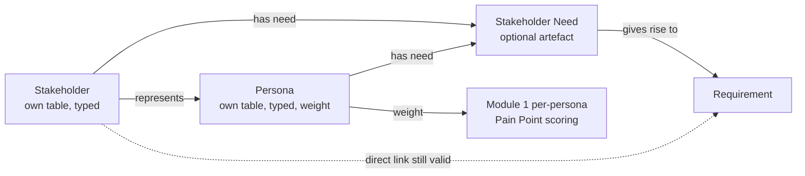

# Module 2 — Stakeholders & Personas — Implementation Plan

See [future-modules-2026-09-index.md](future-modules-2026-09-index.md) for
cross-cutting architecture referenced throughout, and note this module
consumes the relationship-model infrastructure
[Module 0](module-00-platform-foundations-plan.md) builds — it does not
re-derive it, and does not need Module 1 for that purpose.

**Source:** [future-modules-2026-09-overview.md](future-modules-2026-09-overview.md)
§10 "Module 2 — Stakeholders & Personas".

**Status:** Phase 0 complete (2026-10-05, user sign-off obtained — see
"Phase 0 resolutions" below). Phase 1 split into 1.1 (Persona) and 1.2
(Stakeholder) so Module 1 Phase 11's dependency, which needs only Personas,
unblocks first. Built ahead of the overview's §46 order because Module 1's
Reporting extension needs it (**Decided by: User**, 2026-10-04).

## Status / Resume Here

1 / 6 phases complete. **Phase 1.1 (Persona) is next.** It unblocks Module 1
Phase 11.

| # | Phase | Status |
|---|-------|--------|
| 0 | Exploratory: persona-modelling decision & open questions | [x] Complete (2026-10-05) |
| 1.1 | Persona: data model, types, weight + override, RBAC, scoring-target hook, UI | [ ] Not started |
| 1.2 | Stakeholder: data model, types, RBAC, UI | [ ] Not started |
| 2 | Stakeholder Needs (as first-class records) | [ ] Not started |
| 3 | Relationships + remaining frontend UI + MCP | [ ] Not started |
| 4 | Docs website coverage | [ ] Not started — depends on Phase 3 shipping |

## Phase 0 — Exploratory: Requirements Clarification & Design Validation

**Why this phase exists:** §10.1's central modelling call — "personas should
normally be modelled as a specialised stakeholder type rather than an
unrelated concept" — is stated as a preference, not a schema. Getting this
wrong means either an awkward migration later (if personas get their own
table and then need merging into stakeholders) or a confusing UI (if they
share a table with no clear visual/conceptual distinction for users). This
phase settles it before Phase 1.

**Activities:**

1. Resolve the persona-modelling question (below) with the user.
2. Resolve the remaining open questions.
3. Confirm this module's relationship types slot into whatever Module 0
   built (polymorphic table or per-pair tables) — Module 0 is a hard
   prerequisite for this module (per the index's dependency graph), so
   this should just be a confirmation, not an open design question.
4. Confirm scope: org-level stakeholders (e.g. "Regulator" as an
   organisation-wide stakeholder class reused across projects) vs.
   project-only — §10.3 lists "Project/organisation scope" as a field,
   implying both are valid, but doesn't say whether an org-level stakeholder
   is a template projects copy or a live shared record projects reference.

**Exit criteria:** user sign-off on the persona-modelling decision, field
list, and scope model before Phase 1.

### Open questions for Phase 0

1. **Persona modelling — the central question.** Three real options:
   (a) one `stakeholders` table with a `kind` enum (`stakeholder` /
   `persona`) and the same field set for both; (b) a `personas` table with
   its own fields, optionally FK'd to a representative `stakeholder`
   row it "represents" (§10.5 explicitly lists a "Represents Persona"
   relationship, which only makes sense if these are distinct records);
   (c) personas as a `stakeholder_type` value like any other (Customer, End
   User, etc.) with no structural distinction at all. Recommend (a): a
   `kind` discriminator on one table, because §10.2's persona examples
   (Field Technician, Safety Officer) read like specific *named* entries a
   project creates, structurally identical to a specific named stakeholder
   ("Acme Corp Regulator Liaison") — they differ in what they represent
   (a real party vs. a representative behavioural archetype), not in what
   fields they need. This also makes the §10.5 "Represents Persona"
   relationship straightforward (stakeholder-kind row → represents →
   persona-kind row, same table, same relationship infra). Flag as
   **recommendation only** — needs explicit user sign-off given the
   modelling consequences.
2. **Stakeholder/Persona type configurability.** §10.2 says types "should be
   configurable per organisation/project, with useful defaults" — same
   copy-on-create-from-org-defaults pattern as Pain Point types (Module 1
   Phase 0 Q3)? Recommend reusing that exact pattern rather than a third
   variant of "configurable type list."
3. **Stakeholder Need: always a separate record, or optional?** §10.4 says
   needs "should be first-class records where the project requires a
   distinction between the stakeholder's need and the formal requirement" —
   the "where the project requires" phrasing suggests this could be
   optional/skippable for simple projects (consistent with §2.1 "lightweight
   by default"). Confirm: can a Requirement link directly to a Stakeholder
   without an intervening Need record, or is Need mandatory in the chain
   Stakeholder → Need → Stakeholder Requirement → Project Requirement?
   Recommend optional — a direct Stakeholder → Requirement relationship
   should remain valid for simple projects, with the Need record available
   but not forced, matching the module's own "independently of formal
   Traceability" framing (§10.5's closing line).
5. **Persona importance/weight (added 2026-10-04, required by Module 1's
   Reporting extension).** Module 1 Phase 11 scores Pain Points per
   persona and defaults to a *weighted average* roll-up, so a Persona needs
   a numeric importance/weight. If none is set, every persona gets equal
   weight. **Decided by: User** (weighted-average default, Module 1 Phase
   9 Q5). Personas must also be referenceable through the generic
   `ArtefactLink`/registry target mechanism, because Module 1 refers to
   them by `target_type`/`target_id` and never by FK. Build order: this
   module's Phases 0–1 come before Module 1 Phase 11 (**Decided by:
   User**).
4. **Comments/attachments reuse.** Same pattern question as other modules —
   confirm reuse of `ReviewComment`/`CommentFile` via a new `ReviewTargetType`
   member rather than a bespoke table.

### Phase 0 resolutions (2026-10-05)

1. **Persona modelling: separate `personas` table**, not a `kind`
   discriminator. **Decided by: User** (the Agent recommended one table
   with `kind`). Stakeholder and Persona are two registered artefact types
   (`stakeholder`, `persona`), each with its own CRUD, version table, RBAC
   atoms and MCP tools. "Represents Persona" is an `ArtefactLink` from a
   Stakeholder to a Persona. *Accepted cost:* two parallel surfaces. This
   diverges from the overview §10.1's stated preference, which is guidance,
   not a `docs/requirements.md` requirement.
2. **Scope: org or project, live records.** A `scope` discriminator with
   exactly one of `organization_id`/`project_id` set, as Strategy and
   Guiding Principle do, applied to both tables. An org-level Persona is one
   shared record that any project in the org can link to and score against.
   **Decided by: User.**
3. **Types: separate two-tier lists for each kind.** Stakeholder types and
   Persona types each reuse Module 1's `PainPointTypeDefinition`/
   `ProjectPainPointType` shape: an org base list plus project-level
   rename, reorder, disable and add. **Decided by: User** (the Agent
   recommended giving Personas no type). Defaults:
   - Stakeholder types: §10.2's list (Customer … Support organisation).
   - Persona types: Primary, Secondary, Negative (anti-persona). **Decided
     by: Agent**, because §10.2 names no persona categories. All are
     org-editable.
   - *Nested projects:* no ancestor fallback, for the same reason Module 1
     Phase 0 Q3 gave: the org list is the base every project already sees.
     **Decided by: Agent.**
4. **Persona field set** (beyond identifier, name, description, scope,
   type, owner, status, history): role/job title, goals, needs, behaviours,
   context/environment, skills/proficiency, frequency of use, constraints,
   importance weight. Stakeholder-only fields (contact info,
   organisation/group, interests, responsibilities) stay on Stakeholder.
   **Decided by: User.** Stakeholder keeps §10.3's field set.
5. **Persona weight: on the persona, plus a project override.** `Persona.
   weight` is nullable and positive. `ProjectPersonaWeight(project_id,
   persona_id, weight)` overrides it per project. Resolution order: the
   project's own row → nearest ancestor's row → `Persona.weight` → equal
   weights. **Decided by: User.** The override table is override-only, so
   nothing is seeded and the root-only seeding rule has nothing to apply
   to; the cycle-safe ancestor walk reuses `services.project_hierarchy`.
   **Decided by: Agent.**
6. **Lifecycle, history and RBAC.** `Draft → Active → Retired`, with no
   approval gate, because §10 names no approver. Full version-history
   tables (`PersonaVersion`, `StakeholderVersion`), following
   `RequirementVersion`'s shape and consistent with Module 1 Phase 0 Q4.
   **Decided by: User.** Modifying is RBAC-gated (**Decided by: User**):
   - View: all project members.
   - Create, edit, retire: a module-registered project role, plus FGAC atoms
     derived from the registered artefact types.
   - Org-scoped records: org admins plus an org-level module role, following
     the same pattern as Strategy's org scope.
   - Role names and keys: **Decided by: Agent** in Phase 1.1.
   - No approve action, so MCP write tools need neither the
     `allow_ai_approvals` gate nor `APPROVAL_ACTION_ROUTE_EXTRA`.
7. **Stakeholder Need: optional, its own artefact.** It is a registered
   artefact type with its own table, `ArtefactLink` relationships and
   comments. A direct Stakeholder/Persona → Requirement link stays valid.
   **Decided by: User.**
8. **Comments/attachments: module-local tables** (`PersonaComment`/
   `PersonaCommentFile`/`PersonaFile` and equivalents for each artefact),
   following Module 1 and Module 4. This corrects open question 4 above:
   adding `ReviewTargetType` members would be a per-module edit to a core
   enum, which `CLAUDE.md`'s module boundary rule forbids. **Decided by:
   Agent.**
9. **Relationships:** confirmed on Module 0's polymorphic `ArtefactLink`,
   validated against registered artefact types. Decision and Design
   targets stay reserved until Modules 4 Phase 7 and 6 respectively.
   **Decided by: Agent.**
10. **A generic scoring-target hook for Module 1** (Phase 1.1). Module 1
    can't import this module, and `ModuleDefinition` has no field that
    lists one module's records with weights to another. Phase 1.1 adds a
    generic one, `ModuleDefinition.scoring_target_providers` (the name is
    provisional): artefact type → `(session, project_id) → [(id, label,
    weight | None, is_active)]`. Core exposes it, and Module 1 Phase 11
    consumes it. A disabled module returns nothing, so scoring falls back
    to all-personas. **Decided by: Agent.**
11. **Persona UI ships in Phase 1.1**, not Phase 3. Otherwise Module 1
    Phase 11's score grid would depend on personas that can only be created
    through the API or seeds. **Decided by: Agent**; revisit if the user
    prefers the original order.

## Phase 1.1 — Persona

**Scope** (per Phase 0 resolutions 1–6, 8, 10, 11):
- `Persona` table (scope discriminator, Q4 fields, nullable `weight`),
  `PersonaVersion`, module-local comments and files.
- Two-tier Persona types (`PersonaTypeDefinition`/`ProjectPersonaType`),
  seeded with Primary/Secondary/Negative on org creation.
- `ProjectPersonaWeight` plus a weight-resolution service with ancestor
  fallback.
- Lifecycle `Draft → Active → Retired`, module roles and FGAC atoms, and
  audit logging through `services/audit.py`.
- Registered artefact type `persona`, plus the generic
  `scoring_target_providers` hook in core (Q10).
- Org and project routers, write-enabled MCP tools, and org/project bundle
  export hooks.
- Frontend: list, detail and create/edit (as a layer) for Personas,
  type-admin sections, and a per-project weight override UI. Use shared
  components and label maps.
- Both seed scripts get org- and project-scoped Personas, some weighted and
  some not.
- Tests: pytest (scope rules, weight resolution chain, RBAC, cross-org
  isolation, version history, hook output when the module is disabled),
  Playwright and Storybook.

**Why:** Module 1 Phase 11 scores Pain Points per persona and needs real,
weighted Persona records. *Risk addressed:* scoring against personas that
don't exist, or Module 1 importing this module directly. *Outcome:* a
persona list Module 1 reads through a generic hook.

## Phase 1.2 — Stakeholder

**Scope:** the same shape as Phase 1.1 for `Stakeholder` (§10.3 fields:
identifier, name, type, description, role, organisation/group, interests,
responsibilities, goals and needs, priorities, constraints, workflows/use
scenarios, contact/reference info, scope, owner, status, history). Includes
`StakeholderVersion`, two-tier Stakeholder types seeded from §10.2, RBAC,
MCP, bundle hooks, frontend, seeds and tests. It reuses whatever Phase 1.1
extracted as shared code, and does not copy it.

**Why:** §10.1. Without an explicit stakeholder record, needs and
requirement rationale have no anchor beyond the requirement's own text.
*Risk addressed:* lost intent behind requirements. *Outcome:* traceable
stakeholder context.

## Phase 2 — Stakeholder Needs (as first-class records)

**Scope** (per Phase 0 resolution 7; example in §10.4): `StakeholderNeed`
is a registered artefact type (`stakeholder_need`) with its own text, linked
through `ArtefactLink` to Stakeholders/Personas ("has need") and to the
Requirements it gave rise to. It is optional: direct Stakeholder/Persona →
Requirement links stay valid.

**Why:** §10.4's own worked example (Field Technician → "diagnose faults
quickly" → "remote diagnostic info within 30 seconds") is the concrete
case for why this can't just be a Stakeholder→Requirement relationship
with no intermediate: the *need* and the *requirement* are different
statements at different levels of precision, and losing the need's own
wording loses the original intent that justifies the requirement's exact
threshold (why 30 seconds, not 10 or 60).

## Phase 3 — Relationships + remaining frontend UI + MCP

**Scope:** wire the relationships in §10.5 (Has Need, Experiences Pain
Point, Provides Requirement, Affected by Requirement, Consulted on
Decision, Approves/Reviews, Uses Design/System Element, Represents
Persona) using Module 0's relationship infrastructure — targets that don't
exist yet (Decision, Design) are reserved the same way Module 4 reserves
its own forward-relationships. Frontend: Needs UI and relationship panels on
the Persona and Stakeholder detail pages. Their list, detail and create UI
already ship in Phases 1.1 and 1.2. Follow UX style guide conventions, with
Playwright e2e + Storybook coverage.

**2026-10-05 update (Phase 0, Decided by: Agent):** Phases 1.1 and 1.2 now
ship their own MCP tools with their CRUD, so the MCP commitment below covers
only Needs and relationship tools here.

**MCP tools.** Added 2026-09-21 at the user's explicit instruction, applied
across every not-yet-built module plan (**Decided by: User**) — see
`docs/modules.md` §6 and [Module 4 (Decision Management)](module-04-decision-management-plan.md)'s
shipped `mcp_tools` (`backend/app/modules/decisions/module.py`) as the
precedent to follow. This module has no single dedicated "backend API"
phase; Phase 1 (Stakeholder/Persona) and Phase 2 (Stakeholder Need) each
stand up their own data model, RBAC, and CRUD endpoints together, so the
full REST surface across Stakeholders/Personas, Needs, and their
relationships is only complete once this phase's relationship endpoints
land, immediately before this phase's own frontend work consumes it.
Attaching the commitment here, at the last purely-backend milestone,
rather than retroactively to Phase 1/2, is a judgment call (**Decided by:
Agent**) — revisit if a future pass splits this phase's backend and
frontend halves apart, or splits Phase 1/2's own endpoints out explicitly.
Once these endpoints exist, declare `McpToolDefinition` entries for the
safe list/get endpoints — candidates made concrete by Phase 1/2's own
scope text: `list_stakeholders`/`get_stakeholder` and `list_personas`/`get_persona`
(separate tables, per Phase 0 resolution 1) and `list_stakeholder_needs`/`get_stakeholder_need`.

**2026-09-22 update (Decided by: User):** this plan originally committed to
**read-only-only** MCP tools; per the same reversal applied to the
Compliance module (`docs/decisions.md`'s "Compliance MCP write tools +
generalized AI approval gate" entry), this module should instead commit to
**write-enabled** MCP tools once built — CRUD tools for Stakeholders/
Personas and Stakeholder Needs declared normally (gated by
`MCP_WRITES_ENABLED` + the calling account's own RBAC role, no special
treatment). §10 still names no approval/baseline workflow for
Stakeholders/Personas (Phase 1's own RBAC note flags this asymmetry), so
there is no approve/decide-type action here needing either option (a) the
generalized `allow_ai_approvals` gate or (b) `APPROVAL_ACTION_ROUTE_EXTRA`
— if Phase 0 or Phase 1 later confirms some form of stakeholder sign-off
after all, decide between (a)/(b) for it then, defaulting to (a) per the
Compliance precedent absent a specific reason otherwise.

## Phase 4 — Docs website coverage

Added 2026-09-21 at the user's explicit instruction, applied across every
not-yet-built module plan (**Decided by: User**); the specific scope and
placement below are this session's own judgment (**Decided by: Agent**),
modelled closely on [Module 4 (Decision Management)](module-04-decision-management-plan.md)'s
Phase 6 of the same name.

**Goal:** add Stakeholders & Personas' user-facing surface to
`docs/website/` (the published docs site, `docs/plans/docs-website-plan.md`)
— what a Stakeholder/Persona record is, how a Persona differs from (and is
modelled alongside) an ordinary Stakeholder, what a Stakeholder Need is and
why it exists as its own record, and how these relate to Requirements and
other artefacts — following the site's existing structure, tone, and
Mermaid-diagram conventions (per this repo's Documentation Requirements:
prefer diagrams, validate they render before finalising).

**Why this is its own tracked phase, not folded silently into this phase's
own frontend work:** `CLAUDE.md`'s "Docs Website Maintenance" rule already
requires this check on every change with a user-facing surface, performed
in the same change rather than deferred — so in the ordinary case this
would just be part of Phase 3's own work. It's broken out explicitly here,
mirroring Decision Management's own Phase 6 reasoning, so the docs-site
update has its own checklist-visible exit criteria rather than being an
implicit sub-bullet of Phase 3's UI work, which already has plenty of its
own scope (two artefact types, eight relationship kinds, and a
persona-vs-stakeholder distinction that is easy to under-explain if rushed).

**Scope:**

- A new docs-site page or section (matching whatever grouping the site
  already uses for other project-scoped modules, e.g. Compliance and
  Decision Management) covering: what a Stakeholder is, what a Persona is (a separate record, per Phase 0
  resolution 1), and how they relate through "Represents Persona"; the Stakeholder →
  Need → Stakeholder Requirement → Project Requirement chain (§10.1) as a
  Mermaid diagram, including why a Need is optional rather than mandatory
  in that chain (Phase 0 resolution 7); persona weight and its project
  override; the relationships wired in Phase 3 (Has Need,
  Experiences Pain Point, Provides Requirement, Represents Persona, etc.),
  including which targets (Decision, Design) are reserved pending Modules 4
  and 6.
- Update the site's module/feature index or nav to include Stakeholders &
  Personas alongside the other installed modules it already lists.
- Cross-link from the Requirements documentation to the new page wherever
  the site already documents how a Requirement traces back to the
  stakeholder or need that motivated it, if it does.
- **Screenshots.** — **Decided by: User** (2026-09-22, made explicit across
  every not-yet-built module plan's own "Docs website coverage" phase,
  alongside [Module 4](module-04-decision-management-plan.md)'s Phase 6
  addendum of the same date). Follow `docs/plans/docs-website-plan.md`'s
  "Screenshots" standard (1440×900 viewport, captured against the seeded
  demo dataset, stored under `docs/website/static/img/screenshots/`, real
  alt text plus a one-line caption, no surrounding "what this shows/why it
  matters" prose) and its "every Concepts, Core Features, Workflows, and
  Modules page needs at least one screenshot or diagram" bar — not forced
  onto a page whose content is genuinely diagram/table-only. Candidate
  screens for this module's own page — **Decided by: Agent**: the
  Stakeholder/Persona list view, a Stakeholder detail page showing its
  Needs and relationships, and a Persona detail page showing its weight.

**Status:** not started — depends on Phase 3 (relationships + frontend)
actually shipping; there is no real user-facing workflow to document
accurately before then, the same reasoning Decision Management's own
Phase 6 and Compliance's docs-site page both used. Not a blocker for any
other phase.

## Acceptance criteria (from overview §48, Stakeholders & Personas subset)

- Stakeholders and Personas can be defined at appropriate organisation/
  project scope.
- Stakeholder Needs can be linked to Stakeholders/Personas and Requirements.
- Stakeholder relationships are available independently of formal
  Traceability.
- Stakeholder/Persona changes can participate in Change Impact analysis.
  *(depends on Module 10 Reporting's Engineering Change Impact report —
  this module only needs to expose enough relationship data for that
  report to consume later, not build the analysis itself.)*
