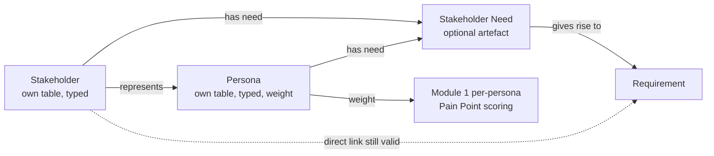
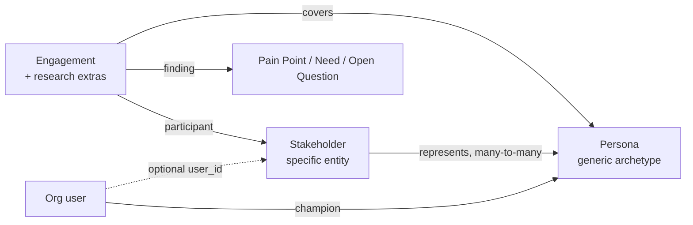

# Module 2 — Stakeholders & Personas — Implementation Plan

See [future-modules-2026-09-index.md](future-modules-2026-09-index.md) for
cross-cutting architecture referenced throughout, and note this module
consumes the relationship-model infrastructure
[Module 0](module-00-platform-foundations-plan.md) builds — it does not
re-derive it, and does not need Module 1 for that purpose.

**Source:** [future-modules-2026-09-overview.md](future-modules-2026-09-overview.md)
§10 "Module 2 — Stakeholders & Personas".

**Status:** Phases 0, 1.1, 1.2, 2, 3 and 3b complete (all 2026-10-05; Phase 0 had user
sign-off, see "Phase 0 resolutions" below); Phase 7a (docs) complete (2026-10-05); Phase 4 is next. Phase 1 was split
into 1.1 (Persona) and 1.2 (Stakeholder) so Module 1 Phase 11's dependency,
which needs only Personas, unblocked first. Built ahead of the overview's §46 order because Module 1's
Reporting extension needs it (**Decided by: User**, 2026-10-04).

## Status / Resume Here

6 / 10 phases complete (plus the unnumbered Phase 3b, project stakeholder visibility). **Phases 0–3 and 7a are done, so the module can ship; Phase 4 (Engagements: data
model, backend, erasure) is next, with 5, 6 and 7b after it.** The user asked for the docs phase to be pulled ahead of Phases 4–6
(**Decided by: User**, 2026-10-05): Phase 7a documents what Phases 0–3 shipped, and Phase 7b extends the
same section once Phases 4–6 land.
Phase 1.1 (Persona, 2026-10-05) unblocks Module 1 Phase 11; Phase 1.2 (Stakeholder,
2026-10-05) adds the Stakeholder artefact, its Influence × Interest scoring scheme and
erasure; Phase 2 (Stakeholder Needs, 2026-10-05) adds the Need artefact and its "has need"
and "gives rise to" links; Phase 3 (Relationships, 2026-10-05) adds the remaining §10.5
relationships, the link MCP tools and the relationship panel. Phases 4–6
were added by the 2026-10-05 Phase 0 addendum; the docs phase moved from 4 to 7.

| # | Phase | Status |
|---|-------|--------|
| 0 | Exploratory: persona-modelling decision & open questions | [x] Complete (2026-10-05) |
| 1.1 | Persona: data model, types, weight + override, RBAC, scoring-target hook, UI | [x] Complete (2026-10-05) |
| 1.2 | Stakeholder: data model, types, RBAC, UI | [x] Complete (2026-10-05) |
| 2 | Stakeholder Needs (as first-class records) | [x] Complete (2026-10-05) |
| 3 | Relationships + remaining frontend UI + MCP | [x] Complete (2026-10-05) |
| 3b | Project visibility of org Stakeholders and Personas (hide per project) | [x] Complete (2026-10-05) |
| 4 | Engagements (+ research extras): data model, backend, erasure | [ ] Not started |
| 5 | Engagements (+ research extras): frontend UI | [ ] Not started |
| 6 | Reports (S1–S5) | [ ] Not started — needs Module 1 Phase 13 (Reports UI); Phase 12b (report framework) shipped 2026-10-06 |
| 7a | Docs website coverage — shipped scope (Personas, Stakeholders, Needs, relationships, MCP) | [x] Complete (2026-10-05) |
| 7b | Docs website coverage — extension for Engagements, research extras, cadence workflow and reports S1–S5 | [ ] Not started — depends on Phases 4, 5 and 6 |

## Phase 0 — Exploratory: Requirements Clarification & Design Validation

**Why this phase exists:** §10.1's central modelling call — "personas should
normally be modelled as a specialised stakeholder type rather than an
unrelated concept" — is stated as a preference, not a schema. Getting this
wrong means either an awkward migration later (if personas get their own
table and then need merging into stakeholders) or a confusing UI (if they
share a table with no clear visual/conceptual distinction for users). This
phase settles it before Phase 1.

**Activities:**

1. Resolve the persona-modelling question (below) with the user.
2. Resolve the remaining open questions.
3. Confirm this module's relationship types slot into whatever Module 0
   built (polymorphic table or per-pair tables) — Module 0 is a hard
   prerequisite for this module (per the index's dependency graph), so
   this should just be a confirmation, not an open design question.
4. Confirm scope: org-level stakeholders (e.g. "Regulator" as an
   organisation-wide stakeholder class reused across projects) vs.
   project-only — §10.3 lists "Project/organisation scope" as a field,
   implying both are valid, but doesn't say whether an org-level stakeholder
   is a template projects copy or a live shared record projects reference.

**Exit criteria:** user sign-off on the persona-modelling decision, field
list, and scope model before Phase 1.

### Open questions for Phase 0

1. **Persona modelling — the central question.** Three real options:
   (a) one `stakeholders` table with a `kind` enum (`stakeholder` /
   `persona`) and the same field set for both; (b) a `personas` table with
   its own fields, optionally FK'd to a representative `stakeholder`
   row it "represents" (§10.5 explicitly lists a "Represents Persona"
   relationship, which only makes sense if these are distinct records);
   (c) personas as a `stakeholder_type` value like any other (Customer, End
   User, etc.) with no structural distinction at all. Recommend (a): a
   `kind` discriminator on one table, because §10.2's persona examples
   (Field Technician, Safety Officer) read like specific *named* entries a
   project creates, structurally identical to a specific named stakeholder
   ("Acme Corp Regulator Liaison") — they differ in what they represent
   (a real party vs. a representative behavioural archetype), not in what
   fields they need. This also makes the §10.5 "Represents Persona"
   relationship straightforward (stakeholder-kind row → represents →
   persona-kind row, same table, same relationship infra). Flag as
   **recommendation only** — needs explicit user sign-off given the
   modelling consequences.
2. **Stakeholder/Persona type configurability.** §10.2 says types "should be
   configurable per organisation/project, with useful defaults" — same
   copy-on-create-from-org-defaults pattern as Pain Point types (Module 1
   Phase 0 Q3)? Recommend reusing that exact pattern rather than a third
   variant of "configurable type list."
3. **Stakeholder Need: always a separate record, or optional?** §10.4 says
   needs "should be first-class records where the project requires a
   distinction between the stakeholder's need and the formal requirement" —
   the "where the project requires" phrasing suggests this could be
   optional/skippable for simple projects (consistent with §2.1 "lightweight
   by default"). Confirm: can a Requirement link directly to a Stakeholder
   without an intervening Need record, or is Need mandatory in the chain
   Stakeholder → Need → Stakeholder Requirement → Project Requirement?
   Recommend optional — a direct Stakeholder → Requirement relationship
   should remain valid for simple projects, with the Need record available
   but not forced, matching the module's own "independently of formal
   Traceability" framing (§10.5's closing line).
5. **Persona importance/weight (added 2026-10-04, required by Module 1's
   Reporting extension).** Module 1 Phase 11 scores Pain Points per
   persona and defaults to a *weighted average* roll-up, so a Persona needs
   a numeric importance/weight. If none is set, every persona gets equal
   weight. **Decided by: User** (weighted-average default, Module 1 Phase
   9 Q5). Personas must also be referenceable through the generic
   `ArtefactLink`/registry target mechanism, because Module 1 refers to
   them by `target_type`/`target_id` and never by FK. Build order: this
   module's Phases 0–1 come before Module 1 Phase 11 (**Decided by:
   User**).
4. **Comments/attachments reuse.** Same pattern question as other modules —
   confirm reuse of `ReviewComment`/`CommentFile` via a new `ReviewTargetType`
   member rather than a bespoke table.

### Phase 0 resolutions (2026-10-05)

1. **Persona modelling: separate `personas` table**, not a `kind`
   discriminator. **Decided by: User** (the Agent recommended one table
   with `kind`). Stakeholder and Persona are two registered artefact types
   (`stakeholder`, `persona`), each with its own CRUD, version table, RBAC
   atoms and MCP tools. "Represents Persona" is an `ArtefactLink` from a
   Stakeholder to a Persona. *Accepted cost:* two parallel surfaces. This
   diverges from the overview §10.1's stated preference, which is guidance,
   not a `docs/requirements.md` requirement.
2. **Scope: org or project, live records.** A `scope` discriminator with
   exactly one of `organization_id`/`project_id` set, as Strategy and
   Guiding Principle do, applied to both tables. An org-level Persona is one
   shared record that any project in the org can link to and score against.
   **Decided by: User.**
3. **Types: separate two-tier lists for each kind.** Stakeholder types and
   Persona types each reuse Module 1's `PainPointTypeDefinition`/
   `ProjectPainPointType` shape: an org base list plus project-level
   rename, reorder, disable and add. **Decided by: User** (the Agent
   recommended giving Personas no type). Defaults:
   - Stakeholder types: §10.2's list (Customer … Support organisation).
   - Persona types: Primary, Secondary, Negative (anti-persona). **Decided
     by: Agent**, because §10.2 names no persona categories. All are
     org-editable.
   - *Nested projects:* no ancestor fallback, for the same reason Module 1
     Phase 0 Q3 gave: the org list is the base every project already sees.
     **Decided by: Agent.**
4. **Persona field set** (beyond identifier, name, description, scope,
   type, owner, status, history): role/job title, goals, needs, behaviours,
   context/environment, skills/proficiency, frequency of use, constraints,
   importance weight. Stakeholder-only fields (contact info,
   organisation/group, interests, responsibilities) stay on Stakeholder.
   **Decided by: User.** Stakeholder keeps §10.3's field set.
5. **Persona weight: on the persona, plus a project override.** `Persona.
   weight` is nullable and positive. `ProjectPersonaWeight(project_id,
   persona_id, weight)` overrides it per project. Resolution order: the
   project's own row → nearest ancestor's row → `Persona.weight` → equal
   weights. **Decided by: User.** The override table is override-only, so
   nothing is seeded and the root-only seeding rule has nothing to apply
   to; the cycle-safe ancestor walk reuses `services.project_hierarchy`.
   **Decided by: Agent.**
6. **Lifecycle, history and RBAC.** `Draft → Active → Retired`, with no
   approval gate, because §10 names no approver. Full version-history
   tables (`PersonaVersion`, `StakeholderVersion`), following
   `RequirementVersion`'s shape and consistent with Module 1 Phase 0 Q4.
   **Decided by: User.** Modifying is RBAC-gated (**Decided by: User**):
   - View: all project members.
   - Create, edit, retire: a module-registered project role, plus FGAC atoms
     derived from the registered artefact types.
   - Org-scoped records: org admins plus an org-level module role, following
     the same pattern as Strategy's org scope.
   - Role names and keys: **Decided by: Agent** in Phase 1.1.
   - No approve action, so MCP write tools need neither the
     `allow_ai_approvals` gate nor `APPROVAL_ACTION_ROUTE_EXTRA`.
7. **Stakeholder Need: optional, its own artefact.** It is a registered
   artefact type with its own table, `ArtefactLink` relationships and
   comments. A direct Stakeholder/Persona → Requirement link stays valid.
   **Decided by: User.**
8. **Comments/attachments: module-local tables** (`PersonaComment`/
   `PersonaCommentFile`/`PersonaFile` and equivalents for each artefact),
   following Module 1 and Module 4. This corrects open question 4 above:
   adding `ReviewTargetType` members would be a per-module edit to a core
   enum, which `CLAUDE.md`'s module boundary rule forbids. **Decided by:
   Agent.**
9. **Relationships:** confirmed on Module 0's polymorphic `ArtefactLink`,
   validated against registered artefact types. Decision and Design
   targets stay reserved until Modules 4 Phase 7 and 6 respectively.
   **Decided by: Agent.**
10. **A generic scoring-target hook for Module 1** (Phase 1.1). Module 1
    can't import this module, and `ModuleDefinition` has no field that
    lists one module's records with weights to another. Phase 1.1 adds a
    generic one, `ModuleDefinition.scoring_target_providers` (the name is
    provisional): artefact type → `(session, project_id) → [(id, label,
    weight | None, is_active)]`. Core exposes it, and Module 1 Phase 11
    consumes it. A disabled module returns nothing, so scoring falls back
    to all-personas. **Decided by: Agent.**
11. **Persona UI ships in Phase 1.1**, not Phase 3. Otherwise Module 1
    Phase 11's score grid would depend on personas that can only be created
    through the API or seeds. **Decided by: Agent**; revisit if the user
    prefers the original order.

### Phase 0 addendum (2026-10-05) — people, research, reports

12. **Stakeholder ↔ Persona is many-to-many** through the "represents"
    `ArtefactLink`, and it moves from Phase 3 into Phase 1.2, since both
    record types exist by then. **Decided by: User.**
13. **Org users reach personas through a Stakeholder record, not a direct
    link.** `Stakeholder.user_id` (nullable FK to core `users`) marks a
    stakeholder who is also a platform user, and a "create stakeholder from
    org user" action removes the friction. **Decided by: User** (the
    Agent's proposal). *Why:* most people a persona describes have no
    account, and two parallel person → persona paths would make every
    report merge them.
    - `Persona.champion_id` (nullable FK to `users`) is the colleague
      accountable for keeping the persona accurate. **Decided by: User.**
    - A persona is descriptive only and never grants permissions.
      **Decided by: Agent.**
    - A module FK into core `users` is allowed. The boundary only forbids
      core depending on a module.
14. *(Scope superseded by item 20: research is now the switchable extras on
    always-on Engagements.)* **Research Sessions, a toggleable sub-component**
    (`ModuleDefinition.sub_components`), generalised from focus groups to
    interviews, usability tests and surveys. **Decided by: User.** Prompts
    are called *session prompts*, so they don't collide with Module 1's Open
    Questions. Findings link to the Pain Points, Needs and Open Questions
    they raised or answered. Built after Phase 3, so Phase 1.1 isn't
    delayed.
15. **Personal data and erasure** (SOC 2, data classification and data
    retention policies). Stakeholder contact info and research participant
    data are Confidential customer data about identifiable people. The
    retention policy's Known Gap 1 says nothing can hard-delete one person's
    data inside a live org, so a Retired status doesn't satisfy disposal.
    **Decided by: Agent.**
    - Phase 1.2 adds hard delete for a Stakeholder: rows, versions,
      comments, links and storage files, plus an audit event that holds no
      personal data.
    - Phase 4 adds the same for Engagement participant data, plus a
      consent field and an optional retain-until date.
    - Update the retention policy's Known Gap 1 to record the narrower
      closure. The gap stays open for users and projects.
16. **Stakeholder Influence and Interest levels** on the core scoring
    matrix (Module 1 Phase 10). This module registers a `stakeholder`
    scoring scheme with an Influence × Interest model, which drives the
    power/interest grid. **Decided by: User.** Default levels: Low,
    Medium, High on each axis. **Decided by: Agent.**
17. **Reports S1–S5** (Phase 6), registered through Module 1 Phase 13's
    generic report hook. **Decided by: User.** There is no bespoke reports
    page. "Stakeholder register" and "per-persona pain profile" are left out
    as duplicates of the list view and Module 1 R1. **Decided by: Agent.**

### Phase 0 addendum 2 (2026-10-05) — engagement cadence and contact log

18. **Two engagement fields on Stakeholder.** `target_cadence` (our goal)
    has the values One-off, Ad hoc, Weekly, Monthly, Quarterly and Yearly,
    with a label map. `availability_constraints` (their limit) is free
    text. **Decided by: User.** *Why:* one merged field can't show the
    risky gap of "we should talk monthly but they'll only agree to
    quarterly".
19. **One-off is a cadence value, not a flag**, and random session
    participants are **anonymous**: a label plus a persona, with no
    Stakeholder record. **Decided by: User** (the Agent's recommendation).
    - Named one-off parties (a regulator consulted once, an auditor) are
      Stakeholders with cadence One-off. They need a real record so they
      can be linked to Requirements, Needs and Decisions.
    - One-off and Ad hoc stakeholders are excluded from S4 staleness, and
      the list can filter by cadence.
    - *Why:* data minimisation, and a register that isn't cluttered with
      one-time participants.
20. **Engagements replace Research Sessions as the core record**
    (supersedes addendum 14's sub-component scope). An Engagement holds a
    date, a channel (email, call, meeting, workshop, interview, focus
    group, usability test, survey), participants, notes and attachments,
    and links to the Pain Points, Needs and Open Questions it raised or
    answered. **Decided by: User** (the Agent's recommendation).
    - The engagement log is **always on**. Only the research extras are a
      toggleable sub-component: session prompts, findings and anonymous
      participants.
    - "Log contact" quick-adds one from a Stakeholder's page, e.g. for the
      odd email.
    - *Why:* "last contact" needs a single source. A separate contact log
      would overlap with research sessions, and S4/S5 would have to merge
      the two.
21. **Cadence hint from the power/interest grid.** On the Stakeholder form,
    the Influence/Interest ratings show a suggested cadence next to the
    cadence field and never set it. Defaults: Manage closely → Monthly,
    Keep satisfied → Quarterly, Keep informed → Quarterly, Monitor → Ad
    hoc. **Decided by: User**; the default mapping is **Decided by:
    Agent**, and can become org-configurable if asked for.
22. **S4 measures against each stakeholder's own cadence**: overdue means
    the last engagement is older than the target interval, or there has
    never been one. It shows availability constraints next to overdue
    items, so a gap the stakeholder caused is distinguishable from
    neglect. **Decided by: Agent.**

## Phase 1.1 — Persona

**Scope** (per Phase 0 resolutions 1–6, 8, 10, 11):
- `Persona` table (scope discriminator, Q4 fields, nullable `weight`,
  nullable `champion_id`),
  `PersonaVersion`, module-local comments and files.
- Two-tier Persona types (`PersonaTypeDefinition`/`ProjectPersonaType`),
  seeded with Primary/Secondary/Negative on org creation.
- `ProjectPersonaWeight` plus a weight-resolution service with ancestor
  fallback.
- Lifecycle `Draft → Active → Retired`, module roles and FGAC atoms, and
  audit logging through `services/audit.py`.
- Registered artefact type `persona`, plus the generic
  `scoring_target_providers` hook in core (Q10).
- Org and project routers, write-enabled MCP tools, and org/project bundle
  export hooks.
- Frontend: list, detail and create/edit (as a layer) for Personas,
  type-admin sections, and a per-project weight override UI. Use shared
  components and label maps.
- Both seed scripts get org- and project-scoped Personas, some weighted and
  some not.
- Tests: pytest (scope rules, weight resolution chain, RBAC, cross-org
  isolation, version history, hook output when the module is disabled),
  Playwright and Storybook.

**Why:** Module 1 Phase 11 scores Pain Points per persona and needs real,
weighted Persona records. *Risk addressed:* scoring against personas that
don't exist, or Module 1 importing this module directly. *Outcome:* a
persona list Module 1 reads through a generic hook.

**Status: complete (2026-10-05).** Module key `stakeholders` (sub-component
`persona`), package `backend/app/modules/stakeholders/`, frontend
`frontend/src/modules/stakeholders/`. Account, deviations and review:
`docs/decisions.md`'s "Module 2 Phase 1.1" entry. Left for later phases:

- **Reuse for Phase 1.2:** `type_vocabulary.TypeVocabulary` (backend),
  `components/TypeVocabularyPanels` and `components/ArtefactCommentsSection`
  (frontend), `PersonaListView`'s shape for the Stakeholder list, and
  `export.py`'s bundle pattern.
- **Module 1 Phase 11** reads personas with
  `app.modules.registry.get_scoring_targets(db, project_id, "persona")`
  (`ScoringTarget(id, label, weight, is_active)`).
- Relationships, `Represents Persona` and MCP relationship tools stay in
  Phases 1.2/3; the docs website stays in Phase 7.

## Phase 1.2 — Stakeholder

**Scope:** the same shape as Phase 1.1 for `Stakeholder` (§10.3 fields:
identifier, name, type, description, role, organisation/group, interests,
responsibilities, goals and needs, priorities, constraints, workflows/use
scenarios, contact/reference info, scope, owner, status, history). Includes
`StakeholderVersion`, two-tier Stakeholder types seeded from §10.2, RBAC,
MCP, bundle hooks, frontend, seeds and tests. It reuses whatever Phase 1.1
extracted as shared code, and does not copy it. Also (addendum 12, 13, 15,
16):
- nullable `user_id`, plus a "create from org user" action;
- the many-to-many "represents" link to Personas, with a panel on both
  detail pages;
- a `stakeholder` scoring scheme (Influence × Interest) with a level picker
  on the form;
- `target_cadence` and `availability_constraints` (addendum 2, items
  18–19), plus the cadence hint (item 21);
- hard delete (two-tier confirm), with a test proving that no rows,
  versions, comments, links or storage files are left.

**Why:** §10.1. Without an explicit stakeholder record, needs and
requirement rationale have no anchor beyond the requirement's own text.
*Risk addressed:* lost intent behind requirements. *Outcome:* traceable
stakeholder context.

**Status: complete (2026-10-05).** Same module (`stakeholders`), new
sub-component `stakeholder`. Account, deviations and review:
`docs/decisions.md`'s "Module 2 Phase 1.2" entry. Left for later phases:

- **Reuse for Phase 2:** `_attachments.AttachmentKit` (comments/files),
  `RecordDiscussion`, `RecordLifecycleControls`, `RecordListView`,
  `RepresentationPanel` (extend it for "has need" links) and
  `service.get_or_create_*_link_type`'s pattern for a new link type.
- **Phase 4 (Engagements)** reuses `erase_stakeholder`'s approach for
  participant data and must remove its own links from `ArtefactLink` the same
  way; S4's staleness rule reads `Stakeholder.target_cadence` and the
  `grid_quadrant`/`suggest_cadence` helpers in `service.py`.
- **Phase 3** still owns the remaining §10.5 relationships and MCP tools for
  relationships; "represents Persona" shipped here with REST only (no MCP tool).

## Phase 2 — Stakeholder Needs (as first-class records)

**Scope** (per Phase 0 resolution 7; example in §10.4): `StakeholderNeed`
is a registered artefact type (`stakeholder_need`) with its own text, linked
through `ArtefactLink` to Stakeholders/Personas ("has need") and to the
Requirements it gave rise to. It is optional: direct Stakeholder/Persona →
Requirement links stay valid.

**Why:** §10.4's own worked example (Field Technician → "diagnose faults
quickly" → "remote diagnostic info within 30 seconds") is the concrete
case for why this can't just be a Stakeholder→Requirement relationship
with no intermediate: the *need* and the *requirement* are different
statements at different levels of precision, and losing the need's own
wording loses the original intent that justifies the requirement's exact
threshold (why 30 seconds, not 10 or 60).

**Status: complete (2026-10-05).** Same module (`stakeholders`), new
sub-component `stakeholder_need`, project role `stakeholder_need_owner`.
Deviation from Phase 0 resolution 2: a Need is **project-scoped only** (no org
scope or router), since it links to the project's own Requirements
(**Decided by: Agent**; revisit if org-level needs are wanted). Account,
deviations and review: `docs/decisions.md`'s "Module 2 Phase 2" entry. Left for
later phases:

- **Phase 3** still owns the remaining §10.5 relationships (Experiences Pain
  Point, Consulted on Decision, …) and the MCP *link* tools; the Need's two links
  shipped here with REST only. Need CRUD/lifecycle MCP tools shipped here.
- **Phase 4 (Engagements)** links findings to Needs through the same
  `service.get_or_create_link_type` helper, and a Need appears in the S1–S5
  reports through `list_holder_needs`/`list_need_holders`.

## Phase 3 — Relationships + remaining frontend UI + MCP

**Scope:** wire the relationships in §10.5 (Has Need, Experiences Pain
Point, Provides Requirement, Affected by Requirement, Consulted on
Decision, Approves/Reviews, Uses Design/System Element, Represents
Persona) using Module 0's relationship infrastructure — targets that don't
exist yet (Decision, Design) are reserved the same way Module 4 reserves
its own forward-relationships. Frontend: Needs UI and relationship panels on
the Persona and Stakeholder detail pages. Their list, detail and create UI
already ship in Phases 1.1 and 1.2. Follow UX style guide conventions, with
Playwright e2e + Storybook coverage.

**2026-10-05 update (Phase 0, Decided by: Agent):** Phases 1.1 and 1.2 now
ship their own MCP tools with their CRUD, so the MCP commitment below covers
only Needs and relationship tools here.

**MCP tools.** Added 2026-09-21 at the user's explicit instruction, applied
across every not-yet-built module plan (**Decided by: User**) — see
`docs/modules.md` §6 and [Module 4 (Decision Management)](module-04-decision-management-plan.md)'s
shipped `mcp_tools` (`backend/app/modules/decisions/module.py`) as the
precedent to follow. This module has no single dedicated "backend API"
phase; Phase 1 (Stakeholder/Persona) and Phase 2 (Stakeholder Need) each
stand up their own data model, RBAC, and CRUD endpoints together, so the
full REST surface across Stakeholders/Personas, Needs, and their
relationships is only complete once this phase's relationship endpoints
land, immediately before this phase's own frontend work consumes it.
Attaching the commitment here, at the last purely-backend milestone,
rather than retroactively to Phase 1/2, is a judgment call (**Decided by:
Agent**) — revisit if a future pass splits this phase's backend and
frontend halves apart, or splits Phase 1/2's own endpoints out explicitly.
Once these endpoints exist, declare `McpToolDefinition` entries for the
safe list/get endpoints — candidates made concrete by Phase 1/2's own
scope text: `list_stakeholders`/`get_stakeholder` and `list_personas`/`get_persona`
(separate tables, per Phase 0 resolution 1) and `list_stakeholder_needs`/`get_stakeholder_need`.

**2026-09-22 update (Decided by: User):** this plan originally committed to
**read-only-only** MCP tools; per the same reversal applied to the
Compliance module (`docs/decisions.md`'s "Compliance MCP write tools +
generalized AI approval gate" entry), this module should instead commit to
**write-enabled** MCP tools once built — CRUD tools for Stakeholders/
Personas and Stakeholder Needs declared normally (gated by
`MCP_WRITES_ENABLED` + the calling account's own RBAC role, no special
treatment). §10 still names no approval/baseline workflow for
Stakeholders/Personas (Phase 1's own RBAC note flags this asymmetry), so
there is no approve/decide-type action here needing either option (a) the
generalized `allow_ai_approvals` gate or (b) `APPROVAL_ACTION_ROUTE_EXTRA`
— if Phase 0 or Phase 1 later confirms some form of stakeholder sign-off
after all, decide between (a)/(b) for it then, defaulting to (a) per the
Compliance precedent absent a specific reason otherwise.

**Status: complete (2026-10-05).** Same module (`stakeholders`), no new sub-component or
role: relationships ride on the holder's own (`stakeholder`/`persona`) sub-component and manage
gate. Account, deviations and review: `docs/decisions.md`'s "Module 2 Phase 3" entry. Left for
later phases:

- **Decision/Design targets.** "Consulted on Decision" and "Approves/Reviews" shipped against real
  Decisions; "Uses Design / System Element" is declared but unavailable until a module registers an
  `artefact_summary_providers` entry for `design`/`system_element` (Module 6).
- **Phase 4 (Engagements)** links participants/findings the same way (`relationships.get_kind`-style
  table or `service.get_or_create_link_type`), and S3 can read `relationships.list_incoming`.
- **Bundles** carry Requirement-targeted links; Pain Point/Decision-targeted ones are exported but
  skipped with a warning on import until those modules' own records travel in the bundle.

## Phase 3b — Project visibility of org Stakeholders and Personas (hide per project)

**Why:** every org-scoped Stakeholder was visible to every project in the
organisation, with no persistent way to opt a project out (only a per-request
`include_org=false` list filter). A project that has no dealings with, say, a
regulator had to look at them anyway, and could attach needs/relationships to
them by mistake. **Risk addressed:** noise and mis-linking from an
all-or-nothing org-wide share. **Outcome:** a project (with manage rights) can
hide any org Stakeholder from itself, reversibly and without touching the
shared record.

**Decisions (all Decided by: Agent — revisit freely; the user asked only for
"projects can hide org stakeholders"):**

1. **Override-only table `ProjectStakeholderVisibility`** `(project_id,
   stakeholder_id, hidden)`, unique per pair — the `ProjectPersonaWeight`
   shape. No row means "inherit". Only org-scoped Stakeholders of the project's
   own organisation can be given a row (a project's own stakeholder is
   archived/erased instead).
2. **Hierarchy (nested-projects check):** resolved per stakeholder, nearest
   row wins up the ancestor chain (own → parent → … → root), cycle-safe via
   `get_ancestor_chain`, always on. `hidden` is a boolean, not just "row
   exists", so a child can re-show something its parent hid. This is the persona-weight
   fallback rather than the Action-Type "own rows replace all ancestor rows"
   fallback, because that variant would make hiding one more stakeholder in a
   child silently un-hide everything the parent hid. No seeding hook (no rows
   by default, so nothing to seed at roots). Own endpoints touch only the
   project's own rows; the effective set is a read-path resolution.
3. **Hidden means invisible to the project, non-destructively.** The shared
   record, links and needs are untouched. A hidden Stakeholder is dropped from the
   project's list (unless `include_hidden=true`, which the manage UI uses), 404s
   from every project-scoped endpoint (`get_visible_stakeholder`, so new needs,
   relationships and "represents" links cannot target it), and drops out of a
   need's holder list and a Persona's represented-by list. Existing links stay
   in the database, so un-hiding restores them exactly.
4. **RBAC:** the project's Stakeholder manage permission (`stakeholder_owner`
   or the FGAC `(stakeholder, manage)` grant) — the same gate as the Persona
   weight override. Audit events `visibility_hidden` / `visibility_shown` /
   `visibility_reset` (ids only; no personal data, per the Stakeholder erasure
   rules).
5. **Bundles:** exported in the project half (`project_stakeholder_visibility`,
   org stakeholder by name), re-created on import with a warning if the target
   org lacks that stakeholder. Relationship/need exports still carry hidden
   holders' links so a bundle stays a full backup.
6. **Reports (Phase 6)** must use `list_project_visible_stakeholders`, which is
   hide-aware, rather than querying `Stakeholder` directly.

**Extended to Personas (2026-10-05, Decided by: User — "can org personas also be
hidden per project"):** the same design, one shared implementation. A second
override table `ProjectPersonaVisibility` (migration 0063, same shape and
hierarchy rule) is resolved by the same `_resolve_visibility`/`_set_visibility`
code, and `_shared.get_visible_persona` 404s a hidden persona, so needs,
relationships, "represents" links and the persona's weight endpoints are covered
in one place. Two persona-specific effects (**Decided by: Agent**): a hidden
persona is dropped from `list_project_visible_personas`, which
`persona_scoring_targets` is built on, so it stops being a scoring target for
that project (Module 1 Phase 11 reads targets through the registry and needs no
change; scores already recorded against it are not deleted); and the
stakeholder-side "represents" list omits it, though the link can still be
removed from the stakeholder. Frontend: `RecordVisibilityControl`,
`RecordListView`'s "Show hidden"/Visibility column and `visibility.ts` are
shared by both kinds. MCP gains `set_persona_visibility`,
`reset_persona_visibility` and `include_hidden` on `list_personas`.

**Deliverables:** model + migration 0062; `service` resolution + set/clear;
`stakeholder_project_router` `PUT`/`DELETE .../stakeholders/{id}/visibility`
and `include_hidden`; `StakeholderOut` `project_hidden`/`hidden_source`/
`hidden_override`; two MCP tools; bundle export/import; frontend hide/show
control on the project Stakeholders page; pytest, Playwright, Storybook; demo
and e2e seeds; docs website + decisions log.

## Phase 4 — Engagements (+ research extras): data model, backend, erasure

**Scope** (addendum 14, 15 and addendum 2, item 20):
- `Engagement` registered artefact type (`engagement`), always on:
  - fields: title, channel, date, facilitator/logged by, scope, summary,
    notes, consent recorded, retain-until;
  - participants: Stakeholders, via `ArtefactLink`;
  - personas covered;
  - links to Pain Points, Needs and Open Questions ("raised by",
    "answered by");
  - attachments (e.g. email exports).
- A "last engaged" per stakeholder, derived from engagement dates, for S4.
- Research extras sub-component (`ModuleDefinition.sub_components`):
  - `EngagementPrompt`: ordered session prompts, each with response notes;
  - `ResearchFinding`: a registered artefact with the same link types;
  - anonymous participants: a label plus a persona.
- RBAC, audit logging, write-enabled MCP tools, bundle hooks and seeds. The
  seeds cover a quick email log, a focus group with anonymous participants,
  and an overdue stakeholder.
- Hard delete for an engagement, its participant data and its files.
- Tests: the sub-component gate (extras hidden, core log still works),
  RBAC, cross-org isolation, erasure completeness, the last-engaged
  derivation, and finding links.

**Why:** contacts and research are the evidence behind stakeholder claims,
and the date of last contact drives staleness. *Risk addressed:* contact
history kept in email inboxes; Pain Points and personas built on
assumption; personal data with no disposal path. *Outcome:* one traceable
log from contact to Pain Points and Needs.

## Phase 5 — Engagements (+ research extras): frontend UI

**Scope:** an engagement list, detail page and create form (as a layer);
the "Log contact" quick-add on Stakeholder and Persona pages; an engagement
timeline on the Stakeholder detail page; participant/persona pickers; the
prompts editor, findings and anonymous participants when the extras are
enabled; and the delete confirm. Use shared components and label maps.
Playwright and Storybook.

**Why:** a backend nobody can reach isn't done. *Risk addressed:* contacts
recorded outside the tool. *Outcome:* contacts captured where they're
traced.

## Phase 6 — Reports (S1–S5)

**Hard dependency:** Module 1 Phase 12b's core report framework (a
`ReportDefinition` per report on `ModuleDefinition.reports`) and Phase 13's
Reports UI. Phase 12b has shipped: declare `ReportDefinition`s as described in
`docs/modules.md` §4g (one `collect_*` per report; each org-level report names
this module's own org role as `org_role_key`), reused by PDF, CSV, on-screen
views and MCP.

| # | Report | Content |
|---|--------|---------|
| S1 | **Power/interest grid** | Stakeholders on Influence × Interest, grouped into Manage closely, Keep satisfied, Keep informed and Monitor; unscored stakeholders listed separately. |
| S2 | **Persona validation** | Each persona's evidence: linked real stakeholders, engagements covering it, anonymous participants, findings. Personas with none are flagged as assumptions, along with their scoring weight. |
| S3 | **Need coverage** | Needs with no Requirement; Requirements tracing to no Need, Stakeholder or Persona. Interim until Module 7. |
| S4 | **Engagement staleness** | Stakeholders whose last engagement is older than their own target cadence (or who have none), sorted by Influence, with availability constraints shown. One-off and Ad hoc are excluded. Personas with no engagement in N months. Needs Phase 4. |
| S5 | **Engagement & research yield** | Engagements by channel and persona; findings, Pain Points and Needs raised by engagements versus none. The findings part needs the research extras. Needs Phase 4. |

**Access control:** the same rules as Module 1 Phase 12: module enablement
and FGAC read on project reports; org variants need the org-reports
permission and exclude projects the caller can't read. S5's findings section is hidden
when the research extras are off.

**Reasoning:**
- **S1** — *Why:* the standard stakeholder management view. *Risk:*
  high-influence stakeholders get neglected. *Outcome:* engagement
  priorities are explicit.
- **S2** — *Why:* Module 1 weights Pain Point scores by persona. *Risk:*
  unvalidated personas skew prioritisation. *Outcome:* assumption-only
  personas are visible.
- **S3** — *Why:* a Need exists to drive a Requirement. *Risk:* needs that
  are never addressed, and requirements with no stakeholder basis.
  *Outcome:* gaps are listed.
- **S4** — *Why:* stakeholder views go stale. *Risk:* decisions based on
  old input. *Outcome:* re-engagement is prompted.
- **S5** — *Why:* research only matters if it feeds the backlog. *Risk:*
  findings that are recorded but never acted on. *Outcome:* the research →
  backlog yield is visible.

**Tests:** one pytest per report (content, gaps, RBAC exclusion, org
permission, cross-org isolation, sub-component gating), Playwright for
downloads and the S1 grid, and Storybook.

## Phase 7 — Docs website coverage (7a now, 7b after Phases 4–6)

Added 2026-09-21 at the user's explicit instruction, applied across every
not-yet-built module plan (**Decided by: User**); the specific scope and
placement below are this session's own judgment (**Decided by: Agent**),
modelled closely on [Module 4 (Decision Management)](module-04-decision-management-plan.md)'s
Phase 6 of the same name.

**Split (2026-10-05, Decided by: User):** the user asked for docs coverage
to be planned in *before* Phases 4–6 so the module can ship with what Phases
0–3 delivered, and the rest be done later. So the phase is two parts:

- **7a — shipped scope, now.** Documents only what exists: Personas,
  Stakeholders (incl. the Influence × Interest rating, target cadence and
  availability, user → stakeholder, hard delete), Stakeholder Needs, the
  §10.5 relationships, MCP tools and known limitations. Anything from
  Phases 4–6 appears only as a clearly labelled "coming later" entry in
  *Known limitations*, never as a described feature.
- **7b — extension, after Phases 4–6.** Adds Engagements and the research
  extras, the cadence/staleness workflow, reports S1–S5 and their MCP tools,
  and removes the matching "coming later" entries.

**Goal:** add Stakeholders & Personas' user-facing surface to
`docs/website/` (the published docs site, `docs/plans/docs-website-plan.md`),
following the site's existing structure, tone, and Mermaid-diagram
conventions (per this repo's Documentation Requirements: prefer diagrams,
validate they render before finalising).

**Why this is its own tracked phase, not folded silently into Phase 3's
own frontend work:** `CLAUDE.md`'s "Docs Website Maintenance" rule requires
this check on every change with a user-facing surface, performed in the same
change. Phases 1.1–3 each deferred it to here (**Decided by: User**, via this
plan), so it needs its own checklist-visible exit criteria, mirroring
Decision Management's own Phase 6.

**Scope (7a):**

- A nested *Stakeholders & Personas module* section under Modules, matching
  Context & Strategy's shape (overview, one page per artefact, relationships,
  MCP, known limitations): *Overview*, *Persona*, *Stakeholder*,
  *Stakeholder Need*, *Relationships*, *AI assistant (MCP) integration*,
  *Known limitations*. The overview carries the Stakeholder → Need →
  Requirement chain as a Mermaid diagram and why a Need is optional (Phase 0
  resolution 7), why a Persona is a separate record from a Stakeholder
  (resolution 1), enabling the module, and the roles table.
- Update the Modules overview and roadmap (move Stakeholders & Personas from
  "proposed" to shipped, note what remains proposed), the sidebar, and
  cross-link from the Requirements documentation where it describes tracing
  a Requirement back to what motivated it.
- Document persona weight and its project override, the reserved Design /
  System Element relationship, and the personal-data erasure behaviour.
- **Screenshots.** — **Decided by: User** (2026-09-22). Follow
  `docs/plans/docs-website-plan.md`'s "Screenshots" standard (1440×900,
  captured against the seeded demo dataset, stored under
  `docs/website/static/img/screenshots/`, real alt text plus a one-line
  caption, no surrounding "what this shows/why it matters" prose). Screens —
  **Decided by: Agent**: the Persona and Stakeholder lists, a Persona detail
  page showing its weight, and a Stakeholder detail page showing its Needs
  and relationships.
- Verify: `npm run build` clean (broken links fail it) and Mermaid diagrams
  validated.

**Scope (7b):** Engagements and research extras, user → stakeholder →
persona walk-through with engagement history, target cadence, the cadence
hint and staleness, the power/interest grid, reports S1–S5 and their MCP
tools, with screenshots of each new screen.

**Status:** 7a complete (2026-10-05): `docs/website/docs/modules/stakeholders-personas-module/` (overview, Persona, Stakeholder, Stakeholder Need, Relationships, MCP, known limitations), five screenshots, sidebar, Modules overview/roadmap and Requirements-management cross-links; `npm run build` clean and the Mermaid diagrams render. 7b not started — depends on Phases
4, 5 and 6 shipping. Neither blocks any other phase.

## Acceptance criteria (from overview §48, Stakeholders & Personas subset)

- Stakeholders and Personas can be defined at appropriate organisation/
  project scope.
- Stakeholder Needs can be linked to Stakeholders/Personas and Requirements.
- Stakeholder relationships are available independently of formal
  Traceability.
- Stakeholder/Persona changes can participate in Change Impact analysis.
  *(depends on Module 10 Reporting's Engineering Change Impact report —
  this module only needs to expose enough relationship data for that
  report to consume later, not build the analysis itself.)*
- *(Phase 0 addendum)* Stakeholders link to many Personas, and org users
  reach Personas through an optional Stakeholder `user_id`. Personas have a
  champion.
- *(Phase 0 addendum)* Engagements log contacts and research (participants,
  channel, notes, attachments) and link to Pain Points, Needs and Open
  Questions. Research extras add prompts, findings and anonymous
  participants. A Stakeholder's or engagement's personal data can be
  hard-deleted.
- *(Phase 0 addendum 2)* Stakeholders have a target cadence and
  availability constraints, and S4 flags stakeholders overdue against
  their own cadence.
- *(Phase 0 addendum)* Reports S1–S5 are available through the generic
  report hook.
