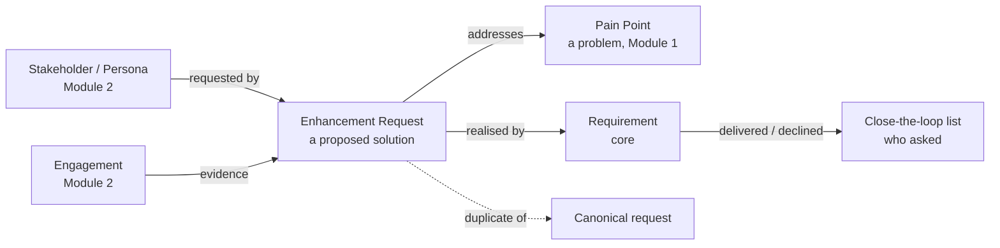

# Module 14 — Product Feedback (Enhancement Requests) — Implementation Plan

See [future-modules-2026-09-index.md](future-modules-2026-09-index.md) for
cross-cutting architecture. Not in the overview. Requested by the user on
2026-10-05 while scoping
[Module 2's Engagements](module-02-stakeholders-and-personas-plan.md)
(Phase 0 addendum 2): "a better place to store [enhancement requests]
rather than say something like Jira". **Decided by: User.**

**Status:** Proposed, not started. Plan now, build after Modules 1 and 2
(**Decided by: User**). Hard-depends on Module 0. Soft dependencies:
Module 1 (Pain Point links, report framework from its Phases 12b and 13) and Module 2
(Stakeholder/Persona/Engagement links). Links to a disabled module's
artefacts simply aren't offered.

## Status / Resume Here

0 / 8 phases complete. Phase 0 is next, but don't start it until Module 2
Phase 1.2 and Module 1 Phase 13 have shipped.

| # | Phase | Status |
|---|-------|--------|
| 0 | Exploratory: open questions below | [ ] Not started |
| 1 | Data model: Enhancement Request, lifecycle, RBAC | [ ] Not started |
| 2 | Demand aggregation + duplicate merge | [ ] Not started |
| 3 | ICE/RICE scoring on the core scoring matrix | [ ] Not started |
| 4 | Relationships + close-the-loop | [ ] Not started |
| 5 | Frontend UI | [ ] Not started |
| 6 | Reports (F1–F5) | [ ] Not started — needs Module 1 Phases 12b (report framework) and 13 (Reports UI) |
| 7 | Docs website coverage | [ ] Not started |

## Where it fits

## Settled so far (2026-10-05)

- **A new, independently toggleable module**, not part of Module 1 or 2.
  **Decided by: User.** *Why:* requests also come from internal staff and
  support, not only stakeholder contact, and the module should work
  without Modules 1/2 being enabled.
- **A request is a solution, a Pain Point is a problem.** A request with no
  linked Pain Point shows a warning and appears in report F2; it isn't
  blocked. **Decided by: User.** *Why:* ranking solutions purely by demand
  rewards the loudest voice; tying them to a scored problem keeps
  prioritisation grounded. Same "warnings only" stance as Module 1 Phase 9
  Q8.
- **In scope** (**Decided by: User**):
  - Demand aggregation: "requested by" links to Stakeholders, Personas and
    Engagements, weighted by stakeholder Influence and persona weight where
    available. Merging duplicates combines demand.
  - ICE/RICE scoring on the core scoring matrix (Module 1 Phase 10),
    chosen when viewing. *Why:* ICE was rejected for Pain Points because
    Ease describes a solution; requests *are* solutions, so it fits here.
  - Close-the-loop: when the realising Requirement is delivered or the
    request is declined, list who asked, so they can be told.
- **Out of scope** (**Decided by: Agent**, accepted by the user): delivery
  tracking (sprints, assignees, boards), which stays in Jira or similar,
  and a public, no-account submission portal, which is a large abuse and
  privacy surface. Revisit the portal only on explicit request.
- **Kept separate from scoping-stage requirements** (`docs/requirements.md`
  C-U-03). **Decided by: Agent.** *Why:* raw asks are often duplicates,
  often declined and often from people without accounts; putting them in
  the requirements list would pollute it.

## Phase 0 — open questions

1. **Lifecycle.** Recommend `New → Under review → Accepted → Delivered`,
   plus terminal `Declined` (mandatory reason) and `Duplicate` (points to
   the canonical request). Should `Delivered` follow the realising
   Requirement's status automatically, or be set by hand with a prompt?
   Recommend a prompt: an automatic transition couples this module to core
   Requirement status semantics.
2. **Scope.** Requests often arrive before anyone knows which project they
   belong to. Recommend org or project scope, using the same discriminator
   as Strategy, with an org-level inbox triaged into projects.
3. **Who submits and who triages.** Recommend any project member can submit
   (including the Stakeholder project role), and a module-registered
   triage role accepts, declines or merges.
4. **RICE "Reach": manual or derived?** Demand data could derive Reach
   (the weighted count of requesters), or it could be a manual level.
   Recommend a manual level, with derived demand shown alongside, so the
   two can be compared without one silently overriding the other.
5. **Merge mechanics.** Recommend that merging keeps the canonical request,
   marks the other `Duplicate`, and counts demand as the union of
   requesters, so the same stakeholder asking twice counts once. Should
   merge be reversible?
6. **Close-the-loop tracking.** Recommend a per-requester "informed"
   checkbox with a date, so F3 can show loops still open. Notifications go
   to internal owners only; no emails go to external people.
7. **Bridge to delivery tools.** Recommend an external reference field
   (URL plus key, e.g. a Jira issue) now, with a real integration later.
8. **Types or categories.** If requests get a configurable type list,
   decide the nested-projects fallback at design time, per `CLAUDE.md`.
   Recommend no types at first; tags or components may be enough.
9. **Personal data.** Requester links point at Module 2 records, so erasure
   is covered there. Any free-text "requested by" for people without a
   Stakeholder record would be new personal data. Recommend not allowing
   it: create an anonymous Engagement participant or a Stakeholder instead.

## Phases 1–7 (outline, refined at Phase 0)

- **Phase 1 — Data model.** `EnhancementRequest` registered artefact type:
  title, description, scope, status, owner, external reference, decline
  reason. Includes `EnhancementRequestVersion`, module-local comments and
  files, RBAC and FGAC atoms, audit logging, write-enabled MCP tools,
  bundle hooks and seeds.
- **Phase 2 — Demand and merge.** "Requested by" links, weighted demand
  through Module 2's generic hooks (never an import), and merge with
  demand union.
- **Phase 3 — Scoring.** An `enhancement_request` scoring scheme (Reach,
  Impact, Confidence, Effort) with ICE and RICE models, org and project
  defaults, and Effort as a divisor. The core scoring matrix currently
  combines by product only (Module 1 Phase 10 notes), so this needs a
  generic divisor or inverse-axis extension in core — design it
  generically, not for this module alone.
- **Phase 4 — Relationships and close-the-loop.** "Addresses" → Pain
  Point, "realised by" → Requirement, "evidence" ← Engagement, plus the
  informed checkbox per requester.
- **Phase 5 — Frontend.** List, detail and create (as a layer), merge
  dialog, demand panel, scoring switcher, link panels, and the
  close-the-loop panel. Shared components and label maps; Playwright and
  Storybook.
- **Phase 6 — Reports**, registered as `ReportDefinition`s through Module 1
  Phase 12b's core report framework (and shown by Phase 13's Reports page):

  | # | Report | Content |
  |---|--------|---------|
  | F1 | **Demand ranking** | Open requests by weighted demand and the chosen ICE/RICE model, with no-problem-linked items flagged. |
  | F2 | **Unlinked requests** | Requests with no Pain Point. |
  | F3 | **Close-the-loop** | Delivered or declined requests with requesters not yet informed. |
  | F4 | **Triage ageing** | Requests in New or Under review longer than N days. |
  | F5 | **Problem demand** | Pain Points by number of requests addressing them, and whether a Requirement exists. |

- **Phase 7 — Docs website**, including the problem/solution distinction
  and a screenshot of the demand ranking.

**Reasoning:** *Why:* enhancement requests are scattered across email and
ticket trackers, with no link to the problems they solve or the people who
asked. *Risk addressed:* building for the loudest asker, duplicated asks
counted as separate demand, and requesters never told the outcome.
*Expected outcome:* one intake where demand adds up, rests on real
problems, and closes the loop.
