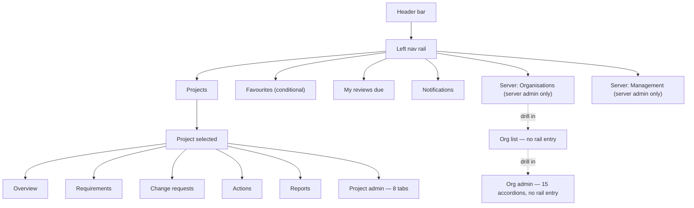
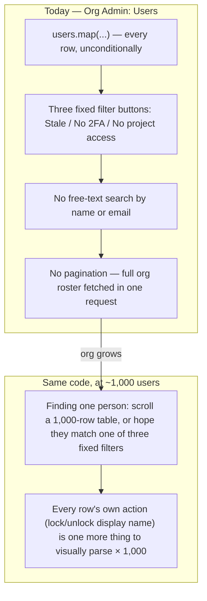

# UX Audit — August 2026

A full review of the frontend's navigation, settings, and creation workflows, run across six passes in August 2026. It produced [docs/ux-style-guide.md](ux-style-guide.md) (the normative rules going forward) and this document (the findings that motivated each rule, plus the implementation roadmap). Several bugs found along the way were fixed immediately rather than left for the roadmap, since fixing a found bug as part of the same piece of work — rather than deferring it — is this project's own working convention; they're recorded under [Already fixed](#already-fixed) below and in [docs/decisions.md](decisions.md).

This document is a point-in-time report — as roadmap items ship, update their Status column here rather than treating this as a permanent record. The style guide it produced is the part meant to stay current indefinitely.

**Fifth pass (2026-08-19), run from the perspective of a UX design team lead doing a fresh top-to-bottom review rather than chasing a specific bug report:** re-examined every page against the style guide the first four passes produced, rather than against the pre-audit UI — the question shifted from "does this follow *some* consistent pattern" to "does this follow *the* pattern the style guide already names." Found: `FilterBadge` (the click-a-badge-to-filter component the fourth pass's roadmap quietly introduced) was never written up as a rule of its own, so two more pages with an identical badge/filter-panel pair still used a plain, inert `.badge`; the CSV wizard's "Export CSV" and "Download template" buttons were still exactly the "two blocks competing for the same job" shape Principle 5 was written against, just for downloads instead of creates; `SidePanel` (built in the fourth pass) had never actually been wired to a real create flow, so Requirements' own single-item create form was still the pre-audit inline block in a new coat of paint — including a genuine bug: the deep link from Project Overview's own "+ New Requirement" landed on that same never-converted inline block, which read as "went to a different, older form" even though the code path was identical; and Org Admin's Users/Groups sections and Project Admin's Groups tab — a flat table and flat accordion-of-accordions respectively, both rendering every row unconditionally — have no search, no pagination, and no way to view what a single user or group actually has access to, the same "unbounded list" failure mode the fourth pass fixed for Project History and the access-review directory, just not checked here yet. See the new findings below and their [Already fixed](#already-fixed)/[Roadmap](#roadmap) entries.

**Sixth pass (2026-08-19), audit-only — findings recorded here for a later session to implement, nothing in this pass was fixed in code.** Where the fifth pass re-checked the UI against rules the style guide already names, this pass went looking for two different kinds of gap: roadmap items marked "Partial" whose actual remaining scope had never been enumerated precisely (`ConfirmDialog`/`Toast` rollout — see [Confirmation and feedback rollout, precisely](#confirmation-and-feedback-rollout-precisely)), and workflow-level gaps no single-page pattern check would surface — the requirement Links/Actions cards' create-and-confirm debt predicted-but-not-yet-fixed back in the fourth pass, still true two passes later ([Links and linked actions](#links-and-linked-actions-the-predicted-debt-is-still-there)); a named-but-unfixed icon inconsistency sitting in the style guide's own Tokens section ([A style-guide-documented inconsistency, still there](#a-style-guide-documented-inconsistency-still-there)); and three workflow-shaped gaps with no precedent anywhere in the app to copy — no bulk operations, no column sorting, and requirements/actions that can be archived but never restored, unlike projects, which can ([Bulk operations](#bulk-operations-none-exist), [Table sorting](#table-sorting-manual-reorder-only), [Archive is one-way for requirements and actions, not projects](#archive-is-one-way-for-requirements-and-actions-not-projects)).

**Seventh pass (2026-08-24), user-reported findings — audit-only, recorded for a later session to implement, nothing in this pass was fixed in code.** Where the first six passes were run by re-checking the UI against the style guide or hunting for undiscovered gaps, this pass started from eighteen specific issues the product owner reported directly from day-to-day use — filter defaults, a requested reversal of Principle 3 (`Modal`, not `SidePanel`/`Popover`, is now the standard container for entity create/rename flows — see the style guide's revised Principle 3 and new [Pattern: modal dialog for entity create/rename](ux-style-guide.md#pattern-modal-dialog-for-entity-createrename), adopted as a direct product decision this pass, not a mechanical audit finding), a genuine workflow gap (no way to approve a requirement at all), and — worth naming since it's the point of validating rather than taking a report at face value — two claims that didn't hold up against the current code (the app/API version display and the "New Requirement" trigger's click behaviour, both investigated and found to already work correctly, or not reproducible as described; see their own sections below). Two further items are explicit reversals of a design decision the fifth pass made deliberately (the Org Admin resource-menu regroup's placement of SSO group mappings, and its "Integrations & Security" group's own consolidation) — named here as reversals rather than silently re-decided, per this project's own rule that a style-guide deviation gets flagged explicitly.

## At a glance

Severity reflects user-facing confusion or risk, not implementation effort — the [roadmap](#roadmap) sorts by effort separately. The first two rows are the most significant findings in the whole review, surfaced on the fourth and final pass; everything else was already visible by the third.

| Severity | Finding |
|---|---|
| High | **Custom terminology covers about 10% of the surface it claims to.** A project can rename six core nouns (requirement, change request, project, stage, component, category) — only two are ever actually consumed anywhere (5 call sites, 3 files: nav labels and two page headings), and the other four are stored config with zero effect on any rendered page. Even the two "working" terms only cover their own list page and nav entry; the requirement detail page, every comment, every review-due list, the CSV import wizard, and Project Admin's own custom-fields dropdown all hardcode the English word regardless of configuration. See [Terminology coverage](#terminology-coverage). |
| High | **Two lists have no pagination at any layer**, one of them a whole deployment's user directory — a project's full change-history timeline and the server-admin access-review table both fetch with no `limit`/`offset` on the frontend or backend, in tension with the app's own U-P-06 recommendation for lazy-loading large data sets. See [Scale](#scale-two-unbounded-lists). |
| Fixed | The mobile nav-rail collapse toggle rendered below 860px with no visible effect — see [Already fixed](#already-fixed). |
| High | **Org Admin is one flat wall of 15 accordions**, all the same visual weight, all collapsed by default. See [The Org Admin wall](#the-org-admin-wall). |
| High | **Reverting to the platform default is a coin flip.** Accent colour has a working revert; header/footer text reverts only if you know to blank the field; logo and login background can't be reverted at all, in the UI or the API. See [Platform defaults & overrides](#platform-defaults--overrides). |
| Medium | Three hand-rolled tab bars, no shared component, no ARIA tab semantics. See [Pattern inconsistency](#pattern-inconsistency). |
| Medium | Every one of the app's 14+ "new X" flows is an inline form — none use a modal, drawer, or popover. See [How things get created](#how-things-get-created). |
| Medium | Filters and list layouts are reinvented on nearly every page; the three "aggregate" pages (Notifications, Favourites, My Reviews Due) present the same kind of data three different ways. See [Pattern inconsistency](#pattern-inconsistency). |
| Info | Bulk requirement creation already exists (a CSV import wizard) — the gap is discoverability, not capability. See [How things get created](#how-things-get-created). |
| Info | The newest feature in the app (requirement-links/"traceability," merged the same day as this review) already reproduces the always-inline, no-confirmation pattern — the debt is still accruing. |
| Fixed | Org-branded login's 2FA step was a genuine dead end, not just an inconsistency — see [Already fixed](#already-fixed). |
| Fixed | Card/tile views overflowed the viewport on phones narrower than ~431px — see [Already fixed](#already-fixed). |
| Medium | **There's no nav-rail entry point to org administration.** `/orgs` — the only path to an org's settings — isn't linked from the persistent chrome for anyone but a server admin. Content browsing itself is fine as-is: projects deliberately pool across every org a user belongs to, which is the right call, not a gap. See [Navigation & the orphan page](#navigation--the-orphan-page). |
| Medium | At least 20 icon-only buttons have no accessible name, none of the three tab bars support arrow-key navigation, and the shared Modal has no focus trap or focus restoration. See [Accessibility](#accessibility). |
| Medium | Project Admin's own 8 tabs — the page held up earlier in this review as the "consistent" contrast to Org Admin — turn out to contain four different delete/reassign behaviours in one file. See [Project Admin's own tabs](#project-admins-own-tabs). |
| Medium | Inviting an external user to a project is a real, working feature with no visible entry point anywhere, reachable only via a component with no keyboard navigation. See [How things get created](#how-things-get-created). |
| Info | Two previously-undiscovered features (per-entity subscribe/unsubscribe, a comment "like" reaction) both already follow every convention correctly — nothing to fix. There's no app-wide search anywhere, only local per-page filters; not a defect, just worth naming. |
| High | **Org Admin's Users/Groups sections and Project Admin's Groups tab have no search and no pagination**, rendering every row (and, for groups, every member of every row) unconditionally — the same unbounded-list failure the fourth pass fixed for Project History and the access-review directory, undiscovered here until this pass checked directory-style admin lists specifically rather than content lists. See [Directories at scale](#directories-at-scale-users-and-groups). |
| Medium | **There's no way to view what a single user actually has access to** — which projects, which groups, which roles — anywhere in the app; an org admin auditing one user's access has to check every project's membership list by hand. See [No way to view a user's access](#no-way-to-view-a-users-access). |
| Fixed | Project Overview's own "+ New Requirement" deep-linked into `RequirementsPage`'s single-create form before it had been converted onto the `SidePanel` component the fourth pass built — since the same form was reached (via a Popover first) from the Requirements page itself, the two entry points were functionally identical but *looked* different, one reflowing the page and one not. Converting the form itself onto `SidePanel` fixed both at once — see [Already fixed](#already-fixed). |
| Fixed | The CSV wizard's "Export CSV" and "Download template" buttons sat side by side, permanently visible and unlabelled as a pair — the same "two blocks competing for the same job" shape Principle 5 was written against for creates, just for downloads. Combined behind one "Export" popover — see [Already fixed](#already-fixed). |
| Medium | **`FilterBadge` (click a badge, it applies as a filter) is real and working, but was never written up as a rule** — so it's inconsistently applied. Four pages use it correctly; Project Actions' outcome badge duplicated its own filter panel's Outcome select without it (now fixed, see [Already fixed](#already-fixed)); several detail/overview pages show a plain `.badge` for a value with no on-page filter to link to, which is correct as-is, not a gap. See [Badges as filter shortcuts](#badges-as-filter-shortcuts-real-but-not-everywhere). |
| High | **Archiving a requirement or an action is a one-way door — the exact same "archive" operation on a project isn't.** `projects.py` has both `/archive` and `/unarchive` endpoints, with a working "Restore" button in Project Admin; `requirements.py` and `actions.py` have only `/archive`, no `/unarchive` counterpart at either layer. Archived items stay visible via an `include_archived`/"archived" filter, so nothing is lost, but nothing in the UI or the API can undo the archive short of a direct database fix. See [Archive is one-way for requirements and actions, not projects](#archive-is-one-way-for-requirements-and-actions-not-projects). |
| Medium | **`ConfirmDialog`/`Toast`, both marked "Partial" on the roadmap since the fourth pass, still cover a minority of the app** — exact remaining scope had never been enumerated. 11 `window.confirm` call sites remain (PAT revoke actions across three separate pages, plus org disable/deactivate/ban/grant-admin); 11 pages perform real mutations with zero `Toast` feedback wired up. See [Confirmation and feedback rollout, precisely](#confirmation-and-feedback-rollout-precisely). |
| Medium | **A requirement's Links and linked-Actions cards are exactly the debt the fourth pass predicted would keep accruing, still unfixed two passes later**: both create flows remain permanently-visible inline rows (never a `Popover`/`SidePanel`), and removing a link or unlinking an action still fires with zero confirmation — the same "fires immediately" bucket the audit's own Confirmation table already named these two actions under. See [Links and linked actions](#links-and-linked-actions-the-predicted-debt-is-still-there). |
| Low | **A style-guide-documented inconsistency that was never actually fixed**: the Tokens section already names `CommentThread.tsx`'s use of `X` instead of `Trash2` for permanently deleting a file as a known exception "worth fixing rather than copying" — it's still `X`. See [A style-guide-documented inconsistency, still there](#a-style-guide-documented-inconsistency-still-there). |
| Medium | **No bulk operations anywhere in the app** — every list (Requirements, Change Requests, Actions, Users, Groups, …) supports only one-row-at-a-time actions; there's no multi-select, no "archive N selected," no bulk role/status change. A CSV import wizard exists for bulk *creation* but nothing plays the equivalent role for bulk *changes* to existing rows. See [Bulk operations: none exist](#bulk-operations-none-exist). |
| Low | **No table supports column-header sorting** — `RequirementsPage`'s list view has a working per-row manual reorder (↑/↓, for priority ordering within a stage) but nothing lets you click "Status" to sort the table by status; same gap on every other data table in the app. See [Table sorting: manual reorder only](#table-sorting-manual-reorder-only). |
| Medium | **Change Requests and Requirements filter selects render raw enum text** (`in_review`, `draft`) instead of the human-readable label map both pages already use correctly for row badges — plus two more instances found the same way (a requirement's version-history table, an Org Admin project-group role badge). See [Change Request and Requirement status filters](#change-request-and-requirement-status-filters-show-raw-enum-values). |
| Medium | **Change Requests has no default filter** — it loads every status, including approved/rejected/withdrawn, with nothing narrowing to what's still open. Same section as above. |
| Info | **App/API version display was investigated and found to already work as designed** — both are live, build-time-injected, and match the deployed image; the one hardcoded constant found (`FastAPI(version="1.0.0")`) only feeds `/docs`/OpenAPI metadata and isn't shown in the UI. See [App/API version](#appapi-version-investigated-working-as-designed). |
| Medium | **The "New Requirement" trigger already opens a menu on click, not a direct navigation** — contrary to how it was reported — but the requested interaction (click performs the default action directly, hover reveals the rest) describes a true split button, a pattern the app doesn't have yet. See [The "New Requirement" trigger](#the-new-requirement-trigger-doesnt-match-the-requested-split-button-interaction). |
| Medium | **CSV import has no "use one fixed value for every row" option for any column** — component/category/level/target version all require a mapped CSV column even when every row in the batch shares the same value — and the wizard itself is still a permanently-visible inline block, not yet in a layer of any kind. See [CSV bulk import](#csv-bulk-import-no-per-field-fixed-values-still-inline-not-modal). |
| Medium | **Org shared resources have almost no way to be consumed outside Org Admin itself** — real consumption exists for change-request attachments and report chapter images, but a dedicated requirement-side linking endpoint (`POST /{requirement_id}/files/link`) has zero frontend call sites anywhere in the app. See [Shared org resources](#shared-org-resources-have-almost-no-way-to-consume-them). |
| High | **There's no way to approve a requirement at all, and no guard stops a change request from targeting a draft one.** A requirement only ever reaches `APPROVED` status as a side effect of a change request being approved — there's no standalone approve action, frontend or backend — and `create_change_request` has no requirement-status check of any kind. See [No requirement approval action](#no-requirement-approval-action-change-requests-can-target-draft-requirements). |
| Medium | **A project member's roles are shown as every role they hold, never collapsed to the effective highest** — Org Admin's "View access" panel and Users table both list every badge side by side with no precedence applied. See [Project role display](#project-role-display-every-role-shown-not-the-effective-highest). |
| Low | **Favourites has no view toggle, no favourites-only project filter, and the nav rail's "Favourites" entry only re-checks on two specific routes** — toggling a favourite elsewhere in the app doesn't update the rail until the next visit to Projects or Favourites. See [Favourites](#favourites-no-filter-nav-rail-lag-no-view-toggle). |
| Medium | **Actions have no equivalent of the requirement-field lock** — a requirement's own fields are gated behind a change request once its status is `APPROVED`/`COMPLETED`, but creating or linking an action has no such check at any requirement lifecycle stage. See [Actions have no draft/change-request gate](#actions-have-no-draftchange-request-gate-unlike-requirement-fields). |
| Low | **Project activity and requirement activity render the same underlying data twice, independently** — both ultimately call `get_project_changes`, but `ProjectHistoryPage` hand-rolls its own list markup instead of the shared `ActivityPanel` component `RequirementDetailPage`/`ChangeRequestDetailPage` already use. See [Project activity and requirement activity](#project-activity-and-requirement-activity-same-data-duplicated-rendering). |
| Medium | **Users and Groups are two accordions on one Org Admin page, not two pages** — and "New user" is still an inline form (unlike "New group," already a `Popover`). Separately, org rename/export/leave-organisation all sit in one undifferentiated header row, and `ProjectListPage`/`ServerOrganisationsPage`'s own create forms are still the pre-audit inline toggle, never converted. See [Org Admin: Users/Groups, org-level actions](#org-admin-usersgroups-org-level-actions-and-two-still-inline-create-forms). |
| Low | **Two explicit reversals of the fifth pass's own Org Admin regroup, both requested directly and flagged here rather than made silently:** SSO's org-wide group→role mapping (currently a flat list on `Organization`, unrelated to `OrgGroup`) should become a property of the group itself, gated on whether SSO is actually configured — a real schema change, not a UI move; the "Integrations & Security" resource-menu group should split into three top-level groups (a flat regrouping, not a new nesting capability). See [SSO group mappings, and Integrations and Security's own growing wall](#sso-group-mappings-and-integrations-and-securitys-own-growing-wall). |
| Low | **Three of the new-requirement form's fields have no visible label** (Name, Reasoning, Description — every other field on the same form does), and its two textareas are a fixed 2 rows with no auto-grow. See [New requirement form](#new-requirement-form-three-unlabelled-fields-no-auto-grow). |
| Medium | **File upload triggers render three different ways across the app** — a properly styled button in exactly one place (`CommentThread.tsx`'s attachment upload), a bare unstyled native file input in eight others, and a third, `.input`-classed look in the three bundle-import forms. See [File upload triggers](#file-upload-triggers-three-different-visual-treatments). |

## Navigation & the orphan page

This diagram shows every route reachable from the left nav rail. Solid arrows are ordinary nav links; dotted arrows mark routes that exist and work but have no rail entry at all, reachable only by drilling through another page first. Read top to bottom: header, then rail sections, then what each leads to. The two dotted paths at the bottom are the finding — org administration, arguably the single most consequential settings surface in the app, isn't in the nav at all. An org admin who isn't also a server admin has no direct path to their own org's settings from the rail; they land there once, usually via a link elsewhere, and have to remember how they got there. This also sits in tension with the product's own responsiveness requirement (`docs/requirements.md` U-P-02): a settings surface with no rail entry doesn't inherit the rail's mobile handling either.

**A narrower, related gap sits behind that same missing entry: there's no way to reach `/orgs` — the only path to org administration — without already knowing the URL.** It isn't linked from the header or nav rail for anyone but a server admin drilling in through `/server/organisations`; an ordinary org admin who wants their org's settings has no path there beyond a bookmark or a stale link they clicked once.

This was originally written up in an earlier draft of this document as a missing "org switcher," modelled on Azure/Entra's tenant switcher — that framing was wrong, and worth correcting rather than leaving in place. Content browsing (`ProjectListPage` and everything scoped under a project) deliberately pools across every org a user belongs to, with an org column/filter surfaced only when there's more than one org to disambiguate — that's a legitimate, different design choice from Entra's "the whole portal is scoped to one tenant" model, not a defect. An always-visible header switcher would suggest exclusive org-scoping the app doesn't actually have, and would need a new `CurrentOrgContext` threaded through the whole app for a problem that doesn't exist. The real, much smaller gap is just the missing nav-rail link to `/orgs` for reaching org *administration* specifically — see [Pattern: wayfinding](ux-style-guide.md#pattern-wayfinding--a-nav-rail-entry-to-org-administration) for the corrected, narrower fix.

## The Org Admin wall

Fifteen top-level sections, every one a `CollapsibleSection` accordion, all collapsed on load, all the same visual weight, in this order: Import/merge org bundle, Users, Projects, Project statuses, Link types, Branding, Report defaults, Report templates, SSO/OIDC, SCIM provisioning, Default template project, Groups, Shared resources, Advanced, Personal access tokens.

Nothing here is wrong in isolation — `CollapsibleSection` is a reasonable, accessible component. The problem is scale and flatness: a once-a-quarter task (SCIM provisioning) and a daily task (adding a user) are typographically identical, and finding either means scanning past the other thirteen first. Compare `ProjectAdminPage`, the equivalent settings surface one level down — it solves the same "many settings, one page" problem with tabs instead, itself the inconsistency in [Pattern inconsistency](#pattern-inconsistency).

Two of the fifteen deserve a closer look, because relocating them wholesale (see [Org Admin, redrawn](ux-style-guide.md#pattern-settings-hierarchy)) isn't enough on its own — they're internally cluttered too:

- **Advanced** — seven unrelated settings domains sharing one accordion and one Save button: SMTP host/port/credentials/TLS, a send-test-email control, PAT max-lifetime, "require 2FA," "allow self-signup" (plus its own auto-accept-domain and external-user-policy sub-settings), and SSO group→role mappings. Only two of the seven have a visible sub-heading ("Test Email," "SSO Mappings") — the rest run together with no separator.
- **Groups** — per-group, two unrelated controls sit back to back with no divider: nested sub-group management and IdP-synced-group-name mapping for SSO/SCIM. Someone scanning for "how do I nest a group" can easily miss where that ends and the IdP mapping field begins.

Both are one more reason a flat accordion doesn't scale here: even a well-labelled section can itself become a wall once enough settings accumulate inside it.

## Project Admin's own tabs

`ProjectAdminPage` is the page the style guide's 5-tab ceiling (see [Principle 1](ux-style-guide.md#principles)) is aimed at — 8 tabs, one more than the Org Admin redesign settled on for a single flat level. It's held up elsewhere in this document as the "at least internally consistent" contrast to Org Admin's wall. On inspection it isn't, quite:

| Issue | Detail |
|---|---|
| Four delete/reassign behaviours, one file | Custom fields delete outright with no reassignment offered and no in-use check. Stages and categories open a reassignment picker unconditionally, before ever attempting a plain delete. Components block deletion outright while any category still references them. Action types are the one tab using the newer plain-delete-then-409-then-reassign contract shared with Org Admin's Project Statuses and Link Types (`docs/decisions.md`). Four shapes for what should be one CRUD pattern, in a single 1,149-line file. |
| A tab whose own heading disagrees with its label | The tab bar calls it "Categories." Its content opens with an `<h2>` reading "Components" — it's actually a two-level component→category tree with no sub-heading distinguishing the two levels beyond a paragraph of left-indent. |
| One hardcoded label | Every other tab's text is pulled from the shared strings table; "Report Setup" is a literal string typed directly into the component — the one tab that would silently stay in English if the app were ever localised. |
| Never reaches for the pattern its own sibling page uses three times | `ProjectAdminPage` never imports `CollapsibleSection` — not even for the two tabs (Categories' two-level tree, Report Setup's four unrelated settings groups) that are exactly the kind of "optional block within a view" it exists for. |
| A "New X" flow with no create form | The Groups tab manages group *membership* only — there's no way to create a new project group from this tab at all, the one create-adjacent surface that breaks the otherwise-universal "every X has an inline create form" pattern. |

None of this makes the 8-tab structure itself wrong — even the page held up as the "good" contrast to Org Admin's flat wall has quietly accumulated its own internal inconsistency, exactly the failure mode Principle 4 (one component per pattern) is written to prevent. A shared "definition-table CRUD" component — list, rename, reorder, delete-with-reassign — would fix the four-behaviours problem in this file alone.

## How things get created

Not a sample — every "new X" flow found across the app, and where it lives today:

| Entity | Current pattern | Location |
|---|---|---|
| New requirement | Inline form, toggle-to-reveal | Requirements page, above the list |
| Bulk requirements (CSV) | Inline wizard, **always on screen** — not even toggled | Requirements page, permanently above the list and the single-add form |
| New change request | Inline form, toggle-to-reveal — a kind selector plus a per-field checkbox-to-reveal editor for each changeable requirement field | Change Requests page, above the list |
| New requirement link ("traceability") | Inline form, always visible | Requirement detail page — the newest feature in the app, already following this pattern |
| New requirement action (create-and-link) | Inline form, toggle-to-reveal — the one place already using progressive disclosure well | Requirement detail page, Actions card |
| New project action | Inline form, toggle-to-reveal | Project Actions page, above the list |
| New project | Inline form, toggle-to-reveal — shares one form with bundle import | Project List page |
| Project bundle import | One more field in the new-project form, not a separate flow | Same form; picking a file silently hides the template picker with no explanation |
| New organisation | Inline form, toggle-to-reveal — same file-vs-template branching as new project | Server Organisations page |
| New org group | Inline form | Bottom of the Groups accordion, Org Admin |
| New org user | Inline form | Bottom of the Users accordion, Org Admin |
| New custom field | Inline form | Bottom of the Custom Fields tab, Project Admin |
| New report template | Accordion-in-accordion | Nested `CollapsibleSection` inside Report Templates, Org Admin |
| New personal access token | Nested accordion (`variant="plain"`) | Preferences page, PATs tab — the same idiom reused for change-password and 2FA enrollment too, three times on one page |
| Vote comments (read-only) | Modal | Change Request detail page — the app's only modal usage, and not a create flow |

Zero of the fourteen actual create-entity flows use a modal, drawer, or popover — those components either don't exist (drawer) or exist but are used for something else entirely (modal). Every create action pushes the surrounding list down. The one partial exception, "create and link" on the Requirement Actions card, already shows the app doesn't need new infrastructure to do this well — it just needs the pattern applied everywhere.

**A fifteenth create flow with no visible trigger at all:** inviting an external, non-org-member user to a project is real and working — Project Admin's Groups tab reuses its ordinary "add a member" autocomplete, and typing an email with no matching account silently turns it into an invite. There's no "Invite" button anywhere, and no visual cue that the field does anything beyond adding an existing member. The autocomplete component that hosts it has no keyboard navigation at all — no arrow keys, no Enter-to-select — so the only entry point to inviting an external collaborator is mouse-only and undiscoverable unless someone already knows the trick.

## Platform defaults & overrides

ReqTrack has a real two-tier settings model — a platform-wide default, optionally overridden per organisation — for branding, footer identity, and the "organisation" label itself. The model is sound; the UI's treatment of it isn't consistent:

| Setting | Override control | Revert path | Verdict |
|---|---|---|---|
| Accent colour | "Use own accent colour" checkbox | Uncheck, save — reverts cleanly | Works |
| Header title / footer identity text | Plain text input, no checkbox | Clear the field to empty, save — works, but nothing tells you that | Undiscoverable |
| Org logo | Upload only | None — no remove control, no `DELETE` endpoint exists | No revert |
| Login background image | Upload only | None — same gap as logo | No revert |

The platform-wide defaults themselves live on a fourth, entirely different page (`/server/management`, tabbed), so an admin comparing "what's the platform default" against "what's my org set to" is reading two pages built with two different navigation patterns to answer one question.

## Confirmation & feedback

Two separate questions, both answered inconsistently: before a destructive action, does anything ask "are you sure"? After any action, does anything say "done"?

**Before: four patterns for one question.** No shared confirm-dialog component exists anywhere in the codebase:

| Pattern | Where | Roughly how often |
|---|---|---|
| Native `window.confirm` | Deactivate/ban/promote a user, revoke PATs, disable an org, archive an action | 12 call sites, 5 files — mostly account/access and PAT actions |
| Inline "confirm this row" reveal | Delete a project component, stage, category, or action type — Project Admin | 4 call sites, 1 file |
| Type-the-exact-name-to-confirm | Delete an organisation — the single most destructive action in the app | 1 call site — and arguably the right tier of friction for what it guards |
| Nothing — fires immediately | Archive a requirement, remove a link, unlink an action, delete a report template, revoke a SCIM token, delete a resource file, remove an SSO mapping, leave an org, reject a change request, remove a file attachment | At least 15 call sites — the single most common answer is no confirmation at all |

The clearest single example: archiving a requirement and archiving an action are the same operation, on structurally near-identical detail pages — one confirms with `window.confirm`, its sibling does not. Rejecting a change request has no confirmation of any kind despite finalizing a decision that can't be un-rejected from that screen — arguably higher-stakes than most of the deletes that do get a native confirm.

**After: silence, mostly.** There's no toast/snackbar component. Success feedback exists in exactly one place — the CSV import's "N created, M error(s)" summary card. Every other create/save/delete/vote/archive/link/comment simply re-renders the list and trusts the user to notice. Error handling fares a little better but is still ad hoc: each page tracks its own error-state variable and renders its own inline red text, and several mutating calls (reordering a requirement list, casting a vote, toggling a task, archiving an action) have no try/catch at all, so a failed request fails with zero visible feedback.

## Terminology coverage

Every project can rename six core nouns via Project Admin's Terminology tab. Checking where those overrides actually apply turned into the most consequential finding in this review — this isn't a visual inconsistency, it's a product feature that mostly doesn't do what its own settings screen promises.

| Configurable term | Actually consumed anywhere? |
|---|---|
| Requirement | Partially — nav label, page heading, "New X" button on 2 pages. Everywhere else on the requirement's own detail page: no. |
| Change request | Partially — same shape as Requirement. |
| Project | Never — zero call sites. |
| Stage | Never — zero call sites. |
| Component | Never — zero call sites. |
| Category | Never — zero call sites. |

Even the two "partially" terms only cover their own list page and nav entry — the requirement detail page, its comment thread, its subscribe button, every review-due list, and the CSV import wizard's own column hints all hardcode the English noun regardless of what's configured. The sharpest example: **Project Admin's Custom Fields tab has an entity-kind dropdown that literally reads "Requirement" / "Change request"** — sitting on the same page, one tab over from the Terminology settings that are supposed to rename those exact words. A project that renamed "requirement" to "user story" would see that rename hold for about two sentences before the old word reappears everywhere that actually matters.

## Scale: two unbounded lists

`docs/requirements.md`'s U-P-06 recommends "lazy loading of large data sets." Project List already does this correctly — `limit`/`offset` on both ends, `LoadMoreButton` wired up. Checking every other list page against the same bar found two genuine violations and several that are fine by nature, not by design:

| List | Bounded? | Realistic risk |
|---|---|---|
| Project change-history timeline | No limit anywhere — frontend or backend | A project's entire audit trail, for its entire life. Highest risk here — this list only grows. |
| Server access-review user directory | No limit anywhere | Every user account in every org on the deployment, in one request. Hundreds to thousands of rows for a real multi-tenant install. |
| Project actions list | No limit anywhere | A long-lived project's full action history — real but slower-growing risk than the two above. |
| Org user list, server org directory, favourites/template project fetches | No limit | Moderate — genuinely large only for a big org or a mature multi-tenant deployment. |
| PAT list, reviews-due lists, one item's own history/comments/links | No limit | Low — self-limiting by nature (one user's tokens, currently-overdue items, one record's own activity). |

Project List proves the pattern already exists in this codebase and works — the fix for the top two rows is applying it, not inventing it.

## Directories at scale: Users and Groups

The table above already flags the *org user list* as "moderate" risk on pagination grounds alone. Looking at Org Admin's Users and Groups sections, and Project Admin's Groups tab, specifically as *directories* — surfaces someone searches, not just scrolls — turns up a sharper problem than missing `limit`/`offset`: there's no way to find one record at all once there are more than a screenful.

Read this top to bottom: the left branch is the code as it stands today (`OrgAdminPage.tsx`'s Users section renders `users.map(...)` straight into a `<table>`, no `search`/`limit`/`offset` params sent anywhere); the right branch is what that same code does once an org actually has the user count the product is meant to scale to. The three filter buttons (stale / no-2FA / no-project-access) are genuinely useful *audit* views, not a substitute for search — none of them helps find "the one user named Priya," which is the actual daily task. Org Admin's Groups section and Project Admin's Groups tab (`ProjectAdminPage.tsx`) share the identical shape one level down: every group renders as its own always-expanded block with its *entire* member list inline (name, email, and a remove button, per member, per group) — at 100 groups this isn't a long page, it's a page that never finishes rendering content the admin didn't ask to see yet.

This matters here specifically (not just as a restatement of the pagination finding above) for two reasons the org-user-list table row didn't capture: first, unlike Project History or the access-review table — lists someone scans in order — a user or group directory is something someone *searches*, so the fix isn't only pagination, it's a search box, the same way `RequirementsPage`'s own search-by-name-or-ID already works for requirements. Second, Groups' "render everything inline, expanded, all the time" shape doesn't have a `LoadMoreButton`-shaped fix at all — the fix is closing that inline expansion by default (a group's member list on demand, not unconditionally) *and* paginating the group list itself, both at once. See [Roadmap](#roadmap).

## No way to view a user's access

A related, distinct gap: even with unlimited scroll and perfect search, nothing in the app answers "what does this one user actually have access to" — which projects, which role on each, which org/project groups they're a member of. Today an org admin has to work backwards: open every project's own group-membership tab and read down the list looking for one name, project by project. `OrgUser`'s own row in Org Admin's Users table stops at email/name/org-roles/status/2FA — real information, but none of it project- or group-scoped.

This is the same shape as the create-flow gap the fourth pass fixed with `SidePanel`, just for *viewing* instead of creating: a row in a directory table has no equivalent "click it, see the whole record in a layer, without leaving the list" affordance. Every other "view the full picture" need in the app (a requirement, a change request, an action) already gets its own detail page or panel — a user is the one entity type in the app you can list but never actually open. See [Roadmap](#roadmap) and the style guide's new "Pattern: entity detail panel."

## Badges as filter shortcuts, real but not everywhere

`FilterBadge` — a `.badge` that's also a button, applying (or clearing) itself as a filter when clicked — was built in the fourth pass and already covers four pages correctly: `RequirementsPage` (status), `ChangeRequestsPage` (status), `ProjectListPage` (stage/visibility), `ServerOrganisationsPage` (active/disabled). It never made it into the style guide as a named rule, though — only as working code — so it wasn't something a later page's author could consult before reaching for a plain `.badge` instead. `ProjectActionsPage` is the clean example: its results table showed a requirement action's outcome as a plain ``, one column over from a `FilterPanel` with an Outcome `<select>` driven by the exact same value — the filter and the badge already agreed on what the data meant, they just weren't wired together. Fixed this pass (see [Already fixed](#already-fixed)); the style guide now states the rule explicitly (see "Every badge that names a filterable value is a `FilterBadge`" in [docs/ux-style-guide.md](ux-style-guide.md)) so the next page with this exact shape has something to check against instead of a precedent to notice or miss.

Not every plain `.badge` is a gap, though, and it's worth naming the negative case so this doesn't read as "convert every badge everywhere": Project Overview's stage-status and activity-entity badges, and every badge on a requirement/action/change-request *detail* page, name a value with no on-page filter control to link to — `FilterBadge` only applies where a matching filter already exists on the same page. Those stay plain `.badge`s correctly.

## Pattern inconsistency

Counting every instance of each "container" pattern makes the inconsistency concrete — and it isn't limited to accordions vs. tabs:

| Pattern | Implementation | Where used | Instances |
|---|---|---|---|
| Accordion | `CollapsibleSection.tsx` (shared, accessible) | Org Admin (15), Preferences (3 nested), Reports (6) | ~24+ |
| Tabs | Hand-rolled per page, no shared component, no ARIA | Project Admin (8), Server Management (4), Preferences (5) | 3 separate implementations |
| Modal | `Modal.tsx` (shared, accessible) | Change Request vote-comment viewer | 1, non-destructive, read-only |
| Drawer / side panel | — | Does not exist | 0 |
| Popover / rich hover panel | `Tooltip.tsx` — label-only, not rich content | Nav rail, rich text editor, notification bell | Dozens, all plain-text |

Preferences is the clearest single-page demonstration: tabs at the top level, with the same nested-accordion idiom reused three separate times inside two different tabs (change-password, two-factor enrollment, new-PAT creation) — one page independently re-deriving "many settings, one page" twice, at two different depths, with no documented rule to converge on.

**Filters, four more ways.** `FilterPanel` is used on exactly 3 pages (Requirements, Change Requests, Actions). At least 4 more with comparable needs rolled their own: a five-control inline row on Project List; a bare pair of selects on Project Reviews Due — whose own code comment calls it "a filter panel" despite not using the component; search-plus-status-buttons on Server Organisations; search-plus-checkbox on Notifications. Project History adds a fifth idiom, a horizontal date-range bar.

**One kind of page, three shapes.** Notifications, Favourites, and My Reviews Due are all "your stuff, across every project" list pages, and each presents that list differently — a clickable-card list with pagination, a card grid with none, and a plain table with neither filters nor pagination. My Reviews Due's own project-scoped sibling page adds component/reviewer filters the cross-project version lacks entirely, despite covering the same data.

**Copy, in two grammars at once.** Opening a create form is (almost) always labelled "New X" — except every "definition table" row (a stage, custom field, action type, project status, link type, org group, org user) skips the open step entirely and merges "open" and "submit" into one "New X" button, while requirement/CR/action/project/org creation keeps them as two separate steps, a toggle labelled "New X" followed by a form that submits with the word "Create." The one outlier from "New X" altogether is requirement-link creation, labelled "Add link" — and the report-template edit button oscillates between "New report template" and "Save" depending on state without ever swapping its icon to match.

**Icons: disciplined, with two exceptions.** `Plus`/`Pencil`/`ArrowUp`-`Down`/`Trash2` are each used consistently for add/edit/reorder/delete almost everywhere — genuinely one of the more consistent parts of the app. Two collisions stand out: permanently deleting an uploaded file is `Trash2` in `FileAttachmentList` but `X` in `CommentThread` — the same server-side delete, two icons depending only on which component renders the control — and the one report-template Edit button in the app has no icon at all, where every other rename/edit affordance pairs the action with `Pencil`.

**Badges are the exception that proves the rule.** Worth naming as a positive: every status/type/role chip reuses one shared `.badge` CSS class, applied directly rather than reimplemented per page — the one small reusable visual pattern that never fractured into competing versions, without ever needing a shared component to stay that way. Minor nits only: two call sites use a `
` where every other badge is a ``, one badge carries a one-off inline colour override, and "archived" is independently re-implemented as its own conditional badge in three unrelated files.

**Two smaller one-offs, found auditing the shared text components directly.** `RichTextEditor`'s link-insert control is the one place in the app using the browser's native `window.prompt()` instead of the app's own `Modal`. Separately, comments are the one long-form text field that's plain-text-only — every other prose field (report intros, chapters) goes through the same rich-text component comments never do, worth a deliberate call on whether that's intentional (keeping discussion lightweight) rather than an oversight.

## Confirmation and feedback rollout, precisely

Both `ConfirmDialog` and `Toast` shipped in the fourth pass and were deliberately piloted on 2-3 real call sites rather than swept mechanically across the app — a considered decision at the time ("which mutations get which message text is a judgment call, not a mechanical one"), logged as "Partial" on the roadmap ever since. This pass enumerated the actual remaining gap precisely, since "~12 call sites" (the roadmap's own estimate) is different from a list a future session can work through directly.

**`window.confirm` remaining — 11 call sites, all PAT revocation and org/account actions, none converted:**

| File | Call sites |
|---|---|
| `OrgAdminPage.tsx` | 3 — PAT descope-all, PAT revoke-all, PAT revoke-one (`:417`, `:423`, `:2080`) |
| `ServerManagementPage.tsx` | 5 — deactivate account, ban org, grant server-admin, revoke server-admin, PAT revoke-all (`:62`, `:71`, `:80`, `:85`, `:90`) |
| `PreferencesPage.tsx` | 2 — PAT revoke-all, PAT revoke-one (`:210`, `:600`) |
| `ServerOrganisationsPage.tsx` | 1 — disable organisation (`:94`) |

Every one of these is a Tier 1 (ordinary, ConfirmDialog-without-typed-text) case per the style guide's own two-tier pattern — none rises to organisation deletion's level of consequence. The PAT actions are the clearest cluster: personal access tokens have their own list-and-revoke UI duplicated three times (Org Admin, Server Management, Preferences — already named in the audit's "How things get created" table as the same "New PAT" idiom reused three times on one page), so the same four `window.confirm` calls exist three times over with nothing shared between them.

**`Toast` feedback missing — 11 pages perform real mutations (`api.post`/`api.put`/`api.delete`) with no `useToast` import at all:** `ChangeRequestDetailPage.tsx`, `ChangeRequestsPage.tsx`, `FavouritesPage.tsx`, `NotificationsPage.tsx`, `PreferencesPage.tsx`, `ProjectActionsPage.tsx`, `ProjectListPage.tsx`, `ReportsPage.tsx`, `RequirementsPage.tsx`, `ServerManagementPage.tsx`, `ServerOrganisationsPage.tsx`. `RequirementsPage.tsx` and `ProjectActionsPage.tsx` are worth flagging specifically: both got real interaction-model work this pass (`SidePanel` create form, `FilterBadge` wiring) without picking up `Toast`, since that wasn't in scope for either fix — a create/archive/move on either page still just silently re-renders the list, no different from the pre-fourth-pass baseline.

Not a recommendation to sweep all 22 (11 + 11) in one pass — the fourth pass's own reasoning for piloting narrowly still applies, message copy is a judgment call per mutation. This section exists so a future session can pick a page and go, rather than re-deriving the list from scratch.

## Links and linked actions: the predicted debt is still there

The fourth pass's own "How things get created" table flagged this at the time: *"the newest feature in the app (requirement-links/'traceability,' merged the same day as this review) already reproduces the always-inline, no-confirmation pattern — the debt is still accruing."* Two passes later, `RequirementDetailPage.tsx`'s Links card and linked-Actions card are unchanged:

- **Add link** (`newLinkTargetId`/`newLinkTypeId` selects, `addLink()`) and the Actions card's **link existing / create-and-link** row are both still permanently-visible inline rows, never converted to `Popover`/`SidePanel` — the exact create-flow shape Principle 3 is written against, on a feature that didn't exist yet when Principle 3 was written.
- **Remove link** (`removeLink(link.id)`, `RequirementDetailPage.tsx:644`) and **unlink action** (`unlinkAction(a.id)`, `:697`) both fire immediately with zero confirmation — these are literally named in the audit's own Confirmation table ("remove a link, unlink an action") under "Nothing — fires immediately," and remain there.

Named specifically because this is a case where "the debt is still accruing" was flagged as a prediction and turned out to be exactly right — every other roadmap item from the fourth pass shipped, and this one wasn't even on the roadmap to begin with, since it was noted as an aside rather than given its own line item. It should get one now: converting Add Link / Link Existing Action / Create and Link Action onto the same `Popover`/`SidePanel` shape the rest of the app now uses, and wrapping `removeLink`/`unlinkAction` in `ConfirmDialog`, are both small, well-scoped S-effort fixes with direct precedent to copy from elsewhere on the very same page (the Comments card's own edit-in-place pattern, and the Archive button's existing `ConfirmDialog` usage).

## A style-guide-documented inconsistency, still there

The style guide's own Tokens section already names this: *"`X` is used for 'permanently delete a file' in `CommentThread.tsx` where `Trash2` is used everywhere else for the same action."* `CommentThread.tsx` still imports and renders `X` (not `Trash2`) for its attachment-removal buttons (three call sites: the posted-attachment remove button, the pending-upload-during-edit remove button, and the pending-upload-during-compose remove button). A one-icon-import, three-call-site swap — flagged as worth fixing back when the style guide's Tokens section was first written, never picked up since. Listed here mainly as a reminder that a finding living only in the style guide's prose (not the audit doc's own roadmap table) is easy for a future pass to miss; added to the roadmap below so it has a tracked line.

## Bulk operations: none exist

Every list in the app — Requirements, Change Requests, Actions, Org/Project Users and Groups, Notifications — supports exactly one shape of interaction: act on one row at a time. There's no checkbox column anywhere, no "N selected" toolbar, no bulk archive/reassign/status-change on any list. The CSV import wizard already proves the app's users need to create many requirements at once (Principle 5 exists because of it) — nothing plays the equivalent role for *changing* many existing rows at once (e.g. bulk-moving a batch of requirements to a new target stage after a scope cut, or bulk-archiving a set of superseded actions).

This has no existing pattern anywhere in the app to point a future implementation at — unlike most of this document's findings, which are "page X didn't follow the pattern pages Y and Z already established." A first implementation (most naturally on `RequirementsPage.tsx`, the highest-volume list) would need to invent the shape: a checkbox per row plus a header "select all" checkbox, a toolbar that appears once ≥1 row is selected (replacing or sitting alongside the page's normal action row), and the bulk action itself going through the same `ConfirmDialog`/`Toast` machinery a single-row action would. Worth a design pass before implementation, not just a straight build — this is a new interaction pattern for the app, exactly the kind of decision the style guide exists to make once rather than let a first implementation decide unreviewed.

## Table sorting: manual reorder only

`RequirementsPage.tsx`'s list view has a working manual reorder (↑/↓ buttons, moving a requirement up or down within its target stage) — but that's priority ordering, a different thing from *sorting*, and no table column anywhere in the app can be clicked to sort by it. `<th>ID</th>`, `<th>Name</th>`, `<th>Status</th>` etc. are plain text on every list-view table (`RequirementsPage`, `ChangeRequestsPage`, `ProjectActionsPage`, Org Admin's Users table, and more) — none are buttons, none carry a sort indicator.

Whether this is worth building depends on how the two pagination/scale fixes above land: once Org Admin's Users table (or a large Requirements list) has real pagination, "sort by X" becomes materially more useful than it is at seed-data scale, since right now the *filter* panel already gets you most of the way to "find the rows I care about" for the lists small enough that sorting doesn't matter yet. Flagged here rather than roadmapped with an effort estimate, since the right scope (client-side sort of the current page vs. a `sort`/`order` query param the backend honours) depends on how large these lists are expected to actually get in practice — a product question as much as a UI one.

## Archive is one-way for requirements and actions, not projects

`backend/app/routers/projects.py` has both `POST /{project_id}/archive` and `POST /{project_id}/unarchive`, and `ProjectAdminPage.tsx` has a working "Restore" button wired to the latter. `backend/app/routers/requirements.py` and `backend/app/routers/actions.py` each have an `/archive` endpoint and *no* `/unarchive` counterpart — grepped directly, not inferred from the UI's silence. Archived requirements and actions stay reachable (both list pages have an `include_archived`/"archived" filter, so nothing disappears), but once archived, nothing in the UI or the API can move either back to active — not a missing button, a missing endpoint.

This is worth flagging above the usual "missing button" severity: Tier 1 confirmation (a lightweight `ConfirmDialog`, per the style guide's own two-tier model) is explicitly *for* actions that are undoable in spirit even if not instantly reversible — the style guide's confirmation pattern assumes a "such-and-such was archived, here's a way back if that was a mistake" story exists somewhere. For requirements and actions, it currently doesn't; a mis-click has the same practical consequence today whether it goes through `ConfirmDialog` or `window.confirm`, since neither path leads anywhere reversible afterward. Projects prove the reversible version isn't a large change (same `is_archived`/`archived_at`/`archived_by` shape, one more endpoint, one more button) — closing this gap for requirements/actions is applying an existing, working pattern from elsewhere in the same codebase, not inventing one.

## Accessibility

Not audited at all before this review. The results are concentrated rather than systemic — one component checks out clean, the gaps cluster in the newest and most feature-dense surfaces:

| Area | Finding |
|---|---|
| Icon-only buttons | At least 20 confirmed with no `aria-label` and no `title` fallback — a screen reader announces only "button." Heavily concentrated in `OrgAdminPage.tsx` and `ProjectAdminPage.tsx`, the app's two densest pages. The correct pattern (`title` + `aria-label` together) already exists elsewhere — `RequirementsPage.tsx`'s reorder buttons, for one — so this is inconsistency, not a missing capability. |
| Tab bars | All three hand-rolled tab bars are individually Tab/Enter-operable (native `<button>`s) but none support Left/Right arrow-key navigation between tabs — the behaviour `role="tablist"`/`role="tab"` semantics would both signal and require. |
| `Modal.tsx` | Correct `role="dialog"`/`aria-modal`/`aria-label`, closes on Escape, backdrop click works. No focus trap — Tab can walk a keyboard user out of an open modal into the page behind it — and no focus restoration on close. |
| `CollapsibleSection.tsx` | Checks out — correct `role="button"`, `tabIndex`, `aria-expanded`, Enter and Space both handled with `preventDefault`. One narrow edge case: a non-string `title` prop gets no `aria-label` fallback, though no current caller triggers it. |

## Change Request and Requirement status filters show raw enum values

Two related findings, one about defaults and one about display, both on the same two pages.

**No active-only default.** `ChangeRequestsPage.tsx:107` and `RequirementsPage.tsx:72` both initialise `statusFilter` to `""` — every status loads by default, including `approved`, `rejected`, and `withdrawn` for change requests. Reported specifically for Change Requests: a list of change requests is usually consulted for what still needs a decision, not a permanent archive of every decision ever made, so the default view should be active only (`draft`/`submitted`/`in_review` — `backend/app/models/enums.py:93-101` for the full `ChangeRequestStatus` enum), with the existing filter still able to widen back out to everything.

**Raw enum text in filter `<select>` options.** Both pages already have a label map (`REQUIREMENT_STATUS_LABEL`, `frontend/src/api/types.ts:22`; `CHANGE_REQUEST_STATUS_LABEL`, `:37`) and use it correctly for every row's status badge (`ChangeRequestsPage.tsx:684`/`:705`; `RequirementsPage.tsx:778`/`:848`) — but each page's own filter `<select>` renders the raw backend string instead: `ChangeRequestsPage.tsx:39-41`'s `CR_STATUS_OPTIONS` array rendered at `:730-736` as `<option value={s}>{s}</option>`, and the identical shape in `RequirementsPage.tsx:37`/`:889-895`. A user sees "Status: in_review" in the dropdown and "In review" on every row using that status. Two more instances of the same bug turned up during this pass, not originally in scope: `RequirementDetailPage.tsx:649`'s version-history table renders `{h.status}` raw (its own status badge at `:467` uses the label map correctly), and `OrgAdminPage.tsx:1622`'s project-group role badge renders `{g.role}` raw despite `PROJECT_ROLE_LABEL` being used correctly two lines away.

This is exactly the kind of thing worth stopping from recurring rather than just fixing the four known instances — see the new style-guide rule (Principle 12) and the corresponding addition to this project's own agent instructions.

## App/API version: investigated, working as designed

Reported as "doesn't seem to update between releases." Investigated rather than taken at face value, per this project's validation rule for reported claims — and the two version fields actually visible in the UI check out as already correctly wired:

- Frontend: `frontend/src/version.ts` reads `import.meta.env.VITE_APP_VERSION`/`VITE_GIT_SHA`/`VITE_BUILD_DATE`, set as Docker build ARGs (`frontend/Dockerfile:12-17`).
- Backend: `backend/app/version.py` reads `APP_VERSION`/`GIT_SHA`/`BUILD_DATE` from env, set via `backend/Dockerfile:9-12` ARGs, exposed live at `GET /api/v1/system/version` (`backend/app/routers/system.py:55-65`).
- CI computes a real GitVersion SemVer and passes it as a build-arg to both images on every build (`.github/workflows/ci.yml:653-670`).
- Both values render together at the bottom of the nav rail (`Layout.tsx:218-220`), the backend one fetched live rather than baked into the bundle.

**The one genuinely stale value found:** `backend/app/main.py:81` — `FastAPI(..., version="1.0.0", ...)`. This only feeds the OpenAPI schema/`/docs` metadata, is never read from or synced with `app.version.APP_VERSION`, and isn't displayed anywhere in the actual UI — worth fixing for its own sake (a hardcoded `1.0.0` in `/openapi.json` forever is its own small inconsistency) but not the cause of what was reported.

If the versions shown in the running app genuinely aren't moving between deploys, the code path itself isn't where to look — the likelier causes are outside this repo's application code: a browser caching the old JS bundle (the version string is baked into the bundle at build time, so a stale service worker or aggressive CDN/browser cache would show an old value even after a real deploy), a deploy that reused an old image tag, or a build invocation that didn't actually pass fresh `APP_VERSION`/`GIT_SHA`/`BUILD_DATE` build-args for that particular build. Worth a quick check of the actual deployed image's build args before spending further engineering time on the frontend/backend code, which already does the right thing.

## The "New Requirement" trigger doesn't match the requested split-button interaction

Reported as: clicking the "New Requirement" button always navigates straight to the single-create form, and only a long-press reveals the "Add one"/"Import from CSV" menu.

Checked against the current code and doesn't match: `RequirementsPage.tsx:434`'s trigger button's `onClick` toggles `addMenuOpen`, opening a `Popover` (`:437-461`) with two explicit options — "Add one" (`:440-449`) and "Import from CSV" (`:450-459`). A single click already opens the menu; nothing about the current wiring routes a plain click straight to the create form. (The one path that *does* skip the menu is the `?new=1` deep link from Project Overview's "+ New Requirement" link, `RequirementsPage.tsx:190-199` — a different, deliberate entry point, not the button in question, and not something reachable by clicking the same button twice.)

What the description actually asks for is a different, legitimate interaction than what exists today, though: a true split button, where clicking the main label performs the default action ("Add one") immediately, and the secondary option ("Import from CSV") is revealed by hovering or clicking a small separate affordance (a chevron), rather than every click on the whole button opening a two-option menu first. That's not a bug fix on the current `Popover`-based menu — it's a different, not-yet-built component. See `Pattern: split-button trigger` in the style guide, added this pass — the same shape would apply anywhere else a primary action currently hides behind a menu of exactly one common case plus one alternative, not just this one button.

## CSV bulk import: no per-field fixed values, still inline not modal

`CsvImportWizard.tsx` today: still a permanently-visible inline block (`:225-374`, a plain `
`), not yet moved into any layer — its own file-picker trigger is even suppressed when embedded in `RequirementsPage` (`showImportTrigger={false}`, `RequirementsPage.tsx:467`) since the page's own "+ New Requirement" `Popover` is what opens it now, but the wizard's body itself still renders inline once opened rather than inside a `Modal`/`SidePanel`.

Its column-mapping step (`buildFields()`, `:31-60`) maps every field — `name`, `component_prefix`, `category_prefix`, `reasoning`, `clarification`, `description`, `level`, `target_version`, `owner_email`, `keywords`, `review_date`, `review_lead_days`, `reviewer_email`, plus one `cf_<name>` per custom field — to a CSV column only (`mapping[field.key]` dropdown of `headers`, `:293-303`). There's no per-field toggle for "apply one fixed value to every row in this batch instead," which is the actual gap reported: a batch import where every requirement shares the same component/category/level/target version currently has to repeat that value in every single CSV row rather than setting it once in the form.

Two changes, worth scoping separately since they're independent: (1) move the wizard's body into a `Modal` once opened (per the revised Principle 3 — this is exactly a multi-field entity-creation flow, the same shape as "New Project"), and (2) add a per-field "map from column" / "use one value for all rows" toggle to `buildFields()`'s mapping step, defaulting to column-mapped (today's only mode) for backward compatibility, with a fixed-value input replacing the column dropdown when the toggle is flipped. Worth prioritising which fields get the toggle first by how often they're genuinely batch-uniform in practice — component/category/level/target_version are the ones actually named as wanting it; name/reasoning/description are inherently per-row and shouldn't get one.

## Shared org resources have almost no way to consume them

Reported as "there's no way of using [org shared resources] anywhere else." Checked against the actual endpoints and it's more nuanced than that — real consumption exists in two places already:

- Change request attachments: a checkbox picker over the shared-resource pool (`ChangeRequestsPage.tsx:452-467`), stored as `proposed_attachment_file_ids` on `ChangeRequestVersion` (`backend/app/models/change_request.py:86-92`), materialised into real `RequirementFile` rows on approval (`decide_change_request`, `backend/app/routers/change_requests.py:467-492`).
- Report chapter images resolve from the same `is_org_resource` pool (`backend/app/routers/reports.py:91,114,125,150`), surfaced in `ReportsPage.tsx:105-110`.

What's actually missing is narrower than "no way to use them anywhere": a dedicated backend endpoint for linking a shared resource straight onto a requirement already exists — `POST /{requirement_id}/files/link` (`backend/app/routers/requirements.py:1187-1217`, `link_org_resource`) — but has **zero frontend call sites anywhere in `frontend/src/`**. `RequirementDetailPage.tsx`'s own Attachments card (`:659-668`) only wires `FileAttachmentList`'s direct-upload/-remove, with no path to the org's shared pool at all — dead backend code, from the frontend's perspective.

The Lucid-style two-pane picker (a source list on the left, the actual files on the right) described in the request is a real gap, though — nothing like it exists today; `OrgAdminPage.tsx`'s own Shared Resources section (`:1244-1268`) is upload/list/delete only, with no "pick and attach elsewhere" affordance leading out of it. Building this as a new, reusable `Modal`-based resource-picker component (see `Pattern: resource picker dialog` in the style guide) and wiring its first real call site to the already-existing-but-unused `/files/link` endpoint on `RequirementDetailPage.tsx` closes the concrete half of this gap; the component itself, once built, is what a future report-chapter-image picker (which today has its own bespoke selection logic in `reports.py`) can reuse instead of rebuilding its own.

## No requirement approval action; change requests can target draft requirements

Two related, both real, both backend-level gaps rather than missing buttons:

**No standalone approve action exists anywhere.** `services/requirements.py` has `create_requirement` (always starts as `draft`), `apply_new_version`, `archive_requirement`/`unarchive_requirement` — no `approve_requirement`. The only place a requirement's status ever becomes `APPROVED` is as a side effect of a change request being approved: `decide_change_request` (`backend/app/routers/change_requests.py:437-466`) unconditionally sets `status_value=RequirementStatus.APPROVED` (line 457) whenever a `MODIFY_REQUIREMENT` CR is approved — worth flagging on its own, separate from the missing-button finding: this fires *regardless of the requirement's prior status*, so approving a CR against a requirement that was already `COMPLETED` would silently revert it to `APPROVED`. No frontend button for a standalone approve exists on `RequirementDetailPage.tsx` either (the only status-changing controls there are the archive/restore buttons, `:402`/`:407`).

**Nothing stops a change request from targeting a draft requirement.** `create_change_request` (`change_requests.py:147-236`) checks only that the requirement exists and belongs to the project (`:167-169`) and a role/toggle gate (`_require_can_create_change_request`, `:96-106`) — no requirement-status check of any kind. A `MODIFY_REQUIREMENT` change request against a `draft` requirement is accepted today with no guard, frontend or backend.

The reported complaint ("change requests shouldn't be able to be created on draft requirements as it makes no sense") points at the right underlying design gap: change requests exist to gate edits to a requirement once it's no longer safe to edit directly (mirroring `LOCKED_STATUSES = {APPROVED, COMPLETED}` at `services/requirements.py:25`, which already locks direct field edits at that point) — a draft requirement isn't locked, so it should be editable directly, with change requests reserved for once it's past `draft`. Closing both gaps together is one coherent piece of work: add an explicit approve action (the actual, currently-missing path out of `draft`, gated by role) and add the requirement-status guard to `create_change_request` that rejects (or simply doesn't offer, in the UI) a CR against a still-draft requirement. This needs a short design decision on exactly which `RequirementStatus` transitions (`enums.py:76-83`: draft/reviewed/approved/completed/archived) require a CR to modify vs. which can still be edited directly — today's `LOCKED_STATUSES` split is the existing precedent to extend, not reinvent — before implementation; flagged here as a real gap, not scoped as a two-line fix.

## Project role display: every role shown, not the effective highest

Confirmed: `OrgAdminPage.tsx`'s "View access" `SidePanel` (`:1396`) lists every project role a user effectively holds as its own badge, side by side, with no precedence applied — `p.roles.map((r) => {PROJECT_ROLE_LABEL[r]})` (`:1418-1425`). The Users table itself shows org roles the same un-collapsed way, comma-joined (`:1350`).

The real `ProjectRole` enum (`backend/app/models/enums.py:21-27`) is `project_manager`, `project_administrator`, `stakeholder`, `member` — matching the tiers described in the report: Project Manager as the sole top tier; Project Administrator and Stakeholder as a shared, mutually-equal second tier; Member as the floor. The fix is a display-only collapsing rule, not a data model change — the underlying role set a user actually holds (which can be more than one, since it's derived from group memberships) is still real and still needs to be knowable somewhere (the "View access" panel is exactly the right place to keep the full detail, once it stops being the *only* view) — see `Pattern: role display` in the style guide for the precedence rule and where it should and shouldn't apply.

## Favourites: no filter, nav-rail lag, no view toggle

Three small, related gaps, none needing new backend work:

- **No favourites-only filter.** `ProjectListPage.tsx`'s `FilterPanel` has role/stage-status/org filters only (`:42-44`) — no favourites toggle, despite `is_favorite` already existing on the project shape (it's what powers the star icon and the Favourites page itself).
- **Nav-rail "Favourites" entry lags the actual state.** `Layout.tsx:82`'s `hasFavourites` is recomputed on mount and again only when landing on `/projects` or `/favourites` (`:88`, `:95-107`, by the code's own comment, since those are "the only two places a favourite can be toggled") — toggling a favourite from anywhere else wouldn't update the rail until the next visit to one of those two routes.
- **No tile/list view toggle on the Favourites page itself**, unlike its two closest siblings — `ProjectListPage.tsx` and `RequirementsPage.tsx` both already import and use `useViewMode`/`ViewToggle` (`ProjectListPage.tsx:12`; `RequirementsPage.tsx:32`); `FavouritesPage.tsx` has a fixed CSS-grid layout (`:76`) with no such import at all. This is the same "real, working, never written up as a rule" story `FilterBadge` had before Principle 10 — see the style guide's new `Pattern: view toggle (tile vs. list)`.

## Actions have no draft/change-request gate, unlike requirement fields

A requirement's own fields are locked against direct edits once its status is `APPROVED`/`COMPLETED` (`LOCKED_STATUSES`, `services/requirements.py:25`, enforced e.g. at `requirements.py:1198`/`:1167`) — a change request is the only path to modify a locked requirement's fields. Creating or linking an action has no equivalent check anywhere: `actions.py:75-100` (`create_action`) and `requirements.py:1264-1289`/`:1292` (`link_action`/`create_and_link_action`) all gate only on role membership (`_require_edit_role`), with no reference to the parent requirement's lock state at any lifecycle stage.

The reported ask — actions should follow the same draft/change-request-gated workflow as requirement fields — is a genuine, not-yet-designed workflow extension: it needs a decision on what "adding an action via change request" actually looks like (a new `ChangeRequestKind` for "add action," reusing the existing `MODIFY_REQUIREMENT` kind with a new field-diff shape, or something else — the existing `ChangeRequestKind` enum wasn't inspected in this pass and should be checked first), not just a lock-check copy-paste, since actions don't currently have a "field diff" representation the way a requirement's own attributes do. Flagged as a real gap needing a design pass before implementation, the same way `Bulk operations: none exist` was in the sixth pass.

## Project activity and requirement activity: same data, duplicated rendering

Genuinely the same data, rendered twice: `ProjectHistoryPage.tsx` calls `GET /projects/{id}/changes` (`projects.py:583-609` → `services/changes.py::get_project_changes`); `RequirementDetailPage.tsx`'s `ActivityPanel` calls `GET /projects/{id}/requirements/{id}/activity` (`requirements.py:810-823`), which itself calls the *identical* `get_project_changes` and filters the result down to that one requirement's entries (`:822-823`) — one function, two endpoints, no separate implementation. `ChangeRequestDetailPage.tsx` already uses the same shared `ActivityPanel` component this data feeds. The actual duplication is on the frontend: `ProjectHistoryPage.tsx:92-109` hand-rolls its own list markup (badge + `describeActivityEntry` + link + timestamp) instead of reusing `ActivityPanel`, the shared component built for exactly this shape of data and already used in two other places.

Separately — related but a different kind of overlap, worth distinguishing rather than conflating — `RequirementDetailPage.tsx` also has its own "History" card (`:634-656`) fed by a *third*, genuinely different endpoint: `GET /requirements/{id}/history` (`requirements.py:784-795`), reading `RequirementVersion` rows directly (version number/status/change note/author/timestamp) rather than the audit-log path `ActivityPanel` uses. This isn't a pure duplicate of the Activity card next to it — it's a different data source (the requirement's own version ledger vs. the general change-audit log) that happens to overlap in what a reader is likely to conclude from either. Two separate fixes, not one: converting `ProjectHistoryPage` onto `ActivityPanel` is a straightforward dedup; deciding whether the requirement detail page's adjacent History/Activity cards should merge, or just get clearer headings distinguishing "this requirement's own version log" from "everything that happened to it, audit-log style," is a smaller design question worth a quick decision rather than a mechanical fix.

## Org Admin: Users/Groups, org-level actions, and two still-inline create forms

Four related findings, all in `OrgAdminPage.tsx`'s "Overview" and "People" resource-menu groups:

- **Users and Groups are two `CollapsibleSection`s inside one "People" panel** (`:1272`, `:1273` Users / `:1440` Groups), not two separate routes/pages, contrary to the ask that they be fully separate pages. This doesn't need a new navigation capability to fix: promoting Users and Groups to their own top-level Org Admin resource-menu entries (replacing "People") is a flat regrouping — `ResourceMenu` already renders any number of flat top-level groups (going from 15 accordions to 6 groups in the fifth pass wasn't a hard ceiling of exactly 6), so this is just two more entries in the same list, not a new nested-navigation feature.
- **"New group" is already a `Popover`** (`:1448-1479`) — no work needed there, the existing roadmap's claim about this one already holds. **"New user" is still a plain inline form** (`:1385-1392`, three `<input>`s + a submit button directly in the page flow) — not yet converted, and (per the revised Principle 3) should become a `Modal`, not a `Popover`, since it needs more than one or two fields.
- **Org rename, export, and "Leave organisation" all sit in one undifferentiated header row** in the Overview group (`:1135-1176`): rename is an inline `<input>` + conditional "Rename" button (`:1146-1158`), export is a plain button on the same row (`:1166-1171`), and leave-organisation is a `btn-danger` button immediately next to export (`:1172-1174`). The reported ask — combine rename and export behind an action menu on the org, and move "Leave organisation" out of org *administration* entirely, since it's about the current user's own membership, not an org-level setting — is a real, sound distinction: every other destructive/identity-adjacent action on this page governs the org itself; leaving it doesn't, it's the same kind of "about me" action as revoking your own PAT in Preferences. This needs a new `Pattern: action menu` (a kebab/⋯ trigger opening rename+export as menu items, rename itself opening a `Modal`) and a decision on where "Leave organisation" moves to — Preferences, or a per-org card on the `/orgs` directory page itself, both plausible, worth a quick call before implementing.
- **`ProjectListPage.tsx`'s and `ServerOrganisationsPage.tsx`'s own "New Project"/"New Organisation" forms are still the pre-audit inline toggle** (`ProjectListPage.tsx:171-231`, toggle at `:166`; `ServerOrganisationsPage.tsx:149-172`, toggle at `:144`) — neither was actually converted despite not being explicitly claimed as Done on the existing roadmap (no discrepancy with prior claims, just two more forms in scope for the `Modal` conversion below).

## SSO group mappings, and Integrations and Security's own growing wall

Both items here are explicit reversals of a design decision the fifth pass made deliberately (the Org Admin resource-menu regroup, `Pattern: settings hierarchy`'s "after" tree, G6) — named as reversals rather than silently re-decided, per this project's own rule that a style-guide deviation gets flagged explicitly:

- **SSO's org-wide group→role mapping should become a property of the group itself, not a separate flat list.** The actual data model, checked directly rather than assumed: `Organization.sso_group_mappings` (`backend/app/models/organization.py:172`) is a flat JSONB list of `{sso_group: str, org_role: OrgRole}` entries, read by `services/oidc_provisioning.py`'s `sync_org_roles_from_claims` to grant an org role directly at SSO login — with **no relationship to `OrgGroup` at all**. Rendered today as a bare add/remove list inside the "Integrations & Security" group's SSO/OIDC block (`OrgAdminPage.tsx:1988-2020`, mutated via `:528`/`:535`), placed there by the fifth pass specifically ("moved here from the old catch-all 'Advanced' section... style guide 'after' diagram, G6a," per the code's own comment), and shown whenever the advanced-settings payload has loaded (`{advanced && (...)}`, `:1992`) regardless of whether SSO is actually configured for the org.
  Separately, and confusingly similarly-named, `OrgGroup` (`backend/app/models/organization.py:415-455`) already has its own `idp_synced_group_name` field — a different mechanism, syncing *membership* into that specific org group from an IdP claim, with no role-granting concept of its own (`OrgGroup` carries no role; org-level roles are otherwise granted per-user via `user_org_roles`, plus this `sso_group_mappings` side channel).
  The reported ask reframes this correctly: role-granting via an SSO group claim should be a property of the group being synced into, not a disconnected flat list keyed by a string that may or may not correspond to a real `OrgGroup`. Concretely: add a nullable `granted_org_role` column to `OrgGroup`, surfaced right next to the existing `idp_synced_group_name` field in the Groups section, and retire `Organization.sso_group_mappings` — migrating existing entries into a matching `OrgGroup` (creating one where none exists for that `sso_group` name) and updating `sync_org_roles_from_claims` to read the new column. This is a real schema change and data migration, not a UI relocation — bigger scope than "move this list to a different tab" — and needs a decision on migration handling for existing `sso_group_mappings` data before implementation. The visibility gate ("only show if SSO is configured") still applies once relocated: gate on the org's OIDC issuer/client ID actually being set, not merely on the settings payload having loaded (today's — too loose — condition).
- **The "Integrations & Security" group should split into three top-level resource-menu groups** (OAuth/SSO, Email, Security) instead of staying one combined section (`activeGroup === "integrations-security"`, `:1945` onward) — it's grown to cover SSO/OIDC, SCIM, SMTP/email, 2FA/self-signup/external-user policy, and PATs all under one entry, the same "one section quietly becomes a wall again" failure mode the fourth/fifth passes already fixed once for the flat 15-accordion original. No new navigation capability needed here either: this is three more flat top-level entries replacing one, the same move as promoting Users/Groups above — `ResourceMenu` doesn't need to support nested sub-pages for either.

## New requirement form: three unlabelled fields, no auto-grow

`RequirementsPage.tsx`'s create form: Name (`:566`), Reasoning (`:567-573`), and Description (`:574-580`) are all a bare `<input>`/`<textarea>` with `placeholder` text and no `<label>` — the only three fields on the form missing one; every field below them (Component, Category, Target version, Level, `:581-633`) correctly wraps its control in `<label className="stack">{text}<select .../></label>`. Once any of the three has real content typed in, the placeholder (the only thing that ever said what the field was) disappears, and nothing on screen identifies which field is which — exactly the reported complaint. Both textareas are also a fixed `rows={2}` with no auto-grow, so anything beyond a couple of lines scrolls inside a two-line box rather than the field growing to show it.

Two independent fixes: add the same `<label>` wrapper the other fields already use (trivial, no new component needed), and build a shared auto-growing textarea (no such component exists yet — nothing in `frontend/src/components/` does `scrollHeight`-based resize) capped at a sensible maximum (roughly 8 lines was suggested — translating to a `max-height` in the shared textarea component based on the app's own line-height, so it stays a fixed value rather than a magic number recomputed per caller). Whether the form as a whole should also move from `SidePanel` to `Modal` is covered by the broader Principle 3 revision, not a separate decision for this form specifically.

## File upload triggers: three different visual treatments

Reported as: upload controls (attachments, org logo/login-background) sometimes render as a real styled button and sometimes as a bare native file-picker control. Checked directly against every `type="file"` in `frontend/src` — confirmed, and there are three treatments, not two:

**Pattern A — styled button, hidden input (the one good example).** `CommentThread.tsx:145` and `:214` (attach a file to a comment, edit and compose respectively): `<label className="btn" style={{ cursor: "pointer" }}><Paperclip .../><input type="file" style={{ display: "none" }} .../></label>` — a real `.btn`-styled trigger with an icon, the native input hidden and triggered by the label. Matches every other button in the app. Both call sites hand-write the identical JSX independently rather than sharing a component — worth folding into one shared component at the same time as fixing the other eleven, not copying the same inline shape a third time.

**Pattern B — bare, unstyled, always-visible native file input (the majority).** Renders as the browser's own default file-picker control, with no relationship to the app's button styling at all: `FileAttachmentList.tsx:64` (requirement/action attachments — no wrapper, no `accept`, nothing at all), `RichTextEditor.tsx:290` (insert-image), `PreferencesPage.tsx:366` (avatar), `ServerManagementPage.tsx:378`/`:424` (platform-default logo/login-background), `OrgAdminPage.tsx:1262` (shared resources), `OrgAdminPage.tsx:1704`/`:1730` (org logo/login-background). Eight call sites.

**Pattern C — `.input`-classed, visible native file input (bundle import only).** `ServerOrganisationsPage.tsx:160`, `OrgAdminPage.tsx:1187`, `ProjectListPage.tsx:223` (all "import from a `.zip` bundle") apply `className="input"` to the file input directly — a themed border/box, but still the browser's own file-choosing affordance rather than a button, and a third distinct look from the other two.

This is one more instance of the same recurring story this pass already found for `FilterBadge`/`ViewToggle`/`FilterPanel`: one good pattern exists, works, and is just never been named or reused. Fix: extract `CommentThread.tsx`'s own inline shape into a shared component (label + hidden input + icon/text, `.btn`-styled) and convert the other call sites onto it, closing all three treatments to one. Worth a quick, explicit call on the bundle-import forms specifically — Pattern C is the one case where the file input sits inline among other visible text fields in a form, arguably a legitimate reason to keep it looking like a form field rather than converting it to a button — rather than assuming every one of the eleven non-A call sites converts the same way by default.

## Already fixed

Bugs found and fixed as part of this audit rather than left on the roadmap — all logged in `docs/decisions.md`.

- **Mobile nav-rail collapse toggle.** Below 860px, a CSS rule force-collapsed the rail to icon-only width regardless of the toggle's own state, so both "collapsed" and "expanded" looked identical on a phone. Fixed by hiding the toggle at that breakpoint. Verified: `tests/playwright/tests/e2e-workflows/mobile-nav-rail.spec.ts`.
- **Org-branded login's 2FA dead end.** `OrgLoginPage.tsx`'s own code comment claimed a 2FA challenge "falls through to the plain /login flow" — it didn't; a 2FA-enrolled user submitting correct credentials on a branded page hit a silent dead end. Fixed by actually implementing that fallback via router state. Verified: `tests/playwright/tests/e2e-workflows/org-login-2fa-handoff.spec.ts`.
- **Mobile card-grid overflow.** Requirements, Change Requests, Project List, and Favourites all sized their tile/card views with a fixed 280px column minimum, producing a real horizontal scrollbar below ~431px viewport width. Fixed by clamping the minimum to the available width. Verified: `tests/playwright/tests/e2e-workflows/mobile-card-grid-overflow.spec.ts`.
- **Requirement single-create never actually reached `SidePanel`, and Project Overview's own deep link exposed it (fifth pass).** The fourth pass built `SidePanel` and used it to fix the *entry point* for single-vs-bulk requirement creation (a Popover offering "Add one"/"Import from CSV"), but "Add one" still revealed the pre-audit inline card, which reflows the page underneath it — never actually converted, just given a new door. Project Overview's own "+ New Requirement" link deep-links to `?new=1`, which set the same `showNewForm` state directly, skipping the Popover — so it read as "a different, older form" even though the code path converged on the exact same (still-unconverted) block. Fixed by moving the create form itself — both the main fields and the "no components/categories yet" quick-setup variant — into `SidePanel`; both entry points now open the same layer, and the requirements list underneath stays visible and untouched while it's open, per Principle 3. Verified: `frontend/src/pages/RequirementsPage.stories.tsx` (`NewRequirementMenuOffersOneOrBulk` and the empty-state/cascade stories, all updated to look inside the portalled panel) and the new `tests/playwright/tests/e2e-workflows/overview-new-requirement-side-panel.spec.ts`; `review-scheduling.spec.ts` and `workflow-bypass-attempts.spec.ts` had their own unscoped `getByRole("combobox").first()` locators updated to scope to the panel, since a portalled panel no longer sits before the filter sidebar in DOM order the way the inline block did.
- **CSV "Export CSV" and "Download template" combined behind one "Export" popover.** Two permanently-visible, adjacent buttons for two downloads — the same "two blocks competing for the same job" shape Principle 5 already named for creates. `CsvImportWizard.tsx` now opens both from a single "Export" trigger, the same `Popover` shape `RequirementsPage`'s own "+ New requirement" split button already uses for Add one/Import from CSV. Import CSV's own trigger and location are unchanged — this only touches the two downloads. Verified: `frontend/src/components/CsvImportWizard.stories.tsx` (new `ExportMenuOffersCsvAndTemplate` story, plus the existing export/hidden-trigger stories updated) and `golden-path.spec.ts`/`csv-import-wizard.spec.ts`, updated to open the popover first.
- **`ProjectActionsPage`'s outcome badge wired up to `FilterBadge`.** Its results table showed a requirement action's outcome as a plain, inert `.badge`, one column over from a `FilterPanel` Outcome select driven by the exact same value — a `FilterBadge` gap the style guide didn't yet name as a rule (see [Badges as filter shortcuts](#badges-as-filter-shortcuts-real-but-not-everywhere)). Verified: `frontend/src/pages/ProjectActionsPage.stories.tsx`'s new `FilterByOutcomeBadge` story.

A true off-canvas mobile drawer for the nav rail — so it can fully hide on a phone rather than staying pinned at icon width — is a larger change than the toggle-visibility fix above and stays on the roadmap.

## Roadmap

Sorted by effort, not severity — a fast win and a structural fix can both matter. "Effort" is relative implementation size, not calendar time. Update the Status column as items ship.

| Item | Effort | Status | Notes |
|---|---|---|---|
| Hide the inert mobile nav toggle | S | Done | See [Already fixed](#already-fixed). |
| Fix the org-branded login's 2FA dead end | S | Done | See [Already fixed](#already-fixed). |
| Fix mobile card-grid overflow | S | Done | See [Already fixed](#already-fixed). |
| Fix `ReportsPage`'s missing loading guard | S | Done | The one page audited in depth with no `Spinner` guard — dropdowns and rich-text fields visibly flash from empty to populated. |
| Make requirement archive confirm, matching action archive | S | Done | Added the `window.confirm` `ActionDetailPage` already has, as a stopgap ahead of the shared Modal-based confirm below. |
| Add `aria-label` to the ~20 unlabelled icon buttons | S | Done | Applied the pattern already established elsewhere (`RequirementsPage.tsx`'s reorder buttons) to `OrgAdminPage.tsx`/`ProjectAdminPage.tsx`/`RequirementDetailPage.tsx`/`CommentThread.tsx`/`ReportChapterListEditor.tsx`/`FileAttachmentList.tsx`. |
| Swap `RichTextEditor`'s `window.prompt()` for the app's own `Modal` | S | Done | New Storybook + Playwright coverage of the link-insert dialog. |
| Reset affordance for text-based branding overrides | S | Done | New shared `OverridePill` component (`Platform default`/`Custom` + reset), applied to header title and the three email-footer fields. |
| Logo & login-background reset | M | Done | New `DELETE /orgs/{id}/logo` and `DELETE /orgs/{id}/login-background` endpoints (org-admin gated, audit-logged, actually remove the now-orphaned file from storage — not just unlink it) plus a frontend `OverridePill` reset action on each, same visual language as the text-based branding overrides but firing immediately (matching how the upload itself already commits with no separate Save step) rather than clearing-then-batched-save. Went through the identify → verify → remediate review per `docs/soc2/policies/change-management-and-secure-development-policy.md`; see `docs/decisions.md`. |
| Shared, accessible `Tabs` component with arrow-key navigation | M | Done | All 3 hand-rolled bars migrated (`ProjectAdminPage`/`ServerManagementPage`/`PreferencesPage`); also fixed 20 Playwright specs' locators broken by the resulting `role="tab"` change. **Superseded 2026-08-27**: all 3 of these pages were subsequently converted from `Tabs` to `ResourceMenu` — see the "Revisit Project Admin's 8-tab bar" row below, whose own "stays on `Tabs`" call for Project Admin this reverses, and `docs/decisions.md`'s "Admin-tier ResourceMenu consistency" entry for the full reasoning. `Tabs.tsx` itself is untouched and remains the correct pattern for a genuinely ≤5-co-relevant-view case outside the app's admin tier; it currently has no other production call site. |
| `Modal`: add a focus trap and focus restoration on close | S | Done | Contained to `Modal.tsx` alone — every existing caller benefits with no changes of its own. |
| Shared `SidePanel` and `Popover` (content) components | M | Done | Both built on a shared `dialogA11y.ts` focus-trap/restore hook extracted from `Modal`. First real usage: Org Admin's "New group" now opens a `Popover` instead of a permanently-visible inline form. |
| Shared Modal-based confirm + type-to-confirm variant | M | Done | `ConfirmDialog` built (one component, both tiers driven by whether `requireTypedText` is passed) and piloted on 3 real call sites: requirement archive and action archive (Tier 1, replacing `window.confirm`), organisation delete (Tier 2, replacing the ad hoc inline typed-confirm card). **Stale "Partial" status corrected**: the remaining ~12 call sites this row once described as open follow-up work were actually closed out by the sixth pass — see "Work through the remaining `window.confirm`/no-`Toast` list," below. |
| Shared Toast component, wired into every mutation | M | Done | Component built (`ToastContext`/`useToast`) and piloted on 3 real mutations (requirement archive, action archive, org branding save). **Stale "Partial" status corrected**: broader application across the rest of the app was completed by the sixth pass — see "Work through the remaining `window.confirm`/no-`Toast` list," below. |
| Shared "definition-table CRUD" component | M | Partial | New `DefinitionList` component covers the flat reorder/rename/delete-or-reassign-if-in-use list shape shared by Action Types (Project Admin), Project Statuses, and Link Types (both Org Admin) — the three near-byte-identical implementations, now one. Also fixed Custom Fields' delete button, which previously had *no* confirmation at all (the fourth of the audit's four delete behaviours) — it now opens `ConfirmDialog`. Stages and the Components/Categories tree keep their own bespoke UI: their delete flows carry extra, non-generic behaviour (a stage's baseline-approval guard and review workflow; the component/category parent-child nesting and the different "has children"-vs-"is the last one" disabled reasons) that would force an awkward, over-general component rather than a clean fit — left for a future pass once/if that shape recurs elsewhere. |
| Paginate project change-history and the server access-review user directory | M | Done | Both now use the same `limit`/`offset`/`X-Total-Count` shape as `list_requirements`, plus `LoadMoreButton` on the frontend. Backend slicing happens after the full merge for project changes (its service function has two other unpaginated internal callers) and before per-user org/group name resolution for system users (a real efficiency win, not just correctness). |
| Unify "New X" copy: one open-verb, one submit-verb, applied everywhere | S | Done | Audited every "New X"/"Add X" flow in the app. Two-step flows (open reveals a form, a separate button submits) were already 100% consistent — "New {noun}" to open, "Create" to submit — with exactly one exception: the report-template form's submit button literally repeated "New template" (identical to its own accordion header) instead of "Create"; fixed. One-step flows (a single always-visible row + one button that both is the trigger and submits) correctly vary between "New X" (creating a new entity) and "Add X" (attaching/relating an existing one, e.g. "Add link", "Add member") — that split is a meaningful semantic distinction, not an inconsistency, and was left alone. The deeper one-step-vs-two-step *structural* split itself is real but out of S-effort scope — tracked under the definition-table CRUD component and further `Popover`/`SidePanel` rollout below. |
| Consolidate filter UI onto `FilterPanel` everywhere needed | M | Done | Project List, Project Reviews Due, Server Organisations, and Notifications all converted from an inline filter row above the list to the same `.side-grid` (list + right-hand `FilterPanel`) shell `RequirementsPage`/`ChangeRequestsPage` already established. Search inputs, primary page actions, and view toggles stay in the main content area — only narrowing filters (status/org/role/stage/component/reviewer selects, the unread-only checkbox) moved into the sidebar, matching which controls `FilterPanel` already held on the two reference pages. |
| One entry point for single vs. bulk requirement creation | M | Done | "New requirement" opens a `Popover` offering "Add one"/"Import from CSV" instead of the inline form and the CSV wizard's own always-visible "Import CSV" button competing as two blocks. UI consolidation only, as scoped — `CsvImportWizard`'s own mapping/preview logic and endpoint are unchanged. Retitled from "...requirement/change-request creation": Change Requests has no bulk/CSV counterpart to consolidate against, so there was nothing to do there under this item — its own inline-form-to-`SidePanel` conversion is a separate, not-yet-ticketed future step. |
| A visible "Invite" entry point + keyboard navigation for `UserAutocomplete` | M | Done | `UserAutocomplete` now implements the WAI-ARIA combobox/listbox pattern (arrow keys move a highlighted option, Enter selects it, Escape closes) and shows a persistent hint ("Not a member yet? Type their email to invite them.") before typing, on its one invite-capable call site (Project Admin's "Project groups" tab) — that placeholder also changed from "...to add…" to "...to add, or an email to invite…". Backend invite logic untouched. |
| Unify the three "aggregate" list pages (Notifications, Favourites, My Reviews Due) | M | Done | Favourites and My Reviews Due both converted to the `api.getPage`/`LoadMoreButton` pagination shape Notifications already had (new `favorite_only` filter on `GET /projects` for the former; new `limit`/`offset` on `GET /me/reviews/due` for the latter). My Reviews Due also gained a Project column — spanning every project a reviewer has a role on with no way to tell which was a real gap, not just a shape inconsistency. Row content/layout intentionally stays per-entity (project cards vs. a review table) rather than forcing one literal shared component across three different data types — the "one shared shape" was about pagination/structure, not identical rendering. |
| Extend terminology overrides to actually cover their own surface | L | Done | Full architectural fix, as scoped: new `frontend/src/i18n/terminology.ts` (`{token}` substitution against a fixed `TOKEN_MAP`, plus a `pluralize()` fix — the previous naive `+s` produced "categorys") and `useStrings()` (`TerminologyContext.tsx`) — the terminology-aware replacement for calling `t()` directly, resolving the *whole* `strings.ts` table against the current project's overrides. `strings.ts`'s ~150 genuinely-terminology strings were tagged with tokens (e.g. `newRequirement: "New {requirement}"`) rather than converting to a wrapper-function-per-string shape, keeping every existing key name and the "one table, looked up by key" model intact. Every page/component confirmed to render a tokenized key converted from a module-scope `const strings = t()` (which could never be reactive) to an in-component `useStrings()`: `ProjectAdminPage`, `RequirementDetailPage`, `ChangeRequestDetailPage`, `ProjectListPage`, `OrgAdminPage`, `ServerOrganisationsPage`, `ProjectReviewsDuePage`, `MyReviewsDuePage`, `PreferencesPage`, `ReportsPage`, `ActionDetailPage`, `ProjectHistoryPage`, `FavouritesPage`, `ImportConflictPanel`, plus `Layout.tsx`/`RequirementsPage.tsx`/`ChangeRequestsPage.tsx`/`ProjectOverviewPage.tsx` (which previously bypassed `strings.ts` entirely via ad hoc `useTerm`/`useTermPlural` JSX interpolation — consolidated onto `useStrings()`). The leaks living entirely outside `strings.ts` — this audit's actual highest-value finding — are fixed directly: `api/types.ts`'s static `CUSTOM_FIELD_ENTITY_KIND_LABEL` (the dropdown reading "Requirement"/"Change request" literally, one tab over from Terminology) deleted in favour of the already-tokenized `strings.admin.entityKindRequirement`/`entityKindChangeRequest`; `CsvImportWizard.tsx`'s module-level `FIELDS` array (which can't call hooks) rebuilt as an in-component `buildFields()` via `useMemo`/`useTerm`, term-aware for the Component/Category rows' label *and* hint text, while the `level` field's literal `"requirement"`/`"recommended"` wire-value hint and every CSV column key/filename stayed untouched (internal identifiers, not display text); `services/reports.py::generate_csv_report()`'s hardcoded CSV header gained a `terminology` parameter, wired through from `routers/reports.py`. Two further raw leaks turned up during verification, not named in the original brief, and fixed the same way (existing tokenized key, just never wired to that call site): `ProjectListPage.tsx`'s list-view `<th>Stage</th>`, and `FilterField label="Component"`/`"Category"` in `ProjectReviewsDuePage.tsx`/`RequirementsPage.tsx`. Three further raw leaks with no matching `strings.ts` key were flagged rather than resolved unilaterally, then reviewed and fixed directly in the same session (new tokenized keys `nav.projectSectionLabel`, `projects.stageStatusLabel`, `requirements.allCategories`): `Layout.tsx`'s nav-rail section-label "Project", `ProjectListPage.tsx`'s "Stage status" filter label, and `RequirementsPage.tsx`'s "All categories" filter option. One further candidate, the same page's "Target version"/"All versions" filter (bound to the `stage` entity under the hood), was deliberately left as plain English — "version" is a distinct, pre-existing UI-copy choice from "stage" here (the CSV wizard's own `target_version` field hint already treats it as separate wording for the same underlying data), not a leak of the terminology system as designed — see `docs/decisions.md`. Seed data: both `backend/scripts/seed_demo_data.py` and `seed_e2e_dataset.py` now seed a project with a real terminology override (previously zero projects in either script did), the latter via a new, dedicated 7th project rather than mutating one of the 6 projects other specs already depend on for default English text. New Storybook coverage (`withTerminology()`) on `RequirementDetailPage`, `ProjectAdminPage` (the entity-kind dropdown specifically, plus a default-terminology story proving the irregular-plural fix), and `ProjectReviewsDuePage`; a new Playwright spec, `terminology-coverage.spec.ts`. See `docs/decisions.md` for the full architecture writeup, verification numbers, and open judgement calls. |
| Nav-rail entry point to `/orgs` (org administration) | S | Done | Corrected from an earlier draft's "org switcher" proposal, which was the wrong pattern — see [Navigation & the orphan page](#navigation--the-orphan-page). A plain "My organisations" link, terminology-aware; no new state, no new component. |
| Org Admin → resource-menu restructure, incl. splitting Advanced | L | Done | New shared `ResourceMenu` component (`components/ResourceMenu.tsx`, modelled on `Tabs.tsx`'s keyboard support but built on real `<Link>`s + `aria-current="page"` rather than `role="tablist"`, since each group is a real route segment) wraps `OrgAdminPage`'s 15 flat accordions into the style guide's 6 groups, under a new `/orgs/:orgId/admin/:group?` route (the bare `/orgs/:orgId/admin` every existing link uses still resolves, defaulting to Overview). Content migrated per the style guide's "after" diagram exactly — nothing deleted, nothing new invented — including splitting the old "Advanced settings" catch-all into SMTP & email and Security cards (both still saved by the one shared `saveAdvanced` PUT) and moving login-background into Branding, PAT lifetime into the PAT list, and the SSO group-mapping list into the SSO section. One deliberate scope exclusion, named rather than silently dropped: the *per-group* IdP-synced-name field (Groups tab, `idpSyncEdits`/`saveIdpSync`) stays exactly where it is despite the style guide's G6a note, since consolidating it under SSO would need a new all-groups mapping view to make sense there, not just a JSX move — disproportionate scope for this pass. Sections moving into a non-Overview group also flip from `defaultCollapsed` to open by default, since the resource-menu selection now does the "focus" job the accordion collapse used to. |
| Revisit Project Admin's 8-tab bar against the 5-tab ceiling | L | Done | Consolidated to exactly 5 tabs, staying on `Tabs` (not converted to a resource menu — unlike Org Admin's, these tabs *are* "all relevant together" and actively used inline, not "opened rarely as a whole", so Tabs remains the right pattern per the style guide's own decision tree): **Overview** (unchanged settings, plus Terminology's own unchanged JSX relocated underneath as a sub-block — terminology-override *architecture* itself stays deferred, see its own roadmap row); **Structure** (Stages + the Components/Categories tree, each a `CollapsibleSection`, both open by default) — also fixes the "tab whose own heading disagrees with its label" finding (the tree's heading is now "Components & categories," not bare "Components"); **Fields & Actions** (Custom Fields + Action Types, same two-`CollapsibleSection` shape); **Groups** (unchanged membership UI, plus a new "New group" `Popover` create flow — the "Groups tab has no create form" finding — matching Org Admin's own "New group" popover, extended with a role select since `ProjectGroupCreate.role` is required); **Reports** (unchanged content, its hardcoded `<h2>Report Setup</h2>` now pulled from `strings.ts`, its four settings wrapped into two `CollapsibleSection`s: "Default template" and "Report content"). The four-delete-behaviours problem (Stages/Categories/Components staying on bespoke UI) is untouched, per that item's own already-documented, deliberate scope decision. See `docs/decisions.md` for the full rationale, a labelling collision found and fixed along the way, and verification numbers. **Reversed 2026-08-27, by direct product decision**: this row's own "these tabs are 'all relevant together' and actively used inline, not opened rarely as a whole" reasoning is still true in isolation, but the product owner decided cross-page *consistency* across the app's whole admin tier (Org Admin, Server Admin, Preferences, Project Admin — Org Admin already on `ResourceMenu`) now outweighs it: a page that's part of a recognisable set shouldn't use a different navigation shape from its siblings just because its own group count happens to clear the 5-group threshold the others exceeded. Project Admin converted to `ResourceMenu` under a new `/projects/:projectId/admin/:group?` route, same 5 groups, same keys — see the "Shared, accessible `Tabs` component" row above (superseded) and `docs/decisions.md`'s "Admin-tier ResourceMenu consistency" entry. Style guide Principle 1 updated to name cross-page consistency as a valid reason to choose `ResourceMenu` even under the 5-group threshold. |
| Convert Server Admin's and Preferences' tab bars to `ResourceMenu`, matching Org Admin/Project Admin | S each | Done | 2026-08-27, same "Admin-tier ResourceMenu consistency" decision as the Project Admin reversal above, applied to the other two admin-tier pages still on `Tabs`. Server Admin: new `/server/management/:group?` route, same 4 groups (Access review/Platform branding/Public sign-up/Email) unchanged in content. Preferences: new `/preferences/:group?` route, same 5 groups (Profile/Security/Your access/Personal Access Tokens/Notification preferences) unchanged in content. Neither page's group content, only its navigation shell, changed. Playwright: every spec that clicked a `role="tab"` on either page (or on Project Admin) now navigates via the new route segments instead, following the same idempotent `aria-current="page"`-checking pattern `selectOrgAdminGroup` already established — see new `selectResourceMenuGroup`/`selectServerManagementGroup`/`selectPreferencesGroup`/`selectProjectAdminGroup` helpers in `tests/playwright/tests/e2e-workflows/helpers.ts`. |
| Convert Requirements' single-create form onto `SidePanel`; fix Project Overview's deep link to match | S | Done | Fifth pass. See [Already fixed](#already-fixed). |
| Combine CSV "Export CSV"/"Download template" behind one entry point | S | Done | Fifth pass. See [Already fixed](#already-fixed). |
| Wire `ProjectActionsPage`'s outcome badge to `FilterBadge` | S | Done | Fifth pass. See [Already fixed](#already-fixed) and [Badges as filter shortcuts](#badges-as-filter-shortcuts-real-but-not-everywhere). |
| Document `FilterBadge` as a style guide rule | S | Done | Fifth pass. New Principle 10, "Every badge that names a filterable value is a `FilterBadge`," in `docs/ux-style-guide.md`. |
| Search + pagination for Org Admin's Users and Groups sections | M | Done | Both `list_org_users`/`list_org_groups` gained optional `search`/`limit`/`offset` (omitting `limit` still returns everything, so every existing unpaginated caller — e.g. the nested-group picker below — kept working unchanged) plus `X-Total-Count`. `OrgAdminPage.tsx`: a search box + `LoadMoreButton` on Users; same on Groups, plus each group now renders behind its own `CollapsibleSection` (collapsed by default) instead of always-expanded inline. Nested-group name resolution and the "add nested group" picker read from a separate, still-unpaginated `allGroups` fetch — the searched/paged `groups` list only drives which groups render as cards, since a nesting relationship can point at a group outside the current search/page. |
| Search + pagination for Project Admin's Groups tab | M | Done | Same fix, one level down — `list_project_groups` gained the identical `search`/`limit`/`offset` contract; no self-nesting concern here (only org groups nest into a project group, resolved from `ProjectAdminPage.tsx`'s existing separate, unpaginated `orgGroups` fetch, untouched), so no `allGroups`-style shadow list was needed. |
| A read-only "view user" detail panel — projects, groups, and roles at a glance | M | Done | Fifth pass — see [No way to view a user's access](#no-way-to-view-a-users-access) and the style guide's "Pattern: entity detail panel." Built as a new read-only aggregate endpoint (`GET /orgs/{id}/users/{id}/access`, org-admin gated) rather than N per-project client round trips — role resolution reuses `rbac.get_effective_project_roles` directly (one algorithm, not two), returning every project in the org the user has any effective access to (role set + which of that project's own groups they directly belong to), plus their direct org groups. An "eye" icon per row in Org Admin's Users table opens it as a `SidePanel`. |
| Convert Links/Actions cards' create rows to `Popover`/`SidePanel`; add `ConfirmDialog` to remove-link/unlink-action | S | Done | `RequirementDetailPage.tsx`'s Links card: "Add link" now opens a `Popover` (two fields) anchored to its trigger, replacing the permanently-visible target/type selects. Actions card: "Link existing action" opens a `Popover` (one field), "Create and link a new action" opens a `SidePanel` (five fields) — split by field count per the style guide's Popover-vs-SidePanel decision tree, rather than forcing both into one shape. Remove-link and unlink-action both now confirm via `ConfirmDialog` (Tier 1, copied directly from the Archive button's existing usage on the same page) instead of firing immediately. New strings `removeLinkTitle`/`removeLinkConfirm`/`unlinkActionTitle`/`unlinkActionConfirm`. Found and fixed along the way: `requirement-actions.spec.ts` created its throwaway action with a fixed title ("E2E Action Flow Test"), which had already accumulated duplicates across repeated runs against the shared test database and broke a strict-mode locator — retitled to include `Date.now()`, matching `requirement-archive-confirm.spec.ts`'s existing pattern, so the spec is idempotent standalone or repeated. |
| Swap `CommentThread.tsx`'s `X` icon for `Trash2` (3 call sites) | S | Done | `CommentThread.tsx`'s three attachment-removal buttons (posted attachment, pending-upload-during-edit, pending-upload-during-compose) now import and render `Trash2` instead of `X`, matching `FileAttachmentList`. Icon-only swap — no other `X` usage in the file, no behaviour/backend change; Playwright locates these buttons by the "Remove attachment" accessible name, not the icon, so no spec changes were needed. Style guide's Tokens section updated to drop this as a named exception. |
| Work through the remaining `window.confirm`/no-`Toast` list | S–M | Done | Sixth pass — all 11 `window.confirm` call sites (`OrgAdminPage.tsx`, `ServerManagementPage.tsx`, `PreferencesPage.tsx`, `ServerOrganisationsPage.tsx`) converted to `ConfirmDialog`, and all 11 pages from the `Toast` list wired with `useToast`. Deliberately skipped, not silently dropped: `ServerManagementPage.tsx`'s branding/signup/test-email save actions and `PreferencesPage.tsx`'s profile/password/2FA actions already had adequate inline success/error UI, so no toast was added on top; `OrgAdminPage.tsx`'s PAT actions got `ConfirmDialog` only (it wasn't on the `Toast` list). See [decisions.md](decisions.md) for the full file list and verification. |
| `/unarchive` endpoint + "Restore" button for requirements and actions | M | Done | `POST /requirements/{id}/unarchive` (`services/requirements.py::unarchive_requirement` + `routers/requirements.py::restore_requirement`, same permission gate as `delete_requirement`) and `POST /actions/{id}/unarchive` (`routers/actions.py::unarchive_action`, same `require_project_manage` gate as `archive_action`) — both mirror `unarchive_project`'s idempotent shape (no error re-unarchiving an already-active item, unlike `archive_action`'s 409) and its audit-log call (`action="unarchived"`). `RequirementDetailPage.tsx`/`ActionDetailPage.tsx` gained a "Restore" button (`ArchiveRestore` icon), shown exactly when the existing Archive button isn't, with no `ConfirmDialog` — matches `ProjectAdminPage.tsx`'s own unarchive button, which also fires immediately. Found along the way: `RequirementsPage.tsx` had no `include_archived` filter at all (unlike `ProjectActionsPage.tsx`, which already had one) — an archived requirement was unreachable from the UI by any path, which would have made the new Restore button dead code; added the same "Include archived" checkbox + "Archived" badge `ProjectActionsPage.tsx` already has. See `docs/decisions.md`. |
| Bulk operations on list pages (multi-select + bulk archive/reassign/move) | L | Done | Piloted on `RequirementsPage.tsx`'s table/list view only (not tile view, not other pages) — checkbox column + header "select all loaded" + a contextual toolbar, two bulk actions (Archive selected, Move to stage), both confirmed via the existing Tier-1 `ConfirmDialog` and reported via the existing `Toast`. No new backend endpoint: the toolbar loops sequentially over the existing single-row `DELETE`/`PUT` endpoints, client-side, tolerating individual failures ("N updated, M failed"). New style guide "Pattern: bulk operations on a list" documents this as the reference shape for any future bulk-select page. See [decisions.md](decisions.md). |
| Column-header sorting on data tables | S–M | Done | New shared `SortableHeader` (`frontend/src/components/SortableHeader.tsx`), unsorted → ascending → descending → unsorted, `aria-sort` on each `<th>`. Split per table by whether it already paginates: `RequirementsPage`, `ChangeRequestsPage`, and Org Admin's Users table (all backend-paginated) got a `sort`/`order` query param on their list endpoint; `ProjectActionsPage` (loads everything in one request, no pagination) got a client-side `useMemo` sort instead. Org Admin's Groups section and Project Admin's Groups tab are accordion-of-cards (`CollapsibleSection`), not `<th>`-based tables, so this pattern doesn't structurally apply there — see `docs/decisions.md`. New style guide "Pattern: sortable column header." |
| Default Change Requests to an active-only status filter | S | Done | New backend `active_only` query param on `list_change_requests` (`backend/app/routers/change_requests.py`), filtering to draft/submitted/in_review; an explicit `cr_status` still wins if both are present. `ChangeRequestsPage.tsx`'s status filter became tri-state (`"active"` default / `""` "All statuses" / a specific status), a sentinel distinct from the pre-existing "all" empty string, rather than a binary toggle — keeps the previously-default unfiltered view reachable, not just the new default. Row `FilterBadge` click-to-toggle behaviour on specific statuses is unchanged. New Playwright coverage (`requirements-and-cr-filters.spec.ts`) and two Storybook stories. See `docs/decisions.md`. |
| Fix raw-enum filter/table text to use the existing label maps (4 known instances) | S | Done | Same section — `ChangeRequestsPage.tsx`/`RequirementsPage.tsx` filter selects, `RequirementDetailPage.tsx` version-history table, `OrgAdminPage.tsx` project-group role badge, all now render through their existing `*_LABEL` map. Checked whether any of the four maps could return `undefined` for an in-scope value: all four are exhaustive `Record<Enum, string>`s over the exact TypeScript union the indexed field is typed to, so no fifth latent gap was found. New style guide Principle 12 exists specifically so a fifth instance doesn't ship the same way in future. |
| Fix the hardcoded `FastAPI(version="1.0.0")` OpenAPI metadata constant | S | Done | `backend/app/main.py`'s `FastAPI(...)` now reads `version=APP_VERSION` from `app.version` — the same module `GET /api/v1/system/version` already exposes — instead of a literal `"1.0.0"`. Not the reported bug (app/API version display is already correct) but a real small inconsistency found investigating it — see [App/API version](#appapi-version-investigated-working-as-designed). New backend test pins both the live `FastAPI` app's `.version` and `/openapi.json`'s `info.version` against `APP_VERSION`. |
| `Pattern: split-button trigger` — convert "New Requirement" to click-does-default/hover-reveals-alternate | S–M | Done | New shared `SplitButtonTrigger` (`frontend/src/components/SplitButtonTrigger.tsx`), sharing `Popover`'s positioning/outside-click-close logic for the revealed alternatives list, per the style guide's own instruction — built as its own reusable component, not a one-off. Wired up on `RequirementsPage.tsx:434` (replacing the previous `Popover`-based two-option menu): a plain click on the main button calls `onDefaultAction` (`setShowNewForm(true)`) directly; a separate chevron button (its own accessible name, "More options") reveals "Import from CSV". Judgment call, recorded here per this project's own "flag a deviation explicitly" rule: the style guide's own wording allows either "a chevron, or hovering the control" — implemented as click-to-reveal on the chevron, not hover, since hover has no equivalent on a touchscreen (a real gap against this app's own mobile support, U-P-02) and every other disclosure control in the app (`CollapsibleSection`, `Popover` itself) already opens on click, not hover — see `docs/decisions.md` for the full reasoning. Only this one call site was converted, per the item's own scope note ("you don't need to find/convert other call sites in this pass") — `strings.requirements.addOne` was removed as dead code once the split button's default action replaced its only caller. |
| Move `CsvImportWizard`'s body into a `Modal` | S | Done | The column-mapping/preview step (`CsvImportWizard.tsx:398`, `headers && (...)`) now opens in a `Modal` instead of an always-inline `
` once a file is picked — the trigger row (Import CSV / Export) is unchanged and stays visible underneath. Required extending `Modal.tsx` with a `size` prop (`"md"`, default, unchanged 560px / `"lg"`, 900px — `Modal.tsx:19,42`) first, resolving this pattern's own previously-documented "known implementation dependency" (see the style guide's `Pattern: modal dialog for entity create/rename`, updated in the same pass). Container move only, as scoped: the wizard's own column-mapping/preview logic and both backend endpoints are unchanged. |
| Per-field "map from column" vs. "fixed value for every row" toggle on CSV import | M | Done | `CsvImportWizard.tsx:47`'s `FIXED_VALUE_FIELDS` set (`component_prefix`/`category_prefix`/`level`/`target_version`) gates a per-row checkbox ("Same value for every row," `CsvImportWizard.tsx:414-440`) that swaps that field's column-mapping `<select>` for a fixed-value input matching the field's real type — `level` and `target_version` are `<select>`s sourced from `REQUIREMENT_LEVEL_LABEL`/the project's own stages (Principle 12 — the select's visible option text is the label, its wire value is the raw enum/stage-name string); `component_prefix`/`category_prefix` are also `<select>`s (not free text) sourced from the project's real components/categories, so a fixed value can't produce an unknown-prefix row error the way a typo could — `category_prefix`'s options additionally narrow to the fixed component's own categories once one is set (`CsvImportWizard.tsx:313-320`). Defaults to column-mapped for every field (today's only prior behaviour), so an existing CSV/workflow is unaffected. name/reasoning/clarification/description do not get the toggle, exactly as scoped. **Backend: confirmed no endpoint/schema change was needed, correcting an assumption in this item's own original scope note** ("extend it correctly to accept a fixed value alongside/instead of a column reference") — `POST .../requirements/import` (`backend/app/routers/requirements.py:291`) takes only an `UploadFile` and has no "mapping" concept at all; `CsvImportWizard.tsx` already resolves every field to its final per-row value client-side (`resolveFieldValue`, `CsvImportWizard.tsx:236`) before building the canonical CSV it uploads, so a "fixed value" is, from the backend's perspective, indistinguishable from a column that happens to repeat the same value on every row — already-working behaviour, not new. Pinned anyway with a new backend test, `test_fixed_value_columns_apply_uniformly_across_every_row` (`backend/tests/test_requirement_csv_export_import.py`), confirming that wire contract explicitly rather than leaving it as an unstated assumption. |
| `Pattern: resource picker dialog` (two-pane, Lucid-style) + wire it to the existing, currently-unused `/{requirement_id}/files/link` endpoint | M | Done | New `ResourcePickerModal` (`frontend/src/components/ResourcePickerModal.tsx`) — source list left (`sources: ResourcePickerSource[]`, pluggable; today just "{Org} shared resources"), checkbox-pickable files right, one "Attach selected" action. Wired to `RequirementDetailPage.tsx`'s Attachments card (a new "Link from shared resources" button, hidden once the requirement is locked, matching the upload trigger's own lock gating), calling `POST .../files/link` once per selected file id — confirmed by grep, per this project's own verify-before-building rule, that this endpoint really had zero frontend callers before this. The report-chapter-image-picker reuse the style guide names as a future consumer was **not** built in this pass, per scope — see [Shared org resources](#shared-org-resources-have-almost-no-way-to-consume-them) and `docs/decisions.md`. |
| Explicit "approve" action for a requirement + requirement-status guard on `create_change_request` | L | Done | Design resolved by extending the codebase's own existing precedent rather than inventing a new one: `LOCKED_STATUSES = {APPROVED, COMPLETED}` (`services/requirements.py:25`) already draws the direct-edit-vs-locked line; a `MODIFY_REQUIREMENT` change request now requires the target already be in one of those two statuses (`create_change_request`, `routers/change_requests.py`) — a still-`draft`/`reviewed` requirement is edited directly instead, matching `update_requirement`'s own lock check. New `POST .../requirements/{id}/approve` (`routers/requirements.py`, alongside `complete`/`uncomplete`) is the previously-missing standalone path out of `draft`/`reviewed`: gated to project managers only, same check `decide_change_request` and `update_requirement`'s own `status=approved` branch already used (C-U-03's clarification names requirement approval as a PM-specific privilege) — `RequirementDetailPage.tsx` gained an "Approve" button (shown exactly when `requires_approval` is true and the viewer is a PM) and its "Make change request" link now only shows once `is_locked` is true. **The `decide_change_request` bug found alongside this, fixed too**: approving a `MODIFY_REQUIREMENT` CR used to force `status_value=RequirementStatus.APPROVED` unconditionally, silently reverting an already-`COMPLETED` requirement back to `approved`; now that the creation-time guard guarantees the requirement is already locked, `status_value=None` carries the current status (`approved` or `completed`) forward unchanged instead of overwriting it — new regression test `test_decide_change_request_preserves_completed_status_instead_of_reverting_to_approved`. Existing tests updated: ~20 call sites across 10 backend test files that previously created a modify-CR against a still-draft requirement (the exact bug this closes) now approve it first; `backend/scripts/seed_e2e_dataset.py`/`seed_demo_data.py` each had one CR-creation site needing the same fix (the latter's second site turned out to already target a pre-approved requirement, confirmed by the 409 it raised, so no change was needed there — corrected an initial wrong assumption rather than leaving a redundant call in). New Storybook coverage (`ManagerCanApproveDraftRequirement`, `StakeholderDoesNotSeeApproveOnDraftRequirement`, `NoLockableRequirementsShowsHint`) and a new Playwright spec, `requirement-approval.spec.ts`. See `docs/decisions.md`. |
| `Pattern: role display` — collapse project/org role badges to the effective highest tier | S–M | Done | New `collapseProjectRoles()` (`frontend/src/api/types.ts`) applied at every real compact `ProjectRole`-badge-list call site: `ProjectListPage.tsx` (tile + list views), `FavouritesPage.tsx`, `PreferencesPage.tsx`. **Scope correction, found by grep rather than assumed:** this item's own title says "project/org role badges," but the style guide's actual `Pattern: role display` section (and the finding it cites) defines a precedence only for `ProjectRole`'s real four-tier structure — `OrgRole` (`org_admin`/`project_creator`/`member`) is a different, unordered enum with no defined precedence, so Org Admin's Users table `Roles` column (which renders `OrgRole`, not `ProjectRole`) was deliberately left uncollapsed rather than inventing an unspecified rule for it. Org Admin's "View access" `SidePanel` also deliberately left uncollapsed, per the pattern's own access-audit exception. See [Project role display](#project-role-display-every-role-shown-not-the-effective-highest) and `docs/decisions.md`. |
| Favourites-only filter on `ProjectListPage` | S | Done | New `FilterCheckbox` ("Favourites only") in `ProjectListPage.tsx`'s existing `FilterPanel`, setting `favorite_only=true` on the same `GET /projects` param `FavouritesPage.tsx` already used — composes with every other existing filter server-side (confirmed against `list_projects`, `backend/app/routers/projects.py`), not a client-side-only filter. See [Favourites](#favourites-no-filter-nav-rail-lag-no-view-toggle). |
| Make the nav rail's "Favourites" entry reactive to a toggle anywhere, not just on `/projects`/`/favourites` | S–M | Done | New `FavouritesContext`/`FavouritesProvider` (`frontend/src/context/FavouritesContext.tsx`), mounted in `Layout.tsx` alongside `TerminologyProvider`/`BrandingProvider`. `hasFavourites` moved from `LayoutShell`'s own local state into the context; both `ProjectListPage.tsx`'s and `FavouritesPage.tsx`'s toggle handlers call the new `refreshFavourites()` immediately after their mutating API call succeeds, so the rail re-derives its state the moment a toggle happens anywhere — not by adding more special-cased routes to the old recompute-on-navigate list. Judgment call (event-driven refetch via context, not a route-recompute list or a poll) recorded in `docs/decisions.md`. Same section. |
| `Pattern: view toggle` (document `useViewMode`/`ViewToggle` as a named rule) + wire `FavouritesPage` to it | S | Done | `FavouritesPage.tsx` now uses `useViewMode("favourites")`/`ViewToggle`, matching `ProjectListPage.tsx`/`RequirementsPage.tsx` — a new list/table view (star, name+summary, organisation, stage badge, roles, requirement count) alongside the existing tile grid. Style guide's `Pattern: view toggle` section marked applied. Same section — the same "built, working, never named" story as `FilterBadge` before Principle 10. |
| Design + implement a draft/change-request gate for adding actions to a requirement | L | Done | New `ChangeRequestKind.ADD_ACTION`, mirroring `MODIFY_REQUIREMENT`'s own change-request-only-once-locked gate — a real design conflict with `RequirementDetailPage.tsx`'s own prior "actions are metadata, not gated" docstring was found and flagged explicitly rather than resolved unilaterally; the user chose to gate. See `docs/decisions.md`. |
| Convert `ProjectHistoryPage` onto the shared `ActivityPanel` component | S | Done | `ProjectHistoryPage.tsx`'s hand-rolled list markup (previously `:92-109`) replaced with `<ActivityPanel entries={changes} getLink={...} fullWidth />`. Needed two small additions to `ActivityPanel` itself, not a fork: a new optional `getLink` prop (a project-wide list spans many entities, unlike the single-entity detail-page side panels `ActivityPanel` already served, so each row needs to say which item it's about — `RequirementDetailPage.tsx`/`ChangeRequestDetailPage.tsx`'s existing calls simply omit it, unchanged) and a `fullWidth` prop (renders at natural width instead of the sidebar's `minWidth: 220`/`alignSelf: flex-start`, since this is now the page's main content, not a narrow companion panel). `RequirementDetailPage.tsx`'s separate `RequirementVersion`-backed History card was not touched, per this item's own scope note. See [Project activity and requirement activity](#project-activity-and-requirement-activity-same-data-duplicated-rendering). |
| Decide and implement: merge or clearly re-label `RequirementDetailPage`'s adjacent History/Activity cards | S–M | Done | Product decision: merged into one card with a view toggle, not relabel-only — both renderings kept. New `Table`/`Activity` icon-pair toggle (deliberately not the shared `ViewToggle`/`LayoutGrid`+`List`, which specifically means tile-vs-list), backed by `useUiPreference("requirement_detail_history_view", "activity")` directly (server-synced, same mechanism as tile/list elsewhere) rather than a new `useViewMode`-style wrapper — see docs/decisions.md for that call. New copy: "Version history" (the version table) vs. "Activity" (the broader audit-log feed) — no longer the previous mismatched "Change log"/"Activity" pair. `ActivityPanel` gained a `bare` prop (skips its own card+heading) so the merged card can supply its own toggled heading without a nested card. The page's `.side-grid` two-column layout (main content + a narrow persistent Activity sidebar) collapsed to a single `.stack`, since nothing occupies the second column once Activity moved into the main-column card. New style guide note under "Pattern: view toggle," new Storybook coverage (`HistoryActivityToggleSwitchesViews`, `NoDuplicateHistoryOrActivityCard`, `ActivityPanel`'s new `Bare` story), and a new Playwright spec (`requirement-history-activity-toggle.spec.ts`) proving both views render the same underlying edit and the chosen view survives a reload. |
| Promote Users and Groups to their own top-level Org Admin resource-menu groups (replacing "People") | S | Done | `OrgAdminPage.tsx`'s `OrgAdminGroupKey` gained `"users"`/`"groups"` in place of `"people"` (`ORG_ADMIN_GROUP_KEYS`, `orgAdminGroups`, routes `/orgs/:orgId/admin/users` and `/orgs/:orgId/admin/groups` — the existing `:group?` route already handles any flat key, no `App.tsx` change needed). The single `activeGroup === "people"` block split into two: Users (the Users table + "View access" `SidePanel`) and Groups (the Groups list). New strings `groupUsers`/`groupGroups` in `strings.ts`, `groupPeople` removed rather than reused for one side. Updated `OrgAdminPage.stories.tsx` (6 "People" link clicks → "Users"/"Groups" as appropriate) and 4 Playwright specs navigating via `selectOrgAdminGroup(page, "People")`: `role-display-collapsing.spec.ts`, `org-group-nesting.spec.ts`, `user-access-panel.spec.ts`, `org-security-controls.spec.ts`. |
| Convert "New user" to a `Modal` | S | Done | `OrgAdminPage.tsx`'s Users section: the always-visible three-field inline form (email/name/password) is now a "New user" button opening a `Modal` (`size="md"`, three labelled fields, Cancel/Create), matching the revised Principle 3 — first real usage of the pattern in this codebase. `createUser()` gained error handling + a success `Toast` (`strings.orgAdmin.userCreated`) it didn't have before (previously threw uncaught on failure). New Storybook stories `NewUserOpensModalAndCreates`/`NewUserModalCancel`; `role-display-collapsing.spec.ts`'s own user-creation step updated to open the modal and fill by label instead of placeholder. |
| `Pattern: action menu` on the org's Overview group — combine rename + export, `Modal` for rename | S–M | Done | New shared `ActionMenu` component (`frontend/src/components/ActionMenu.tsx`) — a `MoreVertical` kebab reusing `Popover`'s positioning/focus-trap/outside-click logic, `role="menu"`/`role="menuitem"` inside. Combines "Rename" (opens a `Modal`, replacing the always-visible inline input) and "Export {org} bundle" (calls the existing handler directly, no modal — a relocation, not a create/rename flow) on `OrgAdminPage.tsx`'s Overview group. Rename stays gated to org admins (`advanced` loaded, the same gate the old inline input carried); Export stays available to every member, matching its previous ungated placement — collapsing two actions behind one menu didn't collapse who can see each one. New `docs/ux-style-guide.md` "Pattern: action menu" section. New `ActionMenu.stories.tsx` (own component) plus `OrgAdminPage.stories.tsx` updates (`RenameOrganization` rewritten through the menu+modal; new `ExportOrgBundleViaActionMenu`); Playwright: `org-rename-and-test-email.spec.ts`, `org-bundle-export-import.spec.ts`, `org-merge-import.spec.ts` updated to open the menu first. |
| Move "Leave organisation" out of Org Admin | S | Done | Destination: Preferences' existing "Your access" tab (already lists every org the user belongs to, with roles/projects/groups) — a "Leave" button added per org row rather than a new list, per this project's own shared-component-reuse rule. Wrapped in Tier 1 `ConfirmDialog` + `Toast` (`docs/ux-style-guide.md` "Pattern: confirmation, in two tiers"), fixing a real gap: the old `OrgAdminPage.tsx` button fired with **zero confirmation**. `leaveOrg()`/`leaveError`/the inline button removed entirely from `OrgAdminPage.tsx`'s Overview group (also dropped the now-unused `navigate`/`useNavigate`/`LogOut` import), not left as a second copy. `PreferencesPage.tsx`'s org/project/group-loading effect extracted into a reusable `loadMyAccess()` so leaving refreshes all three (a left org's projects shouldn't linger in the picker). New Storybook stories (`AccessTabLeaveOrganisationConfirms`/`Cancel`) and a new Playwright spec, `leave-organisation.spec.ts` (disposable org + throwaway member, confirms cancel leaves membership untouched and confirming actually removes it via `GET /orgs?mine=true`). |
| Convert `ProjectListPage`'s and `ServerOrganisationsPage`'s "New Project"/"New Organisation" forms to `Modal` | S each | Done | Both containers swapped from an always-visible inline `.card` to a `Modal` (default `size="md"`), same shape items 518/519 in this batch already established — the third/fourth real usages of the pattern. `ProjectListPage.tsx`: added real `<label>`s for Name/Summary/Organisation (previously placeholder-only, now brought into line with Principle 13 while the form was being rebuilt anyway), and a small usability fix for the audit's own "picking a file silently hides the template picker with no explanation" finding — a `strings.projects.importIgnoresTemplate` note now replaces the picker instead of it just disappearing. `ServerOrganisationsPage.tsx`: same container swap, real `<label>` on the name field. Neither page's create logic/endpoints changed — container-only, as scoped; the two forms stayed independent (no shared component forced between them beyond `Modal` itself). Storybook: new `CreateProjectModalCancel`/`CreateProjectImportFileHidesTemplateWithNote` on `ProjectListPage.stories.tsx`, new `CreateOrganisationModalCancel` on `ServerOrganisationsPage.stories.tsx`; existing create stories on both updated to scope into the portalled dialog and query by label instead of placeholder. Playwright: 9 click sites across 8 specs updated (`multi-org-admin`, `project-bundle-export-import`, `project-admin-templates-and-reports`, `project-visibility`, `project-access-scope`, `project-list-org-scoping`, `single-org-admin`, `org-bundle-export-import`, `server-org-lifecycle`) to open the modal and scope subsequent queries to it, the same portalled-layer reasoning the earlier `SidePanel` conversion (roadmap item 489) already established. |
| Add `OrgGroup.granted_org_role`; fold `Organization.sso_group_mappings` into a per-group property, gated on SSO being configured | L | Done | Migration decision made explicit and resolved (a single-role-per-group model, later entry wins on backfill for the one unexercised multi-role-per-group edge case) — user confirmed proceeding after the open decision was flagged, same as item 514. `services/oidc_provisioning.py::sync_org_roles_from_claims` now reads role-granting `OrgGroup`s instead of the retired flat list; Groups section UI gated on SSO actually being configured. See `docs/decisions.md`. |
| Split "Integrations & Security" into three top-level resource-menu groups (OAuth/SSO, Email, Security) | S–M | Done | Flat regrouping, same as Users/Groups above — no new `ResourceMenu` capability needed. `OrgAdminGroupKey`'s `"integrations-security"` replaced with `"oauth-sso"` \| `"email"` \| `"security"`; the one `activeGroup === "integrations-security"` block split into three. **Judgment call on SCIM's placement** (the roadmap item's own "or SCIM under OAuth/SSO... use judgment" note): grouped with SSO/OIDC under OAuth/SSO rather than Security, since both are identity-*provisioning* integrations (how users/groups get into the org from an external system) rather than a security policy toggle like 2FA/self-signup — see `docs/decisions.md`. PATs stayed under Security (PAT lifetime already lived there per an earlier pass's regroup). **Real design snag found and fixed, not just a JSX split**: the SSO group-mappings list and the SMTP card both used to save via a single shared "Save advanced settings" button that lived further down the *same* page (under the old combined group) — splitting into three separate pages broke that silently, since a user editing mappings on the new OAuth/SSO page would have had no visible way to actually persist them. Fixed by giving each group its own explicit save button (`saveMappings`/`saveEmailSettings` new strings) that all still call the same `saveAdvanced()` — safe, since every `OrgAdvancedSettings` field lives in this one component's shared state regardless of which group is currently rendered. The pre-existing shared button (now Security-only) relabelled from "Save advanced settings" to "Save security settings," since "Advanced" is the retired concept this whole item is closing out. New strings `groupOauthSso`/`groupEmail`/`groupSecurity` (`groupIntegrationsSecurity` removed); style guide's settings-hierarchy addendum extended with a "both splits implemented" follow-up note. `OrgAdminPage.stories.tsx` updated (9 navigation targets remapped, 2 new stories for the new save buttons); Playwright: `org-security-controls.spec.ts`, `org-rename-and-test-email.spec.ts`, `scim-provisioning.spec.ts` updated to navigate to the correct new group and click the correct save button. |
| Add `<label>`s to the new-requirement form's Name/Reasoning/Description fields | S | Done | `RequirementsPage.tsx:555-573`: Name/Reasoning/Description each now wrap their control in `<label className="stack" style={{ gap: "0.25rem" }}>{text}<input/textarea .../></label>`, the identical shape Component/Category/Target version/Level already used (`:597` onward) — all seven fields on the form now have a real `<label>`, none left relying on placeholder text alone (style guide Principle 13). Trivial, no new component, exactly as scoped. |
| Shared auto-growing textarea component, capped around 8 lines | S–M | Done | New `AutoGrowTextarea` (`frontend/src/components/AutoGrowTextarea.tsx`), used for Reasoning/Description on `RequirementsPage.tsx:561,569` in place of the fixed `rows={2}` `<textarea>`. The height cap is computed from the textarea's own resolved `getComputedStyle(...).lineHeight` (theme.css's real `15px`/`1.5` typography) times `maxVisibleLines` (default 8, per this item's own "roughly 8 lines" suggestion) plus its actual padding/border — not a hardcoded pixel number, so it tracks the stylesheet if that ever changes rather than needing every caller to keep a magic number in sync. Found and fixed while building it: theme.css sets a global `box-sizing: border-box` (`theme.css:60`), under which `scrollHeight` (always a content+padding measurement, never includes border) has to have the vertical border width added back before being assigned to `style.height` (a border-box total) — missing this shrank the visible content area by the border width on every resize; caught by a Storybook interaction test asserting `scrollHeight`/`clientHeight` stay in step, not by manual inspection. |
| Convert every entity-create/rename flow currently on `Popover`/inline onto `Modal`, per the revised Principle 3 | L | Done | First batch: `RequirementsPage`'s "New requirement" form, `ChangeRequestsPage`'s "New change request" form (never previously converted to any layer), and both "New group" flows (Org Admin, Project Admin) — all four now `Modal`. Second batch closed out the rest: `RequirementDetailPage`'s "Create and link a new action" `SidePanel` (built pre-revision, a genuine remaining case), the org report-template create/edit form, and Preferences' "New personal access token" form — all now `Modal`. **Scope correction found while closing this out:** this row's own text once described "three duplicated 'New PAT' nested-accordion forms (Org Admin, Server Management, Preferences)" — checked directly and only Preferences has an actual PAT *creation* form; Org Admin's and Server Management's PAT sections are list-and-revoke UI only, with nothing to convert. Deliberately left as a different, intentional pattern, not remaining scope: the new-custom-field row and Stages/Components/Categories/Action-Types' one-step "New X" rows (the `DefinitionList`/bespoke shape, items 478/480). See `docs/decisions.md`, "Modal conversion sweep, first batch" and "...second batch." |
| Document `FilterPanel` as its own style guide `Pattern:` | S | Done | New `## Pattern: FilterPanel` section in `docs/ux-style-guide.md`, matching the structure of `Pattern: view toggle`/`Pattern: file-upload trigger`. Re-verified the actual call-site count by grep rather than trusting this row's own stale "three pages" text — six pages use it today (`RequirementsPage`, `ChangeRequestsPage`, `ProjectListPage`, `ProjectReviewsDuePage`, `ProjectActionsPage`, `ServerOrganisationsPage`), plus `NotificationsPage` (a single `FilterCheckbox`, no `FilterField`). Documents its relationship to `FilterBadge` (Principle 10). Principle 3's side-note and the "Missing components" table row both updated to point at the new section instead of describing the gap it closes. |
| Extract a shared file-upload-trigger component from `CommentThread.tsx`'s own duplicated inline pattern; convert the other 8–11 file inputs onto it | M | Done | New `FileUploadTrigger` (`frontend/src/components/FileUploadTrigger.tsx` — see style guide `Pattern: file-upload trigger`). Pattern A's two `CommentThread.tsx` call sites and `CsvImportWizard.tsx`'s own separate hand-rolled copy of the same shape were converted onto it too, not just left as-is, per the finding's own "closing all three treatments to one" framing — `CsvImportWizard`'s `showTrigger`/forwarded-ref plumbing (for `RequirementsPage`'s external `openFilePicker()` call) is now a first-class prop on the shared component (`showTrigger={false}` mounts the hidden input alone). All 8 Pattern B call sites converted: `FileAttachmentList.tsx`, `RichTextEditor.tsx` (image insert), `PreferencesPage.tsx` (avatar), `ServerManagementPage.tsx` (platform logo + login background), `OrgAdminPage.tsx` (shared resources, org logo, org login background). Explicit call on Pattern C, per the finding's own "worth a quick, explicit call" note: left unchanged — `ServerOrganisationsPage.tsx`, `OrgAdminPage.tsx`'s import/merge, and `ProjectListPage.tsx`'s bundle-import forms all pair the file field with a visible name field and a separate submit step, a genuinely different "form field" shape from every other call site's "select and act immediately" shape; see `docs/decisions.md`. Found and fixed along the way: `CommentThread.tsx`'s attach-file trigger had no `aria-label` (icon-only, `title` alone isn't sufficient per Principle 8); `csv-import-wizard.spec.ts`'s first test asserted on a loose, unanchored substring (`E2E CSV Import Row One`) that a second run's leftover row could also match — tightened to the exact generated title; `project-admin-groups-and-fields.spec.ts` created a `required: true` custom field on the shared, persistent Beta-2 project and never deleted it, permanently blocking *any other* spec's requirement creation on that project once left behind (reproduced directly against the dev stack) — now deleted alongside the existing `safetyCriticalField` cleanup in the same step. |
