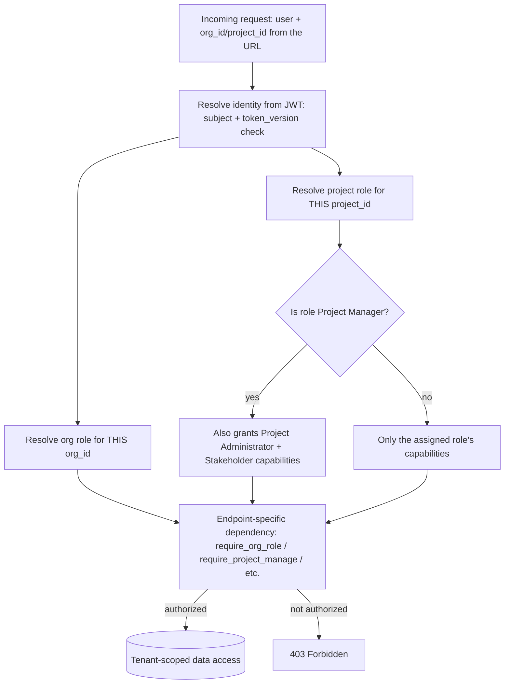

# Access Control Policy

| | |
| --- | --- |
| Policy Owner | **[Name / Title]** |
| Approved By | **[Name / Title]** |
| Effective Date | **[YYYY-MM-DD]** |
| Review Cadence | Annually, and upon any change to the role model or authentication mechanisms |
| Applies To | All users of ReqTrackManager (staff and customer organizations), and everyone administering it |

## Purpose

Satisfies CC6.1–CC6.3, CC6.5, and CC6.6: authentication, authorization, provisioning/deprovisioning, least privilege, and protection against external threats. See [trust-services-criteria-mapping.md](../trust-services-criteria-mapping.md) §CC6.

## Scope

Covers logical access to the ReqTrackManager application at every layer: authentication (proving who you are), authorization (what you're allowed to do), and the lifecycle of both (provisioning, review, deprovisioning). Physical access control is out of scope here — see [system-description.md](../system-description.md) §10 for the carve-out to the hosting provider.

## Policy

### Authentication

1. Every user authenticates either with a native email/password credential or, if their organization has enabled it, via that organization's own OIDC identity provider (SSO). Both paths resolve to the same underlying account model — there is exactly one `User` per person, never one per login method. (CC6.1)
2. Passwords must be a minimum of 8 characters. **Known gap:** no complexity, breach-list, or rotation requirement is currently enforced beyond length — see Known Gaps below.
3. Passwords are never stored or logged in plaintext; only a bcrypt hash is persisted.
4. Users may enable TOTP-based two-factor authentication; when enabled, a successful password check yields only a short-lived 2FA challenge token, not a usable session.
5. Session tokens (JWTs) are short-lived (12 hours by default, configurable) and bearer-based; a user's `token_version` counter allows the system to invalidate every previously issued token at once (used on password change and on 2FA disable), which is also this system's primary technical incident-containment tool — see [incident-response-plan.md](incident-response-plan.md).
6. SSO login is proven, not assumed, to be safe against session-fixation: the initiating browser generates a nonce that must round-trip through the entire OIDC redirect flow before a returned token is trusted, closing a login-CSRF class vulnerability identified and fixed in this codebase's hardening history. This applies identically to both places that can now initiate an OIDC login — the frontend's own `/login/{slug}` page and `mcp-server`'s `/login?org=<slug>` page — which perform the same nonce check independently; the backend's OIDC callback (`routers/auth_oidc.py`) picks which of the two initiators to redirect back to via a `client` value carried inside its own signed `state` token, restricted to exactly two literal values and resolved to one of two fixed, server-configured URLs, never a caller-supplied redirect target (which would otherwise be an open-redirect/token-theft vector, since the resulting redirect carries a live access token).
7. **Non-interactive/programmatic access (the MCP server, `mcp-server/`) authenticates with a caller's own bearer token — a session token or a Personal Access Token (item 8 below) — never a shared service credential.** There is deliberately no shared service-account or API-key mechanism issuing its own *broader* access than any individual caller already has — every MCP tool call must present a caller's own token, which the MCP server does nothing but forward to the backend; `mcp-server` is entirely format-agnostic about which of the two token types it's relaying. See [mcp-server.md](../../mcp-server.md)'s "Authentication model". `mcp-server` also serves its own `/login` convenience page, which briefly holds a submitted native password in memory only for the single relay call to the backend's existing login endpoint (never logged, never persisted, no new credential store) — functionally identical to a user calling the login endpoint themselves, just without hand-crafting the request.
8. **Personal Access Tokens (PATs)** are a second, opt-in bearer-credential type for exactly this non-interactive use case — long-lived (up to 90 days by default, or an organization-configured cap) where a session JWT (12 hours) isn't practical. A PAT is never a broader grant than its owner's own account: only a hashed secret is ever stored (`sha256`, never plaintext, mirroring password handling), it is explicitly scoped by its creator to one or more organizations they already belong to, and every org/project-scoped authorization check enforces that scope *in addition to*, never instead of, the caller's real role — a PAT can only narrow what its owner could already do, never widen it, and is rejected outright at any deployment-wide (server-admin) action regardless of the owner's own privileges. Its effective expiry is recomputed on every use from the *current* cap of every organization it's scoped to, so a tightened organization policy applies retroactively to already-issued tokens, not just new ones. Revocation is independent of `token_version` (a PAT is not killed by a password change, by design — that would defeat its purpose) but is per-token, instant, and available at three levels for incident response: a user revoking their own token(s), an organization admin revoking every token touching their organization (or narrowing a specific multi-organization token to remove just that organization, without ever being shown which other organizations it also reaches — a deliberate cross-tenant confidentiality boundary), and a server admin revoking every token platform-wide. See [decisions.md](../../decisions.md)'s "Personal Access Tokens" section for the full design.
9. **The SCIM 2.0 provisioning channel (`routers/scim.py`) authenticates as an *organization*, not as any individual user** — a third bearer-credential type, structurally closer to a PAT than to a session (only a hashed secret is stored, `sha256`, same `hash_pat` function; never shown again after (re)generation), but scoped to a whole organization rather than to one person's own access, since it exists for an IdP to call unattended, with no user behind the request at all. A single active token per organization (regenerating invalidates the previous one immediately, mirroring the PAT single-owner-token-per-slot pattern above), generated and revoked only by that organization's own `org_admin` (`POST`/`DELETE /orgs/{id}/scim-token`), and every SCIM request additionally re-derives the organization from the token itself (never trusts a client-supplied organization id) — a token minted for organization A can 404 (not silently succeed against) any resource belonging to organization B, and 403s outright once that organization is disabled. Every SCIM-driven write is audit-logged the same as any other mutating action (see the system-operations-monitoring-and-logging-policy).

### Authorization

1. Access is granted according to least privilege via independent scopes, never a single flat permission list. Three are foundational (below); item 4 documents a fourth, narrower scope added for the modular feature system:
   - **Server administrator** — deployment-wide; explicitly does *not* grant access to any organization's content. A small set of narrow, explicit carve-outs exist, all tenancy/provisioning actions rather than content access: creating an organization and its first user (`POST /orgs`, `POST /orgs/{id}/users`); a server admin granting *themselves* (self-targeting only, always `org_admin`, never another user or role) membership in an organization they don't belong to (`POST /orgs/{id}/join-as-admin`) — added specifically for self-hosting deployments where the server admin is also the one person who wants to run their own organization's content, not just provision other people's; and disabling, re-enabling, or permanently deleting an organization (`POST /orgs/{id}/disable`, `POST /orgs/{id}/enable`, `DELETE /orgs/{id}`, the last gated behind typing the organization's exact name to confirm) — a tenancy lifecycle action, not content access, since it never reads or exposes the organization's actual data; it either revokes everyone's access to that data (disable, reversible) or removes it entirely including from object storage (delete, irreversible — see [decisions.md](../../decisions.md)'s "Organisation disable and hard delete" section). None of these carve-outs let a server admin read or write any organization's actual content (requirements, projects, files) without first holding a real role there.
   - **Organization role** (org admin, project creator, member) — scoped to one organization.
   - **Project role** (project manager, project administrator, stakeholder, member) — scoped to one project; a project manager's elevated rights are the *only* role that implies the lesser roles' capabilities, and that implication is explicit and tested, not incidental.
2. Every request that touches organization- or project-scoped data resolves the caller's effective roles *from the specific organization/project ID in the request*, never from "has this role anywhere." This is the concrete technical control behind confidentiality between tenants (see [data-classification-and-confidentiality-policy.md](data-classification-and-confidentiality-policy.md)). This must apply to the *target* of an action, not only to the caller's own role: a SOC 2 review pass found and fixed two endpoints (`deactivate_org_user`, `archive_org_user`) that correctly scoped the caller's admin role to the specific organization but never checked that the *target user* actually belonged to that organization — meaning an admin of Org A could deactivate/archive a user with no relationship to Org A at all. Both now require the target user to hold membership in the acting admin's own organization. A later hardening pass found the same class of gap twice more, both fixed: `assign_project_role_by_email` (the by-email external-user invite flow) granted organization membership without the `is_banned` check `assign_org_role` itself already enforces; and `search_org_users` exposed a lower-privilege signal than the action it was meant to support — any org member (not just an org admin or a manager of the specific project) could learn whether an arbitrary email had an account *anywhere in the system*, a cross-tenant fact the actual grant endpoint (`require_project_manage`) is gated well above. A deeper follow-up pass found and fixed one more instance of the same class, at a finer grain: `_resolve_report_images` (report image attachments) checked the correct organization boundary but not the *project* one — a direct (non-shared) `FileAsset` such as a requirement attachment is gated on project-level access by its own real download endpoint (`routers/files.py::download_file`), a boundary report content had no equivalent check for, letting a hand-typed attachment reference pull another project's attachment into a report regardless of the caller's actual access to that project. Fixed by restricting report-image resolution to organization shared resources only, matching what the feature's own UI ever offers. A hardening pass on the organisation merge-import feature found the same `is_banned` gap a fourth and fifth time, in the bundle-import member/group-grant helpers (`_import_members`/`_import_org_groups`, shared by `import_org_bundle` and `merge_org_bundle`): neither checked `is_banned` before granting a bundle-matched member an organization role or org-group membership, and — since `rbac.get_effective_project_roles` resolves project access through org-group nesting with no separate `UserOrgRole` check — the group-membership gap could hand out real project access without the account ever regaining an organization role at all. `import_org_bundle` (server-admin-only, always a brand-new organization) had the same gap from the start; `merge_org_bundle` widened it to any organization's own `org_admin`, against real existing membership, which is what triggered the fix. Both now skip a banned match with a warning. See [decisions.md](../../decisions.md)'s "Hardening pass on self-signup/invites/external-users", "Deeper hardening pass", and "Hardening pass on org merge-import and rename" entries. **The two cross-project RBAC mechanisms** (`ProjectMemberSource`, generalized beyond a strict parent/child pair to any project in the same organization; and `ProjectGroupMember.source_project_id`, "this group's members = that project's own direct members") **were reviewed against this same item-2 principle before being generalized**, not exempted from it: both remain constrained to the *same organization* (never cross-tenant), both remain authorized entirely from the *receiving* project's side (never the source's, so a source project's manager can't be surprised by nor prevent being referenced — the same asymmetry the original parent/child design already established), and neither ever reads another such mechanism's already-resolved result (preventing a sibling-project leak the same way forward inheritance and member-source were already kept decoupled from each other). See [decisions.md](../../decisions.md)'s entry on this generalization for the full identify/verify/remediate review.
3. **Shared UI chrome is a deliberate, narrow exception to item 2, not a gap in it.** User avatars and organization logos (`routers/files.py`'s `is_avatar_or_logo` check) are readable by any authenticated user regardless of organization membership, since they render in shared UI (the header, member lists) where the alternative would be broken images for anyone without a role in the asset's owning organization — and they carry no confidential content, unlike a requirement attachment or an organization's shared resource file, which remain fully role-gated. The platform-wide default branding logo (`ServerSettings.default_logo_file_id`, UI/UX pass) extends this same bucket for the same reason. Its read endpoint, `GET /api/v1/system/branding`, is likewise the one endpoint in `routers/system.py` — otherwise entirely server-admin-only — open to any authenticated user, since every user's own app shell needs the platform default to render, not just server admins'; the corresponding `PUT`/logo-upload endpoints remain server-admin gated.
4. **A fourth scope, server-tier but narrower than full server administrator, was added for the modular feature system** (`docs/compliance-module-plan.md` Phase 0, `ServerRole.MODULE_ADMINISTRATOR`, granted via `UserServerRole`/`services/rbac.py::require_server_role`). This is additive to, not a replacement for, item 1's `is_server_admin` boolean: `is_server_admin` remains the sole source of truth for full server-administrator power (a `MODULE_ADMINISTRATOR` grant is never written for it, and the grant endpoint rejects an attempt to do so), and `require_server_role` composes with it the same way `require_org_role`'s callers already treat `ORG_ADMIN` as implying every narrower org capability — a genuine server admin passes any `require_server_role` check with no separate grant needed. `MODULE_ADMINISTRATOR` itself can only ever be granted or revoked by an existing full server administrator (`require_server_admin`-gated grant/revoke endpoints, no `MODULE_ADMINISTRATOR`-self-service path) — the same "a narrower role can never grant itself or others a role" privilege-escalation-safe pattern item 1's other scopes already follow. As of this policy revision it gates the deployment-wide default module entitlement policy (Phase 0) and module entitlement/enablement management deployment-wide — `GET`/`PUT /system/modules`, `GET`/`PUT /system/orgs/{id}/module-entitlements/*` (module system Phase 1).

   **Module-contributed roles** (module system Phase 2, table `user_module_roles`, dependency factory `services/rbac.py::require_module_role(module_key, role_key)`) are now implemented: a module declares its own named roles via `ModuleRoleDefinition` (e.g. a future Compliance module's `compliance_manager`/`compliance_officer`), each scoped to either an organisation or a project, synced into a `module_role_definitions` mirror table at process startup so a grant's display name/description stays resolvable even if the declaring module is later removed. `require_module_role` is **direct-grant-only** — explicitly *not* participating in the org/project-group and hierarchy inheritance the role-resolution diagram below shows for core roles, a real, deliberate difference in how these roles resolve (see the diagram's own note below). It composes with the existing higher-tier scopes the same way item 4's own `MODULE_ADMINISTRATOR` composes with `is_server_admin`: a genuine server administrator passes any `require_module_role` check with no grant needed; an org-scoped module role additionally passes for `OrgRole.ORG_ADMIN` on that organisation; a project-scoped module role additionally passes for `ProjectRole.PROJECT_MANAGER` on that project. Like every other module-gated surface, a disabled/non-entitled module's role-gated endpoints 404 rather than 403, so they stay indistinguishable from not existing.

### Provisioning and deprovisioning

1. New users are provisioned by an organization admin (native accounts), automatically on first successful SSO login subject to that organization's optional required-group gate, through public self-signup when a server admin has enabled it (`ServerSettings.signup_mode`), or through an admin-initiated invite to a specific project (`Organization.external_user_policy`). (CC6.2)
   - **Self-signup** (`routers/auth.py::signup`) is either open to anyone (no organization joined automatically — an admin assigns one afterward) or, in "org specified" mode, gated on a matching email domain *and* the target organization having explicitly opted in (`Organization.allow_self_signup`) — a configured domain alone is never sufficient, closing the obvious "someone else set the domain, I get to walk in" gap. An organization requiring SSO (`sso_only`) cannot also allow self-signup, enforced as a write-time validation error on both settings, since self-signup would otherwise hand out exactly the password credential that organization has chosen not to issue.
   - **Invited external users** (`services/invites.py`, reached via a project admin adding a project member by email) branch on whether the target organization is SSO-only: an ordinary organization gets a token-based invite email and completes native signup to redeem it; an SSO-only organization instead gets its account and roles provisioned immediately, since there is no working native-password path for it — the invitee simply signs in via SSO once, and `services/oidc_provisioning.find_or_provision_user`'s existing email-matching logic adopts the pre-provisioned account (still refusing to link if the identity provider doesn't assert a verified email, the same protection every other SSO-linked account already gets).
   - `Organization.sso_only` is enforced at the native login step itself (`auth_backends/native.py`), not only as a UI hint on that organization's branded login page — a native-credentialed account whose *every* organization requires SSO cannot authenticate natively, even with a correct password.
   - The SSO login callback (`routers/auth_oidc.py::oidc_callback`) checks the resolved account's `is_active`/`is_archived` status before completing login, a check a deeper hardening pass found was previously missing entirely — the only login path without it, since `get_current_user`'s own per-request check made the gap easy to miss (the resulting token was already inert against every other API call). Without this check, a deactivated or banned account could still complete SSO login, and — the concrete risk — the same callback's invite-consumption and SSO-group-role-sync steps would still commit brand-new role grants for it, which would sit dormant until the account was later reactivated for an unrelated reason and become live without the reactivating admin knowing new access had been granted mid-deactivation.
2. When set, `sso_group_mappings` determines what role a newly-provisioned SSO user receives; a user outside a required group is refused a session entirely, before any account state is created for them to later have access via. This is re-evaluated, in both directions, on *every* SSO login, not just the first: a role gained via a matching IdP group claim is also revoked once that claim is no longer present, closing a timely-deprovisioning gap a later hardening review found (the original version only ever granted). Scoped strictly to whatever roles `sso_group_mappings` itself covers — a role granted manually, outside any mapping, is never touched by this sync in either direction — and skipped entirely on a login where the IdP asserts no groups/roles claim at all, since that's ambiguous with "this provider doesn't send the claim" rather than a genuine zero-groups assertion. (CC6.2, CC6.3)
2a. **Org-group membership sync is claims-based (`services/oidc_provisioning.sync_org_groups_from_claims`) or push-based (SCIM, `routers/scim.py`)**, offered as two complementary mechanisms rather than one: claims-based sync only ever runs at login time (same grant/revoke and "no claim asserted at all is unknown, not empty" rules as item 2 above, scoped to whichever `OrgGroup`s have `idp_synced_group_name` set) and so cannot promptly deprovision someone who simply stops logging in; SCIM lets the IdP push a membership change the moment it happens in the directory, independent of any login. Both funnel into ordinary `OrgGroupMember` rows, so every downstream authorization check (project-role resolution via group nesting) applies identically regardless of which mechanism produced the row. SCIM user provisioning (`POST /scim/v2/Users`) checks `User.is_banned` before reprovisioning a matched account — the same check `assign_org_role`/the bundle-import paths enforce (see the "Hardening pass" entries in [decisions.md](../../decisions.md)) — closing off a sixth instance of the class of gap those entries describe. Neither mechanism ever manages an org group's *nested-group* edges (`OrgGroupMember.member_org_group_id`) — those are a structural, admin-managed relationship, not per-user membership an external directory should be able to rearrange.
3. Access is removed by deactivating a user (`is_active = False`), which blocks further logins immediately, and — since `is_active` is rechecked fresh on every REST request (`deps.py`) — also immediately rejects that user's already-issued token on their very next API call, without waiting for it to naturally expire. The one remaining bounded exception is an already-open WebSocket connection, which rechecks `is_active` (and, since a later hardening review found the original WebSocket fix covered token expiry but not this, `token_version` — see item 5 above) every 60 seconds rather than on every message (SOC 2 hardening pass) — see Known Gaps below for the residual window this leaves. (CC6.5)
4. **Access reviews are a first-class, built-in feature, not an external process bolted on:** organization admins can list and filter their organization's members by staleness (`stale_since_days`, `never_logged_in`), missing 2FA (`has_2fa`), role, and whether they hold any project access at all (`has_project_access`) — and server admins have the equivalent org-spanning `no_org_membership` ("orphaned account") view. A server admin is, by design (I-M-05), never itself a member of any organisation — that's the intended shape of the role, not an anomaly — so this view always excludes server admins; a separate `is_server_admin` filter reviews that roster instead. The review is actionable, not just informational: a server admin can deactivate or reactivate an orphaned account directly (the one category of user no *organisation* admin can ever reach, since org-scoped deactivation requires the target to already belong to that org) and can grant or revoke the server-admin role itself, with a built-in safety net rejecting a revocation that would leave the deployment with zero active server admins. Banning goes further than an ordinary deactivation — it also blocks future role grants (item 2 above) and, since a deeper hardening pass found `reactivate` didn't check it, can no longer be silently undone by a plain reactivate call: a banned account must be explicitly unbanned before it can be reactivated, preserving ban's documented guarantee that it "survives even if something else were to flip `is_active` back on." Using this tooling on a recurring cadence is a **complementary user-entity control** the organization itself is responsible for (see [system-description.md](../system-description.md) §9) — the application provides the capability, not the schedule.

### Protection against external threats

1. CORS is restricted to an explicit origin allow-list, not left open.
2. All outbound calls the backend makes to an org-configured OIDC endpoint validate that the resolved IP is public before connecting, closing an SSRF path where a malicious/compromised org admin could otherwise point the backend at internal infrastructure.
3. TLS termination is required in front of the application in production; the application itself does not serve plaintext HTTP externally in a correctly deployed environment (enforced operationally, not by the application — see [deployment.md](../deployment.md) §TLS and reverse proxy).

## Diagram: role resolution

This diagram shows how a single request's effective permissions are computed — read top to bottom as the actual order of resolution. It matters because it's the definitive answer to "what can this user do right now": nothing is cached or assumed between requests, and no single node in this chain can be skipped to reach the data at the bottom.

**Scope, not exhaustiveness**: this diagram covers the three core scopes (server administrator, organization role, project role) shown in the Authorization section's item 1. The server-tier module role added in that section's item 4 (`ServerRole.MODULE_ADMINISTRATOR`) resolves independently of this chain (`require_server_role`, not the org/project role resolution shown below), and module-contributed roles (module system Phase 2, `user_module_roles`, `services/rbac.py::require_module_role`) resolve as direct grants only — explicitly not through the group/hierarchy inheritance this diagram's `ProjRole`/`Implies` nodes represent for core project roles. Not redrawn here as a fourth path to keep this diagram legible as the answer for the common case; see item 4 above for the authoritative description of how the module-role scopes actually resolve.

## Roles and Responsibilities

| Role | Responsibility |
| --- | --- |
| Server administrators | Tenancy management only; must not be assumed to have or granted organization content access |
| Module administrators | Server-tier but narrower than server administrator (`ServerRole.MODULE_ADMINISTRATOR`): manage module entitlement/enablement settings only, granted exclusively by an existing server administrator |
| Organization admins | Provision/deprovision their own org's users, run periodic access reviews using the built-in filters |
| Engineering | Maintains the RBAC implementation and its test coverage |

## Known Gaps / Exceptions

1. **No account lockout / brute-force protection on the first-factor password check.** There is no limit on failed `/login` password attempts. Recommendation: add rate limiting and/or progressive lockout on repeated failures per account/IP. **Partially addressed for the second factor** (hardening review, round 3): a bounded 6-digit TOTP keyspace, unlike a password, made the *2FA challenge* step (`/2fa/verify`) a materially different risk — a stolen password plus an unthrottled, freely re-mintable 5-minute challenge converges toward a near-certain eventual bypass given enough repeated windows, unlike password guessing's effectively-unbounded keyspace. `/2fa/verify` now locks the account (not just the challenge token) for a configurable cooldown after a configurable number of consecutive wrong codes (`User.failed_2fa_attempts`/`failed_2fa_locked_until`, `Settings.two_factor_max_failed_attempts`/`two_factor_lockout_minutes`), so restarting the login flow for a fresh challenge token does not reset it. The first-factor password check itself remains unprotected by this fix — its keyspace is large enough that the same repeated-window compounding doesn't apply the same way, which is why it remains an open (not urgent) gap.
2. **No password complexity or rotation policy**, only a minimum length. Recommendation: consider a breach-list check (e.g. HaveIBeenPwned range API) over forced periodic rotation, which is broadly considered better practice than rotation alone.
3. ~~Deactivating a user does not immediately revoke their already-issued access token~~ — **resolved.** This was based on an inaccurate reading of the code: REST already rechecked `is_active` on every request. The one genuine residual gap — an already-open WebSocket connection not rechecking `is_active` — is now closed too (rechecked every 60 seconds; see the Authorization section above). The only remaining exposure is that 60-second window itself, which was judged an acceptable bound rather than adding a DB check on every WebSocket message.
4. **Self-signup and invite-based provisioning trust the caller-typed email address, with no confirmation-link-before-activation step.** Unlike the SSO path (which only ever provisions against an identity-provider-verified email claim), a native sign-up or an invite redemption creates a fully active, logged-in account the instant the form is submitted — nothing confirms the person submitting it actually controls that mailbox. In practice this is bounded by what an unverified email can actually reach: an org-specified self-signup only grants membership in an organization whose admin already opted in and configured that domain, and an invite only grants access to whatever a project admin explicitly targeted that address for — but a squatted or mistyped email could still receive an invite meant for someone else, or complete a domain-matched self-signup it wasn't the intended recipient of. Recommendation: an email-verification step (confirm-before-activate, or at minimum confirm-before-any-org/project-role-grant) before this gap should be considered closed. **Reviewed against the Phase 3 "resend a pending invite" addition** (`GET/POST /projects/{id}/pending-invites[/{id}/resend]`, `services.invites.resend_pending_invite`): resending rotates the token and re-sends the same email to the same caller-typed address the original invite already targeted — it does not create a new grant, target a new address, or otherwise widen who can be reached. Same risk profile as the original send, not a new instance of this gap. **Also reviewed against the follow-up UX batch's Phase A "org-level invites" addition** (`GET/POST /orgs/{id}/pending-invites[/{id}/resend]`, `create_org_pending_invite`/`resend_org_pending_invite`): an org-only invite is the same caller-typed-email flow scoped to organization membership alone (no project role), created via the same `services.invites.create_pending_invite`/`resend_pending_invite` this gap already covers — not a new mechanism, and rejected outright (400) for an `sso_only` organization rather than falling back to a different, unreviewed provisioning path. Same risk profile as the existing entries above, not a new instance of this gap.

## Related Documents

[data-classification-and-confidentiality-policy.md](data-classification-and-confidentiality-policy.md), [incident-response-plan.md](incident-response-plan.md), `docs/enterprise-integration.md`, `backend/app/services/rbac.py`.
