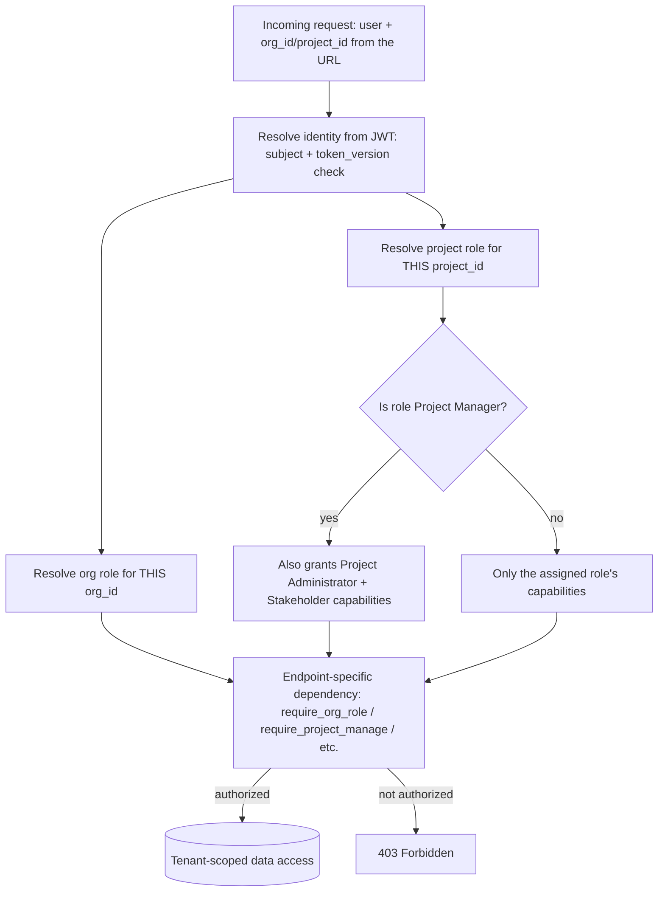

# Access Control Policy

| | |
| --- | --- |
| Policy Owner | **[Name / Title]** |
| Approved By | **[Name / Title]** |
| Effective Date | **[YYYY-MM-DD]** |
| Review Cadence | Annually, and upon any change to the role model or authentication mechanisms |
| Applies To | All users of ReqTrackManager (staff and customer organizations), and everyone administering it |

## Purpose

Satisfies CC6.1–CC6.3, CC6.5, and CC6.6: authentication, authorization, provisioning/deprovisioning, least privilege, and protection against external threats. See [trust-services-criteria-mapping.md](../trust-services-criteria-mapping.md) §CC6.

## Scope

Covers logical access to the ReqTrackManager application at every layer: authentication (proving who you are), authorization (what you're allowed to do), and the lifecycle of both (provisioning, review, deprovisioning). Physical access control is out of scope here — see [system-description.md](../system-description.md) §10 for the carve-out to the hosting provider.

## Policy

### Authentication

1. Every user authenticates either with a native email/password credential or, if their organization has enabled it, via that organization's own OIDC identity provider (SSO). Both paths resolve to the same underlying account model — there is exactly one `User` per person, never one per login method. (CC6.1)
2. Passwords must be a minimum of 8 characters. **Known gap:** no complexity, breach-list, or rotation requirement is currently enforced beyond length — see Known Gaps below.
3. Passwords are never stored or logged in plaintext; only a bcrypt hash is persisted.
4. Users may enable TOTP-based two-factor authentication; when enabled, a successful password check yields only a short-lived 2FA challenge token, not a usable session.
5. Session tokens (JWTs) are short-lived (12 hours by default, configurable) and bearer-based; a user's `token_version` counter allows the system to invalidate every previously issued token at once (used on password change and on 2FA disable), which is also this system's primary technical incident-containment tool — see [incident-response-plan.md](incident-response-plan.md).
6. SSO login is proven, not assumed, to be safe against session-fixation: the initiating browser generates a nonce that must round-trip through the entire OIDC redirect flow before a returned token is trusted, closing a login-CSRF class vulnerability identified and fixed in this codebase's hardening history. This applies identically to both places that can now initiate an OIDC login — the frontend's own `/login/{slug}` page and `mcp-server`'s `/login?org=<slug>` page — which perform the same nonce check independently; the backend's OIDC callback (`routers/auth_oidc.py`) picks which of the two initiators to redirect back to via a `client` value carried inside its own signed `state` token, restricted to exactly two literal values and resolved to one of two fixed, server-configured URLs, never a caller-supplied redirect target (which would otherwise be an open-redirect/token-theft vector, since the resulting redirect carries a live access token).
7. **Non-interactive/programmatic access (the MCP server, `mcp-server/`) authenticates with a caller's own bearer token — a session token or a Personal Access Token (item 8 below) — never a shared service credential.** There is deliberately no shared service-account or API-key mechanism issuing its own *broader* access than any individual caller already has — every MCP tool call must present a caller's own token, which the MCP server does nothing but forward to the backend; `mcp-server` is entirely format-agnostic about which of the two token types it's relaying. See [mcp-server.md](../../mcp-server.md)'s "Authentication model". `mcp-server` also serves its own `/login` convenience page, which briefly holds a submitted native password in memory only for the single relay call to the backend's existing login endpoint (never logged, never persisted, no new credential store) — functionally identical to a user calling the login endpoint themselves, just without hand-crafting the request.
8. **Personal Access Tokens (PATs)** are a second, opt-in bearer-credential type for exactly this non-interactive use case — long-lived (up to 90 days by default, or an organization-configured cap) where a session JWT (12 hours) isn't practical. A PAT is never a broader grant than its owner's own account: only a hashed secret is ever stored (`sha256`, never plaintext, mirroring password handling), it is explicitly scoped by its creator to one or more organizations they already belong to, and every org/project-scoped authorization check enforces that scope *in addition to*, never instead of, the caller's real role — a PAT can only narrow what its owner could already do, never widen it, and is rejected outright at any deployment-wide (server-admin) action regardless of the owner's own privileges. Its effective expiry is recomputed on every use from the *current* cap of every organization it's scoped to, so a tightened organization policy applies retroactively to already-issued tokens, not just new ones. Revocation is independent of `token_version` (a PAT is not killed by a password change, by design — that would defeat its purpose) but is per-token, instant, and available at three levels for incident response: a user revoking their own token(s), an organization admin revoking every token touching their organization (or narrowing a specific multi-organization token to remove just that organization, without ever being shown which other organizations it also reaches — a deliberate cross-tenant confidentiality boundary), and a server admin revoking every token platform-wide. See [decisions.md](../../decisions.md)'s "Personal Access Tokens" section for the full design.

### Authorization

1. Access is granted according to least privilege via three independent scopes, never a single flat permission list:
   - **Server administrator** — deployment-wide; explicitly does *not* grant access to any organization's content.
   - **Organization role** (org admin, project creator, member) — scoped to one organization.
   - **Project role** (project manager, project administrator, stakeholder, member) — scoped to one project; a project manager's elevated rights are the *only* role that implies the lesser roles' capabilities, and that implication is explicit and tested, not incidental.
2. Every request that touches organization- or project-scoped data resolves the caller's effective roles *from the specific organization/project ID in the request*, never from "has this role anywhere." This is the concrete technical control behind confidentiality between tenants (see [data-classification-and-confidentiality-policy.md](data-classification-and-confidentiality-policy.md)). This must apply to the *target* of an action, not only to the caller's own role: a SOC 2 review pass found and fixed two endpoints (`deactivate_org_user`, `archive_org_user`) that correctly scoped the caller's admin role to the specific organization but never checked that the *target user* actually belonged to that organization — meaning an admin of Org A could deactivate/archive a user with no relationship to Org A at all. Both now require the target user to hold membership in the acting admin's own organization.

### Provisioning and deprovisioning

1. New users are provisioned either by an organization admin (native accounts) or automatically on first successful SSO login, subject to that organization's optional required-group gate. (CC6.2)
2. When set, `sso_group_mappings` determines what role a newly-provisioned SSO user receives; a user outside a required group is refused a session entirely, before any account state is created for them to later have access via. This is re-evaluated, in both directions, on *every* SSO login, not just the first: a role gained via a matching IdP group claim is also revoked once that claim is no longer present, closing a timely-deprovisioning gap a later hardening review found (the original version only ever granted). Scoped strictly to whatever roles `sso_group_mappings` itself covers — a role granted manually, outside any mapping, is never touched by this sync in either direction — and skipped entirely on a login where the IdP asserts no groups/roles claim at all, since that's ambiguous with "this provider doesn't send the claim" rather than a genuine zero-groups assertion. (CC6.2, CC6.3)
3. Access is removed by deactivating a user (`is_active = False`), which blocks further logins immediately, and — since `is_active` is rechecked fresh on every REST request (`deps.py`) — also immediately rejects that user's already-issued token on their very next API call, without waiting for it to naturally expire. The one remaining bounded exception is an already-open WebSocket connection, which rechecks `is_active` (and, since a later hardening review found the original WebSocket fix covered token expiry but not this, `token_version` — see item 5 above) every 60 seconds rather than on every message (SOC 2 hardening pass) — see Known Gaps below for the residual window this leaves. (CC6.5)
4. **Access reviews are a first-class, built-in feature, not an external process bolted on:** organization admins can list and filter their organization's members by staleness (`stale_since_days`, `never_logged_in`), missing 2FA (`has_2fa`), role, and whether they hold any project access at all (`has_project_access`) — and server admins have the equivalent org-spanning `no_org_membership` ("orphaned account") view. Using this tooling on a recurring cadence is a **complementary user-entity control** the organization itself is responsible for (see [system-description.md](../system-description.md) §9) — the application provides the capability, not the schedule.

### Protection against external threats

1. CORS is restricted to an explicit origin allow-list, not left open.
2. All outbound calls the backend makes to an org-configured OIDC endpoint validate that the resolved IP is public before connecting, closing an SSRF path where a malicious/compromised org admin could otherwise point the backend at internal infrastructure.
3. TLS termination is required in front of the application in production; the application itself does not serve plaintext HTTP externally in a correctly deployed environment (enforced operationally, not by the application — see [deployment.md](../deployment.md) §TLS and reverse proxy).

## Diagram: role resolution

This diagram shows how a single request's effective permissions are computed — read top to bottom as the actual order of resolution. It matters because it's the definitive answer to "what can this user do right now": nothing is cached or assumed between requests, and no single node in this chain can be skipped to reach the data at the bottom.

## Roles and Responsibilities

| Role | Responsibility |
| --- | --- |
| Server administrators | Tenancy management only; must not be assumed to have or granted organization content access |
| Organization admins | Provision/deprovision their own org's users, run periodic access reviews using the built-in filters |
| Engineering | Maintains the RBAC implementation and its test coverage |

## Known Gaps / Exceptions

1. **No account lockout / brute-force protection.** There is no limit on failed login attempts. Recommendation: add rate limiting and/or progressive lockout on repeated failures per account/IP.
2. **No password complexity or rotation policy**, only a minimum length. Recommendation: consider a breach-list check (e.g. HaveIBeenPwned range API) over forced periodic rotation, which is broadly considered better practice than rotation alone.
3. ~~Deactivating a user does not immediately revoke their already-issued access token~~ — **resolved.** This was based on an inaccurate reading of the code: REST already rechecked `is_active` on every request. The one genuine residual gap — an already-open WebSocket connection not rechecking `is_active` — is now closed too (rechecked every 60 seconds; see the Authorization section above). The only remaining exposure is that 60-second window itself, which was judged an acceptable bound rather than adding a DB check on every WebSocket message.

## Related Documents

[data-classification-and-confidentiality-policy.md](data-classification-and-confidentiality-policy.md), [incident-response-plan.md](incident-response-plan.md), `docs/enterprise-integration.md`, `backend/app/services/rbac.py`.
