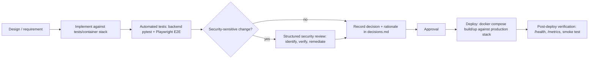

# Change Management and Secure Development Policy

| | |
| --- | --- |
| Policy Owner | **[Name / Title]** |
| Approved By | **[Name / Title]** |
| Effective Date | **[YYYY-MM-DD]** |
| Review Cadence | Annually, and upon material change to the development process or tooling |
| Applies To | Engineering |

## Purpose

Satisfies CC8.1 (authorizes, tests, and approves changes to software and infrastructure) and the CC6.8/CC7.1 secure-development-adjacent expectations. See [trust-services-criteria-mapping.md](../trust-services-criteria-mapping.md) §CC8.

## Scope

Covers all changes to the ReqTrackManager application code, database schema, and infrastructure-as-code (`docker-compose.yml` and related config).

## Policy

1. **Changes are made in isolated environments before touching production.** A dedicated development/test Compose stack (`tests/container/`) is structurally separate from the production stack (`docker-compose.yml`) — this is not just a convention but an enforced separation, born from a real incident where a shared stack led to the test suite wiping a live database (see `docs/decisions.md`). No change should ever be validated by running test tooling against the production stack.
2. **Automated tests are required for new functionality and bug fixes**, and the existing suite must continue to pass. As of the last hardening pass this comprises 189 backend tests (`backend/tests/`) and a full browser-driven Playwright E2E suite (`tests/playwright/`) covering golden-path workflows, permission boundaries, and — specifically — adversarial "attempt to bypass a workflow guarantee" scenarios.
3. **Database schema changes go through Alembic migrations**, applied automatically (and only) on backend startup — never applied by hand against a running database.
4. **Security-sensitive changes get an explicit, structured security review** before being considered complete — this codebase's practice is a three-phase identify → independently re-verify (false-positive-filtered) → remediate process, documented for every pass in `docs/decisions.md`.
5. **Every significant design or security decision is recorded with its rationale** at the time it's made, in `docs/decisions.md` — not reconstructed after the fact. This gives CC8.1's "documents changes" requirement a genuine paper trail rather than relying on commit messages alone.
6. **Dependencies are pinned**, not left floating — `backend/requirements.txt` and `frontend/package-lock.json` fix exact versions, so a rebuild doesn't silently pull in a new (and unreviewed) dependency version.
7. **Changes are approved before being merged/deployed.** **[Company must define the actual approval mechanism — see Known Gaps.]**

## Diagram: change lifecycle

Read this left to right as the path a change takes from idea to production. The "Security review?" branch is a genuine decision point, not a formality — the two hardening passes recorded in `docs/decisions.md` are real instances of a change (a large new feature area) triggering exactly this branch and producing fixes before the change was considered complete.

## Roles and Responsibilities

| Role | Responsibility |
| --- | --- |
| Engineering | Writes tests, follows the isolated-environment workflow, documents decisions |
| Reviewer/approver | Approves changes before deployment — **[Company must name this role]** |
| Information security owner | Determines which changes require a security review |

## Implementation in ReqTrackManager

This is one of the better-evidenced policies in this package precisely because the codebase's own working conventions already closely match what CC8.1 asks for — the gap was formalizing CI enforcement, not inventing a process from nothing. See `docs/decisions.md` for the running record and `docs/deployment.md`'s "Two separate Compose stacks" section for the environment-isolation rationale.

- **CI enforcement**: `.github/workflows/ci.yml` — `frontend` (lint/type-check/build), `backend-and-e2e` (the real `tests/container/docker-compose.yml` stack; pytest with coverage + JUnit reporting; `ruff check`; the full Playwright suite), and `docker-build` (production image builds, gated on the other two, not published).

## Known Gaps / Exceptions

1. ~~No CI pipeline~~ — **resolved.** `.github/workflows/ci.yml` now runs on every push/PR to `main`: frontend lint + type-check + build, the full backend pytest suite with coverage (published as a check + job-summary + downloadable HTML report) and `ruff` lint against the real dev/test Docker Compose stack, and the full Playwright E2E suite against the running containers — all gating (a failure blocks the check from passing). A third job builds (but does not push) the production backend/frontend images once the two test jobs pass. See Implementation below.
2. **No formal code review / pull-request approval requirement is enforced by tooling** (e.g. branch protection requiring an approving review). The CI checks above are a prerequisite for this — a required check has no teeth without branch protection requiring it to pass before merge. Recommendation: adopt branch protection once the repository has more than one contributor, requiring both an independent approval and the CI checks to pass before merge to the default branch.
3. **No automated dependency/container vulnerability scanning** (e.g. `pip-audit`, `npm audit` in CI, Trivy/Grype for container images). Recommendation: add as a step in `.github/workflows/ci.yml`'s `backend-and-e2e`/`docker-build` jobs.
4. **No coverage threshold is enforced**, only reported — the pipeline publishes the percentage (currently ~90% backend line coverage) but does not fail the build if it drops. Recommendation: once a stable baseline is agreed, add `--cov-fail-under=N` to the pytest invocation.
5. **Container images are built but not published.** `docker-build`'s two `docker/build-push-action` steps run with `push: false` deliberately — the system hasn't been through enough real-world (developer) usage yet to trust an automated publish. The job, and the workflow file itself, document exactly what to uncomment (a `docker/login-action` step, `packages: write` permission — already granted — and flipping `push: false` to `true`) once that changes.
4. **Pre-release migration convention:** during initial development, schema changes are folded into the single baseline migration rather than issued as incremental Alembic revisions (documented in `docs/decisions.md`). This is appropriate before a first production release but must stop once real production data exists — every schema change after that point needs its own forward migration, since the baseline-squash convention would otherwise require a destructive `down -v` against live data.

## Related Documents

[risk-assessment-policy.md](risk-assessment-policy.md), [system-operations-monitoring-and-logging-policy.md](system-operations-monitoring-and-logging-policy.md), `docs/decisions.md`, `docs/deployment.md`.
