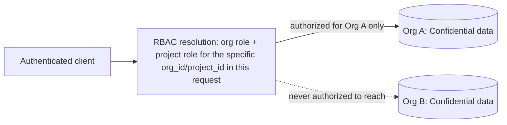

# Data Classification and Confidentiality Policy

| | |
| --- | --- |
| Policy Owner | **[Name / Title]** |
| Approved By | **[Name / Title]** |
| Effective Date | **[YYYY-MM-DD]** |
| Review Cadence | Annually |
| Applies To | Engineering, Operations, and anyone handling exported/backed-up data |

## Purpose

Satisfies C1.1: identifying and maintaining confidential information consistent with the Company's objectives. See [trust-services-criteria-mapping.md](../trust-services-criteria-mapping.md) §C1.

## Scope

Covers all data processed, stored, or transmitted by ReqTrackManager.

## Policy

### Classification scheme

| Class | Definition | Examples in ReqTrackManager |
| --- | --- | --- |
| **Restricted** | Would cause severe harm if disclosed; access must be minimized even internally | Password hashes, TOTP secrets, JWT signing secret, OIDC client secrets, SMTP/storage credentials |
| **Confidential** | Customer-owned business data; disclosure would breach customer trust/contract | Requirement content and reasoning, change requests, review comments, file attachments, report templates — everything scoped to a customer organization |
| **Internal** | Not customer data, but not for public release | Audit/login event history, operational metrics, internal architecture documentation |
| **Public** | Safe for unrestricted release | Product documentation, marketing material |

### Handling requirements

1. **Confidential data is isolated per organization** at the query/authorization layer — every request resolving organization- or project-scoped data does so from the specific org/project ID in the request, never from a broader "has this role somewhere" check. This is the system's primary confidentiality control (see [access-control-policy.md](access-control-policy.md) §Authorization and the diagram there).
2. **Restricted data is never returned in API responses or logs.** Password hashes are never serialized to a response; password/secret fields are explicitly stripped from validation error payloads before they reach a client or a log line.
3. **Access to Confidential data requires an authenticated, authorized session** — there is no anonymous or unauthenticated path to organization/project content (the only unauthenticated endpoints are login-adjacent: the login page itself, an org's public branding lookup, and the OIDC callback).
4. **Confidential data disposal is covered separately** in [data-retention-and-disposal-policy.md](data-retention-and-disposal-policy.md) (C1.2).
5. **Confidentiality commitments to customers** (contractual promises about how their data is handled) must be reflected accurately by this classification scheme — if a customer contract promises something this policy or the underlying system doesn't actually do, that's a compliance gap to close, not a discrepancy to paper over. **[Company must reconcile actual customer contract language against this policy.]**

## Diagram: tenant data isolation

This is the same trust-boundary picture as [system-description.md](../system-description.md) §7, repeated here because it is specifically the mechanism this policy relies on: read it as showing that Confidential data (an organization's requirements/change-requests/etc.) is reachable *only* through the RBAC resolution step, never directly.

## Roles and Responsibilities

| Role | Responsibility |
| --- | --- |
| Engineering | Maintains the isolation boundary; ensures new endpoints follow the org/project-scoped authorization pattern |
| Information security owner | Owns this classification scheme and its alignment with customer contracts |

## Implementation in ReqTrackManager

- **Isolation enforcement**: `backend/app/services/rbac.py` (`require_org_role`, `require_project_manage`, `get_effective_org_roles`, etc.), applied as FastAPI dependencies on every organization/project-scoped router.
- **Secret redaction**: `backend/app/main.py::redact_sensitive_validation_errors`.
- **Password hashing**: `backend/app/security.py` (bcrypt via `passlib`).
- **Tested confidentiality boundary**: `backend/tests/test_permission_matrix.py`, `backend/tests/test_rbac.py`, and the negative-path cross-org tests in `backend/tests/test_access_review.py` (a non-admin gets 403; an admin of a *different* org gets 403).

## Known Gaps / Exceptions

1. ~~OIDC client secrets are stored in the primary database without application-layer encryption~~ — **resolved.** Every Restricted-classified secret column (`oidc_client_secret`, `smtp_password`, `totp_secret`) is now encrypted at the application layer. See [encryption-and-key-management-policy.md](encryption-and-key-management-policy.md).
2. **No formal reconciliation against actual customer contract language** has been performed — the classification scheme reflects the system's technical behavior, not a review of specific promises made to customers.

## Related Documents

[access-control-policy.md](access-control-policy.md), [encryption-and-key-management-policy.md](encryption-and-key-management-policy.md), [data-retention-and-disposal-policy.md](data-retention-and-disposal-policy.md), [system-description.md](../system-description.md) §5, §7.
