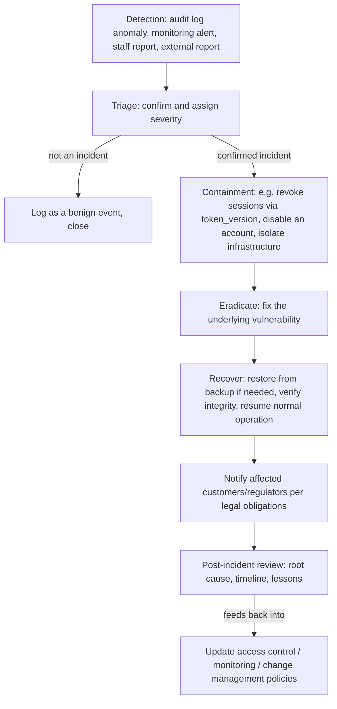

# Incident Response Plan

| | |
| --- | --- |
| Policy Owner | **[Name / Title, e.g. Incident Response Lead]** |
| Approved By | **[Name / Title]** |
| Effective Date | **[YYYY-MM-DD]** |
| Review Cadence | Annually, and after every incident (post-incident review must feed back into this document) |
| Applies To | All staff with system access; primarily Engineering and Operations |

## Purpose

Satisfies CC7.3–CC7.5: evaluating security events, responding to incidents, and recovering from them. See [trust-services-criteria-mapping.md](../trust-services-criteria-mapping.md) §CC7.

## Scope

Covers security incidents affecting the ReqTrackManager application, its data, or its infrastructure — unauthorized access, data exposure, service compromise, or credible suspicion of any of these. Availability-only incidents (e.g. an outage with no security dimension) are operationally important but outside this plan's SOC 2 scope, since Availability was not selected as an in-scope TSC for this package (see [README.md](../README.md)).

## Definitions

- **Security event**: any observed occurrence that may indicate a security incident (a failed-login spike, an anomalous audit log entry, a vulnerability report).
- **Security incident**: a security event confirmed to represent unauthorized access, data exposure, or compromise of confidentiality/integrity.
- **Severity levels**: **[Company must define, e.g. Critical/High/Medium/Low, with response-time SLAs for each.]**

## Policy

1. **Any staff member who suspects a security incident must report it immediately** to **[the designated reporting channel/contact — Company must define]**, without waiting for confirmation.
2. **The incident response lead triages every report** to determine whether it is a confirmed incident, and assigns a severity level.
3. **Confirmed incidents are contained before root-cause analysis is completed** — containment is not deferred while investigation is ongoing, because the primary goal in the first response window is stopping further exposure.
4. **The system's mass session-revocation capability (`token_version`) is a first-line containment tool** for any incident involving a compromised or suspicious account or credential — it invalidates every outstanding access token for an affected user immediately, without waiting for those tokens to naturally expire (up to 12 hours otherwise).
5. **Affected customers are notified per the Company's contractual and legal obligations.** **[Company must state its notification commitments and timelines, and the applicable breach-notification laws for its jurisdiction(s) and customer base.]**
6. **Every incident, once resolved, gets a post-incident review** documenting root cause, what worked, what didn't, and concrete follow-up actions — recorded the same way architectural/security decisions already are in `docs/decisions.md`, so the practice is consistent with how this codebase already treats security findings.
7. **The plan itself is exercised, not just written.** **[Company should run at least one tabletop exercise annually to validate this plan works in practice, not only on paper.]**

## Diagram: incident response phases

Read this top to bottom as the path an event takes once reported. The loop back from "Post-incident review" into policy/control updates is the important part — this plan is explicitly designed to feed its own findings back into the access control, monitoring, and change management policies, not to be a one-way checklist.

## Roles and Responsibilities

| Role | Responsibility |
| --- | --- |
| Incident response lead | Owns triage, coordinates response, drives the post-incident review |
| Engineering | Executes containment/eradication (e.g. deploying a fix, revoking sessions) |
| Information security owner | Approves customer/regulator notification content and timing |
| All staff | Report suspected incidents immediately |

## Implementation in ReqTrackManager

- **Detection sources**: `audit_events`/`login_events` (`backend/app/services/audit.py`), Prometheus metrics, the disk-usage monitor's alerting, and — per [system-operations-monitoring-and-logging-policy.md](system-operations-monitoring-and-logging-policy.md)'s Known Gaps — currently no automated alert *rules* on top of these, meaning detection today is largely reactive/manual rather than automatically triggering this plan.
- **Containment**: `token_version`-based mass token revocation (`backend/app/security.py`), account deactivation (`backend/app/routers/orgs.py::deactivate_org_user`).
- **Recovery**: `scripts/restore.sh` against a `pg_dump` backup, or the local-file-storage tarball.
- **Post-incident recording practice**: `docs/decisions.md` already demonstrates the intended shape of a post-incident/post-review write-up (see its hardening-pass sections), even though those specific entries were proactive review findings rather than live incidents — the same documentation discipline applies to both.

## Known Gaps / Exceptions

1. **No automated alerting exists to trigger this plan** — detection today depends on someone looking at logs/metrics or a report coming in, not a system paging someone. See [system-operations-monitoring-and-logging-policy.md](system-operations-monitoring-and-logging-policy.md) Known Gaps.
2. **No incident has been formally logged or exercised under this plan yet** — it is untested in practice. A tabletop exercise is strongly recommended before relying on this plan under real conditions.
3. **Audit log integrity**: `audit_events` rows are ordinary database rows, not tamper-evident (no hashing/append-only/WORM storage). An attacker with direct database write access could alter or delete audit history. This is an acceptable residual risk for most deployments (database access is already a high-privilege boundary) but should be stated explicitly rather than assumed away, and considered if the Company's threat model includes insider risk from those with direct database access.

## Related Documents

[system-operations-monitoring-and-logging-policy.md](system-operations-monitoring-and-logging-policy.md), [access-control-policy.md](access-control-policy.md), `docs/deployment.md` §Database.
