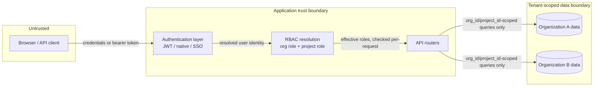

# System Description

This document is ReqTrackManager's SOC 2 system description, covering the categories an auditor expects (infrastructure, software, people, procedures, data, system boundaries, subservice organizations, and complementary user-entity controls). It describes the system as designed and shipped; the operating organization must complete the bracketed sections describing itself before this can be issued as part of a report.

## 1. Company and service overview

**[Company legal name]** ("the Company") operates ReqTrackManager, a multi-tenant web application for managing formal requirements, change requests, and their approval workflows across organizations and projects. Each **organization** is an isolated tenant; each organization owns one or more **projects**, and requirements/change-requests live inside a project with a versioned, auditable history of every state change.

This description covers the ReqTrackManager application and its supporting infrastructure as deployed by the Company. It does not cover the Company's other products or services, if any — **[state whether other products exist and are excluded]**.

## 2. Infrastructure

ReqTrackManager ships as a set of Docker containers, deployed via Docker Compose (`docker-compose.yml` at the repo root — see [deployment.md](../deployment.md) for the full guide). The application itself is infrastructure-agnostic: it does not assume a specific cloud provider, and the Company must state where it actually runs.

| Component | Role |
| --- | --- |
| `backend` | FastAPI application; all business logic, authentication, and API surface |
| `frontend` | Static React single-page app, served by nginx |
| `db` | PostgreSQL — the sole system of record |
| `minio` (or an external S3-compatible service) | Uploaded file storage |
| `mcp-server` | Read-only Model Context Protocol server exposing requirements to AI assistants (Claude Code, VS Code Copilot Chat, Microsoft Copilot Studio, etc.); see [mcp-server.md](../mcp-server.md). Holds no credentials of its own — every request forwards the calling user's own access token, so it introduces no new privilege model, only a new *client* of the existing API |
| External SMTP provider | Outgoing transactional/notification email |
| Optional: external OIDC identity provider (customer-supplied, e.g. Keycloak, Authentik, Entra ID) | Per-organization SSO, when an org enables it |
| Optional, customer-configured: a third-party AI assistant/agent platform (e.g. Microsoft Copilot Studio) connected to `mcp-server` | Retrieves requirement content on the connecting user's behalf — see §9 (CUECs) for the confidentiality implication this carries |
| Optional observability stack (`--profile observability`): Prometheus, Loki, Tempo, Grafana, Grafana Alloy | Metrics, log aggregation, tracing |

**[Company must state]**: the physical/cloud hosting provider (e.g. AWS, GCP, Azure, on-prem), region(s), and whether the deployment is single-tenant infrastructure per customer or one shared multi-tenant deployment serving every customer's organizations from the same containers and database (the application's own tenancy model — see §7 — supports the latter, which is the default assumption of this document).

## 3. Software

The full technology stack and architectural rationale are maintained in [solution-architecture.md](../solution-architecture.md) and are not repeated here in full. In summary: Python/FastAPI/SQLAlchemy backend, React/TypeScript frontend, PostgreSQL for all relational and audit data, an S3-compatible object store for uploaded files, and JWT-based session tokens. Database schema changes are managed with Alembic and applied automatically on backend startup.

## 4. People

**[Company must state]**: organizational structure and named roles relevant to this report — at minimum, who owns the information security program (CC1.1), who has production database/infrastructure access, who reviews access grants, and who leads incident response. This system description assumes at least the following functional roles exist, without asserting who holds them:

- An **information security owner** (policy ownership, control oversight — see [policies/information-security-policy.md](policies/information-security-policy.md)).
- **Engineering staff** with production access, subject to the access control and change management policies.
- **Operations/on-call staff** responsible for infrastructure, backups, and incident response.
- **Server administrators** and **organization administrators** *within the application itself* — a distinct concept from Company staff roles, described in §7.

## 5. Data

| Data category | Examples | Where it lives |
| --- | --- | --- |
| Customer content | Requirement text and reasoning, change requests, review comments, file attachments, report templates | PostgreSQL (`requirements`, `requirement_versions`, `change_requests`, etc.) and object storage (attachments) |
| User account data | Email, display name, password hash (never plaintext), TOTP secret (2FA), OIDC subject/issuer for SSO-provisioned accounts | PostgreSQL (`users` table) |
| Authentication/session material | JWT access tokens (bearer, not stored server-side), `token_version` revocation counter | Issued to the client; not persisted beyond the signing counter |
| Audit and login history | Who did what, when, from what IP; login success/failure events | PostgreSQL (`audit_events`, `login_events` — see [decisions.md](../decisions.md) and `backend/app/services/audit.py`) |
| Organization SSO configuration | Per-org OIDC issuer URL, client ID, client secret, required-group gate | PostgreSQL (`organizations` table) — see the Known Gaps note in [policies/encryption-and-key-management-policy.md](policies/encryption-and-key-management-policy.md) regarding the client secret |
| Operational/system data | Notification records, WebSocket subscription state, background job bookkeeping | PostgreSQL |

No payment card data, health data, or government-ID data is processed by the application. **[Company must confirm]** whether any customer chooses to enter such data into free-text requirement/change-request fields despite the product not being designed for it — if so, this changes the data classification and likely brings additional TSC (e.g. a PCI or HIPAA discussion) out of scope for this SOC 2 package specifically.

## 6. Procedures

Operating procedures are documented as the individual policies in [policies/](policies/), each cross-referenced to the specific application mechanism that implements it. This system description does not restate them.

## 7. System boundaries and multi-tenancy

The diagram below shows the trust boundaries a request crosses and where tenant isolation is enforced. Read it left to right: a browser is untrusted until authenticated; once authenticated, every request carries a user identity that the backend resolves into an effective set of organization/project roles (`backend/app/services/rbac.py`) *before* touching any tenant data — there is no code path that reaches the database without first resolving and checking these roles. This matters for the Confidentiality criterion specifically: the boundary between one organization's data and another's is enforced entirely in this one layer, not by separate databases or separate deployments per tenant, so its correctness is the single most important confidentiality control in the system (see the IDOR-hardening entries in [decisions.md](../decisions.md)'s security hardening sections for the concrete history of that boundary being tested and fixed).

Within the application, three identity concepts exist and must not be conflated when describing access:

- **Server administrator** — a deployment-wide role (`I-M-05`/`I-M-06`) that can manage tenancy (create organizations, manage the server) but is explicitly *not* granted access to any organization's content by virtue of that role alone.
- **Organization administrator** — scoped to one organization; manages that organization's members, SSO configuration, and projects.
- **Project roles** (project manager, project administrator, stakeholder, member) — scoped to one project within one organization.

## 8. Subservice organizations

A subservice organization is any third party whose controls this report's controls depend on. **[Company must complete this table with its actual vendors]**:

| Subservice organization | Function | Carve-out or inclusive method |
| --- | --- | --- |
| **[Cloud/hosting provider]** | Compute, network, physical security, and (if used) managed PostgreSQL/object storage | Typically carve-out — relies on the provider's own SOC 2 report for physical/environmental security |
| **[SMTP provider]** | Outgoing transactional email | Carve-out |
| **[Object storage provider, if not self-hosted MinIO]** | File attachment storage | Carve-out |
| **Customer-supplied OIDC identity provider** (only for organizations that enable SSO) | Authenticates that organization's users; asserts group membership used for role provisioning | Carve-out — the customer's own IdP is entirely outside the Company's control; see [enterprise-integration.md](../enterprise-integration.md) |

See [policies/vendor-and-subprocessor-management-policy.md](policies/vendor-and-subprocessor-management-policy.md) for the due-diligence process these vendors should go through.

## 9. Complementary user entity controls (CUECs)

Controls the report assumes the *customer* (an organization using ReqTrackManager) is responsible for, since the Company cannot enforce them from inside the application:

1. The customer's organization administrator is responsible for assigning appropriate roles to their own users and removing access promptly when a user leaves (the application provides the access-review tooling — see [policies/access-control-policy.md](policies/access-control-policy.md) — but using it is the customer's responsibility).
2. If the customer enables SSO, they are responsible for the security of their own identity provider, the accuracy of its group/role claims, and configuring `oidc_required_group` appropriately (see [enterprise-integration.md](../enterprise-integration.md)).
3. The customer is responsible for the content they enter into requirement/change-request fields, including not entering data classes the product isn't designed to handle (§5).
4. The customer is responsible for safeguarding their own users' credentials and enabling 2FA where their own policies require it.
5. If the customer chooses to connect a third-party AI assistant/agent platform (e.g. Microsoft Copilot Studio, or any other MCP client) to `mcp-server`, they are responsible for that decision's data-handling implications — requirement content retrieved through it is sent to that platform's own infrastructure, the same as if a user had pasted it into that platform's chat interface. The customer is also responsible for whom they give the underlying access token to and for that token's own security, since `mcp-server` grants exactly the connecting account's own ReqTrackManager access, nothing more. See [policies/vendor-and-subprocessor-management-policy.md](policies/vendor-and-subprocessor-management-policy.md).

## 10. Complementary subservice organization controls (CSOCs)

Controls the report assumes the underlying infrastructure provider is responsible for: physical and environmental security of hosting facilities, network infrastructure security up to the point the Company's containers run, and — if a managed database/storage service is used instead of self-hosted PostgreSQL/MinIO — that provider's own backup, patching, and encryption-at-rest mechanisms. **[Company must state which of these it relies on versus operates itself.]**
