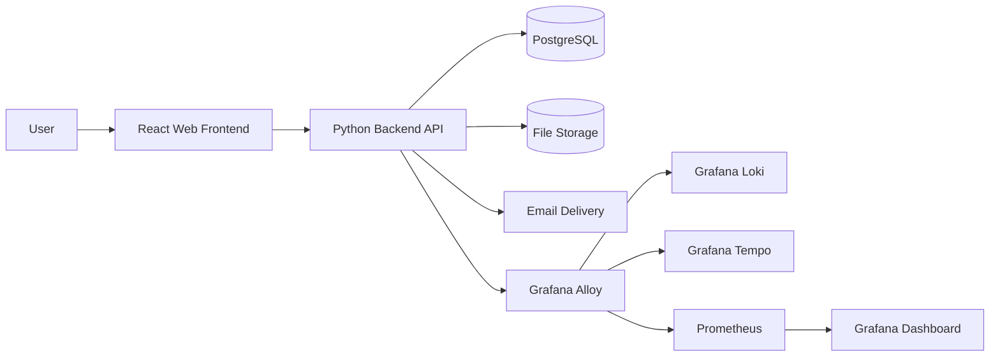
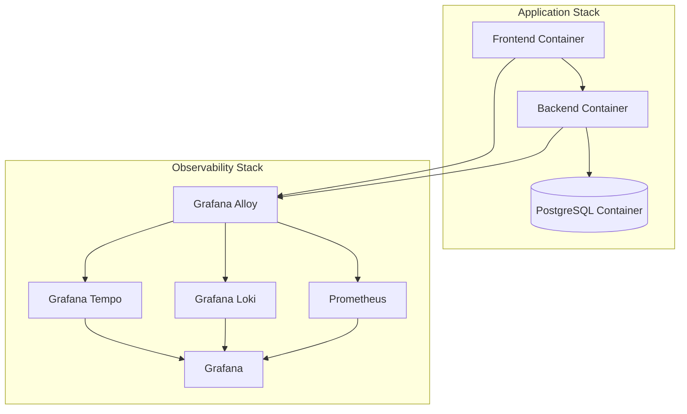
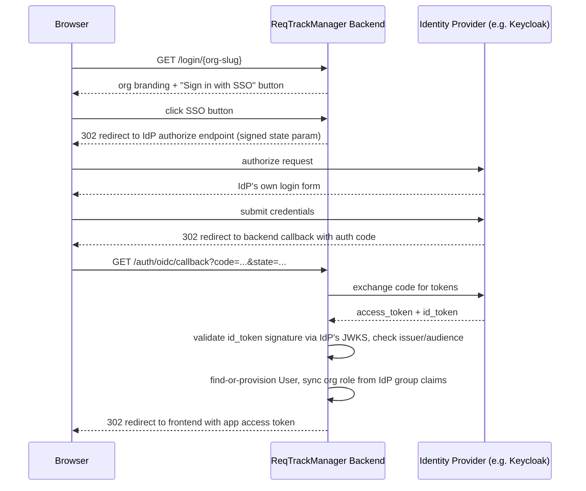
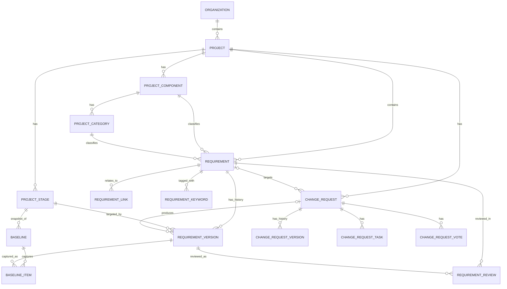
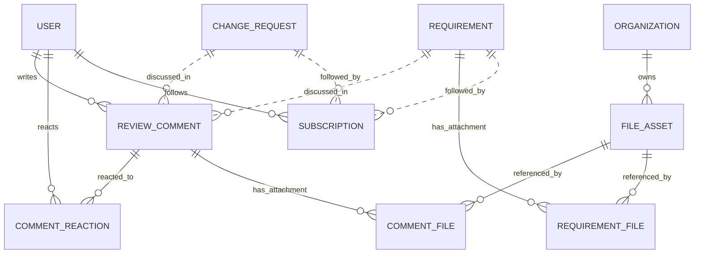
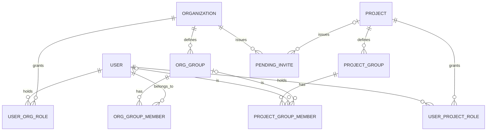
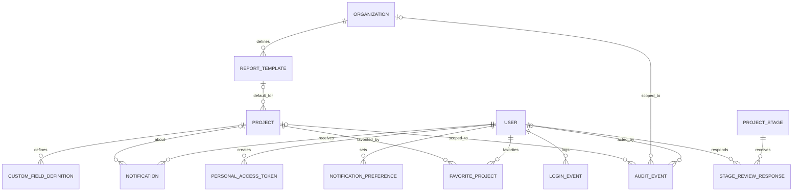

# Solution Architecture

## Purpose

This document describes the proposed solution architecture for ReqTrackManager, an open-source engineering requirements management platform for product development teams. The architecture is designed to satisfy the core requirements in the product requirements document while remaining deployable, extensible, and suitable for future growth.

The design focuses on three priorities:
- provide a complete requirements management workflow for MVP delivery
- support formal change management and traceability
- remain easy to deploy and operate with a container-based architecture

## Architectural Goals

The architecture is guided by the following goals:

- Support a formal requirements lifecycle from scoping to review, approval, completion, and archival.
- Keep the system modular so frontend, backend, data, and observability concerns can evolve independently.
- Start with a simple deployment model: one frontend container, one backend container, and one PostgreSQL database.
- Support enterprise-style concerns such as role-based access control, audit trails, and configurable workflows.
- Provide a product experience that is easy to use, intuitive, and low-friction for everyday project work.
- Use a temporal data model so that requirement and change history can be queried over time and audited reliably.
- Provide strong operational visibility through health checks, metrics, logs, and tracing.

## High-Level Solution Overview

The system consists of a web-based frontend, a backend API, a relational database, and supporting operational services for monitoring and observability. The high-level overview focuses on business capabilities, deployment topology, and operational concerns rather than authentication details.

The following diagram shows the primary system context:

This diagram shows the main runtime flow: users interact with the frontend, the frontend calls the backend API, and the backend stores data in PostgreSQL and optional files in shared storage. Observability data is collected by Grafana Alloy and routed to Loki, Tempo, and Prometheus.

## Core Architecture Principles

### 1. Layered separation of concerns
The solution separates the user interface, application services, persistence, and operational concerns. This reduces coupling and allows each layer to evolve independently.

### 2. Domain-driven backend modules
The backend is structured around business domains such as organizations, projects, requirements, change requests, reviews, audit history, and reporting. This makes the system easier to maintain and extend.

### 3. Container-first deployment
The application is designed to run in containers from the start. Docker Compose provides a development and test environment, and the same model can be used for lightweight production deployments.

### 4. Secure-by-default design
Authentication, authorization, audit logging, and data sanitization are treated as first-class platform concerns rather than afterthoughts.

## Component Architecture

### Presentation Layer
The presentation layer is a React single-page application that provides:
- project and requirement browsing
- requirement creation and editing
- change request submission and review
- dashboards, reports, and audit views
- user preferences and notification management

Responsibilities:
- render UI state from backend APIs
- manage client-side routing and local state
- provide responsive behavior for desktop and mobile use

### Application Layer
The backend service is implemented in Python and exposes a RESTful API. It is responsible for:
- project and organization management
- requirements and change request lifecycle handling
- traceability and dependency management
- reporting and export generation
- notifications and audit logging
- file attachment handling

The backend should be organized into discrete modules such as:
- auth and identity
- organizations and projects
- requirements
- change requests
- reviews and approvals
- reporting
- notifications
- audit and history
- file management

**Implementation note (bundle export/import):** three related, self-describing zip-bundle export/import capabilities exist beyond the fixed-table CSV export in "reporting and export generation" above, for backup, offboarding, and migration rather than reporting:
- **Requirement CSV** (`GET`/`POST /projects/{id}/requirements/export|import`, `backend/app/services/requirement_csv.py`) — full-fidelity round trip of every requirement field, including custom field values and target stage, distinct from the fixed report-table CSV (R-F-02).
- **Project bundles** (`GET /projects/{id}/export`, `POST /projects/import`, `backend/app/services/project_export.py`) — a project's structure (stages/components/categories/custom field definitions) and full history (every requirement version, change request with its versions/tasks/votes/comments, baselines, review outcomes) plus attachments, importable as a brand-new project in any organisation the caller can create in.
- **Organisation bundles** (`GET /orgs/{id}/export`, `POST /orgs/import`, `backend/app/services/org_export.py`) — an organisation's settings, members, report templates, org-owned files, and every project bundled the same way, importable as a brand-new organisation.

Every bundle is a zip with a self-describing `manifest.json` (`kind`/`format_version`) so a newer application version can recognise and reject a bundle it can't safely import, rather than partially applying one. Cross-references inside a bundle use portable keys (requirement `unique_code`, component/category prefix, user email) instead of raw database ids, since ids from the source deployment are meaningless in the target one. See [decisions.md](decisions.md)'s "Bundle export/import" entry for the security decisions (Restricted secrets are never exported; SSO is always left disabled post-import since the OIDC secret isn't carried over; project-level group *membership* is never replayed on import to avoid a cross-tenant privilege-escalation path) and the full field-by-field design.

### Data Layer
PostgreSQL is the primary transactional store for the system. It stores:
- organizations and users
- projects and project stages
- requirements and metadata
- change requests and review records
- permissions, groups, and role assignments
- audit history and lifecycle state

The database layer should include:
- schema migration support
- versioned schema changes
- transactional integrity for workflow steps
- backup and restore procedures

### File Storage Layer
Files such as supporting documents and uploaded attachments are stored in a configurable backend. The initial deployment can use local filesystem storage, while the design should allow later migration to object storage such as S3 or MinIO.

**Implementation note (Pelion v2):** `backend/app/storage_backends/` defines a small `FileStorageBackend` protocol with two real implementations — `LocalFileStorageBackend` (filesystem) and `S3CompatibleFileStorageBackend` (boto3, works against MinIO or real S3) — selected via `STORAGE_BACKEND=local|s3`. The default Docker Compose stack runs MinIO and defaults to the `s3` backend so the object-storage path is exercised for real rather than only implemented in the abstract. See [decisions.md](decisions.md).

### Observability Layer
The architecture includes observability services for metrics, logs, and traces:
- Prometheus for metrics collection
- Loki for log aggregation
- Tempo for distributed tracing
- Grafana Alloy for shipping logs, traces, and metrics
- Grafana for visualization and dashboards

The following diagram shows the runtime deployment view:

This diagram reflects the initial deployment model: one frontend container, one backend container, one database, and a lightweight observability stack.

### AI Integration Layer

**Implementation note (post-Massif, E-U-01-adjacent):** a read-only [Model Context Protocol](https://modelcontextprotocol.io) server (`mcp-server/`, see [mcp-server.md](mcp-server.md)) exposes requirements/projects/organisations to AI assistants (Claude Code, VS Code Copilot Chat, Microsoft Copilot Studio) as a second, independent consumer of the same REST API the frontend uses — not a new API surface or a new permission model. Its one architectural rule, worth stating explicitly since it's the whole reason this component is safe to add without a security review of its own: it holds no credentials and performs no authorization itself, only forwarding whichever caller's own bearer token it was given to the backend on every request, so the backend's existing RBAC remains the single point of enforcement for every code path, human or AI. This mirrors the "Secure-by-default design" principle above (backend enforces business rules; nothing else is trusted to) applied to a client this project didn't originally anticipate, rather than a new principle.

## Deployment Architecture

### Initial deployment model
The initial architecture uses a simple container-based deployment with:
- one frontend container
- one backend container
- one PostgreSQL container
- optional supporting containers for observability

This is suitable for local development, CI testing, and small production deployments.

### Development and testing environment
Docker Compose should provide a complete environment for development and test execution. It should include:
- frontend container
- backend container
- PostgreSQL service
- optional observability services
- health checks for each service

### Production deployment path
The architecture should support future scaling by allowing services to be separated when required. Later improvements may include:
- multiple backend replicas behind a load balancer
- separate worker services for background tasks and notifications
- dedicated object storage instead of local file storage
- separate read/write database patterns if required
- additional services for search, caching, or queue processing

**Implementation note (Pelion v2):** notification email delivery, the daily digest batching job, and the local-storage disk-usage monitor all run as in-process `asyncio` background tasks started from the FastAPI lifespan handler (`backend/app/services/notifications.py`, `backend/app/services/disk_monitor.py`), consistent with the existing single-instance WebSocket pub/sub pattern, rather than as separate worker services — that split remains a valid future step once a single backend replica is no longer sufficient. Email is delivered via SMTP (`aiosmtplib`); the default Compose stack runs MailHog as a local/dev/test SMTP catcher so sent mail is inspectable at http://localhost:8025 without a real mail provider.

## Security Architecture

The platform should include the following security controls:
- authentication with native credentials and optional SSO/OAuth integration
- role-based access control for organizations, projects, and permissions
- audit logging for user actions and requirement changes
- sanitization of data entering and leaving the database
- secure handling of secrets through environment variables or secret stores

**Implementation note (Massif v3, E-U-01):** optional SSO/OAuth is implemented as a per-organisation OIDC authorization-code flow (`backend/app/routers/auth_oidc.py`, `backend/app/services/oidc_client.py`, `backend/app/services/oidc_provisioning.py`), tested end-to-end against a real Keycloak instance rather than only implemented in the abstract — see [enterprise-integration.md](enterprise-integration.md) for the full design, the provider-agnostic discovery mechanism, and the SCIM/separate-port-provisioning blueprint for the two related enterprise requirements not yet built. The diagram below shows the login flow this session actually tested.

This diagram represents the sequence of an SSO login attempt: the browser, this app's backend, and the external identity provider (IdP, e.g. Keycloak). Read it top-to-bottom as the order operations happen in; the two "Backend validates..." steps are the security-critical points — the backend never trusts anything the browser or the IdP redirect chain claims about identity until it has independently verified the token's signature against the IdP's own published keys. It matters here because this is the one flow in the system where a third party (the IdP) is trusted to assert who a user is — every other auth path in the app only ever trusts its own database.

**Implementation note (Massif v3, C-R-05/C-R-08):** date-driven background checks (a requirement's review-due reminder, a project stage's review-deadline auto-approval) run as APScheduler cron jobs in-process in the same backend container (`backend/app/services/scheduler.py`), started from the same FastAPI lifespan handler as the existing `asyncio`-loop background tasks (digest batching, disk monitoring) — additive to that existing pattern, not a replacement, and still consistent with the single-backend-container deployment model described above.

**Implementation note (SOC 2 hardening):** "secure handling of secrets" is enforced at the application layer, not left entirely to infrastructure — a reusable `EncryptedString` SQLAlchemy column type (`backend/app/models/encrypted_type.py`, Fernet-based, keyed from `APP_SECRET_ENCRYPTION_KEY`, distinct from `JWT_SECRET`) encrypts every genuine stored secret (`Organization.oidc_client_secret`, `Organization.smtp_password`, `User.totp_secret`) so a database-only compromise doesn't expose them. The SSO login flow is also hardened against login-CSRF/session-fixation: the frontend generates a nonce that must round-trip through the entire OIDC redirect before a returned token is trusted (`security.create_oidc_state_token`), and the token itself travels in the callback URL's fragment rather than its query string, so it's never logged by an intermediate proxy. This platform's full security control posture — including the items still open, like the absence of login rate limiting — is tracked as an ongoing SOC 2 Security + Confidentiality control matrix in [docs/soc2/](soc2/), not just in this document. A GitHub Actions pipeline (`.github/workflows/ci.yml`) now runs the full backend and Playwright suites, plus lint, on every change — see the README's "Continuous integration" section — closing what that control matrix had flagged as its most consequential single gap.

## Data and Workflow Model

The platform is centered on a formal workflow for requirements management:
1. A project is created within an organization.
2. Project stages and versions are configured.
3. Requirements are created and reviewed during a scoping stage.
4. Requirements are approved to form a baseline.
5. Changes to approved requirements must go through formal change requests.
6. The system records history, ownership, approvals, and audit metadata.

This workflow is reflected in the application domain model and should be enforced in the backend service.

### Temporal data model
The database should be temporal. Rather than only storing the latest state of a record, the platform should preserve historical states so that users can inspect how requirements, change requests, and project states evolved over time. The data model should support:
- versioned rows for requirements and change requests
- effective time tracking with start and end timestamps
- immutable history for approved baselines and change events
- point-in-time queries for audit, reporting, and compliance review

A practical implementation in PostgreSQL is to use a versioned schema with fields such as `valid_from`, `valid_to`, `version_number`, `created_at`, `updated_at`, and `updated_by` on key entities. This supports temporal reporting without losing the simplicity of a relational model.

**Implementation note (Ossa v1):** rather than placing `valid_from`/`valid_to` directly on the `requirements`/`change_requests` tables, those tables hold only stable identity fields, and a companion `*_versions` table (one row per historical state, `valid_to IS NULL` for the current row) carries every mutable attribute plus the temporal columns. This keeps identity permanently stable while giving the same point-in-time query capability. See [decisions.md](decisions.md) for the reasoning.

### Entity relationship diagrams

**Note on how this section was produced:** the four diagrams and the table inventory below were generated by reading every SQLAlchemy model in `backend/app/models/` (`__tablename__`, every `ForeignKey(...)`, and every nullability annotation) rather than drafted from memory of what the schema was expected to contain — the previous version of this section predated most of Pelion (v2) and all of Massif (v3) and had drifted well behind the actual 39-table schema (it documented roughly a third of the tables that exist today, and its permission-model diagram described a generic `ROLE`/`AUTH_IDENTITY`/`AUTH_PROVIDER`/`PROJECT_PERMISSION` shape this codebase never actually built). Regenerate this section the same way — from the models, not from the previous version of this document — whenever new tables or foreign keys are added; `docs/decisions.md` is where the *why* behind a schema change belongs, this section only needs to stay an accurate *what*.

One diagram covering all 39 tables would be unreadable, so the schema is split into four diagrams along the same functional seams the backend's own router/service modules use: the core requirements/change-management workflow, discussion/engagement/files, identity and access control, and platform administration. A table that participates in more than one area (`FILE_ASSET`, `USER`, `PROJECT`) appears in whichever diagram(s) its relationships are most relevant to.

#### Core requirements and change-management domain

This is the workflow described in "Data and Workflow Model" above, as it's actually implemented. Read the two `|o--o{` (zero-or-one) relationships as the two places that duality matters: `REQUIREMENT |o--o{ CHANGE_REQUEST` is zero-or-one because a `NEW_REQUIREMENT`-kind change request has no target requirement yet (it creates one on approval); `CHANGE_REQUEST |o--o{ REQUIREMENT_VERSION` is zero-or-one because most requirement versions come from a direct edit while the requirement is unlocked, not from an approved change request — only the versions that *are* CR-produced carry that link (C-G-12). Everything else is one-required-parent-to-many-children. `PROJECT_COMPONENT`/`PROJECT_CATEGORY` classify a requirement's *identity* row (`REQUIREMENT`), not its versions — a requirement's component/category can be reassigned (e.g. when an admin deletes a category and picks another to reassign into) without that being a versioned content change. `CHANGE_REQUEST_VERSION` additionally carries its own nullable `proposed_component_id`/`proposed_category_id`/`proposed_target_stage_id` referencing the same three taxonomy tables (omitted from the diagram to limit crossing lines) — these are the *proposed* values a pending change request would apply, distinct from the requirement's current live classification. It matters because this is the one part of the schema every other feature (baselining, reporting, audit) reads from — get the requirement/version/change-request shape right and the rest of the app follows from it.

#### Discussion, engagement, and files

The two dashed (`..`) relationship pairs are deliberately drawn differently from every solid (`--`) one on this diagram: `REVIEW_COMMENT` and `SUBSCRIPTION` are each polymorphic (a `target_type`/`entity_type` discriminator column plus a bare UUID column, not a real foreign key) so one comments/subscriptions table serves both requirements and change requests without a physical constraint tying a given row to one or the other — that's an application-level invariant (enforced in `routers/requirements.py` and `routers/change_requests.py`, not the database), which the dashed "non-identifying" line is mermaid's own notation for. `FILE_ASSET` is one row per uploaded file regardless of storage backend (local disk or S3-compatible object storage — see "File Storage Layer" above); `REQUIREMENT_FILE` and `COMMENT_FILE` are join tables linking that one physical file to (potentially) a requirement and separately to a comment, since the same org-shared-resource file can be attached in either place. A requirement's own attachments are only ever addable while it's unlocked or via an approved change request (C-G-12); a comment's attachments are addable/removable at any time by the comment's own author, since a discussion thread isn't governed content the way a requirement's fields are — see [decisions.md](decisions.md)'s comment-editing entry for why that distinction exists.

#### Identity, organisation membership, and access control

This replaces the previous version of this diagram, which showed a generic `ROLE`/`AUTH_IDENTITY`/`AUTH_PROVIDER`/`PROJECT_PERMISSION` shape that was never actually built this way — there is no separate roles table (`OrgRole`/`ProjectRole` are Python enums stored directly as a column on `USER_ORG_ROLE`/`USER_PROJECT_ROLE`) and no separate identity-provider table (`User.auth_backend` is a plain string column — `"native"`, `"oidc"`, or the `"invited"` sentinel used for SSO-only pre-provisioning — directly on `USER`, per its own model docstring). The real shape is flatter: a user's access is the union of direct `USER_ORG_ROLE`/`USER_PROJECT_ROLE` grants plus whatever `PROJECT_GROUP` memberships apply to them, either directly or via an `ORG_GROUP` they belong to (`PROJECT_GROUP_MEMBER` has two mutually-exclusive nullable owner columns, `user_id` and `org_group_id` — exactly one is set per row, which is what the two `|o--o{` lines into it represent: a project group member is *either* one specific user *or* every member of one org group, letting an admin grant a whole organisational team a project role in one step, C-U-12). `PENDING_INVITE` is how an org/project role gets granted to someone with no account yet (by-email invite, C-U-10) — it resolves into real `USER_ORG_ROLE`/`USER_PROJECT_ROLE` rows once the invite is redeemed, via `services/invites.py`, so it's a staging table rather than a permanent grant itself. This diagram matters because every authorization check in the backend (`services/rbac.py`) is ultimately a query over exactly these tables — there is no other source of truth for "can this user do this."

#### Platform administration, notifications, and audit

This is the supporting-capability layer that wasn't represented in this document's ER diagrams at all before this revision, even though every one of these tables backs a real, shipped feature: `CUSTOM_FIELD_DEFINITION` (per-project custom attributes on requirements/change requests, C-C-01/02), `REPORT_TEMPLATE` (org-level PDF branding presets a project can set as its default, R-G-05), `PERSONAL_ACCESS_TOKEN` (long-lived, org/project-scoped bearer credentials for non-interactive integrations like `mcp-server/`), `NOTIFICATION`/`NOTIFICATION_PREFERENCE` (the in-app/email notification centre, C-N-01..05), `LOGIN_EVENT`/`AUDIT_EVENT` (C-A-07 login history and the general-purpose audit trail every mutating endpoint writes to via `services/audit.py::log_event`), `FAVORITE_PROJECT` (a user's pinned-projects list), and `STAGE_REVIEW_RESPONSE` (a stakeholder's explicit approve/reject response during a stage's review-deadline window, C-R-05). `AUDIT_EVENT`'s `organization_id`/`project_id` are both nullable and independently optional (a platform-level event like a server-admin action may carry neither) — it's the one table in the schema deliberately built to tolerate being only partially scoped, since it needs to represent everything from "a project setting changed" to "the server admin banned a user with no organisation at all." `ServerSettings` (platform-wide branding/signup-mode defaults) is a true singleton with no foreign keys into the rest of the schema and is omitted from the diagram for that reason — see its own model docstring.

### Database structure

The database is organised into 39 tables (as of this revision), grouped by which of the four diagrams above they belong to. This list is intentionally exhaustive rather than illustrative — treat a change that adds a table without updating this list the same as any other documentation drift.

**Core requirements and change management**: `organizations`, `projects`, `project_stages`, `project_components`, `project_categories`, `requirements`, `requirement_versions`, `requirement_links`, `requirement_keywords`, `requirement_reviews`, `baselines`, `baseline_items`, `change_requests`, `change_request_versions`, `change_request_tasks`, `change_request_votes`.

**Discussion, engagement, and files**: `review_comments`, `comment_reactions`, `comment_files`, `requirement_files`, `file_assets`, `subscriptions`.

**Identity, organisation membership, and access control**: `users`, `user_org_roles`, `user_project_roles`, `org_groups`, `org_group_members`, `project_groups`, `project_group_members`, `pending_invites`.

**Platform administration, notifications, and audit**: `custom_field_definitions`, `report_templates`, `personal_access_tokens`, `notifications`, `notification_preferences`, `login_events`, `audit_events`, `favorite_projects`, `stage_review_responses`, `server_settings`.

This structure keeps the primary transaction model relational while supporting auditability and temporal querying — every table above traces back to one of the four functional areas the backend's own module layout already organises around (see "Domain-driven backend modules" above), so there is no separate "data architecture" to keep in sync with the application architecture; they are the same structure viewed two ways.

## Observability and Operations

The system must support operational monitoring in a production-ready way.

### Health monitoring
Each service should expose health endpoints and health checks so that container health can be verified by orchestration tooling.

### Required metrics
The platform should expose and record the following metrics:
- application availability and uptime
- HTTP request rate, latency, and error rate for frontend and backend endpoints
- backend CPU, memory, and container restart counts
- database connection pool utilization and query latency
- requirement workflow metrics such as created, updated, approved, completed, and archived counts
- change request metrics such as submitted, approved, rejected, and review duration
- user activity metrics such as login attempts, active sessions, and failed authentication attempts
- notification delivery and read metrics
- storage usage for uploaded files and backup health

### Metrics endpoint
The backend should expose a Prometheus-compatible metrics endpoint so that monitoring systems can scrape application metrics.

### Logs and traces
The platform should support:
- log aggregation with Loki
- distributed tracing with Tempo
- shipping and correlation of logs, traces, and metrics through Grafana Alloy

These capabilities improve reliability, incident response, and support for service-level monitoring.

## Non-Functional Considerations

### Scalability
The architecture is designed to support increasing user counts and project complexity without requiring a full rewrite. The initial deployment is simple, but the design leaves room for future decomposition into more services.

### Maintainability
The modular domain structure, containerization, and documented deployment model keep the solution maintainable for future contributors.

### Extensibility
The architecture allows later addition of features such as:
- SSO providers
- advanced reporting pipelines
- notification workers
- external file storage
- multi-tenant enterprise integrations

**Implementation note (Massif v3):** most of this list has since been built, not just left extensible in the abstract — SSO providers (per-org OIDC, tested against Keycloak), external file storage (pluggable local/S3-compatible backend, since Ossa v1), multi-tenant enterprise integrations (multi-org from Ossa v1, plus Massif v3's SSO/access-review/report-branding layer), and advanced reporting (filtered PDF/CSV export with selectable org branding templates) are all implemented today. The one genuinely still-future item is **notification workers**: the notification digest job, the disk-usage monitor, and the review/stage-deadline scheduler all still run in-process in the single backend container (see "Scaling beyond a single backend replica" in [deployment.md](deployment.md)) rather than as a separately-scaled worker service.

## Recommended Implementation Stack

The architecture is intended to be implemented with the following technologies:
- Frontend: React
- Backend: Python
- API: RESTful, OpenAPI-compliant
- Database: PostgreSQL
- Containerization: Docker and Docker Compose
- Observability: Prometheus, Loki, Tempo, Grafana Alloy, Grafana

## Summary

The proposed solution architecture delivers a practical and scalable foundation for ReqTrackManager. It starts with a simple container-based deployment suitable for MVP delivery, while preserving a path for growth into a more distributed and enterprise-ready platform.
