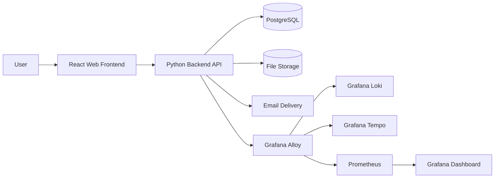
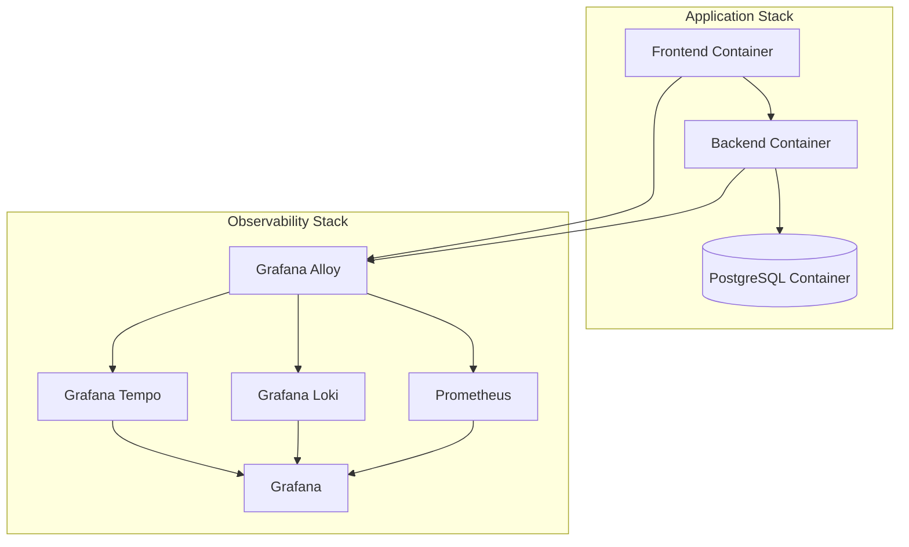
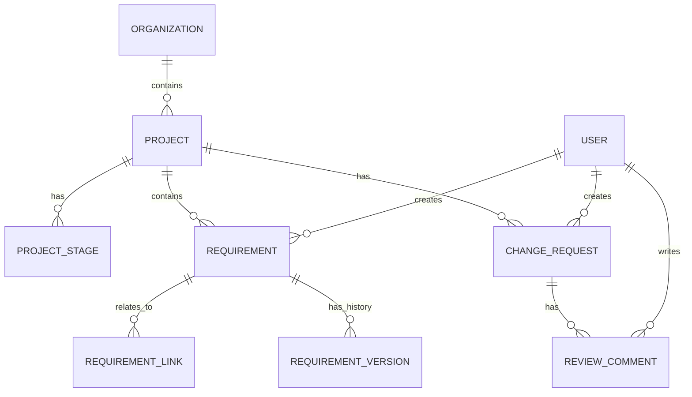
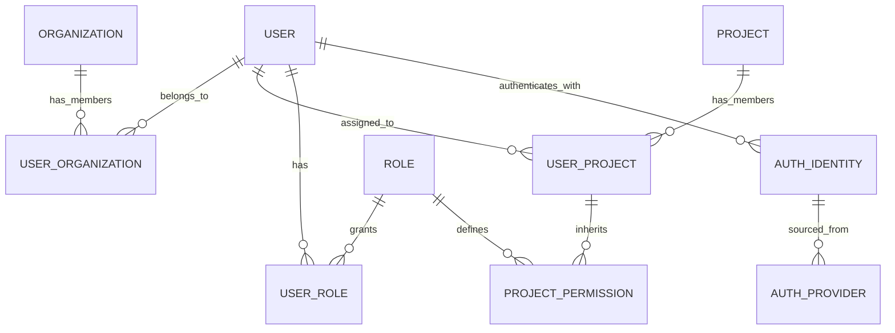

# Solution Architecture

## Purpose

This document describes the proposed solution architecture for ReqTrackManager, an open-source engineering requirements management platform for product development teams. The architecture is designed to satisfy the core requirements in the product requirements document while remaining deployable, extensible, and suitable for future growth.

The design focuses on three priorities:
- provide a complete requirements management workflow for MVP delivery
- support formal change management and traceability
- remain easy to deploy and operate with a container-based architecture

## Architectural Goals

The architecture is guided by the following goals:

- Support a formal requirements lifecycle from scoping to review, approval, completion, and archival.
- Keep the system modular so frontend, backend, data, and observability concerns can evolve independently.
- Start with a simple deployment model: one frontend container, one backend container, and one PostgreSQL database.
- Support enterprise-style concerns such as role-based access control, audit trails, and configurable workflows.
- Provide a product experience that is easy to use, intuitive, and low-friction for everyday project work.
- Use a temporal data model so that requirement and change history can be queried over time and audited reliably.
- Provide strong operational visibility through health checks, metrics, logs, and tracing.

## High-Level Solution Overview

The system consists of a web-based frontend, a backend API, a relational database, and supporting operational services for monitoring and observability. The high-level overview focuses on business capabilities, deployment topology, and operational concerns rather than authentication details.

The following diagram shows the primary system context:

This diagram shows the main runtime flow: users interact with the frontend, the frontend calls the backend API, and the backend stores data in PostgreSQL and optional files in shared storage. Observability data is collected by Grafana Alloy and routed to Loki, Tempo, and Prometheus.

## Core Architecture Principles

### 1. Layered separation of concerns
The solution separates the user interface, application services, persistence, and operational concerns. This reduces coupling and allows each layer to evolve independently.

### 2. Domain-driven backend modules
The backend is structured around business domains such as organizations, projects, requirements, change requests, reviews, audit history, and reporting. This makes the system easier to maintain and extend.

### 3. Container-first deployment
The application is designed to run in containers from the start. Docker Compose provides a development and test environment, and the same model can be used for lightweight production deployments.

### 4. Secure-by-default design
Authentication, authorization, audit logging, and data sanitization are treated as first-class platform concerns rather than afterthoughts.

## Component Architecture

### Presentation Layer
The presentation layer is a React single-page application that provides:
- project and requirement browsing
- requirement creation and editing
- change request submission and review
- dashboards, reports, and audit views
- user preferences and notification management

Responsibilities:
- render UI state from backend APIs
- manage client-side routing and local state
- provide responsive behavior for desktop and mobile use

### Application Layer
The backend service is implemented in Python and exposes a RESTful API. It is responsible for:
- project and organization management
- requirements and change request lifecycle handling
- traceability and dependency management
- reporting and export generation
- notifications and audit logging
- file attachment handling

The backend should be organized into discrete modules such as:
- auth and identity
- organizations and projects
- requirements
- change requests
- reviews and approvals
- reporting
- notifications
- audit and history
- file management

### Data Layer
PostgreSQL is the primary transactional store for the system. It stores:
- organizations and users
- projects and project stages
- requirements and metadata
- change requests and review records
- permissions, groups, and role assignments
- audit history and lifecycle state

The database layer should include:
- schema migration support
- versioned schema changes
- transactional integrity for workflow steps
- backup and restore procedures

### File Storage Layer
Files such as supporting documents and uploaded attachments are stored in a configurable backend. The initial deployment can use local filesystem storage, while the design should allow later migration to object storage such as S3 or MinIO.

### Observability Layer
The architecture includes observability services for metrics, logs, and traces:
- Prometheus for metrics collection
- Loki for log aggregation
- Tempo for distributed tracing
- Grafana Alloy for shipping logs, traces, and metrics
- Grafana for visualization and dashboards

The following diagram shows the runtime deployment view:

This diagram reflects the initial deployment model: one frontend container, one backend container, one database, and a lightweight observability stack.

## Deployment Architecture

### Initial deployment model
The initial architecture uses a simple container-based deployment with:
- one frontend container
- one backend container
- one PostgreSQL container
- optional supporting containers for observability

This is suitable for local development, CI testing, and small production deployments.

### Development and testing environment
Docker Compose should provide a complete environment for development and test execution. It should include:
- frontend container
- backend container
- PostgreSQL service
- optional observability services
- health checks for each service

### Production deployment path
The architecture should support future scaling by allowing services to be separated when required. Later improvements may include:
- multiple backend replicas behind a load balancer
- separate worker services for background tasks and notifications
- dedicated object storage instead of local file storage
- separate read/write database patterns if required
- additional services for search, caching, or queue processing

## Security Architecture

The platform should include the following security controls:
- authentication with native credentials and optional SSO/OAuth integration
- role-based access control for organizations, projects, and permissions
- audit logging for user actions and requirement changes
- sanitization of data entering and leaving the database
- secure handling of secrets through environment variables or secret stores

## Data and Workflow Model

The platform is centered on a formal workflow for requirements management:
1. A project is created within an organization.
2. Project stages and versions are configured.
3. Requirements are created and reviewed during a scoping stage.
4. Requirements are approved to form a baseline.
5. Changes to approved requirements must go through formal change requests.
6. The system records history, ownership, approvals, and audit metadata.

This workflow is reflected in the application domain model and should be enforced in the backend service.

### Temporal data model
The database should be temporal. Rather than only storing the latest state of a record, the platform should preserve historical states so that users can inspect how requirements, change requests, and project states evolved over time. The data model should support:
- versioned rows for requirements and change requests
- effective time tracking with start and end timestamps
- immutable history for approved baselines and change events
- point-in-time queries for audit, reporting, and compliance review

A practical implementation in PostgreSQL is to use a versioned schema with fields such as `valid_from`, `valid_to`, `version_number`, `created_at`, `updated_at`, and `updated_by` on key entities. This supports temporal reporting without losing the simplicity of a relational model.

### Entity diagram

### Permission and identity model

This diagram shows how a user can be associated with one or more organizations, receive roles, and be granted project-level permissions. It also shows that user identity may come from a local credential source or an external OAuth/SSO provider.

### Database structure
The database should be organized around the following core entities:
- `organizations` for tenant and organizational context
- `users` and `roles` for identity and permission management
- `projects` and `project_stages` for lifecycle management
- `requirements` and `requirement_versions` for requirement state and history
- `change_requests` and `change_request_versions` for change management and temporal evolution
- `review_comments` for collaborative review discussion
- `audit_events` for system and user activity history
- `files` and `notifications` for supporting artifacts and communication

This structure keeps the primary transaction model relational while supporting auditability and temporal querying.

## Observability and Operations

The system must support operational monitoring in a production-ready way.

### Health monitoring
Each service should expose health endpoints and health checks so that container health can be verified by orchestration tooling.

### Required metrics
The platform should expose and record the following metrics:
- application availability and uptime
- HTTP request rate, latency, and error rate for frontend and backend endpoints
- backend CPU, memory, and container restart counts
- database connection pool utilization and query latency
- requirement workflow metrics such as created, updated, approved, completed, and archived counts
- change request metrics such as submitted, approved, rejected, and review duration
- user activity metrics such as login attempts, active sessions, and failed authentication attempts
- notification delivery and read metrics
- storage usage for uploaded files and backup health

### Metrics endpoint
The backend should expose a Prometheus-compatible metrics endpoint so that monitoring systems can scrape application metrics.

### Logs and traces
The platform should support:
- log aggregation with Loki
- distributed tracing with Tempo
- shipping and correlation of logs, traces, and metrics through Grafana Alloy

These capabilities improve reliability, incident response, and support for service-level monitoring.

## Non-Functional Considerations

### Scalability
The architecture is designed to support increasing user counts and project complexity without requiring a full rewrite. The initial deployment is simple, but the design leaves room for future decomposition into more services.

### Maintainability
The modular domain structure, containerization, and documented deployment model keep the solution maintainable for future contributors.

### Extensibility
The architecture allows later addition of features such as:
- SSO providers
- advanced reporting pipelines
- notification workers
- external file storage
- multi-tenant enterprise integrations

## Recommended Implementation Stack

The architecture is intended to be implemented with the following technologies:
- Frontend: React
- Backend: Python
- API: RESTful, OpenAPI-compliant
- Database: PostgreSQL
- Containerization: Docker and Docker Compose
- Observability: Prometheus, Loki, Tempo, Grafana Alloy, Grafana

## Summary

The proposed solution architecture delivers a practical and scalable foundation for ReqTrackManager. It starts with a simple container-based deployment suitable for MVP delivery, while preserving a path for growth into a more distributed and enterprise-ready platform.
