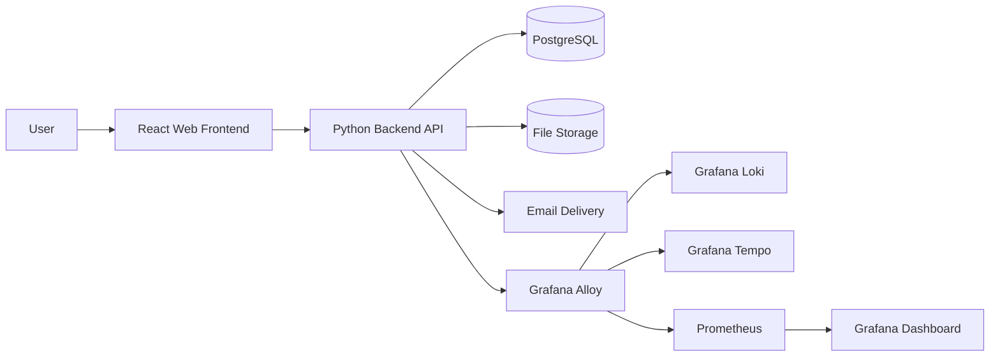
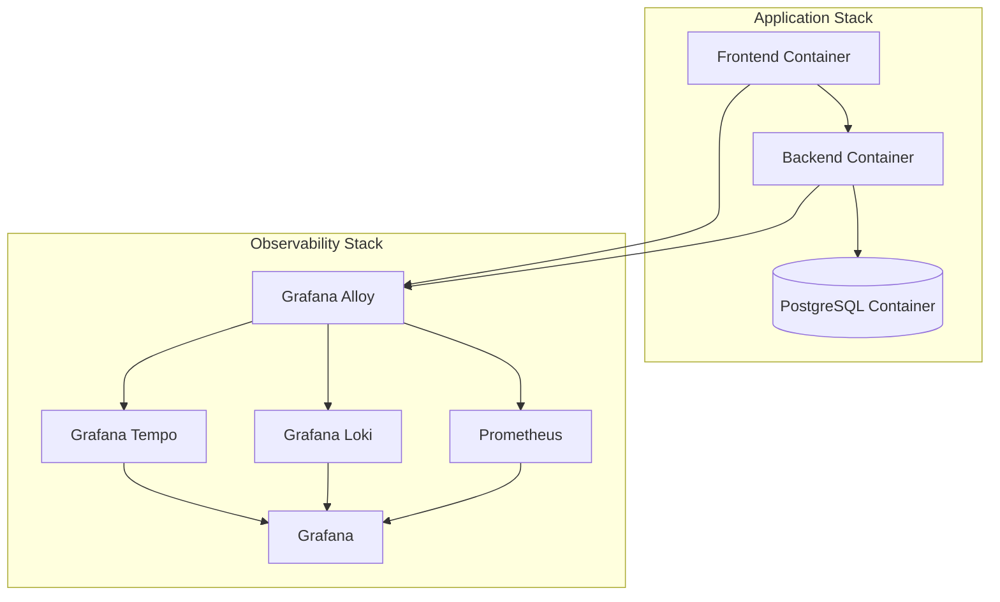
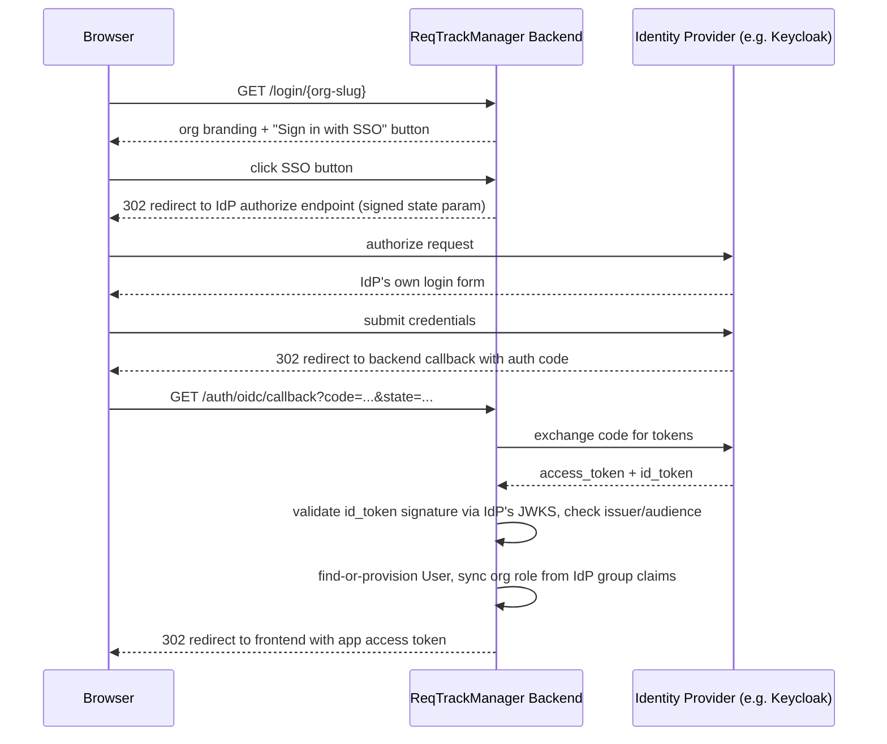
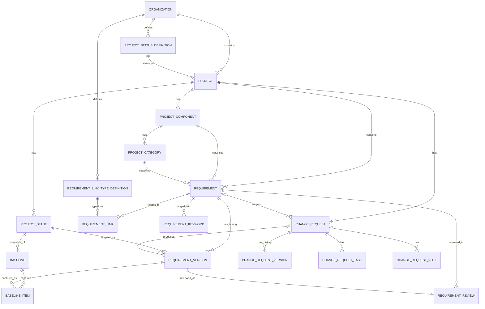
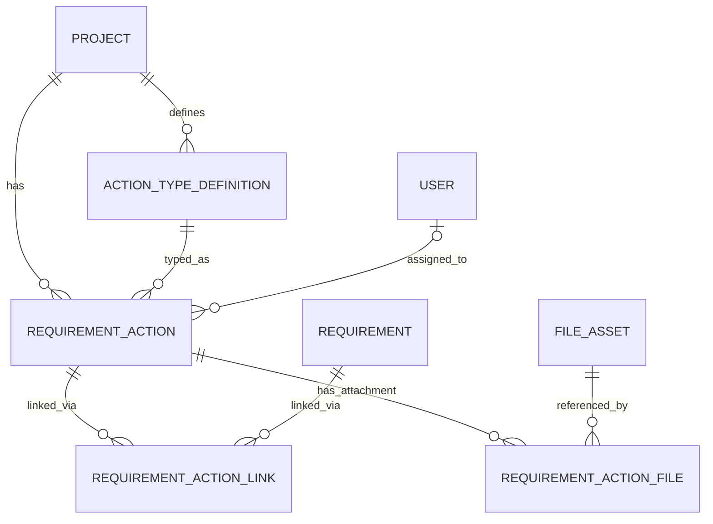
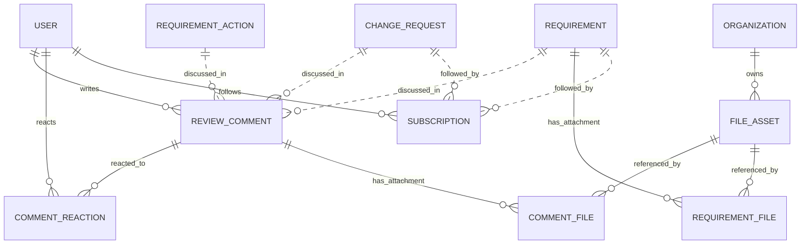
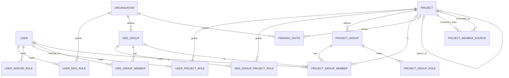
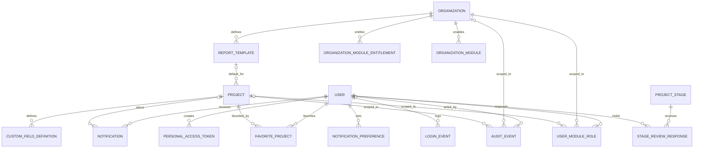

# Solution Architecture

## Purpose

This document describes the proposed solution architecture for ReqTrackManager, an open-source engineering requirements management platform for product development teams. The architecture is designed to satisfy the core requirements in the product requirements document while remaining deployable, extensible, and suitable for future growth.

The design focuses on three priorities:
- provide a complete requirements management workflow for MVP delivery
- support formal change management and traceability
- remain easy to deploy and operate with a container-based architecture

## Architectural Goals

The architecture is guided by the following goals:

- Support a formal requirements lifecycle from scoping to review, approval, completion, and archival.
- Keep the system modular so frontend, backend, data, and observability concerns can evolve independently.
- Start with a simple deployment model: one frontend container, one backend container, and one PostgreSQL database.
- Support enterprise-style concerns such as role-based access control, audit trails, and configurable workflows.
- Provide a product experience that is easy to use, intuitive, and low-friction for everyday project work.
- Use a temporal data model so that requirement and change history can be queried over time and audited reliably.
- Provide strong operational visibility through health checks, metrics, logs, and tracing.

## High-Level Solution Overview

The system consists of a web-based frontend, a backend API, a relational database, and supporting operational services for monitoring and observability. The high-level overview focuses on business capabilities, deployment topology, and operational concerns rather than authentication details.

The following diagram shows the primary system context:

This diagram shows the main runtime flow: users interact with the frontend, the frontend calls the backend API, and the backend stores data in PostgreSQL and optional files in shared storage. Observability data is collected by Grafana Alloy and routed to Loki, Tempo, and Prometheus.

## Core Architecture Principles

### 1. Layered separation of concerns
The solution separates the user interface, application services, persistence, and operational concerns. This reduces coupling and allows each layer to evolve independently.

### 2. Domain-driven backend modules
The backend is structured around business domains such as organizations, projects, requirements, change requests, reviews, audit history, and reporting. This makes the system easier to maintain and extend.

### 3. Container-first deployment
The application is designed to run in containers from the start. Docker Compose provides a development and test environment, and the same model can be used for lightweight production deployments.

### 4. Secure-by-default design
Authentication, authorization, audit logging, and data sanitization are treated as first-class platform concerns rather than afterthoughts.

## Component Architecture

### Presentation Layer
The presentation layer is a React single-page application that provides:
- project and requirement browsing
- requirement creation and editing
- change request submission and review
- dashboards, reports, and audit views
- user preferences and notification management

Responsibilities:
- render UI state from backend APIs
- manage client-side routing and local state
- provide responsive behavior for desktop and mobile use

### Application Layer
The backend service is implemented in Python and exposes a RESTful API. It is responsible for:
- project and organization management
- requirements and change request lifecycle handling
- traceability and dependency management
- reporting and export generation
- notifications and audit logging
- file attachment handling

The backend should be organized into discrete modules such as:
- auth and identity
- organizations and projects
- requirements
- change requests
- reviews and approvals
- reporting
- notifications
- audit and history
- file management

**Implementation note (bundle export/import):** three related, self-describing zip-bundle export/import capabilities exist beyond the fixed-table CSV export in "reporting and export generation" above, for backup, offboarding, and migration rather than reporting:
- **Requirement CSV** (`GET`/`POST /projects/{id}/requirements/export|import`, `backend/app/services/requirement_csv.py`) — full-fidelity round trip of every requirement field, including custom field values and target stage, distinct from the fixed report-table CSV (R-F-02).
- **Project bundles** (`GET /projects/{id}/export`, `POST /projects/import`, `backend/app/services/project_export.py`) — a project's structure (stages/components/categories/custom field definitions) and full history (every requirement version, change request with its versions/tasks/votes/comments, baselines, review outcomes) plus attachments, importable as a brand-new project in any organisation the caller can create in.
- **Organisation bundles** (`GET /orgs/{id}/export`, `POST /orgs/import`, `backend/app/services/org_export.py`) — an organisation's settings, members, report templates, org-owned files, and every project bundled the same way, importable as a brand-new organisation. The same bundle can also be **merged into an existing organisation** the caller already administers instead (`POST /orgs/{id}/import/preview` then `POST /orgs/{id}/import/merge`) — users, groups, projects, and report templates only, never the target org's own profile (branding/SMTP/SSO/logo/default template). A project or report template whose name collides with something the target already has is surfaced as a conflict the caller resolves explicitly (skip/import-as-copy for a project; keep-existing/use-imported for a template) before anything is written.

**Implementation note (project-wide file browser):** `file_assets` has no `project_id` column of its own (it's org-scoped, shared across a requirement attachment, a requirement action attachment, or an org shared resource) — a file is only ever *reachable* from a project by joining through whichever of `requirement_files`/`requirement_action_files`/`comment_files` links it to a requirement or action in that project. `GET /projects/{id}/files` (`backend/app/routers/projects.py::list_project_files`, `frontend/src/pages/ProjectFilesPage.tsx`) performs that three-way join to give a project a single browsable file list, each row carrying its originating requirement/action/comment context — filling in behind the `file_count` overview metric, which only ever counted direct requirement attachments without ever listing them.

**Implementation note (resending a pending invite):** `GET /projects/{id}/pending-invites` and `POST /projects/{id}/pending-invites/{invite_id}/resend` (`backend/app/routers/projects.py`, gated by the same `require_project_manage` tier as the by-email invite endpoint that creates these rows) round out the by-email invite flow with visibility and recovery for the standard (non-SSO) `PENDING_INVITE` path: a project admin can see who hasn't finished signing up yet (including already-expired invites, whose `status` is computed from `expires_at` at read time rather than stored) and re-trigger delivery — rotating the token/`expires_at` rather than re-sending the stale one, via `services/invites.py::resend_pending_invite` (factored out of the same email-body logic `create_pending_invite` uses). Deliberately scoped to the standard flow only; an `sso_only` organisation's by-email invites are provisioned immediately (`provision_sso_invite`) and never create a `PENDING_INVITE` row to resend — see [decisions.md](decisions.md)'s "Resend a pending invite" entry for the scope decision. Frontend: `frontend/src/components/PendingInvitesSection.tsx`, a small self-contained component (own fetch/state), now rendered from `ProjectAdminPage.tsx`'s "Members" section (Phase 5 relocated it there from the old combined "Project groups" tab, per its own docstring's stated plan).

**Implementation note (org-level invites, follow-up UX batch Phase A):** the by-email invite flow above was, until this phase, only reachable from *inside a project*. `GET/POST /orgs/{id}/pending-invites` and `POST /orgs/{id}/pending-invites/{invite_id}/resend` (`backend/app/routers/orgs.py`, gated by `require_org_admin_or_server_admin`) give Org Admin its own equivalent entry point — a thin wrapper over the same `services.invites.create_pending_invite`/`resend_pending_invite` used above, with `project=None`/`project_role=None`, scoped to `project_id IS NULL` rows so the two list endpoints never double-count each other's invites. Frontend: `OrgAdminPage.tsx`'s Users table (rebuilt on the new shared `frontend/src/components/DirectoryTable.tsx` component) merges `GET /orgs/{id}/pending-invites` alongside real users client-side, `kind: "user" | "invited"` — see [decisions.md](decisions.md)'s "Follow-up UX batch, Phase A" entry.

**Implementation note (Org/Project Groups rebuilt on `DirectoryTable`, follow-up UX batch Phase B):** both `GET /orgs/{id}/groups` and `GET /projects/{id}/groups` (`backend/app/routers/orgs.py`, `backend/app/routers/projects.py`) gained an `order: "asc" | "desc"` query param (name-ascending by default, unchanged) — both lists already page via `limit`/`offset`, so `DirectoryTable`'s Name column sort is a backend-sorted refetch rather than a client-side sort of only the currently-loaded page, which would misrepresent the true full-list order (see [ux-style-guide.md](ux-style-guide.md)'s "Pattern: sortable column header"). Frontend: Org Admin's Groups section and Project Admin's Groups tab both moved onto the shared `DirectoryTable` (Name/Members and Name/Role/Members columns respectively) with a per-row `SidePanel`, replacing Org Admin's old `CollapsibleSection`-of-`CollapsibleSection`s accordion and Project Admin's pre-`DirectoryTable` `<button>`-row list. A real bug was fixed in the same pass: the org group `SidePanel`'s SSO-sync sub-section (sync name, granted role) previously gated only the granted-role `<select>` on SSO being configured for the org — the sync-name `<input>` and its Save action rendered unconditionally regardless. The entire sub-section is now gated together, plus a new enable/disable checkbox (checked by default only when the group is already synced) that shows/hides the name/role fields and clears both via the existing `PATCH /orgs/{id}/groups/{id}` when unchecked — see [decisions.md](decisions.md)'s "Follow-up UX batch, Phase B" entry.

**Implementation note (Server Admin's Access Review moved onto `DirectoryTable`/`FilterPanel`, follow-up UX batch Phase E):** `GET /api/v1/system/users` (`backend/app/routers/system.py::list_system_users`) gained `search` (name/email substring, case-insensitive — the same Python-side approach `list_org_users` already uses) and `sort`/`order` (`display_name|email|last_login_at|created_at`, mirroring `list_org_users`'s own contract, `created_at` being the one field beyond what Org Users sorts by) — the latter not explicitly asked for by the phase's plan text but necessary for `DirectoryTable`'s Email/Name/Last login/Created columns to be genuinely backend-sorted rather than a client-side sort of only the currently-loaded page (same reasoning as Phase B's `order` addition to `list_org_groups`/`list_project_groups` above). Frontend: `ServerManagementPage.tsx`'s `AccessReviewTab` moved onto the shared `DirectoryTable` + `FilterPanel` layout, matching Org Admin's Users table composition — `view` and `includeDeactivated` became a `FilterField`/`FilterCheckbox` with unchanged accessible names/behaviour, no `onRowClick`/`rowHref` (this directory has no per-row detail panel). A pre-existing-pattern bug (`reload()` nulling `users` before every refetch, which used to be harmless but would have unmounted the search box mid-keystroke once it moved inside the same conditionally-rendered block) was found via the new Storybook coverage and fixed in the same pass — see [decisions.md](decisions.md)'s "Follow-up UX batch, Phase E" entry. **Update, follow-up UX fix:** this table's `FilterPanel` now renders with `layout="top"` (a full-width bar above the table) rather than the original `.side-grid` side layout — its columns crowded the 240px sidebar; see [decisions.md](decisions.md)'s entry on this fix and [ux-style-guide.md](ux-style-guide.md)'s "Pattern: filter panel placement — side vs. top".

**Implementation note (default project groups removed; migrated to direct grants, follow-up UX batch Phase C):** `POST /projects` (`backend/app/routers/projects.py::create_project`)'s non-template path no longer auto-creates the four "standard" `ProjectGroup` rows (`is_default=True` — "Project Managers"/"Project Administrators"/"Stakeholders"/"Members") it used to seed on every project. The creator's initial `PROJECT_MANAGER` role is now always a direct `UserProjectRole` grant instead, via a new shared helper (`_ensure_project_has_a_manager`) both of `create_project`'s branches call — the exact fallback the template-clone branch already used when a cloned project ended up with no manager. `ProjectGroup.is_default` was removed from the model/schema entirely: `DELETE /projects/{id}/groups/{group_id}` no longer special-cases any group (its only remaining guard is C-U-08, "a project must retain at least one manager", which already applied to every group regardless of how it was created). A one-time data migration (`backend/alembic/versions/0019_remove_default_project_groups.py`) converts every pre-existing `is_default=True` group: its direct user members are materialized into direct `UserProjectRole` grants (idempotently), then the group is deleted if it had no other composition, or demoted (`is_default=False`, kept) if it had a nested org-group ref or cross-project member-source reference beyond its plain direct members — see [decisions.md](decisions.md)'s "Follow-up UX batch, Phase C" entry for the full migration design and the identify→verify→remediate security review performed for this RBAC-adjacent change. `services.templates.clone_project` now also copies a template's `UserProjectRole` rows (a real gap found in design review: direct grants are the normal mechanism from this phase on, so without this fix a template's directly-granted managers/admins/stakeholders/members would silently vanish on clone).

**Implementation note (project membership/groups redesign, Phase 5):** three new endpoints on `backend/app/routers/projects.py` complete the project-group/direct-role management surface: `PATCH /projects/{id}/groups/{group_id}` (`ProjectGroupUpdate{role}`) makes a `ProjectGroup`'s granted role editable after creation — previously fixed at creation time, which made "add members first, assign a role later" impossible; `DELETE /projects/{id}/groups/{group_id}` deletes a group entirely (at the time this deletes a non-default group only, 400 for one of the four standard groups, C-U-10 — follow-up UX batch Phase C later removed that special case entirely, see the Phase C note above); `GET /projects/{id}/direct-members` (`DirectMemberOut{user_id, display_name, email, roles}`) lists every user holding at least one direct `UserProjectRole` grant, grouped per user with the real multi-valued `roles` array `UserProjectRole`'s `(user_id, project_id, role)` unique constraint allows — no endpoint previously listed direct role grants as a directory at all (follow-up UX batch Phase D later removed this endpoint entirely once `GET /effective-members`'s own `direct_role` provenance kind made it redundant — see the Phase D note below). Both mutating endpoints share the same C-U-08 ("a project must always have at least one manager") lock-then-recheck guard `remove_project_group_member`/`revoke_project_role` already use, extended to a role-change/whole-group-delete shape rather than a single-membership removal.

**Implementation note (unified Groups directory, PR5 of the members/groups directory rework plan):** `ProjectAdminPage.tsx`'s Groups tab is now the single UI surface for all four group-like mechanisms — a real `ProjectGroup`, an `ORG_GROUP` nested inside one, PR4's direct `ORG_GROUP_PROJECT_ROLE` grant (visible via a member's own Source column, not as its own Groups-tab row in this PR), and a `ProjectMemberSource` (project-to-project member mirroring, moved here from a previously structurally-disconnected Overview-tab section). The last of these merges into the same `DirectoryTable` as real `ProjectGroup` rows, via a frontend-only `kind`-discriminated row union type-badged "Project group" vs. "Project" — see [docs/ux-style-guide.md](ux-style-guide.md)'s "Pattern: type-badged mixed rows in a single directory" and [decisions.md](decisions.md)'s PR5 entry. The same PR also expands the Members section's own "Add member" autocomplete (`UserAutocomplete`) to match org groups by name alongside users — selecting one grants it a role directly via PR4's mechanism, with no `ProjectGroup` wrapper and no nesting, kept deliberately separate from the composition mechanisms above.

**Implementation note (unified Members table, follow-up UX batch Phase D):** `GET /projects/{id}/effective-members` (`backend/app/routers/projects.py::get_effective_members`) — previously a read-only audit view — is now the single surface behind Project Admin's editable "Members" section and Org Admin's "Manage users" modal alike, superseding both the Phase-5 `MemberRoleTable` (direct users + groups, `GET .../direct-members`) and the standalone `PendingInvitesSection`. Two changes make that possible: (1) `services.rbac._direct_effective_project_roles_by_kind` (new) splits the provenance `kind` this endpoint returns from a single collapsed `"direct"` value into five — `direct_role` (a genuine `UserProjectRole` row), `direct_group`, `direct_org_group`, `direct_project_ref`, `direct_org_wide` — since only `direct_role` is safe to expose as toggle-off-able via `DELETE /projects/{id}/roles/{user_id}/{role}` (that endpoint only ever deletes `UserProjectRole` rows; treating any of the other four kinds as equally revocable would silently no-op while the UI showed the role as removed); (2) new `search`/`limit`/`offset` query params, applied as an in-application sort/filter/slice over the already-fully-resolved result (`get_effective_project_members_with_provenance` itself still isn't a database-level-paginated query — see that function's own docstring), mirroring `list_project_groups`'s `X-Total-Count` contract. `GET /projects/{id}/direct-members` was removed entirely once nothing called it any more. Frontend: `frontend/src/components/ProjectMembersTable.tsx` (new, replaces `MemberRoleTable.tsx`/`PendingInvitesSection.tsx`, both deleted) — one `DirectoryTable` row per effective member, a `MultiSelectDropdown` Role cell (togglable only for a purely-`direct_role` option, checked-and-disabled with an explanatory title otherwise), pending invites merged in client-side as a per-row status badge + Resend button, and its own internal `FilterPanel` (role filter, "Show invited", search — rendered `layout="top"`, a full-width bar above the table, as of a follow-up UX fix; its Role/Source columns crowded the original `.side-grid` side layout, see [decisions.md](decisions.md)'s entry on that fix) so both call sites render identically. See [decisions.md](decisions.md)'s "Follow-up UX batch, Phase D" entry for the full design, including why the new pagination params aren't actually used by this particular frontend consumer.

Frontend: a new shared component, `frontend/src/components/MemberRoleTable.tsx` — a searchable, `SortableHeader`-sortable table over a `kind: "user" | "group"` discriminated-union row set, with a deliberately different role control per kind (`MultiSelectDropdown` for a user's genuinely multi-valued direct roles; a plain `<select>` for a group's genuinely single-valued role) and a client-side "last manager" disabled hint mirroring `OrgAdminPage.tsx`'s existing self-role-revoke treatment. Two call sites: `ProjectAdminPage.tsx`'s new "Members" section (split out of the old combined "Project groups" tab, which is now "Groups" — each group row opens a `SidePanel` instead of an always-expanded accordion, with the role `PATCH` at the top and a `?openGroup={id}` deep link from a Members-page group row into that panel), and `OrgAdminPage.tsx`'s "Manage users" action, which now opens a `Modal` wrapping the same component instead of a bespoke, duplicated inline expand — the direct fix for the org-admin membership UI being a separately-maintained, worse copy of the project-admin one.

Every bundle is a zip with a self-describing `manifest.json` (`kind`/`format_version`) so a newer application version can recognise and reject a bundle it can't safely import, rather than partially applying one. Cross-references inside a bundle use portable keys (requirement `unique_code`, component/category prefix, user email) instead of raw database ids, since ids from the source deployment are meaningless in the target one. See [decisions.md](decisions.md)'s "Bundle export/import" and "Merge-import into an existing organisation" entries for the security decisions (Restricted secrets are never exported; SSO is always left disabled post-import since the OIDC secret isn't carried over; project-level group *membership* is never replayed on import to avoid a cross-tenant privilege-escalation path; a merge never overwrites a project in place) and the full field-by-field design.

### Modular Feature System

> For a readable, example-driven explanation of this system aimed at someone building a new module (including a third-party developer outside this repository), see [docs/modules.md](modules.md). What follows here is the precise technical account.

The application supports a modular feature system (`docs/compliance-module-plan.md`) so that large, optional capability areas — Compliance being the first — can be built and shipped as discrete modules rather than as permanently-on core features, without every module requiring its own bespoke enable/disable plumbing scattered across routers. A module is gated at two independent tiers: **entitlement** (`organization_module_entitlements`, `app.models.module.OrganizationModuleEntitlement`) is the server-tier licensing/plan lever — whether an organisation is allowed to use a module at all, managed by `ServerRole.SERVER_ADMIN`/`MODULE_ADMINISTRATOR` — and **enablement** (`organization_modules`, `app.models.module.OrganizationModuleEnablement`) is the org-tier day-to-day switch an `OrgRole.ORG_ADMIN` controls among whichever modules their organisation is entitled to. Both are explicit-override-only tables, the same override-falls-back-to-default shape `Organization.accent_color_hex` already uses against `ServerSettings` (`services/branding.py`): no row for a given organisation/module pair means "use the deployment default" (`ServerSettings.default_module_entitlement_policy` for entitlement, a module's own `default_enabled` for enablement), not "denied." Effective access is `entitled(org, key) AND (enablement row if present else registry default)` — computed by `app.modules.registry.is_module_entitled`/`is_module_enabled` and enforced by two FastAPI dependency factories in `services/rbac.py`, `require_org_module_enabled(module_key)`/`require_project_module_enabled(module_key)`, which return **404** rather than 403 on a disabled or non-entitled module so its endpoints are indistinguishable from ones that don't exist, matching how a caller with no role at all on a resource is already treated elsewhere in this codebase.

`backend/app/modules/registry.py` is the single source of truth for "which modules exist," merged at process startup from three sources, in priority order: a static, in-repo `INSTALLED_MODULES` list (first-party modules, always loaded, added starting with Compliance in a later phase); Python entry points under the `reqtrackmanager.modules` group, for a third-party package deliberately `pip install`-ed into the deployment's image; and an optional local directory (`Settings.extra_modules_path`) scanned for hand-added custom modules. The latter two — genuinely new, third-party code entering the deployment's own process — are gated behind `Settings.allow_external_modules` (env `ALLOW_EXTERNAL_MODULES`), off by default: when off, neither discovery source is even scanned, not merely filtered afterward. This mirrors `MCP_WRITES_ENABLED`'s existing off-by-default precedent in this codebase and is a deliberate mitigation layered on top of the CC6.8 gap already documented in `docs/soc2/trust-services-criteria-mapping.md` ("no automated dependency/container vulnerability scanning exists") — a plugin-loading mechanism that can auto-import and run third-party code raises the stakes of that pre-existing gap, so it does not ship silently on-by-default. Every module the registry actually loads is logged at startup with its key, version, and source, giving an operational record of what code entered the trust boundary on a given run. `app.main` mounts every registered module's own `get_router()` (if it has one) in a simple loop at startup; a module applies its own `require_*_module_enabled` gating internally, inside its own router — there is no second gate at the mount-loop level.

**Module-contributed RBAC** (module system Phase 2) lets a module declare its own named roles — `ModuleDefinition.roles`, a tuple of `ModuleRoleDefinition(role_key, name, description, scope)` where `scope` is `"org"` or `"project"` — without extending the core `OrgRole`/`ProjectRole` enums (e.g. a future Compliance module's `compliance_manager`/`compliance_officer`). Two new tables back this: `module_role_definitions` (`app.models.module_role.ModuleRoleDefinitionRow`) is a database mirror of every role the registry has ever declared, upserted by `app.modules.registry.sync_module_role_definitions` at every process startup (called from `app.main`'s `lifespan`, right after the bootstrap step) — **deliberately append-only**, never deleting a row for a module/role no longer registered, so a historical grant's display name/description stays resolvable even if the declaring module is later removed; and `user_module_roles` (`app.models.module_role.UserModuleRole`) is the actual grant table, always carrying `organization_id` (even for a project-scoped grant, via the project's own organisation) plus a nullable `project_id` set only for project-scoped grants. Both are additive to, and independent of, the two gating tables above. Grants are **direct-only** — no group or project-hierarchy inheritance, a deliberate V1 scope boundary — enforced by a new dependency factory, `services/rbac.py::require_module_role(module_key, role_key)`, which resolves the role's declared `scope` at construction time (raising `ValueError` immediately if the module/role isn't registered — a code-time contract violation, not a request-time 500) and, at request time, 404s the same way `require_org_module_enabled`/`require_project_module_enabled` do if the module is disabled/non-entitled, then passes for `is_server_admin`, or (org scope) `OrgRole.ORG_ADMIN` on that organisation, or (project scope) `ProjectRole.PROJECT_MANAGER` on that project, or a matching `UserModuleRole` grant — the same "a higher tier already retains full access" composition `require_server_role`/`require_org_role` already apply to their own narrower scopes. `GET /orgs/{id}/module-roles`/`GET /projects/{id}/module-roles` list the roles currently grantable (declared by a currently-*enabled* module only); `POST`/`DELETE .../module-roles[/...]` grant/revoke a role, mirroring `assign_org_role`/`assign_project_role`'s own idempotent-grant, no-op-revoke, audit-logged shape. The frontend renders module-role options merged into the existing `MultiSelectDropdown` Roles column on `OrgAdminPage.tsx`'s Users table and `ProjectMembersTable.tsx`'s Role column, alongside the fixed core-role options, never a bespoke control.

**Two-tier frontend integration** (module system Phase 3) gives `ModuleDefinition.frontend_manifest` its real shape — `app.modules.registry.ModuleFrontendManifest(tier, nav_label, nav_path, frame_url)` — and adds the frontend-side registration convention it powers. **Tier A ("installed")** is the primary path: a module — first-party, or an npm-installed third-party package — ships its own route components and registers them in `frontend/src/modules/registry.ts` (`installedModules: TierAModuleDefinition[]`), compiled directly into the same bundle, so it directly imports and uses every real shared component (`Toast`, `ConfirmDialog`, `Modal`, `SidePanel`, `DirectoryTable`, `FilterPanel`, form inputs) exactly like a first-party page. **Tier B ("remote")** is for a genuinely dynamic, not-installed module: the frontend's `<ModuleFrame>` host component (`frontend/src/components/ModuleFrame.tsx`) renders it in a sandboxed `<iframe sandbox="allow-scripts allow-same-origin allow-forms">`, relaying shared chrome over `postMessage` — the "Host UI Bridge" — rather than reimplementing it: `{type:"toast", message, variant}` calls the host's real `useToast()`; `{type:"confirm", id, title, message, requireTypedText?}` renders the host's real `ConfirmDialog` (Tier 1 or Tier 2 depending on whether `requireTypedText` is present) and replies `{type:"confirm_result", id, confirmed}`; and a host→iframe `{type:"init", context:{organizationId, projectId, user, theme, cssTokens, apiBaseUrl, token}}` fires once the iframe loads. Both directions are origin-checked against the module's own declared `frame_url` origin — never `"*"` — in both directions. `token` is never the viewer's real session token: `POST /orgs/{id}/modules/{key}/frame-token` / `POST /projects/{id}/modules/{key}/frame-token` (gated by a normal session — the module-gating dependencies below reject a module-frame token here, so a Tier B iframe's own token can never mint another one) mint a 15-minute JWT (`app.security.create_module_frame_token`) scoped to exactly one `(module_key, organization_id or project_id, user_id)` tuple. `app.deps.get_current_user_or_module_frame(module_key)` — used only by `require_org_module_enabled`/`require_project_module_enabled`/`require_module_role`, never by plain `get_current_user` (which rejects a module-frame token outright, same as it already rejects a 2FA challenge token) — accepts either a normal session token or a module-frame token for exactly that `module_key`; `services/rbac.py::_enforce_module_frame_scope` then 403s if the token's own `organization_id`/`project_id` claim doesn't match the specific resource the request names, checked *before* any `is_server_admin`/`ORG_ADMIN`/`PROJECT_MANAGER` bypass. A declared `frame_url` must resolve to an origin in `Settings.module_frame_allowed_origins` (env `MODULE_FRAME_ALLOWED_ORIGINS`, comma-separated, empty/`frame-src 'none'` by default) or `app.modules.registry.get_frontend_manifest` excludes it (logged, not trusted from the module's own declaration) — the same allowlist also drives the `Content-Security-Policy: frame-src` directive `main.py`'s security-headers middleware sends on every response, so a rejected module's iframe would be browser-blocked even if the exclusion above were somehow bypassed. `GET /projects/{id}/enabled-modules` (`ModuleNavEntryOut`) is the lean, project-member-readable read `Layout.tsx`'s nav rail and `App.tsx`'s route-splicing both call independently to render a nav entry/route per currently-enabled module with a usable manifest — a disabled/non-entitled module, or one whose Tier B origin was rejected, simply contributes nothing, mirrored identically on both the nav and routing sides. See `docs/decisions.md`'s "Compliance module plan, Phase 3" entry for the full account, including the identify→verify→remediate review of the module-frame-token scoping mechanism.

Phase 4 of the module system plan builds on this same registry shape without further changing it: declarative, single-REST-call module-contributed `mcp-server/` tools. `ModuleDefinition` already carries a placeholder field (`mcp_tools`) for this so the dataclass's shape doesn't need a breaking change once that phase lands.

### Data Layer
PostgreSQL is the primary transactional store for the system. It stores:
- organizations and users
- projects and project stages
- requirements and metadata
- change requests and review records
- permissions, groups, and role assignments
- audit history and lifecycle state

The database layer should include:
- schema migration support
- versioned schema changes
- transactional integrity for workflow steps
- backup and restore procedures

### File Storage Layer
Files such as supporting documents and uploaded attachments are stored in a configurable backend. The initial deployment can use local filesystem storage, while the design should allow later migration to object storage such as S3 or MinIO.

**Implementation note (Pelion v2):** `backend/app/storage_backends/` defines a small `FileStorageBackend` protocol with two real implementations — `LocalFileStorageBackend` (filesystem) and `S3CompatibleFileStorageBackend` (boto3, works against MinIO or real S3) — selected via `STORAGE_BACKEND=local|s3`. The default Docker Compose stack runs MinIO and defaults to the `s3` backend so the object-storage path is exercised for real rather than only implemented in the abstract. See [decisions.md](decisions.md).

### Observability Layer
The architecture includes observability services for metrics, logs, and traces:
- Prometheus for metrics collection
- Loki for log aggregation
- Tempo for distributed tracing
- Grafana Alloy for shipping logs, traces, and metrics
- Grafana for visualization and dashboards

The following diagram shows the runtime deployment view:

This diagram reflects the initial deployment model: one frontend container, one backend container, one database, and a lightweight observability stack.

### AI Integration Layer

**Implementation note (post-Massif, E-U-01-adjacent):** a [Model Context Protocol](https://modelcontextprotocol.io) server (`mcp-server/`, see [mcp-server.md](mcp-server.md)) exposes requirements/projects/organisations to AI assistants (Claude Code, VS Code Copilot Chat, Microsoft Copilot Studio) as a second, independent consumer of the same REST API the frontend uses — not a new API surface or a new permission model. Its one architectural rule, worth stating explicitly since it's the whole reason this component is safe to add without a security review of its own: it holds no credentials and performs no authorization itself, only forwarding whichever caller's own bearer token it was given to the backend on every request, so the backend's existing RBAC remains the single point of enforcement for every code path, human or AI. This mirrors the "Secure-by-default design" principle above (backend enforces business rules; nothing else is trusted to) applied to a client this project didn't originally anticipate, rather than a new principle.

**Architecture decision: MCP is this product's AI-integration strategy, not one option among several.** ReqTrackManager deliberately has no AI backend, model integration, or inference dependency of its own anywhere in `backend/`/`frontend/` — every "AI writes/reads a requirement" capability is delivered by letting a general-purpose AI assistant call this MCP server with the user's own credentials, rather than the product embedding a model, prompt pipeline, or LLM API key. This keeps the product's own operational surface unchanged (no model costs, no inference latency/availability to manage, no prompt-injection surface inside the app itself) and keeps access control exactly where it already lives (the backend's RBAC), at the cost of depending on the calling AI tool to be reasonably well-behaved and on whatever data-handling posture that third-party tool has (see docs/mcp-server.md's "Third-party data flow" limitation). Read access was the original, lower-risk cut of this strategy; **write mode** (`MCP_WRITES_ENABLED`, see [mcp-server.md](mcp-server.md#write-mode)) extends it to requirement *authoring* — create/edit requirement content — while keeping every approval-type action (approving a requirement, deciding a change request, recording a review outcome) excluded at this server's own tool surface, not merely gated by the same RBAC a human would go through. See [docs/decisions.md](decisions.md)'s "MCP server write mode" entry for the full write-mode design and the reasoning for that specific boundary.

## Deployment Architecture

### Initial deployment model
The initial architecture uses a simple container-based deployment with:
- one frontend container
- one backend container
- one PostgreSQL container
- optional supporting containers for observability

This is suitable for local development, CI testing, and small production deployments.

### Development and testing environment
Docker Compose should provide a complete environment for development and test execution. It should include:
- frontend container
- backend container
- PostgreSQL service
- optional observability services
- health checks for each service

**Implementation note (pytest runs against its own dedicated database, not the dev/demo one):** `tests/container/docker-compose.yml`'s `backend` service's `DATABASE_URL` points at `reqtrack_test` — the same database its own long-running app process (the dev/demo stack, and Playwright's target backend) serves requests from. `backend/tests/conftest.py` unconditionally rewrites `DATABASE_URL`'s database name to a second, pytest-only database, `reqtrack_pytest_test` (`tests/_pytest_database.py::dedicated_pytest_database_url`, auto-created on first use), before any test runs — regardless of what `DATABASE_URL` the process inherited from the container's own environment. This is necessary, not cosmetic: the suite's session-scoped `_schema` fixture drops and recreates the entire schema at the start of every session, and every test truncates every table afterward, so `docker compose exec backend pytest -q` would otherwise destroy whatever demo/manually-seeded data existed in `reqtrack_test` every time it ran, even on a clean, fully-passing run. See [decisions.md](decisions.md)'s entry on this fix (and the earlier, related "Database: the test suite was wiping the live database" entry it builds on) for the full incident history.

### Production deployment path
The architecture should support future scaling by allowing services to be separated when required. Later improvements may include:
- multiple backend replicas behind a load balancer
- separate worker services for background tasks and notifications
- dedicated object storage instead of local file storage
- separate read/write database patterns if required
- additional services for search, caching, or queue processing

**Implementation note (Pelion v2):** notification email delivery, the daily digest batching job, and the local-storage disk-usage monitor all run as in-process `asyncio` background tasks started from the FastAPI lifespan handler (`backend/app/services/notifications.py`, `backend/app/services/disk_monitor.py`), consistent with the existing single-instance WebSocket pub/sub pattern, rather than as separate worker services — that split remains a valid future step once a single backend replica is no longer sufficient. Email is delivered via SMTP (`aiosmtplib`); the default Compose stack runs MailHog as a local/dev/test SMTP catcher so sent mail is inspectable at http://localhost:8025 without a real mail provider.

**Implementation note (HTML email template system):** every outgoing email (instant notifications, the daily digest, the org/system "send test email" actions, the disk-usage alert) is rendered from a shared Jinja2 layout (`backend/app/templates/email/base.html.jinja`) plus a small per-purpose content template, via `backend/app/services/email_templates.py::render_email`, which always produces a `multipart/alternative` (text + HTML) message. Branding — logo, header title, accent/CTA colour, and the outgoing-email footer's company name/website/postal address — is resolved by `backend/app/services/email_branding.py::resolve_email_branding` using the same org-overrides-platform-default two-tier shape `Organization.accent_color_hex`/`header_title` already use for UI chrome (`frontend/src/context/BrandingContext.tsx`); the digest and the two platform-level alerts (system test email, disk-usage warning) always use the platform defaults, never a specific org's, since they aren't scoped to a single organisation. The logo is embedded as a `multipart/related` `cid:` attachment (`services/email.py`) rather than loaded from an external URL, so a sent email never depends on the recipient's mail client being able to reach this deployment. Every email's footer links to a one-click, unauthenticated unsubscribe endpoint (`GET /notifications/unsubscribe`, `security.create_email_unsubscribe_token`/`decode_email_unsubscribe_token`) that sets the same `User.email_digest_mode` field the logged-in Preferences page controls, with every use — successful or rejected — written to the audit trail. See [decisions.md](decisions.md)'s "HTML email template system" entry for the Jinja2 safety reasoning and design rationale in full.

**Implementation note (deployment-wide organisation label):** `ServerSettings.org_label_singular`/`org_label_plural` let a server admin relabel the word "organisation"/"Organisations" throughout the UI — nav, page titles, column headers, buttons, and essentially every help/hint/confirmation sentence that mentions it — e.g. to "Tenant"/"Tenants" — set via the same `GET`/`PUT /system/branding` endpoint as the rest of platform branding, resolved on the frontend by `useOrgLabel`/`useOrgLabelPlural`/`useOrgLabelCapitalized` (`frontend/src/context/BrandingContext.tsx`). Every affected entry in `frontend/src/i18n/strings.ts` is a function of the resolved label rather than a literal string, so a call site that still passed one as a plain string became a compile error during the conversion — the type checker is what proved the sweep was complete, not manual review. Unlike accent colour/logo/header title, this has no per-organisation override — the word used to refer to organisations in general isn't a property of any one organisation — so it's always resolved from the platform default alone, never `fromOrg`'s per-org tier. Distinct from the per-project terminology override (C-C-03, `TERMINOLOGY_KEYS` in `backend/app/schemas/project.py`), which is a separate, fixed set of nouns that deliberately excludes "organisation." The two setting labels on the platform-branding admin form itself ("Organisation label (singular/plural)") are the one deliberate exception, always shown in English regardless of the configured override, since they describe the control rather than being subject to it.

## Security Architecture

The platform should include the following security controls:
- authentication with native credentials and optional SSO/OAuth integration
- role-based access control for organizations, projects, and permissions
- audit logging for user actions and requirement changes
- sanitization of data entering and leaving the database
- secure handling of secrets through environment variables or secret stores

**Implementation note (Massif v3, E-U-01):** optional SSO/OAuth is implemented as a per-organisation OIDC authorization-code flow (`backend/app/routers/auth_oidc.py`, `backend/app/services/oidc_client.py`, `backend/app/services/oidc_provisioning.py`), tested end-to-end against a real Keycloak instance rather than only implemented in the abstract — see [enterprise-integration.md](enterprise-integration.md) for the full design, the provider-agnostic discovery mechanism, and the SCIM/separate-port-provisioning blueprint for the two related enterprise requirements not yet built. The diagram below shows the login flow this session actually tested.

This diagram represents the sequence of an SSO login attempt: the browser, this app's backend, and the external identity provider (IdP, e.g. Keycloak). Read it top-to-bottom as the order operations happen in; the two "Backend validates..." steps are the security-critical points — the backend never trusts anything the browser or the IdP redirect chain claims about identity until it has independently verified the token's signature against the IdP's own published keys. It matters here because this is the one flow in the system where a third party (the IdP) is trusted to assert who a user is — every other auth path in the app only ever trusts its own database.

**Implementation note (Massif v3, C-R-05/C-R-08):** date-driven background checks (a requirement's review-due reminder, a project stage's review-deadline auto-approval) run as APScheduler cron jobs in-process in the same backend container (`backend/app/services/scheduler.py`), started from the same FastAPI lifespan handler as the existing `asyncio`-loop background tasks (digest batching, disk monitoring) — additive to that existing pattern, not a replacement, and still consistent with the single-backend-container deployment model described above.

**Implementation note (SOC 2 hardening):** "secure handling of secrets" is enforced at the application layer, not left entirely to infrastructure — a reusable `EncryptedString` SQLAlchemy column type (`backend/app/models/encrypted_type.py`, Fernet-based, keyed from `APP_SECRET_ENCRYPTION_KEY`, distinct from `JWT_SECRET`) encrypts every genuine stored secret (`Organization.oidc_client_secret`, `Organization.smtp_password`, `User.totp_secret`) so a database-only compromise doesn't expose them. The SSO login flow is also hardened against login-CSRF/session-fixation: the frontend generates a nonce that must round-trip through the entire OIDC redirect before a returned token is trusted (`security.create_oidc_state_token`), and the token itself travels in the callback URL's fragment rather than its query string, so it's never logged by an intermediate proxy. This platform's full security control posture — including the items still open, like the absence of login rate limiting — is tracked as an ongoing SOC 2 Security + Confidentiality control matrix in [docs/soc2/](soc2/), not just in this document. A GitHub Actions pipeline (`.github/workflows/ci.yml`) now runs the full backend and Playwright suites, plus lint, on every change — see the README's "Continuous integration" section — closing what that control matrix had flagged as its most consequential single gap.

## Data and Workflow Model

The platform is centered on a formal workflow for requirements management:
1. A project is created within an organization.
2. Project stages and versions are configured.
3. Requirements are created and reviewed during a scoping stage.
4. Requirements are approved to form a baseline.
5. Changes to approved requirements must go through formal change requests.
6. The system records history, ownership, approvals, and audit metadata.

This workflow is reflected in the application domain model and should be enforced in the backend service.

### Temporal data model
The database should be temporal. Rather than only storing the latest state of a record, the platform should preserve historical states so that users can inspect how requirements, change requests, and project states evolved over time. The data model should support:
- versioned rows for requirements and change requests
- effective time tracking with start and end timestamps
- immutable history for approved baselines and change events
- point-in-time queries for audit, reporting, and compliance review

A practical implementation in PostgreSQL is to use a versioned schema with fields such as `valid_from`, `valid_to`, `version_number`, `created_at`, `updated_at`, and `updated_by` on key entities. This supports temporal reporting without losing the simplicity of a relational model.

**Implementation note (Ossa v1):** rather than placing `valid_from`/`valid_to` directly on the `requirements`/`change_requests` tables, those tables hold only stable identity fields, and a companion `*_versions` table (one row per historical state, `valid_to IS NULL` for the current row) carries every mutable attribute plus the temporal columns. This keeps identity permanently stable while giving the same point-in-time query capability. See [decisions.md](decisions.md) for the reasoning.

### Entity relationship diagrams

**Note on how this section was produced:** the five diagrams and the table inventory below were generated by reading every SQLAlchemy model in `backend/app/models/` (`__tablename__`, every `ForeignKey(...)`, and every nullability annotation) rather than drafted from memory of what the schema was expected to contain — the previous version of this section predated most of Pelion (v2) and all of Massif (v3) and had drifted well behind the actual schema (it documented roughly a third of the tables that exist today, and its permission-model diagram described a generic `ROLE`/`AUTH_IDENTITY`/`AUTH_PROVIDER`/`PROJECT_PERMISSION` shape this codebase never actually built). Regenerate this section the same way — from the models, not from the previous version of this document — whenever new tables or foreign keys are added; `docs/decisions.md` is where the *why* behind a schema change belongs, this section only needs to stay an accurate *what*.

One diagram covering all 52 tables would be unreadable, so the schema is split into five diagrams along the same functional seams the backend's own router/service modules use: the core requirements/change-management workflow, requirement actions, discussion/engagement/files, identity and access control, and platform administration. A table that participates in more than one area (`FILE_ASSET`, `USER`, `PROJECT`) appears in whichever diagram(s) its relationships are most relevant to.

#### Core requirements and change-management domain

This is the workflow described in "Data and Workflow Model" above, as it's actually implemented. Read the two `|o--o{` (zero-or-one) relationships as the two places that duality matters: `REQUIREMENT |o--o{ CHANGE_REQUEST` is zero-or-one because a `NEW_REQUIREMENT`-kind change request has no target requirement yet (it creates one on approval); `CHANGE_REQUEST |o--o{ REQUIREMENT_VERSION` is zero-or-one because most requirement versions come from a direct edit while the requirement is unlocked, not from an approved change request — only the versions that *are* CR-produced carry that link (C-G-12). Everything else is one-required-parent-to-many-children. `PROJECT_COMPONENT`/`PROJECT_CATEGORY` classify a requirement's *identity* row (`REQUIREMENT`), not its versions — a requirement's component/category can be reassigned (e.g. when an admin deletes a category and picks another to reassign into) without that being a versioned content change. `CHANGE_REQUEST_VERSION` additionally carries its own nullable `proposed_component_id`/`proposed_category_id`/`proposed_target_stage_id` referencing the same three taxonomy tables (omitted from the diagram to limit crossing lines) — these are the *proposed* values a pending change request would apply, distinct from the requirement's current live classification. It matters because this is the one part of the schema every other feature (baselining, reporting, audit) reads from — get the requirement/version/change-request shape right and the rest of the app follows from it.

`PROJECT_STATUS_DEFINITION` and `REQUIREMENT_LINK_TYPE_DEFINITION` are both org-definable vocabularies, not fixed enums: every organisation is seeded with a default set (4 statuses; 12 forward/reverse-named link-type pairs) at creation and may add its own beyond that, with no artificial cap — see [decisions.md](decisions.md)'s "Project statuses and typed requirement links" entry for why. `REQUIREMENT_LINK` carries `link_type_id` rather than a fixed `link_type` enum column specifically so a link's asserted meaning is org-configurable; `REQUIREMENT_LINK_TYPE_DEFINITION` stores a `forward_name`/`reverse_name` pair (e.g. "Derives from" / "Is the source of") so the link reads correctly from either the source or target requirement's own page, resolved server-side per request rather than guessed client-side from a naming convention. `PROJECT.status_id` is `NOT NULL` with no `ON DELETE` action (implicit `RESTRICT`) — an application-layer check already refuses to delete an in-use status or the last remaining status in an organisation (both 409s), and the database-level `RESTRICT` is a deliberate second backstop against silently orphaning a `NOT NULL` foreign key.

`REQUIREMENT`'s `status` column (on `REQUIREMENT_VERSION`, not shown as a separate table above) is one of `draft`/`reviewed`/`approved`/`archived` (`RequirementStatus`) — completion is deliberately not a fifth value in that lifecycle enum. Per C-G-11 ("independently of lifecycle state, a requirement may be marked completed... subject to the potential of periodic review where it may later be reversed to non-compliant"), completion is `REQUIREMENT.is_completed`/`completed_at`/`completed_by` instead: an overlay on the identity row, mirroring the existing `is_archived`/`archived_at`/`archived_by` soft-delete overlay on the same table, layered on top of `status = approved` rather than replacing it. `POST .../complete` and `.../uncomplete` set/clear those three columns directly and do not write a new `REQUIREMENT_VERSION` — completing a requirement doesn't change its content, so (unlike every other status/content transition) it doesn't bump the version number. See [decisions.md](decisions.md)'s "Completion becomes an overlay marker, not a lifecycle status (C-G-11)" entry for the full reasoning and migration.

#### Requirement actions

A `REQUIREMENT_ACTION` (e.g. a review or a test a requirement needs performed against it) has its own project-scoped identity — its own `unique_code`, generated the same way `REQUIREMENT.unique_code` is — rather than belonging to exactly one requirement, so `REQUIREMENT_ACTION_LINK` is a genuine many-to-many join: one action (e.g. a single wind-tunnel test) can satisfy several requirements at once, and unlinking it from one requirement never deletes it or affects any other requirement still linked to it. `ACTION_TYPE_DEFINITION` is project-scoped (not org-scoped, unlike `PROJECT_STATUS_DEFINITION`/`REQUIREMENT_LINK_TYPE_DEFINITION` above) — matching `CUSTOM_FIELD_DEFINITION`'s existing project-scoping. The seam this was left open for (see decisions.md) is now built: a project with zero action types of its own resolves through `resolve_effective_action_types` (`backend/app/services/project_hierarchy.py`), which walks `PROJECT.parent_project_id` upward and returns the nearest ancestor's action types — always on, independent of the RBAC-inheritance mechanisms on the next diagram, and a pure structural walk with no visibility check of its own (see decisions.md's "Hierarchical projects" entry for the accepted trade-off there). `REQUIREMENT_ACTION_FILE` is a direct-attachment table, structurally identical to `REQUIREMENT_FILE` one diagram over, just scoped to an action instead of a requirement — an action's own discussion-thread attachments instead reuse the generic `REVIEW_COMMENT`/`COMMENT_FILE` machinery from the next diagram (a third `target_type`, alongside requirement and change request), not a fourth parallel comment system.

#### Discussion, engagement, and files

The three dashed (`..`) relationship groups are deliberately drawn differently from every solid (`--`) one on this diagram: `REVIEW_COMMENT` and `SUBSCRIPTION` are each polymorphic (a `target_type`/`entity_type` discriminator column plus a bare UUID column, not a real foreign key) so one comments table (and, for `REVIEW_COMMENT`, now three entity kinds — requirement, change request, and requirement action) serves multiple target kinds without a physical constraint tying a given row to one of them — that's an application-level invariant (enforced in `routers/requirements.py`, `routers/change_requests.py`, and `routers/actions.py`, not the database), which the dashed "non-identifying" line is mermaid's own notation for. `SUBSCRIPTION` has no `REQUIREMENT_ACTION` leg — actions have no follow/subscribe mechanism of their own. `FILE_ASSET` is one row per uploaded file regardless of storage backend (local disk or S3-compatible object storage — see "File Storage Layer" above); `REQUIREMENT_FILE` and `COMMENT_FILE` are join tables linking that one physical file to (potentially) a requirement and separately to a comment, since the same org-shared-resource file can be attached in either place (`REQUIREMENT_ACTION_FILE`, the action-attachment equivalent of `REQUIREMENT_FILE`, is on the requirement-actions diagram above). A requirement's own attachments are only ever addable while it's unlocked or via an approved change request (C-G-12); a comment's attachments are addable/removable at any time by the comment's own author, since a discussion thread isn't governed content the way a requirement's fields are — see [decisions.md](decisions.md)'s comment-editing entry for why that distinction exists.

#### Identity, organisation membership, and access control

This replaces the previous version of this diagram, which showed a generic `ROLE`/`AUTH_IDENTITY`/`AUTH_PROVIDER`/`PROJECT_PERMISSION` shape that was never actually built this way — there is no separate roles table (`OrgRole`/`ProjectRole` are Python enums stored directly as a column on `USER_ORG_ROLE`/`USER_PROJECT_ROLE`) and no separate identity-provider table (`User.auth_backend` is a plain string column — `"native"`, `"oidc"`, or the `"invited"` sentinel used for SSO-only pre-provisioning — directly on `USER`, per its own model docstring). The real shape is flatter: a user's access is the union of direct `USER_ORG_ROLE`/`USER_PROJECT_ROLE` grants, direct `ORG_GROUP_PROJECT_ROLE` grants (an org group holding a project role in its own right, independently of any `PROJECT_GROUP` — added by the members/groups directory rework's PR4, see [decisions.md](decisions.md)), plus whatever `PROJECT_GROUP` memberships apply to them — directly, via an `ORG_GROUP` they belong to, or via another `PROJECT`'s own roster (`PROJECT_GROUP_MEMBER` has three mutually-exclusive nullable owner columns, `user_id`/`org_group_id`/`source_project_id` — exactly one is set per row, which is what the three `|o--o{`/`|o--o{` lines into it represent: a project group member is one specific user, every member of one org group, or every direct member of one other same-organisation project, C-U-12 generalized — see [decisions.md](decisions.md)'s entry on this generalization). `ORG_GROUP_PROJECT_ROLE` (table `org_group_project_roles`) is deliberately a separate table from `PROJECT_GROUP_MEMBER`, not a fourth owner column on it: it grants a role to the org group *itself*, on a project, with no `PROJECT_GROUP` wrapper in between — nesting (an `ORG_GROUP` inside a `PROJECT_GROUP`) stays the way to bundle several groups/users under one named role; this is a separate, additive, independently-revocable path for a single org group to hold a role directly, mirroring `USER_PROJECT_ROLE`'s own shape one level up. `PROJECT_GROUP ||--o{ PROJECT_GROUP_ROLE : holds` (table `project_group_roles`, added by PR7 of the members/groups directory rework plan, see [decisions.md](decisions.md)) is the same "one row per role" shape applied to a `PROJECT_GROUP` itself: a group used to carry a single, required `role` column fixed at creation; it now holds zero, one, or several independently-revocable roles, one row per role here, mirroring `ORG_GROUP_PROJECT_ROLE`'s own shape one level down (an org group's project role vs. a project group's own role) rather than a fourth owner column or an array/JSON value. `PENDING_INVITE` is how an org/project role gets granted to someone with no account yet (by-email invite, C-U-10) — it resolves into real `USER_ORG_ROLE`/`USER_PROJECT_ROLE` rows once the invite is redeemed, via `services/invites.py`, so it's a staging table rather than a permanent grant itself. `USER_SERVER_ROLE` (table `server_roles`, model `app.models.server_role.UserServerRole`) is a genuinely server-wide (cross-tenant) grant, additive to `User.is_server_admin` rather than a replacement for it (compliance-module-plan.md Phase 0) — only `ServerRole.MODULE_ADMINISTRATOR` is ever actually written here; `ServerRole.SERVER_ADMIN`-equivalent power stays exclusively on the `is_server_admin` boolean, never duplicated into a row here, so there is never a second, independently-driftable source of truth for it. (Documentation drift found and fixed while updating this section for Phase 1: `server_roles`/`USER_SERVER_ROLE` had been added by Phase 0 but never added to this diagram or the table list below — the same class of drift this section's own note above already flags and asks future changes to avoid.) This diagram matters because every authorization check in the backend (`services/rbac.py`) is ultimately a query over exactly these tables — there is no other source of truth for "can this user do this."

`PROJECT |o--o{ PROJECT : parent_of` is `PROJECT.parent_project_id`, a nullable self-referential foreign key (`ondelete="SET NULL"`) — read it as "a project has zero-or-one parent, and zero-or-many children," the same self-join shape `ORG_GROUP_MEMBER.member_org_group_id` already uses for nested org groups, with the identical no-DB-level-cycle-constraint tradeoff (cycles are prevented at the application layer, `would_create_project_cycle`, since a `CHECK` constraint can't express "no cycle anywhere in this table's transitive closure"). This edge only exists between two projects where the parent has opted in: `PROJECT.can_be_parent` (default `false`) gates whether `parent_project_id` may point at it at all, enforced on both `create_project`/`update_project`, not just filtered out of the picker UI — see the "Hierarchical projects: can_be_parent eligibility gate" entry in [decisions.md](decisions.md). `PROJECT_MEMBER_SOURCE` (table `project_member_sources`) is a plain join table with two FKs to `PROJECT`, both `ondelete="CASCADE"`, drawn as two separate relationships (`consumes_from`/`consumed_by`) because the two ends mean opposite things and are authorized by opposite sides — see the "Hierarchical projects" entry in [decisions.md](decisions.md) for the full RBAC-cascade design (forward mirroring via `parent_project_id` + `Project.role_inheritance_mode`, reverse consumption via this table) and why that authorization asymmetry exists. Originally restricted to a direct parent/child pair and always granting bare `MEMBER`; generalized to any two same-organisation projects, with `mirror_mode`/`mirror_filter_role` columns (same `MIRROR_ALL`/`MIRROR_ROLE`/`MEMBER_ONLY` vocabulary as `Project.role_inheritance_mode`) controlling what's mirrored — see [decisions.md](decisions.md)'s entry on the generalization for the security review performed. `PROJECT |o--o{ PROJECT_GROUP_MEMBER : is` (`source_project_id`) is a third, structurally simpler mechanism reaching the same "another project's roster" idea from the group side rather than the project side — deliberately resolved as one hop only (that project's own *direct* members, never its own inherited/member-sourced/project-referenced members), so two projects referencing each other can never cause unbounded recursion, unlike `PROJECT_MEMBER_SOURCE`'s deliberately-chainable multi-hop walk. None of these three mechanisms is itself a new access-control *primitive* — all ultimately still resolve down to the same `USER_PROJECT_ROLE`/`PROJECT_GROUP_MEMBER` rows shown above, just reached by walking `parent_project_id`/`project_member_sources`/`source_project_id` first; `services/rbac.py` remains the single place that combines all of it into one project's effective role set.

#### Platform administration, notifications, and audit

This is the supporting-capability layer that wasn't represented in this document's ER diagrams at all before this revision, even though every one of these tables backs a real, shipped feature: `CUSTOM_FIELD_DEFINITION` (per-project custom attributes on requirements/change requests, C-C-01/02), `REPORT_TEMPLATE` (org-level PDF branding presets a project can set as its default, R-G-05), `PERSONAL_ACCESS_TOKEN` (long-lived, org/project-scoped bearer credentials for non-interactive integrations like `mcp-server/`), `NOTIFICATION`/`NOTIFICATION_PREFERENCE` (the in-app/email notification centre, C-N-01..05), `LOGIN_EVENT`/`AUDIT_EVENT` (C-A-07 login history and the general-purpose audit trail every mutating endpoint writes to via `services/audit.py::log_event`), `FAVORITE_PROJECT` (a user's pinned-projects list), and `STAGE_REVIEW_RESPONSE` (a stakeholder's explicit approve/reject response during a stage's review-deadline window, C-R-05). `AUDIT_EVENT`'s `organization_id`/`project_id` are both nullable and independently optional (a platform-level event like a server-admin action may carry neither) — it's the one table in the schema deliberately built to tolerate being only partially scoped, since it needs to represent everything from "a project setting changed" to "the server admin banned a user with no organisation at all." `ServerSettings` (platform-wide branding/signup-mode defaults) is a true singleton with no foreign keys into the rest of the schema and is omitted from the diagram for that reason — see its own model docstring. `ORGANIZATION_MODULE_ENTITLEMENT` (table `organization_module_entitlements`) and `ORGANIZATION_MODULE` (table `organization_modules`, model `OrganizationModuleEnablement`) are the module system's two-tier gating tables (compliance-module-plan.md Phase 1, see "Modular Feature System" above) — both explicit-override-only, unique on `(organization_id, module_key)`, with no row required for the common case (a module falls back to the deployment's default entitlement policy, or its own registry `default_enabled`, respectively). Both also carry an `updated_by` foreign key to `USER` (omitted from the diagram to limit crossing lines, same treatment as `PENDING_INVITE.invited_by` and `USER_ORG_ROLE`/`USER_SERVER_ROLE`'s own `granted_by`) for audit attribution independent of `AUDIT_EVENT.actor_id`, which is also logged at the call site for every mutation of either table. `USER_MODULE_ROLE` (table `user_module_roles`, model `app.models.module_role.UserModuleRole`) is the module system's Phase 2 module-contributed-role grant table (see "Modular Feature System" above for `require_module_role`'s full composition rules) — `organization_id` is always set, even for a project-scoped grant (via the project's own organisation), and `project_id` is nullable, set only for a project-scoped grant; also carries a `granted_by` foreign key to `USER` (omitted from the diagram for the same crossing-lines reason as above). `MODULE_ROLE_DEFINITION` (table `module_role_definitions`, model `ModuleRoleDefinitionRow`) is the registry's append-only database mirror backing those grants' display name/description — omitted from the diagram entirely, like `ServerSettings`, since it carries no foreign keys of its own (`module_key`/`role_key` are plain strings, deliberately not a foreign key target from `USER_MODULE_ROLE`, for the same "defined in code, not by a database row" reason `ORGANIZATION_MODULE_ENTITLEMENT.module_key` already documents).

### Database structure

The database is organised into 52 tables (as of this revision), grouped by which of the five diagrams above they belong to. This list is intentionally exhaustive rather than illustrative — treat a change that adds a table without updating this list the same as any other documentation drift. (Two corrections made in passing while adding `org_group_project_roles` in an earlier revision: this list had drifted to 46 while the schema actually had 47 — `project_member_sources`, present in the ER diagram above and in every migration/model, had been missing from this list entirely; added back then alongside that new table rather than left as a second, unrelated gap. A third, unrelated drift found and fixed while adding `project_group_roles` for PR7 below: the "One diagram covering all N tables" sentence just above the five-diagram split had been left at a stale "45" through at least the previous two additions. A fourth drift, found and fixed while adding the module system's tables for Phase 1: `server_roles` (Phase 0) had never been added to this list or the identity diagram above at all — this revision adds it alongside Phase 1's own two new tables rather than leaving it as a second, unrelated gap, the same pattern as the first correction above.)

**Core requirements and change management**: `organizations`, `projects`, `project_status_definitions`, `project_stages`, `project_components`, `project_categories`, `requirements`, `requirement_versions`, `requirement_links`, `requirement_link_type_definitions`, `requirement_keywords`, `requirement_reviews`, `baselines`, `baseline_items`, `change_requests`, `change_request_versions`, `change_request_tasks`, `change_request_votes`.

**Requirement actions**: `action_type_definitions`, `requirement_actions`, `requirement_action_links`, `requirement_action_files`.

**Discussion, engagement, and files**: `review_comments`, `comment_reactions`, `comment_files`, `requirement_files`, `file_assets`, `subscriptions`.

**Identity, organisation membership, and access control**: `users`, `user_org_roles`, `user_project_roles`, `org_group_project_roles`, `org_groups`, `org_group_members`, `project_groups`, `project_group_roles`, `project_group_members`, `project_member_sources`, `pending_invites`, `server_roles`.

**Platform administration, notifications, and audit**: `custom_field_definitions`, `report_templates`, `personal_access_tokens`, `notifications`, `notification_preferences`, `login_events`, `audit_events`, `favorite_projects`, `stage_review_responses`, `server_settings`, `organization_module_entitlements`, `organization_modules`.

This structure keeps the primary transaction model relational while supporting auditability and temporal querying — every table above traces back to one of the five functional areas the backend's own module layout already organises around (see "Domain-driven backend modules" above), so there is no separate "data architecture" to keep in sync with the application architecture; they are the same structure viewed two ways.

## Observability and Operations

The system must support operational monitoring in a production-ready way.

### Health monitoring
Each service should expose health endpoints and health checks so that container health can be verified by orchestration tooling.

### Required metrics
The platform should expose and record the following metrics:
- application availability and uptime
- HTTP request rate, latency, and error rate for frontend and backend endpoints
- backend CPU, memory, and container restart counts
- database connection pool utilization and query latency
- requirement workflow metrics such as created, updated, approved, completed, and archived counts
- change request metrics such as submitted, approved, rejected, and review duration
- user activity metrics such as login attempts, active sessions, and failed authentication attempts
- notification delivery and read metrics
- storage usage for uploaded files and backup health

### Metrics endpoint
The backend should expose a Prometheus-compatible metrics endpoint so that monitoring systems can scrape application metrics.

### Logs and traces
The platform should support:
- log aggregation with Loki
- distributed tracing with Tempo
- shipping and correlation of logs, traces, and metrics through Grafana Alloy

These capabilities improve reliability, incident response, and support for service-level monitoring.

## Non-Functional Considerations

### Scalability
The architecture is designed to support increasing user counts and project complexity without requiring a full rewrite. The initial deployment is simple, but the design leaves room for future decomposition into more services.

### Maintainability
The modular domain structure, containerization, and documented deployment model keep the solution maintainable for future contributors.

### Extensibility
The architecture allows later addition of features such as:
- SSO providers
- advanced reporting pipelines
- notification workers
- external file storage
- multi-tenant enterprise integrations

**Implementation note (Massif v3):** most of this list has since been built, not just left extensible in the abstract — SSO providers (per-org OIDC, tested against Keycloak), external file storage (pluggable local/S3-compatible backend, since Ossa v1), multi-tenant enterprise integrations (multi-org from Ossa v1, plus Massif v3's SSO/access-review/report-branding layer), and advanced reporting (filtered PDF/CSV export with selectable org branding templates) are all implemented today. The one genuinely still-future item is **notification workers**: the notification digest job, the disk-usage monitor, and the review/stage-deadline scheduler all still run in-process in the single backend container (see "Scaling beyond a single backend replica" in [deployment.md](deployment.md)) rather than as a separately-scaled worker service.

## Recommended Implementation Stack

The architecture is intended to be implemented with the following technologies:
- Frontend: React
- Backend: Python
- API: RESTful, OpenAPI-compliant
- Database: PostgreSQL
- Containerization: Docker and Docker Compose
- Observability: Prometheus, Loki, Tempo, Grafana Alloy, Grafana

## Summary

The proposed solution architecture delivers a practical and scalable foundation for ReqTrackManager. It starts with a simple container-based deployment suitable for MVP delivery, while preserving a path for growth into a more distributed and enterprise-ready platform.
