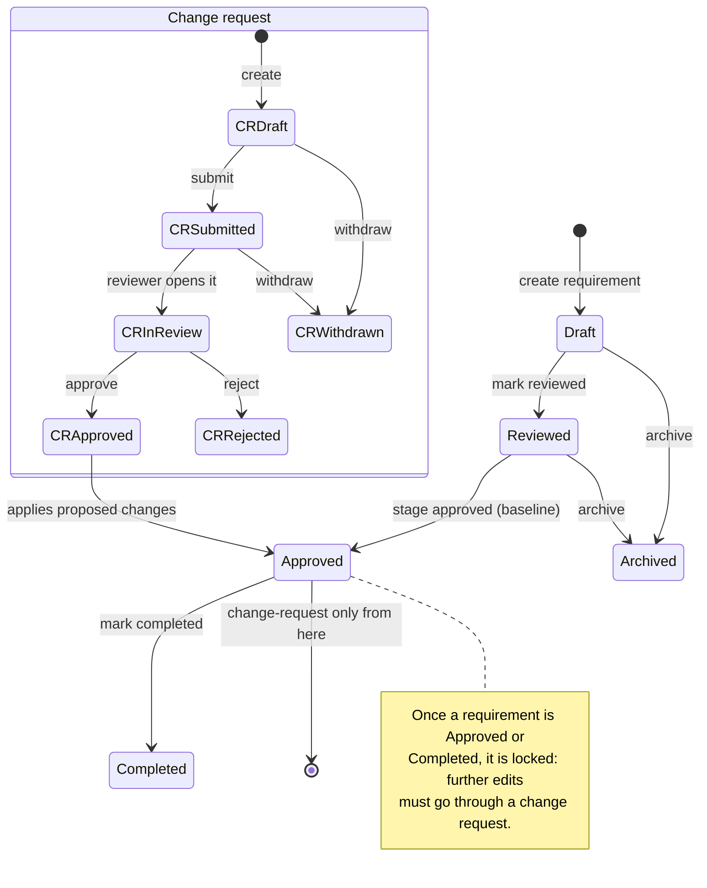

# User Guide

This guide walks through using ReqTrackManager's web interface. It satisfies N-D-02 ("comprehensive documentation on how to use the user interface"). For installation and configuration, see [deployment.md](deployment.md); for why the product works this way, see [decisions.md](decisions.md).

## Signing in

Go to the frontend URL and sign in with your email and password. If your account has two-factor authentication (2FA) enabled, you'll be prompted for a code from your authenticator app after your password is accepted — this is a second step, not a replacement for the password.

If your organisation has enabled single sign-on (SSO), go to its branded login page instead (`/login/{org-slug}` — ask your org admin for the exact link) and click **Sign in with SSO**; you're redirected to your organisation's identity provider to authenticate, and land back in the app already signed in. A "Sign in with SSO" button and, unless your org has hidden it, the regular email/password form both appear on that page. If your organisation requires membership in a specific identity-provider group and you're not in it, you'll see a message explaining your organisation hasn't provisioned you access yet — contact your org admin rather than retrying.

If you belong to more than one organisation, an organisation switcher appears wherever an organisation context is needed (for example, when creating a new project) — this is true regardless of whether you signed in natively or via one organisation's SSO, since it's still the same one account.

## Organisations and projects

- **Organisations** (`Organisations` in the nav) are the top-level container for users, groups, and projects. An org admin manages organisation users, groups, shared resource files, the organisation logo, report branding templates, SSO configuration, and which project (if any) is the organisation's default template. The **Organisation users** list also supports access-review filters — stale logins (180+ days), accounts without 2FA, and accounts with no project access at all — useful for periodic access reviews.
- **Projects** (`Projects` in the nav) list is filterable by active/archived status, by your role on the project, and by the project's current stage status, and is searchable by name/summary. Click **New project** to create one — either blank, or **from a template** (any project in the organisation marked "usable as a project template").
- Click the star icon next to a project to **favourite** it — favourited projects always sort to the top of your list, regardless of any other filter or search applied.

### Requirement and change-request lifecycle

The diagram below shows the states a requirement and a change request pass through and what triggers each transition. Read it as two independent lifecycles that meet at one point: approving a change request applies its proposed content to the requirement it targets. This matters because it's the one thing every other feature in the app builds on — locking, baselining, reporting, and the project history view are all just different views over these same state transitions.

## Working with requirements

Open a project and go to **Requirements**. From here you can:

- **Create a requirement**: pick a component and category (these determine its ID, e.g. `SW-PERF-014`), give it a name, and fill in any project-specific custom fields your organisation has defined.
- **Import from CSV**: click **Import CSV**, choose a file, then map its columns to the required fields (name, component, category — matched by prefix, not name — plus optional reasoning, level, and target version). A live preview shows the first few rows under your mapping before anything is uploaded, and required fields are called out so you can tell what's missing; click **Download template** for a starter CSV pre-filled with this project's own component/category prefixes.
- **Search** by name or ID, and view each requirement's component, category, and status at a glance.
- **Reorder** requirements within a component/category using the up/down arrows — this is only available while the project's current stage is in scoping.
- **Open a requirement** to see its full detail: name, reasoning, clarification, custom field values, an editable form (disabled once the requirement is locked), its version history (change log), a discussion thread for informal comments, traceability links to other requirements, and file attachments.
- **Attachments**: use the file picker at the bottom of the Attachments card to upload a supporting document; click a filename to download it, or the trash icon to remove it.
- Once a requirement is **locked** (approved or completed), further changes must go through a change request — the edit form disables itself and shows a "Locked" badge explaining why.
- **Review scheduling**: a requirement can carry a review date and an assigned reviewer. Once that date passes, it appears on the assigned reviewer's **My reviews due** page (nav) and the project's **Requirements due for review** page, until someone records a review outcome (met, or failed with a required comment explaining why) from the requirement's detail page.
- **Completion**: once a requirement is approved, a project manager can mark it **Completed** (and uncomplete it again, to correct a mistake) from its detail page — a separate status from approval, for tracking which approved requirements have actually been delivered/verified, not just baselined.

## Change requests

Go to **Change Requests** to propose a new requirement or a modification to an existing one:

1. **Create** a change request: choose "new requirement" or "modify requirement" (picking which one to modify), fill in the proposed name/reasoning/custom fields, and give a reason for the change.
2. **Submit** it — this notifies project managers and stakeholders.
3. A manager or administrator **approves** or **rejects** it with an optional decision note. Approval applies the proposed content to the target requirement (creating it, if it was a "new requirement" change request) and notifies the requester.
4. The creator (or a manager, on their behalf) can **withdraw** a change request before it's decided.

By default, only stakeholders/administrators/managers can submit change requests; a project setting (see **Project Admin → Settings**) can allow ordinary members to submit them too.

While a change request is open, anyone with access can also:

- Add **tasks** (a short description, an optional assignee and due date, and a done/not-done checkbox) — useful for tracking follow-up work the change implies, like updating a spec sheet once it's approved.
- Cast an **advisory stakeholder vote** (approve/reject, with an optional comment). This is a visible signal for whoever makes the actual decision — it does not itself approve or reject the change request; only a manager/administrator's explicit decision does that.

## Stages and baselining

**Project Admin → Project stages** shows the project's stage sequence (e.g. Scoping → Review → Approved → Completed). Approving a stage:

- Baselines every non-archived requirement still in draft/reviewed status (snapshotting its current version).
- Locks those requirements — from this point, they can only change via a change request.

A stage in review can also be given a **review deadline**: stakeholders record an explicit approve/reject response before it passes, and if the deadline passes with no rejection, the stage is automatically approved (silence is treated as approval) — an explicit rejection blocks the auto-approval and leaves it for a manager to resolve manually. Once a stage's work is delivered, a project manager can also mark the **stage itself completed**, optionally cascading completion to every approved requirement targeting it.

## Templates

A project marked **"Usable as a project template"** (in Project Admin → Settings) can be used as the starting point for new projects: its components, categories, custom field definitions, groups and group memberships, and requirements (reset to draft status) are copied into the new project. An organisation can also set a **default template**, which is offered by default whenever someone in that organisation creates a new project.

## Customisation

- **Custom fields** (Project Admin → Custom fields): define additional attributes — short text, long text, checkbox, or a fixed list of options — on requirements or change requests. These appear automatically on the create/edit forms and are versioned along with everything else.
- **Terminology** (Project Admin → Terminology): rename how a fixed set of nouns (project, stage, component, category, requirement, change request) are labelled in this project's UI, if your team uses different vocabulary internally.
- **Project archiving**: Project Admin → Archive project hides it from the default project list (it still appears with the "Archived" filter) without deleting any data.

## Reports and history

- **Reports**: generate a PDF or CSV export of a project's requirements, filtered by component, category, status, or keyword, with organisation shared resource files appended as extra sections. A PDF export can also use one of your organisation's **report templates** (Organisations → your org → Report templates: an accent colour, an optional cover page, and footer text) for consistent, on-brand output across projects.
- **Report content** (Project Admin → Report Setup): set the report's introduction and body/appendix chapters, in Markdown or a WYSIWYG rich-text editor — this is saved per project and reused on every report generated for it, rather than typed in fresh each time. A project that leaves any of these blank falls back to that field's organisation-wide default (Organisations → your org → Report Defaults), field by field; the Report Setup tab shows "(organisation default)" wherever that's happening.
- **Project history**: a unified timeline of everything that happened in the project (requirement and change-request version history, plus other audit events), filterable by date range, with an option to include discussion comments (excluded by default, since they're informal discussion rather than the formal change log).

## Notifications

The bell icon in the top bar shows your notifications (project joins, stage transitions, change-request activity, password changes, permission grants, and more), with an unread count badge. Click a notification to mark it read, or **Mark all read**. In **Preferences → Notification preferences**, choose per-notification-type whether you want it in-app, by email, or both, and whether email notifications are sent instantly or batched into a daily digest.

## Preferences

From the settings icon in the top bar:

- **Profile**: avatar, display name (an organisation admin can lock this), pronouns, theme (light/dark/system), and your landing page after login.
- **Security**: change your password, and enable/disable two-factor authentication (scan the QR code with an authenticator app, then confirm with a generated code).
- **Notification preferences**: per-type in-app/email toggles and digest mode, as above.

## Help

The **?** icon in the top bar opens an in-app help page covering how the app is organised, roles, the requirement and change-request lifecycles (with diagrams), and components/categories — a quick reference without leaving the app.
