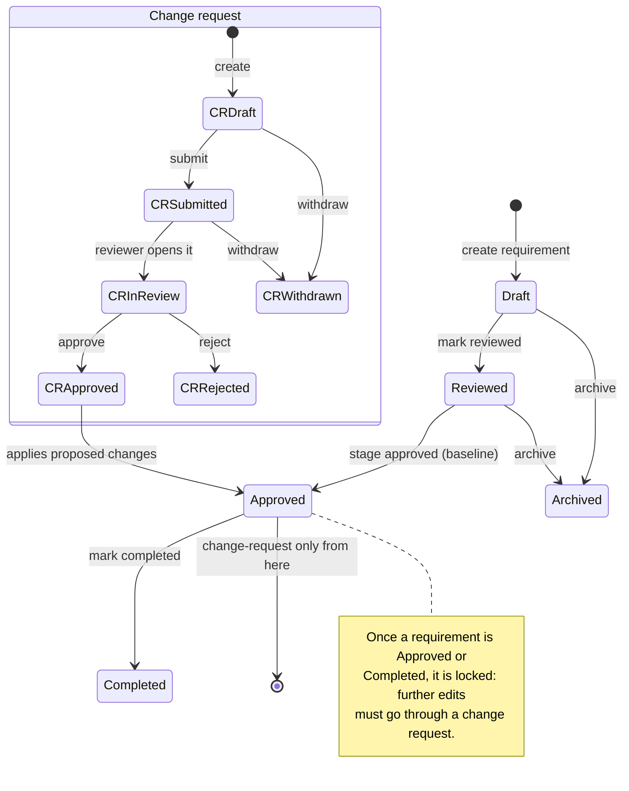

# User Guide

This guide walks through using ReqTrackManager's web interface. It satisfies N-D-02 ("comprehensive documentation on how to use the user interface"). For installation and configuration, see [deployment.md](deployment.md); for why the product works this way, see [decisions.md](decisions.md).

## Signing in

Go to the frontend URL and sign in with your email and password. If your account has two-factor authentication (2FA) enabled, you'll be prompted for a code from your authenticator app after your password is accepted — this is a second step, not a replacement for the password. Some organisations require every member to have 2FA enabled (Organisations → your org → Advanced settings); if yours does and you haven't set it up yet, you can still sign in and reach **Preferences → Security** to turn it on, but nothing else in that organisation will work until you do.

If your organisation has enabled single sign-on (SSO), go to its branded login page instead (`/login/{org-slug}` — ask your org admin for the exact link) and click **Sign in with SSO**; you're redirected to your organisation's identity provider to authenticate, and land back in the app already signed in. A "Sign in with SSO" button and, unless your org has hidden it, the regular email/password form both appear on that page. If your organisation requires membership in a specific identity-provider group and you're not in it, you'll see a message explaining your organisation hasn't provisioned you access yet — contact your org admin rather than retrying.

If you belong to more than one organisation, an organisation switcher appears wherever an organisation context is needed (for example, when creating a new project) — this is true regardless of whether you signed in natively or via one organisation's SSO, since it's still the same one account.

### Signing up

If the deployment allows public sign-up, a **Sign up** link appears below the login form. Depending on how the server admin has configured it, this either creates an account with no organisation yet (an admin assigns you to one afterward), or — if it's restricted to specific organisations — only succeeds for an email address whose domain matches one of them, in which case you join that organisation as a member immediately. If you were sent an invite link by a project admin instead, follow that link directly rather than the plain sign-up page; it already knows which organisation and project to grant you once you finish creating your account. See [Adding external users to a project](#adding-external-users-to-a-project) below for how those invites work, and the in-app Help page for the full picture of both.

## Organisations and projects

- **Org Management** isn't in the nav directly (to avoid duplicating the server admin console below for admins who can see both) — reach an organisation's own admin page from **Preferences → Your access**, which lists every organisation you belong to with a **Manage organisation** link wherever you hold the `org_admin` role. There, an org admin manages organisation users (with access-review filters — stale logins 180+ days, accounts without 2FA, accounts with no project access at all — useful for periodic reviews, plus, once an accepted email domain is set, a list of existing accounts elsewhere in the system matching that domain but not yet members), groups, shared resource files, the organisation logo, report branding templates and defaults, SSO configuration, and (Advanced settings) whether the organisation requires 2FA, allows self-signup with an accepted email domain, and whether/how external users can be added to its projects. An org admin can also see every project that belongs to the organisation — including ones they don't hold a direct role on — from the org admin page's **Projects** section; this is visibility into which projects exist, not a grant of access to their requirements or change requests. If you belong to only one organisation, going to that page skips straight to it rather than showing a one-item list to choose from.
- A **server admin** controls the deployment-wide public sign-up mode from **Server Management → Public sign-up** (disabled, always on, or restricted to organisations that have opted in) — see [Signing up](#signing-up) above.

### Adding external users to a project

The picker used to add someone to a project group (Project Admin → Project groups) normally only searches your organisation's own members. Typing a full email address that isn't already a member can also surface a result — "Add" for an existing account elsewhere in the system, or "Invite" for a brand-new one — if your organisation's admin has enabled it (Advanced settings → External users on projects). An existing account is added right away; a brand-new one either gets an email with a link to finish signing up (ordinary organisations) or is granted access immediately with an email pointing them at SSO (organisations that require SSO) — either way, the project role you picked is waiting for them as soon as they can actually sign in.
- **Projects** (`Projects` in the nav) list is filterable by active/archived status, by your role on the project, by the project's current stage status, and — if you belong to more than one organisation — by which organisation it's in, and is searchable by name/summary. Each project's card shows its organisation and how many requirements it currently has. Disabled organisations' projects are hidden by default; use the **All** filter to include them. Click **New project** to create one — either blank, or **from a template** (any project in the organisation marked "usable as a project template").
- Click the star icon next to a project to **favourite** it — favourited projects always sort to the top of your list, regardless of any other filter or search applied. Once you have at least one, a **Favourites** link appears in the nav's Global section as a quick jump list.

### Requirement and change-request lifecycle

The diagram below shows the states a requirement and a change request pass through and what triggers each transition. Read it as two independent lifecycles that meet at one point: approving a change request applies its proposed content to the requirement it targets. This matters because it's the one thing every other feature in the app builds on — locking, baselining, reporting, and the project history view are all just different views over these same state transitions.

## Working with requirements

Open a project and go to **Requirements**. From here you can:

- **Create a requirement**: pick a component, then a category belonging to that component (these determine its ID, e.g. `SW-PERF-014`) — categories live under a single component, not the whole project, so the category list narrows to match whichever component you've picked and resets if you change it. Give it a name and fill in any project-specific custom fields your organisation has defined.
- **Import from CSV**: click **Import CSV**, choose a file, then map its columns to the required fields (name, component, category — matched by prefix within that component, not name alone — plus optional reasoning, level, and target version). A live preview shows the first few rows under your mapping before anything is uploaded, and required fields are called out so you can tell what's missing; click **Download template** for a starter CSV pre-filled with this project's own component/category prefixes.
- **Search** by name or ID, and view each requirement's component, category, and status at a glance — click a status badge to filter the list to that status, and click it again to clear the filter.
- **Reorder** requirements within a component/category using the up/down arrows — this is only available while the project's current stage is in scoping.
- **Open a requirement** to see its full detail: name, reasoning, clarification, custom field values, an editable form (disabled once the requirement is locked), its version history (change log), a discussion thread for informal comments, traceability links to other requirements, and file attachments.
- **Attachments**: use the file picker at the bottom of the Attachments card to upload a supporting document; click a filename to download it, or the trash icon to remove it.
- Once a requirement is **locked** (approved or completed), further changes must go through a change request — the edit form disables itself and shows a "Locked" badge explaining why.
- **Review scheduling**: a requirement can carry a review date and an assigned reviewer. Once that date passes, it appears on the assigned reviewer's **My reviews due** page (nav) and the project's **Requirements due for review** page, until someone records a review outcome (met, or failed with a required comment explaining why) from the requirement's detail page.
- **Completion**: once a requirement is approved, a project manager can mark it **Completed** (and uncomplete it again, to correct a mistake) from its detail page — a separate status from approval, for tracking which approved requirements have actually been delivered/verified, not just baselined.

## Change requests

Go to **Change Requests** to propose a new requirement or a modification to an existing one:

1. **Create** a change request: choose "new requirement" or "modify requirement" (picking which one to modify), fill in the proposed name/reasoning/custom fields, and give a reason for the change. For a "new requirement" change request, the proposed category list narrows to the chosen component, the same cascading behaviour as creating a requirement directly.
2. **Submit** it — this notifies project managers and stakeholders.
3. A manager or administrator **approves** or **rejects** it with an optional decision note. Approval applies the proposed content to the target requirement (creating it, if it was a "new requirement" change request) and notifies the requester.
4. The creator (or a manager, on their behalf) can **withdraw** a change request before it's decided.

By default, only stakeholders/administrators/managers can submit change requests; a project setting (see **Project Admin → Settings**) can allow ordinary members to submit them too. As with requirements, click a status or target-stage badge in the list to filter to it, and again to clear the filter.

While a change request is open, anyone with access can also:

- Add **tasks** (a short description, an optional assignee and due date, and a done/not-done checkbox) — useful for tracking follow-up work the change implies, like updating a spec sheet once it's approved.
- Cast an **advisory stakeholder vote** (approve/reject, with an optional comment). This is a visible signal for whoever makes the actual decision — it does not itself approve or reject the change request; only a manager/administrator's explicit decision does that.

## Stages and baselining

**Project Admin → Project stages** shows the project's stage sequence (e.g. Scoping → Review → Approved → Completed). Approving a stage:

- Baselines every non-archived requirement still in draft/reviewed status (snapshotting its current version).
- Locks those requirements — from this point, they can only change via a change request.

A stage in review can also be given a **review deadline**: stakeholders record an explicit approve/reject response before it passes, and if the deadline passes with no rejection, the stage is automatically approved (silence is treated as approval) — an explicit rejection blocks the auto-approval and leaves it for a manager to resolve manually. Once a stage's work is delivered, a project manager can also mark the **stage itself completed**, optionally cascading completion to every approved requirement targeting it.

## Templates

A project marked **"Usable as a project template"** (in Project Admin → Settings) can be used as the starting point for new projects: its components, categories, custom field definitions, groups and group memberships, and requirements (reset to draft status) are copied into the new project. An organisation can also set a **default template**, which is offered by default whenever someone in that organisation creates a new project.

## Customisation

- **Components and categories** (Project Admin → Categories): components and categories form a two-level tree — each category belongs to exactly one component, and its prefix only needs to be unique within that component (two different components can each have their own category with the same prefix). The tab lists each component with its own categories nested underneath, and its own inline form for adding a new one.
- **Custom fields** (Project Admin → Custom fields): define additional attributes — short text, long text, checkbox, or a fixed list of options — on requirements or change requests. These appear automatically on the create/edit forms and are versioned along with everything else.
- **Terminology** (Project Admin → Terminology): rename how a fixed set of nouns (project, stage, component, category, requirement, change request) are labelled in this project's UI, if your team uses different vocabulary internally.
- **Project groups** (Project Admin → Project groups): four fixed role groups (Members, Project Administrators, Project Managers, Stakeholders) you add organisation members to directly — each group lists its actual members by name/email, not just a count, with a picker to add and a button to remove.
- **Project archiving**: Project Admin → Archive project hides it from the default project list (it still appears with the "Archived" filter) without deleting any data.

## Reports and history

- **Reports**: generate a PDF or CSV export of a project's requirements, filtered by component, category, status, or keyword, with organisation shared resource files appended as extra sections. A PDF export can also use one of your organisation's **report templates** (Organisations → your org → Report templates: an accent colour, an optional cover page, footer text, and its own default introduction/chapters/appendices) for consistent, on-brand output across projects.
- **Report content** (Project Admin → Report Setup): set the report's introduction and body/appendix chapters, in Markdown or a WYSIWYG rich-text editor — this is saved per project and reused on every report generated for it, rather than typed in fresh each time. A project that leaves any of these blank falls back to that field's organisation-wide default (Organisations → your org → Report Defaults), field by field; the Report Setup tab shows "(organisation default)" wherever that's happening. Every one of these editors (including a report template's own content, Organisations → your org → Report templates) has an **Insert image** button — pick from your organisation's already-uploaded images or upload a new one on the spot, and it's included in the generated PDF as its own paragraph.
- **Project history**: a unified timeline of everything that happened in the project (requirement and change-request version history, plus other audit events), filterable by date range, with an option to include discussion comments (excluded by default, since they're informal discussion rather than the formal change log).

## Notifications

The bell icon in the top bar shows your recent notifications (project joins, stage transitions, change-request activity, password changes, permission grants, and more), with an unread count badge. Click a notification to mark it read, or **Mark all read** to clear every unread one at once. For your full notification history — searchable, and not limited to the dropdown's recent slice — go to **Notifications** in the nav's Global section. In **Preferences → Notification preferences**, choose per-notification-type whether you want it in-app, by email, or both, and whether email notifications are sent instantly or batched into a daily digest.

## Preferences

Click your name in the top bar. The page is tabbed:

- **Profile**: avatar, display name (an organisation admin can lock this), pronouns, theme (light/dark/system), and your landing page after login.
- **Security**: change your password, and enable/disable two-factor authentication (scan the QR code with an authenticator app, then confirm with a generated code).
- **Your access**: every organisation you belong to, your role(s) there, a **Manage organisation** link if you're an org admin, and the projects within it you can see with your role(s) on each — the quickest way to check "what can I actually do here" or to reach an organisation's own admin page.
- **Personal Access Tokens**: create/revoke tokens for API or MCP access, scoped to one or more organisations and, optionally, to specific projects within them (leave every project unchecked for a token that follows your full organisation-level access). The expiry picker warns if you choose a lifetime longer than the server allows.
- **Notification preferences**: per-type in-app/email toggles and digest mode, as above.

## Help

The **?** icon in the top bar opens an in-app help page covering how the app is organised, roles, the requirement and change-request lifecycles (with diagrams), and components/categories — a quick reference without leaving the app.
