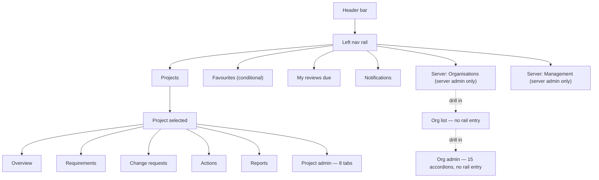

# UX Audit — August 2026

A full review of the frontend's navigation, settings, and creation workflows, run across four passes in August 2026. It produced [docs/ux-style-guide.md](ux-style-guide.md) (the normative rules going forward) and this document (the findings that motivated each rule, plus the implementation roadmap). Three bugs found along the way were fixed immediately rather than left for the roadmap, since fixing a found bug as part of the same piece of work — rather than deferring it — is this project's own working convention; they're recorded under [Already fixed](#already-fixed) below and in [docs/decisions.md](decisions.md).

This document is a point-in-time report — as roadmap items ship, update their Status column here rather than treating this as a permanent record. The style guide it produced is the part meant to stay current indefinitely.

## At a glance

Severity reflects user-facing confusion or risk, not implementation effort — the [roadmap](#roadmap) sorts by effort separately. The first two rows are the most significant findings in the whole review, surfaced on the fourth and final pass; everything else was already visible by the third.

| Severity | Finding |
|---|---|
| High | **Custom terminology covers about 10% of the surface it claims to.** A project can rename six core nouns (requirement, change request, project, stage, component, category) — only two are ever actually consumed anywhere (5 call sites, 3 files: nav labels and two page headings), and the other four are stored config with zero effect on any rendered page. Even the two "working" terms only cover their own list page and nav entry; the requirement detail page, every comment, every review-due list, the CSV import wizard, and Project Admin's own custom-fields dropdown all hardcode the English word regardless of configuration. See [Terminology coverage](#terminology-coverage). |
| High | **Two lists have no pagination at any layer**, one of them a whole deployment's user directory — a project's full change-history timeline and the server-admin access-review table both fetch with no `limit`/`offset` on the frontend or backend, in tension with the app's own U-P-06 recommendation for lazy-loading large data sets. See [Scale](#scale-two-unbounded-lists). |
| Fixed | The mobile nav-rail collapse toggle rendered below 860px with no visible effect — see [Already fixed](#already-fixed). |
| High | **Org Admin is one flat wall of 15 accordions**, all the same visual weight, all collapsed by default. See [The Org Admin wall](#the-org-admin-wall). |
| High | **Reverting to the platform default is a coin flip.** Accent colour has a working revert; header/footer text reverts only if you know to blank the field; logo and login background can't be reverted at all, in the UI or the API. See [Platform defaults & overrides](#platform-defaults--overrides). |
| Medium | Three hand-rolled tab bars, no shared component, no ARIA tab semantics. See [Pattern inconsistency](#pattern-inconsistency). |
| Medium | Every one of the app's 14+ "new X" flows is an inline form — none use a modal, drawer, or popover. See [How things get created](#how-things-get-created). |
| Medium | Filters and list layouts are reinvented on nearly every page; the three "aggregate" pages (Notifications, Favourites, My Reviews Due) present the same kind of data three different ways. See [Pattern inconsistency](#pattern-inconsistency). |
| Info | Bulk requirement creation already exists (a CSV import wizard) — the gap is discoverability, not capability. See [How things get created](#how-things-get-created). |
| Info | The newest feature in the app (requirement-links/"traceability," merged the same day as this review) already reproduces the always-inline, no-confirmation pattern — the debt is still accruing. |
| Fixed | Org-branded login's 2FA step was a genuine dead end, not just an inconsistency — see [Already fixed](#already-fixed). |
| Fixed | Card/tile views overflowed the viewport on phones narrower than ~431px — see [Already fixed](#already-fixed). |
| Medium | **There's no nav-rail entry point to org administration.** `/orgs` — the only path to an org's settings — isn't linked from the persistent chrome for anyone but a server admin. Content browsing itself is fine as-is: projects deliberately pool across every org a user belongs to, which is the right call, not a gap. See [Navigation & the orphan page](#navigation--the-orphan-page). |
| Medium | At least 20 icon-only buttons have no accessible name, none of the three tab bars support arrow-key navigation, and the shared Modal has no focus trap or focus restoration. See [Accessibility](#accessibility). |
| Medium | Project Admin's own 8 tabs — the page held up earlier in this review as the "consistent" contrast to Org Admin — turn out to contain four different delete/reassign behaviours in one file. See [Project Admin's own tabs](#project-admins-own-tabs). |
| Medium | Inviting an external user to a project is a real, working feature with no visible entry point anywhere, reachable only via a component with no keyboard navigation. See [How things get created](#how-things-get-created). |
| Info | Two previously-undiscovered features (per-entity subscribe/unsubscribe, a comment "like" reaction) both already follow every convention correctly — nothing to fix. There's no app-wide search anywhere, only local per-page filters; not a defect, just worth naming. |

## Navigation & the orphan page

This diagram shows every route reachable from the left nav rail. Solid arrows are ordinary nav links; dotted arrows mark routes that exist and work but have no rail entry at all, reachable only by drilling through another page first. Read top to bottom: header, then rail sections, then what each leads to. The two dotted paths at the bottom are the finding — org administration, arguably the single most consequential settings surface in the app, isn't in the nav at all. An org admin who isn't also a server admin has no direct path to their own org's settings from the rail; they land there once, usually via a link elsewhere, and have to remember how they got there. This also sits in tension with the product's own responsiveness requirement (`docs/requirements.md` U-P-02): a settings surface with no rail entry doesn't inherit the rail's mobile handling either.

**A narrower, related gap sits behind that same missing entry: there's no way to reach `/orgs` — the only path to org administration — without already knowing the URL.** It isn't linked from the header or nav rail for anyone but a server admin drilling in through `/server/organisations`; an ordinary org admin who wants their org's settings has no path there beyond a bookmark or a stale link they clicked once.

This was originally written up in an earlier draft of this document as a missing "org switcher," modelled on Azure/Entra's tenant switcher — that framing was wrong, and worth correcting rather than leaving in place. Content browsing (`ProjectListPage` and everything scoped under a project) deliberately pools across every org a user belongs to, with an org column/filter surfaced only when there's more than one org to disambiguate — that's a legitimate, different design choice from Entra's "the whole portal is scoped to one tenant" model, not a defect. An always-visible header switcher would suggest exclusive org-scoping the app doesn't actually have, and would need a new `CurrentOrgContext` threaded through the whole app for a problem that doesn't exist. The real, much smaller gap is just the missing nav-rail link to `/orgs` for reaching org *administration* specifically — see [Pattern: wayfinding](ux-style-guide.md#pattern-wayfinding--a-nav-rail-entry-to-org-administration) for the corrected, narrower fix.

## The Org Admin wall

Fifteen top-level sections, every one a `CollapsibleSection` accordion, all collapsed on load, all the same visual weight, in this order: Import/merge org bundle, Users, Projects, Project statuses, Link types, Branding, Report defaults, Report templates, SSO/OIDC, SCIM provisioning, Default template project, Groups, Shared resources, Advanced, Personal access tokens.

Nothing here is wrong in isolation — `CollapsibleSection` is a reasonable, accessible component. The problem is scale and flatness: a once-a-quarter task (SCIM provisioning) and a daily task (adding a user) are typographically identical, and finding either means scanning past the other thirteen first. Compare `ProjectAdminPage`, the equivalent settings surface one level down — it solves the same "many settings, one page" problem with tabs instead, itself the inconsistency in [Pattern inconsistency](#pattern-inconsistency).

Two of the fifteen deserve a closer look, because relocating them wholesale (see [Org Admin, redrawn](ux-style-guide.md#pattern-settings-hierarchy)) isn't enough on its own — they're internally cluttered too:

- **Advanced** — seven unrelated settings domains sharing one accordion and one Save button: SMTP host/port/credentials/TLS, a send-test-email control, PAT max-lifetime, "require 2FA," "allow self-signup" (plus its own auto-accept-domain and external-user-policy sub-settings), and SSO group→role mappings. Only two of the seven have a visible sub-heading ("Test Email," "SSO Mappings") — the rest run together with no separator.
- **Groups** — per-group, two unrelated controls sit back to back with no divider: nested sub-group management and IdP-synced-group-name mapping for SSO/SCIM. Someone scanning for "how do I nest a group" can easily miss where that ends and the IdP mapping field begins.

Both are one more reason a flat accordion doesn't scale here: even a well-labelled section can itself become a wall once enough settings accumulate inside it.

## Project Admin's own tabs

`ProjectAdminPage` is the page the style guide's 5-tab ceiling (see [Principle 1](ux-style-guide.md#principles)) is aimed at — 8 tabs, one more than the Org Admin redesign settled on for a single flat level. It's held up elsewhere in this document as the "at least internally consistent" contrast to Org Admin's wall. On inspection it isn't, quite:

| Issue | Detail |
|---|---|
| Four delete/reassign behaviours, one file | Custom fields delete outright with no reassignment offered and no in-use check. Stages and categories open a reassignment picker unconditionally, before ever attempting a plain delete. Components block deletion outright while any category still references them. Action types are the one tab using the newer plain-delete-then-409-then-reassign contract shared with Org Admin's Project Statuses and Link Types (`docs/decisions.md`). Four shapes for what should be one CRUD pattern, in a single 1,149-line file. |
| A tab whose own heading disagrees with its label | The tab bar calls it "Categories." Its content opens with an `<h2>` reading "Components" — it's actually a two-level component→category tree with no sub-heading distinguishing the two levels beyond a paragraph of left-indent. |
| One hardcoded label | Every other tab's text is pulled from the shared strings table; "Report Setup" is a literal string typed directly into the component — the one tab that would silently stay in English if the app were ever localised. |
| Never reaches for the pattern its own sibling page uses three times | `ProjectAdminPage` never imports `CollapsibleSection` — not even for the two tabs (Categories' two-level tree, Report Setup's four unrelated settings groups) that are exactly the kind of "optional block within a view" it exists for. |
| A "New X" flow with no create form | The Groups tab manages group *membership* only — there's no way to create a new project group from this tab at all, the one create-adjacent surface that breaks the otherwise-universal "every X has an inline create form" pattern. |

None of this makes the 8-tab structure itself wrong — even the page held up as the "good" contrast to Org Admin's flat wall has quietly accumulated its own internal inconsistency, exactly the failure mode Principle 4 (one component per pattern) is written to prevent. A shared "definition-table CRUD" component — list, rename, reorder, delete-with-reassign — would fix the four-behaviours problem in this file alone.

## How things get created

Not a sample — every "new X" flow found across the app, and where it lives today:

| Entity | Current pattern | Location |
|---|---|---|
| New requirement | Inline form, toggle-to-reveal | Requirements page, above the list |
| Bulk requirements (CSV) | Inline wizard, **always on screen** — not even toggled | Requirements page, permanently above the list and the single-add form |
| New change request | Inline form, toggle-to-reveal — a kind selector plus a per-field checkbox-to-reveal editor for each changeable requirement field | Change Requests page, above the list |
| New requirement link ("traceability") | Inline form, always visible | Requirement detail page — the newest feature in the app, already following this pattern |
| New requirement action (create-and-link) | Inline form, toggle-to-reveal — the one place already using progressive disclosure well | Requirement detail page, Actions card |
| New project action | Inline form, toggle-to-reveal | Project Actions page, above the list |
| New project | Inline form, toggle-to-reveal — shares one form with bundle import | Project List page |
| Project bundle import | One more field in the new-project form, not a separate flow | Same form; picking a file silently hides the template picker with no explanation |
| New organisation | Inline form, toggle-to-reveal — same file-vs-template branching as new project | Server Organisations page |
| New org group | Inline form | Bottom of the Groups accordion, Org Admin |
| New org user | Inline form | Bottom of the Users accordion, Org Admin |
| New custom field | Inline form | Bottom of the Custom Fields tab, Project Admin |
| New report template | Accordion-in-accordion | Nested `CollapsibleSection` inside Report Templates, Org Admin |
| New personal access token | Nested accordion (`variant="plain"`) | Preferences page, PATs tab — the same idiom reused for change-password and 2FA enrollment too, three times on one page |
| Vote comments (read-only) | Modal | Change Request detail page — the app's only modal usage, and not a create flow |

Zero of the fourteen actual create-entity flows use a modal, drawer, or popover — those components either don't exist (drawer) or exist but are used for something else entirely (modal). Every create action pushes the surrounding list down. The one partial exception, "create and link" on the Requirement Actions card, already shows the app doesn't need new infrastructure to do this well — it just needs the pattern applied everywhere.

**A fifteenth create flow with no visible trigger at all:** inviting an external, non-org-member user to a project is real and working — Project Admin's Groups tab reuses its ordinary "add a member" autocomplete, and typing an email with no matching account silently turns it into an invite. There's no "Invite" button anywhere, and no visual cue that the field does anything beyond adding an existing member. The autocomplete component that hosts it has no keyboard navigation at all — no arrow keys, no Enter-to-select — so the only entry point to inviting an external collaborator is mouse-only and undiscoverable unless someone already knows the trick.

## Platform defaults & overrides

ReqTrack has a real two-tier settings model — a platform-wide default, optionally overridden per organisation — for branding, footer identity, and the "organisation" label itself. The model is sound; the UI's treatment of it isn't consistent:

| Setting | Override control | Revert path | Verdict |
|---|---|---|---|
| Accent colour | "Use own accent colour" checkbox | Uncheck, save — reverts cleanly | Works |
| Header title / footer identity text | Plain text input, no checkbox | Clear the field to empty, save — works, but nothing tells you that | Undiscoverable |
| Org logo | Upload only | None — no remove control, no `DELETE` endpoint exists | No revert |
| Login background image | Upload only | None — same gap as logo | No revert |

The platform-wide defaults themselves live on a fourth, entirely different page (`/server/management`, tabbed), so an admin comparing "what's the platform default" against "what's my org set to" is reading two pages built with two different navigation patterns to answer one question.

## Confirmation & feedback

Two separate questions, both answered inconsistently: before a destructive action, does anything ask "are you sure"? After any action, does anything say "done"?

**Before: four patterns for one question.** No shared confirm-dialog component exists anywhere in the codebase:

| Pattern | Where | Roughly how often |
|---|---|---|
| Native `window.confirm` | Deactivate/ban/promote a user, revoke PATs, disable an org, archive an action | 12 call sites, 5 files — mostly account/access and PAT actions |
| Inline "confirm this row" reveal | Delete a project component, stage, category, or action type — Project Admin | 4 call sites, 1 file |
| Type-the-exact-name-to-confirm | Delete an organisation — the single most destructive action in the app | 1 call site — and arguably the right tier of friction for what it guards |
| Nothing — fires immediately | Archive a requirement, remove a link, unlink an action, delete a report template, revoke a SCIM token, delete a resource file, remove an SSO mapping, leave an org, reject a change request, remove a file attachment | At least 15 call sites — the single most common answer is no confirmation at all |

The clearest single example: archiving a requirement and archiving an action are the same operation, on structurally near-identical detail pages — one confirms with `window.confirm`, its sibling does not. Rejecting a change request has no confirmation of any kind despite finalizing a decision that can't be un-rejected from that screen — arguably higher-stakes than most of the deletes that do get a native confirm.

**After: silence, mostly.** There's no toast/snackbar component. Success feedback exists in exactly one place — the CSV import's "N created, M error(s)" summary card. Every other create/save/delete/vote/archive/link/comment simply re-renders the list and trusts the user to notice. Error handling fares a little better but is still ad hoc: each page tracks its own error-state variable and renders its own inline red text, and several mutating calls (reordering a requirement list, casting a vote, toggling a task, archiving an action) have no try/catch at all, so a failed request fails with zero visible feedback.

## Terminology coverage

Every project can rename six core nouns via Project Admin's Terminology tab. Checking where those overrides actually apply turned into the most consequential finding in this review — this isn't a visual inconsistency, it's a product feature that mostly doesn't do what its own settings screen promises.

| Configurable term | Actually consumed anywhere? |
|---|---|
| Requirement | Partially — nav label, page heading, "New X" button on 2 pages. Everywhere else on the requirement's own detail page: no. |
| Change request | Partially — same shape as Requirement. |
| Project | Never — zero call sites. |
| Stage | Never — zero call sites. |
| Component | Never — zero call sites. |
| Category | Never — zero call sites. |

Even the two "partially" terms only cover their own list page and nav entry — the requirement detail page, its comment thread, its subscribe button, every review-due list, and the CSV import wizard's own column hints all hardcode the English noun regardless of what's configured. The sharpest example: **Project Admin's Custom Fields tab has an entity-kind dropdown that literally reads "Requirement" / "Change request"** — sitting on the same page, one tab over from the Terminology settings that are supposed to rename those exact words. A project that renamed "requirement" to "user story" would see that rename hold for about two sentences before the old word reappears everywhere that actually matters.

## Scale: two unbounded lists

`docs/requirements.md`'s U-P-06 recommends "lazy loading of large data sets." Project List already does this correctly — `limit`/`offset` on both ends, `LoadMoreButton` wired up. Checking every other list page against the same bar found two genuine violations and several that are fine by nature, not by design:

| List | Bounded? | Realistic risk |
|---|---|---|
| Project change-history timeline | No limit anywhere — frontend or backend | A project's entire audit trail, for its entire life. Highest risk here — this list only grows. |
| Server access-review user directory | No limit anywhere | Every user account in every org on the deployment, in one request. Hundreds to thousands of rows for a real multi-tenant install. |
| Project actions list | No limit anywhere | A long-lived project's full action history — real but slower-growing risk than the two above. |
| Org user list, server org directory, favourites/template project fetches | No limit | Moderate — genuinely large only for a big org or a mature multi-tenant deployment. |
| PAT list, reviews-due lists, one item's own history/comments/links | No limit | Low — self-limiting by nature (one user's tokens, currently-overdue items, one record's own activity). |

Project List proves the pattern already exists in this codebase and works — the fix for the top two rows is applying it, not inventing it.

## Pattern inconsistency

Counting every instance of each "container" pattern makes the inconsistency concrete — and it isn't limited to accordions vs. tabs:

| Pattern | Implementation | Where used | Instances |
|---|---|---|---|
| Accordion | `CollapsibleSection.tsx` (shared, accessible) | Org Admin (15), Preferences (3 nested), Reports (6) | ~24+ |
| Tabs | Hand-rolled per page, no shared component, no ARIA | Project Admin (8), Server Management (4), Preferences (5) | 3 separate implementations |
| Modal | `Modal.tsx` (shared, accessible) | Change Request vote-comment viewer | 1, non-destructive, read-only |
| Drawer / side panel | — | Does not exist | 0 |
| Popover / rich hover panel | `Tooltip.tsx` — label-only, not rich content | Nav rail, rich text editor, notification bell | Dozens, all plain-text |

Preferences is the clearest single-page demonstration: tabs at the top level, with the same nested-accordion idiom reused three separate times inside two different tabs (change-password, two-factor enrollment, new-PAT creation) — one page independently re-deriving "many settings, one page" twice, at two different depths, with no documented rule to converge on.

**Filters, four more ways.** `FilterPanel` is used on exactly 3 pages (Requirements, Change Requests, Actions). At least 4 more with comparable needs rolled their own: a five-control inline row on Project List; a bare pair of selects on Project Reviews Due — whose own code comment calls it "a filter panel" despite not using the component; search-plus-status-buttons on Server Organisations; search-plus-checkbox on Notifications. Project History adds a fifth idiom, a horizontal date-range bar.

**One kind of page, three shapes.** Notifications, Favourites, and My Reviews Due are all "your stuff, across every project" list pages, and each presents that list differently — a clickable-card list with pagination, a card grid with none, and a plain table with neither filters nor pagination. My Reviews Due's own project-scoped sibling page adds component/reviewer filters the cross-project version lacks entirely, despite covering the same data.

**Copy, in two grammars at once.** Opening a create form is (almost) always labelled "New X" — except every "definition table" row (a stage, custom field, action type, project status, link type, org group, org user) skips the open step entirely and merges "open" and "submit" into one "New X" button, while requirement/CR/action/project/org creation keeps them as two separate steps, a toggle labelled "New X" followed by a form that submits with the word "Create." The one outlier from "New X" altogether is requirement-link creation, labelled "Add link" — and the report-template edit button oscillates between "New report template" and "Save" depending on state without ever swapping its icon to match.

**Icons: disciplined, with two exceptions.** `Plus`/`Pencil`/`ArrowUp`-`Down`/`Trash2` are each used consistently for add/edit/reorder/delete almost everywhere — genuinely one of the more consistent parts of the app. Two collisions stand out: permanently deleting an uploaded file is `Trash2` in `FileAttachmentList` but `X` in `CommentThread` — the same server-side delete, two icons depending only on which component renders the control — and the one report-template Edit button in the app has no icon at all, where every other rename/edit affordance pairs the action with `Pencil`.

**Badges are the exception that proves the rule.** Worth naming as a positive: every status/type/role chip reuses one shared `.badge` CSS class, applied directly rather than reimplemented per page — the one small reusable visual pattern that never fractured into competing versions, without ever needing a shared component to stay that way. Minor nits only: two call sites use a `
` where every other badge is a ``, one badge carries a one-off inline colour override, and "archived" is independently re-implemented as its own conditional badge in three unrelated files.

**Two smaller one-offs, found auditing the shared text components directly.** `RichTextEditor`'s link-insert control is the one place in the app using the browser's native `window.prompt()` instead of the app's own `Modal`. Separately, comments are the one long-form text field that's plain-text-only — every other prose field (report intros, chapters) goes through the same rich-text component comments never do, worth a deliberate call on whether that's intentional (keeping discussion lightweight) rather than an oversight.

## Accessibility

Not audited at all before this review. The results are concentrated rather than systemic — one component checks out clean, the gaps cluster in the newest and most feature-dense surfaces:

| Area | Finding |
|---|---|
| Icon-only buttons | At least 20 confirmed with no `aria-label` and no `title` fallback — a screen reader announces only "button." Heavily concentrated in `OrgAdminPage.tsx` and `ProjectAdminPage.tsx`, the app's two densest pages. The correct pattern (`title` + `aria-label` together) already exists elsewhere — `RequirementsPage.tsx`'s reorder buttons, for one — so this is inconsistency, not a missing capability. |
| Tab bars | All three hand-rolled tab bars are individually Tab/Enter-operable (native `<button>`s) but none support Left/Right arrow-key navigation between tabs — the behaviour `role="tablist"`/`role="tab"` semantics would both signal and require. |
| `Modal.tsx` | Correct `role="dialog"`/`aria-modal`/`aria-label`, closes on Escape, backdrop click works. No focus trap — Tab can walk a keyboard user out of an open modal into the page behind it — and no focus restoration on close. |
| `CollapsibleSection.tsx` | Checks out — correct `role="button"`, `tabIndex`, `aria-expanded`, Enter and Space both handled with `preventDefault`. One narrow edge case: a non-string `title` prop gets no `aria-label` fallback, though no current caller triggers it. |

## Already fixed

Three bugs were found and fixed as part of this audit rather than left on the roadmap — all logged in `docs/decisions.md`.

- **Mobile nav-rail collapse toggle.** Below 860px, a CSS rule force-collapsed the rail to icon-only width regardless of the toggle's own state, so both "collapsed" and "expanded" looked identical on a phone. Fixed by hiding the toggle at that breakpoint. Verified: `tests/playwright/tests/e2e-workflows/mobile-nav-rail.spec.ts`.
- **Org-branded login's 2FA dead end.** `OrgLoginPage.tsx`'s own code comment claimed a 2FA challenge "falls through to the plain /login flow" — it didn't; a 2FA-enrolled user submitting correct credentials on a branded page hit a silent dead end. Fixed by actually implementing that fallback via router state. Verified: `tests/playwright/tests/e2e-workflows/org-login-2fa-handoff.spec.ts`.
- **Mobile card-grid overflow.** Requirements, Change Requests, Project List, and Favourites all sized their tile/card views with a fixed 280px column minimum, producing a real horizontal scrollbar below ~431px viewport width. Fixed by clamping the minimum to the available width. Verified: `tests/playwright/tests/e2e-workflows/mobile-card-grid-overflow.spec.ts`.

A true off-canvas mobile drawer for the nav rail — so it can fully hide on a phone rather than staying pinned at icon width — is a larger change than the toggle-visibility fix above and stays on the roadmap.

## Roadmap

Sorted by effort, not severity — a fast win and a structural fix can both matter. "Effort" is relative implementation size, not calendar time. Update the Status column as items ship.

| Item | Effort | Status | Notes |
|---|---|---|---|
| Hide the inert mobile nav toggle | S | Done | See [Already fixed](#already-fixed). |
| Fix the org-branded login's 2FA dead end | S | Done | See [Already fixed](#already-fixed). |
| Fix mobile card-grid overflow | S | Done | See [Already fixed](#already-fixed). |
| Fix `ReportsPage`'s missing loading guard | S | Done | The one page audited in depth with no `Spinner` guard — dropdowns and rich-text fields visibly flash from empty to populated. |
| Make requirement archive confirm, matching action archive | S | Done | Added the `window.confirm` `ActionDetailPage` already has, as a stopgap ahead of the shared Modal-based confirm below. |
| Add `aria-label` to the ~20 unlabelled icon buttons | S | Done | Applied the pattern already established elsewhere (`RequirementsPage.tsx`'s reorder buttons) to `OrgAdminPage.tsx`/`ProjectAdminPage.tsx`/`RequirementDetailPage.tsx`/`CommentThread.tsx`/`ReportChapterListEditor.tsx`/`FileAttachmentList.tsx`. |
| Swap `RichTextEditor`'s `window.prompt()` for the app's own `Modal` | S | Done | New Storybook + Playwright coverage of the link-insert dialog. |
| Reset affordance for text-based branding overrides | S | Done | New shared `OverridePill` component (`Platform default`/`Custom` + reset), applied to header title and the three email-footer fields. |
| Logo & login-background reset | M | Not started | Needs a new `DELETE` endpoint alongside the existing upload route — touches org branding, route it through the identify → verify → remediate review per `docs/soc2/policies/change-management-and-secure-development-policy.md`. |
| Shared, accessible `Tabs` component with arrow-key navigation | M | Done | All 3 hand-rolled bars migrated (`ProjectAdminPage`/`ServerManagementPage`/`PreferencesPage`); also fixed 20 Playwright specs' locators broken by the resulting `role="tab"` change. |
| `Modal`: add a focus trap and focus restoration on close | S | Done | Contained to `Modal.tsx` alone — every existing caller benefits with no changes of its own. |
| Shared `SidePanel` and `Popover` (content) components | M | Done | Both built on a shared `dialogA11y.ts` focus-trap/restore hook extracted from `Modal`. First real usage: Org Admin's "New group" now opens a `Popover` instead of a permanently-visible inline form. |
| Shared Modal-based confirm + type-to-confirm variant | M | Partial | `ConfirmDialog` built (one component, both tiers driven by whether `requireTypedText` is passed) and piloted on 3 real call sites: requirement archive and action archive (Tier 1, replacing `window.confirm`), organisation delete (Tier 2, replacing the ad hoc inline typed-confirm card). Remaining ~12 call sites (org disable, Project/Org Admin's various deletes) are follow-up work, not swept mechanically — same reasoning as `Toast`'s pilot. |
| Shared Toast component, wired into every mutation | M | Partial | Component built (`ToastContext`/`useToast`) and piloted on 3 real mutations (requirement archive, action archive, org branding save). Broader application across the rest of the app's create/save/delete/vote actions is still open — this was deliberately not swept mechanically across every file in one pass, since which mutations get which message text is a judgment call, not a mechanical one. |
| Shared "definition-table CRUD" component | M | Not started | Fixes Project Admin's four-different-delete-behaviours problem and the parallel duplication across Org Admin's Project Statuses/Link Types tabs in one shared implementation. |
| Paginate project change-history and the server access-review user directory | M | Not started | Both currently unbounded frontend and backend — same `limit`/`offset` shape `ProjectListPage` already uses correctly. |
| Unify "New X" copy: one open-verb, one submit-verb, applied everywhere | S | Not started | Decide once whether create is one step or two, then make every create flow follow it. |
| Consolidate filter UI onto `FilterPanel` everywhere needed | M | Not started | Project List, Project Reviews Due, Server Organisations, Notifications — 4 pages, one component. |
| One entry point for single vs. bulk requirement creation | M | Done | "New requirement" opens a `Popover` offering "Add one"/"Import from CSV" instead of the inline form and the CSV wizard's own always-visible "Import CSV" button competing as two blocks. UI consolidation only, as scoped — `CsvImportWizard`'s own mapping/preview logic and endpoint are unchanged. Retitled from "...requirement/change-request creation": Change Requests has no bulk/CSV counterpart to consolidate against, so there was nothing to do there under this item — its own inline-form-to-`SidePanel` conversion is a separate, not-yet-ticketed future step. |
| A visible "Invite" entry point + keyboard navigation for `UserAutocomplete` | M | Not started | The external-invite flow works today but is discoverable only by already knowing the trick, and its one component has zero keyboard support — both fixable without touching backend invite logic. |
| Unify the three "aggregate" list pages (Notifications, Favourites, My Reviews Due) | M | Not started | One shared list shape with filtering and pagination. |
| Extend terminology overrides to actually cover their own surface | L | Not started | Highest-value item relative to its severity — 4 of 6 configurable terms are consumed nowhere today. Likely needs the static `strings.ts` table itself to become terminology-aware, not just more call sites bolted on individually. |
| Nav-rail entry point to `/orgs` (org administration) | S | Done | Corrected from an earlier draft's "org switcher" proposal, which was the wrong pattern — see [Navigation & the orphan page](#navigation--the-orphan-page). A plain "My organisations" link, terminology-aware; no new state, no new component. |
| Org Admin → resource-menu restructure, incl. splitting Advanced | L | Not started | New routes per group, per the redesign in the style guide; content migrates, nothing is deleted. |
| Revisit Project Admin's 8-tab bar against the 5-tab ceiling | L | Not started | Flagged by the style guide's own rule, not by direct complaint — worth a follow-up once the shared components above (especially the definition-table CRUD component) exist to build it with. |
