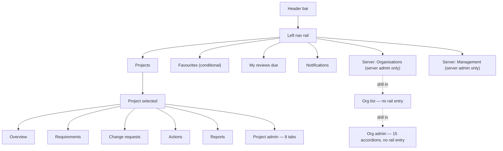
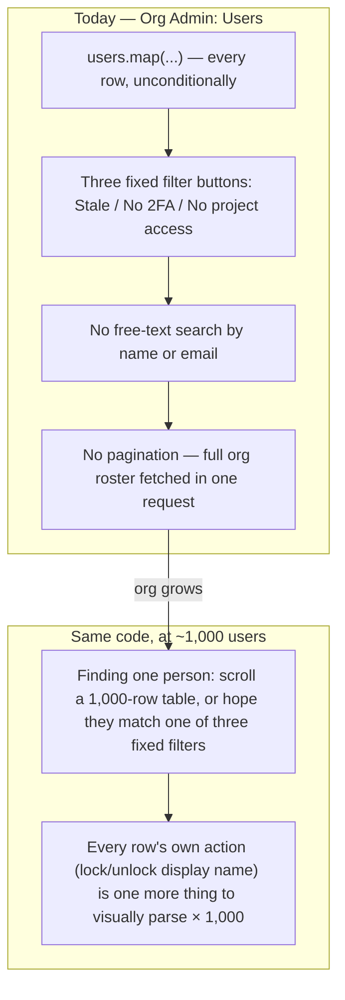

# UX Audit — August 2026

A full review of the frontend's navigation, settings, and creation workflows, run across six passes in August 2026. It produced [docs/ux-style-guide.md](ux-style-guide.md) (the normative rules going forward) and this document (the findings that motivated each rule, plus the implementation roadmap). Several bugs found along the way were fixed immediately rather than left for the roadmap, since fixing a found bug as part of the same piece of work — rather than deferring it — is this project's own working convention; they're recorded under [Already fixed](#already-fixed) below and in [docs/decisions.md](decisions.md).

This document is a point-in-time report — as roadmap items ship, update their Status column here rather than treating this as a permanent record. The style guide it produced is the part meant to stay current indefinitely.

**Fifth pass (2026-08-19), run from the perspective of a UX design team lead doing a fresh top-to-bottom review rather than chasing a specific bug report:** re-examined every page against the style guide the first four passes produced, rather than against the pre-audit UI — the question shifted from "does this follow *some* consistent pattern" to "does this follow *the* pattern the style guide already names." Found: `FilterBadge` (the click-a-badge-to-filter component the fourth pass's roadmap quietly introduced) was never written up as a rule of its own, so two more pages with an identical badge/filter-panel pair still used a plain, inert `.badge`; the CSV wizard's "Export CSV" and "Download template" buttons were still exactly the "two blocks competing for the same job" shape Principle 5 was written against, just for downloads instead of creates; `SidePanel` (built in the fourth pass) had never actually been wired to a real create flow, so Requirements' own single-item create form was still the pre-audit inline block in a new coat of paint — including a genuine bug: the deep link from Project Overview's own "+ New Requirement" landed on that same never-converted inline block, which read as "went to a different, older form" even though the code path was identical; and Org Admin's Users/Groups sections and Project Admin's Groups tab — a flat table and flat accordion-of-accordions respectively, both rendering every row unconditionally — have no search, no pagination, and no way to view what a single user or group actually has access to, the same "unbounded list" failure mode the fourth pass fixed for Project History and the access-review directory, just not checked here yet. See the new findings below and their [Already fixed](#already-fixed)/[Roadmap](#roadmap) entries.

**Sixth pass (2026-08-19), audit-only — findings recorded here for a later session to implement, nothing in this pass was fixed in code.** Where the fifth pass re-checked the UI against rules the style guide already names, this pass went looking for two different kinds of gap: roadmap items marked "Partial" whose actual remaining scope had never been enumerated precisely (`ConfirmDialog`/`Toast` rollout — see [Confirmation and feedback rollout, precisely](#confirmation-and-feedback-rollout-precisely)), and workflow-level gaps no single-page pattern check would surface — the requirement Links/Actions cards' create-and-confirm debt predicted-but-not-yet-fixed back in the fourth pass, still true two passes later ([Links and linked actions](#links-and-linked-actions-the-predicted-debt-is-still-there)); a named-but-unfixed icon inconsistency sitting in the style guide's own Tokens section ([A style-guide-documented inconsistency, still there](#a-style-guide-documented-inconsistency-still-there)); and three workflow-shaped gaps with no precedent anywhere in the app to copy — no bulk operations, no column sorting, and requirements/actions that can be archived but never restored, unlike projects, which can ([Bulk operations](#bulk-operations-none-exist), [Table sorting](#table-sorting-manual-reorder-only), [Archive is one-way for requirements and actions, not projects](#archive-is-one-way-for-requirements-and-actions-not-projects)).

## At a glance

Severity reflects user-facing confusion or risk, not implementation effort — the [roadmap](#roadmap) sorts by effort separately. The first two rows are the most significant findings in the whole review, surfaced on the fourth and final pass; everything else was already visible by the third.

| Severity | Finding |
|---|---|
| High | **Custom terminology covers about 10% of the surface it claims to.** A project can rename six core nouns (requirement, change request, project, stage, component, category) — only two are ever actually consumed anywhere (5 call sites, 3 files: nav labels and two page headings), and the other four are stored config with zero effect on any rendered page. Even the two "working" terms only cover their own list page and nav entry; the requirement detail page, every comment, every review-due list, the CSV import wizard, and Project Admin's own custom-fields dropdown all hardcode the English word regardless of configuration. See [Terminology coverage](#terminology-coverage). |
| High | **Two lists have no pagination at any layer**, one of them a whole deployment's user directory — a project's full change-history timeline and the server-admin access-review table both fetch with no `limit`/`offset` on the frontend or backend, in tension with the app's own U-P-06 recommendation for lazy-loading large data sets. See [Scale](#scale-two-unbounded-lists). |
| Fixed | The mobile nav-rail collapse toggle rendered below 860px with no visible effect — see [Already fixed](#already-fixed). |
| High | **Org Admin is one flat wall of 15 accordions**, all the same visual weight, all collapsed by default. See [The Org Admin wall](#the-org-admin-wall). |
| High | **Reverting to the platform default is a coin flip.** Accent colour has a working revert; header/footer text reverts only if you know to blank the field; logo and login background can't be reverted at all, in the UI or the API. See [Platform defaults & overrides](#platform-defaults--overrides). |
| Medium | Three hand-rolled tab bars, no shared component, no ARIA tab semantics. See [Pattern inconsistency](#pattern-inconsistency). |
| Medium | Every one of the app's 14+ "new X" flows is an inline form — none use a modal, drawer, or popover. See [How things get created](#how-things-get-created). |
| Medium | Filters and list layouts are reinvented on nearly every page; the three "aggregate" pages (Notifications, Favourites, My Reviews Due) present the same kind of data three different ways. See [Pattern inconsistency](#pattern-inconsistency). |
| Info | Bulk requirement creation already exists (a CSV import wizard) — the gap is discoverability, not capability. See [How things get created](#how-things-get-created). |
| Info | The newest feature in the app (requirement-links/"traceability," merged the same day as this review) already reproduces the always-inline, no-confirmation pattern — the debt is still accruing. |
| Fixed | Org-branded login's 2FA step was a genuine dead end, not just an inconsistency — see [Already fixed](#already-fixed). |
| Fixed | Card/tile views overflowed the viewport on phones narrower than ~431px — see [Already fixed](#already-fixed). |
| Medium | **There's no nav-rail entry point to org administration.** `/orgs` — the only path to an org's settings — isn't linked from the persistent chrome for anyone but a server admin. Content browsing itself is fine as-is: projects deliberately pool across every org a user belongs to, which is the right call, not a gap. See [Navigation & the orphan page](#navigation--the-orphan-page). |
| Medium | At least 20 icon-only buttons have no accessible name, none of the three tab bars support arrow-key navigation, and the shared Modal has no focus trap or focus restoration. See [Accessibility](#accessibility). |
| Medium | Project Admin's own 8 tabs — the page held up earlier in this review as the "consistent" contrast to Org Admin — turn out to contain four different delete/reassign behaviours in one file. See [Project Admin's own tabs](#project-admins-own-tabs). |
| Medium | Inviting an external user to a project is a real, working feature with no visible entry point anywhere, reachable only via a component with no keyboard navigation. See [How things get created](#how-things-get-created). |
| Info | Two previously-undiscovered features (per-entity subscribe/unsubscribe, a comment "like" reaction) both already follow every convention correctly — nothing to fix. There's no app-wide search anywhere, only local per-page filters; not a defect, just worth naming. |
| High | **Org Admin's Users/Groups sections and Project Admin's Groups tab have no search and no pagination**, rendering every row (and, for groups, every member of every row) unconditionally — the same unbounded-list failure the fourth pass fixed for Project History and the access-review directory, undiscovered here until this pass checked directory-style admin lists specifically rather than content lists. See [Directories at scale](#directories-at-scale-users-and-groups). |
| Medium | **There's no way to view what a single user actually has access to** — which projects, which groups, which roles — anywhere in the app; an org admin auditing one user's access has to check every project's membership list by hand. See [No way to view a user's access](#no-way-to-view-a-users-access). |
| Fixed | Project Overview's own "+ New Requirement" deep-linked into `RequirementsPage`'s single-create form before it had been converted onto the `SidePanel` component the fourth pass built — since the same form was reached (via a Popover first) from the Requirements page itself, the two entry points were functionally identical but *looked* different, one reflowing the page and one not. Converting the form itself onto `SidePanel` fixed both at once — see [Already fixed](#already-fixed). |
| Fixed | The CSV wizard's "Export CSV" and "Download template" buttons sat side by side, permanently visible and unlabelled as a pair — the same "two blocks competing for the same job" shape Principle 5 was written against for creates, just for downloads. Combined behind one "Export" popover — see [Already fixed](#already-fixed). |
| Medium | **`FilterBadge` (click a badge, it applies as a filter) is real and working, but was never written up as a rule** — so it's inconsistently applied. Four pages use it correctly; Project Actions' outcome badge duplicated its own filter panel's Outcome select without it (now fixed, see [Already fixed](#already-fixed)); several detail/overview pages show a plain `.badge` for a value with no on-page filter to link to, which is correct as-is, not a gap. See [Badges as filter shortcuts](#badges-as-filter-shortcuts-real-but-not-everywhere). |
| High | **Archiving a requirement or an action is a one-way door — the exact same "archive" operation on a project isn't.** `projects.py` has both `/archive` and `/unarchive` endpoints, with a working "Restore" button in Project Admin; `requirements.py` and `actions.py` have only `/archive`, no `/unarchive` counterpart at either layer. Archived items stay visible via an `include_archived`/"archived" filter, so nothing is lost, but nothing in the UI or the API can undo the archive short of a direct database fix. See [Archive is one-way for requirements and actions, not projects](#archive-is-one-way-for-requirements-and-actions-not-projects). |
| Medium | **`ConfirmDialog`/`Toast`, both marked "Partial" on the roadmap since the fourth pass, still cover a minority of the app** — exact remaining scope had never been enumerated. 11 `window.confirm` call sites remain (PAT revoke actions across three separate pages, plus org disable/deactivate/ban/grant-admin); 11 pages perform real mutations with zero `Toast` feedback wired up. See [Confirmation and feedback rollout, precisely](#confirmation-and-feedback-rollout-precisely). |
| Medium | **A requirement's Links and linked-Actions cards are exactly the debt the fourth pass predicted would keep accruing, still unfixed two passes later**: both create flows remain permanently-visible inline rows (never a `Popover`/`SidePanel`), and removing a link or unlinking an action still fires with zero confirmation — the same "fires immediately" bucket the audit's own Confirmation table already named these two actions under. See [Links and linked actions](#links-and-linked-actions-the-predicted-debt-is-still-there). |
| Low | **A style-guide-documented inconsistency that was never actually fixed**: the Tokens section already names `CommentThread.tsx`'s use of `X` instead of `Trash2` for permanently deleting a file as a known exception "worth fixing rather than copying" — it's still `X`. See [A style-guide-documented inconsistency, still there](#a-style-guide-documented-inconsistency-still-there). |
| Medium | **No bulk operations anywhere in the app** — every list (Requirements, Change Requests, Actions, Users, Groups, …) supports only one-row-at-a-time actions; there's no multi-select, no "archive N selected," no bulk role/status change. A CSV import wizard exists for bulk *creation* but nothing plays the equivalent role for bulk *changes* to existing rows. See [Bulk operations: none exist](#bulk-operations-none-exist). |
| Low | **No table supports column-header sorting** — `RequirementsPage`'s list view has a working per-row manual reorder (↑/↓, for priority ordering within a stage) but nothing lets you click "Status" to sort the table by status; same gap on every other data table in the app. See [Table sorting: manual reorder only](#table-sorting-manual-reorder-only). |

## Navigation & the orphan page

This diagram shows every route reachable from the left nav rail. Solid arrows are ordinary nav links; dotted arrows mark routes that exist and work but have no rail entry at all, reachable only by drilling through another page first. Read top to bottom: header, then rail sections, then what each leads to. The two dotted paths at the bottom are the finding — org administration, arguably the single most consequential settings surface in the app, isn't in the nav at all. An org admin who isn't also a server admin has no direct path to their own org's settings from the rail; they land there once, usually via a link elsewhere, and have to remember how they got there. This also sits in tension with the product's own responsiveness requirement (`docs/requirements.md` U-P-02): a settings surface with no rail entry doesn't inherit the rail's mobile handling either.

**A narrower, related gap sits behind that same missing entry: there's no way to reach `/orgs` — the only path to org administration — without already knowing the URL.** It isn't linked from the header or nav rail for anyone but a server admin drilling in through `/server/organisations`; an ordinary org admin who wants their org's settings has no path there beyond a bookmark or a stale link they clicked once.

This was originally written up in an earlier draft of this document as a missing "org switcher," modelled on Azure/Entra's tenant switcher — that framing was wrong, and worth correcting rather than leaving in place. Content browsing (`ProjectListPage` and everything scoped under a project) deliberately pools across every org a user belongs to, with an org column/filter surfaced only when there's more than one org to disambiguate — that's a legitimate, different design choice from Entra's "the whole portal is scoped to one tenant" model, not a defect. An always-visible header switcher would suggest exclusive org-scoping the app doesn't actually have, and would need a new `CurrentOrgContext` threaded through the whole app for a problem that doesn't exist. The real, much smaller gap is just the missing nav-rail link to `/orgs` for reaching org *administration* specifically — see [Pattern: wayfinding](ux-style-guide.md#pattern-wayfinding--a-nav-rail-entry-to-org-administration) for the corrected, narrower fix.

## The Org Admin wall

Fifteen top-level sections, every one a `CollapsibleSection` accordion, all collapsed on load, all the same visual weight, in this order: Import/merge org bundle, Users, Projects, Project statuses, Link types, Branding, Report defaults, Report templates, SSO/OIDC, SCIM provisioning, Default template project, Groups, Shared resources, Advanced, Personal access tokens.

Nothing here is wrong in isolation — `CollapsibleSection` is a reasonable, accessible component. The problem is scale and flatness: a once-a-quarter task (SCIM provisioning) and a daily task (adding a user) are typographically identical, and finding either means scanning past the other thirteen first. Compare `ProjectAdminPage`, the equivalent settings surface one level down — it solves the same "many settings, one page" problem with tabs instead, itself the inconsistency in [Pattern inconsistency](#pattern-inconsistency).

Two of the fifteen deserve a closer look, because relocating them wholesale (see [Org Admin, redrawn](ux-style-guide.md#pattern-settings-hierarchy)) isn't enough on its own — they're internally cluttered too:

- **Advanced** — seven unrelated settings domains sharing one accordion and one Save button: SMTP host/port/credentials/TLS, a send-test-email control, PAT max-lifetime, "require 2FA," "allow self-signup" (plus its own auto-accept-domain and external-user-policy sub-settings), and SSO group→role mappings. Only two of the seven have a visible sub-heading ("Test Email," "SSO Mappings") — the rest run together with no separator.
- **Groups** — per-group, two unrelated controls sit back to back with no divider: nested sub-group management and IdP-synced-group-name mapping for SSO/SCIM. Someone scanning for "how do I nest a group" can easily miss where that ends and the IdP mapping field begins.

Both are one more reason a flat accordion doesn't scale here: even a well-labelled section can itself become a wall once enough settings accumulate inside it.

## Project Admin's own tabs

`ProjectAdminPage` is the page the style guide's 5-tab ceiling (see [Principle 1](ux-style-guide.md#principles)) is aimed at — 8 tabs, one more than the Org Admin redesign settled on for a single flat level. It's held up elsewhere in this document as the "at least internally consistent" contrast to Org Admin's wall. On inspection it isn't, quite:

| Issue | Detail |
|---|---|
| Four delete/reassign behaviours, one file | Custom fields delete outright with no reassignment offered and no in-use check. Stages and categories open a reassignment picker unconditionally, before ever attempting a plain delete. Components block deletion outright while any category still references them. Action types are the one tab using the newer plain-delete-then-409-then-reassign contract shared with Org Admin's Project Statuses and Link Types (`docs/decisions.md`). Four shapes for what should be one CRUD pattern, in a single 1,149-line file. |
| A tab whose own heading disagrees with its label | The tab bar calls it "Categories." Its content opens with an `<h2>` reading "Components" — it's actually a two-level component→category tree with no sub-heading distinguishing the two levels beyond a paragraph of left-indent. |
| One hardcoded label | Every other tab's text is pulled from the shared strings table; "Report Setup" is a literal string typed directly into the component — the one tab that would silently stay in English if the app were ever localised. |
| Never reaches for the pattern its own sibling page uses three times | `ProjectAdminPage` never imports `CollapsibleSection` — not even for the two tabs (Categories' two-level tree, Report Setup's four unrelated settings groups) that are exactly the kind of "optional block within a view" it exists for. |
| A "New X" flow with no create form | The Groups tab manages group *membership* only — there's no way to create a new project group from this tab at all, the one create-adjacent surface that breaks the otherwise-universal "every X has an inline create form" pattern. |

None of this makes the 8-tab structure itself wrong — even the page held up as the "good" contrast to Org Admin's flat wall has quietly accumulated its own internal inconsistency, exactly the failure mode Principle 4 (one component per pattern) is written to prevent. A shared "definition-table CRUD" component — list, rename, reorder, delete-with-reassign — would fix the four-behaviours problem in this file alone.

## How things get created

Not a sample — every "new X" flow found across the app, and where it lives today:

| Entity | Current pattern | Location |
|---|---|---|
| New requirement | Inline form, toggle-to-reveal | Requirements page, above the list |
| Bulk requirements (CSV) | Inline wizard, **always on screen** — not even toggled | Requirements page, permanently above the list and the single-add form |
| New change request | Inline form, toggle-to-reveal — a kind selector plus a per-field checkbox-to-reveal editor for each changeable requirement field | Change Requests page, above the list |
| New requirement link ("traceability") | Inline form, always visible | Requirement detail page — the newest feature in the app, already following this pattern |
| New requirement action (create-and-link) | Inline form, toggle-to-reveal — the one place already using progressive disclosure well | Requirement detail page, Actions card |
| New project action | Inline form, toggle-to-reveal | Project Actions page, above the list |
| New project | Inline form, toggle-to-reveal — shares one form with bundle import | Project List page |
| Project bundle import | One more field in the new-project form, not a separate flow | Same form; picking a file silently hides the template picker with no explanation |
| New organisation | Inline form, toggle-to-reveal — same file-vs-template branching as new project | Server Organisations page |
| New org group | Inline form | Bottom of the Groups accordion, Org Admin |
| New org user | Inline form | Bottom of the Users accordion, Org Admin |
| New custom field | Inline form | Bottom of the Custom Fields tab, Project Admin |
| New report template | Accordion-in-accordion | Nested `CollapsibleSection` inside Report Templates, Org Admin |
| New personal access token | Nested accordion (`variant="plain"`) | Preferences page, PATs tab — the same idiom reused for change-password and 2FA enrollment too, three times on one page |
| Vote comments (read-only) | Modal | Change Request detail page — the app's only modal usage, and not a create flow |

Zero of the fourteen actual create-entity flows use a modal, drawer, or popover — those components either don't exist (drawer) or exist but are used for something else entirely (modal). Every create action pushes the surrounding list down. The one partial exception, "create and link" on the Requirement Actions card, already shows the app doesn't need new infrastructure to do this well — it just needs the pattern applied everywhere.

**A fifteenth create flow with no visible trigger at all:** inviting an external, non-org-member user to a project is real and working — Project Admin's Groups tab reuses its ordinary "add a member" autocomplete, and typing an email with no matching account silently turns it into an invite. There's no "Invite" button anywhere, and no visual cue that the field does anything beyond adding an existing member. The autocomplete component that hosts it has no keyboard navigation at all — no arrow keys, no Enter-to-select — so the only entry point to inviting an external collaborator is mouse-only and undiscoverable unless someone already knows the trick.

## Platform defaults & overrides

ReqTrack has a real two-tier settings model — a platform-wide default, optionally overridden per organisation — for branding, footer identity, and the "organisation" label itself. The model is sound; the UI's treatment of it isn't consistent:

| Setting | Override control | Revert path | Verdict |
|---|---|---|---|
| Accent colour | "Use own accent colour" checkbox | Uncheck, save — reverts cleanly | Works |
| Header title / footer identity text | Plain text input, no checkbox | Clear the field to empty, save — works, but nothing tells you that | Undiscoverable |
| Org logo | Upload only | None — no remove control, no `DELETE` endpoint exists | No revert |
| Login background image | Upload only | None — same gap as logo | No revert |

The platform-wide defaults themselves live on a fourth, entirely different page (`/server/management`, tabbed), so an admin comparing "what's the platform default" against "what's my org set to" is reading two pages built with two different navigation patterns to answer one question.

## Confirmation & feedback

Two separate questions, both answered inconsistently: before a destructive action, does anything ask "are you sure"? After any action, does anything say "done"?

**Before: four patterns for one question.** No shared confirm-dialog component exists anywhere in the codebase:

| Pattern | Where | Roughly how often |
|---|---|---|
| Native `window.confirm` | Deactivate/ban/promote a user, revoke PATs, disable an org, archive an action | 12 call sites, 5 files — mostly account/access and PAT actions |
| Inline "confirm this row" reveal | Delete a project component, stage, category, or action type — Project Admin | 4 call sites, 1 file |
| Type-the-exact-name-to-confirm | Delete an organisation — the single most destructive action in the app | 1 call site — and arguably the right tier of friction for what it guards |
| Nothing — fires immediately | Archive a requirement, remove a link, unlink an action, delete a report template, revoke a SCIM token, delete a resource file, remove an SSO mapping, leave an org, reject a change request, remove a file attachment | At least 15 call sites — the single most common answer is no confirmation at all |

The clearest single example: archiving a requirement and archiving an action are the same operation, on structurally near-identical detail pages — one confirms with `window.confirm`, its sibling does not. Rejecting a change request has no confirmation of any kind despite finalizing a decision that can't be un-rejected from that screen — arguably higher-stakes than most of the deletes that do get a native confirm.

**After: silence, mostly.** There's no toast/snackbar component. Success feedback exists in exactly one place — the CSV import's "N created, M error(s)" summary card. Every other create/save/delete/vote/archive/link/comment simply re-renders the list and trusts the user to notice. Error handling fares a little better but is still ad hoc: each page tracks its own error-state variable and renders its own inline red text, and several mutating calls (reordering a requirement list, casting a vote, toggling a task, archiving an action) have no try/catch at all, so a failed request fails with zero visible feedback.

## Terminology coverage

Every project can rename six core nouns via Project Admin's Terminology tab. Checking where those overrides actually apply turned into the most consequential finding in this review — this isn't a visual inconsistency, it's a product feature that mostly doesn't do what its own settings screen promises.

| Configurable term | Actually consumed anywhere? |
|---|---|
| Requirement | Partially — nav label, page heading, "New X" button on 2 pages. Everywhere else on the requirement's own detail page: no. |
| Change request | Partially — same shape as Requirement. |
| Project | Never — zero call sites. |
| Stage | Never — zero call sites. |
| Component | Never — zero call sites. |
| Category | Never — zero call sites. |

Even the two "partially" terms only cover their own list page and nav entry — the requirement detail page, its comment thread, its subscribe button, every review-due list, and the CSV import wizard's own column hints all hardcode the English noun regardless of what's configured. The sharpest example: **Project Admin's Custom Fields tab has an entity-kind dropdown that literally reads "Requirement" / "Change request"** — sitting on the same page, one tab over from the Terminology settings that are supposed to rename those exact words. A project that renamed "requirement" to "user story" would see that rename hold for about two sentences before the old word reappears everywhere that actually matters.

## Scale: two unbounded lists

`docs/requirements.md`'s U-P-06 recommends "lazy loading of large data sets." Project List already does this correctly — `limit`/`offset` on both ends, `LoadMoreButton` wired up. Checking every other list page against the same bar found two genuine violations and several that are fine by nature, not by design:

| List | Bounded? | Realistic risk |
|---|---|---|
| Project change-history timeline | No limit anywhere — frontend or backend | A project's entire audit trail, for its entire life. Highest risk here — this list only grows. |
| Server access-review user directory | No limit anywhere | Every user account in every org on the deployment, in one request. Hundreds to thousands of rows for a real multi-tenant install. |
| Project actions list | No limit anywhere | A long-lived project's full action history — real but slower-growing risk than the two above. |
| Org user list, server org directory, favourites/template project fetches | No limit | Moderate — genuinely large only for a big org or a mature multi-tenant deployment. |
| PAT list, reviews-due lists, one item's own history/comments/links | No limit | Low — self-limiting by nature (one user's tokens, currently-overdue items, one record's own activity). |

Project List proves the pattern already exists in this codebase and works — the fix for the top two rows is applying it, not inventing it.

## Directories at scale: Users and Groups

The table above already flags the *org user list* as "moderate" risk on pagination grounds alone. Looking at Org Admin's Users and Groups sections, and Project Admin's Groups tab, specifically as *directories* — surfaces someone searches, not just scrolls — turns up a sharper problem than missing `limit`/`offset`: there's no way to find one record at all once there are more than a screenful.

Read this top to bottom: the left branch is the code as it stands today (`OrgAdminPage.tsx`'s Users section renders `users.map(...)` straight into a `<table>`, no `search`/`limit`/`offset` params sent anywhere); the right branch is what that same code does once an org actually has the user count the product is meant to scale to. The three filter buttons (stale / no-2FA / no-project-access) are genuinely useful *audit* views, not a substitute for search — none of them helps find "the one user named Priya," which is the actual daily task. Org Admin's Groups section and Project Admin's Groups tab (`ProjectAdminPage.tsx`) share the identical shape one level down: every group renders as its own always-expanded block with its *entire* member list inline (name, email, and a remove button, per member, per group) — at 100 groups this isn't a long page, it's a page that never finishes rendering content the admin didn't ask to see yet.

This matters here specifically (not just as a restatement of the pagination finding above) for two reasons the org-user-list table row didn't capture: first, unlike Project History or the access-review table — lists someone scans in order — a user or group directory is something someone *searches*, so the fix isn't only pagination, it's a search box, the same way `RequirementsPage`'s own search-by-name-or-ID already works for requirements. Second, Groups' "render everything inline, expanded, all the time" shape doesn't have a `LoadMoreButton`-shaped fix at all — the fix is closing that inline expansion by default (a group's member list on demand, not unconditionally) *and* paginating the group list itself, both at once. See [Roadmap](#roadmap).

## No way to view a user's access

A related, distinct gap: even with unlimited scroll and perfect search, nothing in the app answers "what does this one user actually have access to" — which projects, which role on each, which org/project groups they're a member of. Today an org admin has to work backwards: open every project's own group-membership tab and read down the list looking for one name, project by project. `OrgUser`'s own row in Org Admin's Users table stops at email/name/org-roles/status/2FA — real information, but none of it project- or group-scoped.

This is the same shape as the create-flow gap the fourth pass fixed with `SidePanel`, just for *viewing* instead of creating: a row in a directory table has no equivalent "click it, see the whole record in a layer, without leaving the list" affordance. Every other "view the full picture" need in the app (a requirement, a change request, an action) already gets its own detail page or panel — a user is the one entity type in the app you can list but never actually open. See [Roadmap](#roadmap) and the style guide's new "Pattern: entity detail panel."

## Badges as filter shortcuts, real but not everywhere

`FilterBadge` — a `.badge` that's also a button, applying (or clearing) itself as a filter when clicked — was built in the fourth pass and already covers four pages correctly: `RequirementsPage` (status), `ChangeRequestsPage` (status), `ProjectListPage` (stage/visibility), `ServerOrganisationsPage` (active/disabled). It never made it into the style guide as a named rule, though — only as working code — so it wasn't something a later page's author could consult before reaching for a plain `.badge` instead. `ProjectActionsPage` is the clean example: its results table showed a requirement action's outcome as a plain ``, one column over from a `FilterPanel` with an Outcome `<select>` driven by the exact same value — the filter and the badge already agreed on what the data meant, they just weren't wired together. Fixed this pass (see [Already fixed](#already-fixed)); the style guide now states the rule explicitly (see "Every badge that names a filterable value is a `FilterBadge`" in [docs/ux-style-guide.md](ux-style-guide.md)) so the next page with this exact shape has something to check against instead of a precedent to notice or miss.

Not every plain `.badge` is a gap, though, and it's worth naming the negative case so this doesn't read as "convert every badge everywhere": Project Overview's stage-status and activity-entity badges, and every badge on a requirement/action/change-request *detail* page, name a value with no on-page filter control to link to — `FilterBadge` only applies where a matching filter already exists on the same page. Those stay plain `.badge`s correctly.

## Pattern inconsistency

Counting every instance of each "container" pattern makes the inconsistency concrete — and it isn't limited to accordions vs. tabs:

| Pattern | Implementation | Where used | Instances |
|---|---|---|---|
| Accordion | `CollapsibleSection.tsx` (shared, accessible) | Org Admin (15), Preferences (3 nested), Reports (6) | ~24+ |
| Tabs | Hand-rolled per page, no shared component, no ARIA | Project Admin (8), Server Management (4), Preferences (5) | 3 separate implementations |
| Modal | `Modal.tsx` (shared, accessible) | Change Request vote-comment viewer | 1, non-destructive, read-only |
| Drawer / side panel | — | Does not exist | 0 |
| Popover / rich hover panel | `Tooltip.tsx` — label-only, not rich content | Nav rail, rich text editor, notification bell | Dozens, all plain-text |

Preferences is the clearest single-page demonstration: tabs at the top level, with the same nested-accordion idiom reused three separate times inside two different tabs (change-password, two-factor enrollment, new-PAT creation) — one page independently re-deriving "many settings, one page" twice, at two different depths, with no documented rule to converge on.

**Filters, four more ways.** `FilterPanel` is used on exactly 3 pages (Requirements, Change Requests, Actions). At least 4 more with comparable needs rolled their own: a five-control inline row on Project List; a bare pair of selects on Project Reviews Due — whose own code comment calls it "a filter panel" despite not using the component; search-plus-status-buttons on Server Organisations; search-plus-checkbox on Notifications. Project History adds a fifth idiom, a horizontal date-range bar.

**One kind of page, three shapes.** Notifications, Favourites, and My Reviews Due are all "your stuff, across every project" list pages, and each presents that list differently — a clickable-card list with pagination, a card grid with none, and a plain table with neither filters nor pagination. My Reviews Due's own project-scoped sibling page adds component/reviewer filters the cross-project version lacks entirely, despite covering the same data.

**Copy, in two grammars at once.** Opening a create form is (almost) always labelled "New X" — except every "definition table" row (a stage, custom field, action type, project status, link type, org group, org user) skips the open step entirely and merges "open" and "submit" into one "New X" button, while requirement/CR/action/project/org creation keeps them as two separate steps, a toggle labelled "New X" followed by a form that submits with the word "Create." The one outlier from "New X" altogether is requirement-link creation, labelled "Add link" — and the report-template edit button oscillates between "New report template" and "Save" depending on state without ever swapping its icon to match.

**Icons: disciplined, with two exceptions.** `Plus`/`Pencil`/`ArrowUp`-`Down`/`Trash2` are each used consistently for add/edit/reorder/delete almost everywhere — genuinely one of the more consistent parts of the app. Two collisions stand out: permanently deleting an uploaded file is `Trash2` in `FileAttachmentList` but `X` in `CommentThread` — the same server-side delete, two icons depending only on which component renders the control — and the one report-template Edit button in the app has no icon at all, where every other rename/edit affordance pairs the action with `Pencil`.

**Badges are the exception that proves the rule.** Worth naming as a positive: every status/type/role chip reuses one shared `.badge` CSS class, applied directly rather than reimplemented per page — the one small reusable visual pattern that never fractured into competing versions, without ever needing a shared component to stay that way. Minor nits only: two call sites use a `
` where every other badge is a ``, one badge carries a one-off inline colour override, and "archived" is independently re-implemented as its own conditional badge in three unrelated files.

**Two smaller one-offs, found auditing the shared text components directly.** `RichTextEditor`'s link-insert control is the one place in the app using the browser's native `window.prompt()` instead of the app's own `Modal`. Separately, comments are the one long-form text field that's plain-text-only — every other prose field (report intros, chapters) goes through the same rich-text component comments never do, worth a deliberate call on whether that's intentional (keeping discussion lightweight) rather than an oversight.

## Confirmation and feedback rollout, precisely

Both `ConfirmDialog` and `Toast` shipped in the fourth pass and were deliberately piloted on 2-3 real call sites rather than swept mechanically across the app — a considered decision at the time ("which mutations get which message text is a judgment call, not a mechanical one"), logged as "Partial" on the roadmap ever since. This pass enumerated the actual remaining gap precisely, since "~12 call sites" (the roadmap's own estimate) is different from a list a future session can work through directly.

**`window.confirm` remaining — 11 call sites, all PAT revocation and org/account actions, none converted:**

| File | Call sites |
|---|---|
| `OrgAdminPage.tsx` | 3 — PAT descope-all, PAT revoke-all, PAT revoke-one (`:417`, `:423`, `:2080`) |
| `ServerManagementPage.tsx` | 5 — deactivate account, ban org, grant server-admin, revoke server-admin, PAT revoke-all (`:62`, `:71`, `:80`, `:85`, `:90`) |
| `PreferencesPage.tsx` | 2 — PAT revoke-all, PAT revoke-one (`:210`, `:600`) |
| `ServerOrganisationsPage.tsx` | 1 — disable organisation (`:94`) |

Every one of these is a Tier 1 (ordinary, ConfirmDialog-without-typed-text) case per the style guide's own two-tier pattern — none rises to organisation deletion's level of consequence. The PAT actions are the clearest cluster: personal access tokens have their own list-and-revoke UI duplicated three times (Org Admin, Server Management, Preferences — already named in the audit's "How things get created" table as the same "New PAT" idiom reused three times on one page), so the same four `window.confirm` calls exist three times over with nothing shared between them.

**`Toast` feedback missing — 11 pages perform real mutations (`api.post`/`api.put`/`api.delete`) with no `useToast` import at all:** `ChangeRequestDetailPage.tsx`, `ChangeRequestsPage.tsx`, `FavouritesPage.tsx`, `NotificationsPage.tsx`, `PreferencesPage.tsx`, `ProjectActionsPage.tsx`, `ProjectListPage.tsx`, `ReportsPage.tsx`, `RequirementsPage.tsx`, `ServerManagementPage.tsx`, `ServerOrganisationsPage.tsx`. `RequirementsPage.tsx` and `ProjectActionsPage.tsx` are worth flagging specifically: both got real interaction-model work this pass (`SidePanel` create form, `FilterBadge` wiring) without picking up `Toast`, since that wasn't in scope for either fix — a create/archive/move on either page still just silently re-renders the list, no different from the pre-fourth-pass baseline.

Not a recommendation to sweep all 22 (11 + 11) in one pass — the fourth pass's own reasoning for piloting narrowly still applies, message copy is a judgment call per mutation. This section exists so a future session can pick a page and go, rather than re-deriving the list from scratch.

## Links and linked actions: the predicted debt is still there

The fourth pass's own "How things get created" table flagged this at the time: *"the newest feature in the app (requirement-links/'traceability,' merged the same day as this review) already reproduces the always-inline, no-confirmation pattern — the debt is still accruing."* Two passes later, `RequirementDetailPage.tsx`'s Links card and linked-Actions card are unchanged:

- **Add link** (`newLinkTargetId`/`newLinkTypeId` selects, `addLink()`) and the Actions card's **link existing / create-and-link** row are both still permanently-visible inline rows, never converted to `Popover`/`SidePanel` — the exact create-flow shape Principle 3 is written against, on a feature that didn't exist yet when Principle 3 was written.
- **Remove link** (`removeLink(link.id)`, `RequirementDetailPage.tsx:644`) and **unlink action** (`unlinkAction(a.id)`, `:697`) both fire immediately with zero confirmation — these are literally named in the audit's own Confirmation table ("remove a link, unlink an action") under "Nothing — fires immediately," and remain there.

Named specifically because this is a case where "the debt is still accruing" was flagged as a prediction and turned out to be exactly right — every other roadmap item from the fourth pass shipped, and this one wasn't even on the roadmap to begin with, since it was noted as an aside rather than given its own line item. It should get one now: converting Add Link / Link Existing Action / Create and Link Action onto the same `Popover`/`SidePanel` shape the rest of the app now uses, and wrapping `removeLink`/`unlinkAction` in `ConfirmDialog`, are both small, well-scoped S-effort fixes with direct precedent to copy from elsewhere on the very same page (the Comments card's own edit-in-place pattern, and the Archive button's existing `ConfirmDialog` usage).

## A style-guide-documented inconsistency, still there

The style guide's own Tokens section already names this: *"`X` is used for 'permanently delete a file' in `CommentThread.tsx` where `Trash2` is used everywhere else for the same action."* `CommentThread.tsx` still imports and renders `X` (not `Trash2`) for its attachment-removal buttons (three call sites: the posted-attachment remove button, the pending-upload-during-edit remove button, and the pending-upload-during-compose remove button). A one-icon-import, three-call-site swap — flagged as worth fixing back when the style guide's Tokens section was first written, never picked up since. Listed here mainly as a reminder that a finding living only in the style guide's prose (not the audit doc's own roadmap table) is easy for a future pass to miss; added to the roadmap below so it has a tracked line.

## Bulk operations: none exist

Every list in the app — Requirements, Change Requests, Actions, Org/Project Users and Groups, Notifications — supports exactly one shape of interaction: act on one row at a time. There's no checkbox column anywhere, no "N selected" toolbar, no bulk archive/reassign/status-change on any list. The CSV import wizard already proves the app's users need to create many requirements at once (Principle 5 exists because of it) — nothing plays the equivalent role for *changing* many existing rows at once (e.g. bulk-moving a batch of requirements to a new target stage after a scope cut, or bulk-archiving a set of superseded actions).

This has no existing pattern anywhere in the app to point a future implementation at — unlike most of this document's findings, which are "page X didn't follow the pattern pages Y and Z already established." A first implementation (most naturally on `RequirementsPage.tsx`, the highest-volume list) would need to invent the shape: a checkbox per row plus a header "select all" checkbox, a toolbar that appears once ≥1 row is selected (replacing or sitting alongside the page's normal action row), and the bulk action itself going through the same `ConfirmDialog`/`Toast` machinery a single-row action would. Worth a design pass before implementation, not just a straight build — this is a new interaction pattern for the app, exactly the kind of decision the style guide exists to make once rather than let a first implementation decide unreviewed.

## Table sorting: manual reorder only

`RequirementsPage.tsx`'s list view has a working manual reorder (↑/↓ buttons, moving a requirement up or down within its target stage) — but that's priority ordering, a different thing from *sorting*, and no table column anywhere in the app can be clicked to sort by it. `<th>ID</th>`, `<th>Name</th>`, `<th>Status</th>` etc. are plain text on every list-view table (`RequirementsPage`, `ChangeRequestsPage`, `ProjectActionsPage`, Org Admin's Users table, and more) — none are buttons, none carry a sort indicator.

Whether this is worth building depends on how the two pagination/scale fixes above land: once Org Admin's Users table (or a large Requirements list) has real pagination, "sort by X" becomes materially more useful than it is at seed-data scale, since right now the *filter* panel already gets you most of the way to "find the rows I care about" for the lists small enough that sorting doesn't matter yet. Flagged here rather than roadmapped with an effort estimate, since the right scope (client-side sort of the current page vs. a `sort`/`order` query param the backend honours) depends on how large these lists are expected to actually get in practice — a product question as much as a UI one.

## Archive is one-way for requirements and actions, not projects

`backend/app/routers/projects.py` has both `POST /{project_id}/archive` and `POST /{project_id}/unarchive`, and `ProjectAdminPage.tsx` has a working "Restore" button wired to the latter. `backend/app/routers/requirements.py` and `backend/app/routers/actions.py` each have an `/archive` endpoint and *no* `/unarchive` counterpart — grepped directly, not inferred from the UI's silence. Archived requirements and actions stay reachable (both list pages have an `include_archived`/"archived" filter, so nothing disappears), but once archived, nothing in the UI or the API can move either back to active — not a missing button, a missing endpoint.

This is worth flagging above the usual "missing button" severity: Tier 1 confirmation (a lightweight `ConfirmDialog`, per the style guide's own two-tier model) is explicitly *for* actions that are undoable in spirit even if not instantly reversible — the style guide's confirmation pattern assumes a "such-and-such was archived, here's a way back if that was a mistake" story exists somewhere. For requirements and actions, it currently doesn't; a mis-click has the same practical consequence today whether it goes through `ConfirmDialog` or `window.confirm`, since neither path leads anywhere reversible afterward. Projects prove the reversible version isn't a large change (same `is_archived`/`archived_at`/`archived_by` shape, one more endpoint, one more button) — closing this gap for requirements/actions is applying an existing, working pattern from elsewhere in the same codebase, not inventing one.

## Accessibility

Not audited at all before this review. The results are concentrated rather than systemic — one component checks out clean, the gaps cluster in the newest and most feature-dense surfaces:

| Area | Finding |
|---|---|
| Icon-only buttons | At least 20 confirmed with no `aria-label` and no `title` fallback — a screen reader announces only "button." Heavily concentrated in `OrgAdminPage.tsx` and `ProjectAdminPage.tsx`, the app's two densest pages. The correct pattern (`title` + `aria-label` together) already exists elsewhere — `RequirementsPage.tsx`'s reorder buttons, for one — so this is inconsistency, not a missing capability. |
| Tab bars | All three hand-rolled tab bars are individually Tab/Enter-operable (native `<button>`s) but none support Left/Right arrow-key navigation between tabs — the behaviour `role="tablist"`/`role="tab"` semantics would both signal and require. |
| `Modal.tsx` | Correct `role="dialog"`/`aria-modal`/`aria-label`, closes on Escape, backdrop click works. No focus trap — Tab can walk a keyboard user out of an open modal into the page behind it — and no focus restoration on close. |
| `CollapsibleSection.tsx` | Checks out — correct `role="button"`, `tabIndex`, `aria-expanded`, Enter and Space both handled with `preventDefault`. One narrow edge case: a non-string `title` prop gets no `aria-label` fallback, though no current caller triggers it. |

## Already fixed

Bugs found and fixed as part of this audit rather than left on the roadmap — all logged in `docs/decisions.md`.

- **Mobile nav-rail collapse toggle.** Below 860px, a CSS rule force-collapsed the rail to icon-only width regardless of the toggle's own state, so both "collapsed" and "expanded" looked identical on a phone. Fixed by hiding the toggle at that breakpoint. Verified: `tests/playwright/tests/e2e-workflows/mobile-nav-rail.spec.ts`.
- **Org-branded login's 2FA dead end.** `OrgLoginPage.tsx`'s own code comment claimed a 2FA challenge "falls through to the plain /login flow" — it didn't; a 2FA-enrolled user submitting correct credentials on a branded page hit a silent dead end. Fixed by actually implementing that fallback via router state. Verified: `tests/playwright/tests/e2e-workflows/org-login-2fa-handoff.spec.ts`.
- **Mobile card-grid overflow.** Requirements, Change Requests, Project List, and Favourites all sized their tile/card views with a fixed 280px column minimum, producing a real horizontal scrollbar below ~431px viewport width. Fixed by clamping the minimum to the available width. Verified: `tests/playwright/tests/e2e-workflows/mobile-card-grid-overflow.spec.ts`.
- **Requirement single-create never actually reached `SidePanel`, and Project Overview's own deep link exposed it (fifth pass).** The fourth pass built `SidePanel` and used it to fix the *entry point* for single-vs-bulk requirement creation (a Popover offering "Add one"/"Import from CSV"), but "Add one" still revealed the pre-audit inline card, which reflows the page underneath it — never actually converted, just given a new door. Project Overview's own "+ New Requirement" link deep-links to `?new=1`, which set the same `showNewForm` state directly, skipping the Popover — so it read as "a different, older form" even though the code path converged on the exact same (still-unconverted) block. Fixed by moving the create form itself — both the main fields and the "no components/categories yet" quick-setup variant — into `SidePanel`; both entry points now open the same layer, and the requirements list underneath stays visible and untouched while it's open, per Principle 3. Verified: `frontend/src/pages/RequirementsPage.stories.tsx` (`NewRequirementMenuOffersOneOrBulk` and the empty-state/cascade stories, all updated to look inside the portalled panel) and the new `tests/playwright/tests/e2e-workflows/overview-new-requirement-side-panel.spec.ts`; `review-scheduling.spec.ts` and `workflow-bypass-attempts.spec.ts` had their own unscoped `getByRole("combobox").first()` locators updated to scope to the panel, since a portalled panel no longer sits before the filter sidebar in DOM order the way the inline block did.
- **CSV "Export CSV" and "Download template" combined behind one "Export" popover.** Two permanently-visible, adjacent buttons for two downloads — the same "two blocks competing for the same job" shape Principle 5 already named for creates. `CsvImportWizard.tsx` now opens both from a single "Export" trigger, the same `Popover` shape `RequirementsPage`'s own "+ New requirement" split button already uses for Add one/Import from CSV. Import CSV's own trigger and location are unchanged — this only touches the two downloads. Verified: `frontend/src/components/CsvImportWizard.stories.tsx` (new `ExportMenuOffersCsvAndTemplate` story, plus the existing export/hidden-trigger stories updated) and `golden-path.spec.ts`/`csv-import-wizard.spec.ts`, updated to open the popover first.
- **`ProjectActionsPage`'s outcome badge wired up to `FilterBadge`.** Its results table showed a requirement action's outcome as a plain, inert `.badge`, one column over from a `FilterPanel` Outcome select driven by the exact same value — a `FilterBadge` gap the style guide didn't yet name as a rule (see [Badges as filter shortcuts](#badges-as-filter-shortcuts-real-but-not-everywhere)). Verified: `frontend/src/pages/ProjectActionsPage.stories.tsx`'s new `FilterByOutcomeBadge` story.

A true off-canvas mobile drawer for the nav rail — so it can fully hide on a phone rather than staying pinned at icon width — is a larger change than the toggle-visibility fix above and stays on the roadmap.

## Roadmap

Sorted by effort, not severity — a fast win and a structural fix can both matter. "Effort" is relative implementation size, not calendar time. Update the Status column as items ship.

| Item | Effort | Status | Notes |
|---|---|---|---|
| Hide the inert mobile nav toggle | S | Done | See [Already fixed](#already-fixed). |
| Fix the org-branded login's 2FA dead end | S | Done | See [Already fixed](#already-fixed). |
| Fix mobile card-grid overflow | S | Done | See [Already fixed](#already-fixed). |
| Fix `ReportsPage`'s missing loading guard | S | Done | The one page audited in depth with no `Spinner` guard — dropdowns and rich-text fields visibly flash from empty to populated. |
| Make requirement archive confirm, matching action archive | S | Done | Added the `window.confirm` `ActionDetailPage` already has, as a stopgap ahead of the shared Modal-based confirm below. |
| Add `aria-label` to the ~20 unlabelled icon buttons | S | Done | Applied the pattern already established elsewhere (`RequirementsPage.tsx`'s reorder buttons) to `OrgAdminPage.tsx`/`ProjectAdminPage.tsx`/`RequirementDetailPage.tsx`/`CommentThread.tsx`/`ReportChapterListEditor.tsx`/`FileAttachmentList.tsx`. |
| Swap `RichTextEditor`'s `window.prompt()` for the app's own `Modal` | S | Done | New Storybook + Playwright coverage of the link-insert dialog. |
| Reset affordance for text-based branding overrides | S | Done | New shared `OverridePill` component (`Platform default`/`Custom` + reset), applied to header title and the three email-footer fields. |
| Logo & login-background reset | M | Done | New `DELETE /orgs/{id}/logo` and `DELETE /orgs/{id}/login-background` endpoints (org-admin gated, audit-logged, actually remove the now-orphaned file from storage — not just unlink it) plus a frontend `OverridePill` reset action on each, same visual language as the text-based branding overrides but firing immediately (matching how the upload itself already commits with no separate Save step) rather than clearing-then-batched-save. Went through the identify → verify → remediate review per `docs/soc2/policies/change-management-and-secure-development-policy.md`; see `docs/decisions.md`. |
| Shared, accessible `Tabs` component with arrow-key navigation | M | Done | All 3 hand-rolled bars migrated (`ProjectAdminPage`/`ServerManagementPage`/`PreferencesPage`); also fixed 20 Playwright specs' locators broken by the resulting `role="tab"` change. |
| `Modal`: add a focus trap and focus restoration on close | S | Done | Contained to `Modal.tsx` alone — every existing caller benefits with no changes of its own. |
| Shared `SidePanel` and `Popover` (content) components | M | Done | Both built on a shared `dialogA11y.ts` focus-trap/restore hook extracted from `Modal`. First real usage: Org Admin's "New group" now opens a `Popover` instead of a permanently-visible inline form. |
| Shared Modal-based confirm + type-to-confirm variant | M | Partial | `ConfirmDialog` built (one component, both tiers driven by whether `requireTypedText` is passed) and piloted on 3 real call sites: requirement archive and action archive (Tier 1, replacing `window.confirm`), organisation delete (Tier 2, replacing the ad hoc inline typed-confirm card). Remaining ~12 call sites (org disable, Project/Org Admin's various deletes) are follow-up work, not swept mechanically — same reasoning as `Toast`'s pilot. |
| Shared Toast component, wired into every mutation | M | Partial | Component built (`ToastContext`/`useToast`) and piloted on 3 real mutations (requirement archive, action archive, org branding save). Broader application across the rest of the app's create/save/delete/vote actions is still open — this was deliberately not swept mechanically across every file in one pass, since which mutations get which message text is a judgment call, not a mechanical one. |
| Shared "definition-table CRUD" component | M | Partial | New `DefinitionList` component covers the flat reorder/rename/delete-or-reassign-if-in-use list shape shared by Action Types (Project Admin), Project Statuses, and Link Types (both Org Admin) — the three near-byte-identical implementations, now one. Also fixed Custom Fields' delete button, which previously had *no* confirmation at all (the fourth of the audit's four delete behaviours) — it now opens `ConfirmDialog`. Stages and the Components/Categories tree keep their own bespoke UI: their delete flows carry extra, non-generic behaviour (a stage's baseline-approval guard and review workflow; the component/category parent-child nesting and the different "has children"-vs-"is the last one" disabled reasons) that would force an awkward, over-general component rather than a clean fit — left for a future pass once/if that shape recurs elsewhere. |
| Paginate project change-history and the server access-review user directory | M | Done | Both now use the same `limit`/`offset`/`X-Total-Count` shape as `list_requirements`, plus `LoadMoreButton` on the frontend. Backend slicing happens after the full merge for project changes (its service function has two other unpaginated internal callers) and before per-user org/group name resolution for system users (a real efficiency win, not just correctness). |
| Unify "New X" copy: one open-verb, one submit-verb, applied everywhere | S | Done | Audited every "New X"/"Add X" flow in the app. Two-step flows (open reveals a form, a separate button submits) were already 100% consistent — "New {noun}" to open, "Create" to submit — with exactly one exception: the report-template form's submit button literally repeated "New template" (identical to its own accordion header) instead of "Create"; fixed. One-step flows (a single always-visible row + one button that both is the trigger and submits) correctly vary between "New X" (creating a new entity) and "Add X" (attaching/relating an existing one, e.g. "Add link", "Add member") — that split is a meaningful semantic distinction, not an inconsistency, and was left alone. The deeper one-step-vs-two-step *structural* split itself is real but out of S-effort scope — tracked under the definition-table CRUD component and further `Popover`/`SidePanel` rollout below. |
| Consolidate filter UI onto `FilterPanel` everywhere needed | M | Done | Project List, Project Reviews Due, Server Organisations, and Notifications all converted from an inline filter row above the list to the same `.side-grid` (list + right-hand `FilterPanel`) shell `RequirementsPage`/`ChangeRequestsPage` already established. Search inputs, primary page actions, and view toggles stay in the main content area — only narrowing filters (status/org/role/stage/component/reviewer selects, the unread-only checkbox) moved into the sidebar, matching which controls `FilterPanel` already held on the two reference pages. |
| One entry point for single vs. bulk requirement creation | M | Done | "New requirement" opens a `Popover` offering "Add one"/"Import from CSV" instead of the inline form and the CSV wizard's own always-visible "Import CSV" button competing as two blocks. UI consolidation only, as scoped — `CsvImportWizard`'s own mapping/preview logic and endpoint are unchanged. Retitled from "...requirement/change-request creation": Change Requests has no bulk/CSV counterpart to consolidate against, so there was nothing to do there under this item — its own inline-form-to-`SidePanel` conversion is a separate, not-yet-ticketed future step. |
| A visible "Invite" entry point + keyboard navigation for `UserAutocomplete` | M | Done | `UserAutocomplete` now implements the WAI-ARIA combobox/listbox pattern (arrow keys move a highlighted option, Enter selects it, Escape closes) and shows a persistent hint ("Not a member yet? Type their email to invite them.") before typing, on its one invite-capable call site (Project Admin's "Project groups" tab) — that placeholder also changed from "...to add…" to "...to add, or an email to invite…". Backend invite logic untouched. |
| Unify the three "aggregate" list pages (Notifications, Favourites, My Reviews Due) | M | Done | Favourites and My Reviews Due both converted to the `api.getPage`/`LoadMoreButton` pagination shape Notifications already had (new `favorite_only` filter on `GET /projects` for the former; new `limit`/`offset` on `GET /me/reviews/due` for the latter). My Reviews Due also gained a Project column — spanning every project a reviewer has a role on with no way to tell which was a real gap, not just a shape inconsistency. Row content/layout intentionally stays per-entity (project cards vs. a review table) rather than forcing one literal shared component across three different data types — the "one shared shape" was about pagination/structure, not identical rendering. |
| Extend terminology overrides to actually cover their own surface | L | Done | Full architectural fix, as scoped: new `frontend/src/i18n/terminology.ts` (`{token}` substitution against a fixed `TOKEN_MAP`, plus a `pluralize()` fix — the previous naive `+s` produced "categorys") and `useStrings()` (`TerminologyContext.tsx`) — the terminology-aware replacement for calling `t()` directly, resolving the *whole* `strings.ts` table against the current project's overrides. `strings.ts`'s ~150 genuinely-terminology strings were tagged with tokens (e.g. `newRequirement: "New {requirement}"`) rather than converting to a wrapper-function-per-string shape, keeping every existing key name and the "one table, looked up by key" model intact. Every page/component confirmed to render a tokenized key converted from a module-scope `const strings = t()` (which could never be reactive) to an in-component `useStrings()`: `ProjectAdminPage`, `RequirementDetailPage`, `ChangeRequestDetailPage`, `ProjectListPage`, `OrgAdminPage`, `ServerOrganisationsPage`, `ProjectReviewsDuePage`, `MyReviewsDuePage`, `PreferencesPage`, `ReportsPage`, `ActionDetailPage`, `ProjectHistoryPage`, `FavouritesPage`, `ImportConflictPanel`, plus `Layout.tsx`/`RequirementsPage.tsx`/`ChangeRequestsPage.tsx`/`ProjectOverviewPage.tsx` (which previously bypassed `strings.ts` entirely via ad hoc `useTerm`/`useTermPlural` JSX interpolation — consolidated onto `useStrings()`). The leaks living entirely outside `strings.ts` — this audit's actual highest-value finding — are fixed directly: `api/types.ts`'s static `CUSTOM_FIELD_ENTITY_KIND_LABEL` (the dropdown reading "Requirement"/"Change request" literally, one tab over from Terminology) deleted in favour of the already-tokenized `strings.admin.entityKindRequirement`/`entityKindChangeRequest`; `CsvImportWizard.tsx`'s module-level `FIELDS` array (which can't call hooks) rebuilt as an in-component `buildFields()` via `useMemo`/`useTerm`, term-aware for the Component/Category rows' label *and* hint text, while the `level` field's literal `"requirement"`/`"recommended"` wire-value hint and every CSV column key/filename stayed untouched (internal identifiers, not display text); `services/reports.py::generate_csv_report()`'s hardcoded CSV header gained a `terminology` parameter, wired through from `routers/reports.py`. Two further raw leaks turned up during verification, not named in the original brief, and fixed the same way (existing tokenized key, just never wired to that call site): `ProjectListPage.tsx`'s list-view `<th>Stage</th>`, and `FilterField label="Component"`/`"Category"` in `ProjectReviewsDuePage.tsx`/`RequirementsPage.tsx`. Three further raw leaks with no matching `strings.ts` key were flagged rather than resolved unilaterally, then reviewed and fixed directly in the same session (new tokenized keys `nav.projectSectionLabel`, `projects.stageStatusLabel`, `requirements.allCategories`): `Layout.tsx`'s nav-rail section-label "Project", `ProjectListPage.tsx`'s "Stage status" filter label, and `RequirementsPage.tsx`'s "All categories" filter option. One further candidate, the same page's "Target version"/"All versions" filter (bound to the `stage` entity under the hood), was deliberately left as plain English — "version" is a distinct, pre-existing UI-copy choice from "stage" here (the CSV wizard's own `target_version` field hint already treats it as separate wording for the same underlying data), not a leak of the terminology system as designed — see `docs/decisions.md`. Seed data: both `backend/scripts/seed_demo_data.py` and `seed_e2e_dataset.py` now seed a project with a real terminology override (previously zero projects in either script did), the latter via a new, dedicated 7th project rather than mutating one of the 6 projects other specs already depend on for default English text. New Storybook coverage (`withTerminology()`) on `RequirementDetailPage`, `ProjectAdminPage` (the entity-kind dropdown specifically, plus a default-terminology story proving the irregular-plural fix), and `ProjectReviewsDuePage`; a new Playwright spec, `terminology-coverage.spec.ts`. See `docs/decisions.md` for the full architecture writeup, verification numbers, and open judgement calls. |
| Nav-rail entry point to `/orgs` (org administration) | S | Done | Corrected from an earlier draft's "org switcher" proposal, which was the wrong pattern — see [Navigation & the orphan page](#navigation--the-orphan-page). A plain "My organisations" link, terminology-aware; no new state, no new component. |
| Org Admin → resource-menu restructure, incl. splitting Advanced | L | Done | New shared `ResourceMenu` component (`components/ResourceMenu.tsx`, modelled on `Tabs.tsx`'s keyboard support but built on real `<Link>`s + `aria-current="page"` rather than `role="tablist"`, since each group is a real route segment) wraps `OrgAdminPage`'s 15 flat accordions into the style guide's 6 groups, under a new `/orgs/:orgId/admin/:group?` route (the bare `/orgs/:orgId/admin` every existing link uses still resolves, defaulting to Overview). Content migrated per the style guide's "after" diagram exactly — nothing deleted, nothing new invented — including splitting the old "Advanced settings" catch-all into SMTP & email and Security cards (both still saved by the one shared `saveAdvanced` PUT) and moving login-background into Branding, PAT lifetime into the PAT list, and the SSO group-mapping list into the SSO section. One deliberate scope exclusion, named rather than silently dropped: the *per-group* IdP-synced-name field (Groups tab, `idpSyncEdits`/`saveIdpSync`) stays exactly where it is despite the style guide's G6a note, since consolidating it under SSO would need a new all-groups mapping view to make sense there, not just a JSX move — disproportionate scope for this pass. Sections moving into a non-Overview group also flip from `defaultCollapsed` to open by default, since the resource-menu selection now does the "focus" job the accordion collapse used to. |
| Revisit Project Admin's 8-tab bar against the 5-tab ceiling | L | Done | Consolidated to exactly 5 tabs, staying on `Tabs` (not converted to a resource menu — unlike Org Admin's, these tabs *are* "all relevant together" and actively used inline, not "opened rarely as a whole", so Tabs remains the right pattern per the style guide's own decision tree): **Overview** (unchanged settings, plus Terminology's own unchanged JSX relocated underneath as a sub-block — terminology-override *architecture* itself stays deferred, see its own roadmap row); **Structure** (Stages + the Components/Categories tree, each a `CollapsibleSection`, both open by default) — also fixes the "tab whose own heading disagrees with its label" finding (the tree's heading is now "Components & categories," not bare "Components"); **Fields & Actions** (Custom Fields + Action Types, same two-`CollapsibleSection` shape); **Groups** (unchanged membership UI, plus a new "New group" `Popover` create flow — the "Groups tab has no create form" finding — matching Org Admin's own "New group" popover, extended with a role select since `ProjectGroupCreate.role` is required); **Reports** (unchanged content, its hardcoded `<h2>Report Setup</h2>` now pulled from `strings.ts`, its four settings wrapped into two `CollapsibleSection`s: "Default template" and "Report content"). The four-delete-behaviours problem (Stages/Categories/Components staying on bespoke UI) is untouched, per that item's own already-documented, deliberate scope decision. See `docs/decisions.md` for the full rationale, a labelling collision found and fixed along the way, and verification numbers. |
| Convert Requirements' single-create form onto `SidePanel`; fix Project Overview's deep link to match | S | Done | Fifth pass. See [Already fixed](#already-fixed). |
| Combine CSV "Export CSV"/"Download template" behind one entry point | S | Done | Fifth pass. See [Already fixed](#already-fixed). |
| Wire `ProjectActionsPage`'s outcome badge to `FilterBadge` | S | Done | Fifth pass. See [Already fixed](#already-fixed) and [Badges as filter shortcuts](#badges-as-filter-shortcuts-real-but-not-everywhere). |
| Document `FilterBadge` as a style guide rule | S | Done | Fifth pass. New Principle 10, "Every badge that names a filterable value is a `FilterBadge`," in `docs/ux-style-guide.md`. |
| Search + pagination for Org Admin's Users and Groups sections | M | Done | Both `list_org_users`/`list_org_groups` gained optional `search`/`limit`/`offset` (omitting `limit` still returns everything, so every existing unpaginated caller — e.g. the nested-group picker below — kept working unchanged) plus `X-Total-Count`. `OrgAdminPage.tsx`: a search box + `LoadMoreButton` on Users; same on Groups, plus each group now renders behind its own `CollapsibleSection` (collapsed by default) instead of always-expanded inline. Nested-group name resolution and the "add nested group" picker read from a separate, still-unpaginated `allGroups` fetch — the searched/paged `groups` list only drives which groups render as cards, since a nesting relationship can point at a group outside the current search/page. |
| Search + pagination for Project Admin's Groups tab | M | Done | Same fix, one level down — `list_project_groups` gained the identical `search`/`limit`/`offset` contract; no self-nesting concern here (only org groups nest into a project group, resolved from `ProjectAdminPage.tsx`'s existing separate, unpaginated `orgGroups` fetch, untouched), so no `allGroups`-style shadow list was needed. |
| A read-only "view user" detail panel — projects, groups, and roles at a glance | M | Done | Fifth pass — see [No way to view a user's access](#no-way-to-view-a-users-access) and the style guide's "Pattern: entity detail panel." Built as a new read-only aggregate endpoint (`GET /orgs/{id}/users/{id}/access`, org-admin gated) rather than N per-project client round trips — role resolution reuses `rbac.get_effective_project_roles` directly (one algorithm, not two), returning every project in the org the user has any effective access to (role set + which of that project's own groups they directly belong to), plus their direct org groups. An "eye" icon per row in Org Admin's Users table opens it as a `SidePanel`. |
| Convert Links/Actions cards' create rows to `Popover`/`SidePanel`; add `ConfirmDialog` to remove-link/unlink-action | S | | Sixth pass, audit-only — see [Links and linked actions](#links-and-linked-actions-the-predicted-debt-is-still-there). Predicted as accruing debt back in the fourth pass, never actually roadmapped until now. Direct precedent to copy from the same page: the Comments card's edit-in-place interaction, and the Archive button's existing `ConfirmDialog` usage. |
| Swap `CommentThread.tsx`'s `X` icon for `Trash2` (3 call sites) | S | | Sixth pass, audit-only — see [A style-guide-documented inconsistency, still there](#a-style-guide-documented-inconsistency-still-there). Named in the style guide's own Tokens section since the fourth pass; never had its own roadmap line until now. |
| Work through the remaining `window.confirm`/no-`Toast` list | S–M | | Sixth pass, audit-only — see [Confirmation and feedback rollout, precisely](#confirmation-and-feedback-rollout-precisely) for the exact 11+11 file/line list. Not scoped as one item — pick a page, convert its `window.confirm` calls to `ConfirmDialog` and/or wire up `Toast`, same piecemeal approach the fourth pass used for the first 3 pilot sites each. |
| `/unarchive` endpoint + "Restore" button for requirements and actions | M | | Sixth pass, audit-only — see [Archive is one-way for requirements and actions, not projects](#archive-is-one-way-for-requirements-and-actions-not-projects). Direct precedent to copy: `projects.py`'s existing `/unarchive` endpoint and `ProjectAdminPage.tsx`'s "Restore" button, same `is_archived`/`archived_at`/`archived_by` shape. Two backend endpoints (`POST /requirements/{id}/unarchive`, `POST /actions/{id}/unarchive`) plus a frontend button on each detail page, gated the same way the existing archive button is. |
| Bulk operations on list pages (multi-select + bulk archive/reassign/move) | L | | Sixth pass, audit-only — see [Bulk operations: none exist](#bulk-operations-none-exist). No existing pattern in the app to copy from; needs a design pass (checkbox column, selection toolbar, how the bulk action itself confirms/reports) before implementation, most naturally piloted on `RequirementsPage.tsx` first. |
| Column-header sorting on data tables | S–M | | Sixth pass, audit-only — see [Table sorting: manual reorder only](#table-sorting-manual-reorder-only). Deliberately not effort-estimated tightly — client-side sort-the-current-page vs. a backend `sort`/`order` param depends on how large these lists are actually expected to get, which the pagination work above (Directories at scale, two unbounded lists) will clarify first. |
