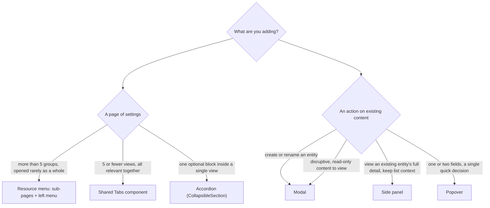
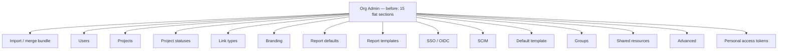
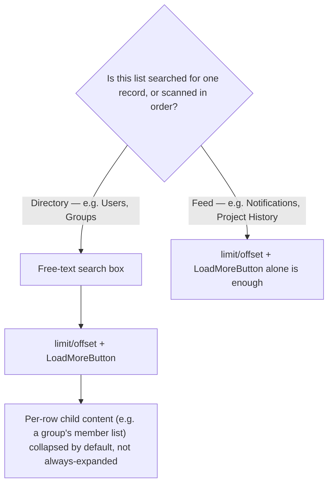
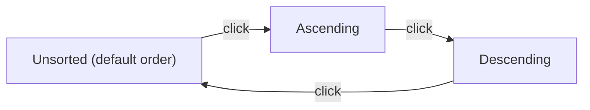
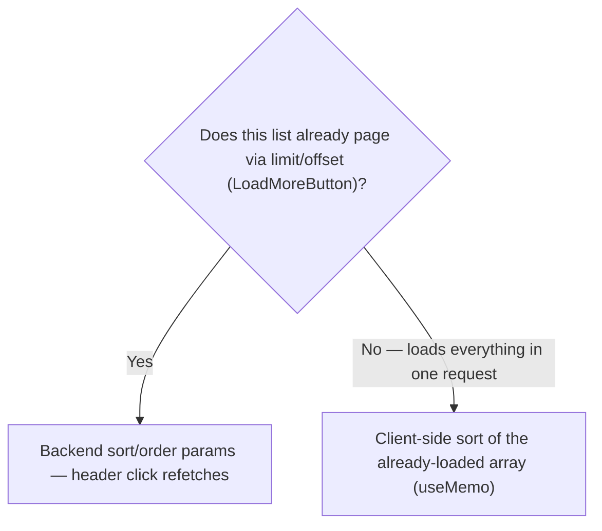

# UX Style Guide

This document is normative for new and reworked frontend UI in this project — the rules below, not individual taste, decide which container/create/confirmation pattern a new screen uses. It is the direct output of [docs/ux-audit-2026-08.md](ux-audit-2026-08.md), a full audit of the existing UI's workflows and consistency; that document explains *why* each rule exists (the specific inconsistency it was written against) and tracks the implementation roadmap. This one states the rules themselves, so an agent or contributor can consult it without re-reading the whole audit.

Status: the principles and patterns below are agreed; the roadmap in the audit doc tracks how much of the existing UI has actually been brought into line with them. Where a rule and the current code disagree, the rule wins for new work — file it as a roadmap item rather than copying the inconsistent precedent.

## Why this exists

The audit found the app had quietly grown three different answers to "many settings, one page" (a 15-section flat accordion wall, an 8-tab bar, and a page combining both at once), four different answers to "how do I confirm a delete" (most commonly: no confirmation at all), zero shared components for side panels or toast feedback despite fourteen-plus create flows needing one, and no way to reach org administration without already knowing the URL. None of this was one bad decision — it's what happens when each new screen is built by asking "what did the last screen near this one do" instead of "what does the rule say." This document is that rule, written down once.

## Principles

Thirteen rules. Each names the pattern and the specific failure in the existing UI it was written against — the failure is the "why," useful for judging edge cases the rule doesn't spell out.

1. **One depth model, chosen by scale — not habit.** Resource-menu sub-pages for more than five setting groups opened rarely as a whole; tabs for five or fewer views of the same object, all relevant together; accordions for one optional block inside a single view — never as the whole page. *Why:* Org Admin's 15-way flat accordion and Project Admin's 8-tab bar independently invented two different answers to the same question, and Preferences uses both at once on one page.
2. **Every override says so, out loud.** Any value with a platform default shows its current state — Platform default or Custom — and a one-click way back, every time, not sometimes. *Why:* accent colour has a working revert control; header text reverts only if you know to blank the field; org logo and login background can't be reverted at all, in the UI or the API.
3. **Create is a layer, not a page reflow — and for a full entity create/rename form, that layer is a Modal.** *(Revised 2026-08-24 — see the seventh pass's roadmap in [docs/ux-audit-2026-08.md](ux-audit-2026-08.md); this supersedes the original SidePanel-for-entities call by direct product decision, flagged here rather than changed silently.)* A brand-new entity (a project, an organisation, a user, a group, a requirement) or a rename of an existing one opens in a `Modal`, centred and blocking the page behind it. The reasoning is about the app's own spatial reading order, not any one form's internal field layout: the app reads left to right as nav rail → resource menu (where present) → core content pane → side panel, each column showing something derived from the one to its left — the side panel's specific job in that order is "further detail about, or an action on, whatever the content pane is currently showing" (open a row, see its detail; select a record, edit it). `FilterPanel` (the shared list+filter sidebar behind Principle 10's `FilterBadge` rule, above) is the same slot used the same way and predates this decision: its narrowing controls (which statuses, which stages) are themselves derived from — scoped to — whatever entity type the content pane is currently listing, not an independent, freestanding form. (See [Pattern: `FilterPanel`](#pattern-filterpanel), below, for the dedicated write-up this side-note originally flagged as missing.) Creating a brand-new entity isn't detail about anything already on screen — it's a fresh, disconnected action with no "what came before it" in that reading order — so putting it in the side panel's slot borrows a position whose meaning is specifically "more about what's already showing" for something that isn't that. A `Modal` sits outside and on top of the whole nav → resource-menu → content → panel flow rather than occupying a position within it, which is the correct home for an action that doesn't belong anywhere in that order. `SidePanel` is retained for exactly the job that reading order actually assigns it: viewing an existing entity's full detail without navigating away, list still visible underneath (`Pattern: entity detail panel`, below) — not for creating anything new. `Popover` is unchanged, for a one- or two-field quick action anchored to whatever triggered it. *Why (original):* every one of the app's 14+ create flows was an inline form that pushed the surrounding list down; the app's Modal component had never been used for a create flow. *Why (revision):* a create flow was occupying the side panel's spatially-meaningful "detail about the current view" slot for something that isn't detail about the current view at all. See the new `Pattern: modal dialog for entity create/rename`, below, including a known dependency (`Modal.tsx` itself likely needs a size variant before it's a drop-in fit for every flow this affects).
4. **One component per pattern, not one per page.** A single shared `Tabs`, `SidePanel`, and `Popover`, used everywhere that pattern applies. *Why:* three pages independently hand-rolled the same tab-bar markup; consistency should be a side effect of reuse, not a rule enforced by memory across separate authors and dates.
5. **One door for "add one" and "add many."** Bulk operations live behind the same entry point as the single-item create, offered as a second option — not a separate block the user has to already know exists. *Why:* the CSV import wizard already does the job well but sits permanently on-screen, unlabelled, beside the single-add form it duplicates.
6. **Confirm proportional to consequence.** Two tiers, not four: an ordinary delete gets a lightweight Modal confirmation; an irreversible, wide-blast-radius action (deleting an organisation, for instance) gets type-the-name-to-confirm. Nothing in between silently deletes. *Why:* four competing confirmation patterns exist today, the most common of which is none at all — including the exact same "archive" operation confirming on one page and not its structural sibling.
7. **Every mutation ends with feedback.** A save, delete, vote, or import always tells the user it happened — a shared toast for success, a shared inline error state for failure, both wired through one place so a new mutation can't accidentally skip it. *Why:* success feedback exists in exactly one place in the current app (the CSV import summary).
8. **Every interactive control has a name.** An icon-only button gets a real `aria-label`, a tab bar gets real ARIA tab semantics with arrow-key navigation, a modal traps focus while open and returns it on close. *Why:* at least 20 unlabelled icon buttons and a shared Modal with neither a focus trap nor focus restoration — concentrated, fixable gaps, not a rewrite.
9. **Org administration is always one click away, even though content browsing isn't org-scoped.** Content (projects, requirements, and everything under them) deliberately pools across every org a user belongs to — that's correct and shouldn't change, so this isn't a case for a persistent "current org" context or an Azure/Entra-style tenant switcher that would force the whole app into one org's context at a time. What's actually missing is narrower: a nav-rail entry point to the org directory (`/orgs`), so reaching org-level settings doesn't depend on already having a bookmark or a stale link. *Why:* `/orgs` has no rail entry for anyone but a server admin — an ordinary org admin has no path back to their own org's settings from the persistent chrome.
10. **Every badge that names a filterable value is a `FilterBadge`, not a plain `.badge`.** If a row shows a badge for a value (status, outcome, stage, role, …) and the same page's filter panel offers that value as an option, clicking the badge must apply it as a filter (and clicking it again clear it) — the same click-to-toggle behaviour `FilterBadge` already gives `RequirementsPage`'s status badge. A badge for a value with no matching on-page filter stays a plain `.badge`; this rule only applies where both already exist on the same page. *Why:* `FilterBadge` was built and correctly used on four pages before this was ever written down as a rule, so a fifth page (`ProjectActionsPage`) reproduced the identical badge/filter-panel pair with a plain, inert badge — there was working precedent to copy, but nothing to check against before shipping the copy that missed it.
11. **Grouped secondary actions get one door too, not just creates.** Principle 5 is about "add one" vs. "add many"; the same shape applies to any pair of related, non-primary actions that would otherwise sit on screen together as two permanently-visible, competing buttons — most often a download and its companion (export data / download an import template). Collapse them behind one small `Popover` trigger instead. *Why:* the CSV wizard's "Export CSV" and "Download template" buttons reproduced Principle 5's exact "two blocks competing for the same job" shape, just for downloads instead of creates — the rule as originally written only named creates, so nothing flagged the download pair as the same problem.
12. **Every enum, status, or role value shown to a user goes through its label map — never the raw backend string.** A dropdown option, a filter `<select>`, a table cell, a badge — all read from the same `*_LABEL` lookup (e.g. `REQUIREMENT_STATUS_LABEL`, `CHANGE_REQUEST_STATUS_LABEL`, `PROJECT_ROLE_LABEL` in `frontend/src/api/types.ts`) that the row/badge rendering for that same value already uses, rather than interpolating the enum's wire value (`in_review`, `project_administrator`) directly into JSX. When a new enum value is added, its label goes into the same map at the same time — not inline in whichever component happens to render it first. *Why:* found four times independently in one pass (`ChangeRequestsPage.tsx`/`RequirementsPage.tsx`'s own filter selects, a requirement's version-history table, an Org Admin role badge) — each one had a working label map sitting right next to the broken code, used correctly by a sibling element on the same page, and missed anyway.
13. **Every form field gets a visible label, not just placeholder text.** Placeholder text disappears the moment a field has real content — it can't double as the field's name once something's typed into it. *Why:* the new-requirement form's Name/Reasoning/Description fields relied on placeholder-only labelling while every other field on the same form (Component, Category, Target version, Level) correctly used a real `<label>` — once populated, three of seven fields on one form had nothing on screen saying what they were.

## Pattern: settings hierarchy

Use this decision aid for any new settings surface, or any existing one being reworked. It's the rule that would have kept Org Admin (15 flat accordions) and Project Admin (8 tabs) from independently diverging into different answers to the same problem.



*(The "create or rename" leaf was revised 2026-08-24 from an earlier "Side panel" answer — see Principle 3 above.)*

Read this top to bottom: the first question splits into two families depending on whether you're adding a whole page of settings or a single action on something that already exists; each leaf names the exact component to reach for. It matters here because "many settings on one page" is the single most repeated design problem in the current app, solved three different ways.

The resource-menu leaf is the enterprise-console shape the app's own header chrome already gestures at — a fixed dark top bar, independent of the light/dark theme, in the same family as Power Apps, Dynamics, and ServiceNow (see [docs/decisions.md](decisions.md), "Header chrome is theme-independent"). Azure and Entra use the same shape one level deeper: an overview blade, then a left resource menu grouping related settings, then a content pane.

**Addendum (2026-08-24): when one resource-menu group outgrows itself, split it into more flat top-level groups — don't add nested sub-navigation.** Two groups in the "after" tree below have since grown crowded, one level down — People (Users and Groups, currently two `CollapsibleSection`s crammed into one panel) and Integrations & Security (SSO/OIDC, SCIM, SMTP/email, 2FA/self-signup/external-user policy, and PATs, all under one combined section). This doesn't need a new nested-navigation capability: `ResourceMenu` already renders any number of flat top-level groups — going from 15 accordions to 6 groups in the fifth pass wasn't settling on a hard ceiling of exactly 6, just what fit that particular regroup. Promoting Users and Groups to their own top-level entries (replacing People), and splitting Integrations & Security into OAuth/SSO, Email, and Security, both just add more entries to the same flat list `ResourceMenu` already handles — no component change required. See the roadmap in [docs/ux-audit-2026-08.md](ux-audit-2026-08.md).

**Both splits above implemented 2026-08-25**, taking Org Admin from the 6 groups in the "after" tree to 9: People → **Users** + **Groups**; Integrations & Security → **OAuth/SSO** (SSO/OIDC, including the IdP group-name mapping already there, plus SCIM — grouped together as the two identity-*provisioning* integrations, rather than splitting SCIM into Security) + **Email** (SMTP & email) + **Security** (2FA requirement, self-signup, external-user policy, plus Personal access tokens — PAT lifetime already lived here, per the fifth pass's own regroup). SCIM's placement was the one non-obvious call — it doesn't fetch/change nothing security-relevant, but it's fundamentally about *how users and groups get into the org* from an external system, the same job SSO/OIDC does at login time, rather than a policy toggle like 2FA/self-signup — see `docs/decisions.md` for the full reasoning. Every field that used to save via one shared "Save advanced settings" button on a single combined page now has its own explicit save button on whichever of the three groups it actually appears on (the SSO group-mappings list gained one on OAuth/SSO, SMTP gained one on Email) — all three still submit the same underlying `OrgAdvancedSettings` object/PUT, since the component's state is shared across groups regardless of which one is currently rendered.


Mockups, not screenshots — illustrative of the shape, not the exact pixels. Applied to Org Admin's actual 15 flat sections:

```mermaid
flowchart TD
  Root2["Org Admin — after: 6 groups"] --> G1["Overview"]
  Root2 --> G2["People"]
  Root2 --> G3["Projects & workflow"]
  Root2 --> G4["Branding & defaults"]
  Root2 --> G5["Templates & reports"]
  Root2 --> G6["Integrations & security"]
  G1 --> G1a["Org name, export, danger zone"]
  G1 --> G1b["Import / merge bundle"]
  G1 --> G1c["Shared resources"]
  G2 --> G2a["Users"]
  G2 --> G2b["Groups"]
  G3 --> G3a["Projects: group & membership matrix"]
  G3 --> G3b["Project statuses"]
  G3 --> G3c["Link types"]
  G4 --> G4a["Branding — logo, colour, footer"]
  G4 --> G4b["Default template project"]
  G5 --> G5a["Report defaults"]
  G5 --> G5b["Report templates"]
  G6 --> G6a["SSO / OIDC — incl. IdP group-name mapping, moved from Groups"]
  G6 --> G6b["SCIM"]
  G6 --> G6c["SMTP & email"]
  G6 --> G6d["Security — 2FA requirement, self-signup, external-user policy"]
  G6 --> G6e["Personal access tokens — org-wide lifetime & list"]
```





Two trees, same content, regrouped rather than trimmed — every leaf in the second diagram traces back to a section in the first. Two notes on the regrouping itself: **Overview** groups rare-and-consequential items (import/merge, the danger zone, shared resources) that don't share a subject, only a "you'd look at this on arrival or almost never" frequency; and the old **Advanced** accordion doesn't survive as one item — its seven previously-crammed-together settings domains split across the tree by what they actually govern (SMTP/email gets its own item, 2FA/self-signup/external-user-policy becomes "Security," PAT lifetime joins the existing PAT list).

## Pattern: platform default vs. override

One control, applied uniformly to every overridable setting (today: accent colour, header title, footer identity, logo, login background). A status pill states the current source in words, not just an input's blank-or-filled state; a reset action is always present when the value is custom.


Implementing the logo/login-background half of this needs a small, genuinely new backend capability (a `DELETE` reset endpoint alongside the existing upload `POST`) — treat that as its own reviewed change per [docs/soc2/policies/change-management-and-secure-development-policy.md](soc2/policies/change-management-and-secure-development-policy.md), not folded silently into a UI-only pass.

## Pattern: create panels, popovers, and one door for bulk

*(The side-panel-for-entities half of this section is historical — see the revised Principle 3 and the new `Pattern: modal dialog for entity create/rename`, below, for the current rule. Left as-is here rather than rewritten, since it documents the reasoning and mockups from when it was current; the "one door for bulk" and Popover-for-small-forms parts are unaffected by the revision.)*

Three shapes, chosen by how much the create flow needs: a full side panel for a multi-field entity, a small popover for one or two fields, and a single split entry point that offers both "add one" and "import many" instead of two disconnected blocks.


The CSV import wizard's own column-mapping/preview logic is unchanged here, it just stops being a second, permanently-visible block competing with the single-add form for the same job.


The current inline form here (a kind selector plus a per-field checkbox-revealed editor) is the most field-heavy inline form in the app — under this pattern it moves into the same side panel unchanged, it just stops pushing the list down while doing it.

**The same "one door" shape applies past creates, too (Principle 11).** The CSV wizard's "Export CSV" and "Download template" were two permanently-visible, adjacent buttons for two related downloads — not a create flow, but the identical "two blocks competing for the same job" problem. They now live behind a single "Export" `Popover` trigger, the same component (and the same small-menu shape) `RequirementsPage`'s own "+ New requirement" uses for Add one/Import from CSV. Reach for this whenever a screen accumulates a second, related, non-primary action next to an existing one rather than adding it as its own permanent button.

## Pattern: modal dialog for entity create/rename

*(New 2026-08-24, superseding the SidePanel half of the pattern above for entity creates — see the seventh pass in [docs/ux-audit-2026-08.md](ux-audit-2026-08.md).)*

Creating a brand-new entity (project, organisation, user, group, requirement) or renaming an existing one now opens in a `Modal` — centred, blocking the page behind it, with the entire form visible without navigating away. This was a direct product decision, not a mechanical audit finding, and the reasoning is about where things sit in the app's own spatial reading order, not about any one form's internal field layout: the app reads left to right as nav rail → resource menu (where present) → core content pane → side panel — each column showing something *derived from* the one before it. `SidePanel`'s slot in that order specifically means "more about, or an action on, whatever the content pane currently shows" (open a row, see or edit its detail). A brand-new entity isn't detail about anything already on screen; it has no "what came before it" in that reading order, so it doesn't belong in the slot whose whole meaning is contextual derivation. `Modal` sits outside and on top of that entire flow rather than occupying a position within it, which is why it's the right home for an action that isn't contextual to the current view at all.

What doesn't change: `SidePanel` keeps its one remaining job — the one the reading order actually assigns it — viewing an existing entity's full detail without leaving the list behind it (`Pattern: entity detail panel`, below). `Popover` is untouched, for a one- or two-field quick action (a rename-in-place, a single-select stage move) anchored to whatever triggered it.

**Implementation dependency, resolved 2026-08-24:** `Modal.tsx` originally (`{ title, onClose, children }`, fixed `max-width: 560px`, no dedicated footer/action-button prop, caller supplies its own buttons in `children`) was built for its one then-current use — a read-only vote-comment viewer, plus `ConfirmDialog` built on top of it — and hadn't yet hosted a genuinely busy multi-field form. It now takes an optional `size?: "md" | "lg"` prop (`Modal.tsx`, `MODAL_MAX_WIDTH_PX`): `"md"` (the default, unchanged) keeps the original 560px for a small form or read-only viewer; `"lg"` widens to 900px for a busy multi-field form. First proven by the CSV import wizard's own column-mapping/preview step, which needs the extra width for its field/column-mapping/hint table (see [docs/ux-audit-2026-08.md](ux-audit-2026-08.md), roadmap item 506) — the caller passes `size="lg"`, everything else about the component (title, close button, focus trap, backdrop) is unchanged. A future flow reaching for `Modal` should check whether its own content is form-sized (`"md"`) or table/wizard-sized (`"lg"`) rather than assuming one width fits every case.

## Pattern: action menu

*(New 2026-08-25 — see [Org Admin: Users/Groups, org-level actions, and two still-inline create forms](ux-audit-2026-08.md#org-admin-usersgroups-org-level-actions-and-two-still-inline-create-forms), roadmap item 519.)*

**Use this when a header/toolbar row has two or more secondary, non-primary actions that would otherwise sit side by side as separate, permanently-visible buttons** — the same "two blocks competing for the same job" shape Principle 5 (one door for add-one/add-many) and Principle 11 (grouped downloads) already name for creates and downloads, extended here to any small group of related actions on an existing entity (rename, export, and similar). **Don't use it for a single primary action** — a lone button stays a plain button; collapsing one action behind a menu adds a click for no reason. A rough floor: reach for `ActionMenu` at two or more secondary actions, not one.

Built as `ActionMenu` (`frontend/src/components/ActionMenu.tsx`) — a `MoreVertical` kebab trigger (its own real accessible name via `triggerLabel`, e.g. `` `${orgLabelCap} actions` ``, per Principle 8 — never a bare, generic "More actions" once more than one `ActionMenu` could plausibly appear on the same page) that opens a `Popover` anchored to itself, reusing `Popover`'s existing positioning/focus-trap/outside-click-close logic rather than a new implementation — the same reuse `SplitButtonTrigger` already makes for its own revealed-alternatives list. Inside, `items` render as real `role="menuitem"` buttons inside a `role="menu"` container; selecting one closes the menu and then calls that item's own `onSelect` — callers don't close the menu themselves. Each item is an ordinary focusable `<button>`, so Tab/Shift+Tab already moves between them; this does not implement the full WAI-ARIA menu widget's arrow-key roving-tabindex pattern (`ResourceMenu`/`Tabs` do that for their own larger surfaces) — judged proportionate for a menu this short, not under-built, per the item's own S-M effort sizing. Revisit if a future call site needs a longer list.

An item that itself opens a create/rename flow follows Principle 3 as normal — the menu is just the entry point, not a replacement for the `Modal`/`Popover` choice that flow's own content already dictates. First call site: `OrgAdminPage.tsx`'s Overview group combines "Rename" (opens a `Modal`, replacing what used to be an always-visible inline input) and "Export {org} bundle" (calls the existing export handler directly and closes the menu — not a create/rename flow, so no dialog of its own) behind one trigger. Rename is only offered to an org admin (the same gate the inline input used to carry); Export stays available to every member, matching its previous, ungated placement — collapsing two actions behind one menu doesn't collapse who can see each one.

## Pattern: resource picker dialog

*(New 2026-08-24 — see [Shared org resources](ux-audit-2026-08.md#shared-org-resources-have-almost-no-way-to-consume-them). Built 2026-08-25.)*

A two-pane `Modal`: a source list on the left (today, just "Organisation shared resources," but built to admit more sources later — a project's own uploaded files, say — without a rewrite), and the selected source's actual files on the right, pickable and attachable to whatever opened the dialog. This is a new component, not a variant of anything that exists — nothing in the app today lets a user reach into a shared pool from outside the page that manages it directly.

**Built** as `ResourcePickerModal` (`frontend/src/components/ResourcePickerModal.tsx`) — a `sources: ResourcePickerSource[]` prop (each just `{ id, label, loadFiles() }`) drives the left-hand source list, so a future source is a new array entry, not a rewrite; the right pane is a checkbox list (multi-select, matching `ChangeRequestsPage.tsx`'s existing shared-resource checkbox picker more closely than a single-click-and-close flow) with one "Attach selected" action, and the caller's `onAttach(fileIds)` decides how the selection is applied. First and, for this pass, only wiring target: `RequirementDetailPage.tsx`'s Attachments card, calling the backend endpoint that already existed for exactly this (`POST /{requirement_id}/files/link`) but had no frontend caller anywhere until now — confirmed by grep before wiring it up, per this project's own "verify before building a duplicate" rule. The report-chapter image picker this component was built generic enough to also serve later (its own bespoke resource-selection logic still lives in `reports.py`/`ReportsPage.tsx`, untouched) was **not** wired up in this pass — deliberately out of scope, see `docs/decisions.md`.

## Pattern: role display — effective highest role only

*(New 2026-08-24 — see [Project role display](ux-audit-2026-08.md#project-role-display-every-role-shown-not-the-effective-highest). Applied 2026-08-25.)*

`ProjectRole` (`backend/app/models/enums.py:21-27`) has a real precedence, not just four unordered labels: `project_manager` is the sole top tier; `project_administrator` and `stakeholder` are a shared, mutually-equal second tier; `member` is the floor. Anywhere a user's project role is shown as a compact summary (a row in a list, a header), collapse to this precedence — show `project_manager` alone if held; otherwise show whichever of `project_administrator`/`stakeholder` are held (both, if both); otherwise show `member`. A user genuinely holding more than one tier-2 role (both `project_administrator` and `stakeholder`, via different group memberships) still shows both, since they're not ordered relative to each other — only strictly lower roles get hidden once a higher one is present.

This is a display rule for summary contexts, not a data change — a genuine access-audit view (Org Admin's "View access" panel, specifically built to answer "what does this person actually have") should keep showing the full, uncollapsed role set per project, since collapsing there would remove the exact detail that view exists to surface. Apply the collapsing rule to compact list rows (Org Admin's Users table, a project's member list) and keep the full set in any view whose whole purpose is a detailed access audit.

**Applied** as `collapseProjectRoles()` (`frontend/src/api/types.ts`), a small precedence helper next to `PROJECT_ROLE_LABEL` rather than duplicated per call site. Wired up at the app's real compact `ProjectRole`-badge-list call sites, found by grepping every `PROJECT_ROLE_LABEL` usage rather than assuming the roadmap item's own worked example: `ProjectListPage.tsx` (both tile and list/table views), `FavouritesPage.tsx`, and `PreferencesPage.tsx`'s "my organisations" project list — all render a user's *own* `my_roles` for a project as a compact badge list. Left uncollapsed, deliberately: Org Admin's "View access" `SidePanel` (`OrgAdminPage.tsx:~1416`), per this section's own access-audit exception; and Org Admin's Users table `Roles` column, which — checked directly rather than assumed from the roadmap item's own "collapse project/org role badges" phrasing — renders `OrgRole` (`org_admin`/`project_creator`/`member`), a different, unordered three-value enum with no precedence defined by this pattern, not `ProjectRole`; collapsing it would need a new rule this section doesn't specify. See `docs/decisions.md` for this scope correction. That same `OrgRole` column's control shape — an always-visible checkbox stack, not a dropdown — is addressed separately below, in `Pattern: multi-select dropdown`.

## Pattern: multi-select dropdown

*(New 2026-08-27 — raised directly: "it was set so you could change a user's role in org users and was done as a set of checkboxes... this should be a dropdown list selector, as a) there are errors when you try to select another level, and b) it looks disgusting." See `docs/decisions.md`'s "Org Users role picker" entry for the full investigation.)*

Use this when a field can genuinely hold more than one value from a small, fixed set at once — not just "looks like a single choice." Org Admin's Users table `Roles` column is the motivating case: `UserOrgRole` allows a user to hold `member`, `project_creator`, and `org_admin` simultaneously (its unique constraint is `(user_id, organization_id, role)`, not one role per user), and this was a deliberate, previously-recorded design decision, not an oversight — so the fix for "this should be a dropdown" could not simply be a single-value `<select>`, which would silently make the roles mutually exclusive. **Don't reach for this pattern to fake a checkbox group into looking prettier when the underlying field is actually exclusive — a genuinely single-valued field should be a plain `<select className="input">`, per every other one already in this app.** Use it only where the data itself is a real set, not one value.

Built as `MultiSelectDropdown` (`frontend/src/components/MultiSelectDropdown.tsx`) — a trigger `<button className="input row">` that visually matches every native `<select className="input">` elsewhere in the app when closed, showing the currently-checked options' own labels as its summary text (e.g. "Member, Org admin"), or a caller-supplied `emptyLabel` when nothing is checked. Clicking it reveals every option as its own checkbox inside a `Popover` — reusing `Popover`'s existing positioning, focus-trap, and outside-click/Escape-close logic exactly as `ActionMenu` and `SplitButtonTrigger` already do, rather than a third implementation of the same anchoring behaviour. Each option's `checked`/`disabled`/`onToggle` is owned entirely by the caller (the same per-item-callback shape `ActionMenu`'s `items` already use) — toggling one calls that option's own `onToggle` immediately, with no separate "apply" step, matching every other immediate toggle in the app (Principle 7). An option can carry its own `title`, shown while `disabled`, so a caller can explain *why* a specific option can't be toggled right now (Org Admin's own row: a user can never revoke their own org role from this table, mirroring the backend's self-targeting guard on the revoke endpoint) rather than leaving a disabled control with no visible explanation.

First and only call site so far: `OrgAdminPage.tsx`'s Users table Roles column, replacing the always-visible three-checkbox stack. This also closed the reported "errors when selecting another role": every grant/revoke previously called the page's giant `reload()` (the same architectural pattern behind the PR #12 race in `docs/decisions.md`) — which re-fetches the users list from offset 0, silently dropping any rows paged in past the first 30, and, if two toggles landed close together, could race two overlapping ~10-request reload bundles against each other, surfacing as a page-wide load-error state on any transient failure. Fixed by updating just the affected row's own `roles` array in local state on a successful grant/revoke instead — the display rule above already means this table only ever shows `OrgRole`'s full, uncollapsed set per row, so no other on-screen state depends on a full reload.

## Pattern: split-button trigger

*(New 2026-08-24 — see [The "New Requirement" trigger](ux-audit-2026-08.md#the-new-requirement-trigger-doesnt-match-the-requested-split-button-interaction).)*

For a primary action that has exactly one common case and one (or a small number of) less-common alternative — "add a requirement" vs. "import a batch from CSV" — clicking the main control performs the common case directly; a small secondary affordance (a chevron, or hovering the control) reveals the alternative(s) without an extra click for the common path. This is different from the app's current `Popover`-menu-on-click shape (used today by `RequirementsPage`'s "+ New Requirement" trigger), which makes *every* click, including the common case, stop at a menu first.

**Built 2026-08-24** as `SplitButtonTrigger` (`frontend/src/components/SplitButtonTrigger.tsx`) — a button + adjacent chevron, sharing `Popover`'s existing positioning/outside-click-close logic for the revealed alternate-options list, exactly as scoped: its own reusable component, not a one-off on `RequirementsPage`. First wired up there (`RequirementsPage.tsx:434`), replacing the `Popover`-based two-option menu it's named against above — a plain click now calls `onDefaultAction` directly (opening the create form) with no menu stop, and the chevron (its own accessible name, "More options") reveals "Import from CSV". Judgment call: the reveal affordance is click-to-open on the chevron, not hover — the pattern's own wording allows either ("a chevron, or hovering the control"), and click was chosen since hover has no equivalent on a touchscreen (this app supports mobile viewports, U-P-02) and every other disclosure control in the app (`CollapsibleSection`, `Popover` itself) already opens on click; see `docs/decisions.md` for the full reasoning. Other call sites this shape would fit (per this section's own "anywhere else a primary action currently forces a menu stop" note) weren't converted in this pass — scoped to `RequirementsPage` only, per [docs/ux-audit-2026-08.md](ux-audit-2026-08.md)'s roadmap item 505.

## Pattern: auto-growing textarea

*(New 2026-08-24 — see [docs/ux-audit-2026-08.md](ux-audit-2026-08.md#new-requirement-form-three-unlabelled-fields-no-auto-grow), roadmap item 525.)*

`AutoGrowTextarea` (`frontend/src/components/AutoGrowTextarea.tsx`) is a controlled `<textarea>` (`value`/`onChange`, same contract as a plain one) that grows to fit its content via `scrollHeight` instead of scrolling inside a fixed row count, capped at a maximum height so a pasted essay doesn't push the rest of the form off-screen. The cap is computed from the element's own resolved `line-height` (`getComputedStyle`, not a hardcoded pixel number) multiplied by a `maxVisibleLines` prop (default 8, per this item's own "roughly 8 lines" suggestion) plus its actual padding/border — so it tracks `theme.css`'s real typography if that ever changes rather than needing every caller to keep a magic number in sync with the stylesheet by hand. First used on `RequirementsPage.tsx`'s Reasoning/Description fields, in place of a fixed `rows={2}` `<textarea>`.

Use this for any free-text field where more than a couple of lines is a realistic, common case (a reasoning/description/notes field) — not for a field that's genuinely meant to stay short (a name, a title), where growth would just be visual noise. `theme.css`'s global `box-sizing: border-box` matters to any future edit of this component: `scrollHeight` never includes border width (a universal DOM behaviour, not box-sizing-dependent), so the border has to be added back before being assigned to `style.height` — missed once during this component's own build, caught by a Storybook interaction test rather than manual inspection (see `docs/decisions.md`).

## Pattern: view toggle (tile vs. list)

*(New 2026-08-24, documenting an existing, working component that was never written up as a rule — the same story `FilterBadge` had before Principle 10. See [Favourites](ux-audit-2026-08.md#favourites-no-filter-nav-rail-lag-no-view-toggle).)*

`useViewMode`/`ViewToggle` already exists and is already used correctly on `ProjectListPage.tsx` and `RequirementsPage.tsx` — a small control switching a list between a tile/card grid and a table/list layout, state persisted per page. Any list page presenting more than a handful of items, where both "scan visually" (tiles) and "compare fields side by side" (list/table) are genuinely useful, should use this component rather than picking one fixed layout or, worse, hand-rolling a second toggle. `FavouritesPage.tsx` was the one page missing it — **wired up 2026-08-25** (`useViewMode("favourites")`, its own persisted key), replacing the page's previous fixed CSS-grid-only layout with the same tile/list split `ProjectListPage.tsx` uses, including an equivalent table view (star/unfavourite, name+summary, organisation, stage badge, roles, requirement count).

**Second usage shape, not literally the shared `ViewToggle` component (2026-08-25) — same underlying idea, different concrete control.** `ViewToggle`/`useViewMode` are specifically about *tile vs. list* (`LayoutGrid`/`List` icons, a `"tiles" | "list"` mode). The broader pattern underneath — a small two-button toggle, `aria-pressed` on each, backed by `useUiPreference` so the choice is remembered per-user across sessions — applies just as well to any pair of alternate representations of the *same* underlying data, not only tile-vs-list. `RequirementDetailPage.tsx`'s merged History/Activity card (see roadmap item 516) is the first such case: a `Table`/`Activity` icon pair (not `LayoutGrid`/`List` — those specifically mean tile vs. list, and reusing them here would misname what's actually being toggled) switching between the requirement's own version-history table and its general audit-log feed, keyed `requirement_detail_history_view` via `useUiPreference` directly rather than through `useViewMode` (whose `ViewMode` type is hardcoded to `"tiles" | "list"` and wouldn't fit a `"versions" | "activity"` pair without a misleading type). Reach for this same shape — two `aria-pressed` buttons, `useUiPreference`-backed, one rendering swapped for the other — for a future pair of alternate views on one entity; there's no need to generalise `ViewToggle` itself into a fully generic N-icon toggle unless a third or fourth concrete case shows up wanting the exact same icon/label parameterisation.

## Pattern: file-upload trigger

*(New 2026-08-24 — see [File upload triggers: three different visual treatments](ux-audit-2026-08.md#file-upload-triggers-three-different-visual-treatments).)*

`FileUploadTrigger` (`frontend/src/components/FileUploadTrigger.tsx`) renders a `.btn`-styled `<label>` wrapping a hidden native `<input type="file">` — the icon/text passed as `children` is the visible control; selecting a file calls `onSelect(file)` and resets the input's value so choosing the same filename again still fires a change event. Extracted from `CommentThread.tsx`'s own hand-rolled version of exactly this shape (the one place in the app that already rendered a file picker as a real button rather than the browser's bare native control) so every file input in the app shares one implementation. Supports a forwarded `ref` to the underlying input (for a caller that needs to open the picker programmatically, e.g. from an external split-button trigger) and a `showTrigger={false}` mode that mounts the input without a visible label, for exactly that case.

Use this for any file input whose selection acts immediately (an attachment, an avatar, a logo) — not for the three bundle-import (`.zip`) forms, which keep the file picker as a visible, `.input`-classed field alongside other visible text fields ahead of a separate submit step (a genuinely different shape: a form field to fill in, not a one-click trigger). See `docs/decisions.md` for that scope decision.

## Pattern: `FilterPanel`

*(New 2026-08-24 — see [docs/ux-audit-2026-08.md](ux-audit-2026-08.md) roadmap, "Document `FilterPanel` as its own style guide `Pattern:`". Documents an existing, working component that had never been given its own write-up — the same "built, working, never named" gap `FilterBadge` and `ViewToggle` both had before their own sections above.)*

`FilterPanel`/`FilterField`/`FilterCheckbox` (`frontend/src/components/FilterPanel.tsx`) is the right-hand narrowing-filter sidebar: a plain `.card.stack` shell (`FilterPanel`) holding one or more labelled controls (`FilterField` wraps a `<label>` around its child, giving every filter control a real accessible name for free — no separate `aria-label` needed; `FilterCheckbox` is the boolean equivalent for a plain toggle like "unread only"). It always sits in the same `.side-grid` layout slot: list/table content on the left, `FilterPanel` on the right, both visible at once — never a full-screen takeover, never collapsed behind a menu.

Reach for it when a list page needs one or more controls that *narrow which rows are shown* — a status/role/stage/component select, a reviewer or action-type picker, a boolean like "only watched" or "include archived." It is specifically for narrowing filters, not for the page's primary actions, its free-text search box, or a tile/list `ViewToggle` — those stay in the main content area above the list, matching the split every current call site already uses (see the "Consolidate filter UI onto `FilterPanel` everywhere needed" roadmap item, which moved four pages onto this exact split rather than inventing a new one). Six pages use it today: `RequirementsPage.tsx` and `ChangeRequestsPage.tsx` (the original two, Status/Category/Target-version/Reviewer-shaped selects), `ProjectListPage.tsx` (Status/Organisation/Role/Stage-status), `ProjectReviewsDuePage.tsx` (Component/Reviewer), `ProjectActionsPage.tsx` (Action type/Outcome), `ServerOrganisationsPage.tsx` (Status), and `NotificationsPage.tsx` (a single `FilterCheckbox`, "Unread only" — no `FilterField` selects, proving the panel doesn't require multiple controls to earn its place).

**Relationship to `FilterBadge` (Principle 10):** the two are meant to work together, not independently. A `FilterPanel` control is the *only* way to set a filter for a value with no row-level badge (Component, Reviewer, Action type); where a row already shows a badge for a value the same panel also offers as a filter (status, outcome, target stage), that badge should be a `FilterBadge` so clicking it toggles the exact same filter state the panel's own select drives — one filter, two entry points into it, never two independently-tracked mechanisms for the same value.

## Missing components identified this pass

Reviewing the seventh pass's findings against the style guide's existing component set surfaced five gaps: three new components with no precedent anywhere in the app, one existing component that needs extending before it can take on a new job, and one component that already existed but — like `FilterBadge` before it — had never been written up as a rule. (Splitting Org Admin's People and Integrations & Security groups turned out not to need a new navigation capability at all — see the settings-hierarchy addendum above — so it isn't listed here.)

| Gap | New or extend? | Where it's needed | Pattern |
|---|---|---|---|
| Modal dialog able to host a full multi-field entity form | Built — `Modal.tsx`'s new `size="lg"` variant, extending the original 560px-only component | Every entity create/rename flow — first used by the CSV import wizard's mapping/preview step | [Pattern: modal dialog for entity create/rename](#pattern-modal-dialog-for-entity-createrename) |
| Two-pane resource picker dialog | Built — `ResourcePickerModal` (`frontend/src/components/ResourcePickerModal.tsx`), wired to `RequirementDetailPage.tsx`'s Attachments card via the previously-uncalled `POST .../files/link` endpoint | Attaching a shared org resource to a requirement now; built pluggable (`sources: ResourcePickerSource[]`) so a report chapter image picker can reuse it later without a rewrite | [Pattern: resource picker dialog](#pattern-resource-picker-dialog) |
| Split-button trigger (click = default action, hover/chevron = alternatives) | Built — `SplitButtonTrigger`, wired up on `RequirementsPage`'s "New requirement" | "New Requirement," and any future primary action with one dominant case | [Pattern: split-button trigger](#pattern-split-button-trigger) |
| Auto-growing textarea, capped at a sensible max height | Built — `AutoGrowTextarea`, used on the new-requirement form's Reasoning/Description | New-requirement form's Reasoning/Description, and any other long-form text field | [Pattern: auto-growing textarea](#pattern-auto-growing-textarea) |
| Action menu (kebab/⋯ trigger opening a small menu of related, non-primary actions) | Built — `ActionMenu` (`frontend/src/components/ActionMenu.tsx`) | Org rename + export combined on `OrgAdminPage.tsx`'s Overview group; likely useful anywhere else two related secondary actions currently sit side by side as separate buttons | [Pattern: action menu](#pattern-action-menu) |
| View toggle (tile vs. list) | Already exists (`useViewMode`/`ViewToggle`), just never written up as a rule until now | `FavouritesPage`, and any future list page | [Pattern: view toggle (tile vs. list)](#pattern-view-toggle-tile-vs-list) |
| `FilterPanel` (list + narrowing-filter sidebar) | Already exists, used on six pages, named only in passing (Principle 10) until now | Any future list page adding filters | [Pattern: `FilterPanel`](#pattern-filterpanel) |
| File-upload-trigger button (styled button + hidden input) | Built — `FileUploadTrigger`, extracted from `CommentThread.tsx`'s own duplicated inline pattern | Applied to every non-bundle-import file input in the app (attachments, avatar, org/platform logo & login background, shared resources, report image insert, CSV import) | [Pattern: file-upload trigger](#pattern-file-upload-trigger) |

Role-display collapsing (`Pattern: role display`, above) is a display rule, not a component — listed in its own pattern section rather than here.

## Pattern: confirmation, in two tiers — and feedback, always

Two tiers of "are you sure," matched to how hard the action is to undo — not four patterns chosen ad hoc per page. And one small, consistent way to say "done" afterward.


Tier 1 — ordinary delete/archive, applied everywhere one happens in the app.


Tier 2 — irreversible, wide blast radius. The left panel is hypothetical, not real: organisation deletion is already implemented correctly today (type-the-exact-name-to-confirm), shown here against what it would look like if it had instead followed the app's single most common pattern, to make the point that it doesn't and shouldn't. Called out to be *named* as the deliberate upper tier rather than left as an unlabelled one-off, so a future irreversible, wide-blast-radius action (deleting a whole project, say) reaches for the same pattern instead of reinventing it.


The other half of principle 7 — fired from one shared place, so a future mutation can't ship without it the way most of today's do.

## Pattern: wayfinding — a nav-rail entry to org administration

Not an Azure/Entra-style tenant switcher — this app deliberately pools content (projects and everything under them) across every org a user belongs to, and that's the right call, not a gap to fix. A switcher pattern implies the whole app scopes to one org at a time, which would contradict that pooling. The actual, narrower gap: `/orgs` (the personal org directory, and the only path to org administration) has no entry point anywhere in the persistent chrome except for server admins drilling in through `/server/organisations`.

The fix is a single nav-rail link — "Organisations" (or similar), visible to any user who is an org admin in at least one org, pointing at `/orgs`. For a user in exactly one org, `/orgs` already auto-redirects straight to that org's admin page, so the link is effectively a one-click path to "my org's settings." For a user in several, it lands on the existing directory list. No new context, no new global state — the directory page already does the job, it's just unreachable without already knowing the URL.

## Pattern: directories at scale (search, paginate, don't render everything at once)

Not every list is the same shape. A *feed* (Notifications, Project History, a reviews-due list) is scanned roughly in order — pagination alone is the right fix, already applied consistently (see [docs/ux-audit-2026-08.md](ux-audit-2026-08.md#scale-two-unbounded-lists)). A *directory* (Org Admin's Users and Groups, Project Admin's Groups tab) is instead *searched* — someone opens it already looking for one specific record — and needs all three of the following together, not pagination on its own:



Read top to bottom: the branch point is what kind of list this is; everything below a "Directory" answer is required together, everything below "Feed" is already the existing, correctly-applied pattern. *Why:* Org Admin's Users table has three fixed audit filters (stale / no 2FA / no project access) but no way to search by name or email, and neither Users nor Groups paginate at all; Org Admin's and Project Admin's Groups sections both render every group's full member list open and inline, unconditionally, which is unnoticeable at a handful of seed-data groups and becomes the entire page at a hundred. Pagination on its own (the fix already shipped for Project History and the access-review table) doesn't solve "find the one person named Priya" — that needs search; and a directory's per-row detail (a group's members) needs to default to collapsed the way `CollapsibleSection` already does elsewhere, not render unconditionally, regardless of whether the list itself is paginated.

## Pattern: entity detail panel (view, not just create)

`SidePanel` isn't only for creating something new — the same shape (a layer anchored to the row that opened it, portalled above the page, the list underneath left untouched) is also the right container for *viewing* one record's full detail without navigating away from the list it's part of, for an entity that doesn't already have its own dedicated page. Open it read-only: no form fields, no Save button, just the data, with the same close affordance (✕, Escape, backdrop click) every other `SidePanel`/`Modal` already gives.

*Why:* every entity in the app worth looking at closely already gets a detail page or panel — a requirement, a change request, an action — except a user, who can be listed in Org Admin's Users table but never opened. An org admin auditing what one person actually has access to (which projects, which role on each, which org/project groups) has no equivalent of `RequirementDetailPage` to check, and has to reconstruct the answer by hand, project by project. The first candidate for this pattern is exactly that: a "view user" panel opened from a row in Org Admin's Users table (or a member row inside a group), listing their projects/roles/groups at a glance — see the roadmap in [docs/ux-audit-2026-08.md](ux-audit-2026-08.md#no-way-to-view-a-users-access).

## Pattern: bulk operations on a list

A checkbox column, a header checkbox that selects every currently-loaded row, and a contextual toolbar that appears once at least one row is selected — offering "N selected," a "Clear selection" control, and the available bulk actions. This is a *selection layer* on top of a list, not a new confirmation or feedback shape of its own: every bulk action still ends in the same Tier-1 `ConfirmDialog` and the same `Toast` every single-row mutation in the app already uses (Pattern "confirmation, in two tiers — and feedback, always," above) — a bulk action is just that same machinery invoked once per selected row instead of once for a single clicked row.

```mermaid
flowchart TD
  A["Row checkboxes unchecked (table/list view only)"] -->|"check 1+ rows, or header 'Select all'"| B["Toolbar: 'N selected' · Clear selection · bulk actions"]
  B -->|"Clear selection"| A
  B -->|"Archive selected"| C["ConfirmDialog (Tier 1): 'Archive N requirements?'"]
  B -->|"Move to stage"| D["Popover: pick a stage"]
  D -->|"Move"| E["ConfirmDialog (Tier 1): 'Move N requirements to \"Stage\"?'"]
  C -->|"Confirm"| F["Sequential loop over the existing single-row endpoint, once per selected row"]
  E -->|"Confirm"| F
  F --> G["Toast: 'N updated', or 'N updated, M failed' if any row errored"]
  G --> A
```

Read top to bottom: unchecking back to zero selected rows hides the toolbar again (the loop back to the top state); the two bulk actions diverge only in what they confirm before converging on the same execute-loop-then-toast tail. *Why it matters:* every branch after the toolbar reuses a component the app already has — `ConfirmDialog`, `Popover` (for the stage picker, the same "one door" shape Pattern "create panels, popovers, and one door for bulk" already names), and `Toast` — rather than inventing bulk-specific versions of any of them.

Piloted on `RequirementsPage.tsx`'s table/list view only (2026-08 UX audit roadmap: "Bulk operations on list pages," the sixth pass's own [Bulk operations: none exist](ux-audit-2026-08.md#bulk-operations-none-exist) finding — the audit named this "no existing pattern in the app to copy" and flagged it as needing a design decision before implementation). Three choices worth naming so a second page adopting this pattern doesn't have to re-derive them:

- **"Select all" means all *currently loaded* rows, never "everything matching the filter."** A list page here already paginates via `LoadMoreButton` (Pattern "directories at scale," above) rather than loading every row up front, so a true "select all 500 matching this filter" would need either loading all of them first or a server-side bulk-by-filter endpoint — neither exists, and promising it from a checkbox that only ever sees the rows already in the DOM would be misleading. Selecting more just means loading more first.
- **No new backend endpoint.** The execute step loops over the project's *existing* single-row endpoints (the same `DELETE .../requirements/{id}` archive and `PUT .../requirements/{id}` update the single-row Archive button and detail-page save already call) sequentially, client-side, tolerating individual failures rather than aborting the batch. This keeps a first pilot small and auditable; a page with materially larger selections, or a third bulk action, is the trigger to revisit whether a real bulk endpoint earns its keep — not a rule this pattern itself imposes.
- **Tier 1 confirmation stays Tier 1, not Tier 2, even at N > 1.** Bulk archive/move are exactly as reversible as their single-row equivalents (archive un-archives; a stage move can be moved again) — the count changes the wording ("Archive 7 requirements?" instead of "Archive this requirement?"), not the tier. A future bulk action that's *not* reversible per-row (a bulk permanent delete, say) would need Tier 2 the same way any single irreversible action already does.

## Pattern: sortable column header

A clickable `<th>` — rendered as a real `<button>` inside the cell, not a bare `<th onClick>`, so it's keyboard-operable like every other control in the app — that cycles unsorted → ascending → descending → unsorted on click. The currently-sorted column shows an `ArrowUp`/`ArrowDown` indicator (the same icons Tokens already names for reorder — no new icon convention introduced); every other column stays plain text until clicked. `aria-sort` on the `<th>` itself (not an `aria-label` on the button — see the shared component's own comment for why an `aria-label` there would silently rename the columnheader for every `getByRole("columnheader", { name })` query and assistive-tech user alike) is how a screen reader learns the table's current sort column/direction, matching the WAI-ARIA APG "sortable table" pattern.



Read left to right: three clicks return to the starting state, and there's no fourth state — a column is never "descending, click again for nothing." *Why it matters:* four independent hand-rolled sort implementations (one per table) would repeat the exact "no shared component, no ARIA semantics" mistake the audit already found in this app's three tab bars — see [docs/ux-audit-2026-08.md](ux-audit-2026-08.md#pattern-inconsistency). One shared `SortableHeader` (`frontend/src/components/SortableHeader.tsx`) is used by every sortable table instead.

**Backend `sort`/`order` query params vs. client-side sort — decided per table, not once for the whole app:**



*Why:* sorting only the rows currently loaded from a paginated list would silently misrepresent the true full-list order — "sorted by name, ascending" has to mean sorted across every match, not just the first page fetched so far. A list that already loads everything up front has no such risk, so a client-side sort is both correct and avoids an unnecessary round-trip. See [docs/ux-audit-2026-08.md](ux-audit-2026-08.md#table-sorting-manual-reorder-only) for which of the app's tables landed on which side of this split, and `docs/decisions.md` for the reasoning per table.

Sortable columns are the obvious ones only — a name/title, a status, an ID/code, a created/modified date, a priority where one exists — never a column with no natural order (an actions column, a badge-only column). A table whose rows are shown as an accordion-of-cards rather than `<th>`-based columns (Org Admin's Groups section, Project Admin's Groups tab) has no column headers to make sortable in the first place — this pattern doesn't apply there, even though both are backend-paginated directories in the sense of the "directories at scale" pattern above.

## Tokens

`frontend/src/styles/theme.css` is already, functionally, the design system — CSS custom properties for colour, a working light/dark split, and spacing/radii used consistently even though not yet named as tokens. This section documents it as one, rather than proposing a new palette; every value below is already in the codebase.

| Token | Light | Dark | Use |
|---|---|---|---|
| `--color-primary` | `#475569` (slate) | `#94a3b8` | Primary actions, links |
| `--color-accent` | `#2f855a` (moss) | `#68d391` | Success/positive state |
| `--color-danger` | `#c53030` | `#fc8181` | Destructive actions, errors |
| `--color-warning` | `#b7791f` | `#f6c667` | Warnings |
| `--color-bg` | `#eef1f5` | `#14181f` | Page background |
| `--color-surface` | `#ffffff` | `#1c222c` | Card/panel background |
| `--color-header-bg` | `#14161c` (fixed, both themes) | — | App-chrome header — deliberately theme-independent, see `docs/decisions.md` |

Dark-theme equivalents already exist for every themed token (`:root[data-theme="dark"]`); the header chrome is the one deliberate exception, fixed regardless of theme. Not yet formalised as named tokens, though consistently used in practice: spacing clusters around `4 / 6 / 8 / 12 / 16 / 24px`, and border radius is a consistent `6px` throughout. Worth promoting to explicit `--space-*`/`--radius-*` custom properties as a small follow-up, rather than inventing a new scale — the values already agree with each other, they're just inline rather than named.

Typography: the app's own system-font stack (`-apple-system, BlinkMacSystemFont, "Segoe UI", Roboto, Helvetica, Arial, sans-serif`) at a 15px base.

**Framework & primitives.** *(New 2026-08-24.)* React + TypeScript, built with Vite; routing via `react-router-dom`. No component library and no CSS-in-JS/Tailwind — styling is plain CSS custom properties plus a small, hand-rolled set of utility classes in `frontend/src/styles/theme.css`, applied directly via `className`, the same way `.badge` already does (Principle 10's own "one small reusable visual pattern" note). New UI should reach for these before adding an equivalent: `.card`/`.stack`/`.row`/`.grid`/`.side-grid` for layout, `.btn`/`.btn-primary`/`.btn-danger` for buttons, `.input` for form controls, `.badge` for status/type/role chips, `.container` for the page-width wrapper. `frontend/src/components/` holds the shared, higher-level components this whole document is about (`Modal`, `SidePanel`, `Popover`, `Tabs`, `ConfirmDialog`, `Toast`, `FilterPanel`, `FilterBadge`, `CollapsibleSection`, `ResourceMenu`, `DefinitionList`, `SortableHeader`, `ViewToggle`, `FileUploadTrigger`, `SplitButtonTrigger`, `AutoGrowTextarea`, `ActionMenu`) — a new page should compose from this set before reaching for a one-off.

**App chrome.** *(New 2026-08-24.)* A fixed top bar (`.app-header`, deliberately theme-independent — see the colour token table above) plus a pinned, full-height left nav rail (`.nav-rail`, `Layout.tsx`) that stays on screen while page content scrolls. The rail always shows a global section, plus a project-scoped section once a project is selected; it collapses to icon-only via a toggle pinned above the links, persisted per-user (`useUiPreference("nav_rail_collapsed")`), and a separate, independent preference (`content_boxed`) controls whether page content fills the remaining width or stays capped at 1200px. App and API version strings are pinned at the bottom of the rail (see the seventh pass's [App/API version](ux-audit-2026-08.md#appapi-version-investigated-working-as-designed) finding for how they're populated). `BrandingProvider`/`TerminologyProvider` wrap everything below the header, so org branding and terminology overrides reach every page and nav label without prop-drilling.

**Icons.** *(Expanded 2026-08-24 — the previous version of this table named six icons; the app actually uses about fifty. Verified against every `lucide-react` import in `frontend/src`, not assumed.)* `lucide-react` throughout, no other icon set — grouped below by what each means, so a new icon for an existing meaning reuses the entry rather than introducing a synonym:

| Meaning | Icon | Notes |
|---|---|---|
| Add / create | `Plus` | |
| Edit / rename | `Pencil` | One known exception: the report-template Edit button has no icon at all — worth fixing rather than copying. |
| Delete permanently | `Trash2` | A second exception (`CommentThread.tsx` using `X` for this) was fixed in the sixth pass. |
| Reorder up/down, or a sorted column's direction | `ArrowUp` / `ArrowDown` | Shared between manual reorder and `SortableHeader`'s sort-direction indicator — see "Pattern: sortable column header." |
| Expand / collapse | `ChevronUp` / `ChevronDown` | Reserved for `CollapsibleSection`. `SplitButtonTrigger` also uses a `ChevronDown` for its secondary-options affordance (`Pattern: split-button trigger`) — a different job at a different location (beside a button, not inside an accordion header), not a collision, but worth remembering both exist. |
| Close a dialog | `X` | `Modal.tsx`/`SidePanel.tsx`'s own close button — distinct from `Trash2` above; not used for delete anywhere anymore. |
| Archive / restore | `Archive` / `ArchiveRestore` | |
| View a record's full detail | `Eye` | Org Admin's "View access" panel trigger. |
| Open an `ActionMenu` (kebab/⋯) | `MoreVertical` | See "Pattern: action menu" — first use is `OrgAdminPage.tsx`'s Overview group (rename + export). |
| Favourite | `Star` | Filled when favourited, outline otherwise (`ProjectListPage.tsx`, `FavouritesPage.tsx`, and the nav-rail Favourites link itself). |
| Lock / unlock | `Lock` / `Unlock` | Currently one specific use — Org Admin's per-user "display name locked" toggle — not yet a general "this record is locked" convention; if a future requirement/action lock-state indicator is added (see the seventh pass's actions/change-request gate findings), reuse this pair rather than inventing a new one. |
| Attachment | `Paperclip` | |
| Comment / discussion | `MessageSquare` | |
| "Like" a comment | `Heart` | Filled when the current user has reacted, outline otherwise. |
| Notifications | `Bell` / `BellOff` | |
| Toast success / error | `Check` / `TriangleAlert` | `Check` is reused for "approve" (Project Admin's stage-approval button); `TriangleAlert` is reused for an inline warning on `RequirementsPage`. |
| Upload / download | `Upload` / `Download` | |
| Nav-rail collapse toggle | `PanelLeftClose` / `PanelLeftOpen` | |
| Tile / list view toggle | `LayoutGrid` / `List` | See `Pattern: view toggle (tile vs. list)`. `List` is also used, unrelatedly, for `RichTextEditor`'s bulleted-list formatting button — same icon, two unconnected contexts; not a collision worth resolving, just worth knowing both exist. |
| Loading | `Loader2` | |
| Sign out | `LogOut` | |
| Help | `HelpCircle` | |
| Entity/nav-rail markers, one icon per kind, not reused for anything else | `LayoutDashboard` (Overview), `ListChecks` (Requirements), `GitPullRequest` (Change Requests), `CheckSquare` (Actions), `FileText` (Reports), `Clock` (reviews due, project-scoped), `History` (Project History), `Settings` (Project Admin), `FolderKanban` (Projects), `CalendarClock` (My Reviews Due, cross-project), `Building2` (organisations — both "My organisations" and Server: Organisations reuse it, correctly, since both are about organisations), `Wrench` (Server Management) | Straight from `Layout.tsx`'s nav-rail link definitions — one settled icon per destination already; a new nav-rail entry should follow the same one-icon-per-entity-kind rule rather than reusing one of these for something unrelated. |
| Rich-text formatting (toolbar-only, not a general convention) | `Bold`, `Italic`, `Heading1`/`Heading2`/`Heading3`, `List`, `Link` (imported as `LinkIcon`), `Image` (imported as `ImageIcon`) | All `RichTextEditor.tsx`-only; the `as LinkIcon`/`as ImageIcon` import aliases are a naming detail (avoiding a collision with `react-router-dom`'s `Link` and the browser's native `Image` constructor), not two icons standing in for one meaning. |
