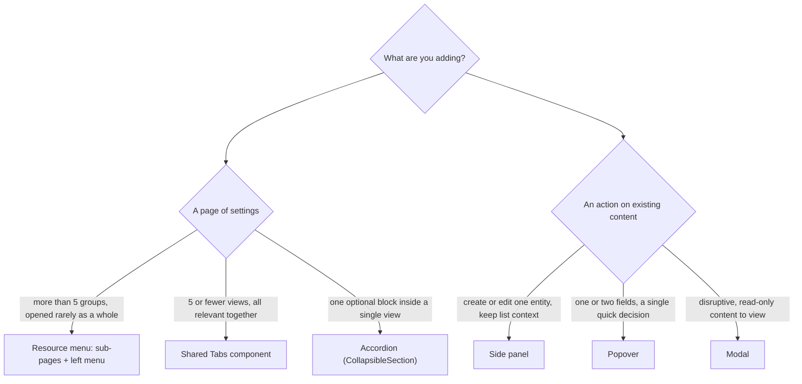
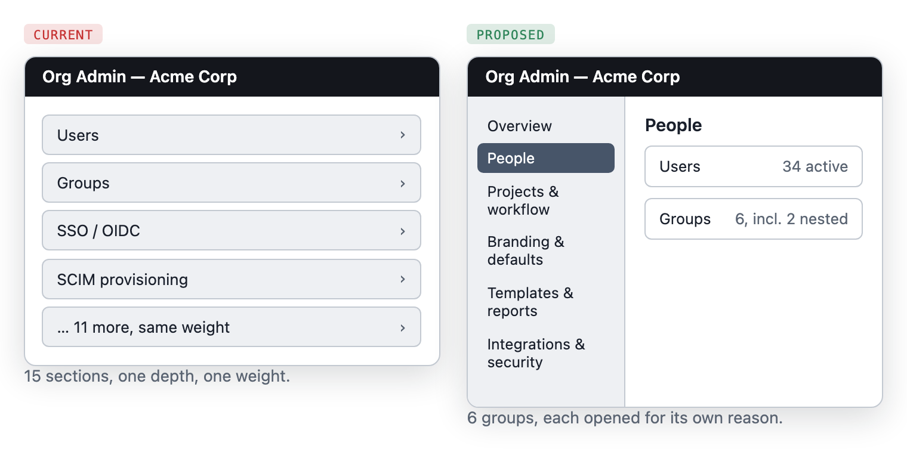
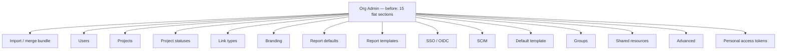
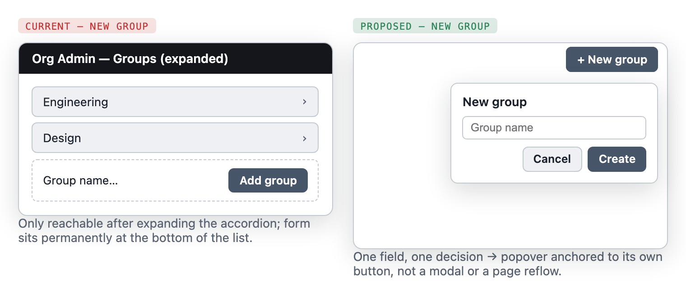
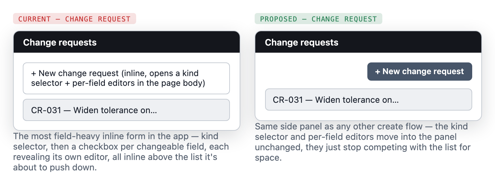
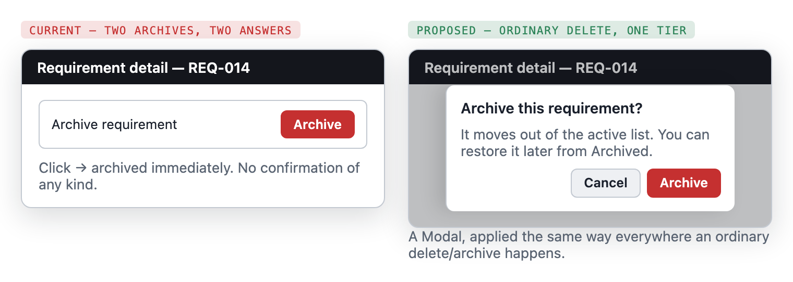
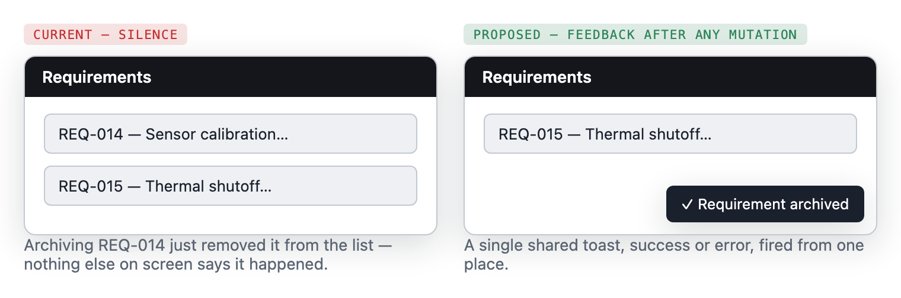
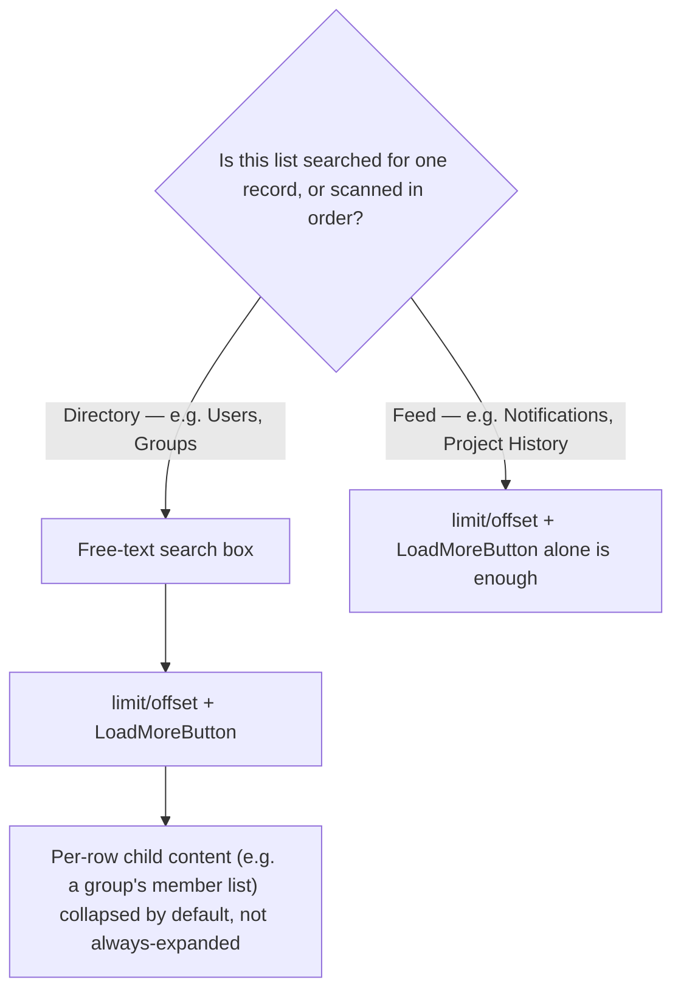

# UX Style Guide

This document is normative for new and reworked frontend UI in this project — the rules below, not individual taste, decide which container/create/confirmation pattern a new screen uses. It is the direct output of [docs/ux-audit-2026-08.md](ux-audit-2026-08.md), a full audit of the existing UI's workflows and consistency; that document explains *why* each rule exists (the specific inconsistency it was written against) and tracks the implementation roadmap. This one states the rules themselves, so an agent or contributor can consult it without re-reading the whole audit.

Status: the principles and patterns below are agreed; the roadmap in the audit doc tracks how much of the existing UI has actually been brought into line with them. Where a rule and the current code disagree, the rule wins for new work — file it as a roadmap item rather than copying the inconsistent precedent.

## Why this exists

The audit found the app had quietly grown three different answers to "many settings, one page" (a 15-section flat accordion wall, an 8-tab bar, and a page combining both at once), four different answers to "how do I confirm a delete" (most commonly: no confirmation at all), zero shared components for side panels or toast feedback despite fourteen-plus create flows needing one, and no way to reach org administration without already knowing the URL. None of this was one bad decision — it's what happens when each new screen is built by asking "what did the last screen near this one do" instead of "what does the rule say." This document is that rule, written down once.

## Principles

Eleven rules. Each names the pattern and the specific failure in the existing UI it was written against — the failure is the "why," useful for judging edge cases the rule doesn't spell out.

1. **One depth model, chosen by scale — not habit.** Resource-menu sub-pages for more than five setting groups opened rarely as a whole; tabs for five or fewer views of the same object, all relevant together; accordions for one optional block inside a single view — never as the whole page. *Why:* Org Admin's 15-way flat accordion and Project Admin's 8-tab bar independently invented two different answers to the same question, and Preferences uses both at once on one page.
2. **Every override says so, out loud.** Any value with a platform default shows its current state — Platform default or Custom — and a one-click way back, every time, not sometimes. *Why:* accent colour has a working revert control; header text reverts only if you know to blank the field; org logo and login background can't be reverted at all, in the UI or the API.
3. **Create is a layer, not a page reflow.** New-entity flows open in a panel or popover anchored to the button that opened them; the list underneath stays visible and untouched until Save. *Why:* every one of the app's 14+ create flows is an inline form that pushes the surrounding list down; the app's one Modal component has never been used for a create flow.
4. **One component per pattern, not one per page.** A single shared `Tabs`, `SidePanel`, and `Popover`, used everywhere that pattern applies. *Why:* three pages independently hand-rolled the same tab-bar markup; consistency should be a side effect of reuse, not a rule enforced by memory across separate authors and dates.
5. **One door for "add one" and "add many."** Bulk operations live behind the same entry point as the single-item create, offered as a second option — not a separate block the user has to already know exists. *Why:* the CSV import wizard already does the job well but sits permanently on-screen, unlabelled, beside the single-add form it duplicates.
6. **Confirm proportional to consequence.** Two tiers, not four: an ordinary delete gets a lightweight Modal confirmation; an irreversible, wide-blast-radius action (deleting an organisation, for instance) gets type-the-name-to-confirm. Nothing in between silently deletes. *Why:* four competing confirmation patterns exist today, the most common of which is none at all — including the exact same "archive" operation confirming on one page and not its structural sibling.
7. **Every mutation ends with feedback.** A save, delete, vote, or import always tells the user it happened — a shared toast for success, a shared inline error state for failure, both wired through one place so a new mutation can't accidentally skip it. *Why:* success feedback exists in exactly one place in the current app (the CSV import summary).
8. **Every interactive control has a name.** An icon-only button gets a real `aria-label`, a tab bar gets real ARIA tab semantics with arrow-key navigation, a modal traps focus while open and returns it on close. *Why:* at least 20 unlabelled icon buttons and a shared Modal with neither a focus trap nor focus restoration — concentrated, fixable gaps, not a rewrite.
9. **Org administration is always one click away, even though content browsing isn't org-scoped.** Content (projects, requirements, and everything under them) deliberately pools across every org a user belongs to — that's correct and shouldn't change, so this isn't a case for a persistent "current org" context or an Azure/Entra-style tenant switcher that would force the whole app into one org's context at a time. What's actually missing is narrower: a nav-rail entry point to the org directory (`/orgs`), so reaching org-level settings doesn't depend on already having a bookmark or a stale link. *Why:* `/orgs` has no rail entry for anyone but a server admin — an ordinary org admin has no path back to their own org's settings from the persistent chrome.
10. **Every badge that names a filterable value is a `FilterBadge`, not a plain `.badge`.** If a row shows a badge for a value (status, outcome, stage, role, …) and the same page's filter panel offers that value as an option, clicking the badge must apply it as a filter (and clicking it again clear it) — the same click-to-toggle behaviour `FilterBadge` already gives `RequirementsPage`'s status badge. A badge for a value with no matching on-page filter stays a plain `.badge`; this rule only applies where both already exist on the same page. *Why:* `FilterBadge` was built and correctly used on four pages before this was ever written down as a rule, so a fifth page (`ProjectActionsPage`) reproduced the identical badge/filter-panel pair with a plain, inert badge — there was working precedent to copy, but nothing to check against before shipping the copy that missed it.
11. **Grouped secondary actions get one door too, not just creates.** Principle 5 is about "add one" vs. "add many"; the same shape applies to any pair of related, non-primary actions that would otherwise sit on screen together as two permanently-visible, competing buttons — most often a download and its companion (export data / download an import template). Collapse them behind one small `Popover` trigger instead. *Why:* the CSV wizard's "Export CSV" and "Download template" buttons reproduced Principle 5's exact "two blocks competing for the same job" shape, just for downloads instead of creates — the rule as originally written only named creates, so nothing flagged the download pair as the same problem.

## Pattern: settings hierarchy

Use this decision aid for any new settings surface, or any existing one being reworked. It's the rule that would have kept Org Admin (15 flat accordions) and Project Admin (8 tabs) from independently diverging into different answers to the same problem.

Read this top to bottom: the first question splits into two families depending on whether you're adding a whole page of settings or a single action on something that already exists; each leaf names the exact component to reach for. It matters here because "many settings on one page" is the single most repeated design problem in the current app, solved three different ways.

The resource-menu leaf is the enterprise-console shape the app's own header chrome already gestures at — a fixed dark top bar, independent of the light/dark theme, in the same family as Power Apps, Dynamics, and ServiceNow (see [docs/decisions.md](decisions.md), "Header chrome is theme-independent"). Azure and Entra use the same shape one level deeper: an overview blade, then a left resource menu grouping related settings, then a content pane.

Mockups, not screenshots — illustrative of the shape, not the exact pixels. Applied to Org Admin's actual 15 flat sections:

```mermaid
flowchart TD
  Root2["Org Admin — after: 6 groups"] --> G1["Overview"]
  Root2 --> G2["People"]
  Root2 --> G3["Projects & workflow"]
  Root2 --> G4["Branding & defaults"]
  Root2 --> G5["Templates & reports"]
  Root2 --> G6["Integrations & security"]
  G1 --> G1a["Org name, export, danger zone"]
  G1 --> G1b["Import / merge bundle"]
  G1 --> G1c["Shared resources"]
  G2 --> G2a["Users"]
  G2 --> G2b["Groups"]
  G3 --> G3a["Projects: group & membership matrix"]
  G3 --> G3b["Project statuses"]
  G3 --> G3c["Link types"]
  G4 --> G4a["Branding — logo, colour, footer"]
  G4 --> G4b["Default template project"]
  G5 --> G5a["Report defaults"]
  G5 --> G5b["Report templates"]
  G6 --> G6a["SSO / OIDC — incl. IdP group-name mapping, moved from Groups"]
  G6 --> G6b["SCIM"]
  G6 --> G6c["SMTP & email"]
  G6 --> G6d["Security — 2FA requirement, self-signup, external-user policy"]
  G6 --> G6e["Personal access tokens — org-wide lifetime & list"]
```

Two trees, same content, regrouped rather than trimmed — every leaf in the second diagram traces back to a section in the first. Two notes on the regrouping itself: **Overview** groups rare-and-consequential items (import/merge, the danger zone, shared resources) that don't share a subject, only a "you'd look at this on arrival or almost never" frequency; and the old **Advanced** accordion doesn't survive as one item — its seven previously-crammed-together settings domains split across the tree by what they actually govern (SMTP/email gets its own item, 2FA/self-signup/external-user-policy becomes "Security," PAT lifetime joins the existing PAT list).

## Pattern: platform default vs. override

One control, applied uniformly to every overridable setting (today: accent colour, header title, footer identity, logo, login background). A status pill states the current source in words, not just an input's blank-or-filled state; a reset action is always present when the value is custom.

Implementing the logo/login-background half of this needs a small, genuinely new backend capability (a `DELETE` reset endpoint alongside the existing upload `POST`) — treat that as its own reviewed change per [docs/soc2/policies/change-management-and-secure-development-policy.md](soc2/policies/change-management-and-secure-development-policy.md), not folded silently into a UI-only pass.

## Pattern: create panels, popovers, and one door for bulk

Three shapes, chosen by how much the create flow needs: a full side panel for a multi-field entity, a small popover for one or two fields, and a single split entry point that offers both "add one" and "import many" instead of two disconnected blocks.

The CSV import wizard's own column-mapping/preview logic is unchanged here, it just stops being a second, permanently-visible block competing with the single-add form for the same job.

The current inline form here (a kind selector plus a per-field checkbox-revealed editor) is the most field-heavy inline form in the app — under this pattern it moves into the same side panel unchanged, it just stops pushing the list down while doing it.

**The same "one door" shape applies past creates, too (Principle 11).** The CSV wizard's "Export CSV" and "Download template" were two permanently-visible, adjacent buttons for two related downloads — not a create flow, but the identical "two blocks competing for the same job" problem. They now live behind a single "Export" `Popover` trigger, the same component (and the same small-menu shape) `RequirementsPage`'s own "+ New requirement" uses for Add one/Import from CSV. Reach for this whenever a screen accumulates a second, related, non-primary action next to an existing one rather than adding it as its own permanent button.

## Pattern: confirmation, in two tiers — and feedback, always

Two tiers of "are you sure," matched to how hard the action is to undo — not four patterns chosen ad hoc per page. And one small, consistent way to say "done" afterward.

Tier 1 — ordinary delete/archive, applied everywhere one happens in the app.

Tier 2 — irreversible, wide blast radius. The left panel is hypothetical, not real: organisation deletion is already implemented correctly today (type-the-exact-name-to-confirm), shown here against what it would look like if it had instead followed the app's single most common pattern, to make the point that it doesn't and shouldn't. Called out to be *named* as the deliberate upper tier rather than left as an unlabelled one-off, so a future irreversible, wide-blast-radius action (deleting a whole project, say) reaches for the same pattern instead of reinventing it.

The other half of principle 7 — fired from one shared place, so a future mutation can't ship without it the way most of today's do.

## Pattern: wayfinding — a nav-rail entry to org administration

Not an Azure/Entra-style tenant switcher — this app deliberately pools content (projects and everything under them) across every org a user belongs to, and that's the right call, not a gap to fix. A switcher pattern implies the whole app scopes to one org at a time, which would contradict that pooling. The actual, narrower gap: `/orgs` (the personal org directory, and the only path to org administration) has no entry point anywhere in the persistent chrome except for server admins drilling in through `/server/organisations`.

The fix is a single nav-rail link — "Organisations" (or similar), visible to any user who is an org admin in at least one org, pointing at `/orgs`. For a user in exactly one org, `/orgs` already auto-redirects straight to that org's admin page, so the link is effectively a one-click path to "my org's settings." For a user in several, it lands on the existing directory list. No new context, no new global state — the directory page already does the job, it's just unreachable without already knowing the URL.

## Pattern: directories at scale (search, paginate, don't render everything at once)

Not every list is the same shape. A *feed* (Notifications, Project History, a reviews-due list) is scanned roughly in order — pagination alone is the right fix, already applied consistently (see [docs/ux-audit-2026-08.md](ux-audit-2026-08.md#scale-two-unbounded-lists)). A *directory* (Org Admin's Users and Groups, Project Admin's Groups tab) is instead *searched* — someone opens it already looking for one specific record — and needs all three of the following together, not pagination on its own:

Read top to bottom: the branch point is what kind of list this is; everything below a "Directory" answer is required together, everything below "Feed" is already the existing, correctly-applied pattern. *Why:* Org Admin's Users table has three fixed audit filters (stale / no 2FA / no project access) but no way to search by name or email, and neither Users nor Groups paginate at all; Org Admin's and Project Admin's Groups sections both render every group's full member list open and inline, unconditionally, which is unnoticeable at a handful of seed-data groups and becomes the entire page at a hundred. Pagination on its own (the fix already shipped for Project History and the access-review table) doesn't solve "find the one person named Priya" — that needs search; and a directory's per-row detail (a group's members) needs to default to collapsed the way `CollapsibleSection` already does elsewhere, not render unconditionally, regardless of whether the list itself is paginated.

## Pattern: entity detail panel (view, not just create)

`SidePanel` isn't only for creating something new — the same shape (a layer anchored to the row that opened it, portalled above the page, the list underneath left untouched) is also the right container for *viewing* one record's full detail without navigating away from the list it's part of, for an entity that doesn't already have its own dedicated page. Open it read-only: no form fields, no Save button, just the data, with the same close affordance (✕, Escape, backdrop click) every other `SidePanel`/`Modal` already gives.

*Why:* every entity in the app worth looking at closely already gets a detail page or panel — a requirement, a change request, an action — except a user, who can be listed in Org Admin's Users table but never opened. An org admin auditing what one person actually has access to (which projects, which role on each, which org/project groups) has no equivalent of `RequirementDetailPage` to check, and has to reconstruct the answer by hand, project by project. The first candidate for this pattern is exactly that: a "view user" panel opened from a row in Org Admin's Users table (or a member row inside a group), listing their projects/roles/groups at a glance — see the roadmap in [docs/ux-audit-2026-08.md](ux-audit-2026-08.md#no-way-to-view-a-users-access).

## Tokens

`frontend/src/styles/theme.css` is already, functionally, the design system — CSS custom properties for colour, a working light/dark split, and spacing/radii used consistently even though not yet named as tokens. This section documents it as one, rather than proposing a new palette; every value below is already in the codebase.

| Token | Light | Dark | Use |
|---|---|---|---|
| `--color-primary` | `#475569` (slate) | `#94a3b8` | Primary actions, links |
| `--color-accent` | `#2f855a` (moss) | `#68d391` | Success/positive state |
| `--color-danger` | `#c53030` | `#fc8181` | Destructive actions, errors |
| `--color-warning` | `#b7791f` | `#f6c667` | Warnings |
| `--color-bg` | `#eef1f5` | `#14181f` | Page background |
| `--color-surface` | `#ffffff` | `#1c222c` | Card/panel background |
| `--color-header-bg` | `#14161c` (fixed, both themes) | — | App-chrome header — deliberately theme-independent, see `docs/decisions.md` |

Dark-theme equivalents already exist for every themed token (`:root[data-theme="dark"]`); the header chrome is the one deliberate exception, fixed regardless of theme. Not yet formalised as named tokens, though consistently used in practice: spacing clusters around `4 / 6 / 8 / 12 / 16 / 24px`, and border radius is a consistent `6px` throughout. Worth promoting to explicit `--space-*`/`--radius-*` custom properties as a small follow-up, rather than inventing a new scale — the values already agree with each other, they're just inline rather than named.

Typography: the app's own system-font stack (`-apple-system, BlinkMacSystemFont, "Segoe UI", Roboto, Helvetica, Arial, sans-serif`) at a 15px base, `lucide-react` for icons. No third-party UI library is in use — this is a fully custom, hand-rolled design system, and the icon usage is largely disciplined already: `Plus` for add, `Pencil` for edit, `Trash2` for delete, `ArrowUp`/`ArrowDown` for reorder, `ChevronUp`/`ChevronDown` reserved exclusively for `CollapsibleSection`'s own expand/collapse. Two known exceptions worth fixing rather than copying: `X` is used for "permanently delete a file" in `CommentThread.tsx` where `Trash2` is used everywhere else for the same action, and the report-template Edit button has no icon at all where every other edit affordance pairs the action with `Pencil`.
