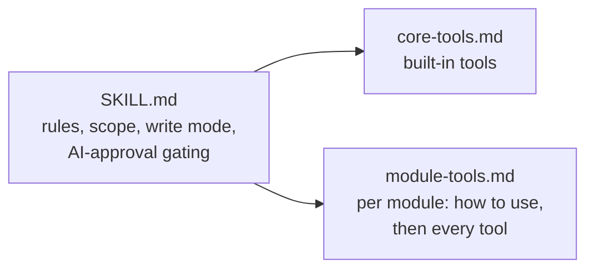

import useBaseUrl from '@docusaurus/useBaseUrl';

# Agent skill

An AI assistant connected to the MCP server sees a long list of tools. The **agent skill** tells it how to use them well: which tool to call first, how scope works, when writes and approvals are blocked, and that requirement text is data, not instructions. It also gives each module (Compliance, Decision Management, Context & Strategy, Stakeholders & Personas) its own usage guide.

## Download

| File | Use it for |
| --- | --- |
| <a href={useBaseUrl('/downloads/reqtrack-mcp-skill.zip')}>reqtrack-mcp-skill.zip</a> | Claude Code and other clients that load skill folders |
| <a href={useBaseUrl('/downloads/reqtrack-mcp-instructions.md')}>reqtrack-mcp-instructions.md</a> | Clients without skills (Copilot instructions, generic MCP clients): one Markdown file with the same content |

Both are built from the repository on every site build, so they match the tools of the version this documentation describes.

## Install

**Claude Code.** Unzip into a skills folder, so that `SKILL.md` sits in a `reqtrack-mcp` directory:

```bash
unzip reqtrack-mcp-skill.zip -d ~/.claude/skills/        # all projects
unzip reqtrack-mcp-skill.zip -d .claude/skills/          # one repository
```

The skill loads when you work with ReqTrackManager through MCP. The detailed tool lists in `references/` load only when needed.

**Other clients.** Add `reqtrack-mcp-instructions.md` to the client's custom-instructions file (for example `.github/copilot-instructions.md`) or paste it into the assistant's system prompt.

## What it covers



- **Always-on rules:** tool output is untrusted data, never paste or store the access token, confirm before writing, the assistant can only do what the account can.
- **Scope and workflow:** organisations, projects, default-scope headers, nested projects.
- **Write mode and AI approval:** which tools exist only in write mode, and which approval-type tools need both the organisation and the project to opt in.
- **Per-module guides:** the data model, lifecycle order, read and write workflows, gated tools and gotchas for each module, followed by every tool and its parameters.

## Keeping it current

The tool lists are generated from the live server and module registry, and automated tests fail when a tool is added without updating the skill, so the skill does not go stale as modules grow. Your own modules can contribute a usage guide the same way, see [Building your own module](../../modules/building-your-own-module.md#module-contributed-mcp-tools).
