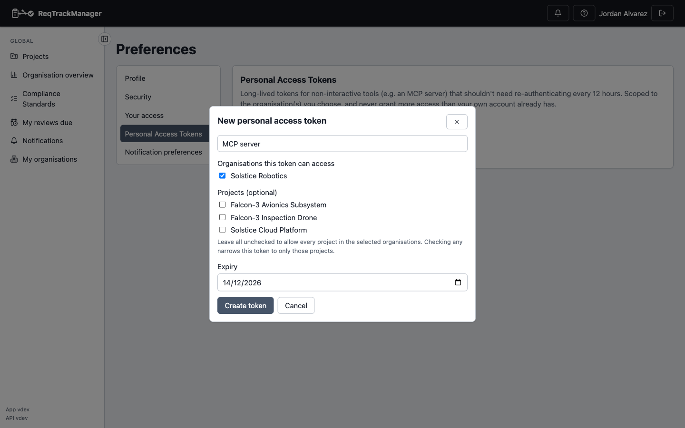

# Authenticating

Every request to the REST API — and every tool call to the [MCP server](./ai-assistants-mcp/overview.md) — presents a bearer token:

```
Authorization: Bearer <token>
```

There are two kinds of token, interchangeable everywhere this header is accepted:

| | Session token | Personal Access Token (PAT) |
| --- | --- | --- |
| Lifetime | 12 hours by default (`ACCESS_TOKEN_EXPIRE_MINUTES`) | Up to 90 days by default, or whatever an org admin has configured — see [Core Features → Personal access tokens](../core-features/personal-access-tokens.md) |
| Scope | The account's full access, everywhere it has a role | Narrowed to one or more organisations, optionally further to specific projects within them |
| How you get one | Logging in (`POST /api/v1/auth/login`, or the browser UI) | Created from **Preferences → Personal Access Tokens** |
| Good for | An interactive session, or a short-lived script | An MCP client, a scheduled script, or anything that shouldn't need re-authenticating every 12 hours |

A caller (the REST API, or `mcp-server` relaying the header on your behalf) doesn't need to know or care which kind it's holding — the backend's own RBAC does 100% of the access-control work either way, and neither token type is ever granted more access than the underlying account already has.

## The recommended way — a Personal Access Token

From **Preferences → Personal Access Tokens**, create a token scoped to whichever organisation(s) (optionally narrowed to specific projects) it needs, and give it an expiry.

| Creating a token |
| --- |
| Scoping a new token to an organisation, optionally narrowed to specific projects |
|  |

The token is shown exactly once, at creation — copy it immediately. It can be revoked at any time from the same page, taking effect on its very next use. See [Core Features → Personal access tokens](../core-features/personal-access-tokens.md) for the full walkthrough of creating, scoping, and revoking one; this page covers only how to *use* it.

Paste the resulting `rtm_pat_...` value into any client config exactly where a session token would go.

## The manual way — call the login endpoint directly

Useful for scripting or a one-off token:

```bash
curl -s -X POST http://localhost:8000/api/v1/auth/login \
  -H "Content-Type: application/json" \
  -d '{"email":"you@example.com","password":"your-password"}'
```

For an account without 2FA, this returns the access token directly:

```json
{"access_token": "eyJhbGciOi...", "token_type": "bearer", "user": { "...": "..." }}
```

:::note 2FA-enabled accounts
An account with two-factor authentication enabled gets a short-lived **challenge token** back instead, which must be exchanged via `POST /api/v1/auth/2fa/verify` with a current TOTP code to receive the real access token. That's fine for a one-off manual token, but not something a non-interactive script can complete on its own — use a 2FA-disabled account (or, better, a [Personal Access Token](#the-recommended-way--a-personal-access-token)) for automated setups.
:::

Consider creating a dedicated account for script/AI-assistant use rather than reusing a real person's login — its access is scoped by whatever real role you give it, same as any other account.

## No Authorization header, or an invalid one

- **Missing entirely** → the request fails immediately (401) rather than silently returning an empty or public-only result.
- **Expired or otherwise invalid** → a plain 401, same as any other authentication failure.
- **Valid, but no access to the requested org/project/resource** → a 403 (or 404, for something that doesn't exist), exactly as the UI itself would encounter.

## Where this fits

- [Common API tasks](./common-api-tasks.md) — using a token to call endpoints.
- [AI assistants (MCP)](./ai-assistants-mcp/overview.md) — using a token to connect an MCP client (this page's content applies unchanged there; MCP's own pages link back here rather than repeating it).
- [Single sign-on (OIDC/SSO)](./single-sign-on.md) — signing in via SSO still lands you a normal session token, same as native login.
