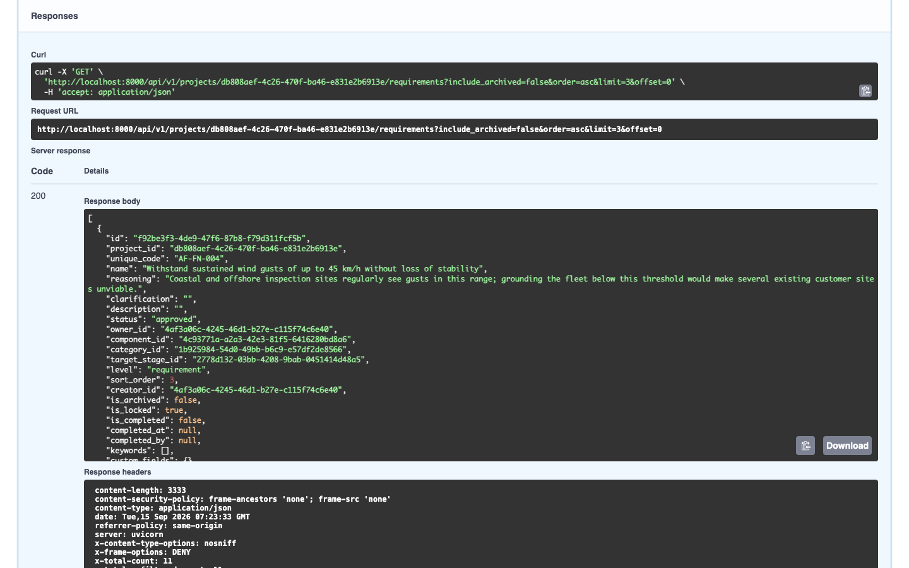

# Common API tasks

Worked examples, run against a real instance seeded with the demo dataset (see `docs/development.md`'s "Demo data" section) — not invented from route names alone. Each assumes `$TOKEN` holds a bearer token (see [Authenticating](./authenticating.md)) and `$PROJECT_ID` a project you have access to.

```bash
export TOKEN="rtm_pat_... (or a session token)"
export PROJECT_ID="db808aef-4c26-470f-ba46-e831e2b6913e"
```

## List requirements in a project

```bash
curl -s "http://localhost:8000/api/v1/projects/$PROJECT_ID/requirements?limit=2" \
  -H "Authorization: Bearer $TOKEN"
```

```json
[
  {
    "id": "f92be3f3-4de9-47f6-87b8-f79d311fcf5b",
    "unique_code": "AF-FN-004",
    "name": "Withstand sustained wind gusts of up to 45 km/h without loss of stability",
    "status": "approved",
    "...": "..."
  },
  { "...": "one more requirement" }
]
```

With `limit=2` set, the response is sliced to 2 rows, but the response headers still report the true totals — `X-Total-Count: 11` and `X-Total-Unfiltered-Count: 11` on this project. See [REST API overview → Pagination](./rest-api-overview.md#pagination) for what each header means.

The same call, run through Swagger UI's **Try it out**, with the real request/response visible:

| Common API task |
| --- |
| A "Try it out" call to the requirements list endpoint, showing the generated curl command, request URL, response body, and response headers |
|  |

## Create a requirement

`POST` body fields, from the backend's `RequirementCreate` schema: `name`, `component_id`, and `category_id` are required; everything else is optional. `target_stage_id`, if omitted, defaults to the project's earliest stage.

```bash
curl -s -X POST "http://localhost:8000/api/v1/projects/$PROJECT_ID/requirements" \
  -H "Authorization: Bearer $TOKEN" -H "Content-Type: application/json" \
  -d '{
        "name": "Docs API worked-example requirement",
        "component_id": "4c93771a-a2a3-42e3-81f5-6416280bd8a6",
        "category_id": "1b925984-54d0-49bb-b6c9-e57df2de8566"
      }'
```

```json
{
  "id": "ce5ee146-103a-43e3-a270-11a431b60da2",
  "unique_code": "AF-FN-013",
  "name": "Docs API worked-example requirement",
  "status": "draft",
  "target_stage_id": "2778d132-03bb-4208-9bab-0451414d48a5",
  "...": "..."
}
```

`component_id`/`category_id` come from `GET /api/v1/projects/{project_id}/components` and `GET /api/v1/projects/{project_id}/categories` — look up the ones for your own project rather than reusing the ids above.

## List change requests in a project

```bash
curl -s "http://localhost:8000/api/v1/projects/$PROJECT_ID/change-requests?limit=2" \
  -H "Authorization: Bearer $TOKEN"
```

```json
[
  {
    "id": "9a48af4b-8836-4777-aaf8-6f73d68f6256",
    "kind": "add_action",
    "status": "approved",
    "reason": "Compliance deadline requires a documented review of the broadcast module, not just informal sign-off.",
    "...": "..."
  },
  { "...": "one more change request" }
]
```

Same optional `limit`/`offset` pagination convention as the requirements list, with the same two count headers.

## Pull a report

There is one report endpoint, `POST /api/v1/projects/$PROJECT_ID/reports` — never `GET` — because report generation accepts filters and content options (`ReportRequest`: `format`, `component_id`, `category_id`, `status`, `keyword`, `include_archived`, extra Markdown chapters, a branding template id, and more). `format` (`"pdf"` or `"csv"`) is the only required field; everything else is optional:

```bash
# PDF
curl -s -X POST "http://localhost:8000/api/v1/projects/$PROJECT_ID/reports" \
  -H "Authorization: Bearer $TOKEN" -H "Content-Type: application/json" \
  -d '{"format": "pdf"}' -o report.pdf

# CSV
curl -s -X POST "http://localhost:8000/api/v1/projects/$PROJECT_ID/reports" \
  -H "Authorization: Bearer $TOKEN" -H "Content-Type: application/json" \
  -d '{"format": "csv"}' -o report.csv
```

`format: "pdf"` returns `application/pdf`; `format: "csv"` returns `text/csv`. Both, with no filters supplied, include every non-archived requirement in the project — see [Core Features → Reports and export](../core-features/reports-and-export.md) for the full option set (branding templates, chapter layout, appended shared-resource sections).

## Where this fits

- [REST API overview](./rest-api-overview.md) — the conventions these examples follow.
- [Authenticating](./authenticating.md) — getting `$TOKEN`.
- [Core Features → Requirements management](../core-features/requirements-management.md), [Change requests](../core-features/change-requests.md), [Reports and export](../core-features/reports-and-export.md) — the same actions, from the UI's side.
