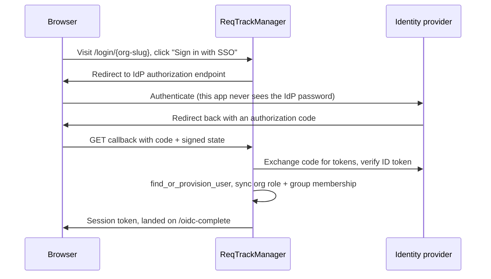

# Single sign-on (OIDC/SSO)

Each organisation can configure its own identity provider (IdP) for its members to sign in through, using standard OpenID Connect (OIDC). Configuration lives per-organisation (**Organisation admin → SSO**), so different organisations on the same deployment can each point at their own, unrelated IdP.

Once logged in via SSO, the resulting session is indistinguishable from a native login to the rest of the app — the same token, the same revocation and expiry behaviour, the same downstream RBAC.

## Provider-agnostic by design

ReqTrackManager uses standard OIDC discovery (`GET {issuer}/.well-known/openid-configuration`) rather than hardcoding any one provider's endpoint shapes. Point `oidc_issuer_url`/`oidc_client_id`/`oidc_client_secret` at any RFC-compliant OIDC provider — this is a configuration change on the organisation, not a code change. A few provider-specific notes, worth checking before you configure one:

- **Keycloak** — issuer is `{base}/realms/{realm}`. Its `groups` claim requires an explicit protocol mapper (`oidc-group-membership-mapper`) on the client — without it, group-based role/membership sync below silently has nothing to match against.
- **Authentik** — issuer is typically `{base}/application/o/{slug}/`. Group membership is included in the `groups` claim by default once the OpenID Connect scope's property mappings include it — no extra mapper step needed, unlike Keycloak.
- **Microsoft Entra ID** — issuer is `https://login.microsoftonline.com/{tenant-id}/v2.0`. Entra doesn't emit a `groups` claim by default for large tenants (a "groups overage" indirection instead) — the app registration's token configuration must add the `groups` claim explicitly, and the signing-in user must belong to fewer than roughly 200 groups for the claim to appear directly.

## How a user gains access and a role

Signing in via SSO always resolves to the same global account a user would have natively — login is not a separate, org-scoped identity space. What happens on first (and every subsequent) login:

1. **The account is found or provisioned.** Matched by `(subject, issuer)` together, or — only when the IdP asserts `email_verified: true` — by email. An IdP that doesn't assert verified email is never allowed to silently take over an existing account by claiming its address; that's a deliberate anti-spoofing measure.
2. **Org role and group membership are synced from the IdP's `groups`/`roles` claim.** An organisation's Groups admin UI lets you mark a group as IdP-managed (giving it an `idp_synced_group_name` to match against the claim) and, optionally, have that same group grant an organisation role (`granted_org_role`) whenever the claim matches. A user with no matching group still gets an account — they can log in, but see no organisation content until an admin grants them a role. This also syncs *down*: on any login where the IdP does assert a groups/roles claim, a role or group membership that came from a claim that's no longer present is revoked — closing the gap where someone removed from an IdP group would otherwise keep their access indefinitely. An IdP that sends no groups/roles claim at all is treated as "unknown," not "empty," so a provider that simply doesn't support the claim never triggers a mass revocation.

## Gating access to a required group

Separately from role mapping, an organisation can require membership in one specific IdP group just to be let in at all (**Organisation admin → SSO → Required group**). This is evaluated immediately after the ID token is verified and *before* any local account is provisioned or any token is issued — a user outside the required group who otherwise authenticates successfully at the IdP is shown "Your organisation has not provisioned you access." and never receives a session token. The refusal is entirely this app's own policy layered on top of a genuine IdP login, not an IdP-side failure, so the same account can start working immediately once an admin adds them to the required group. Left unset, any successful IdP login is admitted, with role/group mapping alone deciding what access, if any, results.

## Security notes worth knowing as an operator

- **The client secret is encrypted at rest**, not stored as plaintext — a separate key from the one used to sign session tokens.
- **The callback is hardened against login-CSRF**: a client-generated nonce ties a completed IdP login back to the specific browser tab that started it, and the token handoff travels in the URL fragment (never sent to a server, never logged) rather than the query string.
- **A self-hosted IdP with no public IP** (a corporate LAN/VPC-only Keycloak or Authentik, for instance) is rejected by default by an SSRF guard that validates the issuer's resolved IP isn't private/loopback/link-local. An operator who genuinely needs this can set `OIDC_ALLOW_PRIVATE_NETWORK_TARGETS=true` — but this is a deployment-wide toggle, not per-organisation, so it's only appropriate when every organisation sharing the deployment is trusted not to point its issuer at the deployment's own internal infrastructure.

## Documented limitation: `sso_only` organisations

If an organisation sets `sso_only`, a user who is *only* a member of that org and was SSO-provisioned (no native password) has no fallback login path at all if their IdP-side identity is later deprovisioned — the account and its other memberships still exist, but nothing can authenticate into it, short of an admin setting a native password as a break-glass measure. Plan for this operationally before enabling `sso_only`.

## Where this fits

- [SCIM provisioning](./scim-provisioning.md) — the push-based counterpart for keeping users/groups in sync without requiring a login.
- [Workflows → Signing in](../workflows/signing-in.md) — the end-user experience of an SSO login.
- [Workflows → Administering an organisation](../workflows/administering-an-organisation.md) — where SSO is configured in the UI.
