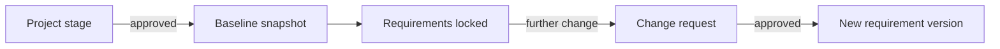

# Change requests and baselines

## What a baseline is

A **baseline** is a permanent snapshot of every requirement that was in draft or reviewed status at the moment a project stage was approved. It answers, reliably and forever, "what did we commit to for this stage" — even if every one of those requirements is later modified through change requests. A stage with an approved baseline can't be deleted, because deleting it would rewrite that commitment out of history.

## Why change requests exist

Once a requirement is locked (Approved or Completed), the only way to change it is a **change request**: a proposal that carries its own reasoning, targets specific fields to change (or proposes an entirely new requirement), and requires an explicit approve/reject decision from a project manager or administrator. This exists so that a requirement's history is always a record of *decisions*, not just edits — every change to something the team has already committed to has a stated reason and a named approver attached to it.

Change requests also carry:

- **Tasks** — short follow-up items (e.g. "update the spec sheet") tied to the change, with an optional assignee and due date.
- **Advisory stakeholder votes** — a visible approve/reject signal from stakeholders that surfaces disagreement without silently overriding the actual decision-maker. The vote itself never approves or rejects anything; only a manager's or administrator's explicit decision does.

## The change-request-only-once-locked rule

A requirement that hasn't yet been approved can still be edited directly — there's nothing to protect yet. The rule only kicks in once a requirement is locked, which is exactly the point at which a spreadsheet-based process would otherwise let someone quietly edit something the team already signed off on. See [Requirements, versions, and the lifecycle](./requirements-versions-and-lifecycle.md) for how locking itself works, and [Workflows → Change requests](../workflows/index.md) for the actual submit/review/approve mechanics.
