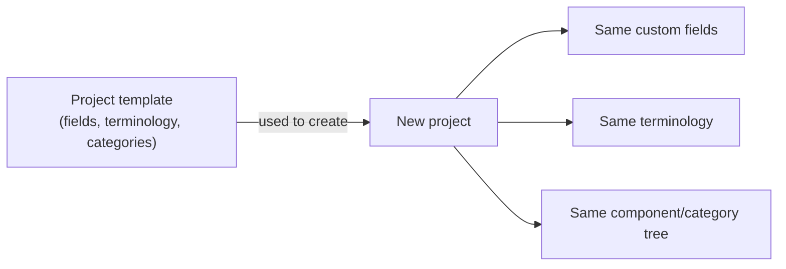

# Custom fields, terminology, and templates

## A team's own vocabulary, without a fork

Every organisation and team has its own attributes it needs to track, and its own words for the concepts this tool already models. Rather than forcing a team to adapt its process to the app's fixed vocabulary — or forking the codebase to add a field — a project can define:

- **Custom fields** — short text, long text, checkbox, or a fixed option list, attached to requirements or change requests. These show up automatically on the create/edit forms and are versioned along with everything else, just like a built-in field.
- **Terminology overrides** — rename how a fixed set of nouns (project, stage, component, category, requirement, change request) are labelled in that project's own UI, so a team that says "feature" instead of "requirement" internally sees its own word throughout.

## Templates carry that setup forward

Defining custom fields and terminology once per project is fine for a single team, but an organisation running many similar projects doesn't want to rebuild the same setup by hand each time. Any project can be marked **usable as a template**; creating a new project from it copies its components, categories, custom field definitions, groups and group memberships, and requirements (reset to draft) into the new project. An organisation can also nominate a **default template**, offered automatically whenever someone creates a new project.

## Why this matters

This is the mechanism that lets ReqTrackManager fit a team's actual process instead of the other way around — without turning every customisation into a one-off, unmaintained fork. See [Core Features](../core-features/index.md) for the full mechanics of defining fields, terminology, and templates.
