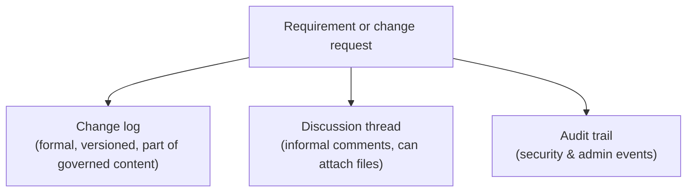

# Discussions, notifications, and audit

## Discussion is not the change log

A requirement or change request has two distinct records of activity, kept deliberately separate:

- **The change log** — the formal, versioned history described in [Requirements, versions, and the lifecycle](./requirements-versions-and-lifecycle.md): who changed what, and when, as part of the governed content itself.
- **The discussion thread** — informal comments (which can carry their own file attachments) for the conversation *around* a requirement or change request: clarifying questions, context, back-and-forth that isn't itself part of the approved content.

Keeping these separate means a project's official history view can show exactly what was formally decided without needing to filter out casual conversation after the fact — and a discussion comment can still be added to a *locked* requirement, since it was never part of that requirement's governed content in the first place.

## Notifications

In-app and email notifications tell people what changed without forcing them to poll the app for it — project joins, stage transitions, change-request activity, permission grants, and more. Each notification type can be configured per person as in-app, email, or both, and email delivery can be instant or batched into a daily digest, so nobody has to choose between "know everything immediately" and "get one email a day."

## Audit

Security- and administration-relevant events — logins, permission grants, password changes — are recorded to an audit trail independent of any one requirement's own change log, giving a project or organisation a record of *who did what* across the system, not just *what changed on this item*.

## Why the separation

Collapsing discussion, formal change history, and security audit into one feed would make each of them worse at its own job: a change log cluttered with chit-chat is harder to audit, and a security audit trail mixed with informal comments is harder to search when it actually matters. See [Core Features](../core-features/index.md) for the day-to-day mechanics of discussion, notifications, and reporting on project history.
