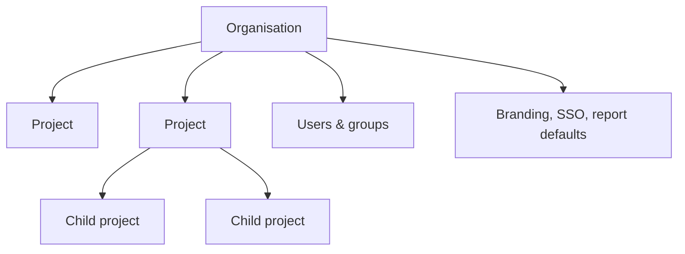

# Organisations and projects

## Containment model

An **organisation** is the top-level container — it owns users, groups, branding, SSO configuration, and every **project** underneath it. A project belongs to exactly one organisation and can optionally have a parent project, so a larger programme can be modelled as a tree of related projects rather than one flat list.

A single user account can belong to more than one organisation at once — an organisation switcher appears wherever an organisation context is needed, regardless of whether the account signed in natively or via one organisation's SSO.

## Roles live at two levels

- **Organisation roles** (`org_admin`, `project_creator`, `member`) govern organisation-wide administration: managing users, groups, SSO, and branding, and — for `org_admin` — seeing which projects exist in the organisation.
- **Project roles** (`project_manager`, `project_administrator`, `stakeholder`, `member`) govern what someone can actually do inside one specific project: author requirements, review and approve change requests, manage project settings, or just view.

The full detail of how these roles combine — including the deliberate gap between "organisation admin" and "can read this project's requirements" — is covered in [Roles, groups, and access control](./roles-groups-and-access-control.md).

## Why the split matters

Keeping organisation-level administration separate from project-level content access lets an organisation admin manage users, SSO, and billing-adjacent settings without that grant silently becoming a backdoor into every project's requirements. It also lets a single deployment host organisations with completely different identity providers, or none at all, without any project's access model needing to know or care which one its organisation uses.

See [Project templates](../core-features/project-templates.md) for how projects are created, archived, and templated, and [Workflows → Organisations and projects](../workflows/organisations-and-projects.md) for the day-to-day mechanics of managing organisations and projects.
