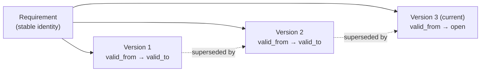

# Requirements, versions, and the lifecycle

## Identity vs. version

A requirement's **identity** — its project, component, category, generated ID (e.g. `SW-PERF-014`), creator, and archival state — never changes once created. Everything that *can* change (name, reasoning, description, status, custom field values, and more) lives on a separate, versioned record. Editing a requirement doesn't overwrite anything; it closes the current version and opens a new one, stamped with when it became current.

This gives a simple mental model with a real payoff: you can ask "what did this requirement say on a given date" and get a real answer, because the current version is just the one row with no `valid_to` yet — every prior version is still there, unmodified. Change requests are built the same way, with their own versioned record.

## The lifecycle

A requirement moves through a fixed sequence of statuses: **Draft** → **Reviewed** → **Approved** → **Completed**, with an **Archived** exit available from Draft or Reviewed. Reaching Approved happens one way only — a project stage being approved (see [Change requests and baselines](./change-requests-and-baselines.md)) — never a direct status edit.

## Locking

Once a requirement is **Approved** or **Completed**, it is locked: the edit form disables itself, and any further change has to go through a formal change request rather than a silent edit. This is what makes a baseline mean something — "approved" is a real commitment, not a label that can quietly drift. The full mechanics of proposing and approving a change to a locked requirement, plus what happens if someone tries to edit one directly, are covered in [Workflows → Authoring and reviewing requirements](../workflows/index.md).

## Why it's built this way

A spreadsheet's "latest" tab has no way to answer "what did we actually approve, and when." Splitting identity from version, and locking a requirement once it's approved, makes that question answerable by construction rather than by discipline — nobody has to remember to keep an audit trail, because there is no code path that lets an approved requirement change without one.
