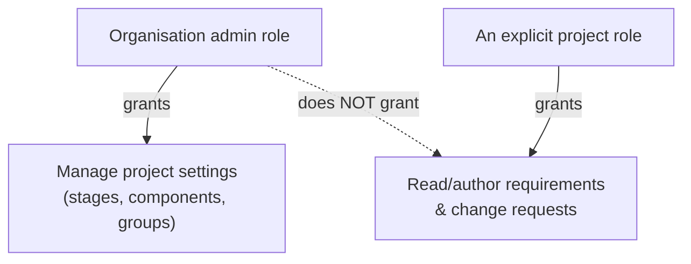

# Roles, groups, and access control

## Two levels of role

Access control is enforced by the server at two levels, and they answer different questions:

- **Organisation roles** — `org_admin`, `project_creator`, `member` — govern administration of the organisation itself: users, groups, SSO, branding, report defaults.
- **Project roles** — `project_manager`, `project_administrator`, `stakeholder`, `member` — govern what someone can do inside one specific project: author and review requirements, approve change requests, manage project settings, or just view.

A project manager implies administrator and stakeholder capabilities on that project, and any assigned role implies baseline (view) access — roles are additive, not a single fixed rank.

## The org admin ≠ automatic content access rule

This is a deliberate, easily-misunderstood design decision worth stating plainly: **being an organisation admin does not, by itself, grant access to a project's requirements or change requests.** An org admin can manage a project's *settings* (stages, components, groups) without an explicit project role, but reading or authoring its *content* requires the same project role assignment anyone else would need.

The reasoning: organisation administration and project content are different trust boundaries. An org admin needs to be able to fix a misconfigured stage or reassign a project's groups without that same access silently becoming a way to read every requirement in the organisation.

## Project groups

Rather than assigning roles to individuals one at a time, a project defines four fixed groups — **Members**, **Project Administrators**, **Project Managers**, **Stakeholders** — that organisation members (or, one level deep, whole organisation-level groups) can be added to directly. This makes onboarding and offboarding a matter of group membership rather than hunting down every individual grant.

## Why fixed roles, not a custom permission builder

The role vocabulary is fixed rather than freely definable. A custom permission-authoring system is a materially larger feature with its own failure modes (a misconfigured custom role silently under- or over-granting access); a small, well-understood set of roles that combine predictably is easier to audit and reason about — which matters more for a tool whose whole purpose is an auditable trail of who could do what, and when.

See [Organisations and projects](./organisations-and-projects.md) for the containment model these roles apply within, and [Workflows → Administering an organisation](../workflows/index.md) / [Administering a project](../workflows/index.md) for the day-to-day mechanics.
