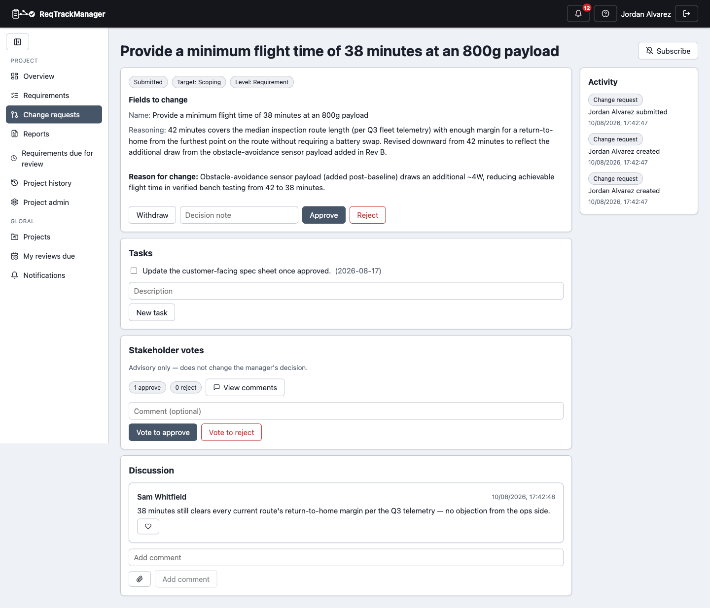

# Change requests

## Creating and submitting

Go to a project's **Change Requests** page to propose a new requirement or a modification to an existing one:

1. **Create**: choose "new requirement" or "modify requirement." For "modify requirement," pick the requirement first, then tick a checkbox for each field to actually change — Name, Reasoning, Clarification, Description, Target version, Level, Review date, Reminder lead time, Assigned reviewer, Custom fields, Attachments. Only ticked fields become editable, each pre-filled from the requirement's current value, and only ticked fields are proposed — anything left unticked is untouched when the change request is approved. For "new requirement," fill in the proposed fields directly. Either way, a reason for the change is required.
2. **Submit** it — this notifies project managers and stakeholders.
3. A manager or administrator **approves** or **rejects** it, with an optional decision note. Approval applies only the ticked fields to the target requirement (creating it, for a "new requirement" change request) and notifies the requester. A proposed attachment is only actually attached to the requirement once the change request is approved.
4. The creator — or a manager, on their behalf — can **withdraw** a change request before it's decided.

By default only stakeholders, administrators, and managers can submit change requests; a project setting (**Project Admin → Settings**) can open this up to ordinary members too.

| Change request detail |
| --- |
| Tasks, advisory stakeholder votes, discussion, and approve/reject |
|  |

## Tasks and stakeholder votes

While a change request is open, anyone with access can:

- Add **tasks** — a short description, an optional assignee and due date, and a done/not-done checkbox — for tracking follow-up work the change implies, like updating a spec sheet once it's approved.
- Cast an **advisory stakeholder vote** (approve/reject, with an optional comment). This is a visible signal for whoever makes the actual decision; it never itself approves or rejects the change request. **View comments** next to the vote tally shows every comment left with a vote.

Like a requirement, every change request also carries its own threaded **discussion** — informal comments distinct from tasks and stakeholder votes — so the reasoning behind a decision lives next to the change itself.

## Filtering the list

As with requirements, clicking a status or target-stage badge in the Change Requests list filters to it, and clicking again clears the filter.

## Where this fits

See [Change requests and baselines](../concepts/change-requests-and-baselines.md) for why the review workflow exists and the locking rule that triggers it, and [Workflows → Change requests](../workflows/index.md) for the end-to-end task walkthrough.
