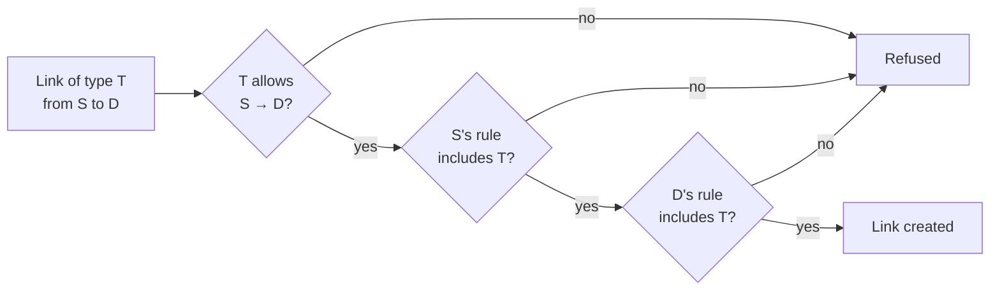
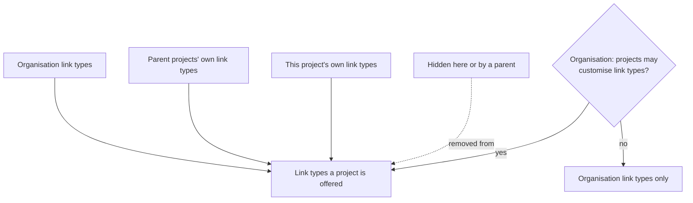

# Links and traceability

Any two records in a project can be linked, whatever their kind: a requirement to a decision, a pain point to a strategy, an action to a persona. A link has a **link type** that says what the relationship means ("Derives from", "Addresses", "Is addressed by"), and it can be read from either end with the wording that fits that end.

## Link types

Organisation admins manage link types under **Admin → Projects & workflow → Link types**. Each has a name for both directions and a [direction](requirements-management.md#traceability-links) (upstream, downstream or none) that traceability views and AI assistants use to answer "where does this come from?" and "what depends on it?". Modules that ship their own vocabulary add link types for it when they are enabled (the Decision Management module adds "Addresses" for a decision and the pain point it addresses, for example); an admin can rename, reclassify or restrict any of them, and your edits are never overwritten.

### Restrict what a link type can join

Out of the box a link type can join any two kinds of record. Under each link type, **Can link from** and **Can link to** limit the kinds of record it may start from and point at, read with the forward name: "Addresses" from *Decision* to *Pain point*. Leave both on **Any artefact** for no restriction.

### Restrict which link types a kind of record can use

The **By artefact type** tab does the opposite: it limits the link types one kind of record may use, for example a Requirement may only be linked with "Derives from" and "Implements". A kind of record with no rule can use any link type. Turning a rule on starts with every link type ticked, so nothing changes until you untick one, and a rule must keep at least one. **Allow any link type** removes it.

Either side can say no, and the message names which rule refused. Restrictions and rules apply **when a link is made**: changing one never deletes or changes a link that already exists. Links that supersede (a decision superseding another) have a fixed meaning and their own action, so they are never offered as a general link and are not affected by rules.

## Link types for one project

A project admin can give their project link types of its own and hide the organisation's ones it never uses, under **Project admin → Fields & actions → Link types**. The organisation's link types and any a parent project defined are listed first, each saying where it comes from; the project's own are below them and are edited exactly like the organisation's (names, direction, **Can link from** and **Can link to**).

- **Own link types** are available in the project and in every project nested under it, in addition to the organisation's. A name that the organisation or a parent project already provides can't be reused; if a parent later adds a name a nested project already uses, the parent's wins and the nested project's is marked *Not offered* (its existing links keep reading as before).
- **Hide** takes a link type out of this project's link pickers, and out of those of the projects nested under it, unless one of them shows it again. It never removes anything: links that already use a hidden type keep showing.
- **By artefact type** works the same way per project. A rule set on a project replaces the organisation's rule for that kind of record entirely (so it can allow more as well as less), and a nested project uses its nearest parent's rule until it sets its own. The pill names where each rule comes from and **Use inherited rule** drops the project's own.

### One shared set for the whole organisation

An organisation that wants every project on the same vocabulary can switch off **Let projects add their own link types and hide the organisation's** (Admin → Projects & workflow → Link types). Asking first, it shows how many project-level link types it affects. Nothing is deleted: project link types, hiding and rules stop applying, project admins see the list read-only, and everything comes back if you switch it on again. Links already made keep showing either way.

## Linking records

Records are linked from the links sections on their pages, and by API clients and AI assistants through one general endpoint that works from either end for any pair of records (the MCP tools `list_artefact_link_types`, `create_artefact_link` and `delete_artefact_link`, in [write mode](../api-integrations/ai-assistants-mcp/overview.md)). A page's own links section may offer fewer kinds of link than the general endpoint does. Both ends must be records of the same project that you can see, and you need permission to manage the kind of record you are linking from. A link between a record and an approved requirement follows the project's [change request rule for links](requirements-management.md#traceability-links) if one is set. A pair already linked the same way is refused, and so is the mirror image of a two-way link type such as "Related to".

## Deleting a link type that is in use

Deleting a link type that links still use opens a dialog that says what depends on it: how many links in how many projects, any pending change requests that propose it, links involving approved requirements in projects that normally require a change request, and the artefact-type rules that name it. You can then:

- **Move the links to another link type.** A replacement that cannot take every link (its own restriction, or an artefact-type rule) is shown but disabled, with the reason. Choosing one whose direction differs warns that this changes what the links mean. A moved link that would duplicate an existing link is merged into it, and the Toast reports how many were moved and merged. Pending change requests proposing the old type are updated to the new one, and rules naming it name the replacement.
- **Delete the links too.** This asks you to type the link type's name, and is unavailable while pending change requests propose the type or when it would leave an artefact type's rule with no link type.

Every link moved, merged or removed is recorded in the audit log.

### Keep it for the projects that use it

When other projects use the link type (a parent's own type used in nested projects, or an organisation link type used by projects), the dialog offers **Keep this link type in the N other projects that use it**, ticked by default. Each branch of projects then keeps a copy of the link type (in its top-most project that uses it, inherited by the projects below), and its links are switched to that copy, so what those projects see doesn't change. If a project already has a link type with the same name, the copy is called "Name (copy)" and the Toast says so. Keeping never needs permission over the other projects; moving or removing links in projects you can't manage is refused (the message gives a count, not names), so keeping is the way to delete such a type. Only the links in the project you are deleting from, or all of them if you untick the box, are moved or removed.
