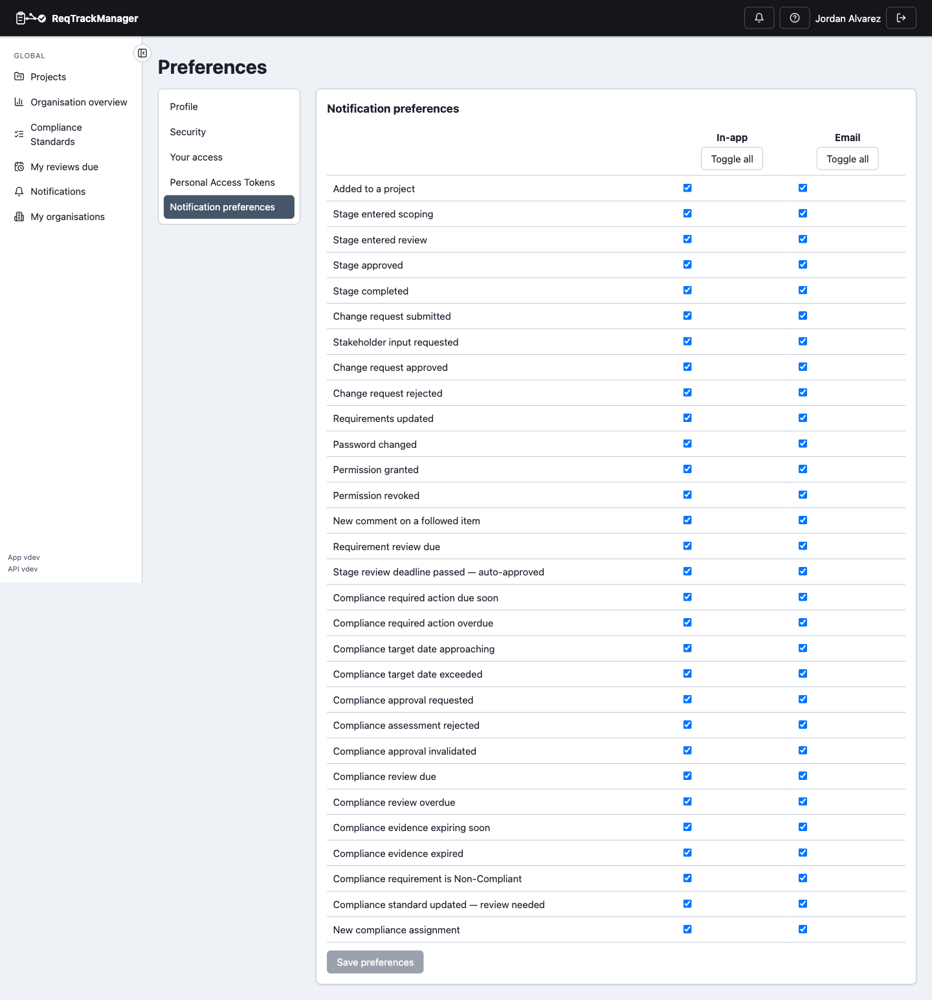
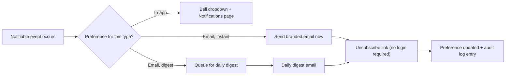

# Notifications and email

## In-app notifications

The bell icon in the top bar shows recent notifications — project joins, stage transitions, change-request activity, password changes, permission grants, and more — with an unread-count badge. Clicking a notification marks it read and, for anything about a specific requirement, change request, or project, jumps straight to it; **Mark all read** clears every unread one without navigating anywhere. The full notification history — searchable, not limited to the dropdown's recent slice — lives on the **Notifications** page in the nav's Global section.

### Membership changes made from outside the project

If an organisation admin (or anyone holding the org-level **grant roles** permission) adds or removes a project member without being a project manager or administrator of that project, the project's managers and administrators — including inherited ones — get a **Project members changed** notification. It covers direct member grants, by-email invites, organisation-group or project-group role grants, and project-group edits (adding or removing members, deleting a group). Changes made by the project's own managers, and changes to who is *inside* an organisation group, do not notify. Several changes by the same person within ten minutes are merged into one unread notification, so adding a whole team does not flood anyone. Like any type, it can be switched off per person under **Preferences**.

## Per-type preferences and digests

**Preferences → Notification preferences** lets each person choose, per notification type, whether they want it in-app, by email, or both, and whether email notifications arrive instantly or batched into a daily digest — so nobody has to choose between "know everything immediately" and "silence."

| Notification preferences |
| --- |
| Per-type in-app/email toggles and instant-vs-digest delivery |
|  |

## Outgoing email

Outgoing email is a branded, self-contained HTML template — light/dark theme aware, with a plain-text fallback and an embedded (not externally hosted) logo — that resolves an organisation's own branding, falling back to the platform default. Every email includes a one-click, no-login **unsubscribe** link that updates the same preference the logged-in Preferences page controls, logged to the audit trail either way.

```mermaid
flowchart LR
    Event[Notifiable event occurs] --> Pref{Preference for this type?}
    Pref -->|In-app| Bell["Bell dropdown + Notifications page"]
    Pref -->|"Email, instant"| Send[Send branded email now]
    Pref -->|"Email, digest"| Queue[Queue for daily digest]
    Queue --> Digest[Daily digest email]
    Send --> Unsub["Unsubscribe link (no login required)"]
    Digest --> Unsub
    Unsub --> Audit["Preference updated + audit log entry"]
```

## Where this fits

See [Discussions, notifications, and audit](../concepts/discussions-notifications-and-audit.md) for the underlying model, and [Workflows → Notifications](../workflows/notifications.md) for the end-to-end task walkthrough.
