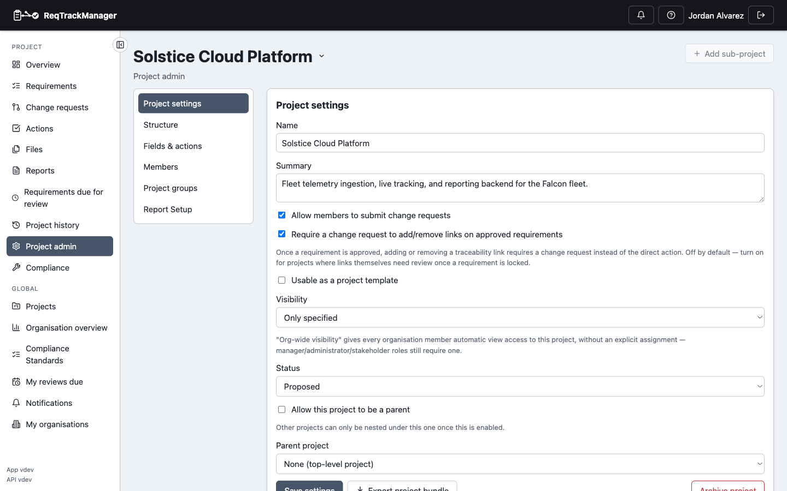

# Project templates

## Marking a project as a template

A project marked **"Usable as a project template"** (**Project Admin → Project settings**) can be used as the starting point for new projects.

| Project settings |
| --- |
| The "Usable as a project template" checkbox, alongside a project's other settings |
|  |

## What a template carries over

Creating a new project **from a template** copies its components, categories, custom field definitions, groups and group memberships, and requirements (reset to draft status) into the new project — so a team's established structure doesn't need rebuilding by hand every time a new project starts.

## Organisation default template

An organisation can also set a **default template** (**Organisation admin → Projects & workflow**), which is offered by default whenever someone in that organisation creates a new project — while any other project marked as usable-as-template remains available as an alternative starting point.

## Where this fits

See [Custom fields, terminology, and templates](../concepts/custom-fields-terminology-and-templates.md) for why this exists, and [Workflows → Organisations and projects](../workflows/index.md) for the end-to-end task walkthrough of creating a project from a template.
