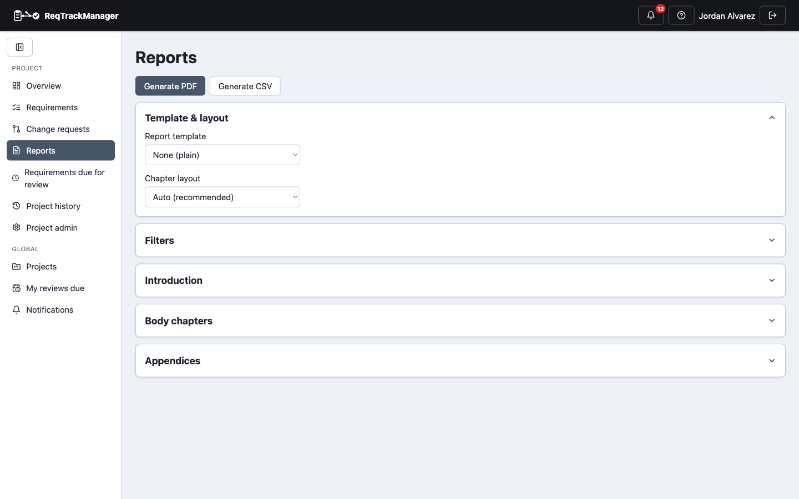

# Reports and export

## Generating a report

A project's **Reports** page generates a PDF or CSV export of its requirements, filtered by component, category, status, or keyword, with the organisation's shared resource files appended as extra sections. A PDF export can use one of the organisation's **report templates** — an accent colour, an optional cover page, footer text, and its own default introduction/chapters/appendices — for consistent, on-brand output across projects.

| Reports |
| --- |
| Filtered PDF/CSV export with a selectable organisation branding template |
|  |

## Report content

**Project Admin → Report Setup** sets the report's introduction and body/appendix chapters, in Markdown or a WYSIWYG rich-text editor — saved per project and reused on every report generated for it, rather than typed fresh each time. A project that leaves any of these blank falls back to that field's organisation-wide default (**Organisation admin → Templates & reports → Report Defaults**), field by field; the Report Setup tab shows "(organisation default)" wherever that's happening. Every one of these editors — including a report template's own content — has an **Insert image** button: pick from the organisation's already-uploaded images, or upload a new one on the spot, and it's included in the generated PDF as its own paragraph.

## CSV export and import

The same Reports page exports requirements as CSV — every field, including custom field values and target stage — and the Requirements page's **Import CSV** wizard reverses the trip, mapping a spreadsheet's columns back onto a project's fields. See [Requirements management](./requirements-management.md#csv-import-and-export) for the import side.

## Where this fits

See [Workflows → Reporting and CSV import/export](../workflows/reporting-and-csv-import-export.md) for the end-to-end task walkthrough, and [Project templates](./project-templates.md) for how report content carries into a newly created project.
