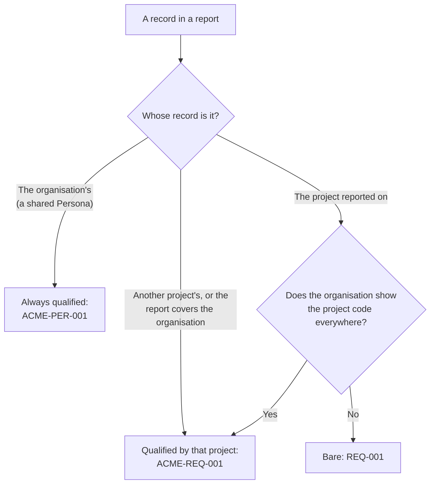
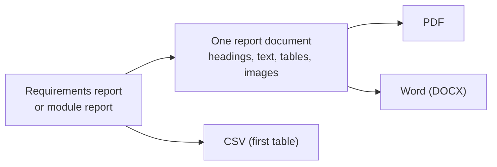
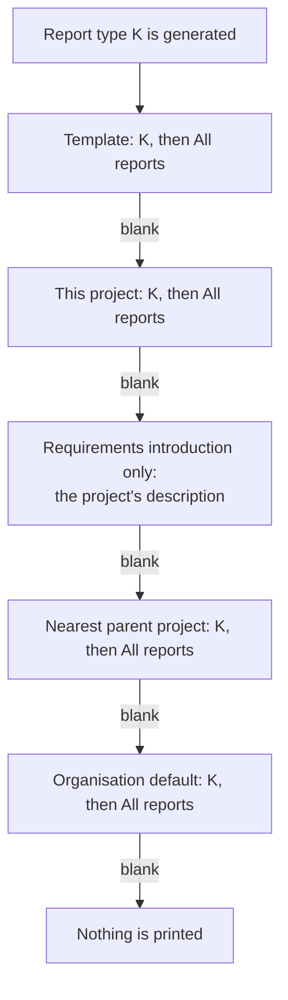
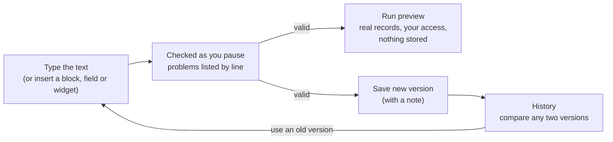
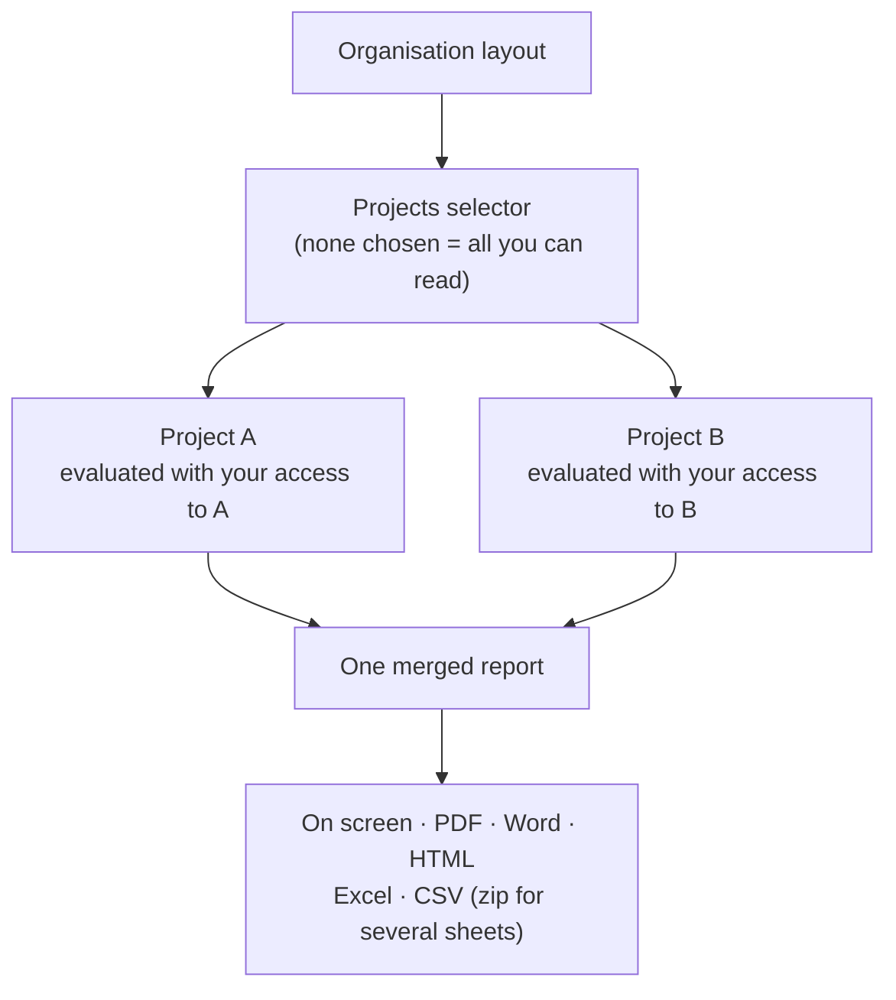

# Reports and export

## Generating a report

A project's **Reports** page generates a PDF, Word (DOCX) or CSV export of its requirements, filtered by component, category, status, or keyword, with the organisation's shared resource files appended as extra sections. **Generate PDF** is the main button; **More formats** offers the Word file and CSV. A PDF or Word export can use one of the organisation's **report templates** — an accent colour, an optional cover page, footer text, and its own default introduction/chapters/appendices — for consistent, on-brand output across projects.

| Reports |
| --- |
| Filtered PDF/Word/CSV export with a selectable organisation branding template |
|  |

A project's Reports page can also offer reports from enabled modules (for example [Context & Strategy's](../modules/context-strategy-module/reports.md) and [Decision Management's](../modules/decision-management-module/reports.md)) in the same **Report** picker, with *Requirements report* listed first. When no module report applies, the picker is hidden and the page is the requirements report alone.

## How reports name records

Every report row that names a record leads with its [record code](../reference/glossary.md#record-code) and ends with the record's [tags](./tags.md), in the PDF, Word file, CSV and on screen alike, so a printed page or a spreadsheet can say *which* `PER-001` it means.

On screen, a long report table shows its first 50 rows with a "Showing 50 of n rows" count and a **Load more** button; the PDF, Word and CSV downloads always contain every row.


```mermaid
flowchart TD
    R["A record in a report"] --> Q{"Whose record is it?"}
    Q -->|"The organisation's<br/>(a shared Persona)"| O["Always qualified:<br/>ACME-PER-001"]
    Q -->|"Another project's, or the<br/>report covers the organisation"| P["Qualified by that project:<br/>ACME-REQ-001"]
    Q -->|"The project reported on"| S{"Does the organisation show<br/>the project code everywhere?"}
    S -->|"Yes"| P
    S -->|"No"| B["Bare: REQ-001"]
```

A report never follows your personal *Show the project code* preference, so a report that is saved, scheduled or shared reads the same for everyone. Notifications also carry the qualified code, because the notification list is read outside any project. The requirement CSV used for [import and export](./requirements-management.md#csv-import-and-export) keeps its plain `unique_code` column, which an import ignores.

## Word (DOCX) export

Every report downloads as an editable Word file with the same content, order and branding as its PDF, so it can be edited after download. Both formats are built from one shared document, so they cannot drift apart.


```mermaid
flowchart LR
    R["Requirements report<br/>or module report"] --> D["One report document<br/>headings, text, tables, images"]
    D --> P[PDF]
    D --> W["Word (DOCX)"]
    R --> C["CSV (first table)"]
```

- **Colour carries over:** a cell the screen colours as a badge (a status, a rating band, a matrix cell) is filled in the same colour in the PDF and Word file, and the word stays in the cell so a black-and-white print still reads. The text colour is chosen for contrast: white on a dark fill, black on a light one. The same applies to the header row, and a cover-page title in a very light accent colour is darkened so it stays readable on white paper, whatever accent colour your report template uses. The CSV is text only.
- **Editable structure:** real Word heading styles (insert a table of contents from them), real tables with a shaded header row that repeats on each page, bullet lists, and a footer with page numbers. A branding template's accent colour, cover page, logo and footer text apply. Module reports use landscape pages; the requirements report is portrait.
- **Text is shown as written:** Markdown headings, paragraphs, bullet lists and own-line images are laid out; inline formatting such as `**bold**` is not interpreted in either format. Characters Word cannot store (control characters) are dropped.
- **Languages in the PDF:** Latin, Latin Extended (for example Polish), Cyrillic and Greek print correctly. Arabic and Indic scripts are not shaped and Chinese, Japanese and Korean have no font in the PDF, so use the Word file for those; the Word file stores the text as written.
- **Images** are the organisation's shared images only, as in the PDF.
- **Document properties** carry the title and "ReqTrackManager" as author, never a person's name.

## Report content

Each report type has its own **introduction**, **body chapters** and **appendices**: a requirements report and a decision log need different openings, so content is written per report type rather than once for everything. A PDF or Word file prints the introduction and chapters first, then the report itself, then the appendices. CSV and on-screen (JSON) output carry none of it.

Content can be written at three levels, each with a **Report type** drop-down (the requirements report, then each enabled module's reports) led by **All reports**, the content used by any report type that has none of its own at that level:

| Level | Where | Applies to |
|-------|-------|-----------|
| Report template | Organisation admin → Templates & reports → Report templates | Any report generated with that template |
| Project | Project Admin → Report Setup | Reports generated for that project |
| Organisation default | Organisation admin → Templates & reports → Report Defaults | Any project that, with its parent projects, sets none |

Introduction, chapters and appendices resolve independently. Each takes the first non-blank value in this order, so a template's content wins over a project's, and so on down:


```mermaid
flowchart TD
    A["Report type K is generated"] --> T["Template: K, then All reports"]
    T -->|"blank"| P["This project: K, then All reports"]
    P -->|"blank"| D["Requirements introduction only:<br/>the project's description"]
    D -->|"blank"| N["Nearest parent project: K, then All reports"]
    N -->|"blank"| O["Organisation default: K, then All reports"]
    O -->|"blank"| B["Nothing is printed"]
```

| Report Setup | Report Defaults |
| --- | --- |
| Blank fields name their source: the project's description, its parent project, the organisation | Organisation defaults, written separately for each report type |
|  |  |

A child project that sets nothing for a report type therefore uses its parent project's (then the grandparent's, and so on), then the organisation's. In **Report Setup**, each blank field names where its content comes from (for example "Inherited from *Parent programme*" or "Organisation default (*Acme*)") and previews it; once a project writes its own, **Use inherited** gives it back. The generation page fills its editors with the content that applies and lets you change it for that one report.

Every editor has an **Insert image** button: pick from the organisation's already-uploaded images, or upload a new one on the spot, and it's included in the generated PDF or Word file as its own paragraph. Images used by report content travel with an organisation or project export.

### Placeholders

These can be typed in any introduction, chapter title or body, or appendix, and are replaced when the report is generated:

| Placeholder | Becomes |
|-------------|---------|
| `{{project_name}}` | The project's name (the organisation's name for an organisation-wide report) |
| `{{report_title}}` | The title printed on the report |
| `{{generated_on}}` | The generation date, `YYYY-MM-DD` |
| `{{organisation}}` | The organisation's name |

Anything else in double braces is printed as written. Placeholders are plain text replacement, not a template language: the replaced value is shown as ordinary text and cannot add formatting.

## Record list report

For any other kind of record, the **Reports** picker offers **Record list**: choose a **Record type** (Requirements, Actions and every other list that has a table), optionally a **Tag**, and, on a project with parent or child projects, which **Projects** to include. The page shows the table, with the record's code first, and **Export** downloads it as a PDF, Word file or CSV. The same PDF and Word files are in each list's own **Export** menu, where they carry that list's current filters. A status or rating that is coloured on screen is coloured in the PDF and Word file too, and also written out in words. Columns holding personal data appear only when your organisation's policy and your role allow it, and the report says when some were left out. A PDF or Word file covers up to 5,000 records; for more, download the CSV or narrow the filters.

## Custom reports

A **custom report** is a report layout somebody designed: a document (headings, text, tables, and for each record its linked records) or a set of tables. Layouts are written for an organisation, which every project can run, or for one project (a child project also sees its parents'). Each appears in the **Report** picker under **Custom reports**, beside the module reports (a project can hide an organisation layout it does not want to offer). A layout never shows more than you could already read: records you cannot open are counted in a note ("2 record(s) not shown") and never named.

Layouts are written in the [designer](#designing-a-layout), opened from **Report layouts** in a project's **Report Setup** or the organisation's **Templates & reports**; they can also be created through the REST API, or by an AI assistant that has the [MCP tools](../api-integrations/ai-assistants-mcp/overview.md) in write mode. A layout can have its own introduction, chapters and appendices (the **Report type** drop-down in Report Setup and Report Defaults lists it by name), and a PDF or Word download uses the chosen branding template as for any report.

### Designing a layout

**Report layouts** lists a project's own layouts, those shared by its parent projects and by the organisation, and, for an organisation, its own. Choose **New layout**, give it a name and say whether it is a **Document** (headings, text and tables, for PDF, Word or HTML) or a **Table** (one or more plain tables, for Excel or CSV); the kind cannot be changed later. A layout shared from elsewhere opens read-only: **Make a copy** to change it for this project, or **Hide in this project** and bring it back with **Add organisation defaults**.

The designer shows the layout as text. Each block is a line starting with `@`, and `{{req.title}}` puts a field of a record in the text.

```text
@layout document

@heading Requirements of {{project_name}}

@each requirement sort title as req
  @heading level=2 {{req.code}} {{req.title}}
@end
```


```mermaid
flowchart LR
    T["Type the text<br/>(or insert a block, field or widget)"] --> C["Checked as you pause<br/>problems listed by line"]
    C -->|valid| P["Run preview<br/>real records, your access,<br/>nothing stored"]
    C -->|valid| S["Save new version<br/>(with a note)"]
    S --> H["History<br/>compare any two versions"]
    H -->|use an old version| T
```

- **Problems** are listed by line and column; choosing one puts the cursor there. **Save new version** and **Run preview** wait until the text is valid. A layout's first line must declare its own kind (`@layout document` or `@layout table`).
- **Insert block** buttons add a heading, text, *for each record*, a group, a table, an *if*, an equation or a page break at the cursor (a sheet for a table layout). The **Fields** tab lists what `{{name.field}}` can use at the cursor, using the name after `as` of the block you are in, and the global placeholders such as `{{project_name}}`. The **Widgets** tab lists the report components you can embed, with each report's settings, and inserts the finished line.
- **Preview** runs the layout as you, on the real records, and shows a document as it will print or a table layout's first rows of each sheet (with the real row count). It stores nothing, and a project preview can include child projects while an organisation preview can be limited to chosen projects.
- **Saving** adds a version with an optional note. If somebody saved while you were editing, you are told and can reload their version; nothing is overwritten. Leaving with unsaved changes asks first.
- **History** lists every version and compares any two line by line (added lines start with `+`, removed with `-`). **Use this version as the new text** puts an old version in the editor; saving it adds a new version, so history is never rewritten.
- Organisation administrators can design organisation layouts, and project administrators their own project's; others can run layouts but not open the designer.

| Run | What you get |
| --- | --- |
| A project's Reports page | The layout for that project; **Include child projects** adds the readable child projects |
| The organisation overview's Reports group | An organisation layout evaluated once for **each project you can read**, merged into one report: a document has a heading and a new page per project, a table layout a leading *Project* column |


```mermaid
flowchart TD
    L["Organisation layout"] --> S["Projects selector<br/>(none chosen = all you can read)"]
    S --> A["Project A<br/>evaluated with your access to A"]
    S --> B["Project B<br/>evaluated with your access to B"]
    A --> M["One merged report"]
    B --> M
    M --> O["On screen · PDF · Word · HTML<br/>Excel · CSV (zip for several sheets)"]
```

- **Formats:** a document layout downloads as PDF, Word or a standalone HTML page (no scripts, safe to open or email); a table layout as an Excel workbook (one tab per sheet) or CSV, which is a zip of one CSV file per sheet when the layout has several sheets. Text a cell starts with `=`, `+`, `-` or `@` is stored as plain text, never run as a formula. The on-screen view shows each table of the report as a section, titled by the headings above it.
- **Choosing projects:** the **Projects** selector lists exactly the projects you hold a role in; downloads carry the same choice as the screen. A project that has hidden the layout is left out, and the report says so.
- **Equations:** write an equation on its own line with `@equation \frac{a}{b} = c`, or inside a text line between `\( ... \)` (inline) or `$$ ... $$` (display). Equations are drawn in the preview, the HTML page and the PDF, and are native, editable equations in Word when the equation is one Word handles (otherwise a picture). A record field shows equations too when it is one people write them in (a requirement's description, reasoning and clarification), including in a table column; any other record text, such as a title, is never read as an equation. Equations work in headings, list items and table cells as well as paragraphs (a `$$ ... $$` there is drawn inline); Excel and CSV tables keep the TeX as text. The same equations are typeset on a requirement's page once it is locked. Only a set of common commands is accepted (Greek letters, operators, fractions, roots, subscripts, matrices and the like); `\href`, `\input` and anything else is refused when you save. An equation that cannot be drawn is printed as you wrote it, with a warning on the run.
- **Embedded report tables (widgets):** a document layout can include a table, the headline figures or the notes of any module report, such as the Risk register's table of Risks or the Context & Strategy summary's figures, as a line of its own, `[[widget.context_strategy.summary.figures stale_months=12]]`. A widget is only the component: the headings and the sentences around it are the layout's own, so the same table can sit under different words in different reports. It keeps the report's cell colours, can be ordered by one of its columns (`sort "Next review" desc`; numbers sort as numbers, dates as dates, other text without regard to case) and can say what to show when it is empty (`empty "No risks recorded."`). It is produced for the project being reported on, so a project that has switched the module off shows a note that the report is not available there and the rest of the layout still runs. The list of components (with each report's settings) comes from the REST API or the `list_report_widgets` MCP tool; a layout can run up to 20 different reports (components of one report with the same settings share a run).
- **Choosing which records a layout lists:** a layout's `where` can combine tests with `and`, `or`, `not` and brackets, and test a field against a list: `category in Safety, Security` or `status not_in draft, rejected`, on any field that has a value to compare (text, status, person, number, date), so "every category except General" and "these three categories in one table" are both a single line. A record with no value for the field counts as not in the list.
- **Limits:** a report that is too large or takes too long is refused with a message to narrow the layout or the project choice; nothing partial is produced.
- **Provenance:** every run is recorded (which layout and version, who ran it, when, which projects, how many records of each kind, the version of each versioned record such as a requirement, and a fingerprint of all the records used) without storing the report's content, so a report can be traced back to what produced it. Layouts are versioned: saving a change adds a version and never rewrites an earlier one.
- Layouts, and their introductions, chapters and appendices, travel in a project or organisation [export](./zip-export-import.md).

## CSV export and import

The same Reports page exports requirements as CSV — every field, including custom field values and target stage — and the Requirements page's **List actions** menu (CSV that re-imports and updates records by code) reverse the trip, mapping a spreadsheet's columns back onto a project's fields. See [Requirements management](./requirements-management.md#csv-import-and-export) for the import side.

## Where this fits

See [Workflows → Reporting and CSV import/export](../workflows/reporting-and-csv-import-export.md) for the end-to-end task walkthrough, and [Project templates](./project-templates.md) for how report content carries into a newly created project.
