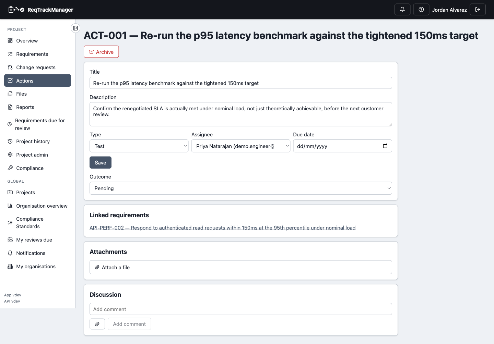

# Requirement actions

A requirement action is a required task — a review, a test, or any other project-defined activity — needed to satisfy one or more requirements. It's distinct from a requirement's own review-date/outcome fields (a single recorded outcome tied to one requirement's scheduled review): an action has its own first-class, project-scoped identity, its own `ACT-NNN` code, and its own discussion thread and file attachments, so a single action — one test run, one audit — can be linked from several requirements at once instead of belonging to exactly one.

| Action detail |
| --- |
| An action's outcome, assignee, due date, linked requirements, and discussion |
|  |

## Creating and linking actions

Go to a project's **Actions** page and click **New action**. Give it a title, pick an **action type** (project-defined, e.g. "Review" or "Test" — configured in **Project Admin → Fields & actions**), and optionally an assignee and due date. From the action's detail page, link it to any requirement it helps satisfy — unlinking removes that association without deleting the action itself, since it may still be linked elsewhere.

## Outcomes

An action's outcome is Pending, Completed, or Failed — recorded from its detail page, stamping who recorded it and when. Unlike a requirement, an action has no versioned content of its own: it's a task with a lifecycle state, not something that goes through draft/review/approval.

## Filtering and archiving

The Actions list filters by type and outcome, and **Include archived** brings back actions that have been archived rather than deleted — actions, like requirements, are never hard-deleted, only archived, so the record of what was done is preserved.

## Where this fits

See [Requirements management](./requirements-management.md) for how a requirement itself is authored and reviewed, and [Workflows → Requirement actions](../workflows/requirement-actions.md) for the end-to-end task walkthrough.
