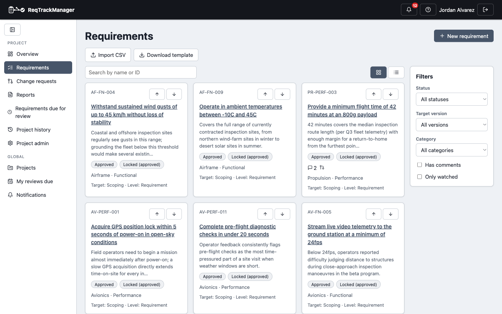

# Requirements management

## Creating and organising requirements

Open a project's **Requirements** page (or click **New requirement** on the project overview). Pick a component, then a category belonging to that component — categories live under a single component, so the category list narrows to match whichever component is picked and resets if it changes — and the two prefixes combine into the requirement's identifier, e.g. `SW-PERF-014`. Every requirement needs a **target version** (the create form pre-fills the project's first stage rather than leaving it blank) and a **level** (Requirement, Recommended, or Optional), plus a name and, optionally, reasoning, a free-text description, and any project-specific custom fields.

| Requirements list |
| --- |
| Status, target version, and category filters; click a status badge to filter, click again to clear |
|  |

While the project's current stage is still in scoping, requirements within a component/category can be **reordered** with up/down arrows.

## The requirement detail page

Opening a requirement shows its full detail: name, reasoning, clarification, description, custom field values, an editable form (disabled once locked), its full version history — including who made each change — a discussion thread, traceability links to other requirements, and file attachments.

| Requirement detail |
| --- |
| Editable fields, version history, and a discussion thread for one requirement |
|  |

Once a requirement is locked (Approved or Completed), the edit form disables itself with a "Locked" badge, and further changes go through a [change request](./change-requests.md) instead — see [Requirements, versions, and the lifecycle](../concepts/requirements-versions-and-lifecycle.md) for why.

## Traceability links

Requirements can be linked to each other with a typed, bidirectional relationship — e.g. "Derives from" / "Is the source of" — for real traceability between requirements, beyond the 12 seeded default link types (an organisation can define more from its admin page). A link between two approved requirements can itself be made to require a change request to add or remove, via a per-project setting, for teams that want link changes reviewed the same way content changes are.

If the [Decision Management module](../modules/decision-management-module/overview.md) is enabled, a requirement can also be linked to a Decision ("Implements"/"Affects") — see [Decision Management → Relationships and templates](../modules/decision-management-module/relationships-and-templates.md) — recording which formal decision produced or affects a given requirement, separately from requirement-to-requirement traceability above.

## Review scheduling and completion

A requirement can carry a review date and an assigned reviewer. Once the date passes, it appears on the assigned reviewer's **My reviews due** page and the project's own reviews-due page until someone records an outcome — met, or failed with a required comment explaining why — from the requirement's detail page.

Separately from approval, a project manager can mark an approved requirement **Completed** (and uncomplete it to correct a mistake), tracking which approved requirements have actually been delivered and verified rather than just baselined.

## CSV import and export

Click **Import CSV** on the Requirements page, choose a file, then map its columns to the required fields (name, component, category — matched by prefix within that component — plus optional reasoning, level, and target version). A live preview shows the first few rows under the mapping before anything uploads, with required fields called out; **Download template** produces a starter CSV pre-filled with the project's own component/category prefixes. Rows that omit a target version default to the project's first stage, the same as creating a requirement directly. Export works the same way in reverse — a full-fidelity CSV of every field, including custom field values and target stage — so requirements can round-trip to and from a spreadsheet without hand-retyping anything.

## Where this fits

See [Change requests](./change-requests.md) for how a locked requirement is modified, [Stages and baselining](./stages-and-baselining.md) for how locking itself is triggered, and [Workflows → Authoring and reviewing requirements](../workflows/authoring-and-reviewing-requirements.md) for the end-to-end task walkthrough.
