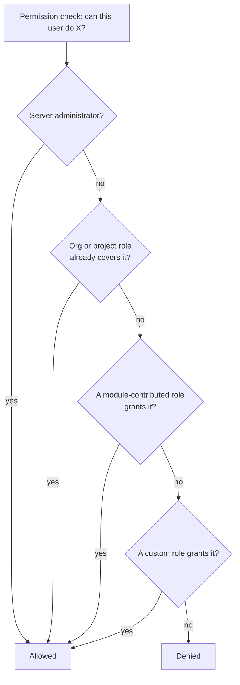
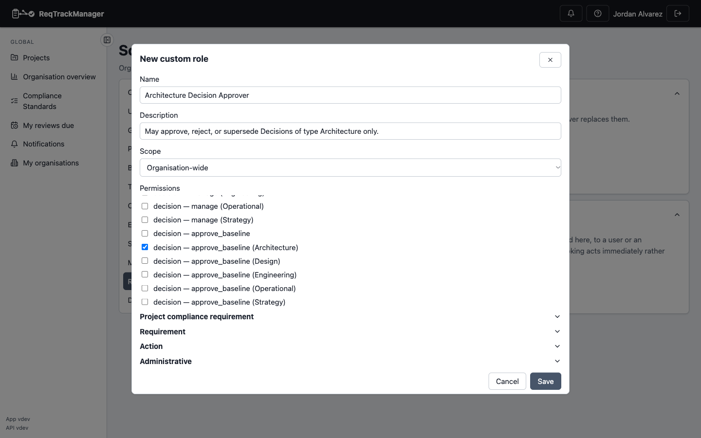

# Role Management

## What a permission atom is

Underneath the fixed organisation and project roles (see [Roles, groups, and access control](../concepts/roles-groups-and-access-control.md)), every access check in ReqTrackManager ultimately comes down to a **permission atom**: an artefact type (Requirement, Change Request, Decision, and so on), crossed with one of four tiers — **View**, **Propose-Create**, **Manage**, or **Approve-Baseline** — and, for artefact types that have one, an optional **sub-type** (for example a specific Decision Type). View is independent of the write tiers: a role can hold view-only access to something without any ability to create, edit, or approve it.

A **custom role** is simply a named set of these atoms that an organisation admin defines directly, without waiting on a new release — an additional way to grant access, alongside the fixed and module roles that already exist.

## How a custom role composes

A custom role never replaces or narrows the fixed and module roles — it only ever **adds** capability on top of them. Whatever a fixed or module role already grants continues to work exactly as before; a broader existing tier always still satisfies a narrower permission check with no separate grant needed. Every organisation that never creates a custom role sees no change in behaviour at all.

Each of these four paths — server admin, org/project role, module-contributed role, custom-role grant — resolves independently; a caller only needs to satisfy one of them. A custom role can be granted directly to a user, or to an organisation group so that everyone in the group holds it.

**The governing invariant: a custom role can never grant more than an organisation admin already has, and it is never usable outside the organisation that defined it.** Custom roles cannot be used to escalate beyond what already exists in the organisation, and one organisation's custom roles have no effect anywhere else.

## Creating and granting a role

From an organisation's admin page, under **Role management**, an org admin defines custom roles in the **Custom roles** section — a name, a description, whether it applies organisation-wide or to a specific project, and the set of permission atoms it grants, picked from a grouped checklist covering every artefact type.

| Defining a custom role |
| --- |
| Name, description, scope, and the permission-atom picker |
|  |

Only an organisation admin can create, edit, or delete a custom role definition — this is never delegable through any permission atom.

Granting an existing role — fixed, module, or custom — to a user or an organisation group is a separate, more widely delegable action, covered by the **Grant roles** section on the same page. This page is named "Role Management," not "Custom Roles," precisely because it covers both.

## What `grant_roles` lets a delegate do

`grant_roles` is itself a permission atom, so an org admin can grant it to someone else without making them a full org admin. A holder of `grant_roles` can assign **any** existing role — fixed, module, or custom — to any user or group, with two deliberate exceptions that stay admin-only regardless: **Organisation Admin** and **Module Administrator** can never be granted this way, only by an existing holder of that same role (or a server admin).

Stated candidly, the same way this is documented internally: because assignment through `grant_roles` is otherwise unrestricted, a holder of it could assign an existing broad role to themselves or to someone else. This is a real, deliberate scope of the permission, not an oversight — the blast radius is always bounded by whatever the organisation's roles already grant, since `grant_roles` can only assign a role that already exists, never mint a new permission combination. See the policy link below for the full residual-risk write-up.

## Per-Decision-Type approval scoping

By default, the Decision Management module's **Decision Approver** role works exactly as it always has: a flat, project-wide grant that lets its holder approve, reject, or supersede any Decision in that project, whatever its Decision Type. Nothing changes for a project that doesn't touch Role Management.

An organisation that wants to restrict approval to specific Decision Types — "only an Architecture Approver may approve an Architecture decision" — can now do so without any Decision-Management-specific admin surface: define (or edit) a role scoped to the Decision — Approve-Baseline permission atom for that one Decision Type, and grant it through this same Role Management page. A role holding the unscoped Decision — Approve-Baseline atom (which is what the flat Decision Approver role grants) continues to satisfy every specific Decision Type's check, since a broader, unscoped grant always satisfies a narrower, sub-type-specific one — only the reverse doesn't hold.

## Where this fits

See [Roles, groups, and access control](../concepts/roles-groups-and-access-control.md) for the fixed org/project roles this capability builds on, [Modules → Decision Management → Overview](../modules/decision-management-module/overview.md) for the Decision Approver role in context, and [`docs/soc2/policies/access-control-policy.md`](https://github.com/ballardr/reqtrackmanager/tree/main/docs/soc2/policies/access-control-policy.md) for the full authorization-policy account, including the `grant_roles` residual risk documented as its own explicit item.
