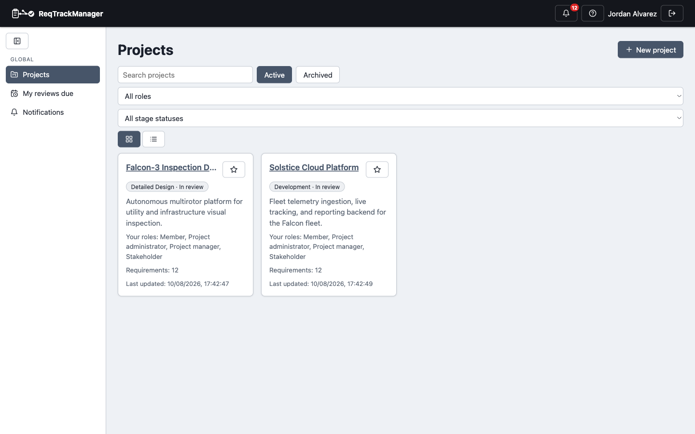
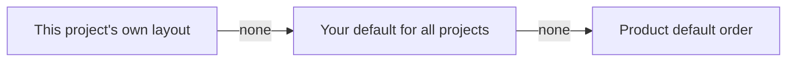

# Search, filtering, and view-mode persistence

## Search and filters

The **Projects** list is searchable by name/summary and filterable by active/archived status, by role on the project, by the project's current stage status, and — for anyone belonging to more than one organisation — by which organisation it's in. Favourited projects always sort to the top regardless of any other filter or search applied. The **Requirements** and **Change Requests** lists work the same way: search by name or ID (change requests also match on their reason and target requirement), and click a status (or target-stage) badge to filter the list to it — click it again to clear the filter, rather than needing a separate "clear filters" control.

| Projects dashboard |
| --- |
| Favourites, role/stage filters, and a choice of tile, list, or tree view |
|  |

## View modes

The Projects list offers **tile**, **list**, and (for an organisation with hierarchical projects) **tree** view; the Requirements list offers tile and list view. Each page remembers its own view-mode choice independently — switching Projects to list view doesn't change what Requirements shows, and the choice persists across visits rather than resetting to a default every time the page loads.

## Project navigation order

The **Project** section of the left navigation (Overview, Requirements, Actions, and any enabled module's pages) can be reordered per user. Select the sliders icon beside the section label (in the icon-only rail, the **Customise navigation** row at the bottom of the section) to open the editor:

- **Reorder** with the up/down buttons on each row.
- **Move to More** for rarely used items. They sit behind a **More** disclosure (a popup when the rail is icon-only) and are never removed. **Overview** and **Project admin** cannot be moved into More, so there is always a way to reach admin.
- **Apply to**: *All projects* saves your personal default; *Only this project* saves a layout for that project alone. **Remove this project's own layout** drops the override.
- The page you are on is always shown, even if its link is under More.
- A module you enable later appears in its default position rather than being hidden.

The choice is stored with your account, so it follows you across devices.

## Where this fits

These controls appear throughout [Requirements management](./requirements-management.md), [Change requests](./change-requests.md), and the Workflows section's task walkthroughs (see [Authoring and reviewing requirements](../workflows/authoring-and-reviewing-requirements.md) for the requirements list in context) — this page exists as a single reference for behaviour that's otherwise repeated on nearly every list in the app.
