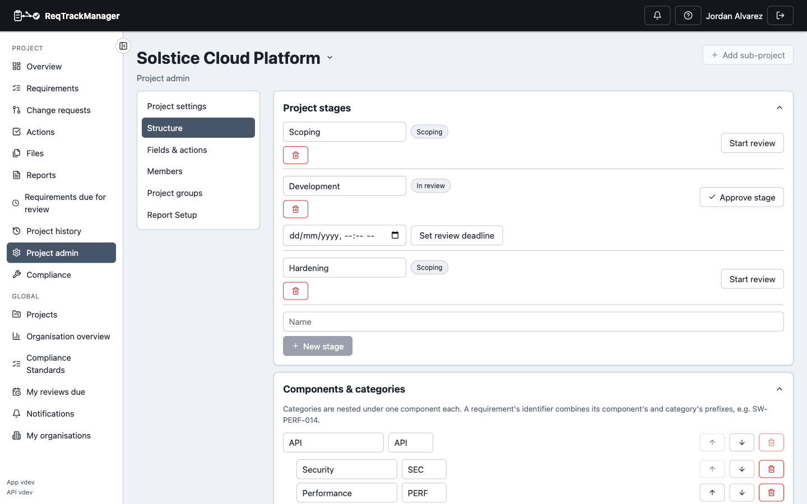

# Stages and baselining

**Project Admin → Structure** shows a project's stage sequence (e.g. Scoping → Development → Hardening). Approving a stage:

- **Baselines** every non-archived requirement still in draft or reviewed status, snapshotting its current version.
- **Locks** those requirements — from this point, they can only change via a [change request](./change-requests.md).

| Project stages |
| --- |
| A project's stage sequence, with review/approve actions per stage |
|  |

## Renaming and deleting stages

Anyone who can create a stage can also rename it inline or delete it. Deleting a stage requires picking another existing stage to reassign everything currently targeting it to — every requirement (and its full history, not just its current version) and every pending change request proposing that stage moves to the one picked. A stage with an approved baseline can't be deleted at all, since that would rewrite a permanent record of what was approved; if it's the project's only stage, there's nothing to reassign to either, so deletion is blocked either way.

## Review deadlines and stage completion

A stage in review can be given a **review deadline**: stakeholders record an explicit approve/reject response before it passes, and if the deadline passes with no rejection, the stage is automatically approved — silence is treated as approval. An explicit rejection blocks the auto-approval and leaves it for a manager to resolve manually.

Once a stage's work is delivered, a project manager can mark the **stage itself completed**, optionally cascading completion to every approved requirement targeting it.

## Where this fits

See [Change requests and baselines](../concepts/change-requests-and-baselines.md) for what a baseline is and why it exists, and [Workflows → Stages, baselining, and reviews](../workflows/index.md) for the end-to-end task walkthrough.
