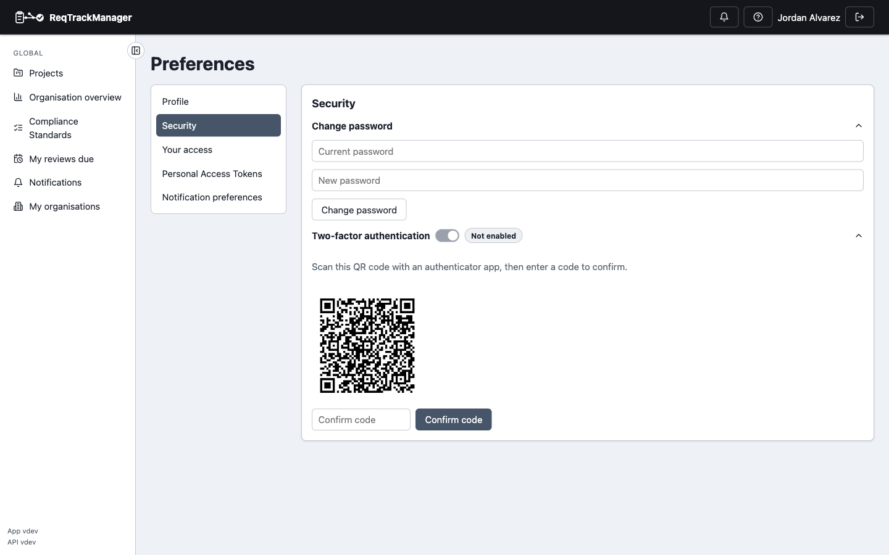

# Two-factor authentication

## Enabling 2FA

From **Preferences → Security**, toggle **Enable 2FA** to reveal a QR code — scan it with an authenticator app (Google Authenticator, 1Password, etc.), then enter the generated code to confirm. 2FA isn't actually enabled until that confirmation code is accepted; scanning the code alone doesn't turn it on.

| Two-factor authentication setup |
| --- |
| Scan the QR code with an authenticator app, then confirm with a generated code |
|  |

Once enabled, signing in becomes a two-step process: password first, then a code from the authenticator app — a second factor, not a replacement for the password.

## Organisation-enforced 2FA

An organisation can require every member to have 2FA enabled (**Organisation admin → Security → Advanced settings**). If a member's organisation requires it and they haven't set it up, they can still sign in and reach **Preferences → Security** to turn it on, but nothing else in that organisation works until they do — the requirement is enforced server-side, not just suggested in the UI.

## Where this fits

See [Roles, groups, and access control](../concepts/roles-groups-and-access-control.md) for how 2FA fits into the broader access-control model, and [Workflows → Two-factor authentication](../workflows/index.md) for the end-to-end task walkthrough.
