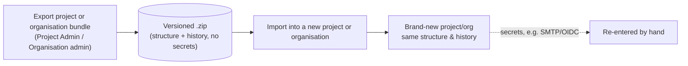

# Zip export/import

A project — or an entire organisation — can be exported as a self-contained, versioned zip bundle and re-imported to stand up a brand-new project or organisation. It's meant for backup, offboarding, or migrating between organisations or deployments, not for round-tripping the same project back into itself.

## What's included

The bundle carries the full structure and history: components, categories, custom field definitions, requirements with their complete version history, change requests, baselines, review outcomes, and file attachments. **Restricted**-classified secrets — SMTP/OIDC credentials, password hashes — are deliberately never included, so they're re-entered by hand after a restore rather than travelling inside the export file.

## What's excluded, and why

Project-level **group membership** is deliberately excluded — only group structure (the groups themselves) is recreated on import, not who's in them — to avoid a cross-tenant privilege-escalation path where an exported bundle could silently grant access on import to accounts that exist in the target deployment but shouldn't inherit membership from the source. Members are re-added by hand after an import, the same as secrets.

## Exporting and importing

**Export**: a project's **Export project bundle** button lives in **Project Admin → Project settings**; an organisation's **Export organisation bundle** is under **Organisation admin → Organisation actions**.

| Export project bundle |
| --- |
| The export action lives alongside a project's other settings |
|  |

**Import**: from **Organisation admin → Import into this organisation**, choose a previously exported zip file to stand up a new project (or, for an organisation-level bundle, a new organisation) from it.

## Where this fits

See [Enterprise & Security](../enterprise-security/index.md) for the retention/disposal reasoning behind what an export can and can't carry, and [Project templates](./project-templates.md) for the other, template-based way to seed a new project's structure without history.
