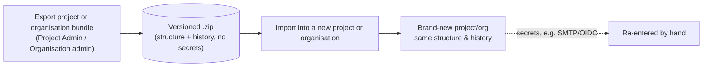
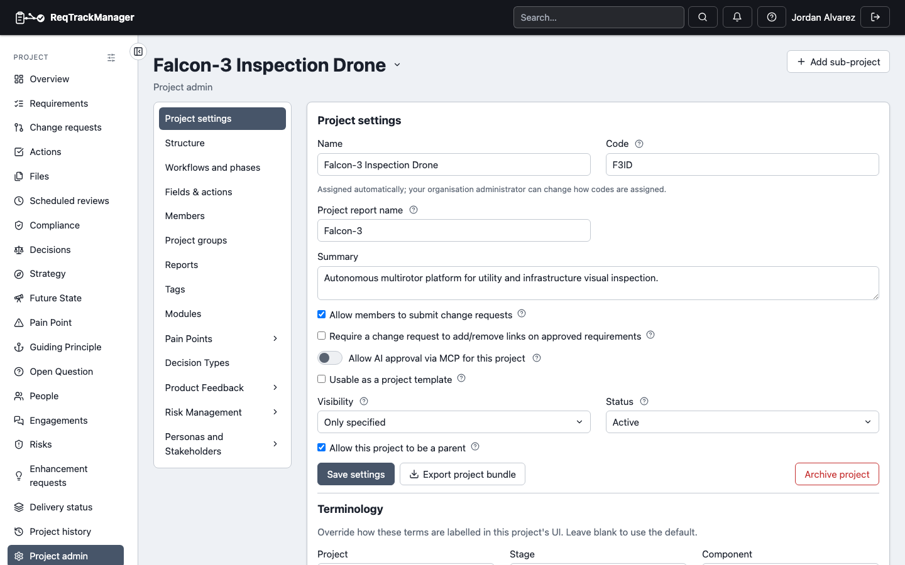
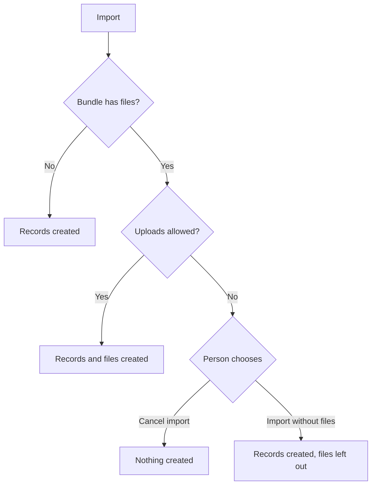

# Zip export/import

A project — or an entire organisation — can be exported as a self-contained, versioned zip bundle and re-imported to stand up a brand-new project or organisation. It's meant for backup, offboarding, or migrating between organisations or deployments, not for round-tripping the same project back into itself.

## What's included

The bundle carries the full structure and history: components, categories, custom field definitions, requirements with their complete version history, change requests, [requirement actions](requirement-actions.md) (the project's action types, each action with its outcome, assignee, due date, comments, attachments, tags and components, and its links to requirements), baselines, review outcomes, and file attachments. **Restricted**-classified secrets — SMTP/OIDC credentials, password hashes — are deliberately never included, so they're re-entered by hand after a restore rather than travelling inside the export file.

```mermaid
flowchart LR
    Export["Export project or organisation bundle\n(Project Admin / Organisation admin)"] --> Zip[("Versioned .zip\n(structure + history, no secrets)")]
    Zip --> Import["Import into a new project or organisation"]
    Import --> New["Brand-new project/org\nsame structure & history"]
    New -.->|"secrets, e.g. SMTP/OIDC"| Manual["Re-entered by hand"]
```

Owners, reviewers and task assignees are written as a user's email or a group's name and matched in the importing organisation; one that cannot be matched becomes the importing user (an owner) or is left empty (a reviewer or assignee), with a warning.

A project's own scoring configuration (default model, offered models, rating bands, thresholds and cell ratings) travels with the project; the organisation's scoring levels do not, and a level the target organisation lacks is skipped with a warning.

Every module's records travel with the project, and its organisation-level records and vocabularies travel with the organisation. A module must do this, or say why it has nothing to carry:

| Module | In a project bundle | In an organisation bundle |
| --- | --- | --- |
| Context & Strategy | Strategies, Future States, Guiding Principles, Pain Points (with attachments and per-persona scores), Open Questions, Pain Point types (overrides, project-only types, hidden defaults, definitions) and the links between them and to requirements | Pain Point types, and organisation-level Strategies, Future States and Guiding Principles |
| Decisions | Decision types, Decisions (with attachments and tags) and their links | Decision templates |
| Compliance | Assignments, assessments, evidence, reviews, requirement links and the standards the project is excepted from | Standards, vocabularies, mappings and the default compliance managers group |
| Risk Management | [Risks, reviews and treatment links](../modules/risk-management-module/export-and-import.md) and risk types | Risk types |
| Stakeholders & Personas | Personas, stakeholders, needs, groups, relationships and engagements with their findings | Organisation-level personas, stakeholders, groups and type vocabularies |
| Product Feedback | [Enhancement requests](../modules/product-feedback-module/enhancement-request.md) with their evidence, external references, requesters, Pain Point and Requirement links, who was told, active merges, the submission policy and section order, plus the project's scoring criteria, external systems and request channels (with defaults it hid) | The organisation's inbox requests and merges, scoring criteria, external systems and request channels |

Requirement actions keep their codes (`ACT-003`) and every comment and attachment; an action's links to requirements and to other actions travel, but a link from an action to a record of a module (a decision, a risk) does not. A bundle exported before actions were carried imports with the default action types and no actions.

A module's record travels as it is now: its current content and status, not its version history or comments. Records are numbered afresh in the new project (Risks keep their codes), and references are matched by name, title or code, with a warning where one cannot be matched (for example a score against a persona the new project does not have, or a user who is not in the target organisation). Links only travel between records of the same project; a link to another project, or to a record that is not in the bundle, is dropped. Organisation-level attachments do not travel.

[Tags](tags.md) travel too: the project's tag list, colours and setting, and the tags on its requirements, change requests, requirement actions, compliance evidence, personas, stakeholders, needs, engagements, research findings, risks, pain points, strategies, future states, guiding principles, open questions, decisions and enhancement requests. They are restored even if the new project only allows listed tags. An organisation bundle does not carry the tag list itself.

## What's excluded, and why

Project-level **group membership** is deliberately excluded — only group structure (the groups themselves) is recreated on import, not who's in them — to avoid a cross-tenant privilege-escalation path where an exported bundle could silently grant access on import to accounts that exist in the target deployment but shouldn't inherit membership from the source. Members are re-added by hand after an import, the same as secrets.

## Exporting and importing

**Export**: a project's **Export project bundle** button lives in **Project Admin → Project settings**; an organisation's **Export organisation bundle** is under **Organisation admin → Organisation actions**.

| Export project bundle |
| --- |
| The export action lives alongside a project's other settings |
|  |

**Import**: from **Organisation admin → Import into this organisation**, choose a previously exported zip file to stand up a new project (or, for an organisation-level bundle, a new organisation) from it.

### Importing when uploads are disabled

A bundle's files are imported whenever they can be stored. When the server administrator has [disabled file uploads](../workflows/server-administration.md#server-management) and the bundle carries files, the import stops before anything is written and says how many files (and how much data) cannot be stored. The dialog then offers exactly two actions:

- **Cancel import** — nothing is created.
- **Import without files** — every record, link, tag and field is created, but no file attachment is. Merging into an organisation and creating a project from a template that carries files follow the same rule. A bundle with no files imports as usual.

```mermaid
flowchart TD
    A[Import] --> B{Bundle has files?}
    B -- No --> D[Records created]
    B -- Yes --> C{Uploads allowed?}
    C -- Yes --> E[Records and files created]
    C -- No --> F{Person chooses}
    F -- Cancel import --> G[Nothing created]
    F -- Import without files --> H[Records created, files left out]
```

The same two choices appear when the bundle's files are larger than the space left under the organisation's [storage limit](../workflows/server-administration.md#organisation-storage), or when uploads are disabled for that organisation; the message gives the size of the files and the space left.

A report file imported with its pictures lists, in its preview, each picture that cannot be stored.

## Where this fits

See [Enterprise & Security → Encryption and secrets handling](../enterprise-security/encryption-and-secrets-handling.md) for the classification reasoning behind why secrets are never included in an export bundle, and [Project templates](./project-templates.md) for the other, template-based way to seed a new project's structure without history.
