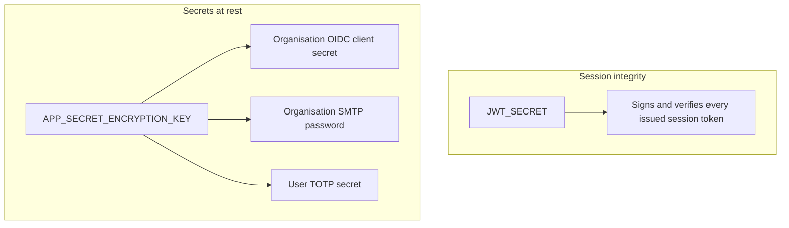

# Encryption and secrets handling

What protects data in transit, what protects it at rest, and — the part worth understanding precisely rather than taking on faith — which secrets the application itself encrypts versus which protection is left to the deployment's own infrastructure.

## Encryption in transit

Browser-to-frontend and client-to-backend traffic is expected to run over TLS in production. The application containers themselves serve plain HTTP internally by design — TLS termination is the deployer's responsibility, handled by a reverse proxy in front of both containers. See [Installation & Deployment → TLS, reverse proxy, and same-origin deployment](../installation-deployment/tls-and-reverse-proxy.md) for how to set that up. Backend-to-identity-provider traffic (OIDC discovery, token exchange) uses whatever scheme the provider's own discovery document specifies — `https` in any real deployment.

## Encryption at rest

Not everything stored gets the same treatment, and the distinction matters:

- **Password hashes** use bcrypt — an adaptive, salted hash, not reversible encryption. There's no "decrypt a password hash" operation; verification only ever checks a submitted password against the stored hash.
- **Genuine secrets** — an organisation's OIDC client secret, its per-organisation SMTP password, and a user's TOTP (2FA) secret — are encrypted at the **application layer**, not left to infrastructure alone. A reusable encrypted column type transparently encrypts these three values before they reach the database and decrypts them on read; only the database itself ever sees ciphertext. A database-only compromise (a stolen backup, a misconfigured replica) doesn't hand over these values in plaintext.
- **Everything else** — requirement and change-request content, file attachments, audit logs — relies on **infrastructure-level encryption at rest**: the database volume's and object storage bucket's own encryption, configured by whoever operates the deployment. This is deliberate, not an oversight: this category needs *access control*, which the application already provides (see [Roles, groups, and access control](../concepts/roles-groups-and-access-control.md)), but doesn't need its own per-column key hierarchy the way a bearer secret does.

## Two keys, two purposes

Two independent secrets sit behind the mechanisms above, and deliberately don't share a key:

`JWT_SECRET` is the sole key protecting every session token's integrity — its compromise is equivalent to a total authentication bypass, since anyone holding it can mint a valid token for any account. `APP_SECRET_ENCRYPTION_KEY` is a separate, independently-rotatable key protecting the three encrypted columns above. Keeping them distinct means either can be rotated on its own schedule without forcing a rotation of the other — rotating `JWT_SECRET` (which invalidates every outstanding session) is a very different operational event from rotating `APP_SECRET_ENCRYPTION_KEY` (which requires re-encrypting stored values), and tying them together would force the more disruptive one every time the other was needed.

## Secret sourcing and fail-fast startup

Every credential the application needs — `JWT_SECRET`, `APP_SECRET_ENCRYPTION_KEY`, the database password, SMTP credentials, object storage credentials, the bootstrap server-admin password — is sourced exclusively from environment variables, never hardcoded. The production Compose stack refuses to start if any required secret is left at its insecure default, which is a real, fail-fast check rather than a documented expectation someone could accidentally skip. See [Installation & Deployment → Configuration reference](../installation-deployment/configuration-reference.md) for the full environment-variable table.

## Where this fits

- [Configuration reference](../installation-deployment/configuration-reference.md) — every secret-bearing environment variable, in one table.
- [SOC 2 compliance posture](./soc-2-compliance-posture.md) — this page's mechanisms are what closes the "plaintext secret storage" gap that policy package used to document as open; that page also states candidly what's still *not* done here (notably: no documented key-rotation process yet).
- [Core Features → Zip export/import](../core-features/zip-export-import.md) — Restricted-classified secrets (SMTP/OIDC credentials, password hashes) are deliberately never included in an export bundle, consistent with the classification above; they're re-entered by hand after a restore.
